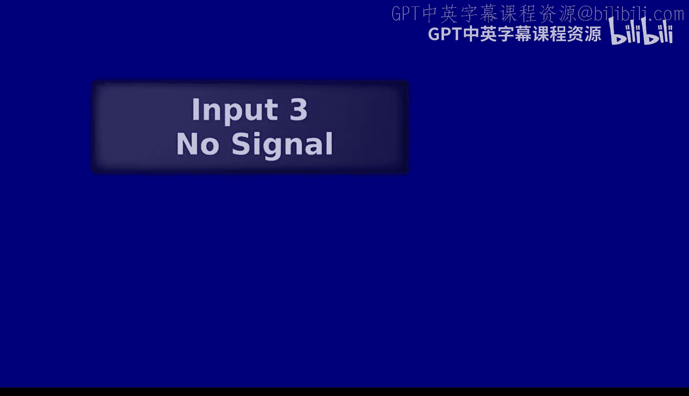
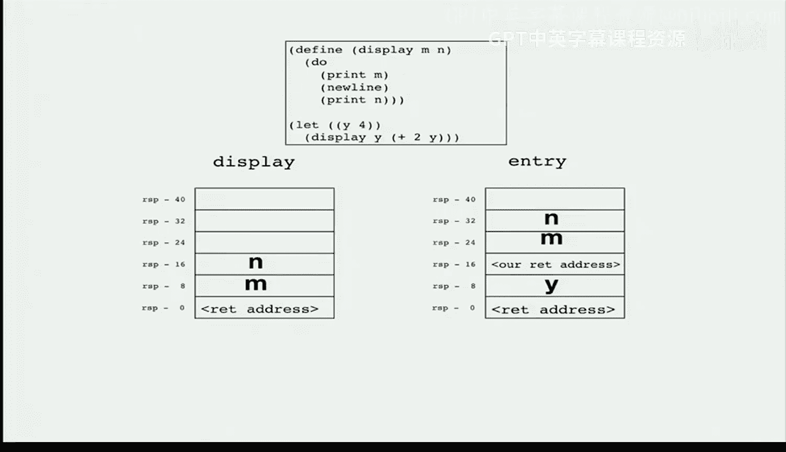
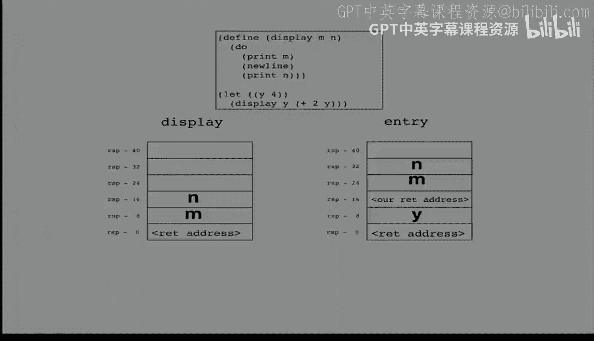
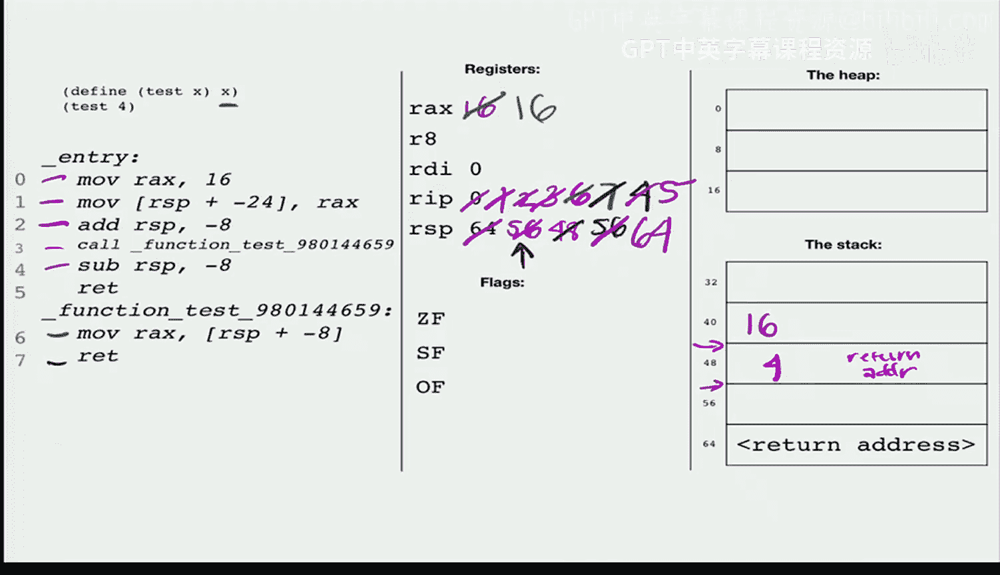

# UCB《编程语言和编译器｜CS 164 Programming Languages and Compilers 2025》中英字幕 p15 -P15-Lec 15 - Functions cont d.zh_en -BV1zQ27BeEfF_p15-

Hi everyone， My name is Jasmine and I'm with the Expimental Social Science Lab at Berkeley or Xlab。

 and I'm here to give a quick announcement about a great opportunity to participate in research on campus while also earning money so the X lab is a research facility in HAas that specializes in experiments related to decision making and behavioral science PhD students and faculty from various departments such as business economics and psychology host their experiments at our lab All UC Bkeley students and staff are eligible to participate in these experiments as soon as you create an account to join our participant pool。

😊，For each experiment you can earn up around $20 an hour on average。

 depending on how long the experiment lasts most experiments are between one to one and a half hours and they're typically computerized experiments that can be done at our lab or remotely Other experiments can just be a quick survey that you can fill out at any time and anywhere you can sign up for however many studies you want whenever you want and you'll get paid on the spot with a check once you're done if you're interested you can find more information on our website at Xlab。

berrkeley。edduu regarding how to create an account and sign up for more studies This is an amazing opportunity not only to earn money but also to be a part of some of the worldclass research that happens here on campus Does anyone have any questions。

😊。

Awesome， so I'm leaving some flyers up here with more information about our social media and website。

 So， yeah， and feel free to email us if you have any other questions。 Thank you。

 and have a great rest of your day。😊，Right。Alright， hello， everybody。

 We get to dive back in today on our functions。 So we are gonna start。 Well。

 I guess does anyone have any questions to start Otherwise。

 I'm going to start with some review of what we went over on our last session。😊，So far so good。

 we'll dive in。Amazing， okay。Let's just remind ourselves of what we were up to。

Previously on our last episode。 So we'll pop over to here。 We've got our compiler up。

 but let's look instead at the interpreter。 I just want to remind ourselves that， you know。

 we did some sort of bookkeeping changes in order to make it work with functions。

 So let's quickly look at those。

So the main thing is that now we can have multiple S expressions coming out because we'll have one S expression for each definition and one for the body of the program。

 That's sort of the main bookkeeping change we made。Other than that。

 we really only made one change to the interpreter itself to sort of interpret X where we do our main body of the work。

 And that is this right here。 And I just want to talk us through what we are doing right here。

 So this is what we do every time we encounter a call to a function。

 We find that there's a call to a function named F。

 And it's got some arguments provided as its inputs。 What are we going do。 Well。

 the first thing we're going to do is we have this list of definitions。Now we always have available。

 and we're going to go in and see if there's one that has that name F。

We're going to call that deafin a very creative name。

And then we're going to figure out if it is actually accepting the right number of arguments when we compare the number of arguments at the call site versus the number of arguments that we see in the definition。

 If those don't match， we are going to go ahead and raise an error。 Otherwise， if those do match。

 we are ready to go。 We are ready to run the body of that function。

 So this is where we're actually running the body of that function。

 And what I now want to call our attention to is these two lines。

 So this is where we are coming up with the value for the symbol table that we are going to provide to actually be available as these are all the names that will be available when we are actually executing the body。

😊，And so this is where we really made a very important design decision because what we said is let's go through and evaluate each of those arguments we know what names are available to us right now。

 we can look at our existing environment and we'll go ahead and interpret each of those arguments in that environment in order to then get our list of values。

And then we'll go ahead and sort of make the mapping between the argument names and the function and the values that we have actually had provided at this call site。

 Once we've paired those off， we will turn that into a brand new symbol table。

 and that will be the symbol table that we provide as we are evaluating the body。

 And so making that symbol table， that symbol table that only has the function arguments inside it。

 We figured out what was the name for that。 So does everyone remember。

What is the name of that choice？Go ahead and discuss with folks nearby for 30 seconds。

 see if you can remember。All right。Ready to shout it out？This one's important yall。

 someone's got to shout it out。Is it that we don't remember which of the two it is。All right。

 another half a minute to discuss。 We've got to get this one。 y'all， We've got to get this one。

All right， so this choice to provide only。The function parameters in the environment that we use when we are interpreting the body。

 What is that choice called。I was also hearing from over here。 I hear two people say lexicalco。

 fantastic work。 Yes， that is lexical scope， which is the kind of scoping that you are used to seeing in probably every single language you have interacted with over the course of your history of programming。

 Maybe some of you interacted with like Emax list at some point。 and that had dynamic scope。

 but probably probably probably if youre thinking of a language， it has lexical scope。

 And so that was the choice we made， we sort of aligned with what is the common choice amongst programming languages today。

 we heard a little bit about the history there。 and the fact that early on people thought maybe dynamic scope was gonna be more natural and dynamic scope was just if we had sort of taken this existing environment that we got as our input the environment that we see at the call site。

 And if we had then extended that with these items that we have inside FM。

 if we had extended the existing call site environment with the names that are now available inside the function body。

 that would have been dynamic scope。 And originally people thought maybe that was gonna be good for people turns out programmers。

😊，Really bad at reasoning about that， because you might call it over here where you have mapped X to A。

 and you've got it over here where you've mapped X to B。 And then you call it over here。

 and you didn't define X previously。 and come into all these problems with programmers trying to track all of this really messy interactions between the call site and the place that we're actually jumping to。

 And so people figured out that that was very confusing。

 And they stopped doing dynamic scope for the most part。

Are there questions about lexical versus dynamic scope？Okay。

 if at any point you end up feeling confused about lexical versus dynamic scope。

 just remember this exact portion of this exact line， right if you're ever like， oh。

 I don't know what it's going to be the choice that we made was lexical scope。

 if instead of doing what we did if we instead started with the environment that was available at the call site and we extended that with the arguments that should be available inside the function body that would have been dynamic scope。

 So anytime you get confused， just think back to that one choice。

 that will tell you which situation we're in。So far， so good。Amazing， okay， so。

We then started the process of doing sort of the equivalent thing in compiler land。 so we went ahead。

 we did the thing where we said I'm going to go ahead and get both the definitions in the body。

 I'm sort of going to split those into the two things。

 the thing that previously we' calling on the program as a whole now we are just calling on the body of the program and then we had our usual return that appears at the end of that and then we said。

 okay， let's pretend that we have something called compile Din and we're going to call that on each of our definitions and we're going to put those all in at the end of our assembly。

That's the thing that we're going to do right there。And so we had started to work on that。

 but we didn't get very far， right？ So in particular。

 all we had figured out so far was it looks like we're going to need a label for each of these definitions。

That's as far as we had made it there。Now， of course。

 we are also going to have to do some other things and in particular。

 the thing I want to draw our attention to is the fact that we have to have these two sort of different views of the world。

 depending on whether we are at the call site or the definition。Right。

 so when we were doing the interpreter， we went ahead and we just said， okay。

 every time I encounter a call site， I'm now going grab the body of that function。

 and I'm going go ahead and。Interpret that。 And that worked well in the interpreter。 right。

 We could go ahead and have the process of calling Fibonacci on 4 And inside the body of that。

 we find， oh， okay， we're now gonna have to call Fibonacci on some other number。

 And we go keep going down like the。 That would be totally fine in the interpreter land because eventually we reach our base case。

 And we say， all right， we're done with those recursive calls to interpret X。On the other hand。

 in compiler land， that's not going to work for us。

 like the equivalent strategy where every time we see a call site。

 we go ahead and we generate the instructions for running the body and we sub those in at the spot where we currently are in the instructions。

 we can't do that because if we have our recursive call， then okay， we put in the body for Fibonacci。

 But during building up the set of assembly instructions that we're going to use to implement Fibonacci。

 we encounter another call to Fibonacci。 So now we recurs again。

 we're gonna have to generate the instructions for Fibonacci。 then we keep going and going and going。

 we get an infinitely long program， that's not going to work for us。

 And the strategy that we figured it out to help us deal with this was to have one thing right instead of doing the interpreter thing of making a change in one place。

 making a change that lets us handle function calls。 we're now going to have two changes。

 We're going to have one place where we generate code that can be called and one place where we generate code that does the calling。

Right， and we were calling those the definition， right， That's the thing that actually says， okay。

 you can jump to me。 You can call me。 I've got a label。 and then we're gonna have the call site。

 That's the thing that is going to admit a call instruction。

Any questions about this overall strategy？Is this related to Y in Oca。

 you have to define the function to be you have to explicitly label that you want it to be recursive。

嗯。When you say this， what do you mean is this related to。don。

sive isn't just like tastinging those lines？I got you。So this question is。

 if we don't label a function as recursive， is that going to affect how we end up compiling it。

 For example， because we could just take the body and insert it in line。

 So that would be an awesome optimization。 And in fact。

 we are eventually gonna reason about even how we might do basically that optimization for our own programs。

 even knowing that sometimes our programs will have recursive functions。 So， yes。

 that is a good way of communicating to the compiler that would be safe to do that optimization for a function that we know is not gonna be called recursively。

😊，Yeah， great question。Other questions were feeling good。Cool， okay。

And so one of the things that we were sort of starting to wrestle with。

 starting to think about is that， hey。There's actually only one stack。Right。

 we know that even though we are thinking of it as though entry is seeing one stack and display this function that we have defined as seeing another stack。

 actually， there's only one stack。RightAnd so we've talked about the fact that， okay。

 this is the stack frame that display is going to get coming in， right。

 We are going to expect that the call site is in charge of making sure that M and N are in the slots where we are expecting them to be。

 But now the thing that we've started to have to think about is that there is something that is going to set that up And that is the spot where we see the call site。

 So right down here where we've got what values do we have coming in。 we've got four oops。

 let me do that right where we have it。 We've got four coming in。 We've got6 coming in。

 And so we'll put right here run time。ReP of four。Run time。Reap of 6。

 That's how we're actually going to fill it out。 And the reason this is going to work is that this is just this。

 right， We're going to be able to sort of think ahead as we are actually compiling our call site to what the stack is going to look like when we are inside the body of the function。

 And so we are making this agreement with ourselves。

 We are promising ourselves that it is safe for us to。Basically， compile the definition of display。

 compile the body of display， assuming that these are going to be put in there。

And then down the line， it is sort of the call site when we see the call site that we are going to be responsible for actually making sure that that's the way the stack looks when we do pass control。

Are there questions about that or are feeling pretty comfortable with the fact that， hey。

 there there's only actually one stack。 And so all we're doing is making sure that when we actually admit that call instruction。

That when we actually execute the call instruction， the thing getting called is going to see this。

Fels okay。So why I want you to actually take about half a minute to talk with folks nearby。

 Why are we doing this， rather than say， doing some kind of analysis here。

And then just subbbing in the values 4 and 6， right。

 is just specializing the body of the function for 4 and 6。 Why are we not just doing that。

 Go ahead and discuss with folks nearby。Alright， what do we think。

 Why do we not just make a version of the body that knows that this is going to be 4。

 and this is going to be 6。Maybe I'll give us a little。Example that might help us think about this。

Go ahead and keep chatting。Assume that all of this is now one body of the program。All right。

 what do we think？Why are we not just making that specialized。Version of the。

 the function body that specializes for。Four and6。There's one obvious answer， right。

 Maybe we're actually reading in these arguments at the call site， right if we have that read numb。

Then okay， we had better make sure that we are ready to accept whatever input there。 But say。

 in fact， we have read them inside a loop or something， right。

 We could just keep going and keep going and keep going。

 having all these different versions that we would then need to specialize。

 That's really not what we're trying to do， right， where the reason we've adopted this sort of call structure is so that we don't have to keep trying to duplicate and duplicate and duplicate。

 right， How are we gonna handle a recursion。 How are we gonna handle all of this。

And so we really do need to rely on that call site to set things up for us。

RightWe are going to go ahead and enter compiling the definition。

 assuming that things will be set up in a particular way。

 even though we are not in charge of filling up the stack that way。

 So that's the main thing that's a little bit wacky about what we're doing right now with having sort of the caller and the callee and having to do different things there that are going to align nicely。

So， okay。's are there questions about that before we dive back into actually doing the compilation？

Is it。不好意。这个边的话有。Is there a reason can you say that a little louder？The delegate get more in the。

Yeah。Deition。Is there a reason that what is that a lower act？

The there point it's at a lower stack address and I'll just see in that。Yeah。

 so I guess maybe this is a question about the fact that these numbers are increasing。 But remember。

 we're subtracting these。 And so this actually is at a higher stack hours at， at a。

Higher stack offset。 and therefore a lower stack address compared to this， right。

 We are building upwards in the computer's memory， right。

 If you think of counting from 0 all the way down to the highest address in the memory。

 we are going from the bottom towards the top。 Is that the question like pancakes。

Should all you be embarrassed。真。Are you， are we talking about entry versus display。

 The fact that the display stack frame is on top of the entry stack frame。 Yeah。

 so remember that these are the high addresses and these are the low addresses。

 And so we're building from sort of， again， the bottom of that memory。

 the high numbers to the low numbers， right， so high。Numbers， low numbers。Again。

 like the sack of pancakes， start from the bottom， move towards the top。Does that make sense。

It is' that point it。Like why。Display。At the lower edge point。So traditionally。

 we have the heap growing downwards， right， The heap starts at the sort of lowest number in our our addresses in our computer and it grows downwards。

 and the stack grows from the bottom towards the top to meet it。 right now， obviously。

 we know that the way we're using memory in our computers is very more。

 much more complicated than that because we actually have multiple programs running。

 and the program text itself actually is sitting somewhere， right。

 Those instructions are somewhere in memory。 So that we know that we are not actually going from heap going all the way towards the middle stack going all the way towards the middle until they meet。

 But that is sort of the historical。 like that's sort of how we started running programs at the beginning was the heap is growing down。

 The stack is growing up and eventually they meet and that's when we run out。And so basically。

 this is for historical reasons。 Does that make sense， yeah。Other questions。Okay， cool。So。

 let's take a look。At our compiler。And let's finish going through the process of producing the assembly for a given definition。

 a given function body。 And again， it's going to be weird because we're going allow the body to refer to positions in the stack where we haven't placed values。

 right， We are going to say， all right， I'm expecting M to be here and and to be here。

 even though we won't have put anything in those slots。

And that's because we're going rely on the call side to do it for us。 But let's move towards that。

 So here's one thing that we definitely are going to want。

 We know we're gonna to want a return at the end， right， that feels good。

 We definitely want to have our label starting us off our return at the end。

 And then probably in the middle， we're going want to actually call compile X。 Sorry。

 compile X on something。 Now， what is that something going to be。 Well。

 let's ignore sort of these middle things for a moment。 And let's just call it on defafend dot body。

Because I think that's what we're gonna to want， right， We're getting this definition in。

 We know that it stores the body， in addition to the name and the arguments。

 So let's go ahead and have that be the thing that we compile。Now。

 what do we know about what to provide as our arguments。

 So let's take a look again at what arguments compile X actually takes。

 So it takes the list of definitions that should be available inside that expression。

 It takes a symbol table。And it takes a stack index。

 So an offset from RSP that it is allowed to mess around with。So， okay。

 let's go in and make our decisions about what we want there。

 So I think this first one is the easiest， right， We know that we should be given access to all of our definitions everywhere。

 right， All of our functions are allowed to call all the other functions and themselves。

 So let's go ahead and just provide that exact same list of definitions。 That feels good。😊。

And now we have to start getting a little wacky again。 But fortunately。

 we just talked about this in interpreter land， right， So in interpreter land we were like， okay。

 well， what is the environment that is available to us， This is the environment。

 It's just those arguments。 right， So let's just do the equivalent thing for here。

 So let's go ahead and get access to all of those。 So。And remember。

 we don't know what the values will be yet。 We just have to map from the names to the offset where we know they will eventually be put。

 So let's go ahead and do let F tab。That's just F table， function table。It will be Din do As。

 Let's pipe that into list do map I。 If you remember， we introduced map I， I think end of last week。

 Fun I A。What do we want to do？We're going to have the argument coming in。

 We want to pair it with the appropriate offset in the stack。Right。

 knowing that the stack base is going to be right at that return address。

 the return address associated with returning control to， for example， entry。

 So let's go ahead and do negative 8。Times。I plus1， Y I plus 1。

 So let's think about this for just a moment， right。

 We know that we're going have the return address at that zeroeth slot。

Which means we need that first argument at the one slot， the second argument at the second slot。

Right。Hopefully that feels okay。 We know we've got to jump over that return address。

 Then at that point， we're just going to sort of count upwards。So okay， we've gone ahead。

 We've got that function available。 Let's pop out of there。 What are we going to do with it。

 Let's turn it into a symbol table。Of list。Great， that is now a symbol table。

 Let's use our symbol table right here。Deft top。What did I get wrong with？Our syntax here。Oh， sorry。

 pipe， pipe， pipe， that's what I got wrong。 Great， Okay， so now we've got our symbol table。

 our function table， we are providing that as the second argument to compile X that leaves one that we need to fill in here。

So the next thing we need to decide。 if you remember how we're actually using stack index。

 we always use stack index to refer to the next available offset from RP that we are allowed to use right so way back when we were doing addition。

 we were like， okay， I've already used this for an intermediate value。

 So my recursive call is going to go ahead and subtract8 to make sure I don't overwrite that。

 So what I want you to decide right now with folks nearby is how should we fill this in order that this refers to the next available value。

 Sorry， the next available slot on the stack。From the perspective of our function body。

Go ahead and discuss for a minute。Here's how we're going to start。

 we're going to multiply something by negative8。Alright。

 so hopefully we all came up with the answer that our next available slot。

 we're gonna to go ahead and start with the number of arguments that this function is going to take。

 right Like it's really important that we don't overwrite whatevers in here。

 whatever we have in there。 We don't want to overwrite where we are expecting that the call site is going to store those arguments。

 So we're gonna have to go ahead and take into account the length of our arguments list。

 We're going to have to add one more buffer because remember we have the return address there。

 So in this example， this means that we are going to count up。 I'm going to change the color here。

 We're going count up one to three slots and the next available slot should be this one。

So that's just going to be the length of the arguments list plus one。

Any confusions or we're feeling okay？More or less natural。Alright， so let's go ahead and put that in。

 And then we will have finished actually compiling our definitions， which is great。

 So list dot length。😊，We're going to apply that to Din do orgs。

 And then we're going to go ahead and add one to that because remember。

 we got to make sure that that's pointing not to the last view slot， but to the next available slot。

 We've got to jump over all of the return address。All of the arguments that we have made available at the sort of lower section of the stack。

 And then the next thing that the body of the function will be allowed to use will be allowed to overwrite is everything above that。

So far so good， or do we have questions about how we have compiled definitions？

Contemplate it for a few seconds， see if we've got any questions。Yeah。

This is just for a single definition， great question。 Yes。

 so this is accepting as input the list of definitions just so that we can make those available inside the body of the definition。

 but this is the one that we are actually implementing。 Yes。

 and so if we take a look at how this is being used。

 we are calling compiled defin on each of the definitions in our list。 Yeah。

 so at the end of sort of the thing that we're doing in order to create the assembly for the program body right the thing that is now appearing down at the bottom of the program。

 after we do that， we issue our RE instruction， right that's the one that returns control to the C runtime。

 And then after that， we go ahead and we have all of these definitions listed down below with their appropriate labels。

😊，So far， so good。Right， cool。 In that case， I would say we are ready to actually create our call sites。

 So I think we're going to be able to borrow a lot from our interpreter in some ways。

 So let's go ahead and just copy that over to start。😊，Pop into our compiler。

Let's go ahead and put it at that same spot。Okay， obviously。

 we're not actually going to be able to call the interpreter itself。

 So that's going to be one thing we're not going to get to take advantage of。

 But I think we do still want to go ahead and check if this definition is in our list of definitions。

 we're still going to want to go ahead and actually get all the data associated with that definition。

 And I think we're still want to going to want to check if the length of the arguments that we actually see at the call site matches with the length of the arguments we're expecting based on knowing the definition that we're actually going be using after that all of this stuff isn't going to be as relevant to us。

 So let's just leave that as empty for now， and I think this is actually called program and this ones let's place that with program。

 Okay so this has now told us something about errors that we might raise when we are executing a call。

 So I want you to now ask yourselves and the people near you whether when we have a call to a function that doesn't exist。

 I that going to be a compile time。Or a runtime error。 I want you to discuss for about half a minute。

O。Hum， if you think this is going to be if the if calling a function that doesn't exist。

 iss that going to be a compile time error， hum for compile time error。Hum for runtime error。

I totally agree， right， It is compiled on M L or compiler that is actually checking if that function is one of our。

 our functions。 So now I want you to discuss with folks nearby。

 if we have called a function with the wrong number of arguments， we're going get an error for that。

 Is that a compile time error or a runtime error。It's okay to be loud。 You don't have to whisper。

All right。Humfor， we think that is going to be a compile time error。Hmfor。

 we think that is going to be a runtime error。Yeah， I totally agree。 This is a compile time error。

 We can see that again， it is the Ocal code itself that is making this check。 it's saying， okay。

 I know how many arguments I'm seeing right here， this call site， right， As。

 I know how many I'm seeing， and I know how many I'm expecting to have associated with this kind of definition。

 this particular kind of function。 F。 I can check if those links are the same。😊。

So that's all happening in compile time。Okay， and so now we are ready to o a call instruction， right。

 That's the next sort of thing we're moving towards。 We've gotten some practice with this already。

 And so I'm gonna go ahead and paste in what we have seen before， right。

 We have previously done these shenanigans in order to actually do a call。

 So let's just paste that in。 And let's decide which of these things we need to keep in which we can get rid of。

 So first， I'm pretty sure we don't want to actually use print value， right。

 The whole point is that we're trying to call one of many functions。

 But we do have this nice thing that we have introduced that tells us based on a specific function name how we can get the appropriate label for it。

 So let's go ahead and use thatin label defend name。😊，That's what we actually had as our。

 our way of generating labels。 remember， we were not able to use Gensim for this because it was important that wed be able to deterministically make an appropriate name for the function in a way that was repeatable。

 it has to be exactly the same every time because remember that we are using defin label here in order to issue this call。

 but also way back down here when we actually made that。That actual function body that we can call。

 that we can jump to。 We have to do the exact same thing。It's okay。

That's what we've got in place so far。 we are actually doing the call to the right thing。So now。

 which of these other things do we want to change， So we had our print value thing always returning true。

 I think we don't want that。 That seems pretty clear to me。

But which of these other things do we need， right？ So the first thing that we did when we were doing our call to that C function print value was we said。

 okay， I'm going go ahead and take whatever we currently have in RDI right， or register RDI。

 And I'm going to save that somewhere on the stack。 So I want you to discuss with folks nearby。

 do we need to do that when we are calling our own function that we have compiled。Please discuss。

As a reminder， RDI is where we are saving our pointer to the next available slot in the heap。

All right， So hum， if you think we need to go ahead and protect R D I by saving off the value that we have in there into the stack before we pass control to our function。

 hum， if you think yes， we should save that。Hum， if you think no， we don't need to。Okay。

 we're feeling pretty uncertain about this。 So I'm going go ahead and remind us why we did that。

 So back when we were passing off control to something like print value or one of our other C functions。

We knew that we were not in charge of the assembly that was going to run next， right？

 It could do all kinds of wacky things with register RdiI。

 because we weren't actually in charge of what that assembly was。 right， In fact。

 we knew we can see right here。 we had gone ahead and done the thing where we were about to overwrite RdiI with the value that we wanted to use as the first argument because。

 in fact， that is how C chooses to use RdiI。 It is choosing to use it to store the first argument And so C might do all kinds of wacky things to whatever we have in RDI。

 In contrast， this time。 we are passing control to a function that we have compiled into assembly。

 and we know that our compiler does not mess around with RdiI。

 RdiI is always expected to be the pointer to the next spot in the heap。 And so， in fact。

 it is very important for the function body that it knows that what it has an RdiI is going to be。

The pointer to the next available slot on the heap。And so let's go ahead and get rid of both this。

 which was basically going ahead and doing something to communicate with C and this line above it。

 which is actually just sort of protecting that value。Okay。And then we also， of course。

 do not have to， to do the work of restoring RDI after。 In fact。

 if we had saved the value that we have an R DI onto the stack and then tried to restore it。

 we could get ourselves into trouble。 because， in fact。

 the function body might end up saving something on the heap。

 maybe actually returning that as the return value。

 And then it would be very important that we not clobber that by overriding it ourselves。

 So let's get rid of this as well。Okay， and now this is starting to look pretty close to what we want right so this is saying I know that I'm going to need to actually update RP in order to not overwrite the things that are associated with my stack frame。

We are not going to allow this next function to mess around with what we have in our stack frame。

 and that's why we actually update RP。And so now I'm gonna go ahead and introduce something that's gonna be a little convenient for us in how we actually mess around with this value that we have in RP。

 So let's just give ourselves a new thing that we are gonna call stack base。 So let's stack。

Base equal align stack index。 We will call that on stack index。

Plus 8 and here I want to remind us why we do plus8。

 this is because we know that the call instruction is always going to update by negative8 right so we're going to want to go ahead。

 remember that we are using SAC indexex to refer to the next available slot。

If we had gone ahead and used stack index alone here without the plus 8。

 then when we actually did that subtract by 8 when we're。

 we're actually using the the call instruction， that would mean we're leaving extra buffer。

 We don't want to do that。 So we go ahead and we do plus 8 instead。

 This weight is pointing to sort of the last used slot instead of the next available slot。It's okay。

Let's go ahead and do。Our add according to that， so let's do immediate。Stack base。 So this will。

 nope， stack base。 So this will actually be the bottom of the stack as the stack appears to the function we're calling。

And now we've got to figure out。The thing that we talked about before when we were compiling definitions。

 we said， okay， we made a promise to ourselves。 We are going to go ahead and get the values associated with the arguments into particular slots on the stack。

That is a promise that we made to ourselves。 So let's go ahead and start working on this。

 It's going get a little bit hairy， but we will take it piece by piece。So first。

 let's actually figure out what those things will be。 So compiled as equals。 Okay。

 we're gonna have to go ahead and do this repeatedly for each of our arguments。 Great， That's fine。

 Let's go ahead and pipe that into list map。 I again， same function that we met recently。

And what do we want to do with each of these arguments well？

I think we're going want to go ahead and actually compile whatever is associated with the value。

 right， So we're at a call site now。 So this isn't just a name that is sitting here。

 Well it might be。 it might be the name of some let bound value。

 But this is going to be potentially a whole subexpress that we are now going to have to actually evaluate in order to then pass that value to the function body。

 So let's go ahead and do that work。 So compile X。 we're going to want to call that。

With our normal set of definitions available， we're going want to call it with our current existing symbol table。

 right， It has access to all the things that we have access to right now。

 And then we're gonna want to go ahead and do。Some kind of stack index， What kind of stack index。

 right， This is where we've got our stack index， This is the spot that we're gonna have to fill。

 I'm going leave that blank for a moment。 This is going to be a little bit wacky。

 And then we're going want to go ahead and call that on the particular argument that we are considering right now。

 right， A。We are going to probably want to use I somewhere in there。 But okay。

 that's a question for later。Great， the next thing we're going on do is to actually add that together with。

Let's do our little concatenation there， whatever we get back from doing that compile X。

 we're going to then want to do some kind of a move to put this at the right spot on the stack such that the function body is going to be able to access it。

So okay， what do we want that to look like？ Well， we know that the thing we're trying to actually move in is going to be R X。

 But where， in fact， do we want to put it on the stack， right？ That's gonna to be kind of complex。

 So I'm gonna leave our little blank in there。 and then I'm gonna put in。

RX is the thing that we actually want to copy in。So this is what we're working with。

 I'm going to show us a version of this on the slide。

 and I'm going to want you to basically reason through what we should put in each of those blanks that I have left。

So we have blank A and blank B here。 right， Here's B。 Here's a。

 I've labeled them A and B in this way， because I think you're going benefit from thinking about A first before you think about B。

 I think it will be helpful if you think about， okay。

 where do I eventually want it to be on the stack， right？ So remember， when we are doing this， right。

 We're compiling the call site。 So this is the the view of the stack that we have available at the call site。

 right， We think that the base of it is going to be right there。

And we want to make sure that when we do this work， right， the way that we fill in B。

 the way that we fill in A is going to produce the result that N and M are at those slots right there。

So now I want you to go ahead and turn to folks nearby。

 we're going give this a solid two minutes because I really want you to come up with what expressions should we put inside A and B。

Try to even write them down in your NoteApp or whatever。Also， for some reason。

 people get really confused about stack based。 Stab is really just this like value that we introduce for convenience because we know that that is going to be。

That spot， right， so it's just that spot。Just for convenience。

I encourage you to actually write down the expression， write it down for A first。

IProm this is the last hard thing about implementing functions for us。

Hopefully these are helped a little hints， hopefully。All right。

So if we take a look at the situation when we process our argument M。I is going to be 0。

 but we know that we've got to go up two slots from where our stack base is。Right。In contrast。

 when we are starting with n， we're going to have I right be the value1。

 and we know we're going to want to end up at， let me pick a new color。At three slots up。

 and that's where we're going to want to write it。So I hope that it's not too surprising that what we're going go ahead and choose to put in here is。

Stack。Base。Minus， let's put in our pars， make sure we're all on the same page。I plus 2。Times 8。

Are there any questions about that or we see how this is upholding the promise that we made to ourselves about where we were going to put values when we pass off control to our function body？

This is a great time for question。Okay， great。 Now that we know that that's what we're slotting into A。

 I want you to go ahead and think about B for another 30 seconds， and then we'll take our break。

If you think about what B is doing， this is just deciding what parts of the stack are we allowed to use in order to calculate the value that we are going to put into that slot。

It's a little bit of a mind vendor， isn't it， I'm gonna cut us a little short。

 because this isn't sort of super deep or super important for us。

 except that we have to make sure bless you。 We have to make sure that we don't overwrite things that we need。

 And so if we think about the order in which we are doing this we are going ahead and starting with filling in the value for M and then working to the value for N。

 if we had a third argument， we would then do the value for that next argument。

 And so we can go ahead and write in M right here And then we can use everything above that in order to calculate N without overr M So it's totally fine for us to actually reuse this exact same expression in B。

 the same place that we are eventually going to write N is the same sort of next stack address that is available to us as we are calculating N。

 we can use everything from that sort of n slot and above without overr M。 nothing too deep there。

 But if we think about the fact that okay， we're starting from that first argument。

 we're moving towards that last argument， this is a safe way for us to go。

Everyone feeling pretty comfy with that idea。Alright， let's see it run real quick。

 and then we'll have our break。 So I filled in。That same exact expression that we talked about。

 I filled it in in both spots。 right Here it is when we're actually deciding what part of the stack is available to us to use in order to actually figure out what the argument is。

 right， What is the value associated with that argument。

 And here is that same exact expression when we are deciding where we want to put that value on the stack in order to communicate appropriately with the function body。

 So let's just real quick run。This compiler。呃。啊。Let's open the compiler， and let's run。Yeah。

 let's run our even an odd function。 Let's put in 3。 Okay， great，3 is not even That is good。

 What about 4。For is even fantastic。 So we have now implemented functions in both of our language implementations。

 We have it our interpreter。 We have it in our compiler。 It runs。

 We have successfully made the call site， and the call， the function bodies themselves communicate。😊。

All right， now is a good time for a three minute break， No， five minute break。

 I will see you again at oh， it got late at 444。And if you want to stretch your legs。

 I'm going to have a student an activity soon so you could come grab a little worksheet。

 That would be a good stretching your legs moment。I hope it works out well， I mean， he's amazing。

It's such a cool project。like。I hope it works out， great。 I think， yeah， I really like his work。

So he started as faculty， I think this。We， which incidentally working with a new pro。

 it's like a really good idea because they have a ton of new time like they have more sort of cycles available to spend with you compared to say someone one more senior who has a bunch of students already。

And so。You know， we had talked a little bit about the kind of work that he was doing。

 he's not normally like 10 cent time in programming language style work。

 but he's always had that influence in his research。

 and so it just seemed like a really good fit to bring in someone who's been doing really long compilers。

To be like。I really had。Right here。Yes。I hope it's fun， Thank you so much， I was admire your sweater。

Mmhm。Does anyone want to see anything on the screen while we're having our little break？

Anything that we want to sort of。Inspect。Absolutely， so over here what we did was。

The body we compile it starting at the stack index of negative a or the negative bit offset， right。

 Yeah Well the the。I want to like be super clear about what we're saying， right。

 we are saying that in the the call to compile X that we're going to use to compile the body of the program。

 the stack index that we make available to。That compile exp call compile exp。So it does like。

Rs like affect RB。 Like， how can you show that like。So from here to here， when do we like。

 kind of change RSB to make sure that the directors。

They call it because of compile death in over here also uses like compile X。With。

 So where does in between。The call of compile X here and down here。

 when does RSP change so that we don't use the same stack。

 I think this is a question about the call instruction。

 So do you remember when we were talking about， So this is exactly one of the things we're about to play with with this if you remember what the call instruction does。

 It adjusts it by negative8， which is why we were reasoning about how we wanted to adjust it。

 So right here we say to ourselves okay I'm going to go ahead and put RP inside RP I'm going put the value of stack base right I'm going change what is inside RP And then the call instruction。

 what it is going to do is update RP to be another8 beyond right in the appropriate return address at what it sees as RP minus0 right and then that next version that next like span above that RP value。

 that is going to be the stack as viewed from the thing being called in this case。

That's why you have like an extra plus eight， so the minus8 the call kind of counts that exactly exactly。

Allright， I'm gonna to have us come back together right before we。Start on our activities。

 I want to go ahead and sort of return to something that we talked about when we were using the compiler last session。

 So we talked about the fact that when we ran， I think we were using Fibonacci。

When we ran the interpreter on this program。And we passed in a bigish argument， like 40。

We could wait and we could wait。And it was going do some stuff。

And we were not going to be able to wait long enough to actually get an answer out。And now。

 now we have a compiler。 And so if we go ahead and do。Compile。And run。

 and we pass in that exact same program。And that exact same argument。Hey， we got it。so all this time。

 we talk about how much faster our compiler was going to be able to be compared to our interpreter。

 and now we can see it at long last。Pretty exciting stuff for us。 So okay。

I am now going to have us turn to the lovely worksheet。 y'all have picked up。 Let's start with。

The side that has the shorter program on it。 So you will see it looks like this。

And I'm gonna ask you to go through and actually physically write on this worksheet。

 commit to what you think is going to happen as we run through this assembly。

 I know it's so tempting。 It's almost the end of the day。

 It's so tempting to just be like oh I'm just gonna wait until you know since Sarah's driving it up at the front of the classroom。

 I totally get it。 but I promise I promise I promise you'll learn more by driving it yourself by not just sort of passively waiting by committing to what answer you think is gonna happen。

 This is great practice for what you're gonna to be doing on the exam tracing through assembly。

 So you are going to benefit from doing this practice Please， please， please do it。😊。

Even though it's tempting to just sin wait。三。Remember that the things the call instruction does are update RP by8 bytes。

Then put in the appropriate return address right so the address to which control should return once whatever we have called actually executes their return instruction right which is to say the instruction pointer right the value the instruction would pointer would have the line after the call instruction。

 And then finally， the thing it does is update the instruction pointer to actually point to the first line that will get run in the thing being called。

 Those are the three things that call is gonna do。All right。

 I'm going to go ahead and go through it because I want us to have a little time to do the exercise that's on the back of this sheet。

So let's go ahead and。We'll run through pretty slowly， but。

Quick enough that we have a little time for the other one。So first things first。

 now we no longer have the sort of magical starting of the beginning thing。

 We now know what's the next thing we need to run by looking at what's in the instruction pointer right And right now the instruction pointer is telling us zero right So remember。

 these are just made up。 like we would actually have real memory address but for convenience we are using these to keep track of what's there。

 And so normally would be a huge problem if we thought that that was both the memory address of that first instruction and the memory address where the heap starts this is basically just for convenience。

 that zero through one through whatever those are not the real memory addresses。But okay。

 this0 is corresponding to this0。 And so we know the first thing we want to do is move the value 16 inside R E X。

 our runtime representation of 4。 F。 We can do that。 Let me erase our。😊。

Random stuff that we've got on there。 Great。 we have now moved 16 into there。

 and the other thing we want to do is update RIP to point to the next instruction， which is to say。

 oops， sorry， one。Great， we have now done that move instruction so far， so good。Next up。

 we are ready to say， okay， what I have inside R E X。

 I actually want to go ahead and put it somewhere on the stack。

 So I think probably everyone now knows why we are putting it at that spot on the stack。

 Does anyone want to shout it out while I start doing it。😊，Not so much。

So this is because of exactly what we just figured out when we were doing our compilation of call sites。

 we said， okay， we have to go ahead and get the value associated with each argument and put it in the appropriate slot on the stack such that when we update RP when we go ahead and set up the stack frame for that next function。

 it is going have that argument at the spot where it is expecting it to be。 And so this。

 if we sort of go through all those calculations as in fact， the compiler has done for us。

 we know it's going to be at that particular spot。 So fantastic we are now ready to do instruction number two instruction number two。

 So let's go ahead and cross out what we currently have an RSP because we are now updating the stack base based on knowing that we are going make a call。

 So let's go ahead and replace that with 56 so the stack base is now pointing right there。😊，Great。

 we've gone ahead。 We've done that。 Let's cross out the instruction pointer and point it to three。

 Now we are ready to do our call。 And this one's sort of a big deal。 So I'm going to change colors。😊。

So remember， we've got three things that happen when we do our call thing number one。

 we update RP by 8， so let's go ahead and put 48 right there。

 and now RP minus0 is pointing to that slot that I've highlighted with the pink arrow。Fantastic。

 the next thing we're going to do is put the instruction of sorry。

 the address of the next instruction inside the spot pointed to by RSP。 So previously。

 we have written this like this。😊，Now we are going to stop doing that in cases where we actually know the value。

 right， we're not doing that anymore。 We're going to put the actual return address in there because we know right the return address is the address associated with this instruction that is the instruction that is going to run after we run our return for whatever the thing is that we call and so let's go ahead and put in that address for right here。

 and I'll just indicate that this is our return address。That's why4 is there。So fantastic。

 we've got that in there and now the next thing we're going to do is update our instruction pointer to say that what we want to run next is the first instruction of the thing we are calling since we are calling this function test the long line of numbers then the first instruction there is going to be this instruction that we see at6 Now interestingly you will notice that we don't actually have instruction addresses for our labels that's because when we run the asmbler right we're running our asler on our assembly instructions。

 all of those labels actually get stripped out and it just becomes addresses so we're actually just jumping to addresses。

Okay。I know that was really confusing that we just went through all three things that call did。

 So do we have questions about our status so far or does this line up with what we had written down。

Great time for questions。Okay， cool。 Look like we're on the same page。

 It's okay if questions come up later。For now， let's swap into a new color because we're inside the function body。

 So okay， now we are ready to do instruction number6 here。

 Let's go ahead and move whatever we have at RP-8。 let's move that into RX。 Well。

 what do we have at RSP minus-8。 remember that RP is now this right it is now 48。

 So if we look at what that is-8。 It's this value。 right That's what we've got right there。

 So let's go ahead and cross out 16 and put in 16。 So great。

 we now have the value associated with X inside R X which is what we want。

 So let's cross out that instruction instruction address that we've got in there and put in the next instruction address because we have now run that。

 oops， sorry， I forgot to mark out that we had already done our call。😊，Okay， great。

 We have now done that instruction associated with moving the value associated with X into RaX。

 We're now ready to do our return。 Again， I'm gonna change colors because return is one of our special ones。

 Let's do blue this time。 So what's gonna happen when we do return。 Well。

 the first thing that's going happen is we're going go ahead and set RP back to where we found it before the call。

 right， So we go right back to 56。 And that's because that's what we had previously before the call。

 Great， And then we go ahead and we change the instruction pointer。

 and we change it based on what we've got right there at our our new stack base。

 right So we've just gone ahead and changed it to be pointing to this。 what do we have in there。

 Well， it's that That's what we've got available。 So fantastic。 Let's go ahead and put in。😊。

4 because that's what we had written down inside the stack。 Great。 We've now done our return。

 Let's switch back to our purple color because we are now just back to our normal instructions that we're already used to。

 We'll go ahead and do this instruction number 4 that we've got right there。

 We're gonna subtract negative we're gonna subtract 8 from RP。

 which is to say we're gonna put it back to 64。 Why are we putting it back to 64。 Well。

 it's because all of our code is expecting that the the stack base is going to be right here。

 that's how we have sort of stored everything and our symbol table。

 We know all of our offsets based on that being the base。

 And so we have to set it right back to where we are having it before。😊，Fantastic， we've done that。

 We can go ahead and。Have the next instruction be instruction 5。 and we are done right on time。

 We didn't quite get time for our next one。 But if you have questions about this one。

 please do feel free to come up and chat。 I know this is sort of a lot of state to keep in mind。

So feel free to ask any questions。And I will see you next week。

