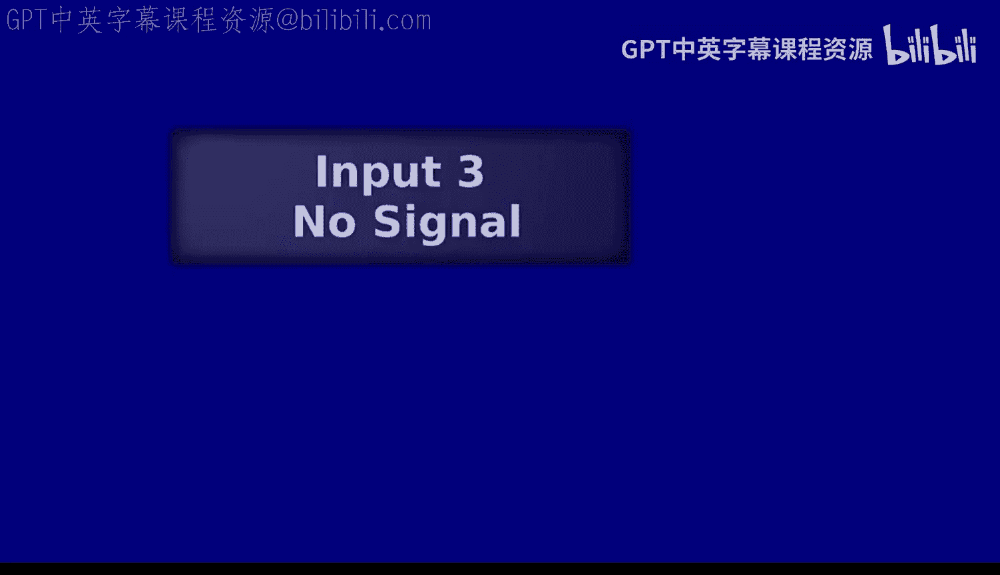
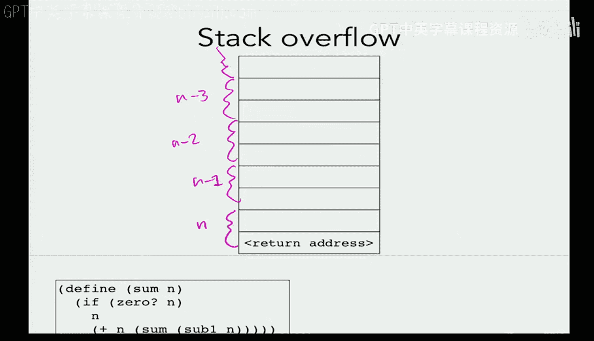
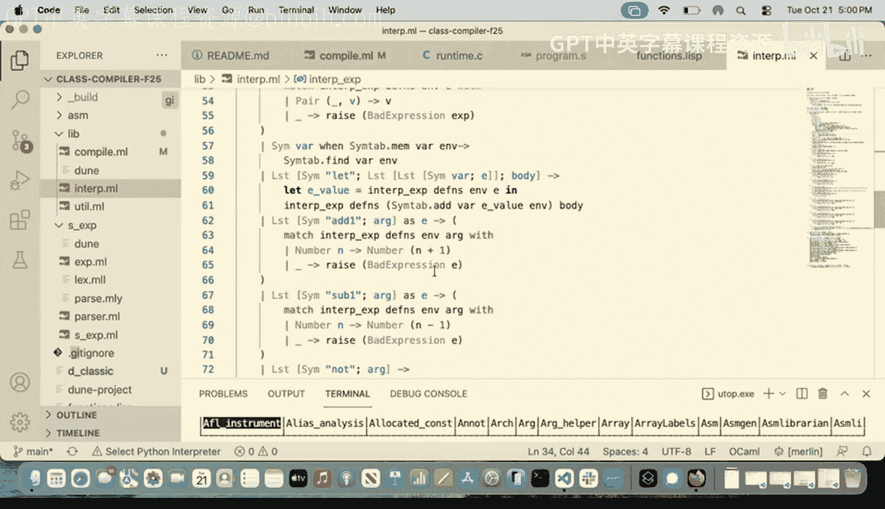
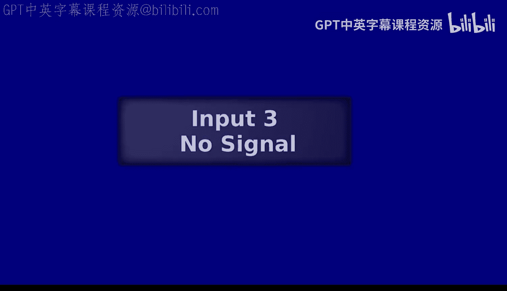

# 编程语言和编译器：第16讲：尾调用优化 🚀



在本节课中，我们将要学习一种重要的编译器优化技术——尾调用优化。这项技术能让我们在递归函数中重用栈帧，从而避免栈溢出错误，使程序能够处理更深层次的递归。

## 概述 📋

我们首先会回顾一个递归求和函数的例子，它在大输入时会导致栈溢出。接着，我们会分析一个改进的、使用累加器的版本，并探讨为什么它理论上可以避免栈溢出。然后，我们将正式引入“尾位置”的概念，并学习如何在编译器中识别尾调用。最后，我们将动手修改编译器，实现尾调用优化，让改进后的递归函数能够成功运行。

## 栈溢出的问题 💥




上一节我们实现了函数调用，现在可以运行递归程序了。让我们看一个计算从1到n求和的递归函数：

```lisp
(def (sum n)
  (if (= n 0)
      0
      (+ (sum (- n 1)) n)))
```

这个函数逻辑正确，但当输入值很大（例如一百万）时，无论是我们的编译器还是解释器版本，都会导致程序崩溃。

问题在于，每次递归调用都会在栈上创建一个新的栈帧。对于输入`n`，我们需要`n`个栈帧。栈空间是有限的，当递归深度过大时，就会发生**栈溢出**。

## 尾递归形式 🔄

我们可以将上面的函数改写为“尾递归”形式，它使用一个额外的累加器参数：

```lisp
(def (sum n total)
  (if (= n 0)
      total
      (sum (- n 1) (+ n total))))
```

这个版本在递归调用后没有其他工作（即不需要将结果再与`n`相加）。递归调用 `(sum (- n 1) (+ n total))` 的结果就是整个函数的结果。

理论上，当一次函数调用完成后，如果它的栈帧数据不再需要，我们就可以复用这个栈帧来进行下一次调用，而不是创建新的。这样，无论递归多深，都只使用一个栈帧的空间。

## 理解尾位置 🎯

上一节我们看到了避免栈溢出的可能性，本节中我们来看看如何系统地识别可以进行优化的调用。关键在于判断一个表达式是否处于“尾位置”。

一个表达式处于**尾位置**，意味着完成这个表达式的求值后，当前函数体就再无其他计算需要执行，其求值结果就是整个函数的返回值。

让我们通过一些例子来直观理解：

以下是判断子表达式是否处于尾位置的几个例子：
*   **函数参数**：例如在 `(sum (- n 1) (+ n total))` 中，`(- n 1)` 是参数，它不处于尾位置。因为得到它的值后，还需要完成函数调用本身。
*   **函数体**：在函数定义 `(def (sum n total) ...)` 中，函数体表达式处于尾位置。
*   `if` **表达式**：`(if (= n 0) total ...)` 这个 `if` 整体如果作为函数体，则处于尾位置。它的两个分支 `total` 和递归调用，如果被执行，也分别处于尾位置。
*   `let` **表达式**：在 `(let ((x 3)) x)` 中，绑定值 `3` 不处于尾位置，但主体 `x` 处于尾位置。
*   `do` **表达式**：`(do 1 2 3)` 中，只有最后一个表达式 `3` 可能处于尾位置（如果`do`本身处于尾位置）。
*   **有副作用的表达式**：例如 `(print e)`，即使它返回 `e` 的值，求值后仍需执行打印操作，因此不处于尾位置。

## 在编译器中追踪尾位置 🛠️

为了在编译器中实现优化，我们给 `compile_expr` 函数增加了一个布尔参数 `is_tail`。它表示当前正在编译的表达式是否处于尾位置。

我们需要遍历编译器代码，为每个递归调用 `compile_expr` 的地方选择合适的 `is_tail` 值：`true`、`false` 或传递父表达式的 `is_tail` 值。

以下是主要表达式类型中 `is_tail` 参数的设置规则：
*   **函数调用实参**：始终为 `false`。
*   `do` **表达式**：除最后一个子表达式外，其他都为 `false`；最后一个子表达式继承 `do` 本身的 `is_tail` 值。
*   `let` **表达式**：绑定值表达式为 `false`；主体表达式继承 `let` 本身的 `is_tail` 值。
*   `if` **表达式**：条件测试表达式为 `false`；两个分支表达式继承 `if` 本身的 `is_tail` 值。
*   **二元操作数**（如 `+`）：两个操作数表达式均为 `false`。
*   **函数定义体**：应设为 `true`，因为函数体的结果就是函数的返回值。
*   **程序主表达式**：应设为 `true`，允许复用初始栈帧。

## 实现尾调用优化 ⚡

现在我们已经能识别尾调用，接下来实现优化逻辑。核心思想是：当进行一个处于尾位置的函数调用时，复用当前栈帧，而不是创建新帧。

在编译器的函数调用处理部分，我们根据 `is_tail` 参数分两种情况处理：

**1. 非尾调用（常规调用）**：
保持原有逻辑：移动栈指针（`RSP`），使用 `call` 指令，创建新栈帧。

**2. 尾调用**：
进行以下关键修改：
*   **不移动栈指针**：保持 `RSP` 不变，复用当前栈帧。
*   **使用 `jump` 代替 `call`**：`call` 会将返回地址压栈，而 `jump` 直接跳转，不改变栈状态。
*   **妥善处理参数**：在计算每个实参时，需要先将结果存到临时栈位置（避免覆盖当前帧中还需使用的值），然后再复制到当前栈帧的底部（即被调用函数期望找到参数的位置）。这通过额外的 `mov` 指令实现。

优化后的尾调用代码大致逻辑如下（伪代码表示）：
```assembly
; 假设正在编译 (sum (- n 1) (+ n total)) 且处于尾位置
; 计算实参1 (- n 1)，结果存入 RAX
...
mov [RSP - 16], RAX ; 存到临时位置
mov R8, [RSP - 16] ; 加载到寄存器
mov [RSP - 8], R8  ; 复制到参数1位（相对于当前帧基址）
; 计算实参2 (+ n total)
...
mov [RSP - 24], RAX ; 存到临时位置
mov R8, [RSP - 24] ; 加载到寄存器
mov [RSP - 16], R8 ; 复制到参数2位
; 跳转到 sum 函数
jump sum_label
```

完成这些修改后，我们的编译器就能正确运行尾递归版本的 `sum` 函数，即使输入一百万也不会栈溢出。

## 总结 📝






本节课中我们一起学习了尾调用优化。我们从栈溢出问题出发，引入了尾递归形式。然后，我们定义了“尾位置”的概念，并学习了如何在编译器中通过 `is_tail` 参数来追踪它。最后，我们实现了尾调用优化的核心逻辑：当调用处于尾位置时，通过复用当前栈帧和用 `jump` 替代 `call` 来避免栈空间过度消耗。这项优化对于函数式语言的实践至关重要，它使得递归可以成为迭代的安全替代。