# UCB《编程语言和编译器｜CS 164 Programming Languages and Compilers 2025》中英字幕 p19 -P19-Lec 19 - Parsing cont d.zh_en -BV1zQ27BeEfF_p19-

Al right， hello everybody， H Tuesday， I hope everybody had a really lovely Halloween。😊。

I'm going start us writing in on some activities today。

 So if you have not yet opened up B S code and downloaded the thing on the schedule that says something like regular expressions activity。

 go ahead and download that right now。 I'm gonna real quick talk us back through the activities we wrapped up at the end of last week。

 and then we'll dive in on the thing that you're downloading off the calendar。

 So real quick going back to。😊。

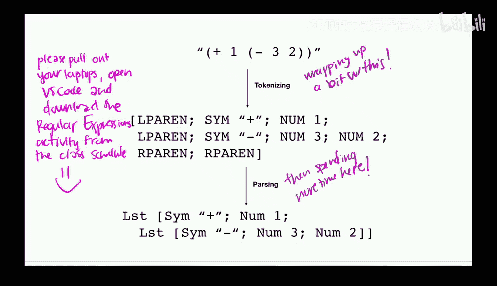

Our prior tokenization fun。

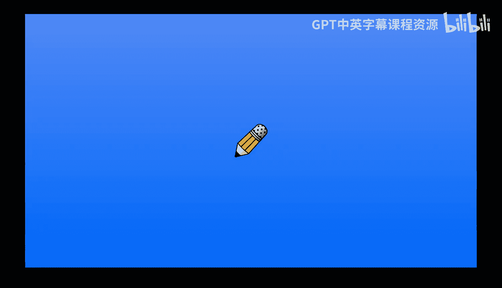

So， we。Soaw a couple of fun things。 One thing is we had a good spotting on an issue with the。

 the original。F automin that we had y'all draw。 So in particular， let us take a look。Right here。

So we originally did not have this epsilon transition in there。

 but one of you spotted that that should be in there。 fantasticantastic work。

 it should indeed be in there。 The functionality is actually the same because of course Epsilon is just you know the empty string so we can make that transition whenever but good spotting and then if you went ahead and did the activity that we did at the end of last session where we did this。

This is how it would come out。 Does anyone need me to linger on this slide。We're feeling okay。

Fabulous， in that case， let's go ahead and write some new regular expressions of our own。

 rather than just spending all of our time on generating an existing generating forward existing regular expression。

 the appropriate finite automaton。😊。

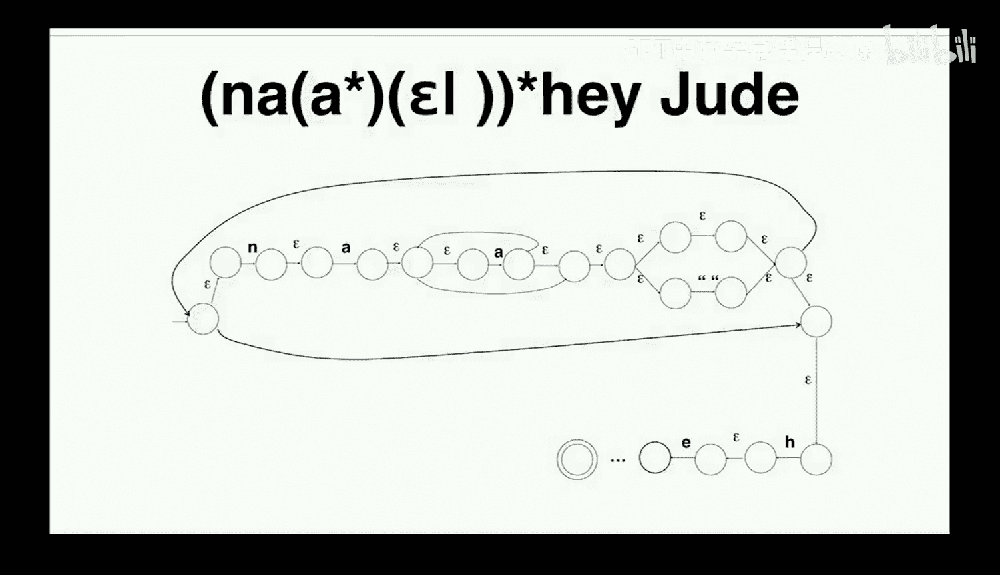

So here we're gonna start working with this file that you all just downloaded from the class schedule We have not set up anything fancy for how we're gonna to test our regular expressions today。

 so all we're gonna to do if you look right here you can see that if you click this thing on the end Does everyone see sort of this little thing right there that is going to allow us to do regular expression search so that way you can go ahead and type your regular expression that you're trying to test out right here in this box in order to avoid it just searching everywhere the thing that I'm going to suggest that you do is put a space at the beginning a space at the end and then you type your regular expression there in the middle and then that way it should only because you can see that we've got these little silly little test cases that we have hacked together by just having them all in one line and you can see there's a space before and after each of them so this way whatever it is that you end up looking for it is going to go ahead and only find the ones that are inside those test cases a very silly testing framework but good enough。

For our little 10 minute activity that we're going to do So I want you to go ahead and start in on activity number one right here。

 and what I want you to do with someone nearby is between those spaces。

 go ahead and start writing the regular expression that you think is going to match these examples。

 but not match these examples， and then we'll come together and chat about it。

Take a minute for this first one。In case anyone missed it。

 make sure you have turned on regular expression mode with this little thing right here。

If you happen to not have your laptop with you， go sit near someone who has the laptop with。

 work together。Alright， I don't think this one is going to be too hard。

 So I'm gonna go ahead and write this one out for us。 So we wanted to begin with an A。

 So I'll leave that A in there that I left in there。 we then want to have。

 however many of whatever else。 So os， that's better be a Z。 We can use our clean star for that。

 That's okay。 looks like I've got。My lowercase stuff going bad， what's going on there？

Lowercase words that start， oh， maybe I want。A through big Z。What is going on？Oh。

 that's the caps lock。 Okay， yeah， so this is how you ensure that it's actually doing the lowercase uppercase the way you want if you want to make sure you are matching case。

 not that one。 That was the whole thing I I was clicking on first， okay。

So now we are ready to move on to activity number two right here。

 let's make sure that we are matching lowercase words with at least two A's。Again。

 let's take about a minute。We are doing the regular expressions activity from the course calendar if you want to pull that up。

I sitting here somewhere？Work together。不用买抽门。I put the space in front and at the end in order to just like because you can look at those being。

 that's why we were talking about the spaces the beginning in the end。Basically， yeah， pretty much。

 yeah。Yeah， it's just because like we haven't set up an actual testing infrastructure or this。

 we've just written everything out online so that's our hacky way of just deploying it to our test cases。

是啊。All right， how do we feel about this solution that I've got up here。

 does this feel pretty comfy everyone？Everyone land on something more or less like that。Fabulous。

 let's move on to exercise number three right here。 lowerercase words with at least two A's。

 but A's don't start or end the word。😊，All right， how's this field of people？

We've had to switch from clean stars at the end of those who just using our pluses to indicate we better have at least one B through Z。

And then same deal at the end， we don't want to end with one of those A's。

 if we have other A's in the middle， whatever we're good。Feeling okay about that。Amazing， okay。

 let's skip over this one。 I don't think this one's going to be super surprising。

 and we're not gonna to have a ton of time， but I do want us to do this one。

 Let's do alternating sequences of A and B。 You can look at those examples to get a sense of what we want to allow。

Home， if you're ready。H if you want a little more time。All right。

 we'll keep going for a little moment there。Hs we ready。If we want a little more time。Okay。

 sounds like we're ready。 So here we go。 Here's sort of the foundation of this one， right。

 We want to go ahead and have A and B repeating as many times as we like。

 But we might want it to be allowed to start with a B。 So let's give that a B question mark to start。

 And we might want it to be allowed to end with an A。

 So let's give that an A question mark at the end。 That's going go ahead and give us that alternating sequence of A's and Bs that it's allowed to start with either one of those as long as it's always alternating sequences。

😊，feeling pretty okay with how that one set up。 We remember that question mark is just either the thing left of the question mark or the empty string。

 that was sort of some syntactic sugar on top of the sort of ore notation that we had。

 That's what question mark meant。I can pull back up the sort of grammar of regular expressions if that's helpful to folks。

Okay， cool。 Looks like we're feeling pretty okay about this one。

 So I'm gonna have a skip over email addresses。 It's not particularly helpful。 And as it turns out。

 email addresses in the real world are very， very complicated。

 And you have to write all kinds of wacky things to recognize email addresses in the real world。

 But I do want to supend。 Let's been about。Two minutes talking with the folks nearby about this one。

And see how far you can get。All right， hum if you've got it。Hm if you don't got it。

Maybe ask the simpler question， hum if you think this is possible？H。

 if you think this is not possible。Yeah， I have to agree， right， this is a little mean。

 I gave you an impossible one。 But this is really getting at one of those questions that folks ask a lot。

 right， Like why don't we just make our tokenizer， just do the parsing for us right Like is this tempting to think。

 oh， we haven't split into these phases。 Like why are we doing this。

 We are using different tools for these different processes that can do different things。

 So we talked last session about the fact that regular expressions， nondeterministic finiteatmaa。

 deterministic finiteatmaa。 All of these can express sort they have the same computational power。

 They can express the same things。 that is called regular languages， and this is not in that class。

 right， some indefinite number of a's followed by the same number of Bs。

 or we might also be thinking in our head sort of some whatever number of leftpars followed by the same number of right pres。

 right， We are kind sort of interested in things that are a bit like this as we are starting to think about parsing。

😊，Cannot use regular expressions to do this。Question。这是个证。百分之百。Then你这边。Great question。

 So this question was say we bound the number of A's。 So we said， okay。

 it's not an indefinite number of A's。 It is a specific number of A's。

 Then absolutely we can do it with the rex。 And so， in fact。

 the next sort of step that I was going to take us through was giving us a bit of a visual intuition for this。

 So let's do that real quick。 So let's remember regular expressions， determin finite automas。

 nondeterministic finite autooms， same expressive power， all the same thing。

 So if we can actually write out the finite automaa for this problem， fantastic。

 That means that regular expressions can express it。😊。

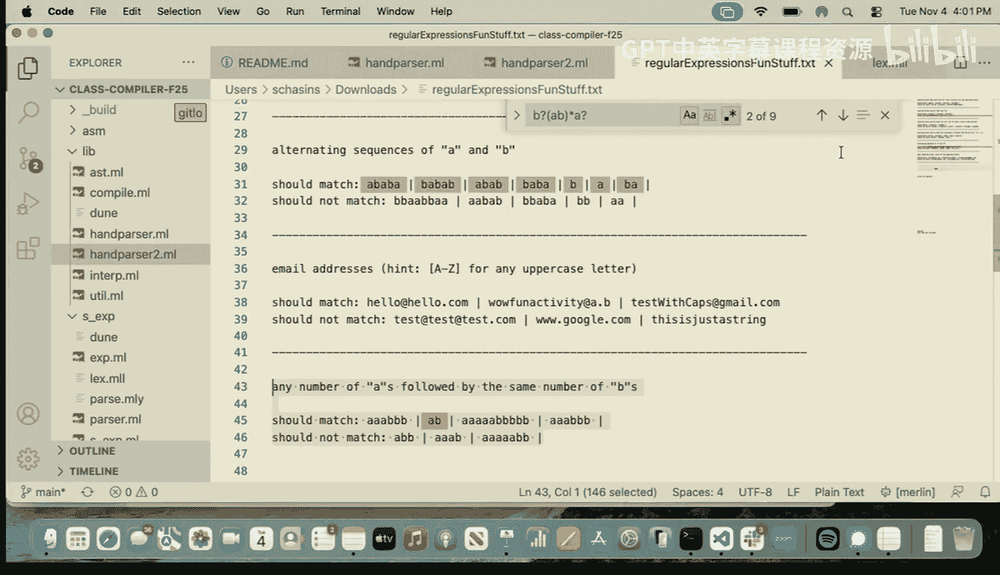

But in fact， they can't So。 let's sort of reason through。

 Let's give ourselves the visual intuition for y。 So here's sort of our start state。 right。

 remember the arrow coming in。 that means it's our start state。

 Let's go ahead and have an A coming into another state。 And then if we get a B fantastic。

 let's put that as our our final state。 So this now matches1， A followed by 1 B。 All good。

 Let's say we wanted to accept either  one A followed by 1 B or two A's followed by two Bs。

 fantastic。 We can have that B and A。😊，That be a B。

 And then this can go back here if it again sees a B right so now we can see that we've got sort of these two paths。

 we can go A to B。 We can do A to A to B to B。 We can keep going right。

 so we can add another A and we can add another B。Right and we can keep going like this。

 And as we keep adding more， we are going to right now， we can handle three。 if we add another one。

 we can handle4， if we add another one we can handle5 right And so if we know in advance the number of a's fantastic。

 We are gonna to be good to go。 We are gonna be able to express that with a regular expression。

 On the other hand， there is nothing in finite automa land that lets us I'm gonna switch colors to express that we can't do this that lets us just sort of say like dot dot dot keep going like this right we don't have anything that lets us do that And so I'm gonna go ahead and cross that out to be extra clear。

 we don't get to do that right And so when we say finitema right determin finite。

9deministic finitemin， we really mean finite right we really do mean finite。

Are there questions about this， about the fact that regular expressions and regular languages simply cannot solve this problem？

Other questions on that have been brought up by thinking about this。

Will we be required to prove that we cannot express this with a regular expression？

Not for this class， but if you're excited about that。

 I highly recommend theory of computation courses。Other question。O， cool。

So that is basically bringing to a close our tokenization chat。

 This is hopefully giving us a little bit of an intuition about why we separate tokenization and parsing。

 And remember， you know， we cannot express everything with regular expressions。

 That is good for us to keep in mind。 They are very helpful for tokenizing right。

 they're going to allow us to check any given token in linear time。 really helpful。

 But that's sort of。Where it stops for us， now we have to switch back to parsing technologies。Okay。

 cool， let's switch back to parsing technologies。When last， we left off with parsing。

We had come pretty far， right， We had， in fact， managed to handle how to parse something that looks like this。

 We would turn it into this kind of token， and then we would turn it into this kind of representation And that is pretty good。

 but it turns out that the way we were able to do that， right。

 the reason we were able to do it with the sort of nice technique that we ended up using was because I had already given us a grammar that was in a pretty friendly shape。

 right， And so for that particular grammar， we were able to do that process and everything worked out quite nicely。

 we were able to have really a fairly straightforward parser for us to build。😊。

It turns out if we are just given any arbitrary context free grammar。

 we are not necessarily going to be able to go through that same process。

 and so today we're going to talk about what can we do to make sure that we can go through that process。

So， let's talk。About the general issues。 Okay， so the general issues is that we do want our parser。

 right because this is， you know， something we are planning to run on very large long programs。

 We want something that is gonna run in linear time。 And so that is， in fact。

 the situation we had with the parser we wrote was it last Thursday。

 whatever it was that we wrote it the time that we wrote last Tuesday， I guess when we wrote that。

 that was a linear time parser， which is the behavior that we want in the worst case situation。

 we could end up with a cubic1 parser。 We really don't want that。

 And that's cubic and sort of the size of the program， which， again。

 we want to be running on large programs。 We really don't want that situation。

 We want to be able to be linear time。 And so that is possible for some grammars and not all grammars。

 There is no general purpose solution for getting a linear time parser out of。A generic。

 whatever someone has handed to me， context free grammar。

 and so that's what we're going to be thinking about today。So how does anyone one parse。

 Let's sort of talk through。 So there are a few different kinds of parsers， the one that we built on。

Whatever that day was， and the kind that has the whole the community has basically landed on right now is L LK。

 And I'm just going to talk through what those actually stand for。 So that first L is for left。

To write。That second L is for leftmost derivation。And this K is telling us how many tokens we needed to look at in order to decide the next production rule that we were going to use。

 So let me actually pull up that parser that we were using。

 because I think this is going to be easier for us to think about。

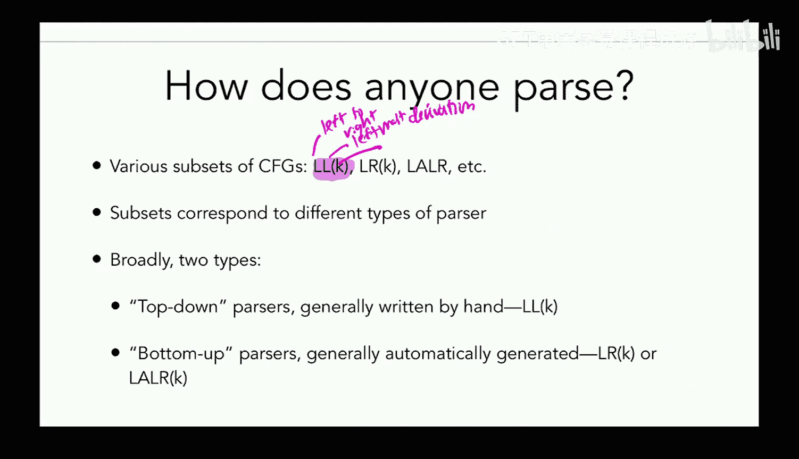

If we are seeing it。So if you remember we had that sort of idea about how we were going to do this that was going to come down to having one helper function for each of our nonterals and then one match case for each of our production rules and so I can actually shall I remind us of sort of what these grammars look like let me。

Pull that back up real quick。

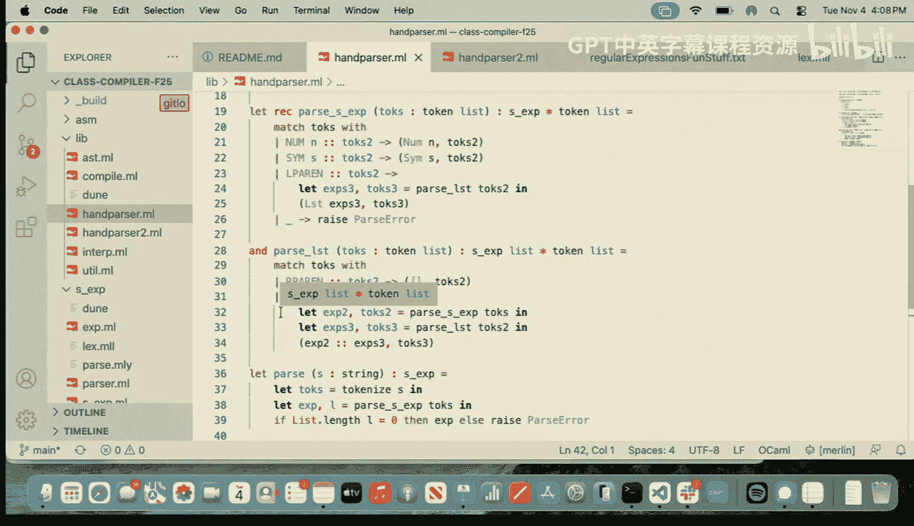

So this is the kind of thing we're thinking about where we have our non terminals。We have terminals。

And this， paired with this is one production rule。Production wall。

So those are the kinds of things that we were thinking about and what we decided was that for each non-terminal。

 we were going to make a helper function and for each production rule。

 we were going to have one match case and then we were able to construct our parser exactly that way and the question I want to ask you right now。

 I want you to take a look at the sort of helper functions that are handling each of those non-terminals I want you to discuss with folks nearby how many tokens did we have to look at in order to decide which production rule or in this setting which match case we were going to use go ahead and discuss。

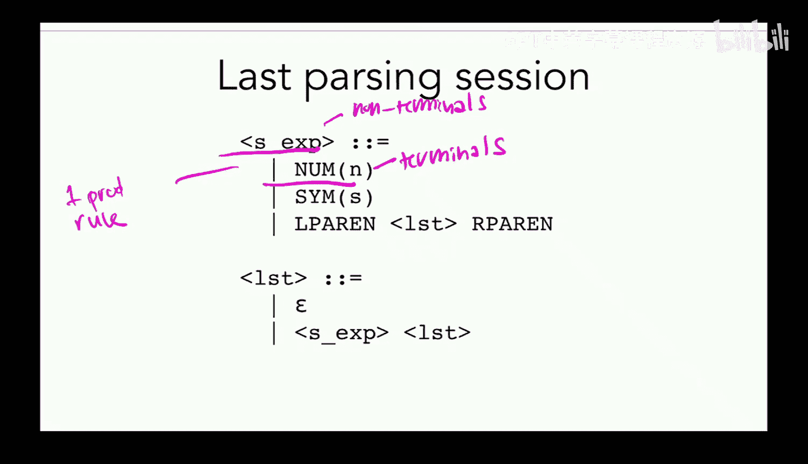

All right， hum， if you think we always know after looking at one token。Hum。

 if you think we know after two tokens。Hum， if you think it's any other。Okay。

 so it sounds like we've got sort of squishy support for one。 And I totally agree。

 right We can go through and just look at these match cases and basically read that off right So here we're gonna go ahead and say。

 okay， yeah， that first token is a number fantastic。

 this is our production rule that we're interested in our first token is a symbol great。

 This is the production rule。 Our first is an Lpar。 fantastic same deal down here。

 we've got the Rparn， or we're gonna go down into the recursive case we always know and in the recursive case。

 we're just bouncing right back to here， where we're seeing that right So we're always going know after just one token which of the production rules we're interested in which is very exciting for us。

 This is how we're able to do this in this linear way， we never had to make any guesses。

 we could just look at the next token and say this is the one right we never had to guess and backtrack it was always clear。

 And so that LLK， the K and LK is telling us the number of tokens of look ahead So if we take a look at the particular one that we worked。

😊。

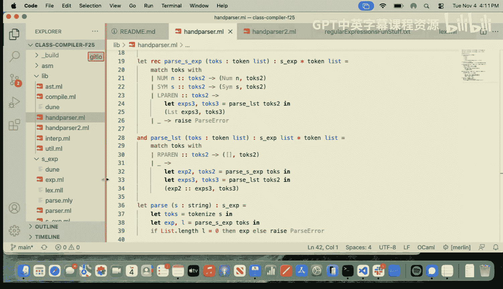

last time。We had an L L1。Situation。Questions about that。

 about this idea of how many tokens of look ahead we need。Okay， cool。

So there are basically a few different kinds of parsers that people end up building。

 and I'm going to talk through sort of the pros and cons。In general。

 a top down parser is one we are starting from the start symbol。 If you remember that we had again。

 looking at this， we always had that sort of first one unless it was otherwise mentioned that first one was going to be our start symbol。

 So that's exactly the way that we would start for top down is we would sort start at the root of the tree and be the start and then we would take one production rule and then at this one we would take some other production rule and this one we would take some other production rule and then eventually we would get down to the nonterminals down at the leaves and we would be done。

 So what we wrote last time was in fact a top down parser because we are doing the sort of construction of that parsse tree。

 starting at the top， starting at the root and moving down towards the leaves。

 Now there are other kinds of parss bottom up parsers where instead you're you're going through these leaves and you're saying okay maybe there's this connection across these leaves and maybe that's going to mean that we're sort of going the other way on the production rule right So if we think of what。

The top down parser is doing as saying okay， I'm finding one of these and I'm deciding to use one of these。

 the bottom up parser is saying okay I'm seeing one of these。

 let me go ahead and use that to produce one of these right so are we going from the left hand side of the production rule to the right hand side or are we going from the right hand side to the left hand side that's the real distinction in top down versus bottom up parsers。

And historically， we tend to write top down parsers by hand。

 that is sort of the most common situation。Whereas for bottom up parsing。

 we actually have a bunch of things called parser generators that allow us to generate parsers for those grammars automatically。

You'。Okay， it allow us to generate those parsers automatically。 And for a while。

 this was super popular because it turns out it is actually a lot easier for the compiler writer。

 right， typically for a parser generator， all you have to do is write down your contextfr grammar right So write down again。

 that sort of production rules representation that we've been going back to and looking at。

 You write that down。 and then the parser generator behind the scenes is actually gonna write your parser for you automatically。

 The compiler writer is looking at the situation thinking， oh， this is great。 This is easy。

 I just write down my grammar and I'm done as opposed to having sort of write something out the way we did a few sessions ago。

😊，The problem is， a while into everyone doing this。

 They figured out that the error messages that you get back from this are really， really brutal。

 just like it's really hard to get any kind of reasonable error messages out of it。

 And so for a long time， C was actually using like Gcc specifically was using。

Just the sort of top down recursive descent type parser that we were seeing earlier that we were actually using。

 and then they switched to using an LLR Laer parser generated from a generator called bison。

 And then in like 2004 they're like oh my God， these error messages are horrible。

 We can't be doing this anymore and they swapped back to doing the same kind of parser that we actually use。

 And this approximately is because we don't have any really good heuristics for how to give good error messages like we really don't have a lot of research on how to make error messages good。

 but the best heuristic we've got is to refer to those things in the grammar。

RightAnd so if you're doing top down， fantastic， you know exactly which production rule you're using。

 you know sort of what could happen next that would sort of complete the production rule you're trying to use right you're able to reason about sort of where in this parse tree you are if you're doing bottom up。

 you don't necessarily have that structure and it's really。

 really hard to just give the user any kind of useful feedback to the extent that you know even reasoning about these grammar production rules even is useful feedback。

And so in general， the thing that we have all basically landed on is that we do these topdown handwritten parsers as sort of the default。

 unless you are trying to really， really quickly throw together a parser for a new language。

 So you may have noticed that we've been having like really quite bad error messages for our own parsers that we've been using in class so far。

 that is because we have been using something actually generated with a parser generator。

 So here's sort of oops you can see this isn't quite O Caml。

 we've got something that's sort of looking like these token definitions。

 it's looking pretty close to just saying， okay， kind of regular expression E。

 and then if we take a look at the actual parser， this is looking pretty close to just being sort of the grammar that we were writing on the whiteboard before and this is just all the input it takes in order to generate a parser using a parser generator So if you've been wondering why we've had such bad error messages this entire time。

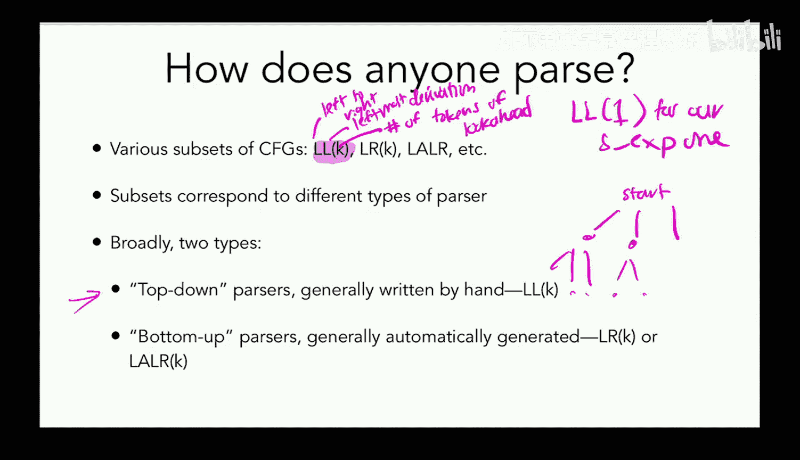

Why， right it's been coming out of a parser generated from a parser generator。

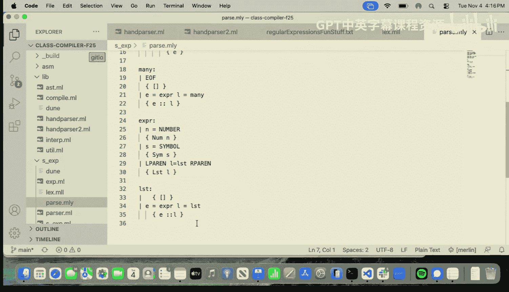

So， okay。That's why we sort of moved away from these bottom up automatically written parser generators。

 If you do want to just really quickly spin up a language of parser generators fine。

 If you're trying to build a production compiler， you're probably not using one of those you are probably doing something more like what we are going to talk about for most of the time today。

 So let's talk。About top down predictive parsing。So this is exactly what we have been talking about。

 This is also called recursive descent parsing and so recursive because we are sort of calling those helper functions recursively disscent because again。

 we're starting at the top and moving downwards right we're starting at the top of the parse tree and moving downwards and this uses those exact same hints that we've been talking about this whole time where you're going to have one function for each of the nonterminals in your grammar and you're going to go ahead and have these non-terminal functions basically just call each other call themselves and that's how you're gonna to build up the parse tree and the pro is intuitive flexible good error messages it's easy to hack in error message like you have a lot of control over the error messages。

 like if you want to make one of the error messages be go look at this particular stack overflow answer like that's one of the things you can do right you can just go in and put whatever you want in there So it's very hackable。

Okay， the con， however， is that sometimes you are going to have to adjust the grammar。

 And so even though recursive descent parsing is sort of the gold standard and is the thing that you shall all be thinking of reaching for if you decide to implement a real compiler yourselves。

 there are going to be some cons and we're going to spend the rest of today talking about those cons。

So what we have to do to make this work。Questions about this general sort of top down， bottom up。

 recursive descent thing， I know there's a lot of terminology floatingn around。So far so good。

Fantastic， okay。Let's keep it moving。So these are those three cons that I talked about am left factor English recursion。

 we're going to be talking about those for the rest of class today。Okay， last parsing session。

 this was the grammar that we dealt with， it turned out that this grammar had a bunch of nice features that we maybe weren't aware of。

 but that made it a lot easier for us to actually do what we ended up doing when we made that recursive descent parser。

So。We are now going to go ahead and real quick do a terminology note。

 So I want to be clear that a grammar is describing something other than the grammar。

 right so a grammar is accepting a language but a grammar is not itself a language right so L of G language of the grammar is all the strings that we can actually make by using the production rules inside you。

 So it's all of the strings that we can actually except with that grammar or all of the strings we can generate with that grammar depending on whether you want to think about it more as parsing or more as producing。

But the grammar and the language produced by the grammar are two different things。

 so if we look at this grammar that we have been playing with so far。

 this is the grammar of our S expression， so maybe this is G， then L of G would be all S expressions。

A we all clear on the idea that these are two different concepts and that when I use the word grammar and the word language。

 I am going to be referring to two different concepts。P。Okay， fantastic。 So yeah， all strings。

 all the strings that we are going count as S expressions would be L of G for this G。Okay。So。

Say that we are going along。 We're doing our nice Lisppy syntax。 We love it because we love scheme。

 But then our friend says to us， hey， I actually like to like write math like that。😊。

RightThat's the way that I prefer to write it instead of this thing where we're doing okay plus one and then times 2。

3 right like they don't like that for some reason。 they like this fantastic。

 We can go ahead and make them a parser that is going to accept that that is totally fine So here is the type that they might want to be getting back out to represent that。

 And here is a grammar that is going to accept this kind of string right。So on the surface。

 I think this grammar is looking pretty promising for us。

 right we could tackle things using this grammar。 You can see how we could actually use this to generate something that looks like this。

But it turns out we could have some problems。 So we are going to experience with this that there are multiple different parsse trees for a given string that would both be allowable。

 And so your task with someone nearby for the next one minute is come up with a string that is accepted by this grammar。

That could be parsed in multiple different ways。 And when I say parse in multiple different ways。

 I mean you could draw out the parse tree right， we're going to start at ExpB。 right。

 We're going to be able to draw out multiple different parse trees starting at that same root that produce the string that you choose。

 but it's going to be a different shaped parse tree。Discuss for two minutes。Home。

 if you think you got one？How if you're still looking？All right， let's keep looking。

 let's give another half a minute。Alright， so here's the example I came up with。

 There are lots of different examples。 It is totally fine if you came up with a different one。

 if I just write out one plus2 star 3。😊，Right there are multiple different parse trees that are possible for this。

 right so say that I go ahead and I start from my root node and I say， okay。

 let's use this star production rule， right， let's use that first fantastic。

 Now we've got Exp star 3。 That seems fine。 We can go ahead and use that addition rule down here。

 this would correspond to sort of grouping things in this way。

 right if you think about what's going to happen when we actually run， say the interpreter on this。

 it's going go down here first， and it's going turn this into three and then it's going multiply that by three and we're going to get out the answer9。

Cool， seems fine。However， say that we've parsed this differently right。

 say that we've gone ahead and we've said， okay， let's take the plus production rule first and then down here we're going to go ahead and use that star production rule。

Oh。So now I'm starting to get concerned right because this looks like producing this program。

 and if we run our interpreter， remember we go down here， we're going to get that that is6。

 and then we're going to add one to that and we're going to add seven out。

 These are different answers。 right， This seems really bad。 We do not want to have ambiguity。

And in fact， this is kind of a complicated situation because we don't have， in this case。

 a mechanical way for us to say， okay， I am going to go from an ambigguuous grammar to an unambiguous grammar。

 because if you think about it。 like there is no one true answer。

 we might prefer this parse tree or we might prefer this parse tree， if there is one that we prefer。

 if're okay with it being either， whatever， if there's one that we prefer。

 then we are going have to change the grammar in order to enforce the one that we prefer。

 So we're just going to have to apply our human reasoning。

 decide what it is that we want and come up with a grammar that enforces the thing that we're actually looking for。

 So let's take a look at what happens when we do that。 So here's one where it kind of looks similar。

 but you can see there's something changing。 We have in particular。

 separated out the level where we're allowed to add a plus from the level where we're allowed to add a star。

 So I'm going to ask you two questions about this， and I want you to discuss it with folks nearby。

 The first question is， are these the same。Is this the same grammar as this？

 And the second question is， do they accept the same strings。

 So does this accept the same strings as this， Do they accept the same language？

 Go ahead and discuss both questions for about a minute。Okay， for our first question。

 are these the same grammar， Hu， if you think these are the same grammar。

How if you think these are not the same grammar？I totally agree， right。

 Like we can see there's a different number of nonterminals just as a starting point， right。

 if we had something that was the same grammar， except we had sort of renamed nonterals or whatever。

 I'd be like， okay， like I'm fine with calling out the same grammar。

 We're clearly not in that situation， right， We， we have a whole different structure。

 This is not the same grammar。 So now our next question， do these except the same strings。

 if you think these except the same strings。Home， if you think they do not。

Yeah these actually do accept the same strings， right So the thing that is different about this is not the language that they accept。

 It is merely how they parse the things that are in that language。 And so this again。

 gets back to really wanting you separate out the idea from the grammar from the language accepted by the grammar。

 the fact that those are， in fact， two different things。

 So even though these are two different grammars， they do， in fact， accept the same input strings。

The only thing that's changing is how we parse them。So okay。

 I'm going to go ahead and over our five minute break。

 I am going to start drawing out some trees that are going to help us figure out why moving from this representation to this representation has actually solved our ambiguity problem and y'all are going to take five minutes to stretch or come try with me or get a water and then I'll see at 435。

Alright， so let's talk through why changing to using this different grammar that accepts the same strings。

 Why changing to this grammar has fixed our ambiguity problem。

 So here's the way that we are able to actually use the production rules。

 right we can go ahead and start it expert。 We see， okay， we know we're gonna want to plus in there。

 We've got to this term plus expert。 Okay， let's do that。 We can go ahead， this comes into one。

 we get down to the expert to term。 we can do our factor times term。

 and we go ahead and we get two times three down there。

 This has caused us to parse it in the way that we all probably expect based on remembering。

 I don't know， middle school or wherever we learn Pmda basically the order of operations。

 This is the one that makes sense to us right we have our multiplication happening deeper in the tree。

 And so that's gonna happen before we do our addition。

 This is all probably what we would expect intuitively。And this is a way that actually。

 we can enforce that。 right， This is a way of enforcing that our multiplication happens before our addition。

Now， say we tried to parse it the other way， right the reason we ran into trouble the last time was because we could enforce it that we actually used the multiplication rule higher than the addition rule。

 is there something we could do here that would cause that So here we have tried right we've taken expert a term right that's allowed。

 we can just do expert a term that's okay and then we've said okay。

 well term let's use terms factor star term right so factor star term we've done that and now somehow we have to get from factor to one plus2。

Right。We can't do it， right there is no path back to this。If the user。

 if the particular string that was fed in， if it had pares， if it did the grouping for us， then sure。

 absolutely right， then we can go from factor to this Par situation。

 but we don't get to just introduce tokens Willy nilly， that's not up to us。

 we have to just consume the tokens that we see。 And if the only tokens the user gave us to play with here are one plus2。

 then we'd have to have some kind of like magical thing that happens down here that lets us get to one plus2 and that's impossible right。

So do folks see how this is actually solving our ambiguity issue？

Like we cannot write that bad parse tree anymore。 We can only write the one that we actually want。

Feels okay。Okay， yeah， so you're not actually going to get to play around with ambiguity on your parsing homework because I mean we could do something where we gave you an ambiguous grammar and then we told you what we wanted to have happen。

 we think that's pretty mean and so we're not going to do that we are going to go ahead and just give you an unambiguous grammar but you do need to be aware of this kind of problem for if you are dealing with a grammar out in the wild right if you were going go ahead and write a parser for a grammar of your own look out for this。

 this is one of those things that can cause you a lot of trouble。

Questions about ambiguity before we move on to our next little gotcha。Yeah。Only applies。

This only applies if we want to use the different way of doing the binary。Oh， no。

 this is totally fine， right， So it is totally fine if instead of。

We could just have this be plus blank， plus Larry， let me write it out as term。Term。Term。Now。

 we would only run into this ambiguity about what should happen first if we don't use the Par to group it。

But we could have。 So， in fact， there were a bunch of old calculators that used to actually have this。

 They would have you， let me do the undo。That would just have you type in plus oops。Plus， term。Term。

And then somewhere else， you would have the the multiplication and you have some other term， right。

 So yeah。This is just a general， like， if you ever land in the situation of having a grammar that is ambiguous。

 You're going to have to think about this。 This is nothing to do with the particular syntax。

 the particular order in which we're writing it down。Make sense。Yeah。Other questions。Yeah。で際だと。

So this is exactly what I was saying before is that we do not have an automatic way to do this transformation for us。

 right， there is no mechanical。 Here's how you take your ambigous grammar into an unambiguous grammar。

 right there is not something that you can just magically run and it's going to solve this for you。

 You have to sit down and think about what is the parse tree that I want how do I redesign my grammar to enforce that that's the parse tree I get right So in this case what we thought about was okay I know that I want my multiplication to happen deeper in the tree。

 And so I'm going to go ahead and introduce something where it is adding in our additions at the higher portions of the tree and the multiplications at the lower portion of the tree。

 and I'm going change my production rules to enforce that So yeah。

 that's why I'm sort of pointing out this thing about we don't have automatic solutions for this。

You just have to use your reasoning。Yeah， this is such a good question。 Okay。

 so this is say we have some other things in there。 In addition to you know， plus and star。

 if we've got an we've got or do we have to come up with how all of these are going to relate to each other。

 Yes， yes， we do。 right， we are deciding the order of operations for our programming language And so whatever we want to bind tightly fantastic。

 We'll treat it like multiplication we'll put it down there。

 Whatever we're happy for it to sort of happen at the outer level。 Okay。

 that's gonna go a little higher up in the grammar right sort conceptually。😊，Make sense。 Yeah。

 it's so weird， right， Like we get to decide what should happen， What should be the barry。Okay， cool。

 So now I'm gonna set y'all a little reflection question that we're just gonna consider for like 10 seconds。

 So if we take a look at this nice grammar， we've made it all unambiguous。

 We solved one of our big problems。 But I'm noticing something a little bit funny about this。

 I'm noticing this。 So if you remember when we made our。😊。

Our parser that was just going to look at that first token and go。Ha， is this going to work？For us。

 right we were able to look at just one token。And say， okay， this is the production rule that I want。

So go ahead and discuss for like 10 seconds。 Can we use this grammar in that way。

So previously the way that we were always able to know immediately just based on looking at one token。

 which of the production rules we were going to use。

 it was because we could just look at that first token and say okay yeah。

 this one okay yeah this one if both of these start with the same thing we definitely don't have that property right we could like find the same thing here。

 the same thing there and either of those rules might apply so let's look at this in the context of actually an even slightly simpler example。

 so here we've got this really very simple grammar。

 but we've got this this sort of repeated structure right here we see B other and that might be followed by either C or E so let's work through how this actually works on the string that we see right here。

We'll start with our start symbol。So far so good。 And then we can go ahead and say let's just take that first one right because it starts with B。

 So that seems okay。 So let's go ahead and do B fantastic。 we've got that。

 The next thing we want to match is our C。 So let's finish the production rule B other we picked this one。

 So C is going go there。 we're gonna expect to find that down there So right now we're gonna expand our other and we're trying to match our C。

 fantasticastic， we do have a way to do that。 We have C with other。 We can see that's right here。

 that looks okay to me。 fantastic now we're ready to match this other。

 we want the next item to be a D。 Okay， great， we're gonna go down， we're gonna get our D。

 And now the next thing we want to match is our E。 We're popping back up here。 this is a C not an E。

Dam， we have not succeeded。 Let's change our colors。 So that means we're gonna to have to say。

 ignore that I took that production rule。 ignore that I took that production rule。

 ignore that I took that production rule。 We're all the way back at the start。

 We've had to backtrack all the way back to just this situation。 Oops， start， damn。

 I really can't spell。Okay， we're all the way back at just having the star symbol in there。

 We had to ignore all of those guesses that we made up to that point。 That sucks。 right now。

 if we go ahead and try this with this other rule， it is going to work out。 okay， right。

 so we can go ahead and do B other。E， and then we can go down and have other right。

 like so that's taken care of B。 We can go ahead and go down the other that can be C， other。Right。

 that takes care of our C。 Other can be D。 fantastic。 That takes care of our D。

 Now we're ready to match that E and our next one is an E， so we're good to go。

 so we can actually match it with this grammar， but in order to do it with this bad grammar。

 we had to do a bunch of backtracking and we really don't want to do that right This is the kind of thing that ends up with cubic time issues right We are trying to do a linear scan。

 That's what we are trying to actually handle。😊，So okay， what can we do here and this case， right。

 like we talked all about how ambiguity we just have to apply our human reasoning and decide what we want。

 In this case， we have something mechanical。 We have the nice easy solution for y' all so let's go ahead and talk it through。

Basically， all we have to do is identify that prefix， right so we can go ahead and say， all right。

 I'm seeing that these two production rules both start with B other。

 Let us now make a production rule that has that。 And then it's going to introduce this new thing。

That it's going to represent whatever would come after right？

 And so we can see that that's going to be either C or E。

 So if we go ahead and now look at that new thing， right。

 that is going to go ahead and be either C or E。 We can just introduce this little sort of start prime thing or whatever that is just going to handle that tail。

Just identify the common prefix， identify the suffixes。

 and we get a new helper production rule for those， helper set of production rules。

Do we feel pretty okay about this， I think this is going to be fairly straightforward to reason through。

 We will see it in one more example。Okay， cool， so let's see that in one other example。So here was。

 oh， we can try。 I'll just show real quick that we can actually run through our our example in a way that is now much。

 much simpler。 So let's now go ahead and do our start symbol。

And we see that B is the first thing we want。 fantasticastic。 We have one rule that lets us do that。

 So B other。Last， okay， great。 The next thing we want is see so we can go ahead and deal with that with our other。

 so we'll get C。Other。Fantastic， we've dealt with our C， right We've got to be。 we've got our C。

 We're now ready to get our D。 That's totally fine。 We can take other to D。 That's all good。

 We've taken care of that。 And now we pop back up to our last。

 and this time last has a couple of different options for us。 it could be C or it could be E。

 In this case， we're trying to match an E。 So we'll take it to an E Fastic。 We have matched。😊。

All clear on why this is still accepting the same set of strings。

 but no longer making us guess about which production rule。Fabulous， okay。

 and in this case we can see that if we just sort of look through here。

 we're never having it start with the same thing in the same production rule。

 we're always going to be able to like if we're at a start situation。

 we're always going to be able to know which of the match conditions。

 which of the production rules we're ready to take。Okay， cool。 So now。Let's see it on here。

 Am I going have you actually run through this on your own。 I'm probably not。

 I'm gonna to show you how it actually looks。 So I don't think this is gonna be super surprising。

 Let's go ahead and see that， okay， we have this sort of repeated structure with term and we can either have a plus expert or an empty string after so I can see that that is getting repeated right here a plus expert or an empty string so that's gonna be that thing And then if we sort of highlight the term that's just showing up right there。

 And we have actually had to do the exact same thing with our factor rules down here so you can see that factor and factor being repeated now those only show up in the one place right there。

 And then what we're having off to the right of them it's going be either star term or the empty string just say either star term or the empty string all represented by term prime。

So far so good。This one's a lot easier than ambiguity because again。

 we get to just apply this rule just totally straightforwardly。

 like exactly what you've just seen us do with these two grammars。

 you get to do the exact same thing yourself。So far so good。Amazing， okay。

So that's our left factoring。Okay。So I want us to think through one other thing。

 So here's our sort of our grammar problems。 This was our fix for ambiguity from before we went ahead and did term plus expert。

 There's something else that we could have done right。

 Another way that we could have solved this instead of doing， again， term plus expert。

 We could have done expert plus term。Now， I want you to go ahead and chat with Fs nearby for。

Let's make it a minute。 Will we run into any problems if we try to use this grammar。

With our sort of helper function for each non terminal match case for each production rule。

 if we try to use that scheme for this grammar， will we run into problems。 discuss for a minute。

I'm going to show you both grammars on one slide just so you can take a look。

I'm going to show us another grammar that might also help us think about this。

So we might notice something about these grammars。 So here's the thing that I'm noticing right here。

 We've got this nonteral on the left hand side of this production rule and we also have it immediately at the beginning of the right hand side of this production rule we're seeing the exact same thing here。

 right expert expert term term these are grammars that exhibit what we call left recursion for the obvious reason that if you think about doing a recursive okay。

 not necessarily obviously for the reason that if you think about doing a recursive descent parser。

 then we're going you know we're going get to the helper function for this， we're going to say， okay。

 we're ready to do our match， let's go ahead and try our match。

 okay we're going call the helper function for this non-teral right， so we're going go ahead and say。

 okay， I'm trying to match my string A， I'm going start with my start symbol。

 let me call the helper function， is it an expert。okay， well。

 let me call the helper function for expert。 Okay， is it an expert。 Well。

 let me call the helper function for expert， right， Like we are gonna recurse and recurs and recurse。

 So if we just try to sort of， you know， straightforwardly follow that same scheme that we have been following before。

 we're gonna land in this weird spot where were just infinitely calling the helper function for this exact same nonter。

 Not really what we want now。😊，What are our alternatives， Well。

 it turns out that if we have a left recursive one， we can swap it to a right recursive one。

 This is going to be a little bit weird in some ways。

 So I'm going to draw out some parse trees to just try to show why this might seem a little unnatural to us。

 So let's go ahead and do yeah， let's do one plus 2 plus 3。 right。

 So that's what we're actually going to be drawing it out for。 So we'll have expert。It'll be expert。

Plus。Oh， sorry， let me draw this actually in black just to be clear that we are talking currently about this one。

 Okay， expert plus term。And then this will be expert。Plus。Term。And this will turn into a term。

 and this will turn into a factor。And that will be one， and then this will turn into a factor。

And that will be two- sorry， let me not draw a line there two。

And then our term will go into a factor。And that will be three。

 Are we all clear on why this is the parse tree we will end up with if we use the left recursive one？

Does that feel pretty comfy？Okay， so I'm going to go ahead and make this smaller。

 so we have enough space to draw our other one。Is this going to work？No。Yes， okay， great。 Allright。

 That is now smaller。 Let's now draw the next one， and I'll swap to blue to communicate that we are now doing this one。

 That's kind of a dark blue。 Let's swap to this blue。That one， great， okay。So we've got our expert。

And we've got term。Plus， expert。This will be a factor。And that can be one fantastic。

This can go be expert。Sorry， that should be termed because this is the right recursive one。Okay。

 this will be term。This will be plus， and this will be expert。And then we'll get a factor。Two。

 and then we'll get expert term。For。3， so okay， in some ways。

 these two trees look relatively similar， but we can see that we are sort of putting things together in this different way。

 right， So here we've got one。Plus2 plus 3。 And up above， we've got。

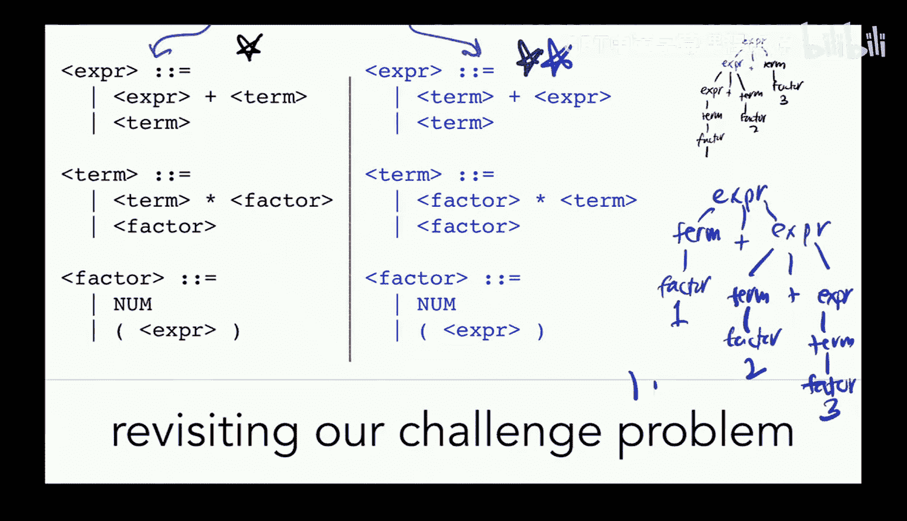

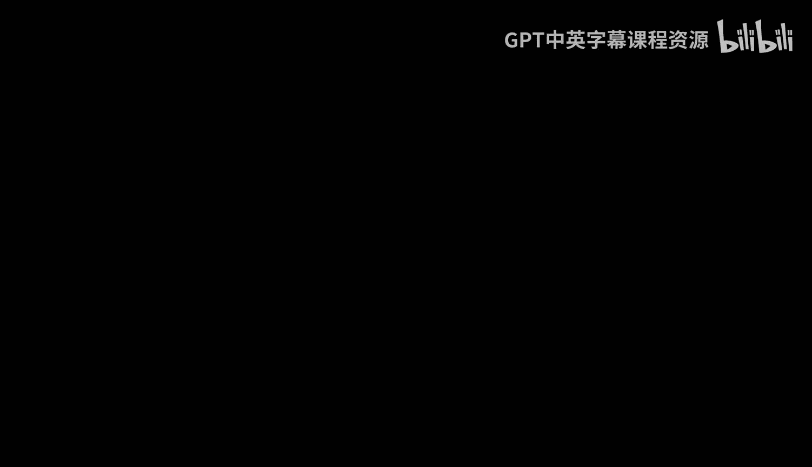

那各位。啊。Stop that。How do I make that go away？Goli。Can you see them no。Oh， dear。

All right， let me try swapping again。

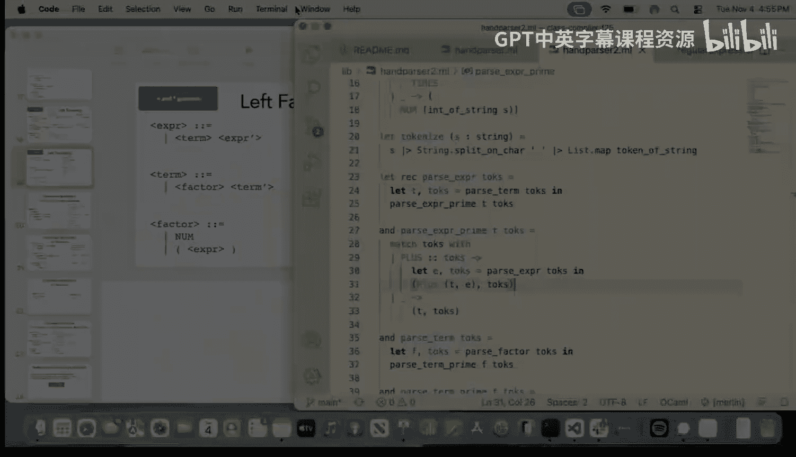

Yeah， it is unhappy screen。

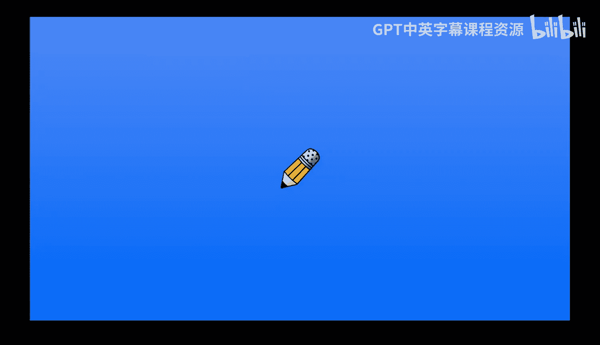

Okay， sorry about that， okay。So we've got one plus2 plus three down there。Let me fix that。

And then up above what we have represented is one plus 2 plus 3， not a big deal for addition。

 Can you see it okay Okay yeah， not a big deal for addition。

 but say that instead we turn this into subtraction right， just the exact same。

 but instead of plus we've got minus。 now suddenly that's that that's that that's that that's that。

 And we might be a little bit differently about whether this is okay for us。

And so this is one of the things that I'm going to have y'all sort of wrestle with and think about。

And there are things we can do to go back in and sort of fix up how sosociivity works。

 even if we have landed in this position， but I'm actually going to make you all think about that for your homework。

Question about this， yeah。Look the tail。Unrelated， yeah， yeah。

I'm curious how the connection feels like， though， that's interesting。Other questions about this？

Okay， cool， so。We have fiveish minutes left in class。

 You have all gotten a B courses message about a midsmester survey。

 We would love any feedback you'all have about how we can make the course work better for y'all。

 we know we're heading into sort of the tail stretch。

 but know there is still time left and we would like to make sure that it's actually working for y'all and we will make edits based on any feedback you'll give us So the last few minutes of class are just for y'all to spend a little time filling that in telling us how we can make it better for you。

 oh I am not gonna be here on Thursday。 Isha sadly cannot come and present myself from the past。

 but I will post the video of me from the past。 and next Tuesday is a holiday and enjoy next Tuesday。

😊，See y all soon after that。My office hours are 9 a to 10 a。 on Tuesdaydays。

 9 am to 10 am on wenesdays and soda 727。我就得。This week。

 they're totally normal like you can come tomorrow next week on Tuesday， holiday， Wednesday。

 faculty all day event。 So next week， unfortunately， I don't have normal office hours。 but this week。

 yes next week， the after next week。a month and a half old question。 Cool， Yeah。

 think I should have asked it a long time ago。This was like。

 I don't remember like lecture three or four or five when we were doing these binary in the compiler。

You when you were like don in live， you were， you were adding。X。

 whatever was in memory offset then you were like there are some things that you can't do directly out of memory。

 And so I almost always move things out of memory into registers before operating on them。

 I that the question said you said you said we were supposed to put them in RA when I was trying doing it it worked for me it worked if was just doing was Yeah yeah totally that's exactly what I'm saying is like there are some operations where you can't do it when you're doing it from memory and so I just always I'm trying to establish the habit that if it's in memory。

 you move it into a register and you operate it on there just in case people run into that right I'm just trying to like remind people top what case I think we might have it listed in the X86 you remember how we have that link on the course website to the X86 instructions description for the ones that you were gonna need。

I think those might mention。But I wouldn't swear to it。

That's the first place I looked looking at before the mid。Not the cheat sheet， the one on yeah。

The from， from。The exc yeah， yeah， yeah， yeah。Yeah， but yeah， just to be on the safe side。

 it's always safe to just do it with a register。 I I wanted to ask that question a long time ago。

 Yeah， I never got to， right。 thank you thumbs up。I to take my classes and more like forward。

ing what should I。If you're thinking about like theory of computation stuff。

 I'm pretty sure it's going to be something in the 170s。No， I mean， more like like formal language。

Oh 263 which is going to be offered next semester in lean it's going to be so much fun I'm really excited that that class is going to be offered next semester。

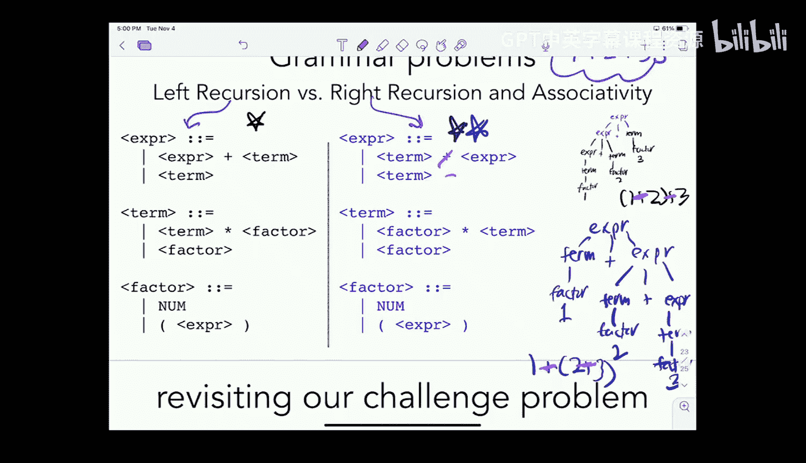

I don't think they're going to spend a lot of time on parsing， parsing is weird。

