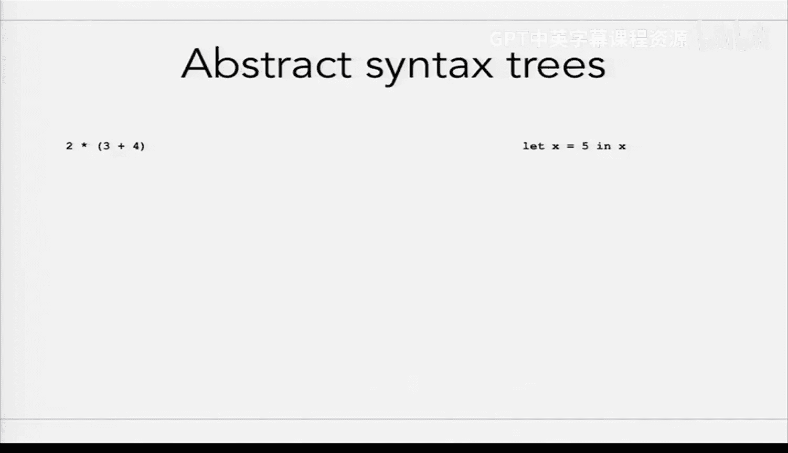
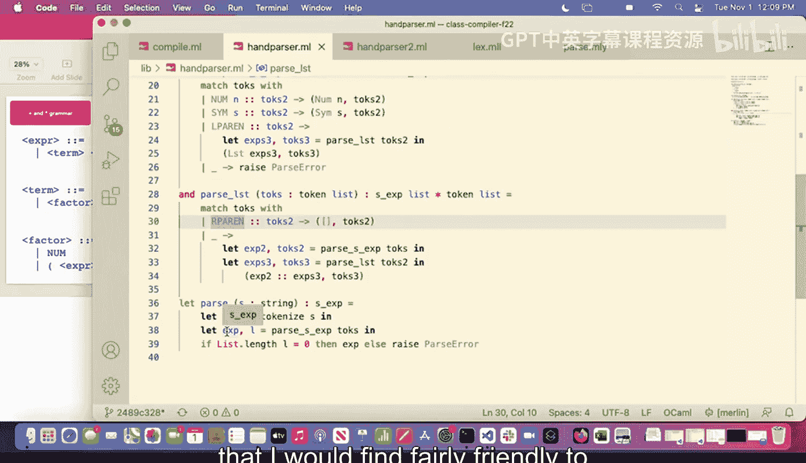
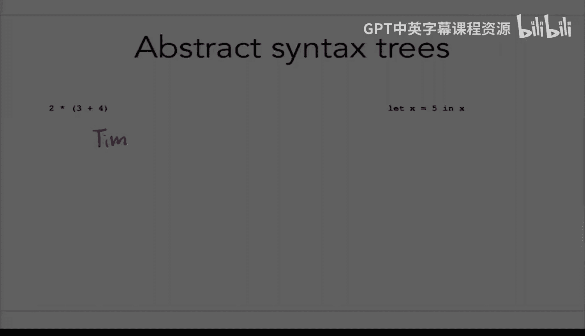
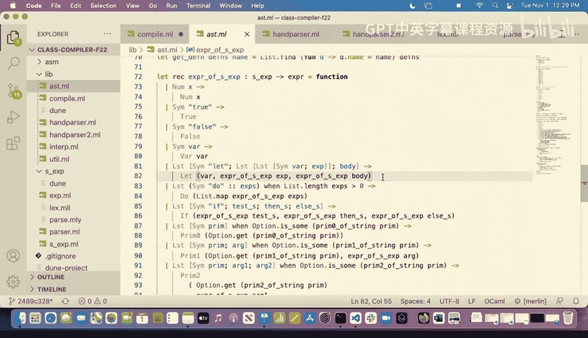
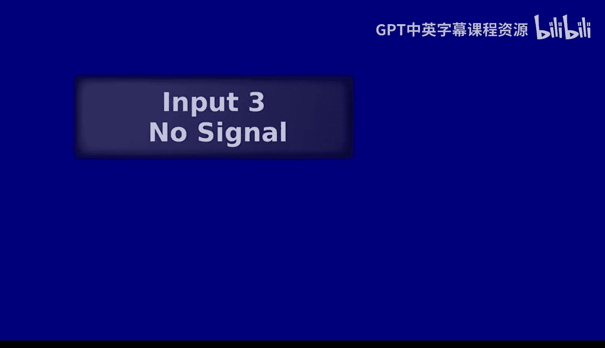

# UCB《编程语言和编译器｜CS 164 Programming Languages and Compilers 2025》中英字幕 p20 -P20-Lec 19.5 - Parsing - Part 3, Reproduced for Fall25.zh_en -BV1zQ27BeEfF_p20-

But basically， what this is going to look like is one plus。2 plus3。没有。For this program。

That probably looks fine， right。Because this is plus， this is addition。 That's kind of all right。

 But what if。This was， in fact。Minus instead， right， What if we weren't using。The plus signs。

 what if it was minus minus。All of a sudden， that's maybe not looking so good。And so again。

 I do want to encourage you to think about this as you are doing your own par and homeworks。It's。

 it's sort of interesting， right， because because。Having it be less recursive probably feels more natural。

 right， It makes our operators less as。Which is basically what we would normally expect。

But there are ways for us to go ahead and sort of reshuffle things in order to make sure that we end up with the right behavior in cases like subtraction。

OK。啊。I want to briefly mention。I'm not going to have us take time to do this today because I think otherwise we'll run out of time。

 but I do encourage you at some point when you're， you know， in a bored moment。

 pull out our challenge problem and think about if you can write。

A context for grammar that is going to handle this challenge problem that our regularly express。OK。

I want us to move on to thinking a bit about what's coming out。Of our parsers。

 But this was all I was planning to say about the， the various problems with our grammars。

 So if there are questions about。The kinds of problems we might run into with grammars that make it hard to write recursive descent parsers。

that would be a great time to chat about。So I sort framed these as being the cons of doing recursive descent parsing。

 right， because all of these things， the reasons we've been having to make these changes is so we could write that style of parser that we wrote last time and the style of parser that we saw today for。

The addition and multiplication grammar。If we had chosen to write， say a bottom up parser。

Let refresh no problem。 right， Like this is the kind of thing it wouldn't actually be an issue if we were trying to。

 to write one of those other styles of parser。 But for the style of parser that at this point。

 people have more or less settled on， this is the kind of thing that。

But it seems like we're feeling pretty okay about how we fixed。Grammar problems， is that right？2是。

Switch over to talking about。Let's look at the other screen for a moment while I pull up the new whiteboard。

Here we go。 All right。I was switching over to thinking about what's coming out。Of our parser， so。

We actually doing as we were sort of building up this tree of recursive calls。To our various helper。

Was building up sort of our representation of the parsse street。

Each of those choices that we were making inside the execution of the program corresponded to choosing a particular production rule。

And going down a particular branch of that parse tree。

But if we take a look at what was actually coming out。Was it a parsse street？

So let's actually， let's take a moment to look at。

What we're getting out and let's look at the one that we're maybe most familiar with since we spent more time with this。

So what were we actually getting back。At the end。RightWe parsed in this expression。

 We did all of those recursive calls。And then what was actually coming out？

Okay Cam can conveniently tell us。Yeah， it was an S expression， right， It wasn't a parse tree。

It was an S expression。 It doesn't keep all of that history of what production rules we use。

 wasn't keeping all of that other stuff。 Instead it was all those things that we have been sort of going through and recognizing the inside compiled on M or interpret that M where were saying。

 oh， okay， we've got this if symbol that's to start。 And then we have other。

 That's the expression that we're actually going to use as a condition for our F right。

 That's the kind of thing that we're getting out rather than a parse tree。And so so far。

 what we have seen。Basically， this this representation specifically of。Expression。8。Super nice。 Like。

 we've seen what the code looks like as we are operating over these S expression representations。

 I mean it's certainly more friendly than strings。But you could imagine something that would look。

Quite a bit nicer， right， So here， let me， let me draw out something that I would find fairly friendly to actually process as a compiler writer。

 so。

Maybe， oh， I didn't switch it。没掉。I remember the one。

Okay， so here we go。系。That are times。冇清。我。And。Right that， to me。

 looks much friendlier than the kind of stuff we've had so far。 right， where it's been like， okay。

 we're gonna have this list。 And then this list， we're gonna to see this plug。 gonna right。

 We had all these sort of layers and layers of stuff that we were working through。In fact。

 when we were， we were dealing with something like the。呃呃。Variable binding。

 right when we're when we're doing less。We had even the， the representation that， okay。

 there's this one list。 And then inside that， there's this other list。

 And we still had all of that detail just because of the way it had been written with the parent parent。

 right。I of don't care about that。 By the time we're actually trying to generate assembly or actually do our interpretation process。

 the fact that it happened to have been represented in the the original input program with those pers around those particular parts。

don't reallyally care。 We might like something that is actually。

Just representing sort of the actions that we need。The core of what the language is。So， here。

I might like it to be， instead of。What we've had previously， I might like it to be something like。哦。

5。And there X right， something like that。That seems a bit friendlier than the thing that we've been doing where we have。

 okay， here's our list。 And then here's our list inside with all that stuff。And so this might be。

 be something that we would prefer。 And this is what we call abstract。Right。

 so let's go through each of those。In part， So trees， I think that's pretty obvious， right， Like。

 we're sort of keeping that structure of the program by encoding this as a tree。

Extract in the sense that we are getting rid of some of the detail we had in the string representation。

So maybe we did end up seeing that let with all of the parentss here。

 We're actually seeing a different syntax， right， but we might have also written。

It we might have written。So it could have been that other way instead。

But what we're seeing now is sort of the abstracted version of that。

 where we have alllighted some of those details。We're not seeing every single preen or space that appeared in the input string。

 We're still seeing， however， the program essentially as it was laid out。

 so we haven't done any extra processing so far。To actually sort of change the shape of the program。

 And in that sense， it is still。O。So， let's go ahead and。Think about。The。

 the way we might like to represent programs in order to actually process them。

 But let's also think about what would be the appropriate way to represent this same information if we had our old version of our let syntax instead of this version。

 So take about。Take about 20 seconds to discuss with a neighbor。

 Should we change this representation if we are using our scheme style syntax。Okay， so do we think。

Use the same representation， humphreria。We better change something home for better change。Yeah。

 so this is kind of an interesting question， right。

All of the information that we need in order to do either compilation or interpretation。

 is it present here。Hm for yes。Comfor now。Yeah， I would say this actually has everything that we actually need。

 yeah。Go ahead and hold that question because we are going to see that it， in fact。

 does support that。 We're going to see an example later today。O。搜。What I would say is， you know。

 this is basically something that we could drop in as a substitute for what we've been using so far。

 because what we've been using so far。Is an abstract syntax tree。

 but is an abstract syntax tree for S expression。And there's no reason we shouldn't have abstract syn textureries that are actually specialized for。

The language that we're actually supporting， right， This is sort of a cleaner representation。

Comped to what we've been processing over so far。Emphasize is that there's no reason。

That we should change it， even if we are changing the syntaxt。

 as long as we have all of the key information that we need in order to do either compilation or interpretation。

Its totally fine， right， So this can go to the tree， and this can also。Go to this street。 And。

 in fact， I want to briefly， yeah。 So here's sort of the compiler components that we talked about。

Early on， or I don't even know the first couple weeks， something like that。

And what we talked about was that。We in the middle here。We have this A S T， right。

 this representation that is coming out after our total。But here's left。This par。I down。

And so those are sort of the， the core components that we cared about。

What I want to emphasize here is that we can come in and have a totally different source code。Right。

Totally different Leir。左边。Have totally different parse。And then， still go。To the same A S T。In fact。

 that's exactly what you're going to be doing in the homework， right。

 Where previously what we have been doing has been using this very scheme like。Syntax。

What you're going to be doing in the homework is putting in this more oammely syntax。

And then still pluglucking it into the same exact compiler。

 because it is going to be the same underlying language， even though the syntax is changed。

And so this is where we're really going to be wrestling with the fact that the syntax is different from the language。

The way that this program looks， the particular strings that you write in order to get it accepted by the parser。

That is separate from the meaning of the constructs in the language。

Which is why we can do this thing where we actually have the same A S Cs being consumed。

 That's going to be turned into instructions in the exact same way。

 But we can have these two separate syntaxes that look totally different。Right。

 so maybe this one is the flat。Got that that right。 And this one is。X equals5 n。

And there's no reason that we shouldn't have both of those feeding into the exact same vacuum。

So here's our back。The code Gen assembly。Are there questions about this idea？

But the idea that the syntax that we are using for our language is actually totally separate from the meaning of the construct。

This is going to be a really important idea。Cool， seems like we're cofy with that。

So given that we want to maybe produce for ourselves some nicer abstract syntax trees。

 I'm going to ask you to take。How much time do you have。

 I'm gonna to ask you to take about a minute and a half with someone nearby to draw what's an abstract syntax tree you might like for these。

 right， There's no one true answer。 There's no one right way。 but like。

 what is all of the information that you're going to need in order to actually。

Do the compilation of the interpretation of this book。Okay， I'll turn out something that I like。

To have all sort of the， the key things that I would need in order to actually make sure I can run it。

Anything that we feel like is missing from the representation I came up with？哎，我喂欧呀。

Could we say foolproof bull foster， Yeah， we get a lot of choices here in terms of what we actually want to use。

ToRe。I'm going to show you how we actually do it right in the code base as well。Okay， so let's。

 let's write out something for， our next example here。 So maybe we come up with something like this。

All right we've got these two prints going on well what are we printing，'s got a number3 sheeter。

Aologies was always from my terrible。Hwriting。さてもいいた。

I would argue that this is giving us all the information。进行一。In order to， to do the compilation。搜。

If there's anything wrong with using the S expressions， the ASPs for S expressions。

 right that has taken us super far。We can now have this really much more convenient。

AT that is actually customized for a language。We're going to be making this shift for a couple reasons。

 So one is that the interpreter and the compiler are going to be much cleaner。But the other。

Is that this is the kind of AS T that you are going to be producing when you write your own parsel for the homework。

So you， you're going to write the person for that ML cell syntax。

It is still going to be for our language。 right， It's the exact same language。

 You won't have to change anything about how we are actually generating code。

 The meaning of constructs will still be exactly the same。Only this impact。Alright。

 so here I want us to take a look at。We're doing， which is going to be a little wacky。So。

Because we actually already have set up in our， in our program。A way of grabing out S expressions。

 ASTs for S expressions， what we're going to do is actually have something that converts from the S expression AST into this kind of AST。

In homework 7， you are going to parse things directly。Into As S Ts of this type。

 you're not going to do that intermediate of getting it first to an S。And then getting it into an。

But we're going to do this funny thing of going ahead and actually transitioning from the Sssexpress。

see into the。嗯。Take a look at how that actually。So。Look at。What's right at the clothing。

You know your。And we've made。They change。 So here's our ASC do M L。And I want to look at。

This part in particular。 So this is our important new type， right。

 We always start when we are writing hero， but we almost always start by writing some important new types。

 And this is the important new type that we are going to be processing now。Instead of Essex。

And so this is gonna look somewhat familiar in a lot of cases， right。

 So no of it probably looks pretty familiar。True is just true falses。F， but when you also。

Its looking a little bit simpler than they used to in some cases。

So this looks a lot like those trees we just drew， right， So this do we had the question earlier。

 could we handle an arbitrary length list？ And， yes， right， So here we go。

 we've previously seen how we can do construction。Ls and here we have an example where the de can have any number of expressions inside that list。

have it。嗯。This is how we're going ahead and changing it。

 it's now going to look a lot like those drawings we just made on the whiteboard。

And this is going to make our compiler and our interpreter quite a bit nicer。

 So let's go ahead and take a look。At how they work。Let's went ahead and actually made the changes。

 but I'm going to highlight sort of where they show up。So now。

 instead of doing the thing where we're saying， okay， list， and then the particular string call。

All that kind of thing right now we just say， okay。When we see the。

 the kind of node that looks like a call node and it's going have F and Rs right。

 even kept all those names the same， right， We used F and R previously when we were looking through。

Structure of the Ess。We're doing the exact same thing here。

 except that we have this node that is customized to represent。And we see the exact。In hour。Cperter。

Somewhere。Well， if we take a look through， we can see， okay， yeah we're doing。And this actually。

 this is getting us a couple things。So I want to emphasize one thing in particular。呃。

Go down to the bottom here。You may recalled it previously。At the end of our call expert。

We had a case that looked。Something like that。Well， now if we tried to actually compile this。Okay。

 I would say， hang on， we can never get。To this， right， we have actually now。

 by switching to this representation。Persuaded O Camml， that we are exhaustive， right。

 Everything that can appear in this language， we have handled that。

So there's going to be some sort of weirdness in making this transition I know because we've gotten pretty used to the way this has been structured previously。

And now， when we are adding new stuff， Well， there are a few additional changes we're going to have to make。

 in addition to changing the compiler of the interpreter。

 we also may have to make sure that our A T is actually representing the kinds of new features that we want it to actually represent。

 So if we add in some。You know， new language feature that we haven't previously supported。

 We're going to have to go around in here and say， okay。

 here's how it should actually be represented。In our AST。

 and here's how we would actually turn an S expression of that kind into。

You can see where we're actually doing this， right this is incredibly boring。

 but it's just doing all of those same old matches that we used to do。Instead。

 producing the nice representation of it that we want to。

And this is the same kind of representation that you'll be generating year。OK。

I think that is all I wanted to show you about how the code base has changed。

 I know this is going to look a little weird at first as we are going through examples。

 and we're starting to see。That it looks a bit different。

 but hopefully it looks pretty familiar in terms of the actual information that we're manipulating since that is all the same。

呃， are there。Questions about any of the content from today。诶我得。Yeah， so the question was。

 is an S expression， S expressions that we've been manipulating so far， Are those also A S T， And。

 yes， absolutely。 So that is an A S T for S expression。

So it's also totally reasonable to think of that as an AS T。 It absolutely is。

We can create one that is going to be more friendly to deal with。

 That is going to represent all of the constructs in our language， sort of more sustain。

And so we have chosen to do that。 But there's nothing to say that we shouldn't use something like the previous S expression AS SP。

That is also totally fine。 It's just going to be a bit prettier to use an ASC that has customized to this language。

And the other reason that we might want to make this transition is when you're doing your homework from work 7。

 I think is， is the number where you are actually using this alternative syntax。

 It would be kind of weird。To parse that syntax。Get sort of that underlying representation。

 get something that's basically just extracting out the information about， okay， this is a call。

 And this is sort of the arguments that we are making right that kind of thing。

 And then sort of backwards engineer that into an S expression format。

 even though it didn't come in as an S expression。 It's not that you couldn't do it。

 You absolutely could。 But it seems a little unnecessary。

 And so we have this sort of nicer higher level representation。Be using going forward。

Said that you will not directly to。303。But yes， it is also。Totally reasonable think。

Do have other questions。so this was a question about left recursion and sort of where we left things with left recursion。

And basically， did we just decide， okay， let's， let's design it in such a way that it is right recursive。

And then we're going to have to do something to handle the fact that it is right recursive and associivity is screwed up now。

Is that the question。Yeah， so that's exactly where we left it。 So we've said， you know what， we。

 we know that we're not going to be able to write the kind of parser that we have been planning to write。

 this recursive descent parser。 if we leave it in this left recursive form。

We know that we can write that kind in our right request。

But it might do wacky things with how things are associated。And。

Get ready to rest it and number something。So that's basically really。

Yeah， so do be on the lookout for that as you are tackling the homework。

And an arbitrary number of A's followed by the exact same number of Bs。It is not possible in reject。

 The question was， is it possible in context re gramar。

