# 编程语言和编译器：20：一等函数 - 第一部分 🚀

在本节课中，我们将要学习如何实现“一等函数”。这意味着函数将像其他值（如数字、布尔值）一样，可以被传递、作为参数使用、从函数返回，并存储在数据结构中。我们将分阶段实现这一功能，今天首先关注将函数作为值来使用。

## 概述

上一节我们介绍了如何将S表达式转换为更接近我们语言内部表示（AST）的格式。本节中，我们来看看如何修改我们的解释器和编译器，以支持将函数作为一等公民来使用。

## 修改抽象语法树（AST）

为了支持一等函数，我们需要修改AST的表示。目前，函数调用（`Call`）的第一个参数是一个字符串（函数名）。但现在，这个位置可以是一个任意的表达式，其求值结果应该是一个函数值。

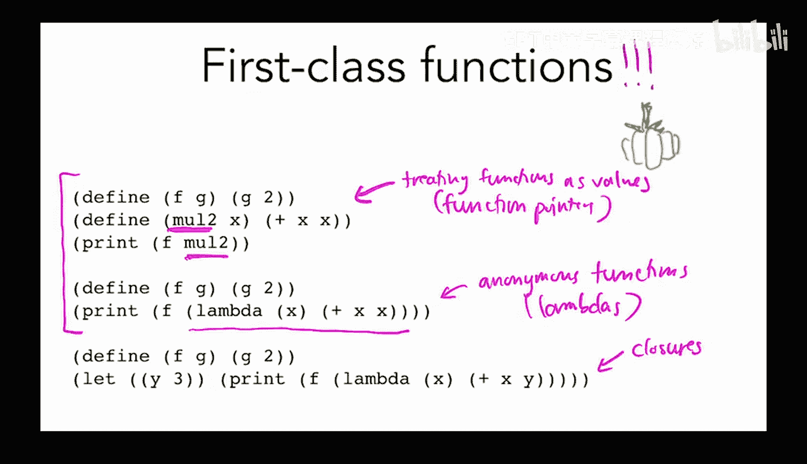


以下是需要修改的AST定义：

```ocaml
(* 旧的AST定义 *)
type expr =
  | ...
  | Call of string * expr list  (* 函数名，参数列表 *)
  | ...

(* 新的AST定义 *)
type expr =
  | ...
  | Call of expr * expr list    (* 函数表达式，参数列表 *)
  | ...
  | Function of string          (* 新增：函数值构造器 *)
```

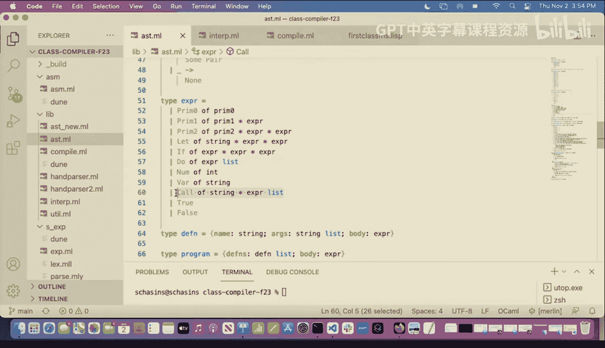


这个改变意味着，在函数调用中，我们不再直接查找函数名，而是先对第一个表达式求值，得到一个函数值。

## 更新解释器

现在，我们需要更新解释器来处理新的`Function`值，并修改函数调用的逻辑。

### 添加函数值

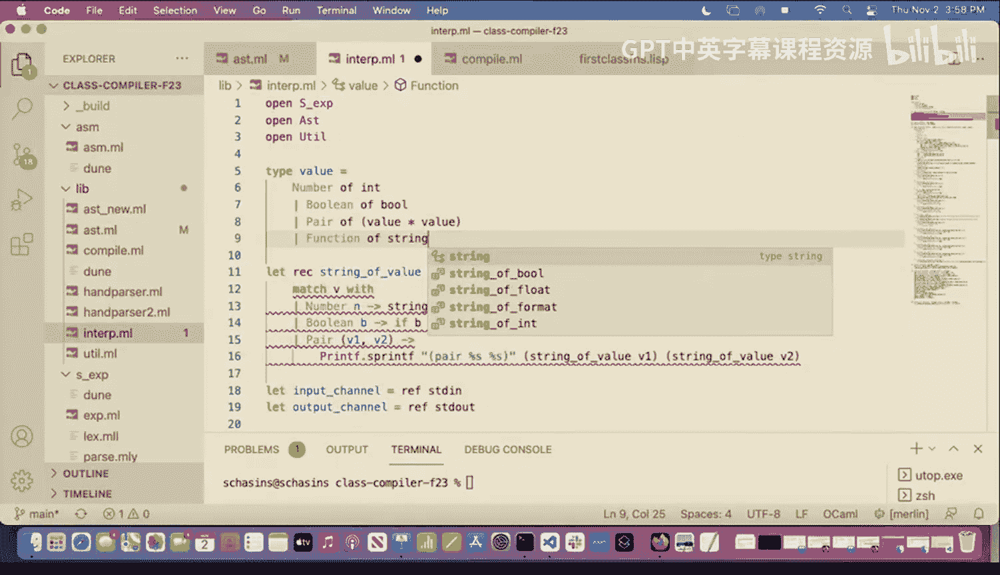


首先，我们在解释器的值类型中添加一个新的构造器来表示函数值。

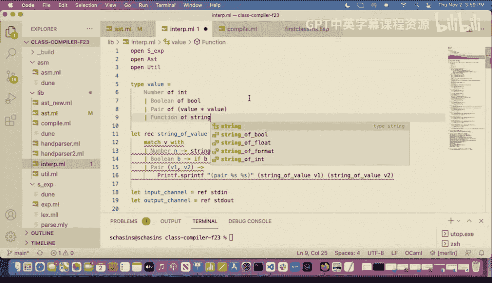

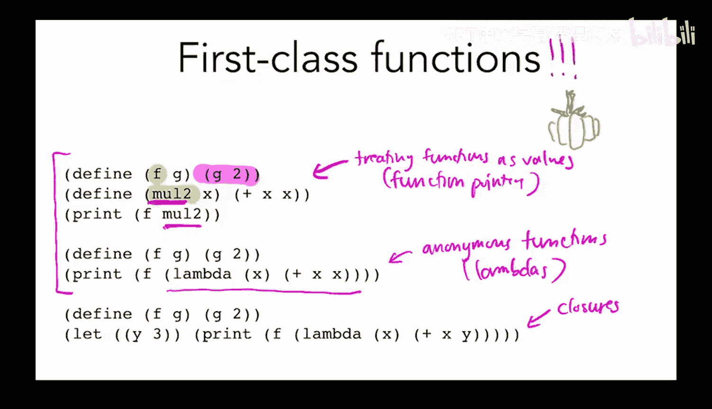

```ocaml
type value =
  | Num of int
  | Bool of bool
  | Pair of (value * value)
  | Function of string  (* 函数名 *)
```

### 修改函数调用逻辑

函数调用的逻辑需要改变。我们不再假设第一个参数是字符串，而是先对它进行求值，然后检查结果是否为函数值。

以下是修改后的函数调用处理逻辑：

```ocaml
let rec interp_expr (defns : defn list) (env : value Symtab.t) (e : expr) : value =
  match e with
  | ...
  | Call (f, args) ->
      (* 1. 对函数表达式 f 求值 *)
      let fv = interp_expr defns env f in
      (* 2. 检查 fv 是否为函数值 *)
      (match fv with
       | Function name ->
           (* 3. 查找函数定义 *)
           let def = List.find (fun d -> d.name = name) defns in
           (* 4. 对参数求值 *)
           let arg_vals = List.map (interp_expr defns env) args in
           (* 5. 创建新环境并求值函数体 *)
           let new_env = List.fold_left2 (fun env param arg -> Symtab.add env param arg)
                                         (Symtab.empty) def.params arg_vals
           in
           interp_expr defns new_env def.body
       | _ -> raise (BadExpression "试图调用非函数值"))
  | ...
```

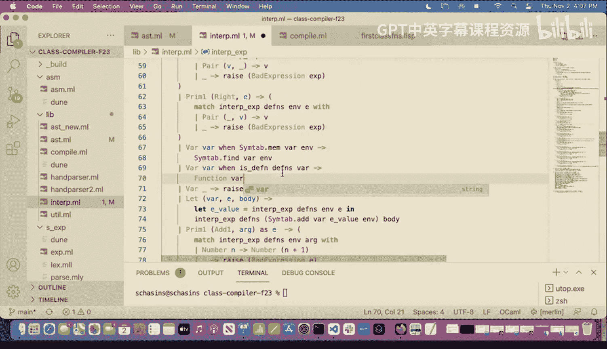


### 处理变量引用

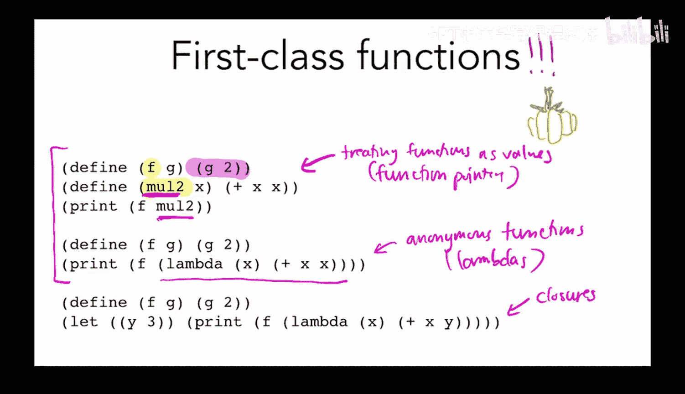

当解释器遇到一个变量名时，它首先在环境中查找。如果找不到，现在需要检查它是否是一个顶层函数名。

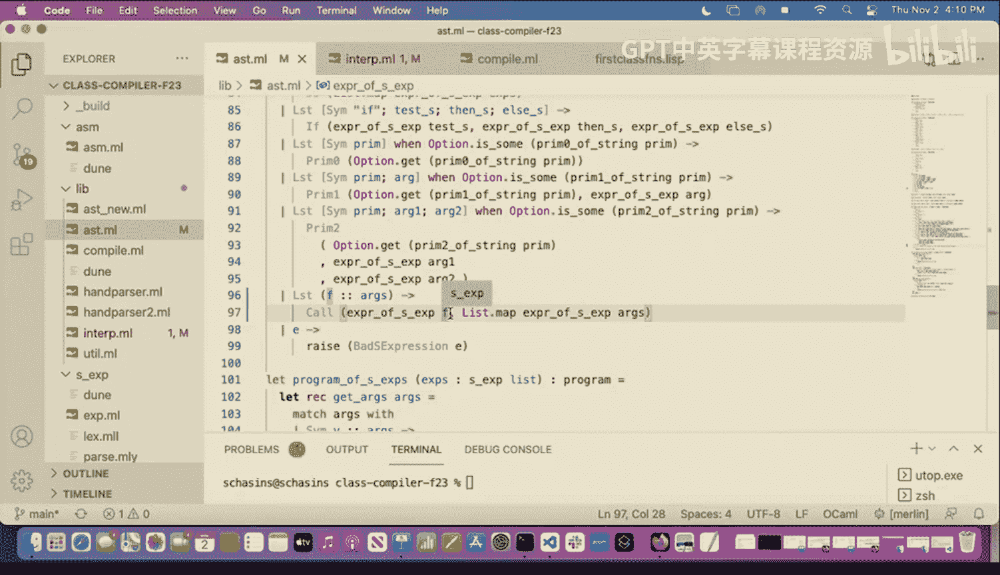

```ocaml
  | Var x ->
      (match Symtab.find_opt env x with
       | Some v -> v
       | None ->
           (* 检查是否是顶层函数名 *)
           if List.exists (fun d -> d.name = x) defns then
             Function x  (* 返回函数值 *)
           else
             raise (UnboundVariable x))
```


## 更新编译器

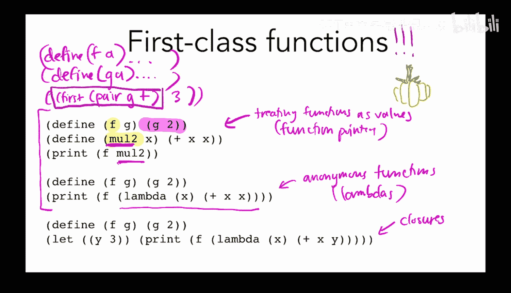


编译器也需要进行类似的修改。我们需要一种在运行时表示函数值的方法，并修改函数调用的代码生成。

### 运行时表示函数值

我们决定使用函数代码的起始地址（标签地址）来表示函数值，并使用一个特殊的标签位来标记。

```ocaml
let function_tag = 0b111  (* 例如，使用最后三位作为函数标签 *)

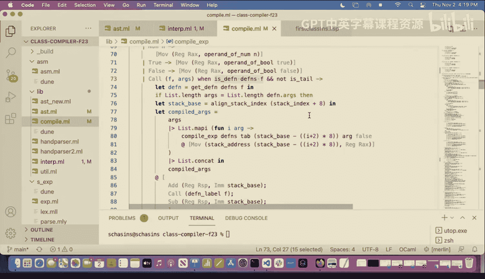

let ensure_fn (rax_reg : reg) : directive list =
  [ Mov (R11, rax_reg)
  ; And (R11, Imm heap_mask)  (* 检查标签位 *)
  ; Cmp (R11, Imm function_tag)
  ; Jne (Label "error_not_function") ]
```


### 修改函数调用的代码生成

编译器中的函数调用生成也需要改变。我们不再直接跳转到一个已知的标签，而是需要先计算函数表达式的值（它现在在RAX中），确保它是一个函数，然后进行调用。

以下是修改后的非尾调用代码生成逻辑：

```ocaml
let rec compile_expr (defns : defn list) (tab : int Symtab.t) (stack_index : int) (is_tail : bool) (e : expr) : directive list =
  match e with
  | ...
  | Call (f, args) when not is_tail ->
      (* 1. 编译参数，将它们压入栈中 *)
      let compiled_args = ... in
      (* 2. 编译函数表达式 f，结果在 RAX 中 *)
      let compiled_f = compile_expr defns tab (stack_index - 8 * List.length args) false f in
      compiled_args @
      compiled_f @
      [ Ensure_fn Rax ] @          (* 确保RAX中是函数值 *)
      [ Sub (Rax, Imm function_tag) ] @ (* 去掉标签位，得到真实地址 *)
      [ ComputedCall Rax ]         (* 调用RAX中的地址 *)
  | ...
```

尾调用的情况也需进行类似修改，使用`ComputedJump`。

## 测试新功能

经过以上修改，我们的语言现在支持将函数作为值传递。例如，以下程序现在可以正常工作：

```scheme
(define (f g) (g 2))
(define (m2 x) (+ x x))
(print (f m2))  ; 输出 4
```

我们也可以给函数起“别名”：

```scheme
(let ((new-name m2))
  (print (new-name 5)))  ; 输出 10
```

## 引入语法糖：匿名函数（Lambda）

我们目前已经实现了将已命名的函数作为一等值。但许多现代语言也支持匿名函数（通常称为lambda表达式）。例如，我们想这样写：

```scheme
(map (lambda (x) (+ x 1)) (list 0 1 2 3))
```

而不是：

```scheme
(define (inc x) (+ x 1))
(map inc (list 0 1 2 3))
```

### 实现策略：脱糖（Desugaring）

我们不需要修改核心的解释器或编译器来支持lambda。相反，我们可以将其视为一种**语法糖**。我们可以在将源代码转换为核心AST之前，进行一个额外的“脱糖”转换。

我们的新编译管道如下：
1.  字符串 -> 词法分析/语法分析 -> **扩展AST** (包含 `Lambda` 节点)
2.  扩展AST -> **脱糖转换** -> **核心AST** (将 `Lambda` 转换为顶层函数定义)
3.  核心AST -> 编译/解释

### 定义扩展AST

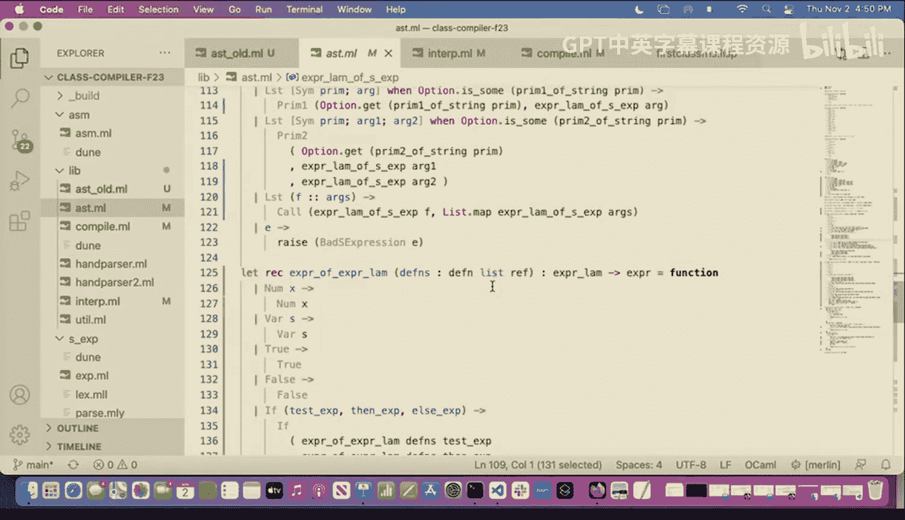

我们创建一个新的AST类型`expr_lambda`，它包含所有核心表达式，外加一个`Lambda`构造器。


```ocaml
type expr_lambda =
  | Num of int
  | ...
  | Call of expr_lambda * expr_lambda list
  | Lambda of string list * expr_lambda  (* 参数列表，函数体 *)
```

### 脱糖转换

转换函数`expr_lambda_to_expr`负责将`expr_lambda`转换为只包含核心特性的`expr`。对于`Lambda`节点，转换步骤如下：
1.  生成一个唯一的函数名（例如，使用`gensym("lambda")`）。
2.  将这个新函数（包含参数和转换后的函数体）添加到顶层定义列表（`defns`）中。
3.  在`Lambda`出现的位置，替换为一个对该新生成函数名的引用（即`Function name`值）。

这样，在后续的编译或解释阶段，这个匿名函数就被当作一个普通的顶层函数来处理了。

## 总结

本节课中我们一起学习了：
1.  **一等函数**的含义：函数可以作为值被传递、存储和使用。
2.  如何通过修改AST、解释器和编译器来支持**将命名函数作为值**。
3.  如何通过**脱糖**技术来支持**匿名函数（lambda）**，而无需修改核心的解释和编译逻辑。我们引入了一个包含`Lambda`节点的扩展AST，并通过转换将其提升为顶层函数定义。

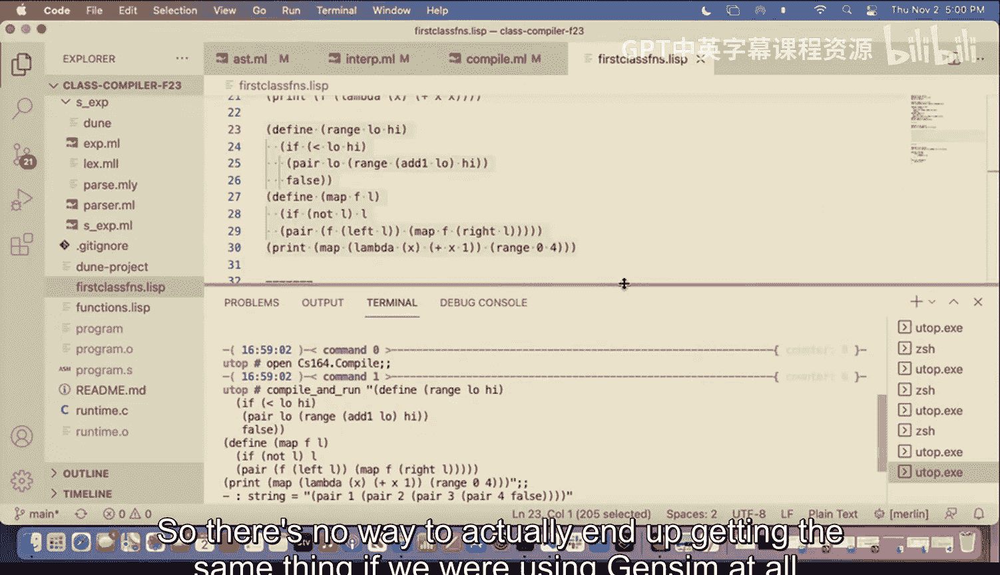


通过分阶段实现，我们成功地为我们的语言添加了强大的一等函数支持，这是构建现代编程语言的关键一步。下一节，我们将探讨更复杂的概念——闭包。