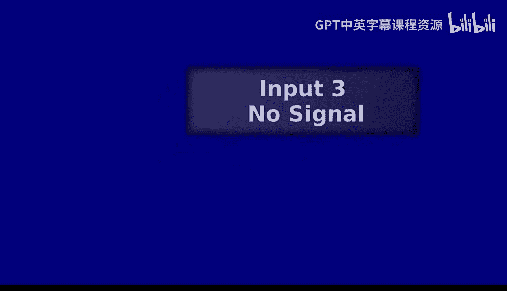
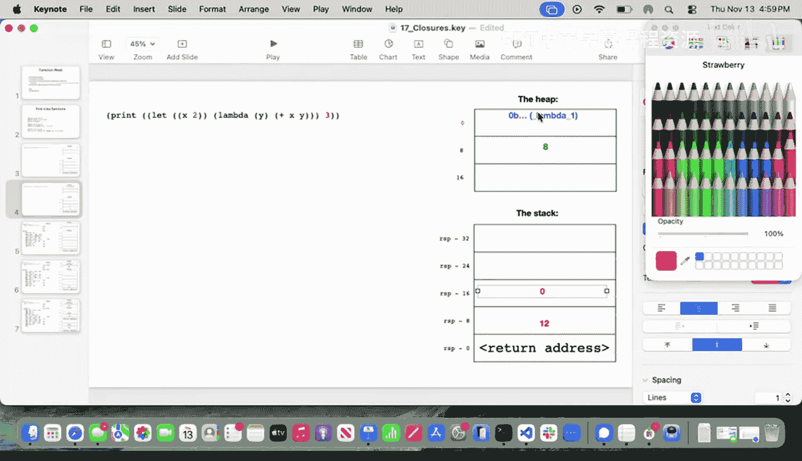

# UCB《编程语言和编译器｜CS 164 Programming Languages and Compilers 2025》中英字幕 p22 -P22-Lec 21 - First Class Functions Part 2.zh_en -BV1zQ27BeEfF_p22-

Back and forth well， it comes from that whole calculation， but if you looking at it。

 it' you can see it's moving back and forth around L over two。 Yeah。

 I'm just trying to think about what's actually going。icallyI know it's kind of crazy。

 isn't it's just that it doesn't？It's。It doesn't。 It doesn't。

Stay in the middle because you have a superposition of many of the two states。

 Right So that's the key that you're。Is that yourre two stationary state superimposan？And no。Right。

 right， isn't that any？So if you take an energy measurement， which I didn't really do。

 but if you have。So you have C1。Because that's what I was doing。If I was looking at that。

 then what happens is that。If you normalize them you get that and so what you do is you interpret this as the probability you measured。

 say the energy and the energy for that， and this would be the probability that you measured。

 this is the probability you measured the second energy it's pretty neat。

That's why these things are great is because it's like，huh。Thank you。

 quantum mechanics gets very strange。Thank you very much。 Have a good weekend。Your turn， how are you。

 Liam？You look like yourself're。Let me put this away so I don't get any。Trouble。Yep， and I have the。

Midterm solutions out so we can go over them if you'd like。

 but I just need to put this in ready before they lock。That is a classic exam problem。

 that second one that you're thinking about。No， it。It。Didn't quite。Click with you， but other people。

Did get it。And I had a discussion with Drve about your discussion with Drve。So， I know。forth。

Just saying that Ive already had that discussion。Because anyone was structure。这么着。被告诉人。最好世界月 onlyly。

哎。Okay。Hello everybody， happy rain day， It is rainy out there， I'm so sorry。

 congrats everyone on making it in。嗯。Okay， a couple of quick sort of logistic key things before we dive in on content today。

 So the first one is our usual like drill chat， But I don't know。

 Maybe we wantna go with like mid semesterster survey first。 Let's do that one first。

 So there are a couple of things I wanted to talk about from the mid semesterster survey。

 the main one is there have been a few questions about how to use lecture lecture sessions most effectively。

😊，So I think usually this question comes up most often if folks haven't been doing the activities during。

 So okay， backing up like if you went through and you were able to like do the midterm with really very minimal studying before actually the midterm because you sort of following along the whole time。

 fantastic。 You're already using the lecture sessions effectively like don't worry about it。

 don't change anything。 On the other hand， if you like， okay， actually。

 I would have like to feel a little more comfortable with the content before diving in on the midterm。

 Usually that is gonna come from not having been doing the activities and what I say the activities。

 I don't just mean like when were doing the worksheets。

 I also mean when we're like turning to a friend talking through it。

 like having a little chat with folks nearby about some sort of prompt that we're thinking about。😊。

So that would be the first thing is go ahead and try like when we're like if you're watching the recording or whatever。

 I know you all aren't watching the recording， but if you're watching the recording or whatever。

 actually pause when we do the pause and like wait until you've come up with an answersw doesn't have to be the right answer until you've come up with unanswered and then continue So that would be my first tip The second tip is if you're like okay that's all great。

 but I actually I want to do even more， I want to get even more out of these My second tip would be treat the process that we have done up on the sort of compiler screen here treat that as now a little mini assignment right like yeah you've just seen the answer key。

 you've just seen how we would do it but test yourself。

 did you really understand the implementation test that we've just done in which case can you go ahead and actually reimplement that task yourself go ahead and just check out the current version of the class compiler obviously there is a link to that on the course website So go ahead and just check out the current version go through and do。

😊，Those implementation changes yourself。If you have reached the point where you can do those implementation changes yourself。

 fantastic， you are in a really， really good spot。I think that was the number one thing I wanted to talk about。

The other big question that came up was if we're going to release practice exams before the exam happens。

 Yes， absolutely。 if we're going continue to have。呃呃。

Office hours and all that kind of thing during our week， yes absolutely。

 are there any other mid semesters survey feedback things that folks would like us to chat about？

That be cool。If something comes up later， bring it up to me to the break， whatever we can chat。

The other thing I wanted to chat about was drill stuff。

 familiar old drill stuff since we didn't actually have a Tuesday。 we only have a Thursday this week。

 so。😊，The， the main question that was coming up from drill was about basically what's up with these AS S T things。

 right， Like， why are we doing this， Is this good， What's going on with this new A T change that we have made。

And I think there's a couple of different answers to that question。

 depending on sort of what version of the question people had in mind。 So the first answer is， okay。

 we've been dealing with an As T this entire time， right， So， yeah。

 it's been this sort of generic As T that's for S expressions writ large， right。

 S expressions can express all kinds of different things。

 And so it wasn't an As T that was super specialized for。

Our particular programming language of choice。 But it was an As T that， know。

 had the information we needed about the things that we were going to go ahead and implement we talked way back when about how dealing with a representation like that is going to be easier than dealing just straight up with strings like way back in like the first we maybe the first couple of weeks we were like dealing with it with strings would be really annoying having this As T representation。

 even though those As T for S expressions was gonna be that easier。 But。

 then there's the second version of this question that was， okay。

 it seems like we were fine with the As T for S expressions。

 Why are we bother to do this new different As T that is specialized for the particular programming language that we're working with。

 And I think that's probably the question that most people intended to ask when they when they were wondering about that。

 So let's take a look at。Our compiler。嗯。So， here we go。Possibly here we go。

嗯嗯。All right， there we go。Yeah， more or less， okay， great。😊。

If we take a look at what has changed now that we have our nice specialized AST， in some ways。

 it's not actually that much right like when we made that change。

 everything that the compiler actually does， the code that it actually emits all of that stayed the same right that sort of output that we got for any given valid program。

All the same。There were some things that actually changed about the behavior in particular。

 if we take a look down here， we can see we no longer have this， if we got any other S expression in。

 we need to go ahead and raise an error right we can know that we have covered all the cases right It is enough if we have covered everything that appears inside Ast do Ml right we've got our or sort of representation of what our expressions can be。

 if we know that we've covered all of those fantastic， we're done。

 we have implemented the language So that's one way that it did change。

 we no longer have this thing where we're during compile time raising this error if something doesn't fit in right we know that we have covered every case。

😊，But the other thing is this is， at least to my sort of taste， somewhat easier for us to read。

 right， we can go through and we can see， okay， this call thing， it's got these。

 this particular name of the the function that's being called。 It's got the arguments， right。

 we're sort of representing all of that in ways that are relatively easy for us to read。

 You might remember that way back when we did let binding， right， So let's go look for let here。😊，呃。

What do we actually call it now， I don't remember if we went through and did the thing for let binding way back when。

We had this thing where we were actually going ahead and having to remember that we had a list inside a list because that was how we were actually representing the the name。

 the fact that we were going to potentially have multiple names that we binding to multiple values the way we had that was that would all each of those would be one list item within a larger list and then we would group each of the individual items with the name they were being bound to with an additional list and so every time we were sort of having to go into okay well there's this list and then there's the nested list and then we're grabbing out the individual items and that was a pretty annoying way to do it that was just sort of an artifact of how it could be written down in S expressions。

 which we didn't really need to know about in order to generate the appropriate assembly and so we're getting away from some of that and that's the big thing that we were trying to do as we use this AST representation。

But then the other thing that I will draw attention to is， okay。

 when we went ahead and started making。This kind of。Program work。 Okay， yeah。

 we did have to actually change our compiler。 We had to do some new codegeneration in order to be able to treat our functions as values。

 right here we are， recalling F on a particular argument。 that argument is itself a function。

 in order to do that， we had to change our compiler， we had to do some new codegeneration。

 But then when we did the transition from that to this to having anonymous lambdas right。

 we actually didn't change anything about compiledl。

 We were able to do all of that by just changing the Ast representation by doing an Ast to ASt transformation based on what was sort of going to be convenient for us at the time。

 And so we went ahead and had this thing where we introduced X lamb。

 which went ahead and actually had the use of a lambda and then we made something that would actually do the transformation from the thing that involved the lambmbda to the thing that didn't involve the lambda。

 right， we got rid of those lambdas and replaced it with just something that does already exist。

Our standard expert AST， and that was a way of us actually implementing a new language feature as syntactic sugar。

 an existing language feature， but with sweeter syntax。

 were able to go ahead and do that without having to change anything about our code generator and so that again gets us some of the ideas about why we might want to be manipulating AST representations and having a variety of AST representations that we are using for various different purposes。

😊，Okay， are there questions about that before we dive in on sort of more of a proper review of what we've just been doing with implementing first class function。

Okay， cool。 In that case， let's remind ourselves of what we have done with implementing first class functions so far and why we have done it。

 So here we are。😊，We wanted to start with a program like this that might say， okay。

 I want to be able to use M2 one of my functions as a value。

 I'm going to have it be the argument to F here。And then maybe also a situation like this where we go ahead and we have this M2 function。

 but we also want to sort of rename it。 so we give it this new name。

 and then we want to go ahead and be able to call it according to that new name。

 All of this is about treating our functions as values。 and so the change that we actually made。

 We can go down here and look for ver， ver。Yeah， great。 So when we actually have， oh。

 let's get rid of that stuff。 Great when we have。😊，Something that is looks like a use of a name。

 but it appears in the symbol table。 fantasticastic。 Everything stays the same， right。

 All of that still works exactly the way it always worked。 Nothing particularly new there。

 but we have this one new case， which is， say we have gone ahead and we found something and it's not in the symbol table。

 but we see that it is， in fact， the name。😊，Of one of our functions。Okay， fantastic。

 In that situation， we want to go ahead and get a representation of the function into R X， right。

 We're treating as a value。 It's a value in our language。

 We've got to get some representation of that into R X。 Fastic。

 The way that we're going to do that is we go ahead and we get the， the。😊。

Address of the first instruction after the definition label。We go ahead and we grab that into R X。

 and we tag it with the function tag， So this is just saying。

 I want to actually get the address of that label。 But， of course。

 it's not actually the label because remember that the assembler goes ahead and moves out all the actual labels。

 There's no eventual label that appears in the the final machine code。

 But there is that first instruction after that label and that's the address that we're actually getting。

So okay， that is allowing us to actually represent our functions as values。

 And then we said to ourselves well that's all well and good。

 but it's pretty annoying now that we've been spending all of this time comfortably writing anonymous lambdas in Ocal right that's sort of what is familiar to us now is the way that we actually use functions as values and so maybe we would be convenient for us if we could continue to do that but in the language that we are implementing and so we said to ourselves。

 okay， well， what is a way that we could do this。 one week we could do this is go ahead and find an instance of a lambda actually grab out this part that I've highlighted and sort of hoisted out and back to the top level because we actually already know how to implement first-class functions if the functions are at the top level that's what we were just talking about up here。

 we already have the way to implement that。😊，And so we said， okay。

 let's go ahead and just do a transformation on our program where any time we see one of these。

 we're just going to go ahead and make a new name。For this function， right。

 even though it's going to be an anonymous function from the perspective of the programmer。

 we internally will have a name for it。 Let's make a new name for it。

 And let's put it up there at the top level。 So how did we do that well。This time。

 as we just chatted about when we were talking about AS Ts。

 we didn't have to do any new code generation because again。

 our programming language actually already implements all of the functionality that we are going to need in order to do this thing we didn't have to generate new assembly And so what we said was okay。

 we're going to go ahead and make a lambda， one of the things that you can express we can have a lambda but specifically for this kind of AS T right the version of the As T that is an expert lamb right So an expression that includes potentially lambda is allowed to have a representation of a lambmbda。

 Now， eventually we know that we're going to need a representation of the program。

 an AsT representation of the program that matches this format right it's going to have to have type Exp because if we take a look at our compiler we know that what it is expecting to take in the input to that is going to be something that has type Exp。

 right that is what program is going to。And so we have to eventually pass along to the compiler one of those。

But it's okay if in some intermediate stage， we could have something of type X per lamb that could explicitly represent the lambda。

 The only thing is we have to add something that can do the transformation between these two。

 And so what we went ahead and added was。This right So we go ahead and we take our expert La as input and we're gonna to produce something of type X as output。

 and all of these cases are pretty boring， honestly， most of them are just saying， okay。

 well I've got this expert lamb coming in and I've got to make an expert that looks really very similar。

 but of course， these do have different types。 It's very important to do this work。

 We do have to do this work。 But there is one case that is interesting。 And that is this case。

 So here we are， we've got our lambda。 we can't have a lambda in the output。

 We know we can't have a lambda in the output。 And so what we decided to do was okay we're going make this new name We're going to go ahead and use gensim so that we can't get name conflicts。

 right we're always going to get a different name coming out the other end。

 So we're going go ahead and have that be our new name that we are internally going to use for this otherwise anonymous function。

 and then we are going extend our list of definitions to include that。

 And then at this place where we saw the use of it。

 we're going to go ahead and just provide that name as though it was any other top level。Function。

Are there questions。About this process that we have gone through。Oh， yeah。

 let's talk through what's happening specifically in line 153。

 So we have gone ahead and made our definitions list。 In fact。

 it's not even just straight up a list because each of those sort of definition structures is storing a bunch of different information about the defs。

 And what we have said is I want to go ahead and start with the original defs， right。

 let's grab in whatever was in there when I started， right， the input defens list。

 let's go ahead and take that to start。 And now because this is now a mutable。

List we are going to add in so cons in this new definition that we are oops。

 this new definition that we are constructing， which is just this。

 So it has the name that we have just invented for this function。

 It has the arguments that we saw as the arguments to that anonymous lambmbda。And it has this body。

 it can't just be straight up the body that we got in because that was an expert lamb。

 and we need to have an expert， so we call expert expert lamb on the body。

 and that is what goes in as the body for this definition。Other questions about that。

Yeah so a standard， yeah， so this is what we always have stored in order to represent all of our definitions that we've played around with before and so every item in this existing Dins list has all of those three items and we are now adding ourselves a new one。

得唔使。I'll highlight one other thing that's helpful for us to think about now。

 which is that our actual calls look a little bit different。

 remember we have one call case for when it is not in tail position。

 one call case for when it is in tail position and you can see that we are now doing computed call so we don't just have this function known at compile time we can't just put in that name at compile time into the assembly。

 we instead have to figure out what we're going to call based on having that address represented inside RAX。

😊，And same deal with compute jump down here。Do we have questions about this， or we are feeling。

Pretty okay about what's happened so far。Cool， I love to see a thumbs up。 Okay， in that case。

 let's go ahead and consider another program that we might be interested to run。

 So here's a program that I would love to be able to run。

 And I'd like you to discuss with the folks nearby。

 Does our current implementation of our language allow us to run this。😊。

Go ahead and discuss for a minute。All right， I want you to go ahead and hum if you think that this program is going to be runable with our current implementation。

 hum for yes。Hum for no。I have to agree。 So we are not going to be able to run this with our current implementation of our language。

 And this kind of makes sense if we think about what we've actually been doing to make anonymous functions work。

 right， So what we talked about was we were going to take something like this。

 And I'm going sort of mess around with this program for a moment。

 I might not even have the right parent highlighted but something like that， right。

 We're going to take that out。 We're going pop it up here。 We're going give it some new name instead。

 right， So we'll turn it into something more like that， right。

So they will be like defend something something applied to X。 And then when we go ahead and see this。

 we're actually going have that down there instead of the other thing right。

 so we've done some kind of wacky transformation like that。

 And so if we take a look at where it would be in our program。

 So here there is no definition for y available up there。

We have this definition of why available and it is available exclusively within the body of the let state。

Right， the lead expression， excuse me。 So that's sort of what we decided were going to be the semantics of our lead expression was that we are going to have the scope in which y is available。

 and it is only the body of the lead expression。 So as soon as we hoist that lambmbda back out up to here。

 why is not going to be available there。 right that is simply not going to be something we can use。

 right we've talked about lexical scope， the fact about that the way that we expect to be able to access values is if they are available within sort of a particular range of text of the program。

And for this， it is this range of tags。Right。So。We sort of have to do something that know conceptually keeps this lambda here where it is。

 as opposed to just treating it as something that has been defined at the top level because we do need for it to be able to access this。

 Why， right， I'm only happy with this if we are actually going to go ahead and get five out the other end of this program。

 Any other answers is pretty unacceptable。 Are there questions about that about why it isn't going to work with our current implementation。

So all kind of makes sense based on what we've been doing。Yeah。

Are you going to solve it by making why Global， great question。 So if we made why global。

 would that be okay according to the semantics of our programming language？I would say no， right。

 so say that I went ahead and add in， maybe I turn this into a do。

 and then down here I say print why， right， if I make it why， if I make Y global。

 all of a sudden I am allowed to run this program and this will just print out three。

That is not okay。 According to what we said lead expressions are going to do， right。

 The lead expression is saying why is going to be available within this body。 And also。

 I am excluding the rest of the program from accessing it， right。

 Anything after the end of that body should not be allowed to access it。 So we are。Yes。

 that design decision was about the semantics of lead and what lead is supposed to do for us。

Was there another question back there？Okay， so we're feeling pretty good about the fact that our current implementation。

Isn't going to work。Fabulous， so what are we going do here， I think this is one of those like again。

 I obviously shouldn't play favorites with my own course content。 But I just think this is so。

 so pretty。 And so I want you to spend maybe even just a minute， braininstorming。

 What is something we can do here。 What is an even an option and maybe think about it in interpreter land because that's gonna be a bit easier for us。

😊，Okay so if anyone has come up with an answer that's something like， okay。

 it seems like we are going to need to bind together some representation of the function itself with some representation of the environment in which we found it that is where we are going to be headed today and it's going to be a little bit wacky。

 but we're going to find that at least in the interpreter it's fairly straightforward for us and even in the compiler we are going to be able to figure out how to do that as well。

 and so this is really just thinking about okay we have to know which function we're using。

 right which of those definitions， what's the body of it。

 what is the actual code we're going to run but also we have to know what extra names are available to us。

And fortunately， at the point where we actually see the creation of this anonymous function， right。

 yeah， when we're seeing that， that is actually exactly the point where the environment has all of the information we need。

 right， the symbol table at the point that we see this is going to have， why in it。😊。

So we are going to be able to do this。Okay， the， the thing that actually binds these things together that encloses these things is called a closure。

 So the first thing we are going to add now is a closure。 So let's go ahead and head into AS T again。

And let's figure out what are we going to do， Well， we've got this expert type。

This is one of those cases。 we're not going to be able to just do this purely with ASC to ASP transformations。

 We are going to need new code for this。 So let's go ahead and extend Exp。

 Let's add to it in addition to what we already have。

 Let's add closure of strength because we know that at some points。

 We' are going to actually find something that is going to cause us to create a closure。

Now let's go ahead and where we have this thing， right。

 this thing that is in charge of taking things that have lambdas in them and turning them into things that do not have lambdas in them。

 That is exactly the situation where we are going to want to create a closure right so here we are。

 we've seen a lambmbda。 We're not going to do it exactly the same way anymore。

 there's going to be some similarities to what we've been doing so far。

 but we don't want to have their name coming out the other side。

 right The thing that we want coming out the other side now。Is a closure right。

 because we are representing that when we see one of those in our program。

 it is time for us to pull together some representation of the function with some representation of the environment in which that function has been found。

Feeling good so far， like we haven't actually done any real changes here。

 but we've started to represent， oh， okay， this is a place where I'm going to need to know what other values。

 what other names are available to me。Okay， cool。 So now let's go ahead and start actually changing our interpreter now that we know that this is sort of the overall structure。

 right， This isn't going to be just another variable anymore。So let's move into our interpreter。

The first thing to think about here is， okay。It seems like this representation of function isn't actually the right representation anymore。

We want to store some additional information with our functions now， and so just for half a minute。

 discuss with someone nearby， how should we change this function value。

 this constructor in order to make sure that we are binding together all of the things that we are going to need now that we are expecting to find a closure when we see one of these functions。

Give you a hint， it's going to be a pair。Remember that this is just the name that we use to actually find definitions in our list of definitions。

I am hearing it murmured。 I am hearing people saying this will be the symbol table。 I totally agree。

 so let's go ahead and put the Sim tab right in there。 oops， if I can spell。

 we've got that Sim tab that is actually just keeping track of okay。

 these are the names that are available to me。 Let's pair that with the name of the function that we'll use to actually find the function body。

😊，So okay， that is now how we are going to represent functions， what do we need to change well？

We've got some cases that are going to look pretty similar， right， So obviously。

 we've got this complaint， right， We should no longer just be having this name and treating that as the only thing that we're going have in the function。

 So this is the particular case that we're going encounter specifically when we are accessing a top level function。

 right one of the ones that was defined at the top level， According to its original name， right。

 So we're going to go ahead and see， okay， yeah， this particular name is actually in that definitions list。

 right， this particular name is there。 So okay， that's going to be a special case where we know that we're going to want an empty symbol table。

 So let's bundle this up， this name with just Sim tabab。Dot empty。Probably not too surprising there。

 right， We know that at the top level， there is no way for us to get in other names other than those names that are actually the arguments to that function。

But it seems like there's something else we want to do。

 like we have not handled that closure thing yet。 And we are expecting to see closures in this expert type。

 So let's do closure F。We're definitely going to want to get a function out the other end。

 But what exactly is going to go in there。 I think you're going to get this。

 Go ahead and discuss for 30 seconds。I'll briefly scroll up to give us a little hint。Okay。

 so I'm hearing folks say it right This is just the name of our function right So even if this is our anonymous lambmbda。

 we can take a look back here and we saw that， okay， yeah， that name that we gave it。

 that we're allowed to use it。 That's what we're sort of associating with the closure here so we can go ahead and use F right there。

 And what we actually want to wrap up is just the exact same environment that we are seeing ourselves right here so we can go ahead and see。

 Oh yeah， there is this value symbol table representing all of the names that are available to me right here at this position in the code where I am seeing this anonymous lambda So fantastic。

 Let's bundle that up。😊，Are we feeling pretty okay with that so far that feels comfy？

We feel a little wacky about it， we feel okay。Great， okay。

 seems like we're feeling all right with that。 So what next， well。

We now have to actually handle the fact that we are going to find one of these when we are trying to call a function so let's look at our call case。

 so here we go we can see that it's complaining a little bit because it's expecting to only get a function that has a name。

 so let's go ahead and say， yeah yeah， we are going to get the name but we're also going to get this saved environment。

Right， we've got that。 That's allowed， fantastic。 We are going to want to use that。😊。

In really a pretty similar way to how we have actually done extending of symbol tables in the past。

 So remember that every time we've seen a let binding。

 we haven't been throwing away the old symbol table， We've started with an original symbol table。

 And we said， go ahead and just add in this new name that we've just let out。

 We're gonna be doing the exact same kind of extension thing here。

 So in addition to all of the symbols that we should have available because of this being。

A function right like we've got those arguments in addition to those。

 we're going to want to actually make available the saved environment。

 So if we can go ahead and have the list do combine defend to As vows with SimTab do add list instead of a list add list。

 and we will add it to the saved environment。And then we can go ahead and do。Are same old， same old。

This is an awesome point for questions。Okay， yeah， I don't think this is super surprising， right。

 This is basically saying， okay， like go ahead and just all the same things that we were originally providing for this anonymous function。

 Those should still be available， but also mash in all those things that are actually in the saved environment。

 So now we're gonna go ahead and take our five minute break。 We'll come back together at 423。

 and then we get to move into compiler lens。😊，Of course。😊，Yes。I'm sorry。

 can you give me that question again？然。Oh， so remember that our pipeline means that it's actually applying whatever we had here to the thing that came before。

 and so what we have right here is actually just a list。The现的。

Syimt of list meant make me a Sim tabab of the list that is my argument。

 so it means make me a Sim tab of this list， which is my argument。And then now we're doing STab。

add list， right， our first argument is the SimTab to which we are adding。

 and the list that we are adding is still this。Syim tab of， of list is saying。

 just make me a Sim tab that only represents my argument， right， It's not adding it to anything。

 It's just making me a fresh one。And the only things in that freshman would be the items in that list。

So it might be a little bit easier to see if we move it out of this。Format， right。

 so I can actually get rid of the pipe liing。Oops， I can get rid of the pipelining。

So let me get rid of that。And it's like before it was saying do。Of list。And had that coming in。

 right， It was just saying， make me a symbol table out of this thing。Does that make sense？Gd。Yes。

 exactly。 just a brand new one， nothing getting extended， just like make me a fresh symbol table。

For the function that we。Because can you give me that one again？Right。

 if we only have top level functions， right， nothing that would have any other names around。

Then we were always going to have only those arguments as the names available。

 And so it was safe to just make a brand new， fresh symbol table for those，得唔使。All right。

 any lingering questions about how we made this work in the interpreter？Or we're feeling， oh， sorry。

 I'm starting a little bit early。 I'll give you another 3 seconds， sorry。Okay。

 now any lingering questions about how we implemented it in the interpreter before we dive in on compiler land？

😊，Cool， okay。So now here we are， we've just done this change that like on the one hand。😊。

Relatively simple， right if we look at the number of lines of code we change。Not that many。

On the other hand？Very complex， right， We have now mashed in an entire symbol table， right。

 some ball of binary tree， something， an entire symbol table into our representation of a value。

 specifically of the function values。That is now just sort of in there in our interpreter。😡。

What would it mean to do that for our compiler？RightWe're thinking about the values that exist at runtime。

 We know that our symbol table for the compiler exists at compile time。

 that all the information we need from it is getting sort of mashed into the assembly instructions at compile time。

 but then no longer exists in our compiled program at runtime。What are we going to do。

 How are we possibly going to mash in a symbol table into our runtime compiler representation。

 runtime representation of function values。 Go ahead and take。40 seconds， brainstorm， what can we do？

Yeah， so our runtime representation of the function is going to need to have access to these extra names。

I like the way you're thinking， I like the way you're thinking。

So here's something that is going to help us out。Here's our little sample program。

 and I've highlighted a portion of it， and I want you to take a look at this for a moment。And say。

 okay。Maybe there's， you know， 2030 names， right， like in this case， we've only got this Y is3。

 but say we had another 20 or 30 let bindings wrapped around this。

What would be the names that we actually need to have available in Lambda。

 go ahead and discuss for 20 seconds。We're pretending that there's like a bunch more lets out here。

All right， does anyone want to yell it out， what do we need？

you want to give me some specific names that we're going to need available in addition to what we would already have available based on normal function compilation？

No， you're good， anyone got any particular names that we might want to have available here？

I'm hearing why。 Yeah， that makes sense to me， right， because we're already expecting to get X。

 right， That's definitely going to happen just because the way we always do functions。But yeah。

 it looks like we're going to need sort of one extra。

 And so even if there were just tons and tons of lets out here， right， lets forever， forever。

 forever， like just1000 of them。 that would still be fine。 We can still just look at this， right。

 and only this and say the only one we are going to need。Is why。

And so this is getting at an idea that is going to be helpful for us as we try to do this in the compiler。

 And this is the idea of free variables， and that's free variables versus bound variables。

 So looking at this within this， we can see that x is a bound variable， right。

 we have a definition for x within。😊，But why is a free variable， right。

 There is nothing in here that is telling us what value y might have。

 even something as as sort of high level and conceptual as okay。

 it's going to be provided as an argument。So there's nothing telling us here where we should find why。

 where why will have come from， why is a free variable。So I want us to take a look at。

 let's take a look at line 61 here， and I want you to say within line 61。

 give me the list of free variables， discuss for 20 seconds。30 seconds。All right。

 I want to yell it out。Hum if you think there is something free here。H。

 if you think there's nothing free here。I agree， right， We've got some why coming in。

 There are no free variables here。What about in this？Go ahead and discuss for 30 seconds。All right。

 how if you think x is free？Hum if you think Y is free？I agree。 Y is bound。

 We can see that that's coming in。 X is the one where if we look at it， you know。

 just as programmers looking at it we're like， where' did that come from， X is free？What about here？

Go ahead and discuss for 20 seconds。When do we think， what's free？All right， keep chatting。Okay。

 hum if you think two is free？Home， if you think three is free。This doesn't make sense， right？

 Like these are are sort of built into the program。 These aren't just names， right。

 Like this is part of the programming language that we get to use 2 and 3， wherever。

 We don't need someone to have defined those for us。 Those are built in。 What about print， hum。

 if you think print is free。I agree。 again， that's built into the programming language。

 No one needs to have given us a definition for print。

 That's one of the things that the programming language is providing to us。 What about adder。

 How if you think adder is free。I agree。 Adder is free， right。

 That's something where it's not built into the programming language。

 The programmer within this snippet that we're looking at hasn't given us something that adder would mean Adder is free。

Now go ahead and discuss what we see here on line 64， which of these， if any， are free。Alright。

 how if you think F is free。I have to agree A。B。See。Yeah， we don't have definitions for any of these。

 All of these are free variables， right？😊，Now， one of the things that I want to emphasize here is that what is free depends on what segment of the program we are looking at right so before we talked about that if we're just looking at what I have highlighted。

oo， don't mess around at that， if we're just looking at what I have highlighted right here。

 then we know， okay， yeah， why is free？That's clear， we can look at that。

 we can see we don't have a definition for why， but say now I look at this snippet of the program。

I want you to tell me in this snippet of the program what is free， Go ahead and discuss。Okay， hum。

 if you think in this highlighted snippet of the program， if you think that X is free。I agree。

 We've got that nice definition for X there。 Hu， if you think Y is free。Yeah， I agree。 Y is bound。

 right， We've got this nice definition for Y right here。 That's looking like that's bound to me。 Hu。

 if you think F is free。Yeah， I agree。 So if we're just looking at this highlighted snippet of the program。

 F is free， right， we don't have the definition for F in this highlighted snippet。 Now。

 as soon as I highlight this entire program fantastic now nothing is free and that's actually important if we have a free variable in the program as a whole。

 we're in real trouble we have no idea what to do with that program because there's some variable that we're trying to use that we don't actually have access to。

 So when we're looking at the program as a whole we better not have any free variables。

 But when we're looking at any given snippet， what is free， only depends on what is in that snipp。

 we don't need to know anything else about the outside world， we can just say， okay。

 I'm looking at you know this particular snippet or this particular snippet I'm just seeing any names that I am using that do not actually have definitions right here and this is going to be helpful for us because as we are going ahead and piling in some extra available names in our compiler。

 we're not gonna have to actually pack in the entire symbol table we're gonna to be able to get away with just putting in the representation。

For the things that are free， we're going to be able to just put in， okay。

 we've figured out here are the free variables for this particular lambmbda。

 What are those going to be。 Let's make sure that those are going to be available。

Are there questions about this。There there's a really cool programming language researcher whose name I can't really pronounce called Brigit Pi Pka。

 something like that Pka and once got asked in a talk about her system about what her system did with free variables she was like I don't believe in free variables。

 even birds are changed the sky， which really badass answer in the midst of a programming languages talk but also makes a lot of sense in our context because we are talking about exactly this idea here。

 okay by the time we reach the entire the entire program。

 we better not have any free variables right even birds are change to the sky。

 wed better have definitions for all the things are actually going to try to use by the time we're looking at the program as a whole。

😊，Any questions about free variables versus bound variables or so far so good？

And we're comfortable with the idea that this is going to help us build up closures for。Ourour。

Compilr version of functions。Fabulous， in that case。

 the thing that we're going to want to do is figure out for a particular snippet of our program。

 What are the free variables in it。 And just like you are all doing when you are sort of looking at this snippet or looking at the snippet。

 We're going to be able to get away with only looking at what's in the snippet。

 We're not going to have to look at any of the surrounding program context in order to know what are the free variables within the snippet。

 we're going be able to just traverse that snippet itself。

 So let's make ourselves a little helper function for doing that。 So here we are in compiler land。

 let's go ahead and make。A new helper function。We're going to call it。A fee for free variables。

 a very creative and exciting name。 obviously， So what are we going to have to keep track of， Well。

 we're going to have to keep track for sure， because we're going to do this recursively。

 We're going to have to keep track of what has been bound within。Right。

 so if we're seeing a definition for something fantastic。

 Any use of that is not going to be a free variable。 So let's go ahead and make our bound。

 which will be。String list representing the names that have， in fact， been given definitions。

And we're going to have the actual expression。That we are examining。

So what are we going to do in here。 Well， we know that we're going to have to actually inspect what the expression is。

 because some of our expressions are， in fact， going to bind names。 But in general。

 we're mostly going to be looking for uses of names。

 That's sort of the thing where we might expect to add something into our list of free variables that are getting used。

 So let's go ahead。And match X with。I think this is pretty much the most interesting case for us so。

When not。List up， ma'am。S bound， right， So what is this saying。

 This is saying in the case where we are seeing a use of this name S。

And we are seeing that S is not a member of our preexing list of things that are bound。

 That looks like a free variable， right？ because assume that bound does， in fact， have our。

 our full list of the things that we have actually already given definitions for in that case。

 if we are seeing that S is not in there。 that is good evidence that what we have right here is a use of a free variable。

So that's a case where we're going to go ahead and provide that as output。

Let's see another couple cases just so that we get the general idea here。

So let's say we've got a let， right， This is obviously going to be another interesting case。

 Let's go ahead and we'll have the the V and the E。And the body。

 remember that for the class compiler version， we don't have let binding for multiple。

 we only bind one name at a time， what I want you to discuss with folks nearby is what should go here right。

 what should go inside the body of oops， the body of this match case Oh my gosh， okay F。Oh。

 I moved into a totally different。Situation， okay， here we go。 So what should go right there。

 discuss for about 30 seconds。We'llGive you a hint。

 we are going to be making a recursive call in here。

It's just an example of how we do one of these recursive calls。Okay， so let's put this together。

 So this is interesting because a let expression is going to bind some new names right。

 And so we're going to have to add something into bound so that inside the body of the lead expression。

 Any uses of those names don't get added to our list of free variables， right。

 Any uses of those names within specifically the body of the let are A okay， those are bound。

 So let's go ahead and do our call。 we're not going to want to use our original bound exactly。

 except our first recursive call， we're actually going to have to get all of the free variables inside E。

 which is the the value that we're actually going to assign to V。

RightSo the first thing we want to do is see if the expression that we are going to evaluate in order to get the value that we associate with V。

 if that has any uses of free variables， So that one we're going to use our original bound so that just looks like that that is just going to go ahead and say okay if you know we are going ahead and saying that a is going to be equal to 3 plus n and n has not actually been provided fantastic。

 that use of n is in fact， the use of a free variable。That feel comfy so far。

 our first recursive call here。 fabulous。 Okay， but that is not our only recursive call here。

 because， of course， we do definitely want to see what are the uses of free variables inside this body。

 So let's go ahead and ma together what we're getting out from this with whatever we would get out from。

😊，F V and here's where we actually use our modified bound list， right？

 so we are going to want to go ahead and say any use of this name V。 Remember， again。

 we only have the one name。 Any use of the name V is totally fine is not a use of a free variable because we are binding that right here in this let expression。

 So we'll have our our sort of original bound mashed together with V。

 and we are going to use that in order to figure out what are free variables inside the body。

So far so good。Alright， let's try one more case together。 Again。

 there's a bunch of sort of normal cases that I'm not actually gonna bother to even write out together live because they're really boring。

 And so it's things like this where we're just saying， okay。

 for all of the expressions that are inside the do。

 we're gonna have to sort of recursively just go through and matchsh together what we get back from all of them。

 a bunch of them look like that。 And it's not super exciting for us。

 But this is the the other one that is going to be a little bit interesting for us。

 So let's go ahead and do。 well， is this even interesting。No， I don't think it's super interesting。

 I think this you get the kind of idea right， like let you're just going to see， okay。

 we can go ahead and add something into the bound list if we are actually going to have a new name that is being created。

Other questions about that or feel pretty okay？Great， okay， we'll leave it at that。

So now we have our little function once I know finish flushing it out with all of the match cases。

 our little function that can figure out for a particular expression that we provide as input like。

 for example， a lambmbda。If we go ahead and pass it into this function。

 we're going to get back a list of all of the variables that are free variables in that expression。

And we have this sort of overarching idea that what we're going to want to do is actually pile all of that into some runtime representation。

Of the function。 So I'm going to go ahead and show us real quick a。Program that we might want to use。

 can everyone see that kind of okay？Maybe we want to compile this function。

And maybe we want to go ahead and represent somehow， somewhere in memory。What is the function value。

 right， We're going to have to have something inside REX that represents it。

And maybe we're also going to have to mess around with these two。

 go ahead and take about a minute and a half with someone nearby。

 Draw out the version of this or just write it down whatever that would make you happy that would make you feel like we have a representation of a closure at runtime。

😊，I'm going to get us started with some little hints here。So maybe here we might have the address。

For our function pointer， right， the address of that first instruction。All right。

 so I'm going to go ahead and talk us through because this is a little bit wacky what we are going to be doing here and it's not going to look quite like anything we've done before。

So。We're going along， we're dealing with this program。 We've got a call to this anonymous Lambda。

What is actually going to be going into it， Well， we are going to have three， right。

 which is going to represent our argument。Why， right？

 And that's going to go in sort of the same old place that we're expecting it to go。

That's where we normally would put that argument as we are setting up the stack for our function call。

But we're going to have a new thing as well。And it's a little bit up to us how we actually do that。

 But we had better make sure that somehow， whatever that new thing。

 And you can see I've sort of placed some text here。

 hinting that's going to kind of look almost as if it's another extra argument。

Whatever that new thing is， had better give us access to the free variables that we are expecting to need。

I'm hearing some os and the ago。Yeah， so this is weird right。

 so we have a representation of the function itself and sort of how we will get to that first instruction that's up here。

 Let's package together that representation of the function with the representation of the free variables。

😊，And so in this case， we know that what's going to be free is just X right So when we run our little FV helper on this lambmbda。

 the thing that we're going to get back is just a list that includes the name X。

 That's all that's going to come out and it may be clear。

 that is a finite set right It is always going to be a finite set We're always going to be able to look through that finite program and get that finite name list right and it is going to be fixed right That is a fixed snippet of the program。

 It is not going to be something that changes， right。

 We saw how we were actually traversing the program sort of through these recursive calls。

 This is going to produce a fixed finite set of names of variables that are going to be free variables。

So when we run that specifically here on this lambda。

 that fixed finite set that we are going to get out the other end is just going to be X。Right。

 and so let's go ahead and give this a nice color the way we did with our runtime representation of three there。

 So let's make this maybe green。 and then we can make this green。

And we can go ahead and write our runtime representation， which is to say eight。

And so now we have this thing up here on the heap that at least to me。

 is looking like a closure right when we talked about what a closure is， we said， okay。

 it's going to be some representation of sort of the function and where to find it， how to find it。

 right， sometimes that might be a name， maybe in this case that's going to be the pointer to that first instruction。

And that is going to be bound together with any additional names that we might need to have。

And so in this case， that is just going to be that name X。

And so we've gone ahead and produced something on the heap that looks like a closure。

 And the only thing we need to do now is make sure that we actually have access to it。

 So let's go ahead and use 0 down here， basically to point to that。

 So I'll go ahead and turn this into maybe bright pink。

And we'll make that bright pink as well to indicate that that's where that coming from。

 This is basically serving as a pointer to our closure。

 and this kind of looks like an extra argument， a weird argument right。

 It's not actually an argument in the signature of our lambmbda， but we can sort of treat it as okay。

 another pointer。Oh， I love this question。 This question is， how will we know。

 How big is the closure， right， Because we know that the。

The the number of free variables isn't always going to be one。 We could have two。

 we could have three。 we could have four， but fortunately， we do know that number， in fact。

 at compile time。 So if we take a look over at our compiler again， we can see， okay。

 this is getting calculated right， The set of free variables is in fact getting calculated at compile time。

 so we will know how long that list is at compile time。Yeah， really good question。

Are there other questions about our overall scheme。

 I know we haven't actually implemented this in the compiler yet。

 so there are probably going to be some。Oh， I think this question is。

 how did we decide that this is the thing that makes it into the closure？いいで、さいね。诶你。啊。

I love this question。 This is so great。 Okay， so if we take a look over at the free variables， right。

 So again， this is just running on a fixed snippet of the program， right。

 Could we ever get these variables back in another order。😊，So we've got our。

 our order established for us。 Yeah， it's a cool question， right。

 Like it's it's very strange to think about what exactly is happening here at compile time versus what exactly is happening at runtime。

 And I think that's a nice question to think about。😊，Okay。

 I don't think we actually have quite enough time to finish up doing this with the compiler。

 so now is a great time for us to chat through any questions you' all might have either about this class session or I had to be away last Thursday when we did the initial implementation of our first class function。

 So now is a great time for questions about any of those topics。😊，Yes， absolutely。Great question。

 So this is basically serving as our pointer to the closure。

 So we are basically going to go ahead and package up this representation of all the information we are going to need in order to do the call。

And so this is something that is going to need to be accessed。

 right the whatever free variables we have available。

 those will need to be accessed when we are doing the call right。

 we are going to go ahead and be actually running the body of this Lambda and that is going to need to have access to the free variables。

 and so that has to actually stay available even once we have transferred control。

To the function itself。So that's why I said this is sort of a pseudo argument， right。

 It's a little bit weird to sort of place it at this particular spot above the actual argument right We've got the actual argument here。

 and then we have this sort of weird pseudo argument。 It's a little bit wacky。

 but we'll sort of see how it plays out when we are actually putting it into the compiler。

 And I am going have us next session run through just a total worked example in the same style that we normally do on the worksheets because I do think this is a little bit wacky until you really see it all played out。

What if we had multiple？我し的。B just' have a。这个说的。I think I have understood the question。

 I'm not totally sure I've understood the question。 I think there's maybe two questions， actually。

 So if I've。Okay， maybe I haven't understood the question。

 Let me answer the question that I think you're asking。 and we can work backwards from there。

 So I think one question is every time we。Do a call where the thing being called is an anonymous Lambda。

 Are we always going to provide a closure， even in the case where there are actually no free variables。

And the answer is yes， right in that case， it will be a closure where we just have this item in it。

 right Yes， we could optimize this a way。 we could figure out， oh。

 this is one of the settings where we know there's no free variables so we could do sort of a special case for that。

 There's nothing stopping us from doing that that would be totally fine。 but for consistency's sake。

 This is now how we are sort of expecting things to work。 And so we are going go ahead and do that。

 And then I think there was another question that was about basically is this stack representing the stack as set up for the call。

 Yes， versus is this sort of the stack that we're seeing the whole time that we are doing the body of this program。

Oh was the question， okay， great。Yeah。Great question。 Yes。

 so I added this in the pre just to try to make clear what was being represented here since we aren't actually seeing sort of the instructions listed over on the left。

 and we don't actually have an address available for them。

 This is just that address for the first instruction that would appear after that label。

 We can't actually fit。 you know， the data of a label inside the 64 B slot in our heap。

 So that is just that 64 B address。Yeah， great question。 We。

 we know that it represents that first instruction after that label。

 And so this represents a way to get to the body of the function， but。Please。0。That's right。た。

I love this question。 Hold this question until we are actually implementing it in the compiler。

 It's going to be so much clearer once we are actually seeing what we are doing and what we are doing it。

 Yeah， great question， though。😊，Yeah， great question。 So the address， this question was。

 if we take a look at。This address， how are we getting that。

 it is going to look a lot like how we are getting the address even right now。

 So if we take a look here， actually it is down in bare， bear。

We can see that when we are seeing a use of a particular name there and we know that that name is actually in our list of definitions。

 then we go ahead and we use LeA labelbel and that's how we get that kind of value。😊，Great question。

All right， I hope everyone gets home dry and doesn't get too soggy in the rain。

Was that another question？Feel free to either come up and ask or just shout it out， anything's good。

them this。The closures。抵こ条件に。I some reference gonna be on the eve。

Not a reference the values right because remember the stack could get knocked down the function is over。

Come back again。せ。Are you this in the heat？I'm not trying to understand the question。

 Can you give me that again？function yeah。The closure is going to create some value。こでいい。

Al wes gonna do。