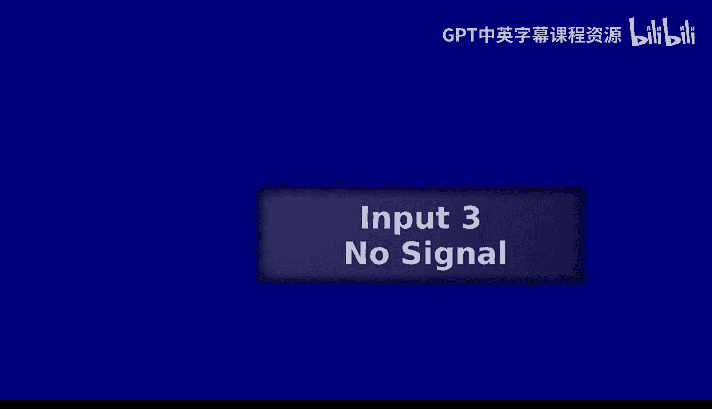
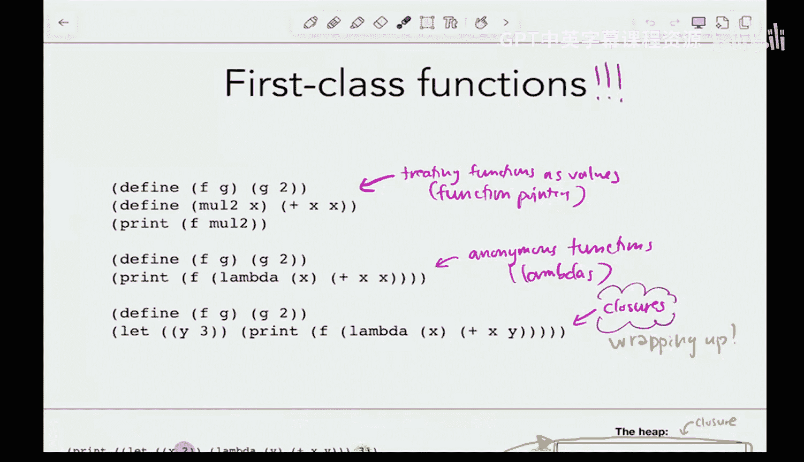
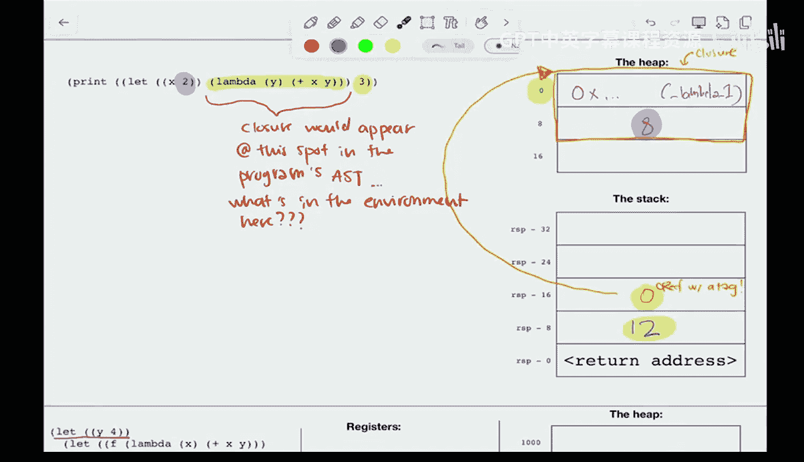
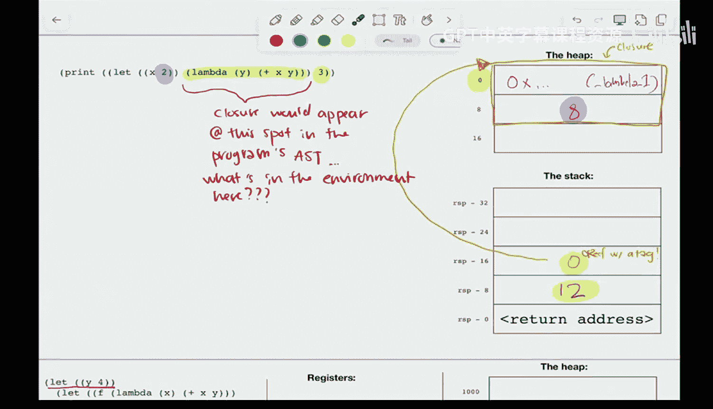
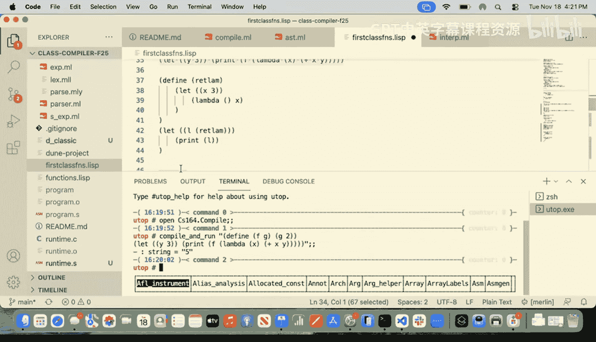
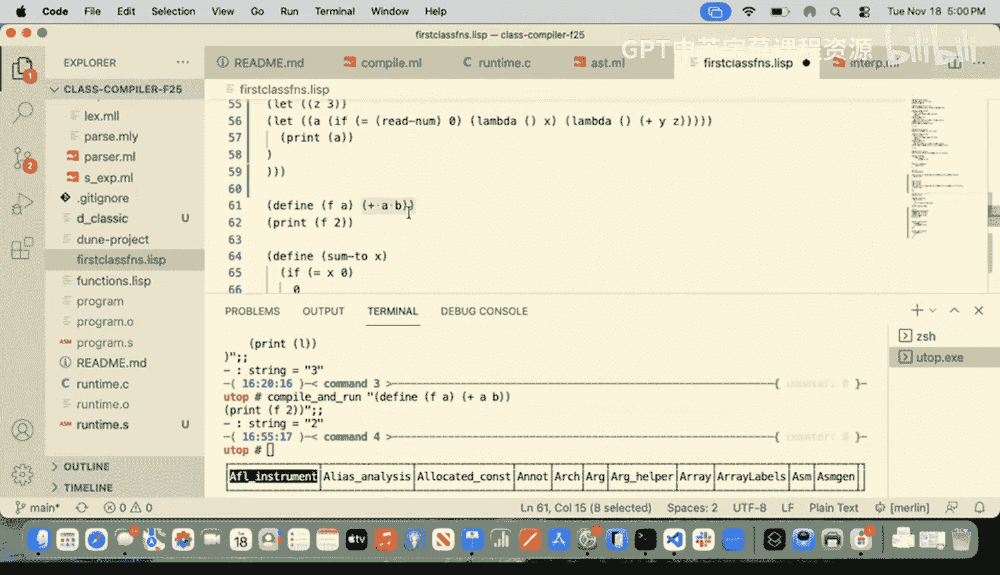

# 编程语言和编译器：第22讲：一等函数（第三部分）🎯







在本节课中，我们将要学习闭包的实现细节。我们将一起探讨编译器如何构建和使用闭包，以支持具有词法作用域的一等函数。

## 闭包实现方案回顾

上一节我们介绍了闭包的概念和基本实现思路。本节中，我们来看看编译器如何具体实现这一方案。

我们决定，当为匿名lambda设置栈时，它应该看到类似这样的布局：返回地址在末尾，第一个参数在常规位置，但新增了一个指向堆上闭包的指针。

**闭包**包含两部分信息：
1.  函数体第一条指令的地址（通常用标签表示）。
2.  该代码片段中所有**自由变量**的值。

自由变量是指在代码片段中被使用但未在该片段内定义的变量。例如，在代码 `(lambda (y) (+ x y))` 中，`x` 是自由变量，而 `y` 是绑定变量。

## 构建闭包

以下是编译器构建闭包的关键步骤。

### 处理顶层函数定义

首先，我们处理顶层函数定义。由于顶层函数没有自由变量，其闭包构建相对简单。

```assembly
; 获取函数标签对应的地址
lea rax, [rel <function_label>]
; 将地址存入堆中特定位置
mov [rdi], rax
; 将堆指针（即闭包指针）存入rax
mov rax, rdi
; 应用函数标签（例如，标签值6）
or rax, 6
; 移动堆指针，保护已分配的闭包空间
add rdi, 8
```

这个过程主要是在堆上分配空间，存储函数入口地址，并返回一个带标签的闭包指针。




### 处理匿名Lambda表达式

对于包含自由变量的匿名Lambda，闭包构建更为复杂。核心步骤如下：




1.  **识别自由变量**：编译器分析Lambda表达式体，找出所有自由变量，生成一个变量名列表。
2.  **获取自由变量值**：在创建闭包的时刻，利用当前的符号表，从栈中获取每个自由变量对应的运行时值。
3.  **组装闭包**：在堆上分配空间，依次存入函数入口地址和所有自由变量的值。

以下是关键代码逻辑的示意：

```ocaml
(* 假设 fvs 是自由变量名列表 *)
let heap_offset = ref 8 in (* 跳过存储函数指针的第一个字 *)
List.iter (fun fv_name ->
  let stack_addr = get_stack_address fv_name symbol_table in
  (* 生成汇编：从 stack_addr 加载值到 rax，然后存入堆的 [rdi + !heap_offset] *)
  emit_load_from_stack stack_addr;
  emit_store_to_heap !heap_offset;
  heap_offset := !heap_offset + 8
) fvs
```

**为什么可以从栈中获取自由变量的值？** 因为在编译时，创建闭包的位置的符号表记录了当前作用域内所有变量的栈偏移量。因此，我们可以通过符号表查询到自由变量 `x` 的栈地址，并在运行时从该地址加载其值。




**为什么需要将值存入堆（Heap）而非仅存储栈指针？** 考虑一个函数返回了一个闭包。当该函数返回后，其栈帧会被销毁。如果闭包中只存储了指向原栈帧的指针，那么这个指针将变成悬垂指针，指向无效或已被重用的内存。将值拷贝到堆上可以确保闭包的生命周期独立于其创建时的栈帧。

## 调用闭包

构建闭包后，我们需要在调用点正确地使用它。调用闭包与调用普通函数指针的主要区别在于两点：

1.  **传递闭包指针**：在设置调用栈时，除了常规参数，还需要将闭包指针作为一个“额外”的参数压入栈中特定位置，以便被调函数访问。
2.  **跳转到正确地址**：从寄存器中取出的闭包指针指向堆上的闭包结构体。我们需要从该结构体的第一个字中取出真正的函数入口地址，然后跳转到该地址执行。

以下是非尾调用情况下的改动示意：

```assembly
; ... 压入常规参数 ...
; 将闭包指针（假设在 rax 中）作为“额外参数”压栈
mov [rsp - <offset_for_closure>], rax
; 从闭包中加载函数入口地址：rax 目前是闭包指针，先解引用获取第一个字（函数地址）
mov rax, [rax - 6] ; 先去掉标签（假设标签为6）
; 现在 rax 中是真正的函数地址，进行调用
call rax
```

## 编译函数定义（处理闭包参数）

当控制权转移到Lambda函数体后，函数需要能够访问到传递给它的闭包中的自由变量。因此，我们需要修改函数定义的编译过程。

主要改动如下：

1.  **扩展符号表**：函数定义的符号表不仅包含其形式参数，还需要包含所有自由变量。自由变量列表可以通过再次分析函数体获得（顺序与创建闭包时一致）。
2.  **从闭包中加载自由变量**：在函数体执行前，生成汇编指令，从传入的闭包指针中解引用，将各个自由变量的值加载到扩展后符号表所指定的栈位置。

```ocaml
(* 在编译函数定义起始处 *)
let fvs = get_free_variables function_body in
let extended_symbol_table = add_arguments_and_free_vars_to_symbol_table formal_args fvs in
(* 生成汇编：从闭包中加载每个自由变量到栈上对应位置 *)
List.iteri (fun idx fv_name ->
  let stack_slot_for_fv = lookup_stack_offset fv_name extended_symbol_table in
  (* 生成汇编：从闭包指针（通常在某个固定寄存器或栈位）的 [8 * (idx+1)] 偏移处读取值，存入 stack_slot_for_fv *)
  emit_load_from_closure idx stack_slot_for_fv
) fvs
```

这样，在函数体内，自由变量就可以像普通局部变量或参数一样，通过其在栈上的固定偏移量进行访问了。

## 示例与练习

通过一个具体示例，我们可以追踪闭包从创建、传递到使用的完整生命周期。例如，对于程序：
```scheme
(let ((y 8))
  (let ((f (lambda (x) (+ x y))))
    (f 3))) ; 应返回 11
```
编译器会：
1.  为 `(lambda (x) (+ x y))` 创建闭包，包含函数地址和自由变量 `y` 的值（8）。
2.  调用 `f` 时，将闭包指针和实际参数 `3` 一同设置到栈上。
3.  进入lambda体后，从传入的闭包中取出 `y` 的值（8）并放入栈帧，然后执行 `(+ 3 8)`。

## 边界情况与思考

实现闭包后，我们的语言能力得到了极大增强，但也需要考虑一些边界情况：

*   **顶层函数的自由变量**：之前的编译器允许顶层函数引用未定义的变量（自由变量），这可能导致未定义行为。现在需要添加检查，禁止顶层函数存在自由变量。
*   **内存管理**：闭包在堆上分配，目前我们尚未实现垃圾回收。在更复杂的语言中，需要考虑闭包内存的回收问题。



本节课中我们一起学习了闭包在编译器中的完整实现路径，包括闭包的构建、传递以及在函数调用时的解包和使用。这使得我们支持了具有真正词法作用域的一等函数，是编程语言实现中的一个重要里程碑。