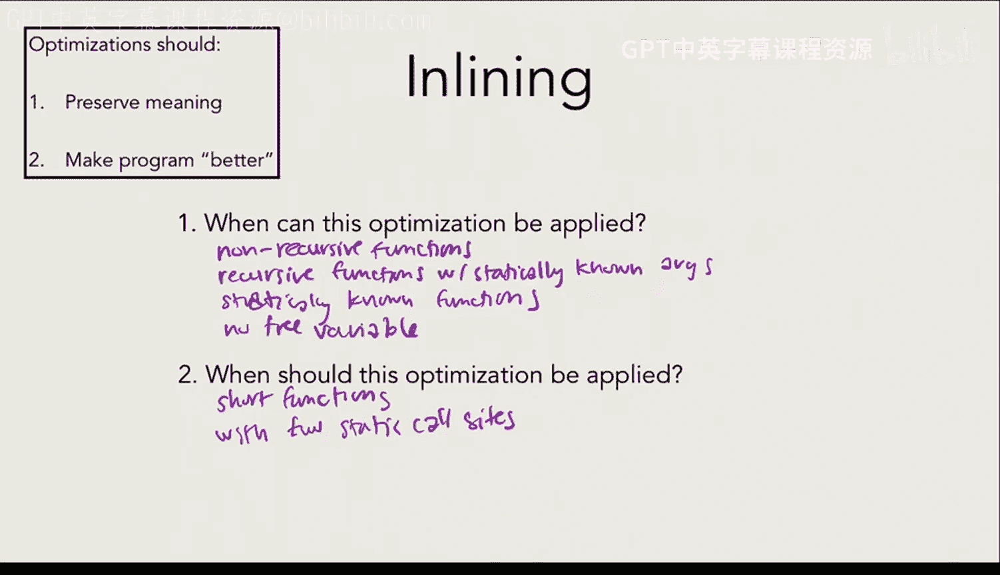
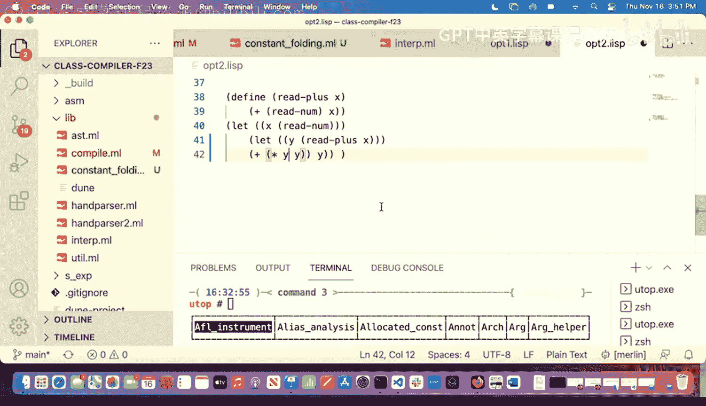
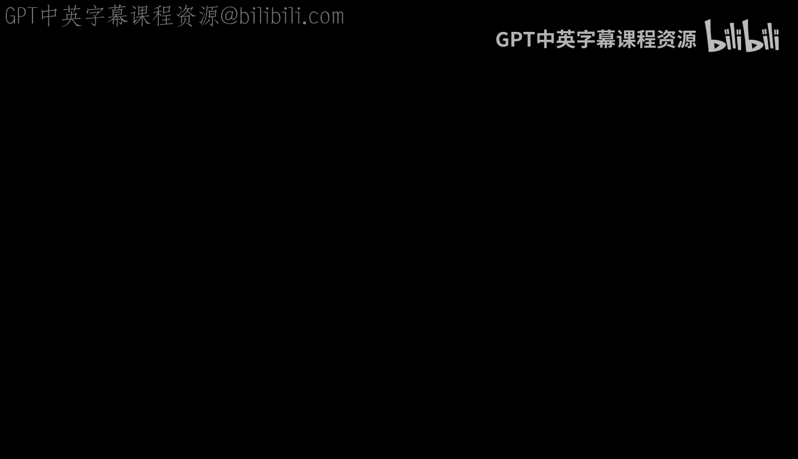
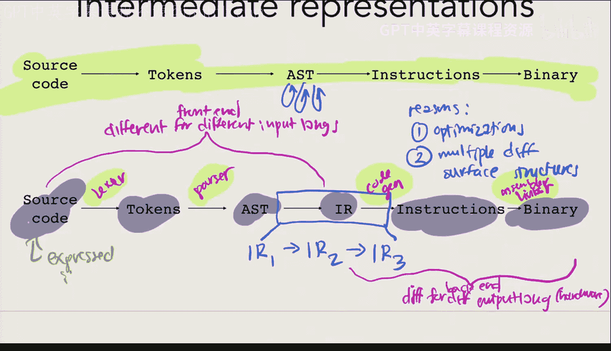

# 编程语言和编译器：第24讲：优化第二部分 🚀



在本节课中，我们将继续学习编译器优化技术。我们将介绍第三种优化方法，并探讨除了在抽象语法树上进行优化之外，我们还能在何种中间表示上进行优化。我们将学习一种虽然计算成本高但非常有价值的优化技术，这需要我们在不同于抽象语法树的中间表示上工作。


## 回顾已学优化

上一节我们介绍了常量折叠和内联优化。本节中，我们来看看第三种优化方法。

### 公共子表达式消除

首先，我们通过一个例子来理解这种优化。





```
(print (+ x 2))
(print (+ x 2))
(print (+ x 2))
```

以下是我们可以对该程序进行的一种可能使其更高效的修改。

```
(let (y (+ x 2))
  (print y)
  (print y)
  (print y))
```

我们注意到，表达式 `(+ x 2)` 出现了多次，这意味着我们重复进行了相同的计算。这似乎没有必要。因此，我们引入一个新的 `let` 绑定 `y`，将其值设为 `(+ x 2)`，然后在原来使用 `(+ x 2)` 的地方替换为 `y`。这样，我们只计算一次，而不是三次，从而节省了计算量。

这种优化称为**公共子表达式消除**。它所做的正如其名：识别程序中重复出现的相同子表达式，并消除冗余计算。

接下来，我们看另一个例子，并判断是否可以对其应用公共子表达式消除。

```
(print (sum-to (read-num)))
(print (sum-to (read-num)))
(print (sum-to (read-num)))
```

在这个例子中，`(sum-to (read-num))` 是一个可能涉及大量计算的表达式。由于 `read-num` 只执行一次，并且对于给定的输入，`sum-to` 函数总是产生相同的输出（它是一个“常量函数”），我们可以安全地进行优化。优化后，我们只计算一次 `sum-to` 的结果并重复使用，从而获得显著的性能提升。

然而，并非所有情况都适合应用此优化。考虑以下程序：

```
(print (read-plus x))
(print (read-plus x))
(print (read-plus x))
```

这里，`read-plus` 函数可能涉及从用户读取输入等副作用。如果我们进行公共子表达式消除，将三次调用合并为一次，程序的行为就会改变（从获取三个输入变为获取一个输入）。因此，在这种情况下，我们不能应用此优化，因为它会改变程序的语义。

### 优化应用的条件与时机

基于以上例子，我们来总结公共子表达式消除的应用条件。

**何时可以安全应用？**
*   当表达式是**无副作用**的。
*   当表达式在程序中**多次出现**。

**何时应该应用？**
*   当表达式**需要大量计算**时。
*   当表达式**出现次数很多**时。

不同的编译器对于“大量计算”和“出现次数很多”有不同的定义和启发式方法，通常基于基准测试和成本模型来决定。

### 优化顺序的影响

现在，我们思考一个关于优化顺序的问题。假设我们对初始程序 `P0` 应用不同的优化顺序：
1.  路径 A: `P0` -> 常量折叠 -> `P1` -> 公共子表达式消除 -> `P2`
2.  路径 B: `P0` -> 公共子表达式消除 -> `P3` -> 常量折叠 -> `P4`

**优化顺序会影响程序的正确性吗？**
不会。因为我们设计的优化都保证了不改变程序的语义，所以无论顺序如何，最终程序 `P2` 和 `P4` 在功能上是等价的。

**优化顺序会影响程序的性能吗？**
会。应用一种优化可能会揭示出应用另一种优化的新机会。例如，先进行常量折叠可能暴露出新的公共子表达式，反之亦然。因此，`P2` 和 `P4` 的性能可能不同。这就是所谓的“阶段排序问题”，即如何安排优化过程的顺序以获得最佳性能。

## 引入中间表示

到目前为止，我们的优化都是在抽象语法树上进行的。抽象语法树与用户编写的源代码在结构上非常接近。然而，编译器内部经常使用一种更接近机器指令的低级表示，称为**中间表示**。

使用中间表示主要有两个原因：
1.  **便于优化**：某些优化在更接近机器指令的表示上实施更为自然和高效。
2.  **支持多语言和多目标**：它允许编译器前端（处理不同输入语言）和后端（生成不同目标硬件代码）像乐高积木一样组合。例如，如果有 M 种输入语言和 N 种目标架构，直接为每一对编写编译器需要 M×N 个。而使用公共的中间表示，只需要 M 个前端和 N 个后端，大大减少了工作量。LLVM 就是这样一个著名的中间表示。

### 基本块与控制流图

我们将学习一种基于 LLVM 思想的中间表示，它对于理解接下来的优化至关重要。这种表示的核心概念是**基本块**和**控制流图**。

一个**基本块**具有以下特征：
*   以一个**标签**开始。
*   包含一系列特定风格的**语句**。
*   以一个**跳转**指令结束。

其中的语句遵循**静态单赋值**形式，即每个临时变量只被赋值一次。语句本身非常简单，通常是常量赋值、函数调用或基本运算，这些运算通常可以编译为大约一条机器指令。对内存的访问通过显式的 `load` 和 `store` 指令完成。

当程序包含条件判断、循环等控制流结构时，单个基本块就不够了。我们需要用**控制流图**来表示程序。控制流图是一个有向图，其中节点是基本块，边表示可能的执行跳转路径（通过 `jump` 指令连接）。

例如，一个 `if` 语句会生成一个条件跳转，指向两个不同的基本块（`then` 分支和 `else` 分支），这两个分支最后通常会汇聚到一个共同的基本块。对于汇聚点，如果两个分支为同一个变量赋予了不同的值，我们会使用一个特殊的 `φ` 函数来表示该变量的值取决于从哪个前驱块到来。

控制流图能够清晰地表示所有控制流模式（如顺序、分支、循环），除了函数调用（函数调用通常通过单独的机制处理，每个函数有自己的控制流图）。

### 在中间表示上的优化示例

有了控制流图，我们可以实施一些在 AST 上难以进行或效率低下的优化。例如：

**死代码消除**：通过分析控制流图，从入口块开始遍历所有可达的基本块。那些无法从入口块到达的基本块就是永远不会执行的“死代码”，可以安全地从图中移除。

然而，我们引入这种中间表示的主要目的是为了接下来要学习的一种关键优化。

## 寄存器分配简介

回顾我们的代码生成过程，我们直接在 `codegen` 中决定使用哪个寄存器或栈位置来存储值。访问寄存器速度极快，而访问内存（栈或堆）则慢得多。目前我们的策略导致了很多不必要的内存访问。



**寄存器分配**就是解决这个问题的优化。在我们将程序编译到上述中间表示时，我们仿佛拥有无限多的临时变量（寄存器）。但实际的硬件寄存器数量是有限的。寄存器分配的任务就是决定如何将中间表示中这些大量的临时变量映射到有限的物理寄存器上，或者在寄存器不足时，将一些变量“溢出”到内存中。目标是尽可能让更多的值留在快速的寄存器中，从而提升程序性能。


本节课中我们一起学习了第三种优化——公共子表达式消除，探讨了优化顺序的影响，并引入了编译器的中间表示概念，特别是基本块和控制流图。我们还了解到，使用中间表示可以方便实施如死代码消除等优化，并为实现强大的寄存器分配优化奠定了基础。下一讲我们将深入探讨寄存器分配的具体算法。