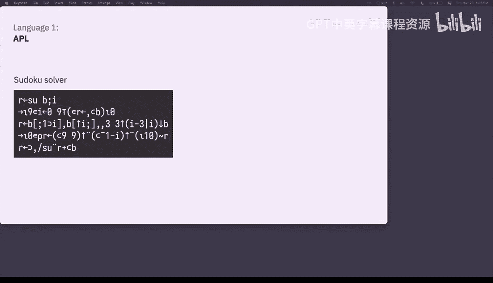
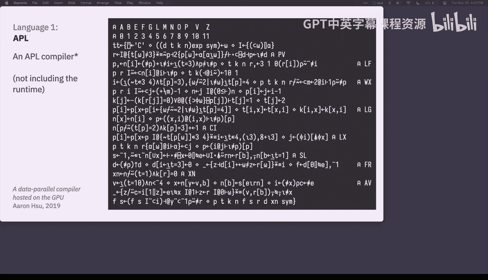
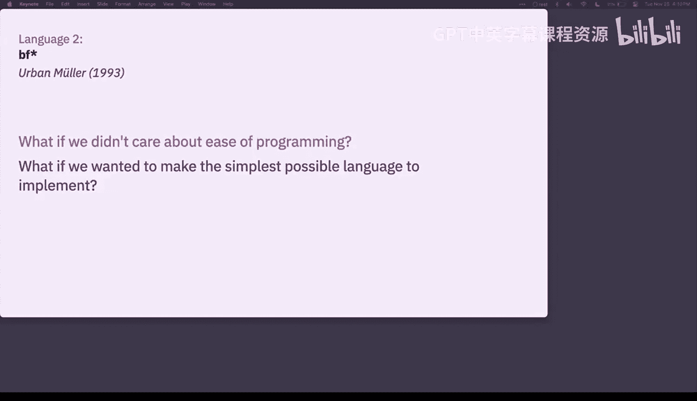
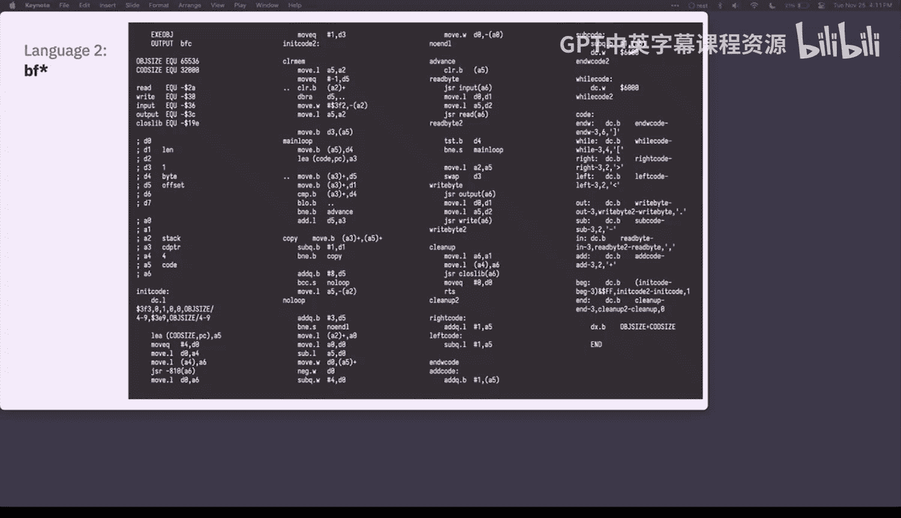
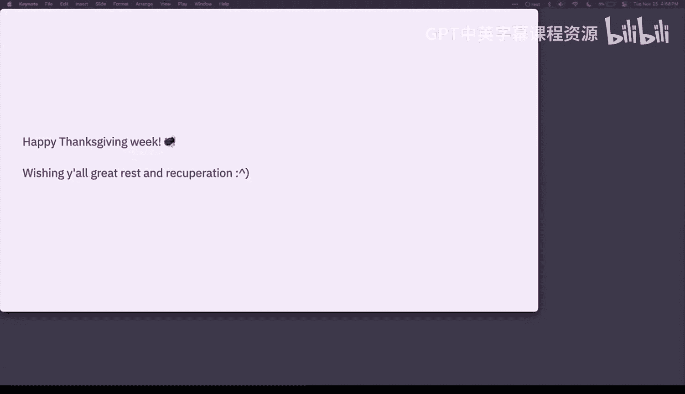
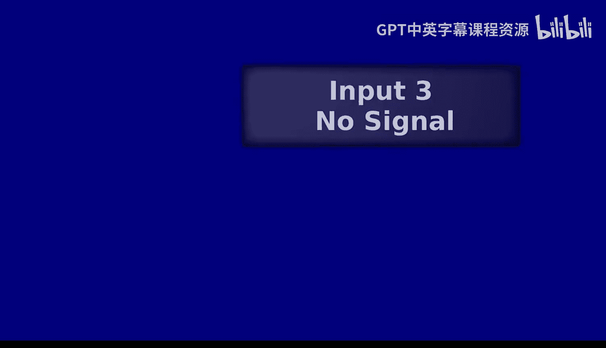

# 编程语言和编译器：第25讲：深奥编程语言 🧠

在本节课中，我们将要学习一类特殊的编程语言——深奥编程语言。我们将探讨它们的设计理念、背后的价值观，以及它们如何挑战我们对编程的传统认知。通过了解这些语言，我们可以更深入地思考编程语言设计的多样性和可能性。

## 课程概述

到目前为止，我们一直在努力从零开始构建自己的语言。课程的一个重要目标是展示我们日常使用的编程语言中的许多功能和决策并非凭空而来。事实上，这些语言特性是由像我们一样的人做出的决策，并且在当时往往并非显而易见的选择。随着时间的推移，不同的语言根据先前语言的成功与失败经验，拥有了不同的功能和决策。在设计我们自己的语言时，我们也必须为自己做出许多这样的选择。

例如，在本学期初，我们讨论了使用词法作用域与动态作用域，这是我们围绕语言中变量工作方式必须做出的明确选择。在我们的案例中，我们决定为我们的语言使用词法作用域。当我们思考为何做出这个决定时，你可以想到几个使用词法作用域而非动态作用域的原因。也许你会说，词法作用域更容易通过查看程序文本来可视化；或者，无论函数在何处被调用，其行为都相同，因此不依赖于任何特定调用点的动态环境。总的来说，我们可以说词法作用域使代码更容易快速理解和维护。因此，基于这些原因，我们选择了词法作用域。

这里的一个广泛教训是，我们关于这些语言所做的决策，是由我们带入这个过程的价值和优先级所决定的。我们认为用这种语言做什么工作很重要？我们想支持什么样的人？这些都是影响我们今天使用的所有语言设计者的同类问题。

今天，我们将讨论一些更奇特、更具探索性的编程语言。我想让大家领略一下编程语言设计领域还有哪些其他可能性。

## 反思与价值观

为了构建我们的讨论框架，我们将从一个回顾开始。我们将进行学期初的头脑风暴活动。

我希望大家花几分钟时间思考一下到目前为止的课程体验。我希望大家思考一下，是什么价值观和目标将你带入这门课程，同时也希望大家回顾性地思考：这门课程对你的价值观和目标有何帮助或可能没有帮助？作为课程的结果，你的目标和价值观发生了怎样的变化？最初是什么吸引你来到这门课程，现在又是什么让你留在这里？

我们将先花几分钟时间各自安静地思考这个问题。然后，我们将过渡到小组分享时间。

## 深奥编程语言之旅

现在，我们将开始探索一些有趣且古怪的语言，这些语言比我们目前接触到的更具探索性。

我们将从讨论能够创建自己的语言以及这些更特定领域的语言开始。为了说明这一点，我在屏幕上放了一张图片。这是一张色彩丰富、看起来抽象的图片。今天我将尝试说服大家，这是一种编程语言中的代码。具体来说，这张图片是 David Morgan-Mar 于 1991 年创建的一种名为 Piet 的语言中的代码。如果你在 Piet 解释器中运行这个程序，它将输出“Hello, world”。所以，我将尝试说服大家这是一个“Hello, world”程序。

总的来说，今天我们将介绍一些看起来像这样的语言，这些被称为深奥编程语言。我这样做部分是因为它很有趣，其中一些语言通常有点傻气。

但我认为它们对我们也可能具有建设性意义。许多这类项目本质上是探索性的。它们的设计目的并非高效、最优，甚至不一定有用，而是为了探索人们围绕语言和编程提出的问题。例如，一个为美观或美学质量而设计的语言会是什么样子？我们如何以新颖或令人惊讶的方式使用现有技术？设计一个无法使用、困难或令人沮丧的语言意味着什么？我认为，看到除了“我们能否为某个特定目标领域、以某种特定的‘简单’和‘快速’定义，制作一种简单快速的语言”之外，我们还能用我们的语言提出哪些其他问题，这是很有用的。

我认为这些深奥语言也清楚地表明，这些语言是构建出来的事物，是由真实的人创造的，他们不断地就他们认为重要的人和事做出决策。大家现在已经花了大学个学期的时间深入思考如何从零开始构建和设计一门语言。你们亲眼目睹了我们在当今语言中认为理所当然的所有决策。这些都是普通人做出的普通决策。因此，我希望我们能够广泛地思考人们为什么编码、为什么创造语言，以及伴随这种工作的价值观和政治。

总的来说，我希望我们思考计算机科学工作如何伴随价值观和政治，以及你希望自己的计算制品体现何种价值观。

接下来，我们将开始介绍一些这样的语言。之后，我们会有一个短暂的休息，然后在剩余的课堂时间里进行另一个头脑风暴活动。

在我们浏览这些语言的过程中，我们将反复回到这个核心问题：这些语言是围绕什么价值观设计的？我们将尝试站在这些语言创造者的角度，为他们进行我们之前在幻灯片上为自己所做的同样的头脑风暴。

## 语言案例研究

### APL：数学表达的语言

我们将从第一种语言开始，这种语言的核心问题是：如果我们想用编程来表达数学思想会怎样？

这里介绍一下背景。这位是肯·艾弗森。在 60 年代，他试图提出一种更标准化的数学符号。他试图表达这些算法，比如在白板上书写、教授数学课、算法课等。他意识到现有的数学符号对此并不理想，通常可能不够标准，难以表达这类算法思想。于是他思考，他正在寻找一种标准化的符号，具有某种标准语法和语义。他意识到，哦，我正在寻找的正是一种编程语言。我需要创造一种编程语言来表达这类算法，特别是这类数学问题。

因此，在 1966 年，他写了一篇名为《一种编程语言》的论文，简称 APL。这是我们将要介绍的第一种语言。

我在屏幕上放了一段 APL 代码示例。它看起来相当正常，我们将两个变量 A 和 B 相加。APL 的一个有趣之处在于，肯·艾弗森设计这种语言的方式是，它对列表的操作与对单个项目的操作相同。假设 A 是一个列表，比如数字 1 到 4，B 是另一个列表，5 到 8。如果 A 和 B 都是列表，这里的表达式将起作用。发生的情况是，如果 A 和 B 这样定义，它将执行逐元素加法。A 的每个元素将与 B 的每个元素配对，然后将这些项目逐元素相加，得到另一个相加后的列表。

这是这种语言的第一个有趣之处。第二个有趣之处是，APL 常因此而出名：许多操作不是用自然语言表达，而是用这些有趣而古怪的符号。我在这里展示了一个计算列表平均值的函数。你可能会说，大卫，那不是说“平均”。我不知道发生了什么。我们来分解一下这里发生了什么。那些外层的花括号表示“请定义一个函数”。如果你想到我们在 164 中使用的 `define` 关键字，这些花括号做着同样的事情，它们将 `ω` 关键字绑定到这个函数的参数。求值从右向左进行。所以，如果我们从最右边的表达式开始，那个有三条线穿过一条线的符号，它表示获取列表中的项目数。当我们将其应用于 `ω` 时，我们得到参数列表中的元素数量。除号表示除以，然后左边括号内的表达式是取 `ω` 中所有元素的总和。加号表示加法，带有一条水平线的斜杠符号表示归约。所以我们说的是，对这个列表进行加法归约。换句话说，将列表中的所有元素相加。

这是 APL 的另一个定义性特征：注重简洁，用符号表示这些更复杂的操作，因为它本意是数学符号。它最初从未打算被输入。因此，当肯·艾弗森设计这种语言时，他围绕的是：哪些符号易于手写，并能非常简洁地表达复杂的操作。

我们再看几个程序示例。我无法解释这里发生了什么，老实说，但只是让大家感受一下 APL 编程的样子。这是一个用 APL 编写的数独求解器，大概只有五行代码，却能完成所有数独求解。

大家现在对实现编译器非常熟悉了。这是一个完整的 APL 编译器。不包括运行时。所以这不完整。它编译成一种字节码，由运行时解释。如果你想了解更多信息，这个编译器叫做 Co-dfns。我们可以在课后核实，因为我觉得我刚才说的可能不准确，我不想传播错误信息，但你可以查一下，应该会有更多信息。这只是让你了解一下用 APL 代码可以简洁到什么程度。

我认为研究 APL 的一个有趣之处在于，看看它如何影响了后来的编程语言发展。我在这里放了另一个片段。这是找出 1 到 100 之间的所有质数，同样很简洁。我在旁边放了一段 NumPy 代码片段。NumPy 是 Python 的一个科学计算库，用于处理大量数据。如果你眯起眼睛看，用正确的方式重命名函数，调整一下角度，你可以看到 NumPy 代码和 APL 代码之间有某种家族相似性。事实上，NumPy 操作的许多定义性特征之一是它们应用于整个数组。你不是在做显式的 for 循环，而是编写这些将逐元素应用于列表的函数。所以你可以看到 APL 这种计算风格对 NumPy 的普遍影响。

事实上，我们可以更明确地看看灵感从何而来。例如，NumPy 有一个叫做 `ravel` 的函数，它可以将一堆嵌套列表展平成一个扁平列表。老实说，我不会选择 `ravel` 作为这个函数的名字，有点奇怪的选择。他们为什么这么做？结果是因为他们参考了 APL。他们借鉴的原始操作是 APL 的 `ravel` 操作，它在 APL 的原始实现中做同样的事情。我想通过这个例子强调的是，这些语言有历史，它们通常非常具有历史偶然性。人们根据他们熟悉的东西、从当时常见的其他语言中获得的灵感，来做出语言决策、命名事物和设计决策。

### Brainfuck：追求极简实现

关于这些程序，你可能注意到的一件事是，它们似乎很难编写和调试。这是对 APL 的一个常见批评：这是一种“写一次”的编程。你写完这个程序，它就变成了一堆难以理解的符号。因此我们可以开始问一些问题。如果我们不在乎让编程变得容易呢？如果我们放弃这种期望呢？当我们思考编程语言时，这是一种隐含或常见的期望，但情况不一定如此，这是设计者做出的选择。所以我们可以说，如果我们关心其他事情呢？例如，如果我们想制作尽可能简单的语言来实现呢？这是我们要讨论的第二种语言。它由 Urban Müller 于 1993 年创建。为了讲座目的，我称之为 BF。它代表的东西你可以在自己的时间里查找，我不会进一步阐述。

正如我提到的，这种语言被设计得尽可能容易实现。这是这种语言的完整编译器。它只有 240 字节，并且直接编译成汇编语言。是的，这是这种语言的完整编译器，包括一切：运行时等等。它能如此简单的原因是它只有八种操作。你可以想象，基本上这种语言模拟了一种非常简单的图灵机。你有一条单元格带，有一些操作可以在当前单元格递增和递减，移动你指向的单元格，然后方括号表示这种循环操作：如果当前单元格是 0，就跳转到匹配的括号。所以你可以把它看作你可能熟悉的条件跳转。这是一种非常简单的类汇编情况，非常简单的语言。

我们再看一些示例程序。这是将两个值相加的程序。你可能看着这个在想，发生了什么？我们来分解一下。括号表示一个循环。只要当前单元格不为零，我们就从当前单元格递减，然后给相邻单元格加一。如果你在循环中这样做，最终结果就是将两个数字相加，并将结果存储在第二个单元格中。

我认为 BF 的一个有趣之处在于，即使这种语言极其简单、非常基础，习惯用法仍然会出现。因此，即使在这种语言中，实践社区仍然会涌现出来，常见的短语、习惯用法、模式或设计模式仍然会围绕这些语言出现。我在这里放了几个例子，最下面的一个只是清除单元格的代码，即将单元格设置为 0。中间的是将当前单元格的值复制到接下来的两个单元格，然后将当前单元格清零。因此，BF 实践者会积累这些不同短语的储备。

这是一个用 BF 编写的 BF 解释器。我们在这里变得非常元。但这是用 BF 编写的 BF 解释器的完整实现。你可以在 BF 程序上运行它，它会给出你期望的结果。正如你所见，创造语言的人喜欢为其他语言制作解释器。

回到这种语言被创造的原始原因，我认为这种语言的存在很酷，人们能够在其中制作复杂的程序，这很酷。但同样，拥有一种极其容易实现的语言，也因其他原因而变得有趣。一是它是学习编译器优化的有用场所。这种语言非常简单，有许多低垂的果实可用于实现不同的代码优化策略。如果你搜索 BF 编译器，你会看到 GitHub 上有很多人在研究不同的优化和编译 BF 代码的方法。我提到这一点是因为查看这些示例可能对作业 8 有帮助，在作业 8 中你需要实现编译器优化。

另一件事是，人们喜欢用各种不同的语言实现 BF。它是一种如此简单的语言，以至于人们会乐于尝试用非常有趣和奇怪的方式编写 BF 解释器或编译器。举个例子，你们中有多少人熟悉 TypeScript？好的，这里有一部分人熟悉。正如你们所知，TypeScript 是 JavaScript，但你可以添加类型注释。你们可能不知道的一件事是，你可以使用 TypeScript 类型系统实现一个 BF 解释器。这个特定的实现有一个 `import type BF` 的东西。我们将程序作为类型参数传入。如果你进入 VS Code 并高亮显示这个类型，你可以看到它会在编译时运行这个 BF 程序。因此，你实际上可以使用 TypeScript 类型系统实现一个完整的 BF 解释器，这很有趣。

问题是 TypeScript 的类型系统是否是图灵完备的？我认为答案是肯定的。我们可以做这样有趣的事情。

### Malbolge：故意制造困难

我们可以更进一步。事实上，我们可以问自己：如果我们故意让编程变得困难会怎样？如果我们尝试创造一种我们不想让人们为其编写程序的语言会怎样？这就是一种名为 Malbolge 的语言的目标。我从维基百科上摘录了这个摘要，显然它是以地狱第八圈命名的，这让你感受到语言设计者 Olmstead 想要营造的氛围。我们会稍微快速地过一下。

这种语言有 8 条指令，在某些方面类似于 BF。这又是一种非常基础的类汇编语言。使这种语言有趣的地方，我将强调两个不同的特性。一是没有移动操作符。通常，即使我们看 BF，我们也可以用加减操作符直接设置内存。显然，在汇编中，我们一直在使用移动指令。在这里，我们无法访问这些。设置内存的唯一方法是通过一个叫做“疯狂操作符”的操作符。有一个表格，列出了这个疯狂操作符的具体操作。所有值都以三进制存储。所以是的，数字在这种语言中都是三进制的。所以你必须使用那个表格来弄清楚如果你想设置值，如何操作。

这种语言的第二个有趣之处是，当程序运行时，它被加载到内存中。然后每当一条指令被执行后，它就会被加密。所以你不能运行同一个程序两次，因为当你运行一条指令时，该指令会在内存中改变，所以如果你“重置”指令指针到之前的位置，它将执行一条不同的指令。这使得在这种语言中编程非常困难，因为你真的不知道会发生什么。

我再给大家看一些示例程序。这是“Hello, world”。它不仅看起来有点荒谬，而且是在该语言发明两年后才被发现的。基本上，有人写了一个 Lisp 程序来搜索这种编程语言中可能的不同程序，偶然发现了这个打印出“Hello, world”的语言。这是另一个示例程序。这是 `cat` 命令的克隆。如果你熟悉 Unix 的 `cat` 命令，它只是打印出文件的内容。这是为你准备的 `cat`。这是用这种语言编写的 Lisp 解释器的前 1000 字节。我真的无法解释发生了什么。不仅如此，实现这个 Lisp 解释器的完整文件有 300 MB。有点大。所以，是的，这种语言被故意设计得尽可能难以理解和编写。

### Piet：艺术与编程的交汇

这很有趣。我们浏览了一些可能并非围绕我们通常倾向于的“简单”或“可用性”定义而设计的语言。但现在我想转向一个略有不同的问题。

在这里，我将向大家介绍一位名叫皮特·蒙德里安的抽象艺术家的抽象艺术。他是 20 世纪的一位抽象画家，我在屏幕上放了一些他的艺术作品的例子。他被认为是几何抽象艺术领域的先驱。在 90 年代左右，有人看了这些画作，他们想，哇，这些是非常有趣和美丽的艺术作品。我想知道我们是否能让我们的编程语言看起来像这样，或者我们编程语言中的代码看起来像这样。这正是大卫·摩根-马尔在 1991 年用 Piet 语言所做的。这是我在讲座一开始提到的语言。

我们在这里有几个这种语言的示例程序。最左边是一个测试数字是否为质数的程序；中间是一个打印单词“Piet”的程序；最右边是有人为他们的伴侣制作的情人节卡片，当你执行该程序时，它会打印出一张小情人节卡片。

我将解释一下发生了什么，因为你可能看着这个，可能会想，嘿，那是一张图片，发生了什么？基本上，我们可以将一张图片分解成一系列像素。我们可以将这些颜色值解释为信息。一旦我们可以做到这一点，我们就可以说，好吧，如果我们看到这种颜色，然后看到那种颜色，我们可以将其解释为一条指令。然后你就拥有了一种编程语言。

这里我制作了这个非常简单的示例程序。在这种语言中，色调的变化被解释为不同的指令。我们有一个颜色图表。这些是允许使用的 18 种主要颜色，除了黑色和白色。还有一个预定义的列表，说明如果你看到色调变化或亮度变化，应该运行什么指令。基本上，当开始执行时，你可以想象自己从一个像素开始，指向右边。解释器将沿着该方向移动到下一个颜色，并根据从前一个颜色到下一个颜色的色调或亮度变化来评估/运行一条指令。如果我们遇到其中一个黑色方块，我们会将自己旋转 90 度，即改变我们面对的方向。然后，如果我们连续遇到四个空白单元格，执行将结束。所以这里的这个片段只是给程序状态中的当前单元格加一。

所以，如果你从这个起点开始，你可以做很多令人惊讶的事情。我在这里放了一系列来自不同人的艺术/代码示例。我想指出一点。顶部第二张图片，字符转 ASCII 码程序。那最初并不是一个 Piet 程序。那是某人创作的一件艺术品，然后另一个人过来，说，嘿，这看起来像一个 Piet 程序。是不是很有趣？所以他们拍了一张照片，然后使用主要颜色调色板将其转录成一个 Piet 程序。结果它是一个有效的 Piet 程序。它的功能是，如果你给它一个 ASCII 字符，它会打印出该字符的 ASCII 码。我认为这使其成为第一个偶然的 Piet 程序。

我认为这组程序有趣之处在于，它使创造性实践与编程之间的契合变得非常明显。我们经常使用“代码风格”这个短语。在这里，它是代码风格含义的一个非常明显的体现。所有这些片段看起来都非常不同。同样有趣的是，尽管编程环境非常受限，但人们能够将其推向非常不同和富有创造性的方向。

### 语言设计中的价值观与政治

正如我在本讲座开始时提到的，以及大家所看到的，无论是在大家构建 164 Lang 的工作中，还是在这些案例研究中，当人们设计语言时，他们都在明确地决定他们想为谁设计这些语言，以及他们希望这些语言完成什么样的工作。如果你想想 OCaml 或 Python，也许我们想帮助软件工程师编写更正确的代码，也许我们想帮助科学家更快地编写代码，这些都是我们在设计语言时告诉自己的激励性故事。而在本讲座中大家看到的语言中，这些目标更具探索性。也许我们想创造一种实现起来有趣的语言，或者产生美观的程序。这些语言的设计并非与历史或更广泛的社会分离，而是深深植根于其创造的背景中。我们看到未来的语言功能和词汇如何受到过去语言工作的影响。对于 Piet，我们可以看到语言设计如何受到当代艺术和文化的影响。

我认为，我刚才所说的一切的另一种表述是：语言设计工作是政治性的。我指的不是选举政治体系意义上的政治，而是指这些语言及其设计者试图以某种方式影响世界的变化，而他们试图影响变化的方式受到过去和当前社会政治形势的影响。

因此，当人们进行语言设计时，他们对自己想要生活的世界以及他们希望用这种语言创造的可能的世
界有一种感觉。这种感觉受到他们现在生活的世界以及这个世界如何形成的影响。因此，我想介绍几个例子，其中它们所体现的政治非常清晰，可能与我们目前看到的语言有所不同。我将讨论的这两种语言的一个共同点是，它们都试图为历史上被边缘化的社区进行语言设计。在我们今天生活的社会中，有许多人面临不同且重叠的边缘化：有色人种、酷儿、跨性别者、残疾人、穷人。这些都是由于社会中存在的结构而被忽视或积极歧视的人和社区。因此，对于从事语言设计的人来说，他们常常认为这不关他们的事，认为我们的工作是纯粹技术性的，没有任何政治性，或者语言设计者对社会的结构没有任何能动性。但正如我们在本讲座中所讨论的，事实并非如此。这些政治并不总是可见的，但它们始终存在。如果你为从事大型科技工作的大型科技软件工程师设计语言，那本身就是一种政治声明。因此，我认为接下来的两种语言很好地打破了这种误解，向我们展示了语言设计者带着非常明确的政治立场意味着什么，一种优先考虑我们社会边缘人群并邀请他们进入计算空间的政治立场。

### Cree#：为原住民社区设计的语言

那么，这意味着什么呢？我想讨论的第一种语言叫做 Cree#。屏幕上大段文字来自一篇博客文章，我会解释。Cree# 是由一位名叫 John Corbett 的人创建的，他目前是加拿大西蒙弗雷泽大学的教员，他也是梅蒂人，这意味着他有混合的原住民血统。具体来说，John 是克里族的一员，克里族是加拿大所称的“第一民族”之一，即在欧洲殖民者到来之前居住在现今加拿大地区的原住民。他构建这种语言的目标是为克里族人构建一种编程语言，并思考围绕克里族语言、文化和生活方式构建一种语言意味着什么。其中一部分是语言本身。回到这个问题：为什么所有语言的关键字都是英语？这很大程度上源于许多早期语言来自美国的军事和经济机构。他们说英语，最终使用了英语关键字，现在我们的所有编程语言中都有英语。如果你想了解更多，我强烈建议你查阅 John Corbett。网上有一篇非常有用的博客文章，是他与一位名叫 Daniel Temkin 的艺术家之间的访谈，讨论了这种语言。但在这里，我只是在屏幕上展示一点这种语言。是的，这项工作的一部分涉及将编程语言中的关键字口语视为这项工作的一部分，John 将这些英语关键字替换为克里语关键字。这项工作的一部分还意味着思考如何将克里文化逻辑深度融入语言及其提供的结构中。我举一个例子：在这种语言中，每个程序都必须以一个叫做“烟熏”的东西开始。本质上，“烟熏”是一种在使用前重置事物的净化仪式，这种仪式在克里文化中很常见。因此，在这种语言中，在每个程序运行之前，你必须发出一个“烟熏”命令，为程序的其余部分运行做好准备。通过这种方式，它以一种文化方式呈现了计算机正在做的事情：你重置它以准备执行程序的其余部分。同样，如果你有兴趣了解更多，我只是浅尝辄止，但我真的建议你查阅关于这方面的更多信息。因为访谈充满了非常有趣的细节和见解。

### Wordplay：包容性与可访问性

我要讨论的最后一种语言叫做 Wordplay。Wordplay 最初由华盛顿大学的 Amy J. Ko 教授于 2023 年发表，她从事编程语言研究和人机交互研究。2023 年，她构建了这种名为 Wordplay 的语言，部分作为一种艺术项目，部分作为一种向年轻的中学生教授编程的方式。该语言旨在帮助人们创建交互式故事、动画、表演等。它综合了我们过去讨论的五种语言中的许多内容。它也具有探索性，提出艺术问题，有点古怪，但也在几个方面非常明确地植根于政治。

她也写了一篇关于 Wordplay 开发的博客文章，并非常明确地阐述了她的语言目标。与 John Corbett 类似，也与我们之前的讨论类似，她思考如何在语言设计中去中心化英语国家和文化，并且她也在非常批判性地思考残疾问题，以及我们如何使编程语言对具有不同残疾的人更易访问。我们在 164 的讨论中接触过这一点，我们进行了屏幕阅读器练习，为 164 Lang 实现了屏幕阅读器支持。因此，广泛思考使语言可访问意味着什么。

在思考 Wordplay 时，我们可以看到这些政治如何在这种语言设计的每个微观层面体现出来。例如，这种语言中的所有核心语法都是纯符号的。所以没有 `def` 或 `let` 关键字，你使用上面看到的那种中缀冒号操作符来定义变量。与 Cree# 一样，我们正在远离使用英语单词如 `define` 或 `let`，以允许不同文化和背景的人参与语言。我们也可以眯起眼睛看到一些与 APL 的共鸣，思考使用符号作为描述操作的方式。在这种语言设计中做出的另一个选择是，所有 Unicode 都被视为有效的语言结构。在一些其他语言中，包括 164 Lang，标识符仅限于 ASCII 字符。显然，对于许多语言来说，这行不通。因此，明确允许使用所有 Unicode 作为标识符。我在这里展示了一些示例代码。我是越南人，所以我选择用越南语命名两个变量。然后第一个变量，我命名为中性人表情符号。一切正常。你可以有表情符号、越南语单词、任何可以用 Unicode 输入的语言单词作为变量名。

另一件事是，这种语言明确围绕教学和可调试性设计。在设计语言时，非常明确地选择不优先考虑速度或效率等，而是为程序员提供最大的灵活性，以便能够从他们的代码中学习并调试他们的代码。现在视频中显示的是单步执行代码，并看到每个子表达式的结果出现。这种语言具有称为“时间旅行调试”的功能，这意味着你可以直接进入程序执行过程中的任何一点，查看该点的程序状态。所以你可以直接跳到程序末尾，就像直接运行程序一样，你可以倒带回到开头，跳到中间，沿着时间线任意跳转，查看程序状态。

最后，考虑到可访问性，这种语言围绕可访问性设计了几种方式。思考不同的程序输入方式，不仅仅是能够打字，还能够像 Scratch 风格那样拖放，或者如果你在手机或 iPad 上，能够使用触摸编程。它设计支持屏幕阅读器。同样，回顾我们的 164 作业和添加屏幕阅读器支持，那里发生了类似的处理。此外，更日常的事情，比如遵循网络标准可访问性指南，有颜色对比度，链接清晰可见等。

## 总结与展望

这就是对这些不同语言的快速浏览。我希望大家能够感受到语言领域还有哪些可能性。我们将进行一个非常短的五分钟休息，让大家有时间站起来伸展一下、呼吸、做任何需要做的事情、喝水等等，然后我们将回到头脑风暴活动。

在本节课中，我们一起学习了深奥编程语言的世界。我们从 APL 的数学简洁性，到 Brainfuck 的极简实现，再到 Malbolge 的故意困难，以及 Piet 的艺术表达。最后，我们探讨了 Cree# 和 Wordplay 如何将社会政治价值观融入语言设计，关注边缘化社区和可访问性。这些语言挑战了我们对编程的传统认知，展示了语言设计的多样性和可能性。它们提醒我们，编程语言不仅是工具，也是文化和价值观的载体。希望这节课能激发大家思考自己希望创造什么样的计算世界，以及如何通过语言设计来实现它。