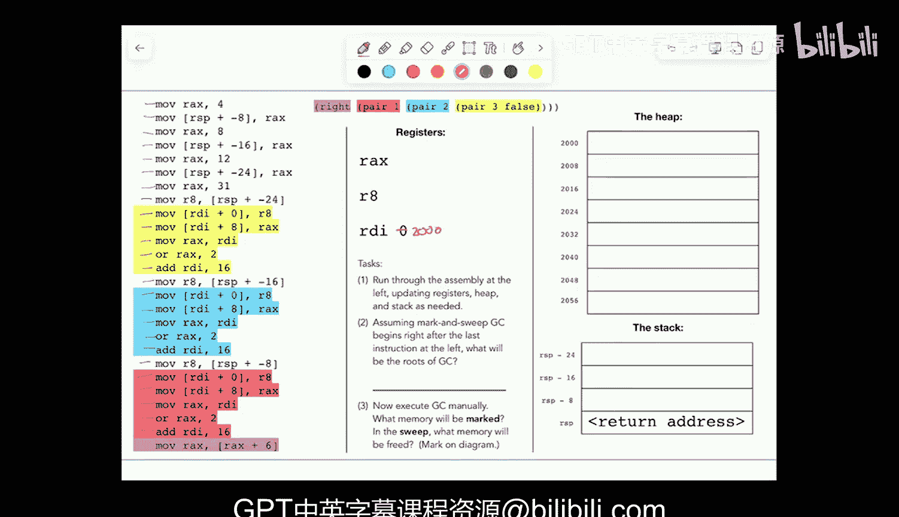

# 编程语言和编译器：CS 164：第26讲 - 寄存器分配；垃圾回收 🧠🗑️

在本节课中，我们将要学习编译器后端中的两个核心主题：寄存器分配和垃圾回收。我们将从一种中间表示（IR）出发，学习如何通过活跃性分析和图着色算法，将程序中的“临时变量”高效地分配到有限的物理寄存器中。随后，我们将探讨自动内存管理的基本原理，了解垃圾回收器如何识别并回收程序中不再使用的堆内存。

---

## 寄存器分配 🎯

上一节我们介绍了LLVM风格的中间表示（IR），它使用无限的“临时变量”（T0, T1, ...）来抽象寄存器的使用。本节中我们来看看如何将这些临时变量映射到有限的物理寄存器上，这个过程称为寄存器分配。

### 活跃性分析

为了进行寄存器分配，我们首先需要进行**活跃性分析**。这是一种**向后分析**，我们从程序的末尾开始，向前回溯，确定在程序的每个点上，哪些变量的值在将来还会被使用（即“活跃”）。

以下是进行活跃性分析的步骤：
1.  从程序最后一行开始，假设返回值（例如 T6）是活跃的。
2.  向前移动一行。对于当前行，移除在本行被定义的变量（因为它的旧值不再需要），并添加为计算本行结果所需的所有变量。
3.  重复步骤2，直到程序开始。

通过这个过程，我们得到了一系列集合，每个集合代表了程序执行到某一点时，必须同时存在于存储（寄存器或栈）中的所有变量。

### 构建冲突图

活跃性分析的结果直接用于构建**冲突图**。图中的每个节点代表一个临时变量。如果两个临时变量在程序的**同一时刻**都是活跃的（即出现在同一个活跃变量集合中），那么它们之间就存在一条边，表示它们**不能**被分配到同一个寄存器。

以下是构建冲突图的规则：
*   节点：程序中的所有临时变量（T0, T1, T2, ...）。
*   边：对于程序中的每一个活跃变量集合，为该集合中每一对不同的变量添加一条边。

### 图着色与寄存器分配

冲突图构建完成后，寄存器分配问题就转化为了**图着色问题**。我们需要用不同的“颜色”（代表不同的物理寄存器）为图中的每个节点着色，并确保任何有边相连的两个节点颜色不同。

以下是进行图着色的简化过程：
1.  为可用的物理寄存器分配颜色（例如，RAX=蓝色，R8=黄色，R9=绿色）。
2.  按某种顺序（如节点顺序）尝试为每个节点着色。
3.  为一个节点选择颜色时，不能使用其任何邻居已使用的颜色。
4.  如果所有颜色都被邻居占用，则可能需要将该变量“溢出”到栈上，或者使用启发式算法重新尝试。

通过成功的图着色，我们就完成了寄存器分配：每个临时变量都被分配了一个具体的物理寄存器（颜色）或栈位置。

---

## 垃圾回收 🗑️

在程序运行时，动态分配在堆上的内存（例如通过 `pair` 创建的数据）可能不再被使用。手动管理这些内存（如C语言中的 `free`）容易出错。垃圾回收是一种自动内存管理技术，由运行时系统负责回收不再使用的堆内存。

### 基本概念：标记-清除算法

最经典的垃圾回收算法是**标记-清除**算法。其核心思想是：回收那些从“根”对象出发**不可达**的内存块。

算法分为两个阶段：
1.  **标记阶段**：从**根**（如当前活跃的寄存器、栈帧中的指针）开始，遍历所有可达的对象，并将它们标记为“活跃”。
2.  **清除阶段**：线性扫描整个堆。将所有未被标记的对象内存回收，加入空闲链表，以供后续分配使用。

这种方法**安全但保守**：它可能不会回收所有垃圾（例如，形成环的不可达对象如果被错误地标记为可达），但绝不会错误地回收仍在使用的内存。

### 识别指针与根

垃圾回收器必须能够区分堆内存中的指针和非指针数据（如整数、布尔值）。在像OCaml这样的语言中，这是通过**标记位**实现的（例如，最低有效位为0表示指针）。对于像C这样的无类型语言，可以使用**保守式垃圾回收**（如Boehm GC），它将任何看起来像堆地址的值都视为指针，这虽然可能造成轻微的内存泄漏，但是安全的。

### 其他垃圾回收策略

除了标记-清除，还有其他策略来应对不同场景：
*   **停止-复制**：将堆分为两个“半空间”。分配只在一个半空间进行。当空间耗尽时，将活跃对象复制到另一个半空间，使其连续排列，然后交换角色。这避免了内存碎片，但需要双倍内存。
*   **分代式回收**：基于“大多数对象生命周期很短”的观察，将堆分为年轻代和老年代。频繁对年轻代进行小规模回收，偶尔才对老年代进行大规模回收。
*   **引用计数**：每个对象维护一个引用计数器。当引用降为0时立即回收。这种方法无法处理循环引用，且维护计数器开销大，实践中较少使用。

---

本节课中我们一起学习了编译器后端的两项关键技术。我们了解了如何通过活跃性分析和图着色，将使用无限临时变量的中间表示映射到有限的物理寄存器上，从而生成高效的机器代码。接着，我们探讨了自动内存管理的必要性，并学习了垃圾回收的基本原理，包括标记-清除算法及其变种，理解了运行时系统如何自动识别和回收不再使用的堆内存，以保障程序的内存安全与效率。