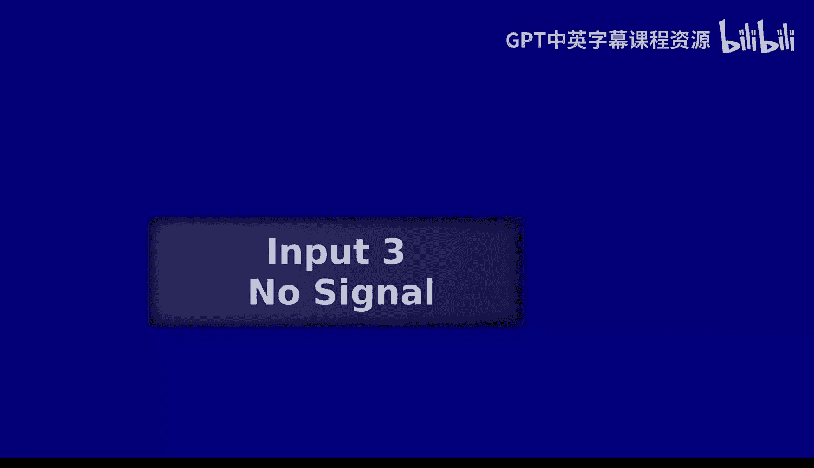
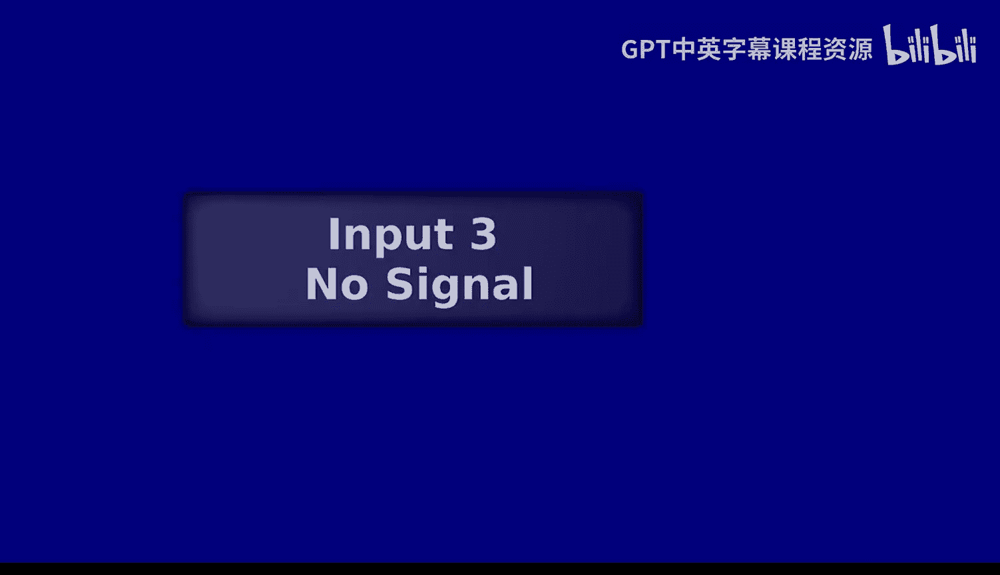
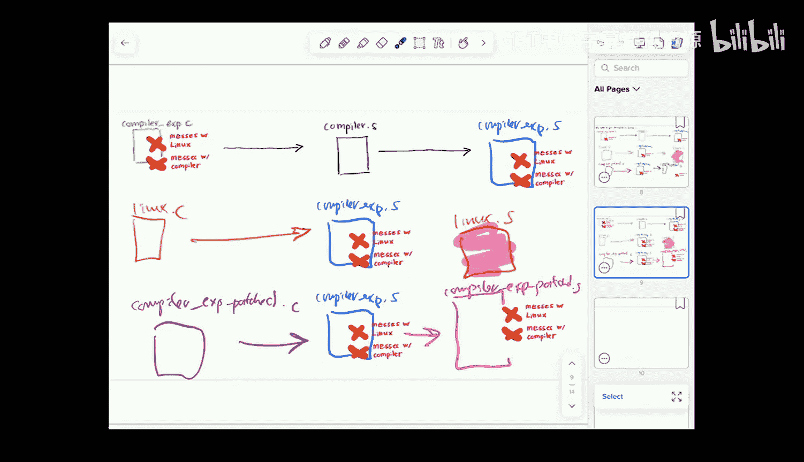

# UCB《编程语言和编译器｜CS 164 Programming Languages and Compilers 2025》中英字幕 p28 -P28-Lec 27 - Type Checking.zh_en -BV1zQ27BeEfF_p28-

Al right， hello everybody and welcome to the very last day of classes。

 Oh my gosh well for this class y'all probably have something tomorrow sorry。😊。

I'm gonna try not to get too sappy， even though I'm feeling very emotional about it。

 But the good news is we do still on this very last day of 164 have some fun compiler stuff to talk about。

 So we're gonna get into the first half， which is wrapping up the actual of the course。

 this stuff you might be tested on。 And the second half。

 we have kind of a wild wacky thing of like here's something that probably before writing your first compilers It was just gonna be pretty much impossible to follow And now that you've been thinking about it for a whole month or two months。

 three months， how long are these semester for now that you've been thinking about it for a whole semester now this is gonna be something that you can actually。

 You can get why this is like such a weird mindbending thing。

 So we're gonna spend our two halves of of the class that way。

 We're gonna start by reminding ourselves of what we've covered because that's what's gonna be on the exam I'm not gonna spend too much time on this first slide of that Because I think know this is stuff you' already covered for them midterm。

 So I don't think any of this is gonna be super surprising， But just to real quick remind ourselves。

 the differences between interpreters and compilers。 What is the one doing， What is the other doing。

😊，The different compiler components that we put together in order to form our overall compilation pipeline。

 syntax versus semantics right how are we writing it down versus what does it actually mean。

 assembly， the stack， the heap implementing control flow in particular we use jumps to do that and then we get into symbol tables and environments and scope and one of the things we talked about there for example was lexical versus dynamic scope but of course that's not the only thing to think about there。

 we also want to think about okay how long is this name available right？

And then we've got whether things are mutable or immutable。

 That's something we've been returning to over and over again。

 We've got reasoning about side effects。 We've got reasoning about correctness。

 We've got reasoning about undefined behavior。 What even is undefined behavior。

 And then we've got compile time versus run time， a bunch of different things for us to think about there right and we're even going to return to that today。

 But one of the things that we might think about is static versus dynamic types right One of those we're actually checking if the types are right at compile time。

 One of those we're checking if the types are right at runtime。

 and then functions and function calls， right， bunch of different stuff wrapped up into there。

 everything from tail calls and we're usinging stack frames all the way down to okay。

 are we doing lazy versus eager evaluation， which， of course。

 also was something we were talking about when we're doing let binding。

 So we've got all these sort of interrelated concepts showing up again and again。

 We've also got the semantics of our little scheme。

 You've got the semantics of O Camel And then on to the second slide。

 these are the ones that maybe you haven't actually seen for the midterm yet。

 So tail call optimization。 first class functions。 We've spent a ton of time on first class functions。

😊，Grammars， right so you did that parsing homework and we're especially going be thinking about LK and recursive descent parsers。

 the kinds that you all were doing， the issues you might come across while you were trying to make sure your grammars are working for parsing。

 so maybe you'll come across ambiguity。 Maybe you'll come across a situation where we're seeing left recursion。

 Maybe you'll realize you need to do some left factoring。

 Maybe you end up having some associivity issues。 Those are all the kinds of things we might want to think about for the exam。

Tokenizations flexing， familiar regular expressions for use in that intermediate representations in particular。

 even just this last session in the session before we were thinking a lot about sort of lowle LVM style intermediate representation were kind putting that in conversation specifically register allocation So that's on there as well。

 So we've got all those things kind of come together。 in terms of optimizations。

 youall have learned three concept folding CE ining all of those fair game register allocation。

 we just mentioned garbage collection。 we went over it at a high level。

 but making sure you understand it at that same high level and then types and type checking。

 which we're gonna talk about specifically today And the big thing that I want y'all to think about as you're studying is you know not just being able to give the definition for all these things I think probably already on the first you could memorized definitions for all these things。

 we're trying to get yall to apply the concepts in the context of some new program that we put in front of you and think about okay what would this actually mean for redesigning my programming language based on this design decision or that kind of yell So we're。

I get you to certain reasonable those。More or less， sound O。

 Any of these that folks want to sort of remind themselves what's in there。

It's all the same concepts we've been talking about， I don't think it's super surprising。Okay。

 cool in that case， let's dive in on wrapping up our actual course content and then we'll get to our fun topic for the last half。

Let's head back to the activity that we didn't quite manage to finish last time。

 We're not even going go through all of it this time because the part that's just tracing through the assembly in the same old way is pretty much just tracing through assembly in the same old way。

 So I've gone ahead and sort of sped us forward to the state where okay we have it on the right hand side representing where the state would be at the end of this process of running the assembly and I'm just going to go through the parts that are specific to garbage collection。

 So in particular， if we take a look at question2 right here。 we're gonna say okay。

 Mark and sweep is beginning right at the end of this whole process。

 right remember our program right we've gone ahead and we've made this inner pair that pairs three and false。

 Okay where is that going to show up。 well， we can see that it's actually appearing inside the memory right we've got three and false。

 there's false。 here's our runtime representation of three。

 So that's that and then we've got the pair that pairs two with that Okay we can see that right here right it's even pointing to there and then we've got the outermost pair。

Pairs one with all of that， so here we go four and something like that， right？

Hopefully it makes sense how that is representing the program that we have actually put in。

And now we might ask ourselves， okay， assuming Mark can sweep G C O。 And then， of course。

 remember that we then take out the right item of that outermost pair， which is to say this。Okay。

 so now assuming we do Mark and sweep garbage collection， we're gonna figure out， okay。

 what will be the roots of garbage collections that we take a look in the stack。

 Nothing And here seems to be a pointer into our heap。 So nothing over there。 what about over here。

 what we know that RDI， even though it does actually， in fact。

 that would actually land on a different value I should cross that out and say。2048， okay。

 so even though we know that that is actually pointing to a spot in our memory。

 we know because of how we use R D I， that that's just pointing us to the next available spot。

 So that's not going be a route。 But inside R E X， we can see， yep。

 this is indeed a pointer into our heap。 And it is， in fact， something that we are still using。

 right， That is representing one of our pairs。 It's a pair that we still have access to。

 So we better go ahead and keep that around。 So now that's our。Our root， right。

 we can go ahead and highlight。 Let's give that purple。For being our root。

 questions about why that is our root。Is that supposed to be 218 or 2016。 Great question。

 So the pointer that is representing is the pointer to 2016。

 But remember that we have our pair tag applied。 We haven't done our sort of abstracting thing。

 This is the actual code that comes out of the compiler。 Yeah， great question。😊，Okay。

 so let's do our reachability analysis。 So the first thing we're going to do is we're going to follow along that line。

 right， And we're going to find， y， well， this pair is still accessible for sure。

And then right if we are going ahead and looking at both of the values here。

 that doesn't seem to be a pointer into the heap。 but this does seem to be a pointer into the heap。

 So let's go ahead and let's follow that。 We'll follow down there and then we find this pair。

 So that pair is still reachable。 And now okay， I'm going go ahead。 I'm gonna check this first item。

 Well that doesn't seem to be a pointer。 I'm gonna to check the second item。

 That doesn't seem to be a pointer。 We have finished our reachability analysis。

 So we have now done all of the marking in our what memory will be marked question。 next up。

 we're ready to do our sweep， what memory will be freed。

 So let's switch to let's switch to red and we can go ahead and we can say， well will this be freed。

 No， that's still reachable reachable， Yes， reachable reachable reachable reachable reachable reachable No。

 right So now we have hit the point where we can go ahead and mark this is no longer something that is accessible to the program and is totally okay for us to actually overrite it。

 And so the whole rest of the memory looks like that。

 And so when we sweep up the whole rest of the memory can be。Swept up。Alright。

 that wrap up our example from the last session。 I'm sorry we didn't manage to actually sneak it in at the end of last session。

 Do we feel ready to move on to our next topic。😊，Fabulous， let's do it， okay。So this is。

 I think a pretty exciting topic for us to cover， we are finally going to get to think about type checking not only as something that we do dynamically the way we do in our own language implementation。

 but what would it mean to actually do it instead at compile time so these are adapted from some very awesome slides by these folks？

😊，So here we go。 Let's first remember some of our key technology。 Good review for us all。

 We want to remember the difference between static and dynamic， right， So static meaning happens。

Compile time。And dynamic meaning at runtime。So we've been returning and returning to this terminology over and over。

 we keep coming back to the idea of what things are happening at compile time。

 what things are happening at runtime。 And today we're going to think about what if we go ahead and shift where we are doing our checking of types specifically if we shift it from runtime to the compile time。

 So let's now take a moment we all sort of talk about types colloquially when we're doing our programming。

 but what do we even mean when we say types， this is not necessarily clear what we're actually say when we say that word。

 and we'll be up front and say it does vary from language language。

 This isn't going to be sort of the universal definition of what we mean when we say types。

 but basically we have this set of values and we have the operations that are valid on those values and it's not going to be all operations if we could do all operations and all values。

 Why would we even bother having this idea of types。

 So it's gonna to be some subset of the allowable operations that are going to be allowable on this specific type classes or one instantiation of the motion。

Modern notion of type， but of course， types are also the other one。

So let's go ahead and talk a bit about why， like， why are we even thinking about this， Obviously。

 we were able to write stuff in assembly all semester long。 And an assembly， we don't have any types。

 right， all we've got every single time is just these 64 bits。 right， There's nothing there。

 like we might choose to treat some portion of that is indicating to us a particular type。

 But in terms of what's actually happening on the machine。 There's just 64 buckets。

 and there's ones and zeros in those buckets。 That's all that's happening。

 And assembly still seems to be able to work great。

 So why is this even something that we would bother to think about it is a little bit weird。

But basically， most of the operations that get interesting。

 the operations that we care about are only going to be valid for some of the things that we want the programmer to be able to reason about。

 So there are things they should be able to with strings they should not be able to do with numbers。

 there are things they should be able to do with numbers they should not be able to do with strings。

 And so it doesn't really make sense for us to allow the programmer to go off and do some of these things。

 We're going to try to have the programmers back。 We're going try to catch some of the errors they might try to make。

 Let's prevent them from doing something bad， like adding a number to a function pointer， right。

 They should not be able to do that。 They have no guarantees about how the memory is being laid out。

 That should not be permitted。So we want to go ahead and even though like right at the assembly level where things are untyped。

 these are actually the same right these are all just going to be an ad。 So at the assembly level。

 this all looks permissible。 We are instead adding this higher level layer。

 this other layer on top that even though they would both generate the same assembly。

 we were going to check before we can even generate assembly， should we be allowed to do this。

So that's what we are thinking about。A type system is basically just where we write down the rules for what is going to be allowed for each type in a given language。

 right， We're going to go ahead and say what is going to be valid for what types。

 And this is going to go ahead and enforce the interpretation of values that we want to enforce is。

 The programming language designer' saying， okay， here's what I mean when I say a number。

 Here's what you're allowed to do with these numbers。 Here's what numbers are。

And so this is basically going to be way for us to write down these rules。

 it's going to be quite concrete， quite well formalized。

 And so we're going to be able to sort of write this in a clear way in much the same way that when we wanted to write down what it meant to be a token that was associated with numbers。

 we wrote that down with a regular expression when we wanted to write down exactly the shapes of the programs that we were going to allow。

 we wrote down the grammar and we use that actually to build the parser。

 we're going to do a different kind of formalization in this case because of course different kinds of formalizations make sense for the different things we're trying to write down about our programming languages。

 but I think this overall idea of we were going formalize something about our language is probably pretty familiar to us at this point。

So this is a fun quote from Andrew Appel， one of the famous PL researchers and this is basically about the idea of why we are bothering to do this right so in general。

 this quote is talking about okay say you have some program analysis trying to help the programmer understand know if they've got a bug if theyve got some kind of issue if the program analysis says no。

 right bad this is generally viewed to be the analysis is false right the analysis should have allowed this through on the other hand。

 we have this one spot， the compiler， the type checker where we are allowed to say I am putting this program for real off limits right this is actually me。

 the programming language designer communicating to the programmer。

 you should really not be doing this thing the compiler gets to be right。

 the compiler gets to enforce and demand this and so we are intentionally saying you are not allowed to write some things and that's probably not surprising when we consider particular examples。

 here I want to quickly ask， have you all seen the w talk about javascript this is。Spelled WAT。

 how if you've seen the walk talk？If you have not seen the Wa talk。Oh my God。

 y'all should go and watch this。 It's so funny。 This is like a really funny talk。

 And this is basically like talking through this kind of issue。

 Like some of the ways in which when our programming languages do not put particular operations off limits。

 we can end up with really weird， wacky behavior。 And so if we are， you know。

 programmers were looking at this 5 plus test。😊，I don't want that to run。 right， That's weird。

 I don't want that to go。 That should not happen。 So I want to put that off limits。

 But there are also cases where when we are doing this type system building。

 when we are enforcing our rules， we might end up putting some things off limits that the program might have actually wanted to keep。

Right， so something like I want to go ahead and return the number of items in a list。

 but there are some situations where I want to be able to return false instead。

 The programmer might actually want to do this， right O Camel is not going actually let you do this because number and those are different types that is not actually gonna be allowed to go through。

 Likewise， I might want to be able to write something that is actually adding together instant floats。

 That's something that programmers do often want to do。 And again。

 we're going to be putting that off limits depending on the type system that we actually create。

 So this is this weird balance where we are definitely putting off limits some programs that we really don't want them to do。

 Well we are also constraining the programmers sometimes out of limits out of the programs that they actually did want to write。

 And so it is a balancing act。 We're trying to be permissive but not too permissive。

So here's where we get to when can we do this checking， right。

 So the answers are basically at compile time。Can I write at compile time， at run time or not at all。

 right， Those are the options in terms of when we check if the programmer is using the types we are expecting them to use and doing valid operations on those types。

Questions about this distinction between static， dynamic and nah。Great， okay， familiar concept。

 We've got it multiple times。 If you get programming languages。

 people in a room to talk about this topic of whether static typing or dynamic typing is better。

 you will probably start a fight。 There are some people who are like， oh my gosh。

 dynamic typing is great。 It's giving the program so much flexibility。

 It's really easy for them to start prototyping， they new things and like you know when the compiler isn't rejecting them。

 Oh， it's great。 And then you'll get other people who are saying， hey。

 static typing is really where it's at because we really want to catch bugs as soon in the process is possible。

 If they're gonna have a  type error， the last thing we want us for that to come up when the program is running。

 we want to figure that out already when they're compiling the program and catch it in advance。

 right bugs are more expensive when they're caught later down the line。

 Let's catch this at compile time。 And in general， it really is better to catch bugs earlier when we can do it。

😊，And so this is kind of this weird thing where people have sort of gone really hard on these different sides。

 but if we actually take a look at the sort of results so far from studying how different the process is across these two different styles of language。

 we don't have a super solid answer about whether people really do make fewer errors when they use static typing。

 whether they really are faster at prototyping when they use dynamicmic typing。

 and so it's been a little bit sort of still opinionated debates at this point rather than empirical evidence。

 just a little bit wacky。O。So type checking is just the process of checking whether the thing that the programmer has given us actually does follow the rules we have written down So just to say the type system right we have generated the type system for this language we have written down exactly what operations are valid。

 what types if a program actually adheres to that great it passes type checking if it does not adhere to that it's gonna fail type checking and then you can also actually do type inference where say the programmer did not actually write down the types for all of the things we have been working in O Camel where we are often choosing not to even bother writing down the types for the things that we are playing around with。

 No problem。 O Camel can infer those types for us and that is done with the exact same machinery the exact same set of typing rules。

So both of those are things we can do with a type system。Allright。

 we have already seen a couple different kinds of formal not。 we saw regular expressions。

 we saw context free grammars。 The appropriate thing that we are going to write down for type systems is logical rules of inference。

 I'm going to talk us through how we use these and how to read these in sort of friendly friendly language that it's sort of familiar and feels natural and we can read it aloud to ourselves in English。

😊，So why rules of inference basically the form that these are going to have is if hypothesis is true。

 then conclusion is true， and that's exactly the kind of reasoning that we are going to want for a type system where it can be something like if E1 has this kind of type。

 then I can be clear on the fact that the output from doing this thing with E1 is going to be E3 and E3 has this other type。

 we're going to be doing that kind of reasoning。And so it's basically going to be yeah。

 just that compact notation for writing this sort of if then reasoning。All right。

 so here's where I teach us how to say this aloud in order to make it natural what these all mean because they're going to look a little bit wacky and a little bit different from other things we have written down。

So we'll start with something simplified we'll gradually add features。

 The first thing I'm going to make us aware of is that we are going to use this to mean and。

 we're going to use this arrow to mean if then， and then as we have been doing throughout the course from the very first session。

 we're going to use the colon T to mean has type T。Questions about that so far。

 that feels pretty familiar。Great， alright， so let's gradually start moving towards the form it's actually going to take。

 So here's how we want to read this。 right， If we are seeing one of these rules。

 we want to read it as if E1 has type int and E2 has type int， then E1 plus E2 has type int。😊。

I think probably when we read it out in English that way， it feels pretty familiar。

 but then we can also write that in something closer to how we'll actually write it in the type system。

 We can go ahead and use this to mean and we can go ahead and use the arrow right here。

To mean if and then so we're starting to replace some of these elements， right。

 And then we can go ahead and put in our has type。 So previously up in 1 now we've just been saying has type has type we can use our colons instead。

 So we'll put in that that and And that's how we get this representation down at the bottom。

 How are we feeling about the representation down at the bottom so far。 so far， so good。 love it。

 All right， Let's go one step past that then we'll start writing this。

 with our okay so first this is the sort of general form right I've been writing it with particular E1 plus E2 example。

 but in general， the overall structure that we'd be doing is we're gonna be ending together multiple hypotheses。

 sometimes multiple sometimes not。 and then we'll get one conclusion out the other end。

 this is an inference rule。 But we are going write it slightly slightly differently。

 So this is the notation that we actually use instead of using that little arrow for if then we instead put our hypotheses up here at the top。

 and this conclusion down there at the bottom。 So you can think of this as being the。

If and this is being the then。And that is how we're actually going be writing。

 And I know it looks a little wacky。 But if you just think back to what it all means in English。

 it's still the exact same thing just written in this funny structure。

It's going to trout to be very convenient for us to have this funny structure because as we know our programs are structured as trees and we're going to be able to build up trees of these inference rules。

 which is going to be very convenient。Okay， cool。So this is what we are doing。

 The only other thing that is changing here is we have added this little thing。

 which just means we can prove that。 So when you're trying to read that funny little turnst thing。

 we can prove that。 That's what that's trying to say。So far， so good。Great， oh yeah。

I'm so happy you asked。 So though what do we mean when we say we can prove that is we've supported this hypothesis。

 we can make this conclusion， right， So we go all the way down until there's no more hypothesisses that we need to prove。

 right， So this is why we have this structure。 You can basically see that we are traversing from the hypothesis at the top。

 all the way down to if weve proved this hypothesis and this hypothesis fantastic。

 we get to make this conclusion。😊，Does that make sense？Maybe wanting to see some concrete examples。

Okay， we'll see some concrete examples。 and you just raise your hand again if we want to chat it through then。

All right， here's some concrete examples， just of the rules。

 we haven't seen it with the programs yet， but here's some concrete examples。

 just of the rules in this case， we get to say， okay。

 based on knowledge that I have from outside of the type system。

 right I know that I as an integer Now this is probably something we got from the Leer right we probably know I as an integer because of some information we got from the Leer。

 So we're not always managing to again getting back to your question。

 prove these things only based on the rules from the type system sometimes we are also bringing in knowledge that we have from outside And so in this case。

 without proving any hypotheses here within the type system。

 we are already able to actually conclude that I has type int because of this knowledge that we have from the outside。

So that's starting to make sense of the question of if we can prove that。

And then we have something that looks more like what we were talking about before。 We have。

 if E1 is an int and E2 is an int， then we can conclude that E1 plus E2 is also an。So far， so good。

Fabulous， all right。So these are basically giving us some templates。

 describing how we would actually apply these to real programs， right。

 we have sort of generalized them by saying E1 and E2 instead of saying1 plus2。

 but of course we're going to want to apply it in the context of concrete programs where we're using specific values。

 we can go ahead and just fill in these templates， and that allows us to actually apply it to concrete programs。

So again， we can use this for type checking if we're using it for type checking。

 the user has given us all of these annotations and we're just making sure that everything agrees。

 We can use it for type inference if the user has not annotated their program with types。

 that's okay， we can go ahead and try to actually infer them so we will go ahead and sort of build up that tree of these inference rules and then we will say how can I fill in these types in a way that actually agrees with the inference rules。

😊，So okay， here's an example of actually applying it to a concrete program。

 This is not a very exciting program。 It is very similar to the programs that we have already been talking about so far。

 so I don't think it's going be super thrilling， but this is an example of actually applying it to a real problem where we have said okay based on the I think we called it the addition one we can go ahead and know that that is going to be an int if we have been able to apply that what do we actually call that rule we called it int so we can go ahead and say yep。

 we used the int rule here。😊，And the in rule here。 And we are able to conclude that  one plus2 will have type。

So far， so good。Guo。Okay， now we get to talk about soundness。

 so this is really important when we start building real type systems。

 it is critical that we only ever introduce sound rules and a rule is sound if whenever we say okay E has type T that means that it actually does have type T right it's just like yeah。

 it's correct right like we are only going to be able to come up with this conclusion if when we actually evaluate that program。

 we come up with something that matches with that conclusion。Now。

Even though we do only want to use sound rules， there are still sound rules that we could add that are not actually useful to us。

 right， So here is an example of a rule that is sound， right， Si， we know that as an integer。

 and we' have chosen to instead of writing integer just write any right， It is any type。

 That's not that useful。 We could add it。 It's sound。 It's not helpful。ok。In general。

 when we are building up type checking proofs， we are going to go ahead and say that an expression E has type T。

 if we have gone ahead and built up the tree of hypotheses all the way down until we don't have anything left to prove。

 So in the type rule that we have used for a particular AS T node E。

 the hypotheses are the proofs of the type of each of E subexpressions， right So for example。

 we already saw this in the case of one plus2， we saw that we had to figure out okay。

 one is one of the sub expressionions，2 is one of the subexions。

 Let's go ahead and figure out what are the types of each of those。

 And then the conclusion is the proof of the type E。

 So that parent thing that had both of the subexpressions in it。

I think this will become a little clearer when we start looking at real examples。

 here are some more rules for us。 we've got the rule for false。

 turns out if we see false in our program， we should expect that that has type Go we have the rule for string here again。

 we're borrowing information from outside of the type system。 These are not super exciting rules。

We do have some more exciting rules， so here we've got not right。

 we're going ahead and saying that if E has type pool， then not E also has type pool。

Not super surprising probably that probably matches our intuitions。

 but it is a rule that we're going to need to be able to use。 And then we have function application。

 This one is getting a little bit wackier， right， so here we're starting to think about the fact that a function has type T1 to T2。

 And then if our input has type T1， it means that what comes out of the other side of the function。

 what comes out from evaluating the function， we'll have type T2。Are there questions about that？

Remember how we write down functions in our language right， so we've got ahead。

 this is actually the function that we were applying E is our function。

 and then E2 is the argument to the function。thumbumbs up。of rotation。Motion。S expressions。 Yeah。

 great question。 Yeah， yeah， this notation where we just got the function in the beginning。

 And then we've got the arguments coming in， S expression。😊，Yeah， surrounded by the Par Museum。

Great question。Okay， cool， so here's some more rules， great。Now。

 we are ready to actually see it applied to concrete examples。

 So we have the thing that's coming out from our parser， right， we've got our AsT。 Here it is。

 It's just the same thing we've been used to seeing that's just our As T。

 But we remember from our As T， it was not annotated with things like types。

 right We've worked with our AS Ts a lot。 It didn't have this kind of information stored。

 But now that we have the type imprints rules， we can go ahead or the type checking rules。

 depending on how we're using them。 We can go ahead and start doing this annotation。

 And so that's what we've got right there。But how do we actually get that right the important thing for us is that we' be able to actually get those annotations somehow。

 And so this is when we get to the idea that this reasoning can be expressed as a treat。

 The root of the tree is actually at the bottom。 So we're showing it sort of backwards if you want to think about it that way。

 and that's the whole expression。 and then each node is an instance of a typing rule。

 the leaves are the rules that have no hypotheses right so if you remember we would actually have up there。

 the knowledge that okay3 is an end coming from outside， but there's no hypothesis up there。

 And so that is the point where we have actually hit a leaf。So far， so good。Okay。

So then we start to almost give away the answer。 Then we start to hit some stuff that's a little more complicated。

 right， Let's say we're in the position where we are using X。

And X is the name that was bound somewhere else。How are we going to go ahead and actually figure out what type X has。

 And so I want you to go ahead and chat with folks nearby for about 3040 seconds。

 What should we write here， What type should we put in for our question mark right here。

Go ahead and discuss。Alright， I'm hearing the answer murmured out in the audience。 And the answer is。

 we don't know enough yet to say， right， It is not clear from just the information that we have。

 right， This rule does not give us what we would need in order to figure out what type X has。

And so at this point we say to ourselves， oh no okay， what are we going to do。

 like clearly we need to be representing some additional information。

 dragging around some additional information in order to figure that out。

 what should that information actually be？And so it turns out we're going to add one more thing into our rules。

 and that is going to be a type environment。 So if you remember when we learned about free variables。

 we are reusing that knowledge right now。 This is going to keep track for us of all the free variables and the types that those have because at the time that we actually introduced those names at some point we did know what types we are actually using there。

 And so type environment is just going to map from identifiers to types and we're going write it with this funny gamma thing。

 So let's take a look at what that looks like。 So here we go。

 that's gamma and we're going have that be a function from identifiers to types。

 And so we're going go ahead and read this as under the assumption that variables in the current scope have the types given by gamma。

Then it is provable that the expression E has type T。 That is the English way for reading that。

 So the only thing that we're adding relative to how we used to have it right before we used to just have。

 let me do our quick erasing。We used to just have that original thing that we see right here。

 The only thing that we're adding is we're going ahead and adding in gamma。

 which is keeping track of our identifiers and what types those have。That's all that's changed。

So far so good。Cool， al right， let's take advantage of having that information。

 So now we get to modify some rules。 These are really boring of rules to modify， right。

 We don't actually need to know anything from inside gamma in order to do this work， right。

 So all we've done is just made sure that we're sort of storing， passing along that gamma。

 That's all that's happened here。 Nothing too exciting。😊。

But we do also get to something that's a little more interesting， right？ So here we can say， okay。

 if we find ourselves in the position where x is matched to type T inside gamma。

 then when we have used X， we do get to conclude something about what the type of T is or sorry。

 the type of x is。 And that is that it has type T。 And so that answers our question that we discussed before。

So far， so good。Cool， now， we also have to actually build up gamma。

 And that's where things get a little bit more complicated。

 So I'm going to do a little bit of highlighting for us。

 And then I'm going to ask you to sort of think through with folks nearby。

 what exactly is happening in this rule。 Try to talk through for yourselves。

 How should we read this rule。 What is this rule actually saying to us。

 Go ahead and discuss for 30 seconds。😊，I'm to clarify this as saying that x is mapped to type T0。

Alright， so I'm going to talk us through。 The thing that we are trying to conclude right here is that E1 has type T1。

The other piece of information that we are going to need to know is that we are going ahead and using this as the body of our let right so here we've got our x。

 it's being mapped to something E0， the expression E0 that has type t0 right so how do we know that well up here。

 we have this hypothesis saying that E0 is going to go ahead and have type t0 So that's really important information for us to have。

 And then remember that the value associated with evaluating E0 is going to be mapped to x to be used inside the body which is to say E1。

 And so it is important for us to know that if we go ahead and evaluate E1 the body in a situation where X is mapped to t0 that we are going to get out something that has type t1 because that's what lets us conclude that this entire expression is going to have type T。

Great time for questions。 I know this。 So this is like the most confusing thing we're looking at today。

よ体。One be a。I love this。I think this question is saying like hey。

 E1 might not actually use the value X。 And so at that point there's this gamma that's mapping x to t not like do we care as long as E1 still maps to t1 without that information。

 Sure， whatever doesn't matter。 That's totally fine right we need to know that E1 is going to have type T1。

 we don't actually need to use this in order to construct it。

 But in this situation where E1 actually does use the value X then it's very important that we'd be propagating this full gamma throughout the rest of the tree because somewhere down there inside E1。

 we might actually be using x And when we use x， we had better know that that should have type T0。

It is not necessarily that E1 should use X。 This is just saying that if we are going to go ahead and make some conclusions about E1 later on in the。

 you know， the rest of the proof tree， then we might need to use this information。

 So gamma will include this mapping from X to T。ItMake sense。

 but it's not requiring that E1 actually uses X， it's just that it's allowed to。Okay， cool。

 so let's go ahead and see a little bit。About what happens。 So here's our lead example。

 Hopefully this clarifies anything that was still a little ambiguous after the talkthrough。

 So here we're basically seeing we're actually seeing some shadowing。

 which makes it even more complicated。 But of course the rule does allow for that。 So we're seeing。

 okay， we've gone ahead and we've added some lets。 We are mapping X to something that has type T0。

 and G something that has type T0。 So sorry， let me actually erase those to make a little bit more clear。

 So here we're going go ahead and we're doing our our mapping of X and we are going to go ahead and be able to use it inside。

 but we are also going to have this additional let where we make y available。

 and then we have another let nested where we make X available。😊。

So these are expressions that are using these various items。 The scope of Y is E X Y。

 so let me go ahead and say that this is mapping to that the scope of the outer X is E X Y right so here we go we've got this X is getting to appear inside here。

 but then we have this inner X that is only actually allowed inside F X Y right so that's only appearing inside there。

 but this is all captured precisely in the typing rule。

So we actually don't have to do any extra reasoning beyond what is already appearing in this rule on the prior slide。

Okay構。So here I want to draw our attention to something that's a little bit funny about how we are using these rules。

And that is the direction that the information is flowing。 So again， we have our actual。

 this is not actually using the let syntaxt that's in our language。

 but here's going head and having sort of the usual abstract synjecttry appearing in the center。

But then we have some funny stuff going on where if we look on the left。

 we can see that we are actually propagating the information about gamma downwards。

 right We're doing that in this direction and we can see that because we can see that okay what we're actually doing is when we introduce X。

 we're going ahead and adding that into our gamma and we're going to keep passing that down so we're going keep going ahead and propagating it downwards and then when we actually do that mapping from y to a string。

 fantastic。 we add that into gamma as well。 And again we keep propagating it down over here。

 we take a different path and we go ahead and we map in to X sorry x to int and we add that we can see that this is actually saying okay that is going to pre-empt the prior X once we're down here so we're going to go ahead and keep doing that propagation down this way。

 And all of that has flowed downwards。 But then once we have flowed that information downwards。

 We start propagating the other stuff upwards So remember we are starting with those hypo。

And then once we have proven those hypotheses， we get to make the conclusions。

 and that's what's happening here where we're saying okay well， X is an int。

 so that means that I can go ahead and describe and decide。

 conclude that E Xy also has type int and then I can decide that the lead expression as a whole。

 therefore also has type in and I'm going to do the exact same thing over here。

 but I'm starting with x being a string and then once I actually go ahead and add together these ints。

 I'm going to be able to conclude that the results from adding them is also an int and we make our way all the way up to the top lead expression。

And so that's sort of the thing I want us to highlight here is that we've got these two different directions going on where we're building up gamma from the root to the trees。

 and then we are using the information in gamma and actually making this conclusion going from the sorry。

 did I say the root the leaves root to the leaves， and then we are going the other direction from the leaves to the root when we are actually making our hypotheses and then making our conclusions based on those hypotheses。

How are we feeling about the two different directions that we are running here？Feels good。

 hopefully the concrete example is a little clarifying。O， we already basically talked about this。

 typess are computed up the AST from the leaves， the type environment is passed down the AST from the root towards the leaves。

 and that's what we've got going on。 And just as the reminder。

 the type environment all is doing is keeping track for us of the free identifiers in the current scope and what the types of those identifiers are。

Okay， cool。 So here are some rules we've seen so far。

 We are going use these rules that we've seen so far in order to do a little bit of an activity。

 I never know how many people to expect on the last day of an activity。

 So I've left us some blank paper up here， which you can grab。

 And Ive actually posted the activity as a digital version on the website。 So I recommend。 I mean。

 I'm gonna also show it up here， but mostly I want to be showing the actual rules that we've seen so far。

 But go ahead and pair up with someone and let's work on this activity。

 if you have your own paper great。 if you don't have paper， come up and grab some。😊，So。All right。

 assuming everyone has access to the version on the interwebs， is it okay if I just show these rules。

 which I think will be useful for us to look at as we are doing this activity？Great。

 I'm going to show this。I'm going to suggest that one you might be interested to look at as you are doing number one here。

Is。This this might be a nice one to look at as an example。Alright。

 just to make sure we're all on the same page， I'm going to go ahead and draw in our answer for number one here。

 So let's say that we've got gamma。 We can go ahead and prove that true。Has type pool， right。

 That's the only other Boolean rule that we might need。

 given that we already know that false has type pool。

 This is the only other thing that we're going to need there。

So that's the kind of thing that we are doing here。

 I want you to go ahead and move on to two and let's see what's a good example for y'all to look at right now。

 maybe you might like to look to our edition for an example of something that might be a nice thing to look at。

Oh sorry。😔，Alright， so I really only want。 oops， let's not use the highlighter。 Let's use。The pen。

 I really only want less than to apply if we are confident that the things going in something like E1 and E2 are of type int right。

 if they are not of type int， I really don't want us to be able to apply this rule。

 I don't want us to be allowed to use the less than operator but of course。

 this is a little bit different from addition because right when we used addition。

 we had an ink coming out the other side。 That's not what I would expect to see here。

 Les than had' better give us a boolean。 So let's go ahead and write something a little bit different there。

 which is given gamma， we can go ahead and prove that less than E1 E2 is going to have type。

So far so good。Okay， cool， I'm going to give you a little more flexibility on which one you might look to as a model rule for our function definition。

 but I'm going to scroll those back into view so we can all see。

A little hint for one you might want to look at。Allright。

 let's go ahead and write it out so all we really need to know here is that we need to extend gamma right it's important that in gamma we have our mapping that maps x to T1 right X needs to actually be mapped to T1 because we might need to actually use X inside the body。

 but once we've got that gamma if we know that E1 once evaluated we'll have type T2。

 that's all we need in order to conclude that this is going to have type T1 mapped to type T2。

I'm going to go ahead and draw the AST for four here just because that's not super exciting。

 that's kind of the same old deal that we've been doing and that way we can jump ahead to Act5 where you are going to annotate this。

 maybe like here， here， here and here with the types at these various AST nodes。

 go ahead and discuss for another 30 seconds。Okay， maybe a little bit longer。Up to you。

Reminder of what we've got up here。Amin that we've written less than ourselves。

Here are some that might be relevant for us， we've got less than right here。We've got not right here。

 we've got int right here。Alright， so probably unsurprising。

 But what we're going to get out the other side is that5 has type int，7 has type int。

Les than our less than node has typewo and are not has typewo and we can actually use our rules to show that。

 in fact， during our five minute break， I'm going go ahead and actually write down the proof tree that allows us to conclude that。

 So the answer to number6 but you can work on it during the break if you want to but I want everyone to also have time to go and stretch。

 so we'll come back together at 437 and then we get to move on to the fun extra shenanigans of our day。

 we've actually we finished conferring all of the main content at 164 oh my god， it's so weird okay。

See you in five minutes。If you do want to work on problem six here。

 beF because I'm going to start drawing it soon。I can just post one。I can just post them。

I don't know for sure， they might actually already be on the website， but if not I can just add them。

Before you do the trick， can you show the。Sure， yeah， absolutely。Is this the one you want？

You might want to see the one that actually has the inference rules that might be easier to look at。

 no？So here's an example of one that has the inference rules。Sort of represented explicitly。

 this is what we mean when we say the typing derivation。Absolutely。店は？Like how come。Wouldn't。

If we know we。T。I see。 So remember that X is just a name。So x is just this parameter name。

 We don't have an actual value there。 So this is saying like we can prove that x when evaluated。

 we'll have type T1。Itself is just a name。 So all we can really do with it now。

 right We don't have an expression， right， like we can't just sort of。

Analyze the parameter in isolation， all we can do is say we're going to do something else somewhere else。

 specifically calling the function that is going to actually do this mapping from X to something that has type T。

 but all we know is that we're going to be in a setting or should have that type。

Does that kind of makes sense so is it kind of。Like we know。It's not an expression so we can't。Right。

 because like what it's going to end up meaning， right， like this means that if we evaluate x。

Then we're going to go ahead and get something that has type T， right， evaluating it。

With our standard evaluation approach will give us a value of type T and that's not actually true in this situation right。

 it's just the argument name kind of sense makes。Thank you， those。

So like if some of our expressions rely on user input。

 do we kind of lose the ability to do any of the static type？It's a great question。 So in general。

 there are approaches where you will say， hey， you know what。

 I want to make sure that whatever I get back， I convert。

And it caused something bad to happen in or some area。Do that。And so you could say。

 I want to like if you even look at our。Like read no。

 we're trying to insist that that is going to be a no。In fact。

 we do some like whatever we get from the user' sort going interpret it as though it's a number。

 so it's not that you can't accept any input from the laurel and still have static type tracking。

 you actually definitely definitely can now say that you are instead in a situation where you want the user to be able to say x equals user input。

They should be able to give me a string， should be able to give me a number。

 they should be able to give me that's the situation where okay that is not going to work with at least just as we might be able to do some kind of a thing where we say。

 okay， I'm going to get this input and that's just like a string of bytes and then I'm going go ahead and introduce this value of this name for if that's an integer and this value if I want to treat it like we can go ahead and do wacky stuff but if you just straight up one。

 here's the name， here's the value， it should be able to have multiple different values。

 absolutely we're out of luck。Like for read， we can like。

We know that that's only going to be a number so we can still do statictype。So absolutelybs。

 absolutely。All right， I'm going to draw it in covers we're getting close now。

We actually have the option to write this up without actually putting those sort of empty hypothesis bars up there but we can also write it up there。

 I'm going to go ahead and erase it just because it's not actually needed。All right， and there we go。

 we've got our little derivation for how we can conclude that this expression actually is going to have type bo。

And now for real， for real， we've finished the content of 164 on which you will be tested。

 And now we get to play around for the last few minutes so。How many， Oh， sorry， yes。Yeah， absolutely。

这分呢。人民。I think I understand the question， so I think this is saying when we're writing has type。

 do we mean the entirety of the expression that is represented at the left after the turnstile？Oh。

 yeah。 So this is saying the the type of that entire A T node is going to be bull。 Yeah， absolutely。

down for a couple pools。I think this question is saying。

 you know what would be sort of the simplest way to describe what less than is doing for us in terms of types and that would be to just read this rule right this rule。

 and then like okay， in this case there's something we could maybe come up with some shorter shorthand for this like we saw earlier the version of this that didn't have gamma in there。

 And so maybe we wouldn't need to include gamma， if we were going try to write it down even more simply。

 but basically this information that's being encoded in this rule is exactly the information we need to know in order to know what less than is doing for us with types。

 it's saying that okay， if E1 has type in if E2 has type in。

 then this entire expression that's comparing E1 and E2 is going have typepo。Make sense。Go。

Absolutely。Industry。The fight。Read message。The okay great question So this question is about like where I have physically in space written down the hypotheses。

 whether they are next to each other， like here， left and right or on top of each other。

 like here up and down same deal right like we just have to be able to list all the hypothe is on top of the bar that's all that matters It's sort of the bars that are telling us where one judgment rules is starting and one is ending。

cool。Awesome， okay， let's go ahead and play around with some wacky stuff now。

 So we are gonna go ahead and think about how many people here have actually read trusting trust。

 It's linked on the oh cool。 Yeah so trusting trust is it was actually like presented at something that was kind of unrelated to this work。

 It was it was Ken Thompson a Berkeley Fer awarded the touring awards was sort of our highest award for his work on Unix and。

😊，Extremely wellknown well respected was given the opportunity like present about Unix at this during award presentation and was like。

 you know what I don't really talking about that what I want to talk about this this I think this is really interesting to think about and this is what I've been thinking about and this is what I want to us to actually chat about at this venue celebrating me and so he was like。

 okay the coolest attack that I have ever seen is this idea that centers on a compiler learning in big scare quotes。

And so this actually gets back to something that we have been thinking about since homework2。

 If you remember you wrote out that thing about， hey。

 like how do we know where the new line is coming from right And I think most people eventually came up with some kind of variation on the answer of like。

 well， it's not anywhere in my code。 So it must be inside O Caml's compiler And that is， in fact。

 what's happening right， This is right here inside the Ocal Leor somewhere right So that is actually in there。

 that is actually the thing that is taking care of saying， okay， I've seen a backslash。

 And then I've seen an n， and therefore I'm gonna to go ahead and introduce this byte 10 to represent sort of that line break thing。

And so this is the answer that y'all came up with， and it's the same sort of fundamental idea that we're going to be thinking about for understanding this attack that Ken Thompson described。

So let's go ahead and think about what is happening when we represent a new line。

 I promise this is going to relate to the attack。 So here's sort of the figure from the paper and saying。

 okay， we're in the situation inside the the actual C compiler or whatever where we've gone ahead and we've seen a slash if we then see another slash okay。

 great we're gonna just treat that as our slash， that's sort of our representation that we want。

 But if we're in a situation where we've seen the slash， and then we've seen n。

 we want to go ahead and produce slash n。And this is really weird， right。

 Because why is that enough to get us to that byte 10 that we actually want represented。

 That's really wacky。 And so now we're okay， let's stop and think about it like what's going on while we're trying to represent things based on this sort of ASI。

 which is the American standard code for information exchange。

 these are one byte representations for characters。 And for a lot of characters。 We've just got。

 you know， the keyboard knows the particular byte to produce for that。 But in this case。

 what's happening for slash n is the user has typed on their keyboard。

 the byte for slash and then the byte for n， But what we want is to actually get this representation of line feed right here。

 let's zoom right in so we can actually see that right This is what we actually want to get when we see slash n。

 which is a different byte than the byte for slash followed by the byte for N。

 And so it's really weird that we can actually go ahead and write just this。

 give us back this and somehow this is going to be。That's really wacky。 It's strange that that works。

 So why does that work？So this brings us back to our question of how do we get the compiler in the first place？

So we're going to take it back right， we're going to go back to the olden days before Grace Hopper wrote a0 before we had the first compiler。

 right， we had to write things down in assembly。Not super fun。 We've done it all semester。

 We know how to do what we're cofy doing it。 but given the choice between writing something and C and writing something assembly。

 honestly， I'm probably gonna try to choose to write something in C。 And so people are like well。

 let's write our compiler that one， right because we didn't have the languages yet。

 we had to write that first one in assembly。 So okay。

 once we have done that right once we are ready to actually write that then we we eventually get to the point of having options。

 But so let's。Go ahead。 and， and。Walk through that basically。 So here's our compiler。

 We have written in an assembly， which I'm representing by saying do S the same way we've been doing the entire semester。

 and what I have written in assembly is actually a compiler for C。

 So now suddenly I have a program that is going to let me write something down in C。

 run it through this program and get out an assembly representation。

 something that I can run out the other side。So now I can go ahead and I can write my program。

Let's put this in blue compiler。Dot C。And then I can go ahead and actually run that through。This。

 sorry， this is going to be pretty annoying to copy， isn't it。 Oh， how do I copy it？

Copy what second again。嗯哼。Duplicate fantastic。 Thank you。 So here we go。 We can run it through that。

😊，Wow， this is gonna be a little slow with the copies folks。 I'm so sorry。

 We can run it through that。 And now what we get out， the other side is， in fact。

 a compiler written assembly， meaning that we can actually run it。

 So let's go ahead and write compiler。2 dot s。And so left arrow over here。

 this is indicating that this the input to a compiler。

 this right over over here is indicating that we're getting the output from the compiler and now based on this we now have。

An assembly。Compilr。Meaning a compiler that we can actually run even though we wrote it in C right and if we're sort of in this imaginary situation where previously the only way for us to actually write that compiler was by writing it in an assembly。

 this is now something that's a little bit weird right we have now been able to write a compiler in C and still get something that we could actually run in our processor。

With me so far。O， cool。So this is good， right we're now at the point where we can write our compiler in the same language that we're compiling。

 this might be exciting for us， So maybe we choose to do that because again。

 we might like to actually write our compiler and see as an easier option。

 Are else seeing that thing off to the side。 Can I get rid of that。😊，Oh， whatever， all right。

So I'm now going to use this left hand column to mean things that are going into the compiler。

 the right hand column to mean things that are coming out of the compiler。

 I think this will be fairly familiar from how we were writing it so far。 So here we go。

 we've got program do C in which we are using s n Now say I've written a version of our compiler and it doesn't know about the mapping front slash followed by N to byte 10 then we go ahead and we don't actually know what to do here right out of the other side question mark question mark question mark who knows what can we do who can say right So say I now write us a version of the compiler that does know about that right so let's go ahead and make ourselves。

Compile。New line。No dot S in which we have that mapping from one oh， sorry， the slash。

Flash followed by N。 we are mapping that to the byte 10。 right， That's what is happening right there。

 And so now when I go ahead and actually copy this program。And put it through here。 Okay， no problem。

 This does， in fact， know what to do。 And so what we'll get out the other side when we go ahead and produce something on the other side is it will be probegue。

Dot S， where instead of seeing slash n in that position we'll c by 10。

Right so we wrote one version that knows to do that transformation。Okay， not too wacky。

But now say it I go ahead and I actually make a new compiler。New line。Care。

Thoughtsy right And in here I'm just going ahead and writing the thing that we saw in that C compiler earlier where I say okay。

 if I see the slash and then followed by n and I go ahead and map that to slash n right because that's what I want to write I don't want to write by 10 It's annoying to have to write that down I want to sort remember what I mean not what I'm actually going have to have represented in the bytes I want to just sort of write down the intended thing so I want to write slash n as something that's sort of understandable and sort of readable for me so I'll go ahead and I'll feed that through our same compiler that we used just a moment ago right so here we've got this compiler。

Let's put it through there。 Great。 And now what are we going to come out with on the other side。

 Well we're going to come out with。Our。Compilr。New line。

Care do S in which we have even though we wrote slash comma N goes to slash n。

 what we're going to have coming out is one is slash comma n goes to 10 right because the thing that we actually use to compile it does know that mapping。

 and so now say that I start using this compiler right。Let's copy that。

I can pop this in here and now if I write a new compiler， right brand new compiler。😊，New。Compilr。

Version。Dot C。 And what I've got in there is if we see slash， we see n。 and we go to slash n。

 It is totally okay to just keep feeding that through new versions of the compiler， right。

 Remember that this version of the compiler， Let me circle it。 This version of the compiler。

 We originally wrote here， right， So we wrote it with slash n in there。

 There was nothing in there that actually did the this had better B 10。😊，Right。

 so we have gone ahead and now when we've used that to compile it。

 And even though we are compiling it with a version that didn't explicitly say slash 10。

 we are still going to get out the other side， this new compiler。Version dot S。

Where we are seeing 10。Now， this is really weird。This is what Thompson was saying when he was saying there has been learning going on that compiler has learned because we have now gone ahead and actually used a version of the compiler to compile this program。

 we have used a version of this compiler where we never wrote what 10 should be。

 we just wrote slash n， and we were still able to get the byte 10 out the other side。That is real。

 real weird。 It just means that somewhere back in the history。

 we used a compiler that did know about that mapping。

 And now our current compiler doesn't need to know about it anymore。That is very， very strange。

And so now we get to， how could we actually use this to make an attack， right。

 How could we hide something in the history of our compiler that might allow us to do something really。

 really weird。So okay， yeah and I want to be clear。

 This stays in the history of the compiler forever。 right。

 I can keep going through this process as many times as I like。

 And this change is still going to keep happening because by the time I get to this side。

 the 10 is represented in there。 So even though this version doesn't have anymore。

 even though this version that we use to do the compilation doesn't have anymore。

 we are going keep getting that 10 out whenever we put in the slash N。

So that's going to stay in that history forever。 very， very strange。 So okay。

 now let's think about how we can use this to be malicious。So here we are。

 Let's take a look at it right here。 We can imagine that we know what the Linux kernel looks like right And maybe there's a particular pattern that we know is the place where we're gonna go ahead and we're gonna to see the user's login and what I want to do is something like okay。

 every time I see that pattern， I want to make sure that my magic password Acaabbra is always going mean that I get to log in。

 It's always going let me in no matter what So maybe that's the kind of thing that I'm trying to do。

 I sort of know what the particular program that it is the Linux kernel looks like and I'm going make sure that every time the Linux kernel gets passed through my compiler I'm putting in that exploit。

So let's try doing that。 oops， let's try doing that。 So here we go。

We've got the compiler where we have written that exploit。

 I'm going go ahead and use this little red X meaning this is gonna mess with Linux。

 So let's go ahead and run that through。 And what we will get out the other side is compiler。

Ex Linux。Thought S。Where it does indeed mess with Linux。Not ideal。

 but not necessarily a disaster yet right because say that I go ahead and look at this compiler。

 I'm going to look at this compiler and say to myselfhuh that looks evil it should not do that right so you know this definitely like if we use this compiler so say I actually go ahead and copy this right？

Let's copy this。 Let's paste this over here。 Great， so now say that I feed Linux through this。

 That stuff is going to happen， right， Linux dotsy， it goes through there out the other side。

 we get Linux。Dot S。 And I will color it red to indicate that it has， in fact， been exploited。 right。

 This is bad Linux。 I can put an abercadabra， and I'm gonna get in bad。However， again。

 I'm probably as someone maybe I'm working on the Linux kernel。 I go over， I look at the compiler。

 I like hang on。 this is clearly trying to put abracadabra into the Linux kernel。 I don't like that。

 Let's patch this compiler。 So say I go ahead and I patch the compiler， right。😊，Oops。

 not as the highlighter say I do。Li。Compilr。Patched。And I put that through。

Our same exact exploited compiler。Well， what comes out the other end is a perfectly fine patched compiler right。

 so out the other side we are going to go ahead and get just something over here compiler。Patched。

Dot S， which is not going to mess with Linux， right？So I have been foiled， right。

 My big plans to put in the exploit are over because someone looked at the compiler source and said that should obviously not be in there。

 That is an exploit。Damn， what am I going to do now。

 How am I going to make sure I can still put an exploit inside Linux。Well。

 say I do something a little bit fancier here， say that instead of just having that pattern that looks for the file。

 you know Linux do C， maybe I also look for the file compiler do C and I say I know the part of the compiler where I want that exploit to be and what I'm going to do is make sure that every time I see that particular file coming in。

 I'm going to insert the exploit and that's going to be part of the output from my compiled code。

Okay， so now if I go ahead and I， you know I do this， I run the compiler through that。 fantastic。

 Now I'm going to go ahead and get compiler。😊，Ex。Linux。Thought S。And this is actually， actually。

 let's call it。 what shall we call。 Let's just call it compiler X。

 because I think that's going to be clearer because it matches the thing that's on the other side。

 So let's go ahead and call that compiler。Ex。Dot S。And okay。

 let's copy our little exploit badges to indicate that this messes with both of those things。Weird。

 it is messing with both。 So now let's go ahead and let's feed Linux through that。 So let's copy。

This。And we will feed。Our Linux program through it。Linux。 C， it goes in out the other side。

 we get Linux。Dot S， where。It is exploited。 So okay， so far so good。

 I have successfully exploited Linux， but I'm still actually in the same position I was in before。

 where if someone looks at my compiler， they're gonna to say there's an exploit in there。

 I'm going take that out。 I'm gonna patch it。 but maybe I'm a little bit smarter than that right Maybe I say to myself。

 okay， time to run the new version of the compiler on the compiler right so now let's go ahead and make a patched version of the compiler ourselves right let's not wait for anyone to catch us。

 Let's be like， I can see that this has the exploit clearly in it。

 let me instead make a new compiler。😊，Ex。Patched。Though'sy。And we will feed that through。

Our exploited compiler right here， right， same deal， copy that。Paste that。

 let's go ahead and feed that through and we're going to get out the other side。

Is going to be a version of the compiler。That messes with Linux and messes with the compiler。

 even though the version that went in does not right。 Here we are on the left Look。

It's not messing with Linux， It's not messing with the compiler。

 This is a friendly neighborhood compiler， it's not gonna do any problems and now we run it through here and it does And in fact。

 even if now we use this as the compiler that we're using to implement our compiler same deal and we get the exact same thing we had with inserting byte 10 right it was in the history of the compilation once so it's in the history of the compilation forever we have now written the weirdest weirdest strangest exploit I have ever seen。

 at least for me very mindbending the first time I saw it and something that you can probably only understand after youve played around with compilers for as long as you all have played around with the compilers。

So I hope that was a fun sort of weird little note to end on。

 I am happy to take any questions and I just want to say that I'm so grateful for all of you'all it's been so much fun to play around in programming languages and compile pilots land with y'all for a semester I'm going to really miss it because this has been really fun for me and I hope it's been at least a little bit fun for you。

😊，太谢谢。I am happy to chat about this if you all want to come up， but this is it， that was it。

 compilers is over。I'm just joking， there're supply more compilers to learn。

 you can learn as much compilers as you want， even though the class is over。Absolutely。

 isn't it so tripping， doesn't it just bend your mind？It seems like the light。

As soon as someone notices， something's been messed with。Just rolled back。To whenever the。P。

So if they go back and they start actually doing it with like this， fantastic。

Or if they go and write a brand new compiler in assembly or in some other language other than my language。

