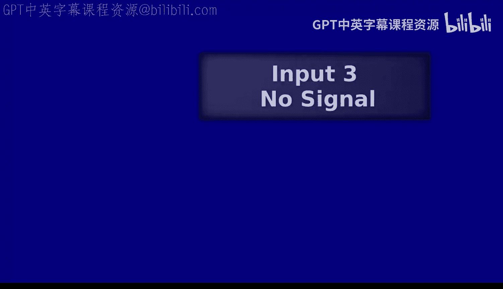
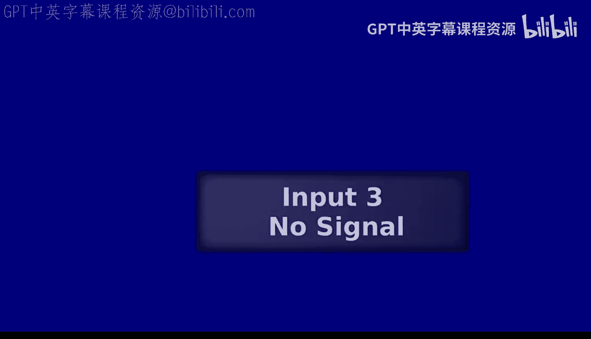
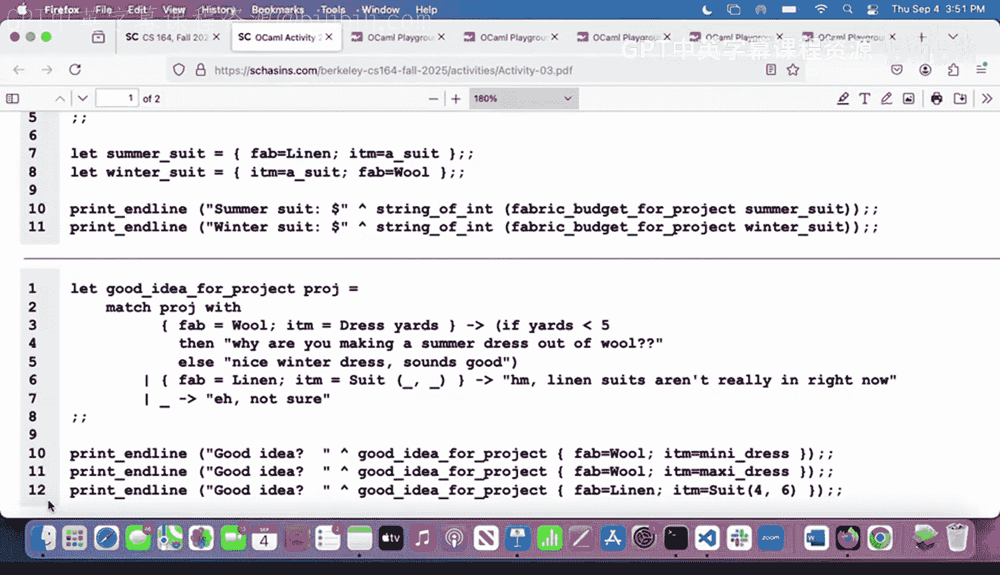
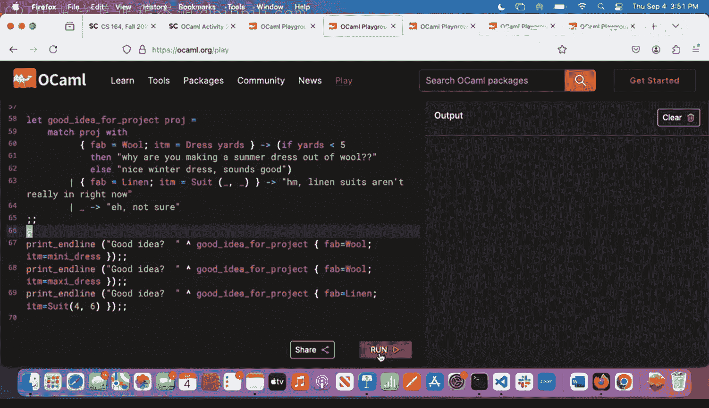
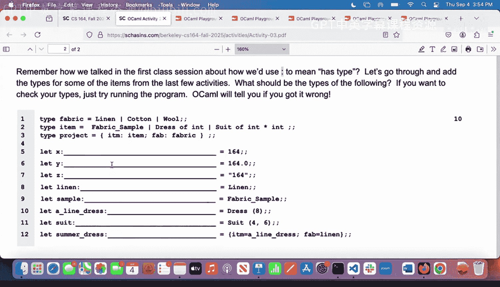
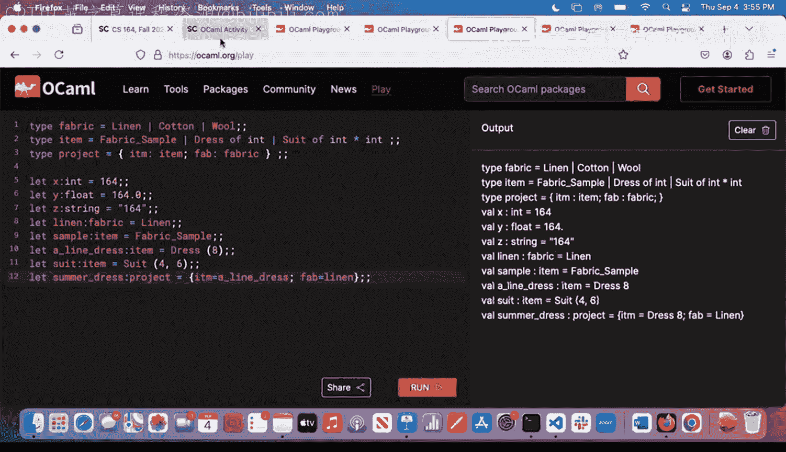
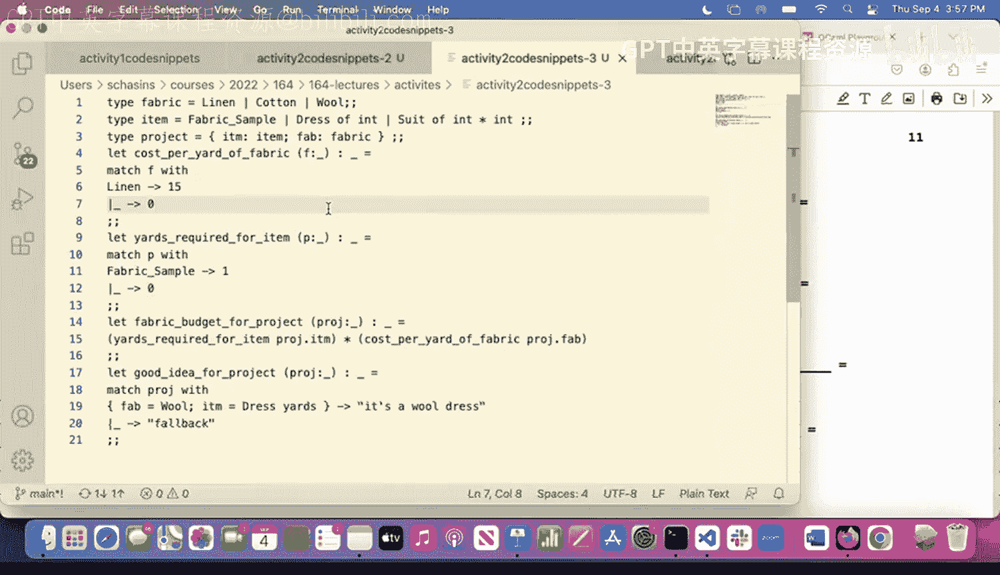
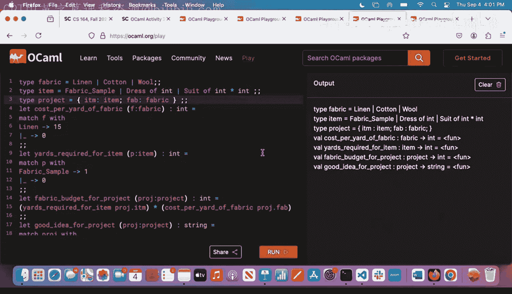
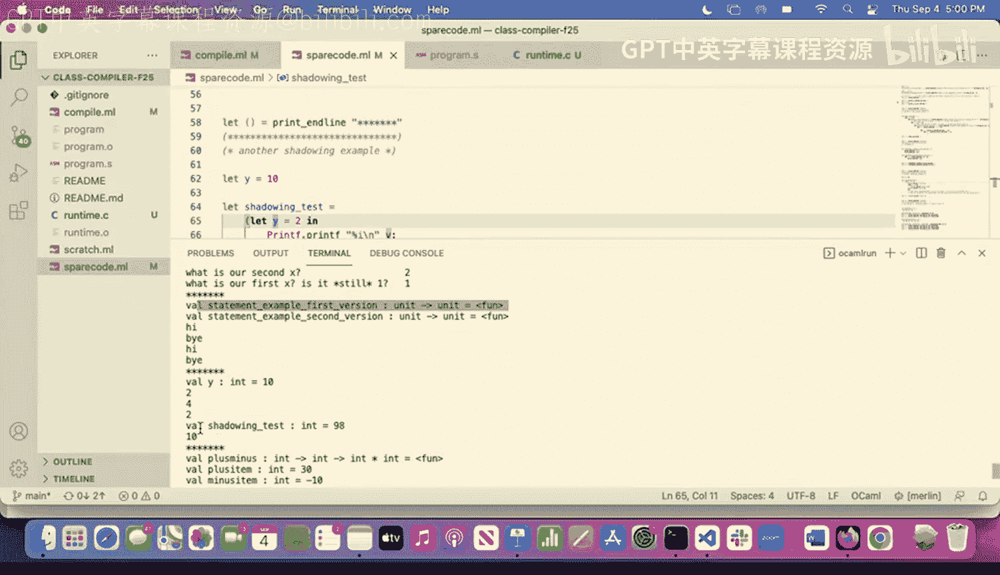

# 3：表达式与语句；不可变性基础 🧠





在本节课中，我们将学习编程语言中的两个核心概念：表达式与语句的区别，以及不可变性的基础知识。我们还将探讨为什么选择 OCaml 作为本课程的教学语言，并初步了解其函数式编程的特性。

---

## 为什么选择 OCaml？🤔

在开始核心内容之前，我们先了解一下选择 OCaml 作为课程语言的原因。这实际上与语言设计决策密切相关。当我们设计自己的语言时，会思考我们希望让哪些类型的程序易于编写，哪些类型难以编写，甚至完全禁止。OCaml 因其在编译器与解释器编写方面的优势而被广泛使用。

例如，Rust 语言的最初编译器就是用 OCaml 编写的。在编程语言和编译器领域，OCaml 常被视为编写编译器、解释器等工具的“领域特定语言”，因为它提供的抽象非常适合这类任务。此外，使用 OCaml 能让我们快速编写编译器和解释器，从而将精力集中在核心实现决策上，而非繁琐的样板代码。

---

## 回顾与热身：模式匹配实践 🔍

上一节我们介绍了自定义类型和模式匹配。现在，我们通过一个简单的活动来巩固理解。

以下是一个关于服装制作的程序片段，我们需要预测其输出：





```ocaml
type fabric = Linen | Cotton | Wool
type item = FabricSample of fabric | Dress of int * fabric | Suit of int * int * fabric

let cost_per_yard = function
  | Linen -> 10.0
  | Cotton -> 5.0
  | Wool -> 15.0



let yards_required = function
  | FabricSample _ -> 0.1
  | Dress (yards, _) -> float_of_int yards
  | Suit (jacket_yards, pants_yards, _) -> float_of_int (jacket_yards + pants_yards)





let fabric_budget item =
  match item with
  | Dress (_, Wool) -> print_endline "Why are we making a summer dress out of wool?"
  | Dress (_, _) -> print_endline "Nice winter dress sounds good"
  | Suit (_, _, Linen) -> print_endline "Linen suits aren't really in right now"
  | _ -> ()

let summer_dress = Dress (3, Cotton)
let winter_dress = Dress (3, Wool)
let linen_suit = Suit (2, 2, Linen)

let () =
  fabric_budget summer_dress; (* 第10行 *)
  fabric_budget winter_dress; (* 第11行 *)
  fabric_budget linen_suit    (* 第12行 *)
```



运行上述程序，第10、11、12行的输出分别是：
*   第10行：`"Nice winter dress sounds good"`
*   第11行：`"Why are we making a summer dress out of wool?"`
*   第12行：`"Linen suits aren't really in right now"`

这个练习展示了模式匹配的强大之处：它不仅能检查值的结构，还能提取其中的数据并绑定到名称（如 `yards`），从而进行深入的条件判断和数据操作。

---

## 表达式 vs. 语句 📝

理解了基础模式后，我们进入本节课的核心概念：表达式与语句的区别。这对理解函数式编程至关重要。

**表达式** 是能**求值为一个值**的代码片段。例如 `3 + 4`、`"hello"` 或一个函数调用 `fabric_budget summer_dress`。

**语句** 则主要因其**对世界产生的效果（副作用）** 而重要，例如打印输出、写入文件或修改服务器状态。它可能不返回一个有用的值，或者返回一个表示“无值”的特殊值。

在 OCaml 中，有一个简洁的区分方式：
*   如果一段代码的求值结果是 **`unit`** 类型（可以理解为“无返回值”或“空”），那么它就是一个**语句**。
*   如果求值结果是 `unit` 之外的任何其他类型，那么它就是一个**表达式**。

OCaml 使用分号 `;` 作为**序列操作符**，用于连接多个操作。它要求分号左侧的代码必须产生 `unit` 类型（即必须是一个语句），整个序列的值等于最右侧表达式的值。

```ocaml
(* 正确：左侧 print_endline 返回 unit，这是一个语句 *)
print_endline "Hello"; 5
(* 整个表达式的值是 5 *)

(* 错误：左侧 3 是一个表达式（返回 int），不是 unit 类型 *)
3; print_endline "World" (* 编译器会报错 *)
```

让我们在之前编写的编译器代码中看看实际应用：

```ocaml
let compile_and_run (program : string) : unit =
  let asm = compile program in
  let file = open_out "program.s" in
  output_string file asm;  (* 语句：写入文件，返回 unit *)
  close_out file;          (* 语句：关闭文件，返回 unit *)
  (* 调用外部命令运行程序，整个函数返回 unit *)
  let _ = Sys.command "gcc -o program program.s runtime.o && ./program" in
  ()
```

这里，`output_string` 和 `close_out` 因其副作用（操作文件）而被使用，它们返回 `unit`，因此可以作为语句用分号连接。整个函数体是一系列由分号连接的语句，最终返回 `unit`。

**注意**：用于列表的元素分隔符是分号 `;`（如 `[1; 2; 3]`），而在交互式环境（UTop）中用于执行代码的是双分号 `;;`。它们与作为序列操作符的分号含义不同，请不要混淆。

---

## 不可变性基础：Let 绑定 🔒

许多编程语言使用“变量”作为可以多次赋值的存储桶。OCaml 的默认核心语义是**不可变的**。我们使用 `let ... = ... in ...` 结构进行**绑定**，这更像是给一个值起一个别名或昵称，而不是将其放入一个可变的桶中。

```ocaml
let x = 2 in
let y = x + 2 in
print_int y (* 输出 4 *);
print_int x (* 输出 2 *)
```

在这个例子中，`x` 被绑定到值 `2`。`y` 被绑定到表达式 `x + 2` 求值后的结果 `4`。这些绑定在它们的作用域（即 `in` 之后的部分）内有效。你不能“改变” `x` 的值，只能在其作用域内创建一个新的绑定。

如果尝试重新定义 `x`，实际上是在创建一个新的、可能在不同作用域内的绑定：

```ocaml
let x = 1 in
let print_x_first () = print_int x in (* 此函数捕获了 x = 1 *)
let x = 2 in                           (* 创建新的绑定，作用域从此处开始 *)
let print_x_second () = print_int x in (* 此函数捕获了 x = 2 *)
print_x_first (); (* 输出 1 *)
print_x_second () (* 输出 2 *)
```

OCaml 编译器会跟踪每个名称绑定在源代码中的位置，帮助我们理解程序。在顶层（不在任何函数或 `in` 内部）的 `let` 绑定，其作用域隐式地延伸到文件其余部分，这可以看作是 `let ... = ... in (文件的其余部分)` 的语法糖。

不可变性使得程序更容易推理，因为一旦一个名字被绑定，它的值在作用域内就不会改变。

---

## OCaml 是静态类型语言 🏗️

OCaml 在**编译时**检查类型，而不是在运行时。这意味着许多错误可以在程序运行前就被发现。

```ocaml
let add_one (x : int) : int = x + 1

add_one 5     (* 正确 *)
add_one "hello" (* 编译错误：类型不匹配 *)
```

编译器会推断函数和表达式的类型。有时它会推断出**多态类型**，即适用于多种类型的通用类型。

```ocaml
let identity x = x
(* 类型为: 'a -> 'a （读作“alpha 到 alpha”）*)
(* 这意味着它可以接受任何类型的输入，并返回相同类型的输出 *)

identity 4        (* 正确，返回 int *)
identity "test"   (* 正确，返回 string *)
```

我们可以选择用类型标注来限制这种多态性：

```ocaml
let identity_int (x : int) : int = x (* 类型被限制为 int -> int *)
identity_int 4     (* 正确 *)
identity_int "test" (* 编译错误 *)
```

类型推断系统非常强大，我们将在课程后期深入探讨其原理。

---

## 列表操作快速浏览 📋

OCaml 提供了强大的列表处理高阶函数，这是函数式编程的常见模式。

以下是几个核心操作：

**`List.map`**：将一个函数应用到列表的每个元素上，生成一个新列表。

```ocaml
List.map (fun x -> x * 2) [1; 2; 3] (* 返回 [2; 4; 6] *)
```

**`List.filter`**：根据一个条件（谓词函数）过滤列表元素。

```ocaml
List.filter (fun x -> x < 3) [1; 2; 3; 4] (* 返回 [1; 2] *)
```

**`List.fold_left`**：用一个函数从左到右“折叠”或“累积”列表中的所有元素，最终得到一个单一值。

```ocaml
List.fold_left (fun acc x -> acc + x) 0 [1; 2; 3] (* 计算 0+1+2+3，返回 6 *)
(* 过程: (((0 + 1) + 2) + 3) *)
```

这些函数鼓励我们以声明式的方式思考数据转换，而不是使用循环和可变状态。

---

## 总结 🎯

本节课我们一起学习了以下核心内容：
1.  **表达式与语句**：表达式求值为一个值，而语句因其副作用而重要。在 OCaml 中，可通过是否返回 `unit` 类型来区分。
2.  **不可变性**：OCaml 默认使用不可变绑定。`let` 关键字用于将名字绑定到一个值，这个名字在其作用域内代表一个固定的值。
3.  **静态类型**：OCaml 在编译时进行类型检查，支持强大的类型推断和多态类型。
4.  **函数式风格**：通过列表操作函数（如 `map`、`filter`、`fold`）初步体验了以表达式和转换为中心的函数式编程风格。



理解表达式与不可变性是深入 OCaml 和函数式编程思维的关键第一步。在接下来的课程中，我们将利用这些概念来设计和实现我们自己的语言特性。