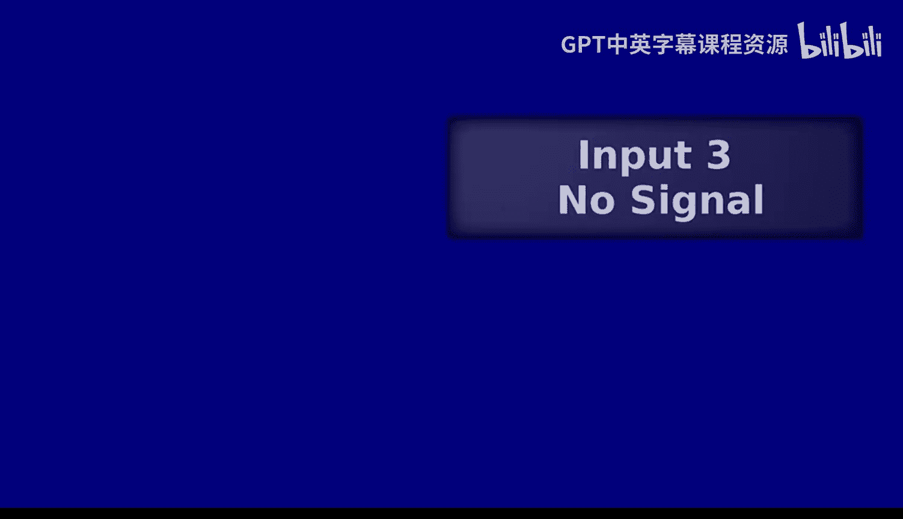
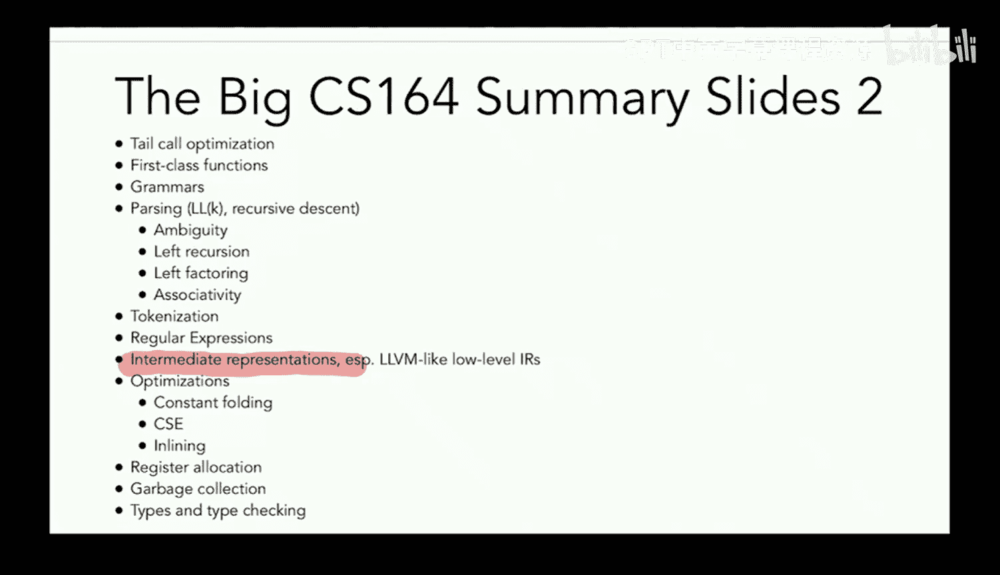
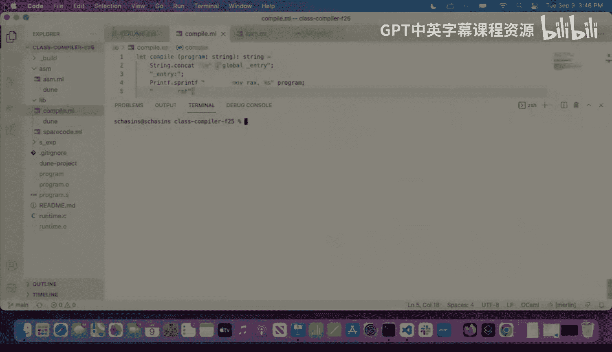
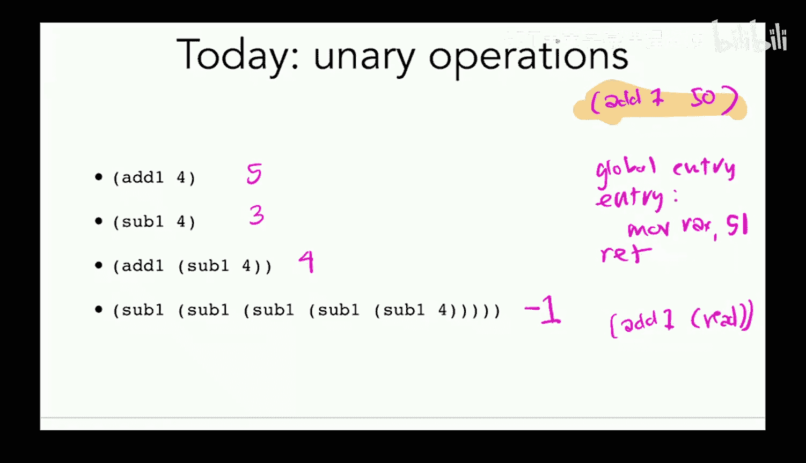
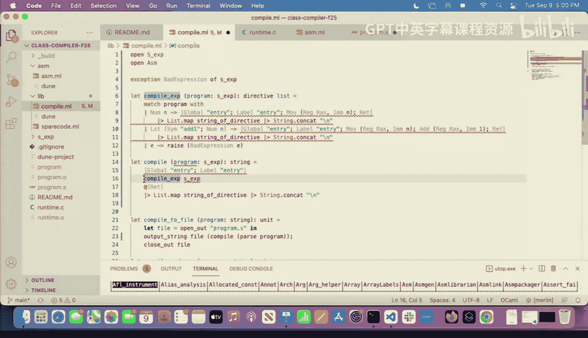

# 4：S表达式与一元运算



在本节课中，我们将学习编译器的核心组件，并深入探讨语法与语义的区别。我们将引入S表达式作为程序的结构化表示，并开始为我们的语言添加一元运算功能。






## 编译器概览

上一节我们介绍了解释器与编译器的区别。本节中，我们来看看编译器的具体组成部分。

一个典型的编译器流程包含以下主要阶段：

*   **前端**：负责处理源代码的语法。
    *   **词法分析器**：将源代码字符串转换为一系列有意义的**词元**。
    *   **语法分析器**：将词元序列转换为结构化的程序表示，即**抽象语法树**，并检查语法是否正确。
*   **后端**：负责生成可执行代码。
    *   **代码生成**：将AST转换为目标平台的指令（如汇编代码）。这是编译器中最具挑战性的部分。
    *   **优化**：在代码生成前后，对程序表示或生成的指令进行转换，以提高运行效率或降低内存消耗。现代编译器通常包含多个优化阶段。
*   **汇编与链接**：将汇编代码转换为机器码（0和1），并将多个模块链接成最终的可执行文件。这个过程基本上是机械的。

对于本课程，我们首先将重点放在代码生成上，之后会探讨词法分析、语法分析，最后再讨论优化。

## 语法与语义

考虑以下两个程序：
```
(if x y z)
```
```
if (x, y, z)
```

这两个程序使用了不同的**语法**（书写形式），但如果它们执行相同的操作，则具有相同的**语义**（行为含义）。编译器前端的工作就是处理不同的语法，将其转换为统一的AST表示，这样后端就可以专注于程序的语义。

## 引入S表达式

为了更轻松地操作程序结构，我们将使用**S表达式**作为我们语言的输入格式。S表达式由三种基本元素构成：

*   **数字字面量**：例如 `1`， `50`
*   **符号**：例如 `if`， `add1`， `x`
*   **列表**：由括号包围的元素序列，可以嵌套，例如 `(add1 50)`， `(if x y z)`

在OCaml中，我们可以定义一个递归类型来方便地表示S表达式：
```ocaml
type sx = Symbol of string | Number of int | List of sx list
```
有了这个类型，程序 `(if x y z)` 就可以表示为 `List [Symbol "if"; Symbol "x"; Symbol "y"; Symbol "z"]`。

这种结构化的表示使我们能够轻松地编写函数来分析和处理程序。例如，我们可以编写一个函数来计算程序中所有数字的总和，或者检查程序中是否包含 `if` 表达式。

## 扩展编译器以处理S表达式

目前，我们的编译器只能处理单个数字作为输入程序。现在，我们要让它接受S表达式，并开始支持 `add1` 和 `sub1` 这样的一元运算。

首先，我们修改 `compile` 函数，使其接受 `sx` 类型而非字符串，并添加模式匹配来处理不同的程序结构：
```ocaml
let compile (program : sx) : string =
  match program with
  | Number n -> ... (* 生成将数字n放入RAX的汇编代码 *)
  | _ -> raise (BadExpression program) (* 暂时无法处理其他情况 *)
```
我们使用一个辅助的解析函数将输入的字符串转换为 `sx` 类型。

## 设计一元运算的代码生成

对于程序 `(add1 50)`，一个简单的想法是直接在编译时计算结果，生成将 `51` 放入RAX的代码。然而，这种方法缺乏通用性。一旦程序包含用户输入或更复杂的表达式，如 `(add1 (add1 50))`，我们就无法在编译时得知结果。

因此，我们需要生成能在运行时执行计算的汇编代码。这意味着我们的编译函数需要能够递归地处理子表达式。

我们将引入新的汇编指令：
*   **add**：加法指令
*   **sub**：减法指令



同时，为了更清晰地构建汇编代码，我们使用一个辅助库来将汇编指令的抽象表示转换为字符串，并利用OCaml的**管道操作符** `|>` 和**部分应用**来使代码更简洁、更易读。


## 重构代码生成器

为了支持递归处理表达式，我们重构代码生成器。我们创建一个核心函数 `compile_expr`，它专门为给定的S表达式生成指令列表。然后，一个包装函数 `compile` 负责添加全局入口标签等样板代码，并调用 `compile_expr`。

核心函数的结构如下：
```ocaml
let rec compile_expr (e : sx) : directive list =
  match e with
  | Number n -> [Mov (Reg Rax, Imm n)] (* 将数字n移入RAX *)
  | List [Symbol "add1"; arg] ->
      compile_expr arg @ [Add (Reg Rax, Imm 1)] (* 先计算参数，然后加1 *)
  | List [Symbol "sub1"; arg] ->
      compile_expr arg @ [Sub (Reg Rax, Imm 1)] (* 先计算参数，然后减1 *)
  | _ -> raise (BadExpression e)
```
通过这种递归结构，我们可以处理任意嵌套的一元运算表达式。

## 总结



本节课中，我们一起学习了编译器的核心流程，区分了语法与语义。我们引入了S表达式作为程序的结构化表示，并开始为我们的语言添加 `add1` 和 `sub1` 一元运算。通过重构代码生成器，我们实现了递归处理表达式的能力，为后续添加更复杂的语言特性打下了基础。下一节课，我们将继续扩展语言的功能。