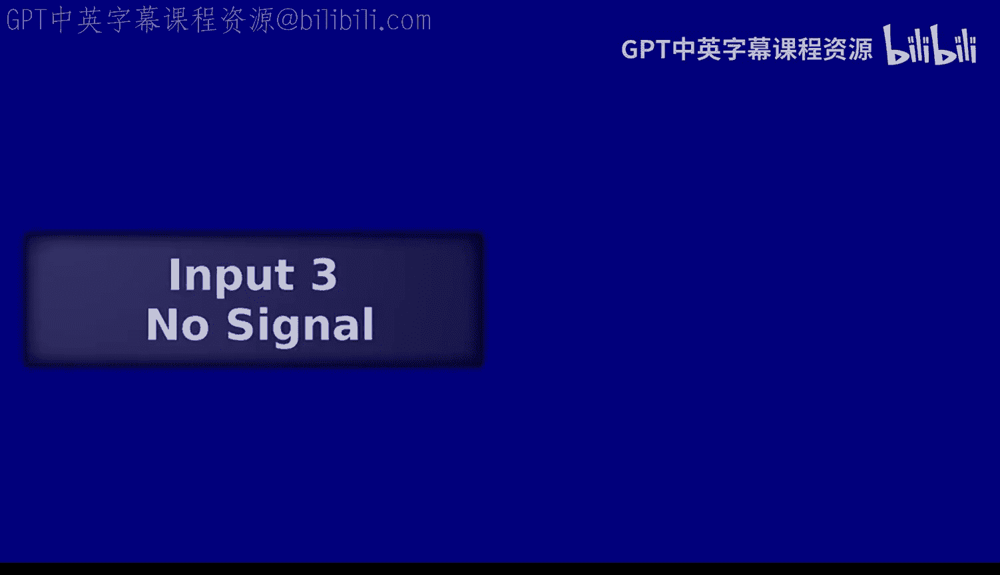
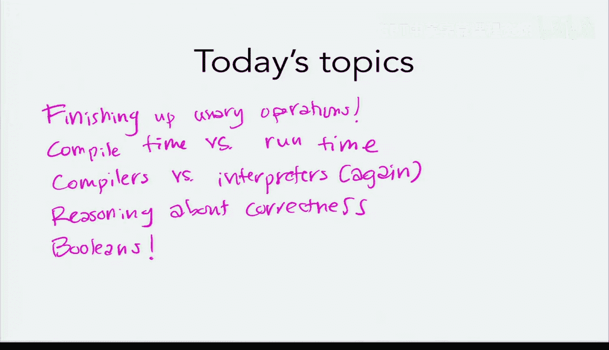
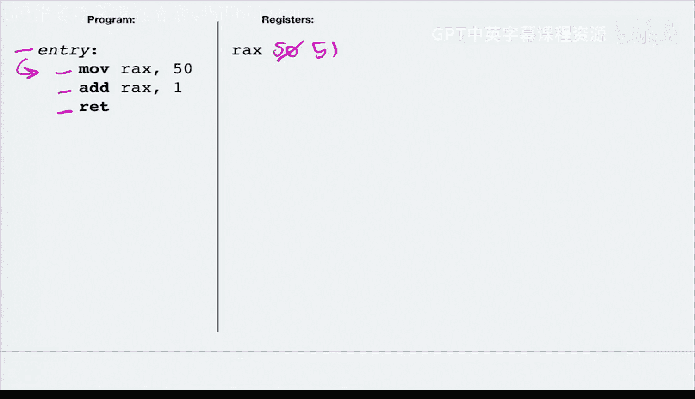
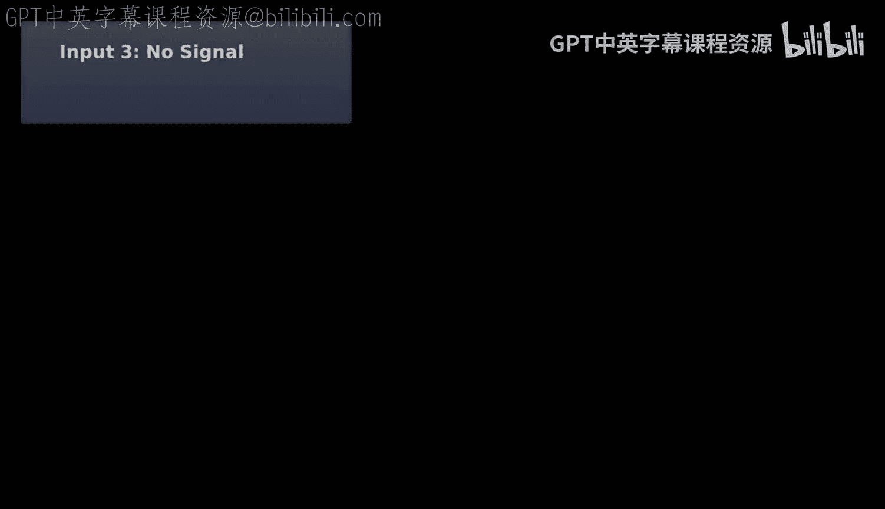
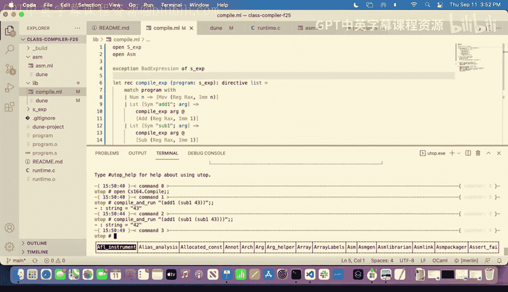
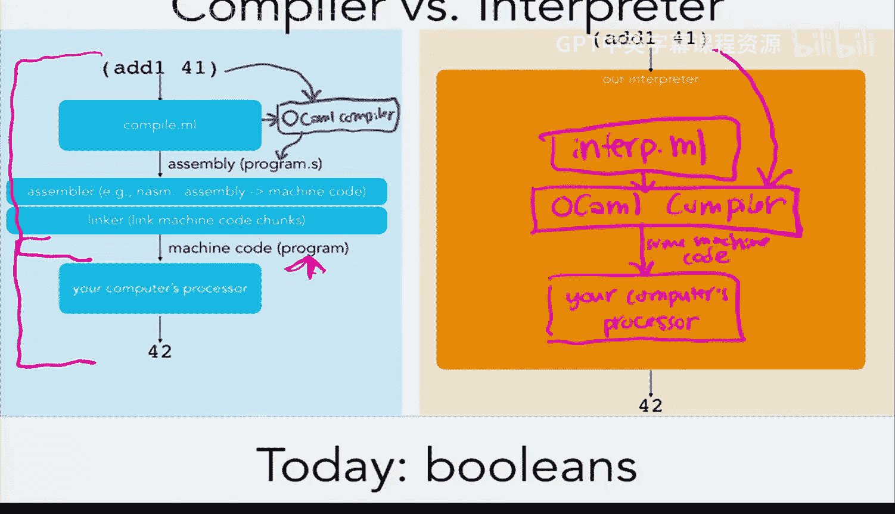
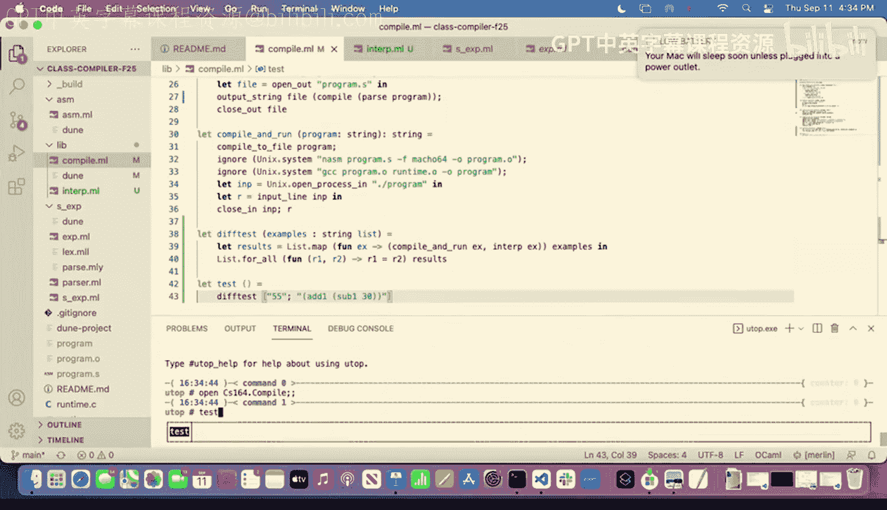
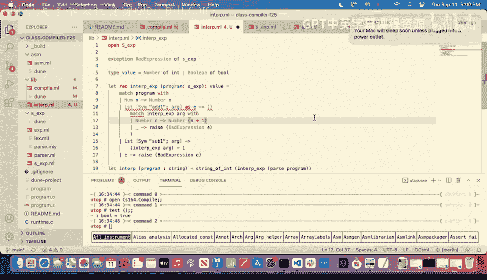

# 5：编译器正确性；布尔值（解释器）🎓






在本节课中，我们将要学习如何完成一元运算的实现，探讨编译时与运行时的区别，比较编译器与解释器的异同，并学习如何验证编译器的正确性。最后，我们将开始为我们的语言添加布尔值类型。

---





## 完成一元运算 🛠️

上一节我们讨论了如何实现一元运算，但尚未完成。我们决定，一个令人满意的实现不应在编译时预先计算所有结果，因为程序可能需要处理运行时输入（例如用户输入或文件读取）。因此，我们需要生成能够在运行时执行计算的汇编代码。

以下是我们为目标程序 `(add1 50)` 生成的汇编代码示例：
```assembly
global entry
entry:
    mov RAX, 50
    add RAX, 1
    ret
```
运行这段汇编时，处理器会依次执行指令：首先将值 `50` 移入寄存器 `RAX`，然后将其加 `1`，最后返回结果 `51`。



为了在编译器中实现这一点，我们重构了代码，将公共的汇编样板代码提取到一个辅助函数中。核心的 `compile_expr` 函数现在专注于为特定表达式生成将结果放入 `RAX` 的汇编指令。


对于 `add1` 表达式，我们的实现思路是：首先递归编译其参数，确保参数求值结果在 `RAX` 中，然后生成一条 `add RAX, 1` 指令。
```ocaml
let rec compile_expr (e : sx) : directive list =
  match e with
  | Num n -> [Mov (Reg Rax, Imm n)]
  | Lst [Sym "add1"; arg] ->
      compile_expr arg @ [Add (Reg Rax, Imm 1)]
  | Lst [Sym "sub1"; arg] ->
      compile_expr arg @ [Sub (Reg Rax, Imm 1)]
  | _ -> raise (Stuck e)
```
`sub1` 的实现与之类似。这样，我们的编译器就能处理嵌套的一元运算表达式了。

---

## 编译时 vs. 运行时 ⏳

在深入之前，我们需要明确“编译时”和“运行时”这两个核心概念。
*   **编译时**：指编译程序的过程发生的时间。此时，源代码被转换为另一种形式（如汇编代码）。
*   **运行时**：指编译后的程序实际在处理器上执行的时间。
我们也可以用 **静态** 和 **动态** 来分别描述编译时和运行时发生的事。

让我们通过一个图表来梳理使用编译器时的完整流程：

1.  **编译过程（编译时）**：我们的OCaml编译器 `compile.ml` 读取用我们自定义语言编写的程序，并生成对应的汇编代码文件（如 `program.s`）。
2.  **生成机器码（编译时）**：汇编器将汇编代码 `program.s` 转换为机器码（0和1）。
3.  **程序执行（运行时）**：处理器执行生成的机器码，最终产生结果（如 `42`）。

在这个过程中，一旦生成了机器码，即使丢弃原始的编译器，程序依然可以独立运行。

---

## 编译器 vs. 解释器 🔄

接下来，我们比较编译器和解释器。它们的核心区别在于如何将源程序转化为最终结果。

**编译器** 的类型可以看作是：`源程序 -> 目标程序`。它将一种语言编写的程序转换为另一种语言（通常是更低级的语言，如汇编）的程序。
**解释器** 的类型则是：`源程序 -> 值`。它直接分析并执行源程序，即时计算出结果。




对于解释器，其实现本身（例如 `interp.ml`）也是一个OCaml程序。当我们要运行解释器时，OCaml编译器会将其编译成机器码。因此，解释器运行时，实际上是OCaml生成的机器码在处理器上执行，由这些机器码来“解释”执行我们的自定义语言程序。解释器不需要针对特定硬件（如x86）生成代码，这个任务由底层的OCaml编译器完成。

选择编译器还是解释器，通常涉及权衡：
*   **编译器** 通常能提供更好的运行时性能和对底层细节的控制，但实现和正确性论证可能更复杂。
*   **解释器** 通常更易于实现、理解和调试，是快速原型设计和参考实现的理想选择。

在本课程中，我们将同时实现编译器和解释器，以便于对比和验证。

---

## 验证编译器正确性 ✅

如何让我们确信编译器是正确的？仅仅运行几个测试用例（如 `(add1 (sub1 43))`）是远远不够的。编译器或解释器中的错误可能会影响所有用该语言编写的程序，后果严重。

我们探讨了几种策略：
1.  **测试**：编写大量单元测试和集成测试，比较编译器输出与预期结果。
2.  **形式化验证**：使用数学证明和专用工具（如Coq）来机器检验编译器的正确性。例如，CompCert是一个经过形式化验证的C编译器。
3.  **参考实现与差分测试**：实现一个我们高度信任的、简单直观的**参考解释器**。然后，对大量输入程序，同时运行编译器和参考解释器，并比较它们的输出结果是否一致。这就是差分测试。

我们将采用 **差分测试** 作为主要方法。为此，我们需要先构建一个易于推理的参考解释器。

---

## 实现参考解释器 📝

参考解释器的结构应与编译器类似，但它的目标是直接计算表达式的值，而不是生成汇编。

我们首先定义一个新的类型 `value` 来表示语言中的值。目前只有整数：
```ocaml
type value = Number of int
```

解释器的核心函数 `interp_expr` 接收 `sx` 表达式并返回 `value`：
```ocaml
let rec interp_expr (e : sx) : value =
  match e with
  | Num n -> Number n
  | Lst [Sym "add1"; arg] ->
      let evaluated_arg = interp_expr arg in
      (match evaluated_arg with
       | Number n -> Number (n + 1)
       | _ -> raise (Stuck e))
  | Lst [Sym "sub1"; arg] ->
      let evaluated_arg = interp_expr arg in
      (match evaluated_arg with
       | Number n -> Number (n - 1)
       | _ -> raise (Stuck e))
  | _ -> raise (Stuck e)
```
解释器递归地求值子表达式，并进行相应的运算。我们可以编写一个简单的差分测试函数：
```ocaml
let diff_test (examples : string list) : bool =
  List.for_all (fun ex ->
    let compiled_result = compile_and_run ex in
    let interpreted_result = interp_program ex in
    compiled_result = interpreted_result
  ) examples
```
如果对于所有测试用例，编译器和解释器的结果都一致，我们就增加了对编译器正确性的信心。

---




## 引入布尔值 🔘

目前我们的语言只处理整数。现在，我们将添加新的基本类型：**布尔值**（`true` 和 `false`）。

在许多语言中，其他值（如0）也可能在条件判断中被视为“假”。但在Scheme/Lisp风格中，只有字面量 `false` 是假，其他所有值（包括 `true`、数字等）在布尔上下文中都被视为真。我们将遵循这个设计。

这意味着我们需要能够判断一个值在运行时是整数还是布尔值。这引出了 **静态类型** 与 **动态类型** 语言的区别：
*   **静态类型语言**（如OCaml）：类型在编译时已知。编译器可以检查类型错误，程序中通常不需要运行时类型查询。
*   **动态类型语言**（如我们正在实现的语言）：类型在运行时才能确定。因此，语言需要提供运行时类型检查操作，例如 `number?`。

因此，我们将在语言中添加诸如 `(number? e)` 和 `(boolean? e)` 的原语，它们需要在运行时通过生成的汇编代码来检查值的类型。

---

## 在解释器中扩展布尔值 🚧

为了支持布尔值，我们首先需要扩展 `value` 类型：
```ocaml
type value = Number of int | Boolean of bool
```

然后，我们需要修改解释器来处理布尔字面量和类型判断操作。例如：
*   `true` 应解释为 `Boolean true`。
*   `(number? v)` 应先解释 `v`，然后检查结果是否是 `Number _`。
*   对于 `add1` 等运算，我们需要添加类型检查，确保操作数确实是数字。

由于时间关系，我们将在下一节课开始时代码实现这部分内容，并随后将其加入编译器。

---

## 总结 📚

本节课中我们一起学习了：
1.  完成了对 `add1` 和 `sub1` 等一元运算的编译器实现。
2.  明确了 **编译时**（静态）与 **运行时**（动态）的核心区别。
3.  对比了 **编译器**（转换程序）和 **解释器**（直接求值）的不同角色与实现思路。
4.  探讨了通过 **差分测试** 对比参考解释器来验证编译器正确性的方法，并实现了简单的参考解释器框架。
5.  引入了 **布尔值** 类型，并讨论了在 **动态类型语言** 中实现运行时类型检查的必要性。



下一节课，我们将首先完善解释器对布尔值的支持，然后着手在编译器中实现它们。