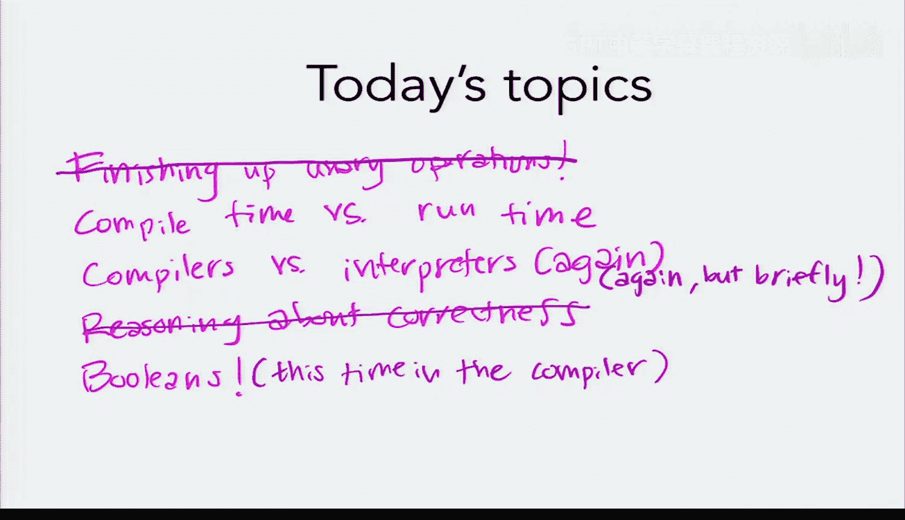
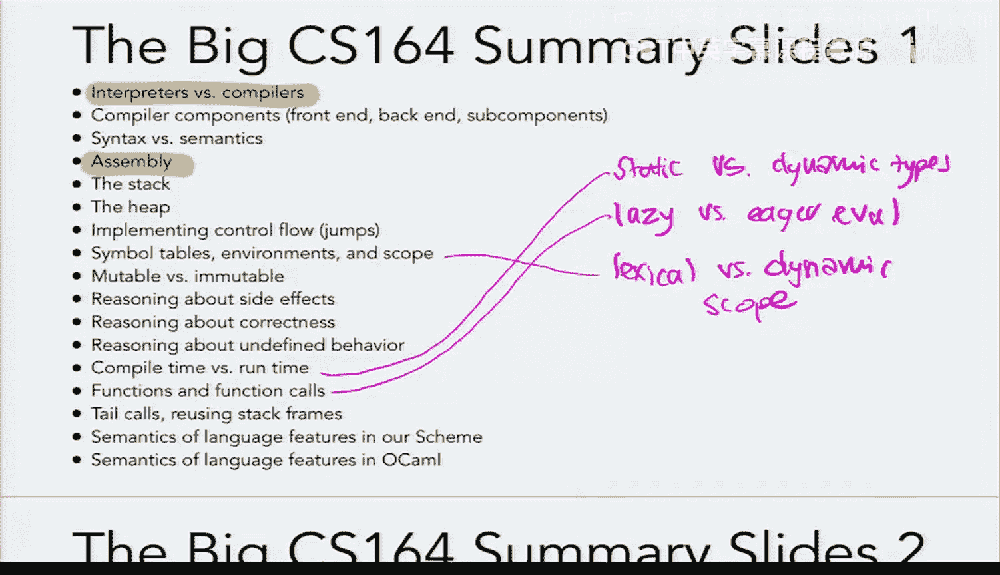
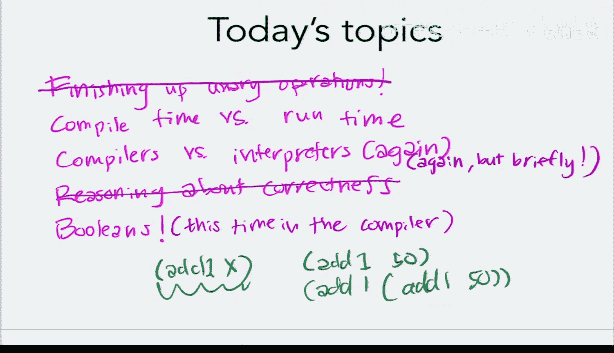
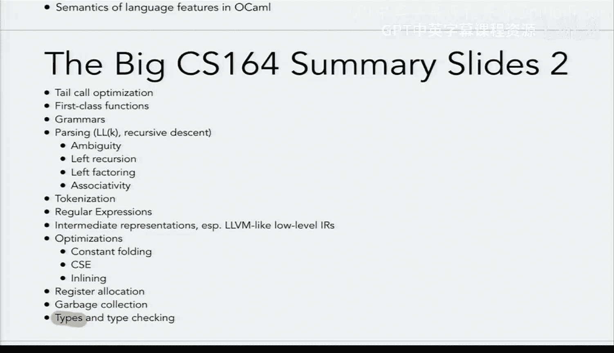
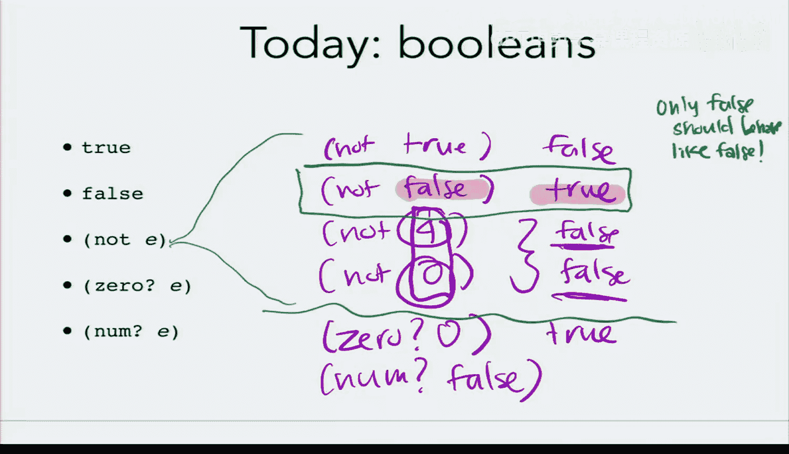
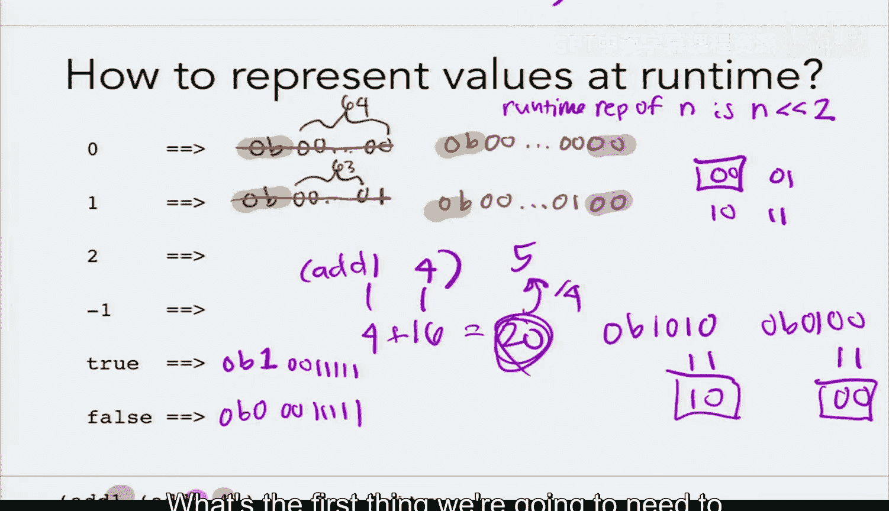
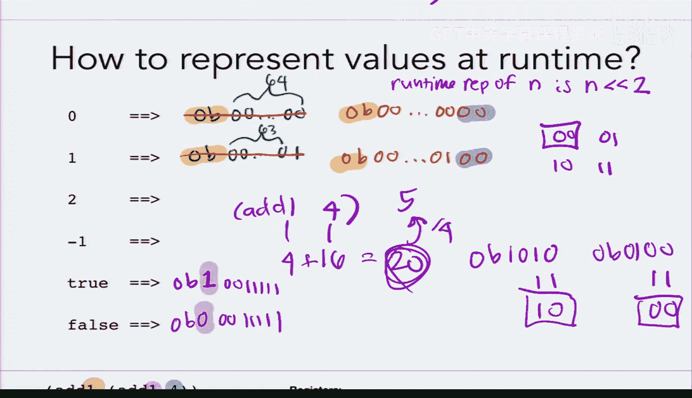
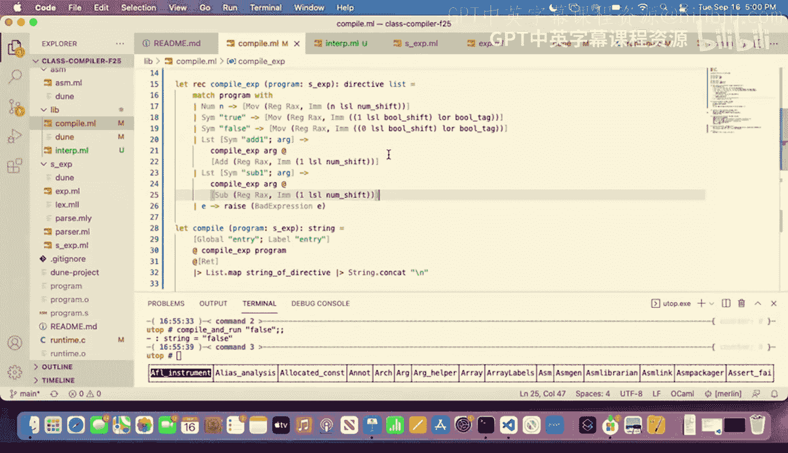
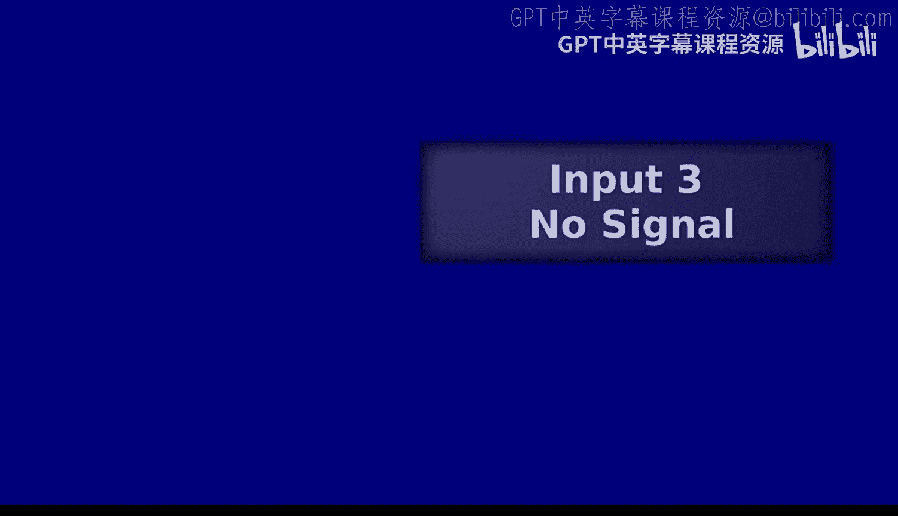

# 6：布尔值（编译器）🔧







在本节课中，我们将学习如何在编译器中添加对布尔值的支持。我们将探讨编译时与运行时的区别，并了解如何为新的数据类型设计运行时表示。

## 概述



上一节我们介绍了如何在解释器中添加布尔值。本节中，我们将看看如何在编译器中实现相同的功能。这涉及到改变数值在运行时的表示方式，以便为布尔值留出空间。





## 静态类型与动态类型

首先，回顾一下静态类型语言和动态类型语言的区别。静态类型意味着在编译时就能知道类型信息，例如 OCaml。动态类型意味着类型信息只能在运行时确定，例如我们正在实现的小型 Scheme 语言。

**核心概念**：
*   **静态类型**：类型检查在编译时进行。
*   **动态类型**：类型检查在运行时进行。

## 解释器中的布尔值

在解释器中，我们引入了 `value` 类型，它可以表示整数或布尔值。

```ocaml
type value = Number of int | Boolean of bool
```




然后，我们更新了 `interp` 函数，使其返回 `value` 类型，并实现了 `not`、`zero?` 和 `number?` 等操作。

## 编译器中的挑战

现在，我们需要在编译器中支持布尔值。编译器的任务是生成汇编指令，这些指令在运行时执行，最终将结果值放入寄存器 `RAX` 中。

问题在于，`RAX` 是一个 64 位寄存器，之前只用于存放整数的二进制表示。为了同时表示整数和布尔值，我们需要设计一种编码方案，使得通过检查 `RAX` 中特定的位（标签），就能区分出它当前存放的是哪种类型的值。

## 设计运行时表示

我们决定采用以下方案：
*   用最后两位为 `00` 的 64 位数来表示**整数**。这意味着所有整数的运行时表示都是 4 的倍数（左移两位的结果）。
*   剩余的三种位模式（`01`, `10`, `11`）可以用来表示其他类型。我们选择其中一种来代表**布尔值**。

具体来说，我们为布尔值选择一个 7 位的标签 `0000011`（实际是 `0b0000011`）。那么：
*   **`true` 的运行时表示**：`1 << 7 | bool_tag` （即 `1` 左移 7 位后，在最后 7 位贴上布尔标签）
*   **`false` 的运行时表示**：`0 << 7 | bool_tag` （即 `0` 左移 7 位后，在最后 7 位贴上布尔标签）

**核心公式**：
*   整数运行时值 = 原始整数值 `<< 2`
*   布尔值运行时值 = (`1` 或 `0`) `<< 7` | `bool_tag`

## 修改编译器

以下是需要在编译器中进行的核心修改：

首先，定义常量和标签。

```ocaml
let num_shift = 2
let num_mask = 0b11
let num_tag = 0b00

let bool_shift = 7
let bool_mask = 0b1111111
let bool_tag = 0b0000011
```

然后，修改代码生成部分。对于字面量整数，生成其运行时表示。

```ocaml
match sexp with
| Number n -> [ Mov (Reg Rax, Imm (n lsl num_shift)) ]
| Symbol "true" -> [ Mov (Reg Rax, Imm ((1 lsl bool_shift) lor bool_tag)) ]
| Symbol "false" -> [ Mov (Reg Rax, Imm ((0 lsl bool_shift) lor bool_tag)) ]
...
```




注意，这里的左移操作 `lsl` 是在 **编译时** 由 OCaml 执行的，计算结果是一个立即数，直接写入生成的汇编指令中。

## 修改运行时系统

编译器生成的汇编代码需要一个运行时系统来执行并打印结果。这个运行时系统（通常用 C 编写）需要能识别新的表示法。

以下是运行时系统中打印值的逻辑伪代码：




```c
void print_value(int64_t val) {
    if ((val & num_mask) == num_tag) {
        // 是整数：右移回原始值
        printf("%ld", val >> num_shift);
    } else if ((val & bool_mask) == bool_tag) {
        // 是布尔值：检查高位是1还是0
        if ((val >> bool_shift) & 1) {
            printf("true");
        } else {
            printf("false");
        }
    } else {
        // 未知标签，说明编译器实现有误
        fprintf(stderr, "Unknown value tag\n");
        exit(1);
    }
}
```

## 总结

本节课中我们一起学习了：
1.  **区分编译时与运行时**：编译器在编译时工作，生成代码；运行时是生成代码实际执行的阶段。
2.  **设计类型表示**：为了在低级机器表示中支持多种类型，我们使用**标签**对值进行编码，通过检查特定的位来区分类型。
3.  **实现编译器支持**：我们修改了编译器，使其能为布尔字面量生成正确的、带有标签的运行时表示。
4.  **更新运行时系统**：我们确保了运行时系统能够识别并正确打印这种新的、带有标签的值表示。





通过本节，我们为简单的动态类型语言实现了多类型支持的基础框架，这是构建更复杂语言特性的重要一步。