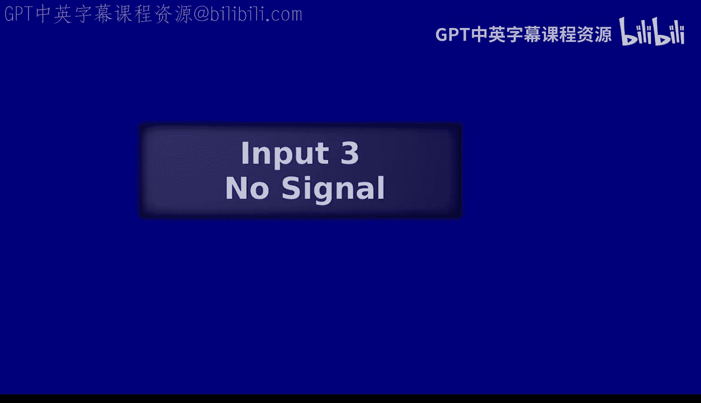
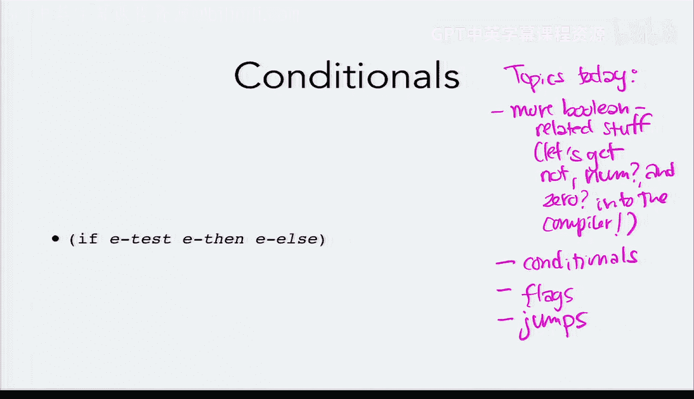
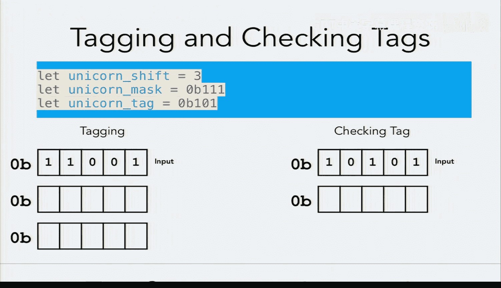
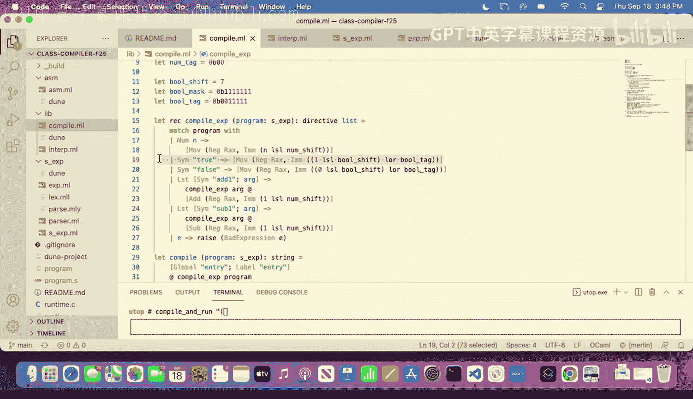
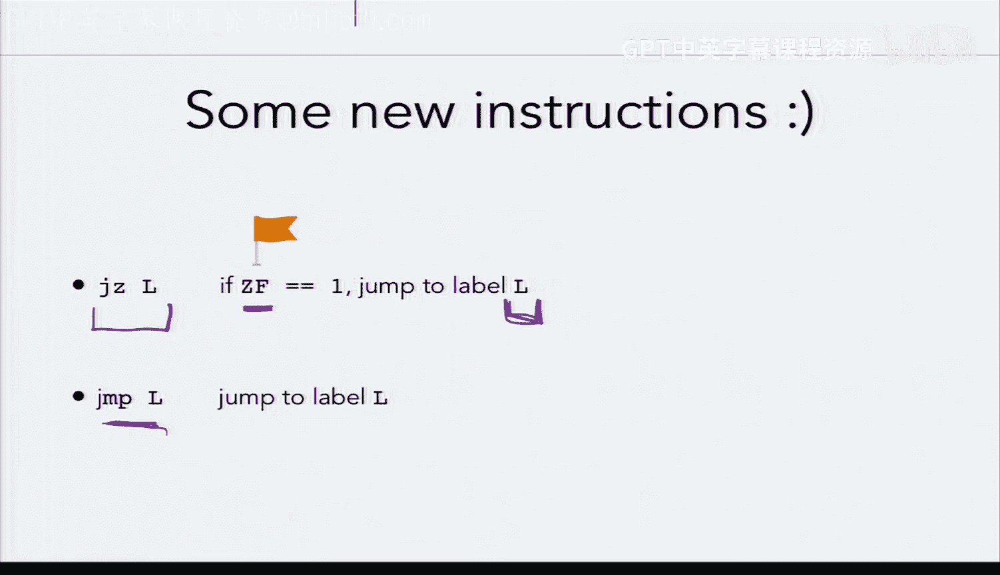
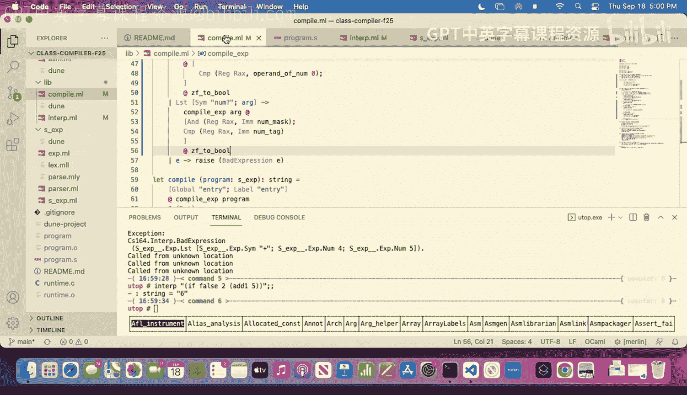

# 7：标签活动与条件语句 🏷️

在本节课中，我们将学习如何为自定义类型（如“独角兽”）应用和检查标签，深入理解标签选择背后的约束，并开始探索条件语句的实现，包括标志位和跳转指令的使用。

## 标签活动：应用与检查 🧩

上一节我们讨论了布尔值和数字的标签机制。本节中，我们来看看如何为一个虚构的类型“独角兽”应用和检查标签。

### 应用“独角兽”标签

以下是应用标签的步骤：
1.  将原始值左移，为标签位留出空间。对于“独角兽”标签，其 `unicorn_shift` 为 3，因此需要左移 3 位。
2.  将移位后的值与“独角兽”标签（假设为二进制 `101`）进行按位或（OR）操作，将标签附加到值的末尾。

**公式表示**：
`tagged_value = (original_value << shift_amount) | tag`

**注意**：左移可能导致高位比特溢出丢失，这对于数字类型尤其需要注意。

### 检查“独角兽”标签

以下是检查标签的步骤：
1.  使用掩码（mask）将值中除标签位之外的所有比特置零。对于“独角兽”标签，掩码是 `111`（二进制）。
2.  将掩码处理后的结果与“独角兽”标签进行比较。如果相等，则原始值具有“独角兽”类型。

**公式表示**：
`is_unicorn = (value & mask) == tag`

## 标签选择约束 🤔

我们了解了如何操作标签。现在，让我们思考一下如何为语言中的不同类型选择具体的标签值。

假设我们决定数字（`num`）的标签是单个比特 `0`。同时，我们需要为字符串、函数、对（pair）和向量（vector）分配标签，且这些标签长度不能超过3比特。

**核心约束**：任何类型的标签都不能是另一个类型标签的后缀，否则在运行时将无法区分它们。例如，如果数字标签是 `0`，那么任何以 `0` 结尾的标签（如 `10`）都会与数字混淆。

经过分析，在数字标签为 `0` 的约束下，我们无法为布尔类型找到一个唯一的、长度不超过3比特且不与任何其他类型标签冲突的标签。这迫使我们重新考虑设计。

**解决方案**：将数字标签改为两个比特 `00`。这样，我们就可以为其他类型分配唯一的3比特标签（例如 `001` 给字符串，`010` 给函数等），并为布尔值分配一个独特的标签（如 `000001`）。

## 条件语句与跳转 🔀

我们掌握了标签系统。接下来，我们将开始实现编程语言中一个关键的控制流结构：条件语句（`if`）。

### 标志位（Flags）与新指令

为了实现条件判断，我们需要引入两个新的汇编指令：`cmp`（比较）和 `setz`（根据零标志位设置）。

*   `cmp x, y`：比较寄存器 `x` 和 `y` 中的值。如果相等，则将零标志位（ZF）设置为1；否则设置为0。
*   `setz reg*`：如果 ZF 标志位为1，则将寄存器 `reg` 的最低字节设置为1；否则设置为0。

**关键点**：标志位（如 ZF）是处理器的一种特殊状态，由某些指令（如 `cmp`）设置，并能影响后续指令（如 `setz`）的行为。

### 实现 `not` 操作

让我们以 `not` 操作为例，看看如何使用这些指令。编译 `not true` 的流程如下：
1.  将 `true` 的运行时表示（如 `...00001`）移入 `RAX`。
2.  使用 `cmp RAX, ` 与 `false` 的表示进行比较。
3.  由于 `true` 不等于 `false`，ZF 被设为0。
4.  将 `RAX` 清零（`mov RAX, 0`），为写入结果做准备。
5.  执行 `setz RAX*`。因为 ZF=0，所以 `RAX` 最低字节被设为0。
6.  将 `RAX` 左移7位，为布尔标签留出空间。
7.  与布尔标签（如 `00000101`）进行按位或操作，得到 `false` 的最终表示。

### 实现 `zero?` 和 `number?`

`zero?` 和 `number?` 操作的实现思路类似：
*   `zero?`：将参数与数字 `0` 的表示进行比较，然后利用 ZF 标志位生成布尔结果。
*   `number?`：先将参数与数字掩码（`...11`）进行按位与操作，以提取其标签位；然后将结果与数字标签（`00`）比较，再利用 ZF 生成布尔结果。

我们创建了一个名为 `zf_to_bool` 的指令序列来封装将 ZF 标志位转换为带标签布尔值的通用步骤。

### 引入跳转（Jumps）

目前我们生成的代码都是“直线型”的。为了实现条件语句中“执行不同分支”的效果，我们需要跳转指令。

*   `jz label`：如果 ZF 标志位为1，则跳转到指定的 `label` 处继续执行。
*   `jmp label`：无条件跳转到指定的 `label` 处。

标签（label）是汇编代码中的位置标记。通过结合 `cmp`、`jz` 和 `jmp`，我们可以让程序根据运行时条件跳过某些代码段，从而实现 `if` 表达式的语义。

### 在解释器中实现 `if`

在将 `if` 加入编译器之前，我们可以先在解释器中实现它，这相对简单，因为可以直接利用 OCaml 自身的 `if` 表达式。

解释 `if` 表达式的逻辑是：
1.  首先解释条件测试表达式。
2.  如果测试结果严格等于布尔值 `false`，则解释 `else` 分支。
3.  否则（包括测试结果为 `true` 或其他任何非 `false` 值），解释 `then` 分支。

## 总结 📚

本节课中我们一起学习了：
1.  **标签的实践**：通过“独角兽”类型的例子，回顾了为值应用标签以及检查标签的具体步骤。
2.  **标签设计**：理解了标签选择需要避免后缀冲突，并通过调整数字标签长度解决了布尔值标签的分配问题。
3.  **条件语句基础**：引入了标志位（ZF）和 `cmp`、`setz` 指令，并利用它们实现了 `not`、`zero?` 和 `number?` 操作。
4.  **控制流**：介绍了跳转指令 `jz` 和 `jmp`，它们是实现 `if` 条件分支的关键。
5.  **解释器扩展**：在解释器中初步实现了 `if` 表达式的逻辑。

下节课，我们将把这些知识结合起来，在编译器中实现完整的 `if` 条件表达式。