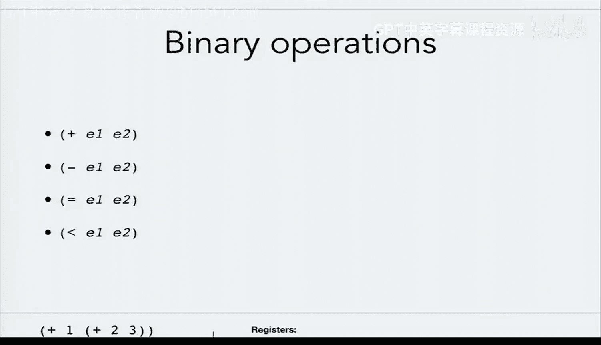
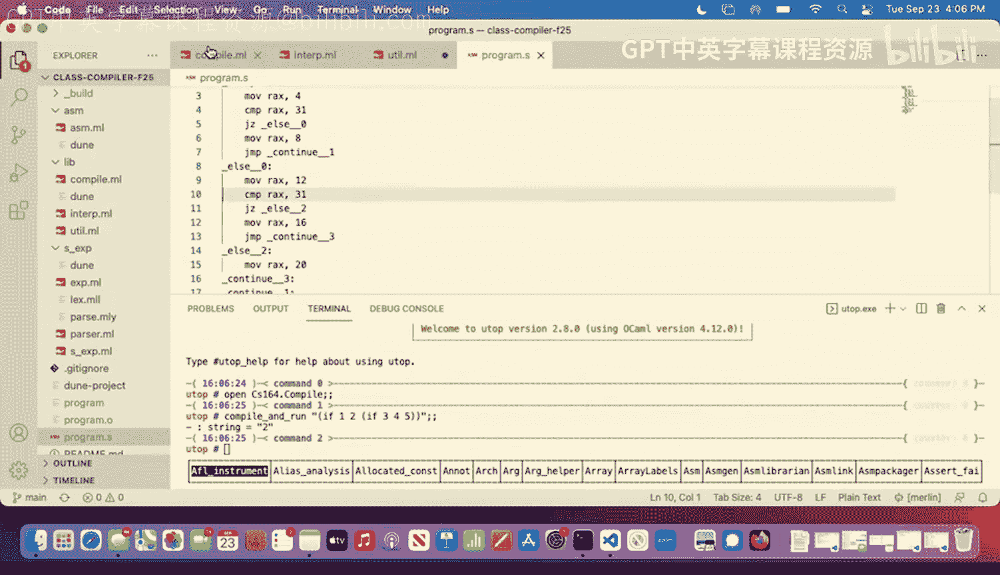
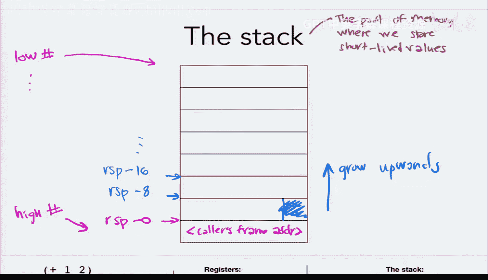
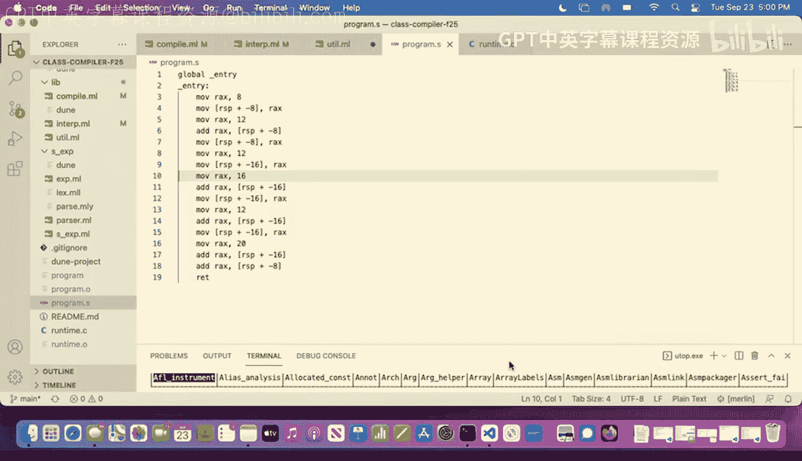

# 8：二元运算


在本节课中，我们将学习如何为二元运算（如加法、减法、比较等）实现编译。我们将从回顾条件表达式（if）的实现开始，然后深入探讨如何处理涉及多个子表达式的运算，并引入栈（Stack）的概念来管理中间值。




---

## 回顾：条件表达式（if）的实现

上一节我们介绍了如何使用汇编指令 `JZ` 和 `JMP` 来实现条件表达式。本节中，我们来看看如何生成唯一的标签以避免冲突。

为了实现 `if` 表达式，我们使用以下汇编结构：
1.  计算测试（test）表达式，结果存入 `RAX`。
2.  将 `RAX` 中的值与表示 `false` 的运行时值进行比较。
3.  如果相等（即测试结果为假），使用 `JZ` 指令跳转到 `else` 分支的标签。
4.  否则，顺序执行 `then` 分支的代码，执行完毕后用 `JMP` 指令跳转到 `continue` 标签，跳过 `else` 分支。
5.  定义 `else` 标签及其对应的代码，最后是 `continue` 标签。

为了避免在程序中多次使用 `if` 时产生重复的 `else` 标签，我们需要生成唯一的标签名。这可以通过一个带有内部计数器的函数来实现。

以下是生成唯一标签的辅助函数示例：
```ocaml
let gensym =
  let counter = ref 0 in
  fun base_name ->
    let current = !counter in
    counter := current + 1;
    base_name ^ "__" ^ string_of_int current
```
这个函数使用了 OCaml 的引用（`ref`）来创建可变状态。每次调用 `gensym "else"` 都会返回一个像 `"else__0"`、`"else__1"` 这样递增的唯一字符串。

---

## 引入二元运算

现在，让我们转向本节课的核心：二元运算。我们的语言将支持加法（`+`）、减法（`-`）、相等比较（`=`）和小于比较（`<`）。




在解释器（Interpreter）中，我们需要递归地求值两个子表达式，然后根据运算符执行相应的操作。以下是处理加法的示例：
```ocaml
| Plus (e1, e2) ->
    match (interp e1, interp e2) with
    | (Num n1, Num n2) -> Num (n1 + n2)
    | _ -> raise BadExpression
```
对于 `=` 和 `<`，我们返回布尔值；对于 `+` 和 `-`，我们返回数字。

---

## 编译二元运算的挑战

在编译器（Compiler）中，我们面临一个新挑战：如何管理多个子表达式求值产生的中间结果？

简单的想法是依次编译 `e1` 和 `e2`：
```ocaml
compile_expr e1;
compile_expr e2
```
但 `compile_expr` 的设计总是将结果放入 `RAX` 寄存器。这意味着编译 `e2` 时会覆盖 `e1` 的结果。

一个初步的改进是使用另一个寄存器（如 `R8`）来暂存 `e1` 的结果：
```ocaml
compile_expr e1;
Mov (R8, RAX);
compile_expr e2;
Add (RAX, R8)
```
然而，对于嵌套的表达式（如 `(1 + 2) + 3`），这种方法仍然会失败，因为我们需要保存的中间值数量可能超过可用寄存器的数量。

---

## 解决方案：使用栈

为了解决这个问题，我们引入栈（Stack）来存储中间结果。栈是内存中的一个区域，我们可以按需分配空间来保存数据。

在我们的模型中：
*   栈从高内存地址向低内存地址增长。
*   寄存器 `RSP` 指向栈的当前“顶部”（实际上是可用空间的最低地址）。
*   我们通过形如 `[RSP - 8]`、`[RSP - 16]` 的地址来访问栈上的位置（每次偏移 8 字节，对应一个 64 位值）。




关键思想是：在编译时跟踪下一个可用的栈位置（栈索引）。每当我们计算一个子表达式并需要保存其值时，就将其存储到当前栈索引指向的位置，然后将栈索引递减（例如，`-8` -> `-16`），为下一个值腾出空间。

因此，`compile_expr` 函数需要增加一个参数 `stack_index`，用来指示当前可用的栈槽偏移量。

以下是编译加法时使用栈的概览：
```ocaml
let rec compile_expr expr stack_index =
  match expr with
  | Plus (e1, e2) ->
      (* 编译左子表达式 e1，结果在 RAX *)
      compile_expr e1 stack_index;
      (* 将 RAX 中的值保存到当前栈槽 *)
      Mov (MemOffset (Rsp, stack_index), RAX);
      (* 编译右子表达式 e2，使用下一个栈槽 (stack_index - 8) *)
      compile_expr e2 (stack_index - 8);
      (* 将之前保存的左值加载到 R8 *)
      Mov (R8, MemOffset (Rsp, stack_index));
      (* 执行加法: RAX = RAX (右值) + R8 (左值) *)
      Add (RAX, R8)
  | ... (* 其他情况 *)
```
对于减法，只需将最后的 `Add` 改为 `Sub`。

对于比较运算（`=` 和 `<`），流程类似，但最后使用 `Cmp` 指令比较 `R8` 和 `RAX` 中的值，然后根据相应的标志位（ZF 或 LF）设置布尔值到 `RAX`。

---

## 当前实现的局限性

需要注意的是，我们目前的编译器实现**没有进行运行时类型检查**。解释器在遇到 `(true + 1)` 这样的表达式时会抛出错误，但我们的编译器会生成汇编代码并产生无意义的运行时结果（可能是一个被解释为数字的布尔值标签）。确保类型安全是后续课程需要解决的问题。

---

## 总结

本节课中我们一起学习了：
1.  **完善了条件表达式**：通过生成唯一标签来可靠地编译 `if` 表达式。
2.  **引入了二元运算**：在解释器中实现了 `+`、`-`、`=`、`<` 的求值逻辑。
3.  **解决了中间值存储问题**：认识到仅使用寄存器不足以编译复杂的嵌套表达式。
4.  **引入了栈的概念**：学会了如何使用内存中的栈区域，并通过在编译时跟踪 `stack_index` 来存储和检索中间结果，从而正确编译二元运算。



通过使用栈，我们为编译器处理更复杂、更深层嵌套的表达式奠定了基础。下一节课，我们将继续探索如何利用栈来实现更强大的语言特性。