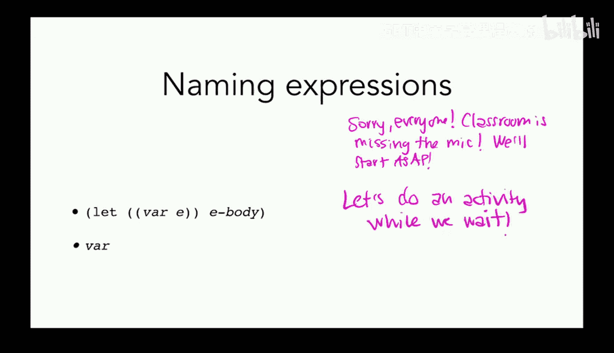
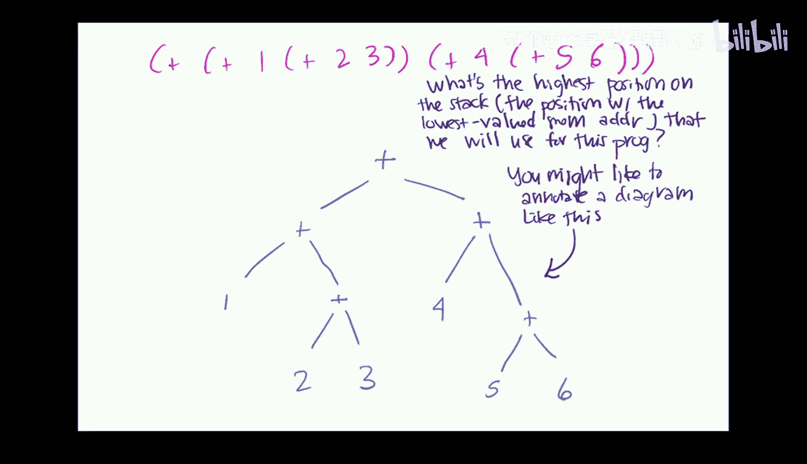
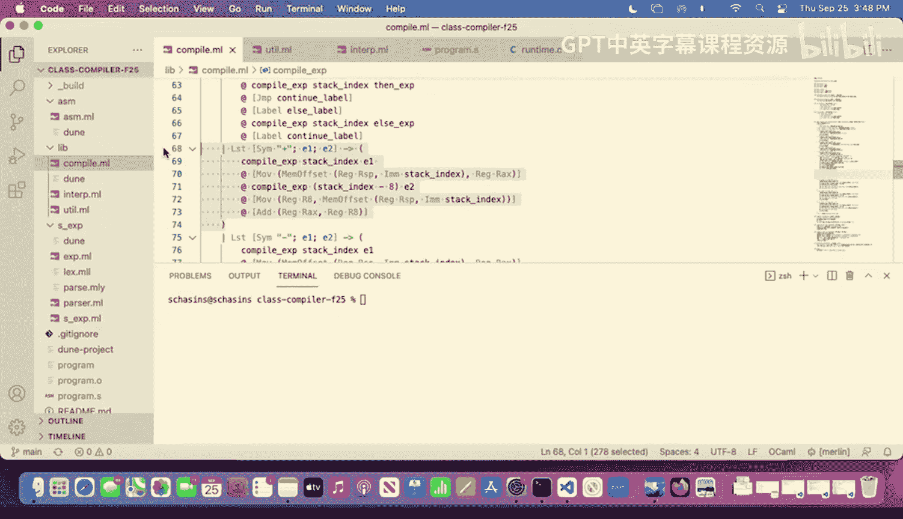
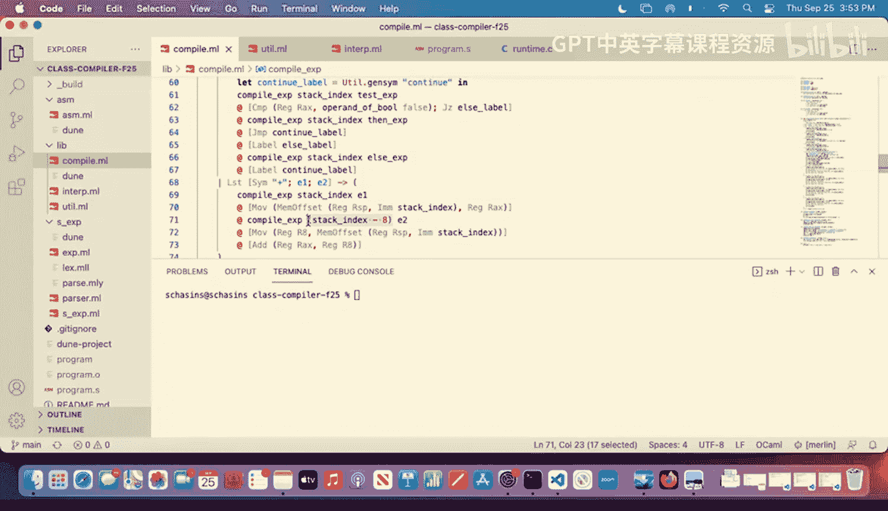
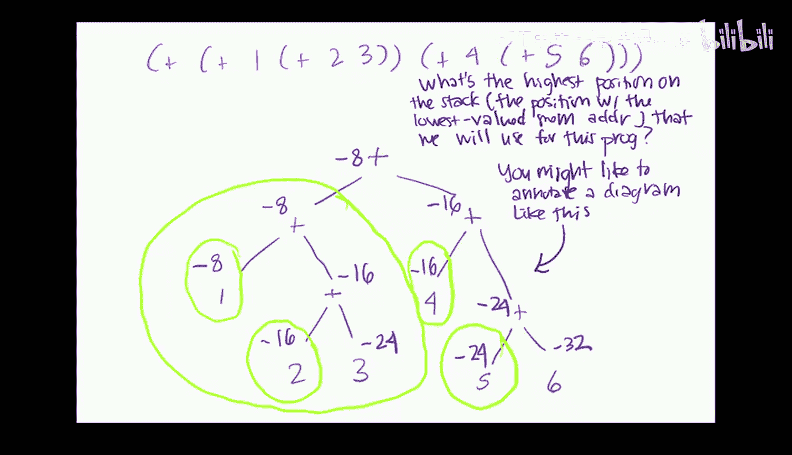
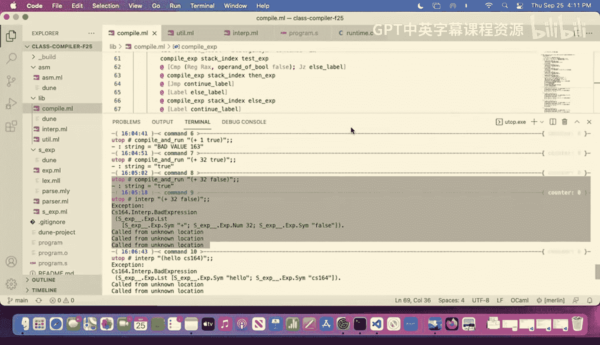
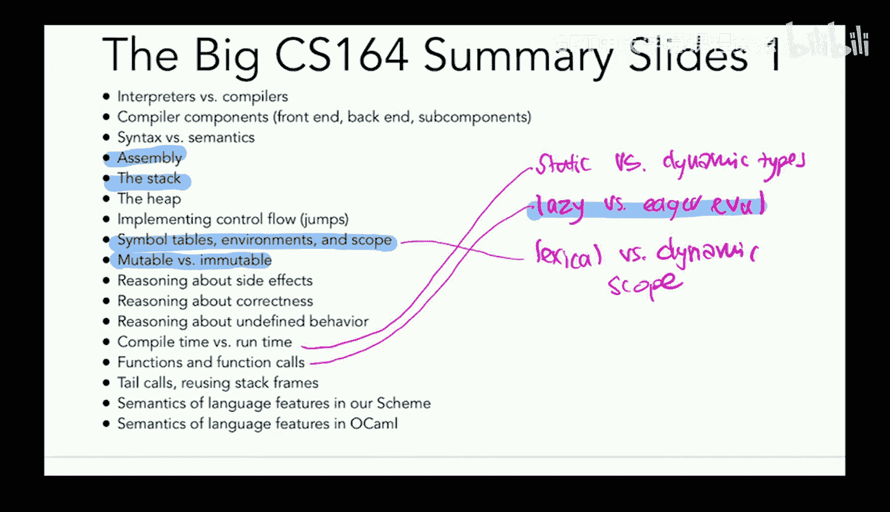
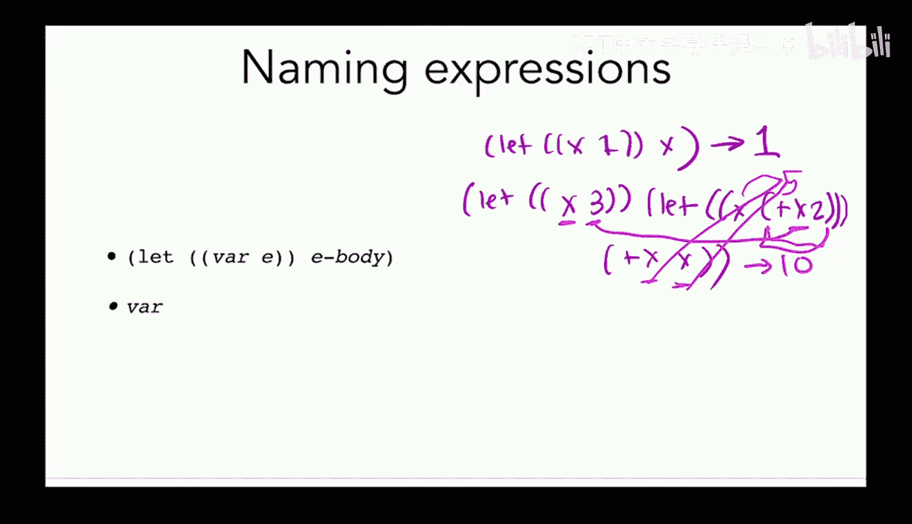
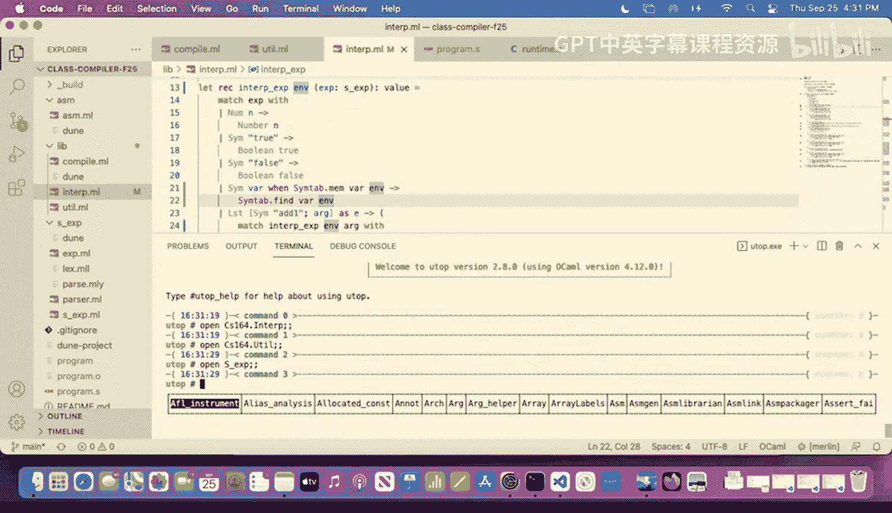
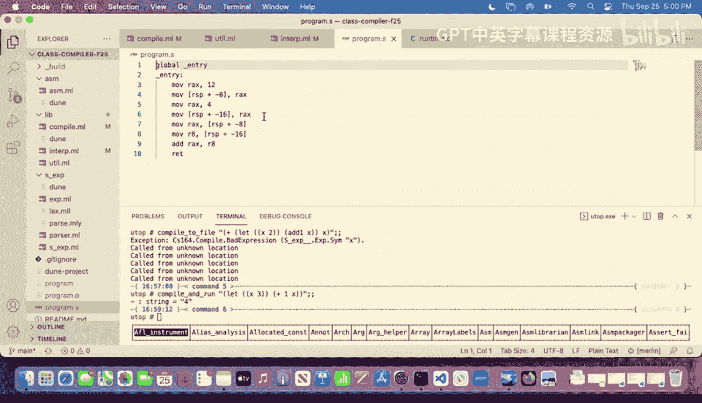

# 9：命名表达式（Let）📚











在本节课中，我们将要学习如何为我们的语言添加命名表达式（`let` 绑定）。我们将探讨如何在解释器和编译器中实现它，理解惰性求值与急切求值的区别，并学习如何使用符号表来管理变量名到其存储位置的映射。


---


## 概述




上一节我们介绍了栈的使用和二元操作的编译。本节中，我们来看看如何为表达式命名，即实现 `let` 绑定。这允许我们将一个值绑定到一个名称上，并在后续的表达式中使用这个名称。

---

## 解释器中的实现

首先，我们来看看如何在解释器中实现 `let` 表达式。我们需要一个环境（`environment`）来存储名称到值的映射。

### 环境与符号表

在解释器中，我们使用一个符号表（`symbol table`）来作为环境。它是一个从名称（字符串）映射到值的数据结构。

```ocaml
type env = (string, value) Symtab.t
```




以下是使用符号表的基本操作：

*   `Symtab.add name value env`：向环境 `env` 中添加一个从 `name` 到 `value` 的新映射，并返回一个新的环境。
*   `Symtab.find name env`：在环境 `env` 中查找 `name` 对应的值。
*   `Symtab.mem name env`：检查 `name` 是否存在于环境 `env` 中。

### 惰性求值与急切求值

在实现 `let` 时，我们需要决定在环境中存储什么。有两种主要策略：

1.  **急切求值（Eager Evaluation）**：在绑定名称时，立即计算表达式的值，并将该值存储在环境中。
2.  **惰性求值（Lazy Evaluation）**：在绑定名称时，仅存储表达式本身。只有当名称被使用时，才计算其值。



我们的解释器将采用急切求值策略，即在 `let` 绑定时就计算表达式的值。





### 解释 `let` 表达式

现在，我们来实现 `let` 表达式的解释逻辑。核心思想是：
1.  计算绑定表达式 `e` 的值。
2.  将这个值添加到当前环境中，创建一个新的环境。
3.  在这个新环境中解释 `let` 的主体部分 `body`。




```ocaml
let rec interp_exp (exp : s_exp) (env : env) : value =
  match exp with
  | Let (name, e, body) ->
      let e_val = interp_exp e env in
      let new_env = Symtab.add name e_val env in
      interp_exp body new_env
  | ... (* 其他表达式类型 *)
```

这种实现利用了 OCaml 中符号表的不可变性。当我们添加一个新绑定时，会得到一个新的环境，而旧环境保持不变。这自然地实现了词法作用域（lexical scope），即变量只在定义它的 `let` 表达式的主体内部可见。

---

## 编译器中的实现

上一节我们在解释器中实现了 `let`。本节中，我们来看看如何在编译器中实现它。关键区别在于，编译器需要在编译时决定将变量的值存储在何处。

### 编译器的符号表

在编译器中，我们同样需要一个符号表。但是，编译器在编译时无法知道运行时的具体值（例如，未来用户输入的值）。因此，我们不能在符号表中存储值。

相反，我们在符号表中存储变量值在栈上的位置（偏移量）。



```ocaml
type compile_env = (string, int) Symtab.t
```

### 编译 `let` 表达式

编译 `let` 表达式的步骤如下：
1.  使用当前的栈索引和符号表，编译绑定表达式 `e`，将其值存入 `%rax`。
2.  将这个值存储到当前栈索引指向的栈位置。
3.  更新符号表，将变量名映射到我们刚刚使用的栈索引。
4.  **非常重要**：将栈索引递减（例如 `-8`），以确保在编译 `body` 时不会覆盖刚才存储的值。
5.  使用更新后的符号表和栈索引来编译 `body`。


```ocaml
let rec compile_exp (exp : s_exp) (si : int) (tab : compile_env) : string =
  match exp with
  | Let (name, e, body) ->
      let e_code = compile_exp e si tab in
      let store_code = movq ~src:(reg Rax) ~dst:(stack_addr si) in
      let new_tab = Symtab.add name si tab in
      let new_si = si - 8 in
      let body_code = compile_exp body new_si new_tab in
      e_code ^ store_code ^ body_code
  | ... (* 其他表达式类型 *)
```

### 编译变量引用

当编译一个变量名（如 `x`）时，我们需要从符号表中查找它对应的栈偏移量，然后将该内存位置的值加载到 `%rax` 中。

```ocaml
| Name name ->
    let stack_offset = Symtab.find name tab in
    movq ~src:(stack_addr stack_offset) ~dst:(reg Rax)
```

### 编译时与运行时

需要注意的是，编译器的符号表仅在编译时存在。它的所有信息（变量名对应的栈偏移量）都会被“烘焙”到生成的汇编代码中。在程序运行时，不存在一个 OCaml 的符号表数据结构；变量访问直接通过硬编码的栈地址（如 `-8(%rbp)`）来完成。

这意味着，如果一个变量名在编译时的符号表中找不到（例如，在定义它的 `let` 表达式外部使用它），编译器将无法生成有效的汇编代码，从而产生一个编译时错误。

---

## 总结

本节课中我们一起学习了命名表达式（`let`）的实现。
*   在解释器中，我们引入了环境（符号表）来管理名称到值的映射，并采用急切求值策略。
*   在编译器中，我们使用符号表来映射名称到栈偏移量，并在编译 `let` 表达式时，需要小心管理栈空间，避免覆盖已存储的值。
*   我们理解了编译器的符号表仅存在于编译时，其信息被固化到生成的机器码中，这导致了未定义变量的错误会在编译时被捕获。



通过实现 `let`，我们的语言获得了定义和使用变量的能力，这是构建更复杂程序的基础。