# 11：错误处理 🛠️

在本节课中，我们将学习如何处理程序中的错误。我们将回顾之前关于堆和配对的内容，并探讨如何在编译器和运行时中实现错误检查，以确保程序在遇到无效操作时能够优雅地失败，而不是产生不可预测的行为。

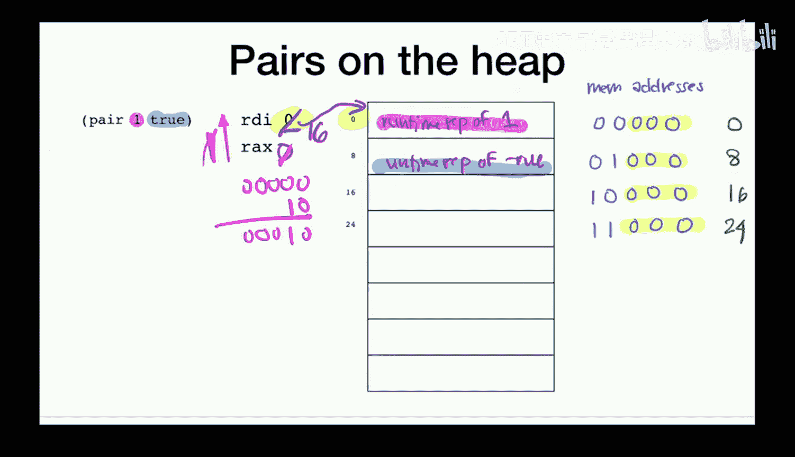

---

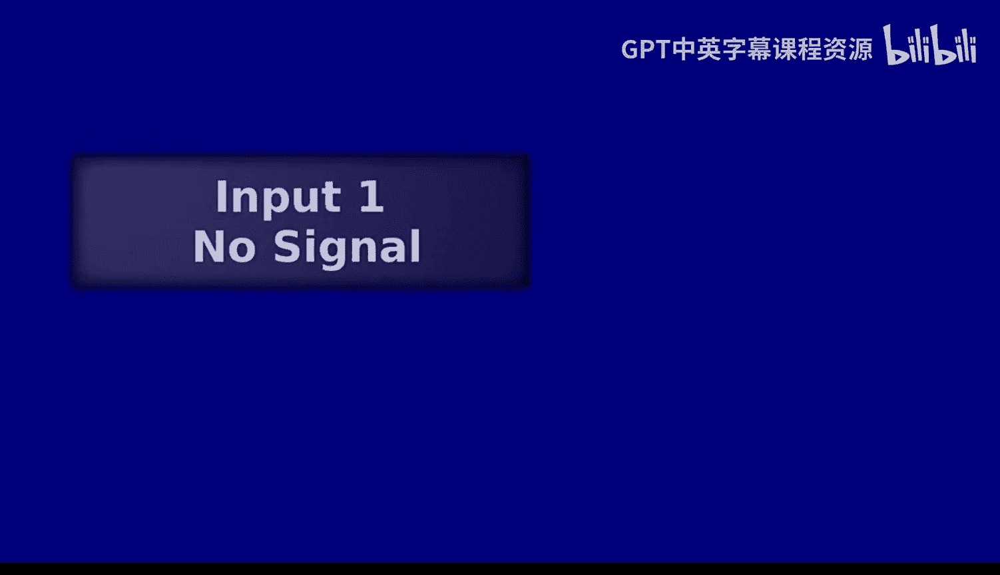

## 回顾：堆与配对

上一节我们介绍了如何在堆上存储配对。本节中，我们来看看如何实现配对的基本操作，并理解其内存布局。

我们决定将配对的左值存储在堆的第一个可用槽中，右值存储在下一个槽中。为了在寄存器 `RAX` 中表示这个配对，我们存储一个指向堆中配对起始地址的指针。由于所有堆地址都是8的倍数，其二进制表示的最后三位总是0，这为我们添加标签提供了便利。

以下是实现配对构造的核心代码逻辑：

```assembly
; 计算左表达式 e1 的值，存入 RAX
...
; 将 RAX 的值临时保存到栈上
mov [rsp - 8], rax
; 计算右表达式 e2 的值，存入 RAX
...
; 将之前保存的左值恢复到 R8
mov r8, [rsp - 8]
; 将左值存入堆的第一个槽（地址在 RDI 中）
mov [rdi], r8
; 将右值存入堆的下一个槽
mov [rdi + 8], rax
; 将堆的起始地址存入 RAX 作为配对的表示
mov rax, rdi
; 为地址添加配对标签（例如，标签值为2）
or rax, 2
; 更新 RDI，指向堆的下一个可用位置
add rdi, 16
```

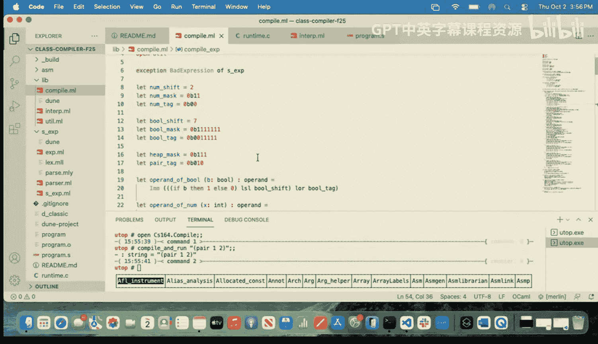

为了从配对中提取左值，我们需要移除标签并访问对应的内存地址：

```assembly
; 假设配对地址（带标签）已在 RAX 中
; 移除配对标签
sub rax, 2
; 访问该地址，获取左值
mov rax, [rax]
```

提取右值的操作类似，但需要额外偏移8个字节：

```assembly
; 移除配对标签并偏移8字节以获取右值
sub rax, 2
mov rax, [rax + 8]
```

---

## 运行时类型检查与错误处理

现在我们已经实现了配对，但我们的编译器目前对某些非法操作（例如对非数字值使用 `add1`）的处理方式与解释器不一致，甚至可能产生未定义行为。本节中，我们来看看如何通过运行时类型检查来捕获这些错误。

我们首先在C运行时中创建一个通用的错误报告函数：

```c
void error() {
    printf("ERROR\n");
    exit(1);
}
```

然后，在汇编代码中声明这个外部函数，以便在需要时调用：

```assembly
extern error
```

接下来，我们创建辅助函数来检查值是否为数字。关键在于，检查时不能破坏 `RAX` 中原始值的表示：

```assembly
ensure_num:
    ; 将待检查的值复制到 R8，避免破坏 RAX
    mov r8, rax
    ; 使用数字掩码（例如，二进制...001）检查最后两位标签
    and r8, 1
    ; 与数字标签（例如，0）比较
    cmp r8, 0
    ; 如果不是数字，跳转到错误处理
    jne error
    ret
```

现在，我们可以在 `add1` 的实现中使用这个检查：

```assembly
; 实现 add1
; 先确保 RAX 中的值是数字
call ensure_num
; 如果是数字，安全地执行加一操作
add rax, 8 ; 假设我们的数字表示是实际值的8倍
```

我们也可以用类似的方法确保操作对象是配对：

```assembly
ensure_pair:
    mov r8, rax
    ; 使用堆掩码（例如，二进制...111）检查最后三位
    and r8, 7
    ; 与配对标签（例如，2）比较
    cmp r8, 2
    jne error
    ret
```

并在 `left` 操作中使用它：

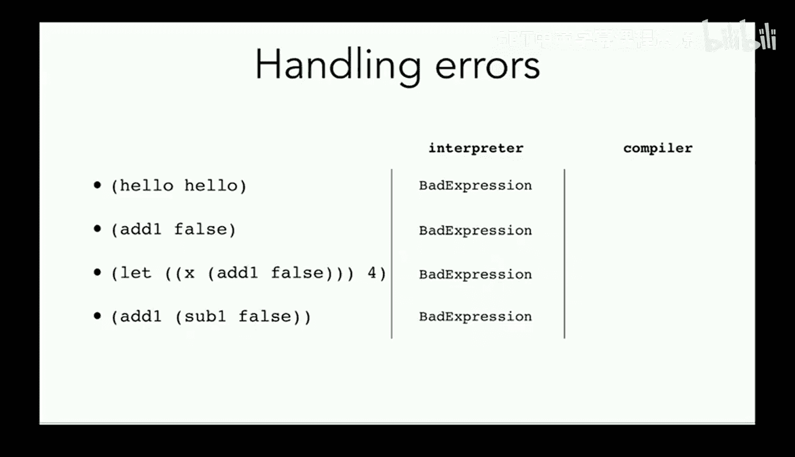

```assembly
; 实现 left
call ensure_pair
; 安全地提取左值
...
```

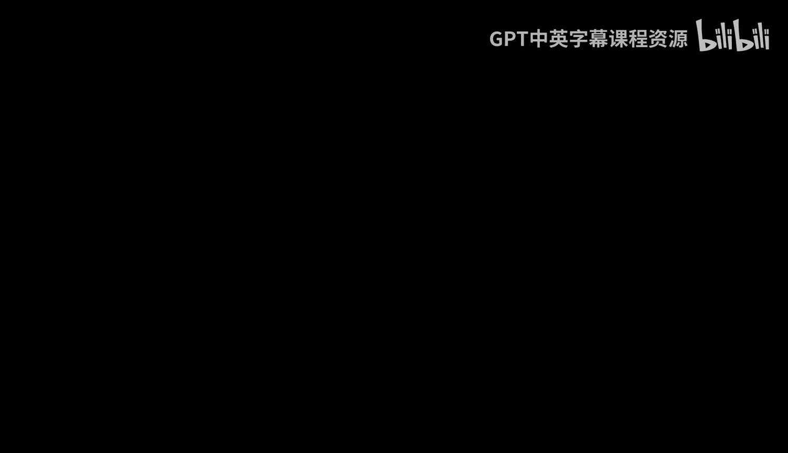

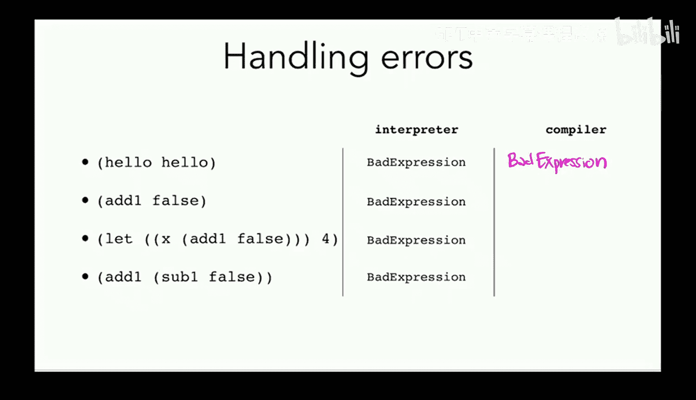

---

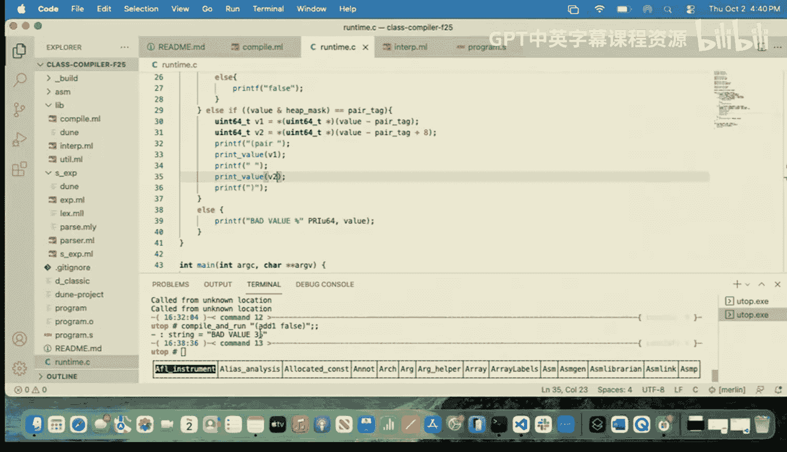

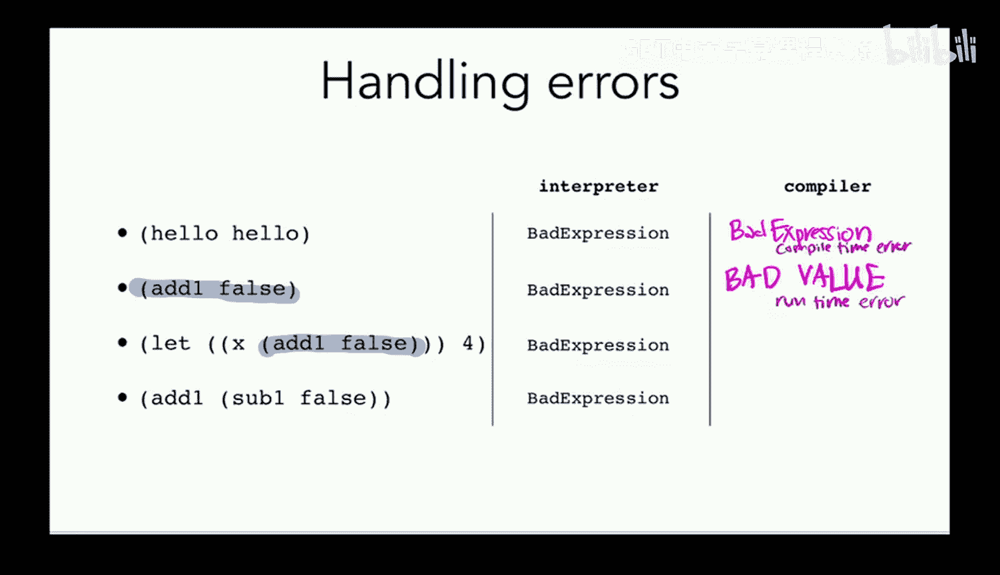

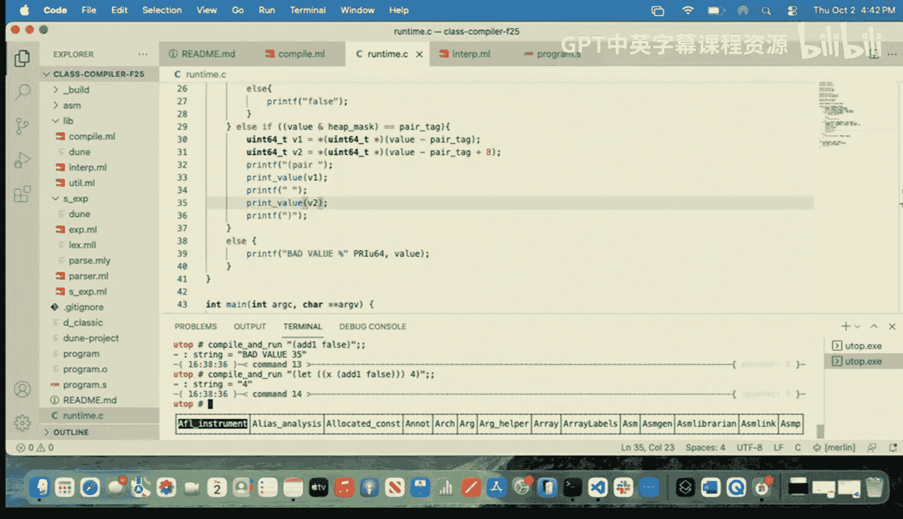


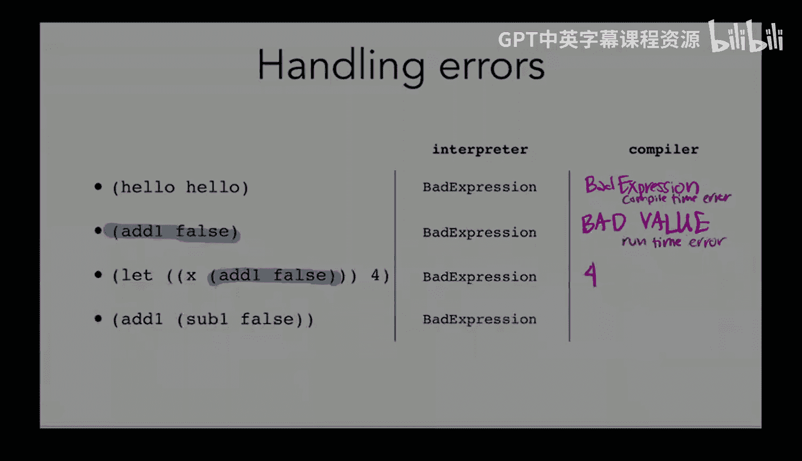

## 解释器与编译器的行为对齐

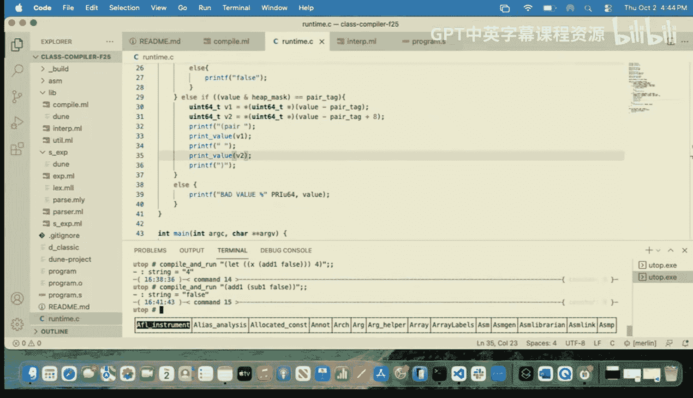

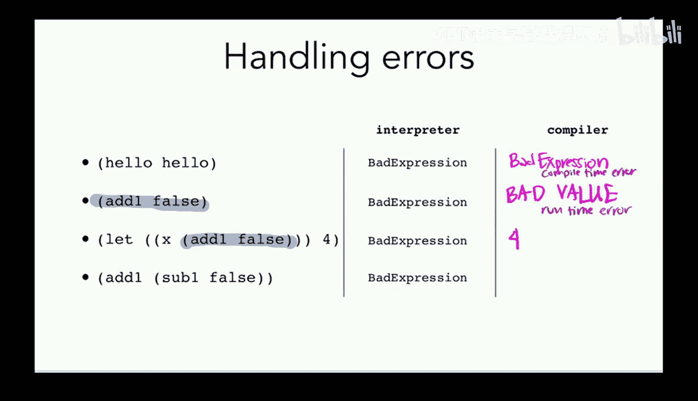

我们遇到的一个挑战是，解释器（使用结构相等性）和编译器（使用物理相等性）对于配对相等的判断结果不同。例如，`(pair 1 2) == (pair 1 2)` 在解释器中为真，在编译器中为假。

长期解决方案是在编译器中实现递归遍历的结构相等性检查，但这需要函数功能。在获得函数之前，我们采取一个临时方案：暂时将相等性操作 `==` 限制为仅用于比较数字。

另一个差异涉及错误触发时机。考虑程序 `(if true 1 hello)`。解释器采用惰性求值，因为条件为真，它永远不会评估 `hello`，因此不会出错。而编译器需要为整个程序生成汇编代码，因此会尝试处理 `hello` 并触发“错误表达式”异常。这引发了关于错误是在编译时还是运行时发生的思考。

为了测试包含错误情况的程序，我们更新了测试框架，使其能够捕获并比较解释器和编译器产生的错误输出。

---

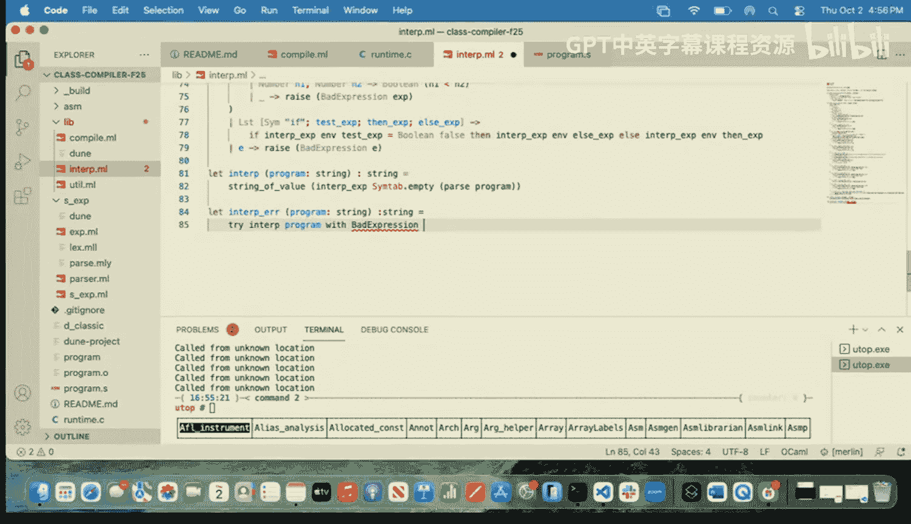

## 总结

本节课中我们一起学习了：
1.  **回顾了配对在堆上的实现**，包括构造以及 `left` 和 `right` 操作的提取。
2.  **引入了运行时类型检查**，通过 `ensure_num` 和 `ensure_pair` 等辅助函数，在非法操作（如对布尔值使用 `add1`）发生时触发错误，而不是产生不可预测的结果。
3.  **讨论了解释器与编译器在语义上的差异**，特别是相等性判断和错误触发时机的问题，并采取了初步措施使它们的行为在错误处理上更加一致。
4.  **增强了程序的健壮性**，使得更多类型的编程错误能够被捕获并报告，而不是导致未定义行为。

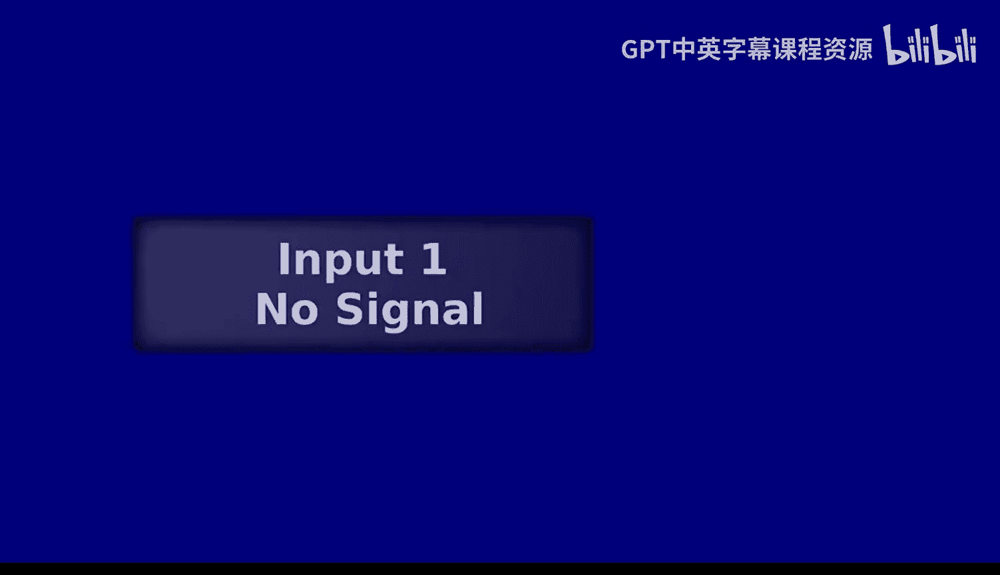

通过实现这些错误检查机制，我们使编译器更加强大和可靠，为程序员提供了更好的反馈。