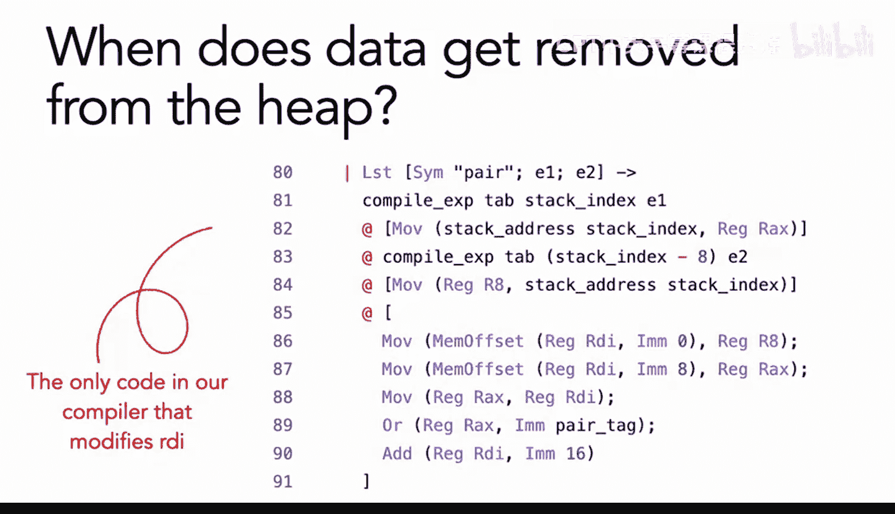
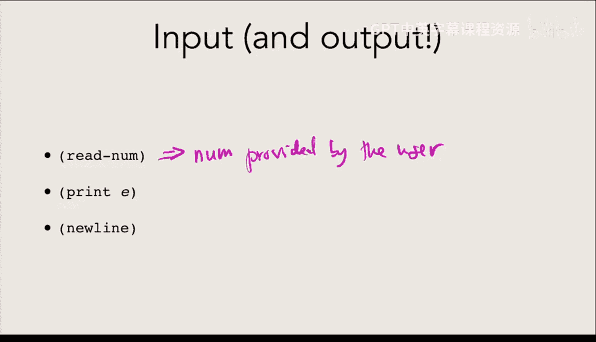
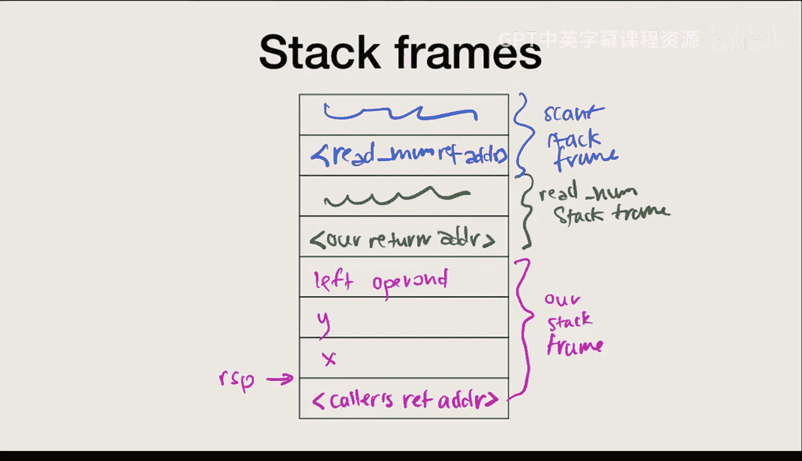
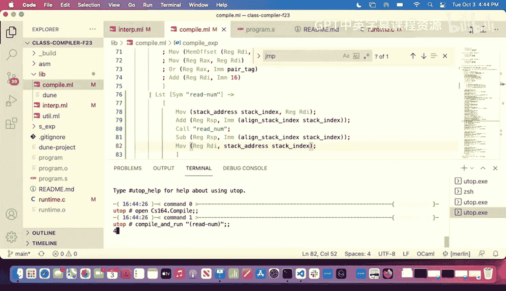
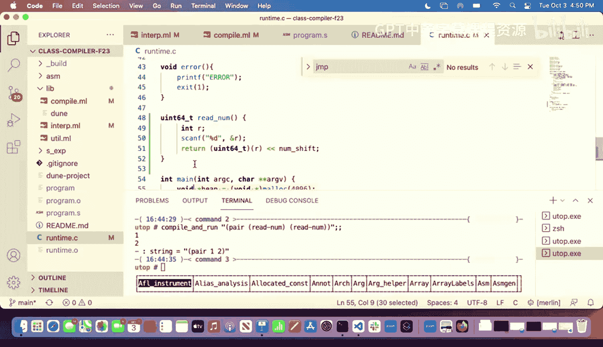
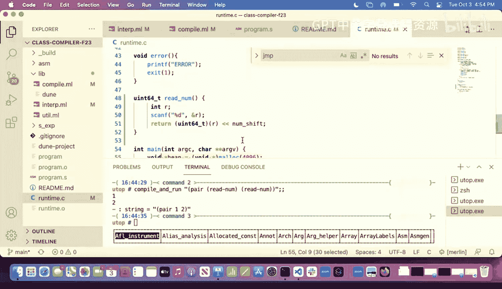
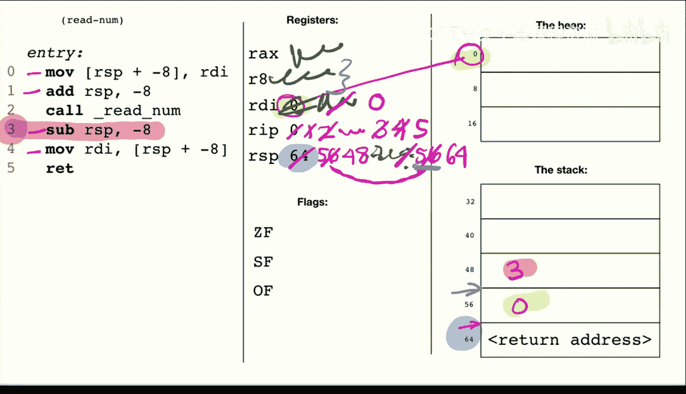

# 12：与环境交互（输入）📚


在本节课中，我们将要学习如何让我们的编程语言与外部环境进行交互，具体来说，是实现从用户那里读取输入的功能。我们将看到，这如何改变了我们对程序执行顺序的理解，并需要我们在编译器中引入新的机制来管理函数调用和状态。

---

## 回顾：内存管理 🧠

在深入新内容之前，让我们先回顾一下之前关于内存使用的讨论，特别是栈和堆的区别。

上一节我们介绍了栈和堆的基本概念，本节中我们来看看一些具体的决策点。

### 何时更新栈索引？

栈索引（`stack_index`）用于跟踪栈上可用的下一个位置。我们只在**实际使用了一个栈槽**来存储数据时，才会将其减小（例如减去8）。这确保了后续的编译步骤知道哪些位置已被占用。

### 为何某些数据必须放在堆上？

对于像“对”（pair）这样的复合数据结构，我们无法在编译时确定其确切大小（例如，一个对可能包含数字，也可能包含另一个对）。由于栈索引的更新和偏移量的计算都发生在编译时，如果不知道大小，我们就无法在汇编代码中正确预留栈空间。因此，未知大小的数据必须放在堆上。

### 寄存器 vs. 栈




我们更倾向于将数据存储在寄存器中，因为访问速度更快。然而，寄存器的数量（16个）是有限的。在实践中，编译器会进行**寄存器分配**，决定哪些值可以保留在寄存器中，哪些必须“溢出”（spill）到栈上。一个简单的经验法则是：如果后续有递归调用可能会覆盖寄存器中的值，那么最好先将该值存储到栈上。




### 堆中的数据何时被移除？

在我们当前的编译器实现中，**数据永远不会从堆中被主动移除**。堆只会增长，不会收缩。我们将在后续课程中讨论更智能的内存管理（如垃圾回收）。

---

## 引入输入/输出 🔄

到目前为止，我们的程序都是封闭的，不与环境交互。现在，我们将添加与环境交互的能力，首先是读取用户输入。

### 一个“高效”但无用的编译器

设想一个极端的编译器：它不编译源代码，而是直接运行解释器得到结果值，然后生成仅仅输出该固定值的汇编代码。虽然这种编译器生成的代码效率极高，但它有一个致命缺陷：**它无法处理任何具有副作用（side effects）的操作**。

副作用是指除了计算返回值之外，还会改变程序状态或与环境交互的操作。例如：
*   读取用户输入（每次运行可能不同）。
*   输出到屏幕或文件。
*   获取当前时间或随机数。
*   修改全局状态。

一旦程序需要根据不同的输入产生不同的结果，或者需要产生副作用，这种“预计算”式的编译器就完全失效了。因此，我们必须回到能够动态生成代码的常规编译路径。

### 在解释器中实现 `readnum`

首先，我们在解释器（OCaml部分）中添加 `readnum` 的功能。这相对简单，我们可以利用OCaml的标准库。

```ocaml
let rec interp_exp (env : value env) (exp : expr) : value =
  match exp with
  | EReadNum ->
      let input_channel = stdin in
      let line = input_line input_channel in
      VNum (int_of_string line)
  (* ... 处理其他表达式 ... *)
```

这里，`readnum` 会从标准输入读取一行，并将其转换为整数。

### 副作用与求值顺序

添加副作用后，表达式的求值顺序变得至关重要。考虑程序 `(readnum, readnum)`。用户先输入`1`，再输入`2`，我们期望结果是 `(1, 2)`。

然而，在OCaml中，函数参数的求值顺序是未定义的（实践中通常从右到左）。如果解释器先求值右边的 `readnum`，结果就会变成 `(2, 1)`，这与我们的直觉和编译器的行为（通常从左到右）不一致。

因此，我们必须**显式地固定求值顺序**。我们需要修改解释器中处理`pair`等结构的代码，确保先求值左子表达式，再求值右子表达式。

```ocaml
let rec interp_exp (env : value env) (exp : expr) : value =
  match exp with
  | EPair (e1, e2) ->
      let v1 = interp_exp env e1 in (* 先求值左边 *)
      let v2 = interp_exp env e2 in (* 再求值右边 *)
      VPair (v1, v2)
  (* ... *)
```

---

## 在编译器中实现 `readnum` ⚙️

在编译器（汇编生成部分）实现 `readnum` 更为复杂。我们不能简单地跳转到一个C函数，因为我们需要妥善保存和恢复当前执行状态。

### 直接跳转的问题




如果我们像处理错误一样，直接使用 `jmp` 指令跳转到 `readnum` 函数：
1.  **无法返回**：没有机制让 `readnum` 执行完后回到我们代码的下一行。
2.  **寄存器被破坏**：`readnum` 函数可能会覆盖我们正在使用的寄存器（如 `RDI` 堆指针）。
3.  **栈空间被破坏**：`readnum` 函数会使用当前的栈指针 `RSP` 以下的栈空间，可能覆盖我们保存的数据。

### 解决方案：使用 `call` 指令和栈帧

我们需要遵循标准的函数调用约定。关键指令是 **`call`** 和 **`ret`**。

**`call` 指令的作用**：
1.  将当前**栈指针 `RSP`** 下移（例如减8），指向一个新的“栈帧”起始处。
2.  将**下一条指令的地址**（即 `call` 之后的地址）压入这个新栈帧的顶部。这个地址称为“返回地址”。
3.  跳转到目标函数（`readnum`）开始执行。

**`ret` 指令的作用**（在 `readnum` 函数末尾）：
1.  从当前 `RSP` 所指的位置弹出“返回地址”。
2.  将 `RSP` 上移（加8），销毁当前栈帧。
3.  跳转到弹出的返回地址，从而回到调用者 `call` 之后的指令继续执行。

这样，调用和返回就通过协作完成了。

### 保存与恢复状态

在调用 `readnum` 之前，我们必须手动保存那些我们期望在调用后保持不变、但可能被 `readnum` 破坏的寄存器值（如 `RDI`）。我们将它们**保存到我们自己的栈帧中**。

在 `readnum` 返回后，我们再从栈帧中将这些值**恢复**到相应的寄存器中。

以下是实现 `readnum` 的编译器代码框架：



```assembly
; 编译 readnum 表达式
mov [rsp + stack_offset], rdi  ; 保存当前堆指针 RDI 到栈上
sub rsp, 8                     ; 更新 RSP，为调用做准备（可能需要16字节对齐调整）
call readnum                   ; 调用C函数 readnum
add rsp, 8                     ; 恢复调用前的 RSP
mov rdi, [rsp + stack_offset]  ; 从栈上恢复堆指针 RDI
; 此时，用户输入的值已由 readnum 函数放在 RAX 中
shl rax, 1                     ; 将数值转换为我们运行时的标记表示
; RAX 现在包含了结果
```

**关键点**：
*   **栈帧**：每个函数调用都有自己的一块栈空间（栈帧），用于存放局部变量、保存的寄存器和返回地址。
*   **对齐**：x86-64调用约定要求 `RSP` 在 `call` 指令执行前必须是16字节的倍数，有时需要额外调整。
*   **寄存器约定**：我们只保证 `RAX` 用于返回值。其他寄存器（除了 `RSP`、`RBP`等少数）可能被调用函数破坏，因此重要的状态需要调用者自己保存。


---

## 示例：指令指针与执行流程 🎬

理解程序如何一步步执行，需要认识一个隐藏的寄存器：**指令指针 `RIP`**。它总是指向下一条将要执行的指令地址。

让我们跟踪一段包含 `call` 的简单汇编代码的执行：




假设初始状态：
*   `RIP` 指向 `mov [rsp-8], rdi` （地址为1）。
*   `RSP = 64` （指向栈顶）。

```assembly
1: mov [rsp-8], rdi   ; 保存 RDI 到栈地址 56
2: sub rsp, 8         ; RSP = 56
3: call readnum       ; 1. RSP = 48
                       ; 2. 将“下条指令地址(4)”存入地址48
                       ; 3. RIP = readnum函数地址
4: add rsp, 8         ; (readnum返回后，从这里开始执行) RSP = 56
5: mov rdi, [rsp-8]   ; 从地址56恢复RDI
```

1.  执行指令1、2，保存寄存器并调整 `RSP`。
2.  执行 `call` 指令3：`RSP` 变为48，将地址4压入栈地址48，然后跳转到 `readnum`。
3.  `readnum` 函数执行（可能使用和修改栈地址48以下的空间），最后执行 `ret`。
4.  `ret` 指令：从当前 `RSP`（48）弹出返回地址（4），`RSP` 加8变回56，然后跳转到地址4。
5.  继续执行指令4、5，恢复 `RSP` 和 `RDI`。

通过 `call`/`ret` 和 `RIP` 的配合，控制流得以在函数间正确跳转和返回。




---

## 总结 📝

本节课中我们一起学习了如何为我们的语言添加输入功能，这引出了一系列核心概念：

1.  **副作用**：使得程序行为依赖于环境或历史，打破了纯函数的替代模型。输入/输出是最常见的副作用。
2.  **求值顺序**：在存在副作用时，表达式的求值顺序必须明确定义，以保证解释器和编译器行为一致。
3.  **函数调用约定**：为了实现与外部代码（如C函数）的交互，我们必须遵守系统约定的规则，包括如何使用栈和寄存器。
4.  **栈帧**：是函数调用的活动记录，存储了返回地址、保存的寄存器和局部变量。`call` 和 `ret` 指令自动管理栈帧的创建和销毁。
5.  **状态保存与恢复**：在调用可能破坏寄存器的函数前，调用者有责任保存重要状态到自己的栈帧中，并在返回后恢复。
6.  **指令指针 `RIP`**：程序执行的“向导”，硬件自动更新它来顺序执行或跳转指令。



编译器的强大之处在于它能将高级语言结构翻译成这些底层的、精确的机器指令序列。同时，这也意味着编译器作者肩负着巨大责任，因为机器只是忠实地执行指令，不会检查我们的逻辑是否正确。