# 17：语法分析 🧩

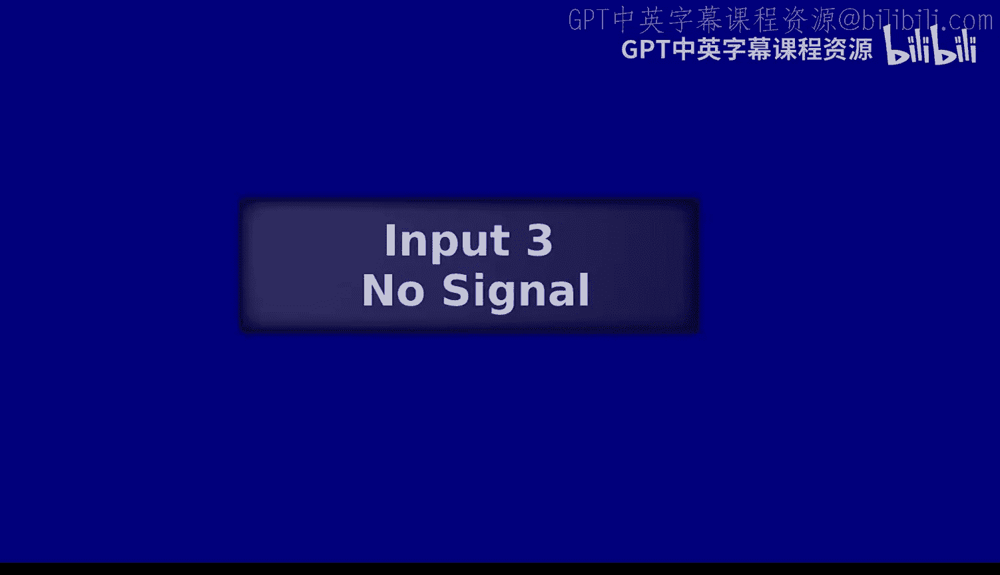

在本节课中，我们将要学习语法分析。我们将回顾尾调用优化，并正式介绍语法分析的核心概念——语法和语法树。

---

## 课程回顾 📚

上一节我们深入探讨了尾调用优化。本节开始前，我们先简要回顾一下截至目前课程所涵盖的核心内容。

我们已讨论的主题包括：
*   **解释器与编译器**：它们的类型、行为差异以及编译器的主要组件。
*   **语法与语义**：程序书写形式（语法）与其实际含义（语义）的区别。
*   **汇编与内存管理**：如何生成和阅读汇编代码，以及栈和堆的使用。
*   **控制流与作用域**：跳转、函数调用、符号表、环境，以及词法作用域与动态作用域的设计选择。
*   **编程语言设计**：可变性与不可变性、副作用、正确性推理、未定义行为。
*   **编译时与运行时**：静态与动态的概念，特别是静态类型与动态类型检查。
*   **函数与求值策略**：函数调用、惰性求值与急切求值。
*   **尾调用优化**：重用栈帧以实现高效的递归和函数调用。
*   **语言特性语义**：在 Scheme（C16S/Lang）和 OCaml 中各种语言特性的含义。

这些概念相互关联，共同构成了我们理解和实现编程语言的基础。

---

## 尾调用优化详解 🔄

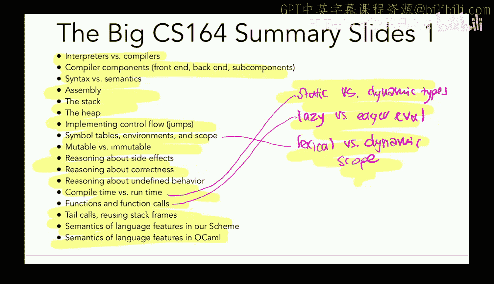


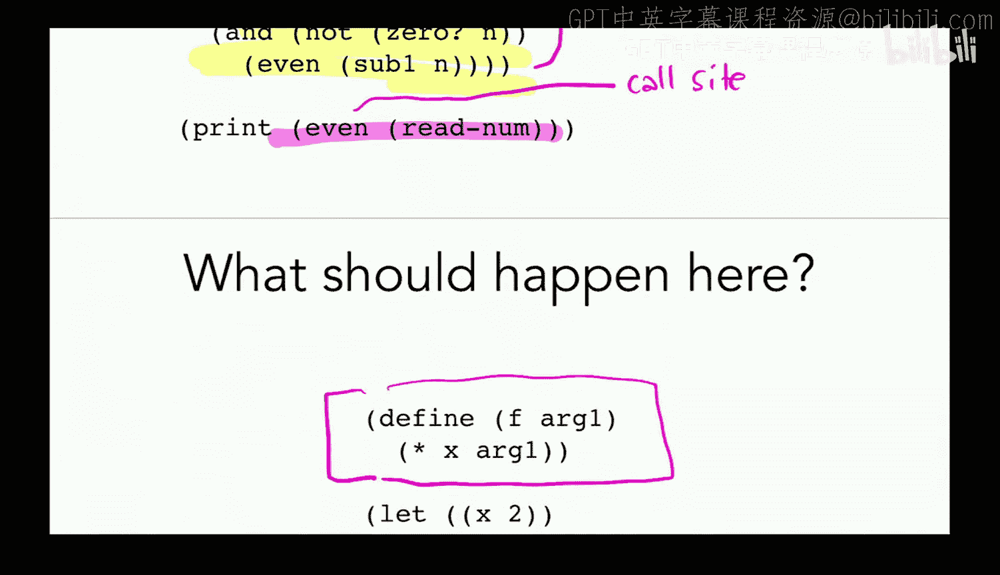

上一节我们介绍了尾调用优化的概念。本节中，我们通过一个具体示例来深入理解它是如何**重用栈帧**的。

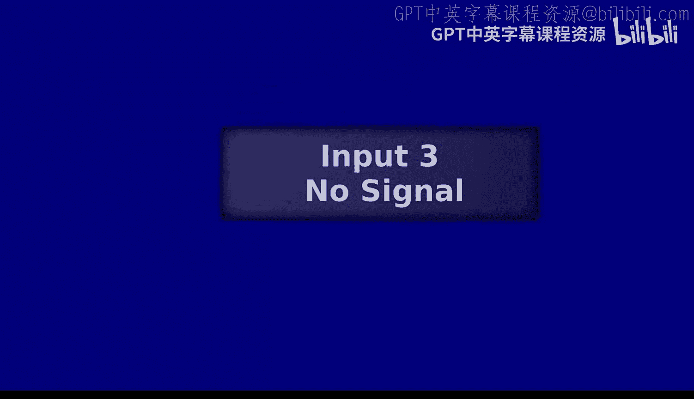

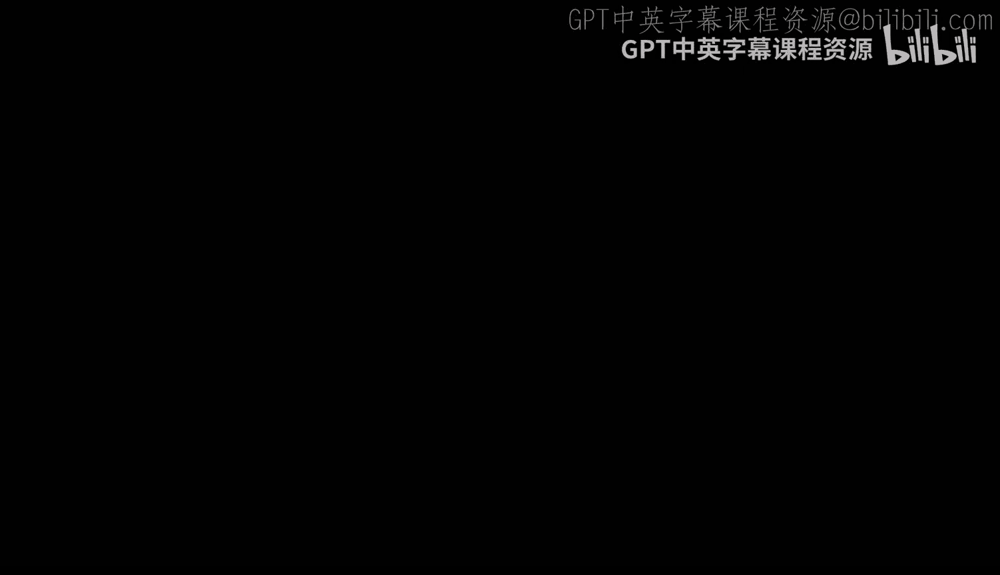

考虑以下程序：`(sub (add 16 12) y)`。我们将对比编译器在启用和不启用尾调用优化时生成的汇编代码，观察栈帧的使用差异。

### 未启用尾调用优化的情况

以下是使用标准 `call` 指令时的栈帧变化：

1.  函数 `sub` 调用函数 `add`。
2.  `call` 指令会：
    *   将返回地址压入栈中（`RSP` 下移）。
    *   跳转到 `add` 的函数体。
3.  这为 `add` 创建了一个**新的栈帧**，位于 `sub` 的栈帧之上。
4.  函数返回时，需要依次清理这些栈帧。

**关键点**：每次函数调用都会分配新的栈空间，可能导致栈溢出，尤其是在深度递归时。

### 启用尾调用优化的情况

以下是使用 `jump` 指令（尾调用优化）时的栈帧变化：

1.  在调用 `add` 之前，`sub` 已经将计算所需的参数（16 和 -12）准备好，并放置在当前栈帧中即将被重用的位置。
2.  使用 `jump` 指令直接跳转到 `add` 的代码，**而不是 `call`**。
3.  **`RSP` 寄存器没有移动**。`add` 函数将直接使用 `sub` 函数当前的栈帧空间。
4.  `sub` 栈帧中旧的数据被 `add` 的新参数覆盖。

**核心机制**：当函数调用处于“尾位置”（即该调用的返回值直接作为外层函数的返回值）时，可以安全地重用调用者的栈帧，因为调用者之后不再需要执行任何代码。

**公式表示尾位置条件**：
一个表达式 `E` 处于尾位置，当且仅当对其求值后，不需要再执行任何其他计算即可返回其值。

**代码示例对比**：
```assembly
; 非尾调用 (使用 call)
call add_label
ret

; 尾调用优化 (使用 jump)
; ... 准备参数 ...
jmp add_label ; 重用当前栈帧，不压入返回地址
```

**总结**：尾调用优化通过将尾位置的函数调用从 `call` 改为 `jump`，并重用当前栈帧，避免了栈空间的线性增长。这对于递归和函数式编程范式至关重要。

---

## 语法分析入门 🌳

之前我们一直假设能将程序代码转换为 S 表达式（嵌套列表）。现在，我们正式探讨这个过程，即**语法分析**。

语法分析器负责将**扁平的令牌序列**转换为能反映程序**层次结构**的树形表示（如抽象语法树 AST）。

例如，字符串 `"(+ 1 2)"` 经过词法分析变成令牌列表：`['(', '+', '1', '2', ')']`。语法分析器则将其转换为嵌套结构：`['+', 1, 2]`，这体现了 `+` 是操作符，`1` 和 `2` 是其参数。

### 语法：语言的蓝图

要为一种语言编写语法分析器，我们首先需要定义该语言的**语法**。语法是一套规则，精确描述了哪些字符串是合法的程序。

我们以 S 表达式的简化语法为例：

```
Sx ::= Num | Sym | Lparen List Rparen
List ::= Sx List | ε
```

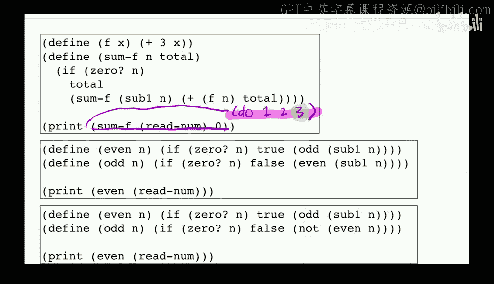


**术语解释**：
*   **非终结符**：用尖括号 `< >` 括起，表示语法中的中间类别，如 `<Sx>`, `<List>`。它们不会直接出现在最终的程序字符串中。
*   **终结符**：构成程序字符串的基本单元，如 `Num` (数字)、`Sym` (符号)、`Lparen` (左括号)、`Rparen` (右括号)、`ε` (空字符串)。
*   **产生式规则**：定义如何从一个非终结符推导出符号序列。例如 `<Sx> ::= Num` 是一条规则。符号 `::=` 表示“可推导为”，`|` 表示“或”。
*   **开始符号**：语法推导的起点，通常是第一个出现的非终结符（这里是 `<Sx>`）。


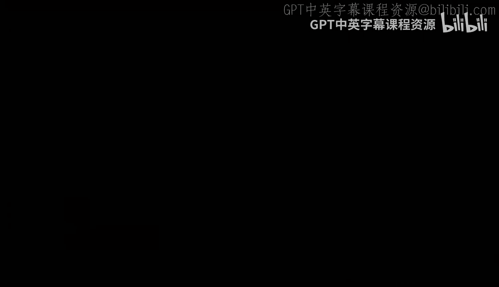

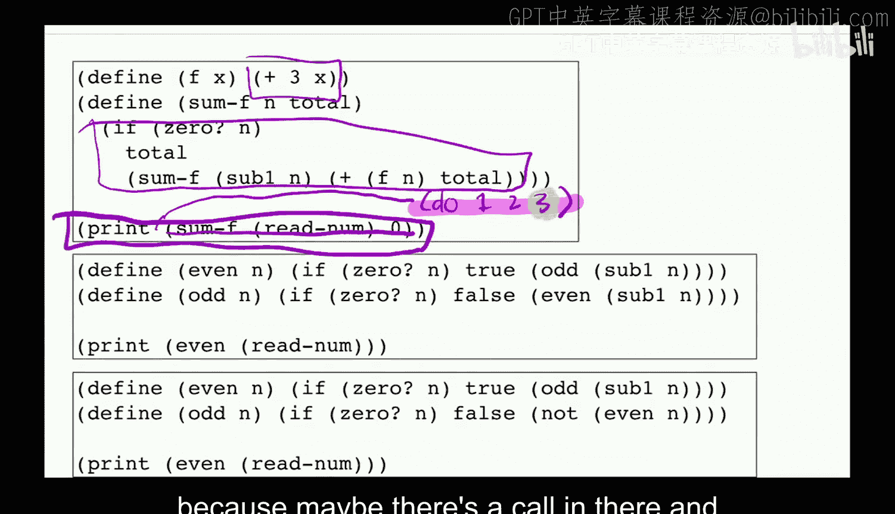


### 语法树：推导的可视化

根据语法规则，我们可以为合法程序构建一棵**语法树**。

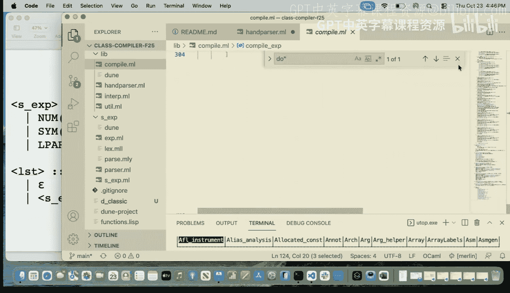

例如，为程序 `(+ 1 2)` 构建语法树：
1.  从开始符号 `<Sx>` 开始。
2.  应用规则 `<Sx> ::= Lparen List Rparen`。
3.  为 `<List>` 部分应用规则 `<List> ::= Sx List`。
    *   第一个 `<Sx>` 推导为 `Sym` (`+`)。
    *   第二个 `<List>` 再次应用 `<List> ::= Sx List`。
        *   `<Sx>` 推导为 `Num` (`1`)。
        *   `<List>` 应用规则 `<List> ::= Sx List`。
            *   `<Sx>` 推导为 `Num` (`2`)。
            *   `<List>` 应用规则 `<List> ::= ε` (空字符串，表示结束)。
4.  将所有终结符按顺序连接起来，就得到了原始字符串 `(+ 1 2)`。

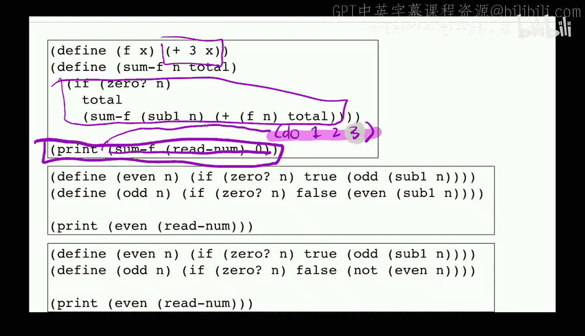

这棵树的叶子节点全是终结符，内部节点则是非终结符，清晰展示了字符串的语法结构。

### 语法分析的核心任务

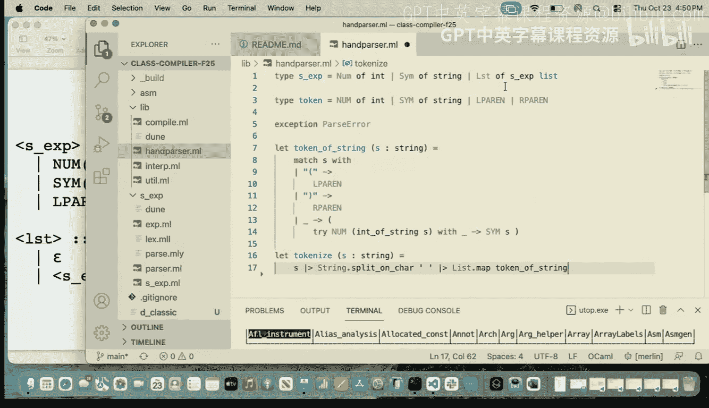


语法分析的核心问题是：**给定一个字符串，判断它是否属于该语言（即是否合法）？**

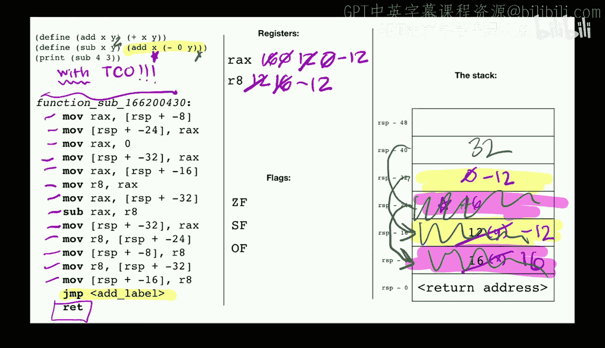

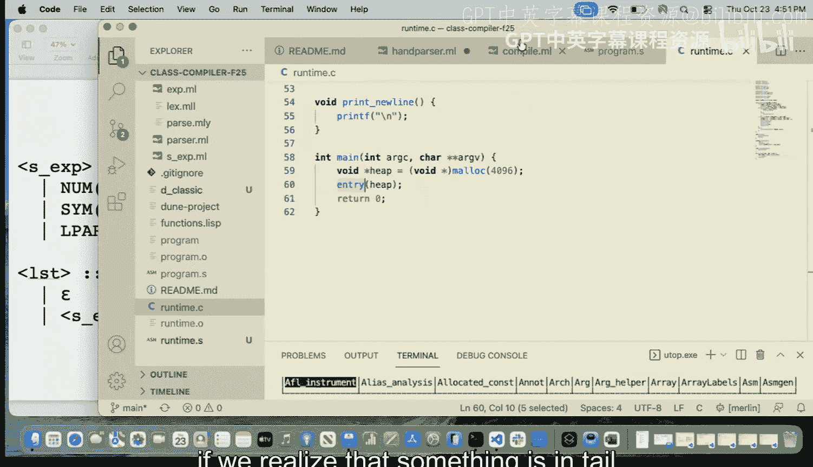

**判断方法**：尝试使用语法的产生式规则，为该字符串构建一棵语法树。如果能成功构建出一棵完整的语法树，且树的叶子节点按顺序正好组成该字符串，那么这个字符串就是合法的程序。


---

## 总结 🎯

本节课中我们一起学习了两个关键部分。

首先，我们**深入分析了尾调用优化**，通过对比汇编代码，理解了它如何通过 `jump` 指令和参数准备来**重用栈帧**，从而避免递归深度过大时的栈溢出问题。我们明确了“尾位置”的定义以及该优化的适用场景。

其次，我们正式开启了**语法分析**的主题。我们介绍了**语法**的基本概念，包括终结符、非终结符和产生式规则，并使用 S 表达式的简化语法作为示例。我们了解了如何通过语法规则为合法程序构建**语法树**，并认识到语法分析的本质就是为输入字符串寻找这样一棵合法的语法树。

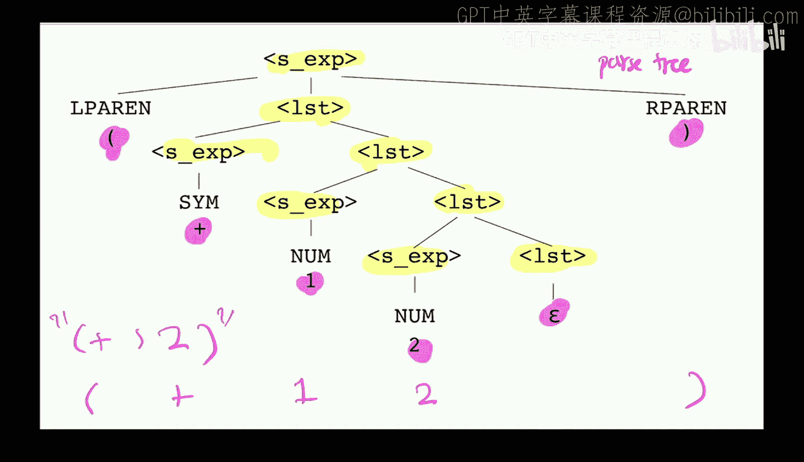

从下一讲开始，我们将更详细地探讨如何根据语法来实现一个语法分析器。