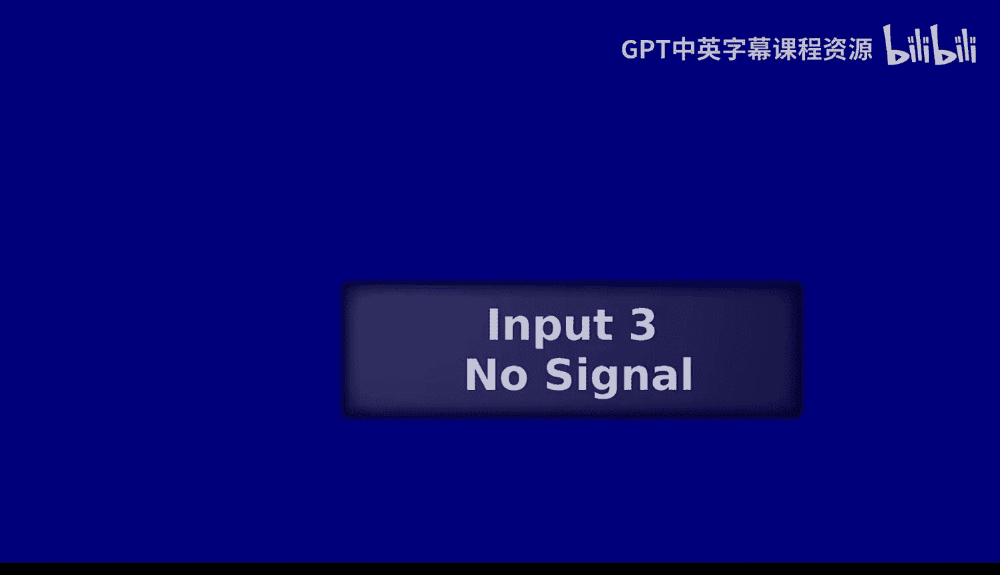
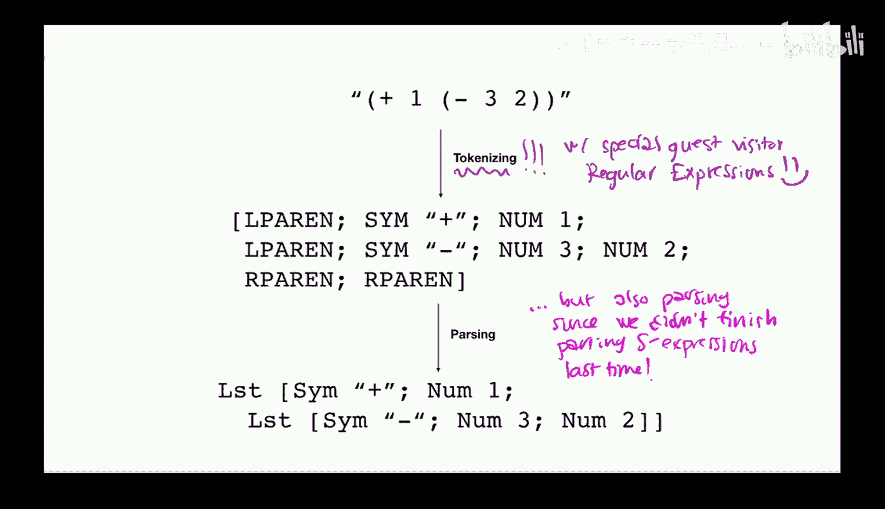
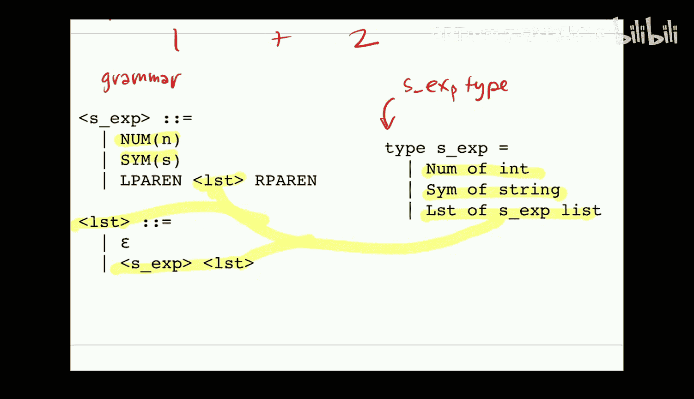
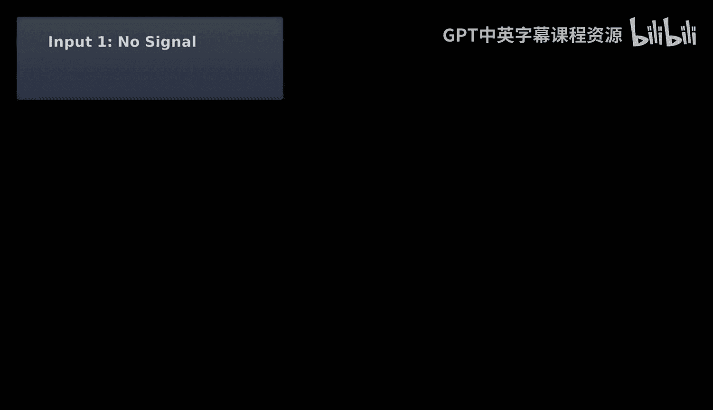
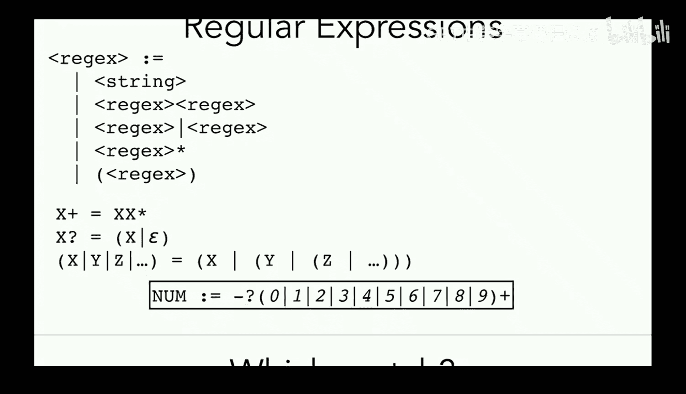

# 18：正则表达式






在本节课中，我们将学习正则表达式，并了解它们如何用于词法分析（tokenization）。我们将从回顾语法和解析树开始，然后深入探讨正则表达式的语法、核心概念，以及如何将它们转换为有限自动机以实现高效的字符串匹配。

## 回顾：语法与解析树

上一节我们介绍了语法和解析树的概念。语法用于定义编程语言中哪些字符串是合法的程序。我们使用非终结符和产生式规则来描述这些结构。

例如，一个简单的S表达式语法可能包含以下规则：
```
S -> num N | sym S | LPAREN list RPAREN
list -> ε | S list
```






解析树展示了如何从起始符号开始，应用一系列产生式规则，最终生成一个完全由终结符（即程序中的实际字符）组成的字符串。如果能为一个输入字符串构建出完整的解析树，那么该字符串就被语法所接受。

## 从语法到解析器

本节中，我们将看看如何根据语法来构建一个解析器。我们的目标是编写一个函数，将输入的词法单元（token）列表转换为S表达式的抽象语法树（AST）。

我们为语法中的每个非终结符编写一个辅助函数。每个函数负责处理与该非终结符相关的所有产生式规则。

以下是解析S表达式的辅助函数框架：
```ocaml
let rec parse_sx (toks : token list) : sx * token list =
  match toks with
  | Num n :: toks2 -> (Num n, toks2)
  | Sym s :: toks2 -> (Sym s, toks2)
  | LParen :: toks2 ->
      let (xs, toks3) = parse_list toks2 in
      (List xs, toks3)
  | _ -> raise ParseError

and parse_list (toks : token list) : sx list * token list =
  match toks with
  | RParen :: toks2 -> ([], toks2)
  | _ ->
      let (x2, toks2) = parse_sx toks in
      let (x3, toks3) = parse_list toks2 in
      (x2 :: x3, toks3)
```

这个解析器递归地处理输入，根据遇到的词法单元类型选择相应的产生式规则。如果遇到无法匹配任何规则的情况，则抛出解析错误。

## 词法分析与正则表达式

现在，我们来看看词法分析，即如何将原始字符串转换为词法单元列表。一个简单但低效的方法是按照空格分割字符串。然而，更健壮的方法是使用正则表达式来精确匹配每种词法单元的模式。

正则表达式提供了一种简洁的方式来表达字符串模式。它们可以高效地检查一个字符串是否匹配某种模式，这对于快速识别词法单元至关重要。

## 正则表达式的语法

正则表达式本身也有其语法。以下是其核心组成部分：

*   **字符字面量**：例如 `a`，只匹配字符串 `"a"`。
*   **连接**：例如 `ab`，匹配字符串 `"ab"`。
*   **选择（或）**：例如 `a|b`，匹配字符串 `"a"` 或 `"b"`。
*   **克林星号（Kleene star）**：例如 `a*`，匹配零个或多个 `"a"`，如 `""`、`"a"`、`"aa"` 等。
*   **分组**：使用括号 `()` 来改变优先级，例如 `(ab)*` 匹配 `""`、`"ab"`、`"abab"` 等。

基于这些核心操作，可以定义一些有用的简写：

*   **加号（+）**：`a+` 表示 `aa*`，匹配一个或多个 `"a"`。
*   **问号（?）**：`a?` 表示 `(a|ε)`，匹配零个或一个 `"a"`。
*   **字符类**：`[abc]` 表示 `a|b|c`，匹配 `"a"`、`"b"` 或 `"c"`。

例如，匹配整数的正则表达式可以是：`-?[0-9]+`。这表示一个可选的负号，后跟一个或多个数字。

## 正则表达式与有限自动机

为了高效地使用正则表达式进行匹配（例如在词法分析器中），我们将其转换为**有限自动机**。有限自动机是一种抽象机器，包含一组有限的状态、一个起始状态、一个或多个接受状态，以及基于输入字符在状态间转移的规则。

有限自动机分为两种：
*   **确定性有限自动机**：对于每个状态和输入字符，恰好有一个转移。
*   **非确定性有限自动机**：对于每个状态和输入字符，可能有零个、一个或多个转移，并且允许空字符（ε）转移。

正则表达式、NFA和DFA在表达能力上是等价的，都可以描述**正则语言**。

## 从正则表达式构建NFA

我们可以机械地将任何正则表达式转换为一个NFA。以下是核心构造规则：

1.  **字符 `a`**：创建两个状态，用标记为 `a` 的边连接。
2.  **连接 `AB`**：将 `A` 的接受状态通过 ε 边连接到 `B` 的起始状态。
3.  **选择 `A|B`**：创建一个新的起始状态，通过 ε 边分别连接到 `A` 和 `B` 的起始状态；将 `A` 和 `B` 的接受状态通过 ε 边连接到一个新的共同接受状态。
4.  **克林星号 `A*`**：创建一个新的起始状态（也是接受状态），通过 ε 边连接到 `A` 的起始状态；将 `A` 的接受状态通过 ε 边连接回它自己的起始状态，并连接到最终的接受状态。

通过递归应用这些规则，可以为任何正则表达式构建出对应的NFA。虽然生成的NFA可能包含许多ε转移，看起来不够简洁，但这个过程是完全机械化的，易于自动化。

## 为何使用有限自动机

在词法分析中使用有限自动机（特别是DFA）的主要优势在于效率。DFA可以在**线性时间**内扫描输入字符串，每个字符只处理一次，无需回溯。这对于处理大量词法单元或长文件至关重要。

实际实现中，词法分析器通常：
1.  为每种词法单元类型定义正则表达式。
2.  将所有正则表达式合并为一个大的NFA（例如通过“或”操作）。
3.  将NFA转换为DFA。
4.  使用该DFA对输入进行线性扫描，识别出最长的匹配词法单元。

## 总结



本节课中我们一起学习了正则表达式及其在编译器词法分析阶段的应用。我们回顾了语法和解析树，并了解了如何根据语法编写递归下降解析器。接着，我们深入探讨了正则表达式的语法和核心操作，并理解了它们与有限自动机（NFA/DFA）的等价性。最后，我们看到了如何机械地将正则表达式转换为NFA，并理解了使用DFA进行词法分析可以实现高效、线性的字符串匹配，这是构建实用编译器的关键一步。