# 23：优化 🚀

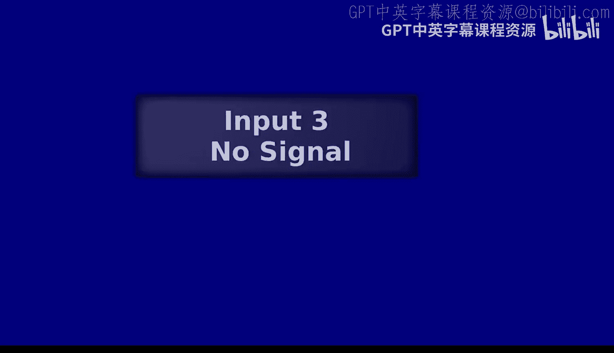

在本节课中，我们将要学习编译器中的一个重要环节：优化。我们将探讨什么是优化，为什么需要优化，以及如何在不改变程序含义的前提下，让程序运行得更快、更高效。我们将重点介绍三种常见的优化技术：常量折叠、函数内联和公共子表达式消除。

---

## 什么是优化？ 🤔

优化是指对程序进行转换，使其在某些方面变得“更好”。这里的“更好”通常指运行速度更快、内存占用更少或程序体积更小。然而，优化并不保证程序达到某种理论上的“最优”状态，它只是朝着“更好”的方向改进。

### 优化的目标

以下是优化可能追求的目标：
*   **运行速度更快**：减少程序的执行时间。
*   **内存占用更低**：减少程序运行时的内存消耗。
*   **程序体积更小**：减少编译后二进制文件的大小。
*   **避免冗余计算**：消除程序中重复执行的计算。

需要注意的是，优化通常**不**以提高代码可读性或修复程序错误为目标。优化必须**保持程序的含义不变**。

---

## 优化在编译器中的位置 🗺️

在编译流程中，优化可以发生在多个阶段。最常见的优化发生在**抽象语法树**层面，即对AST进行一系列转换，生成一个语义等价但更高效的AST。

另一种优化发生在**指令层面**，称为窥孔优化。它通过检查一小段指令序列，并用更高效的指令序列替换它来工作。

本节课我们将主要关注AST层面的优化。

---

## 常量折叠 🔢

上一节我们介绍了优化的基本概念和位置。本节中我们来看看第一种优化技术：常量折叠。

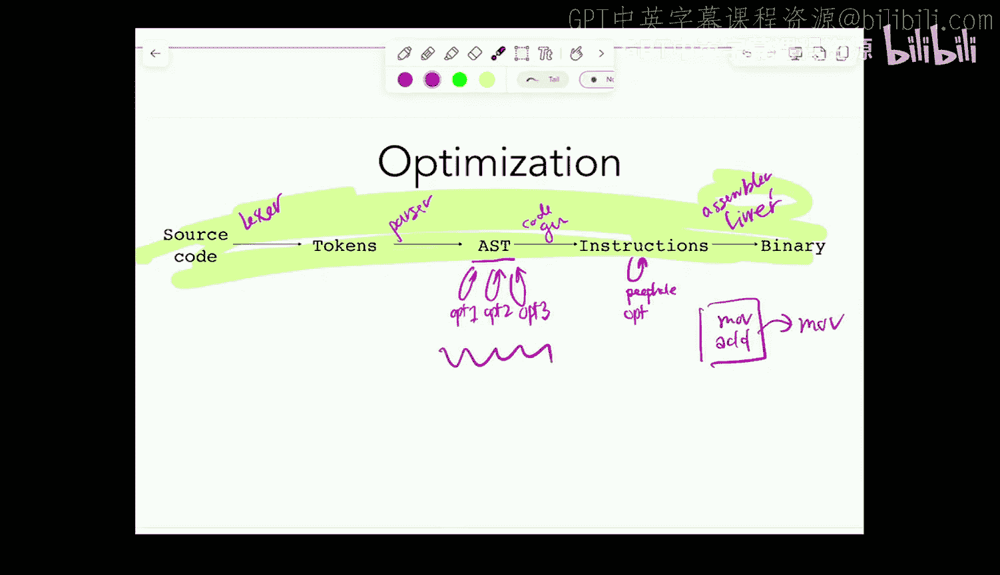

常量折叠是指在编译时计算表达式中所有操作数都是常量的运算，并用计算结果替换原表达式。这可以避免在程序运行时进行这些计算。

### 核心思想

当遇到像 `1 + 5` 这样的表达式时，编译器可以在编译时直接计算出结果 `6`，并将 `6` 这个常量嵌入到生成的代码中，而不是生成执行加法操作的指令。

### 实现示例

以下是一个简化的常量折叠函数实现，它递归地遍历AST：

```ocaml
let rec fold (e : expr) : expr =
  match e with
  | Prim1 (Add1, e1) ->
      let e1' = fold e1 in
      (match e1' with
      | Num n -> Num (n + 1)  (* 折叠 *)
      | _ -> Prim1 (Add1, e1')) (* 无法折叠，但子表达式可能已被优化 *)
  | Prim1 (Sub1, e1) ->
      let e1' = fold e1 in
      (match e1' with
      | Num n -> Num (n - 1)
      | _ -> Prim1 (Sub1, e1'))
  (* 处理其他表达式类型... *)
  | _ -> e (* 默认情况，返回原表达式 *)
```

### 何时应用常量折叠？

以下是关于常量折叠的两个关键问题：

1.  **何时可以安全地应用？**
    当表达式中所有操作数的值都能在**编译时静态确定**时。如果表达式依赖于用户输入、文件读取或随机数等运行时信息，则不能应用。

2.  **何时应该应用？**
    几乎总是应该应用。常量折叠成本低廉（只需遍历一次AST），并且总能通过消除运行时计算来提升性能。因此，编译器会频繁地进行常量折叠。

---

## 函数内联 📞

上一节我们学习了常量折叠，它是一种简单而强大的优化。本节中我们来看看另一种优化：函数内联。

函数内联是指将函数调用处替换为该函数的函数体。这样可以消除函数调用的开销（如参数传递、栈帧管理等），但可能会增加代码体积。

### 核心思想

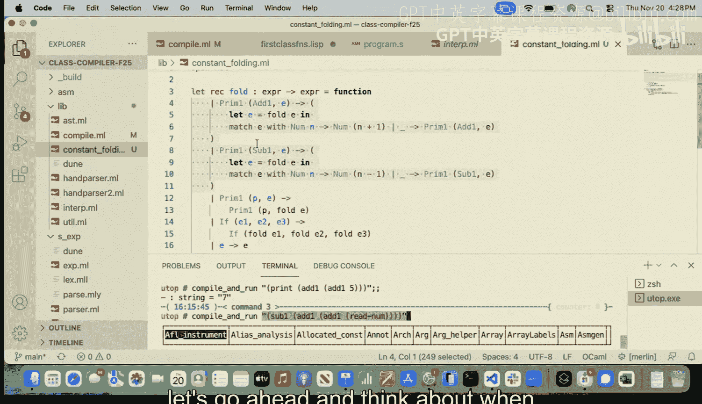

例如，对于一个小函数 `let f(x) = x + 2` 和调用 `f(5)`，内联优化会将其直接替换为 `5 + 2`，进而可能被常量折叠为 `7`。

### 何时（安全地）应用函数内联？

以下是安全应用函数内联的条件：
*   **函数非递归**：内联递归函数可能导致无限循环。
*   **函数是“常量”的**：给定相同输入，总是产生相同输出，且不依赖运行时信息（如用户输入）。
*   **调用的函数是静态已知的**：编译器必须能在编译时确定具体调用哪个函数。如果函数指针在运行时才能确定，则无法内联。
*   **函数没有自由变量**：如果函数体引用了其定义作用域外的变量（形成闭包），内联后这些变量在新上下文中可能不可用。

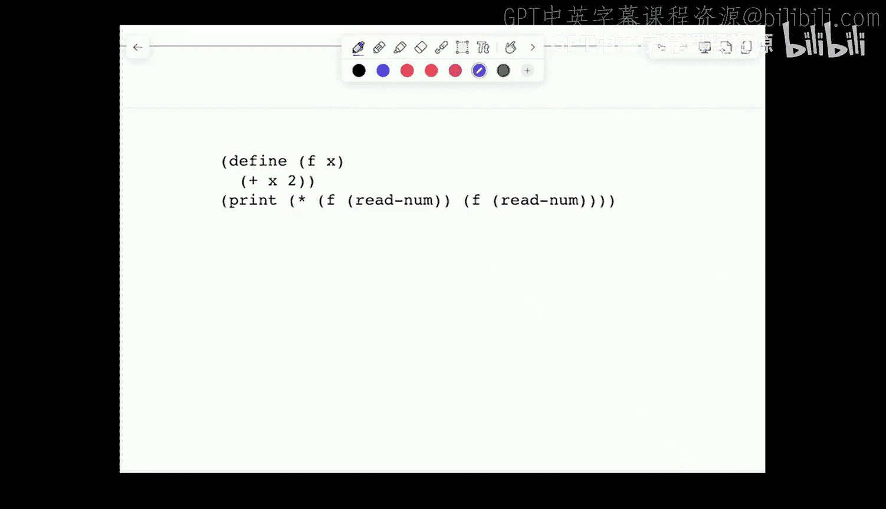

### 何时（有效地）应用函数内联？

即使可以安全内联，也需考虑是否值得：
*   **函数体较短**：内联短函数对代码体积影响小。
*   **调用点较少**：函数只在少数几个地方被调用，内联不会导致代码过度膨胀。
应用内联需要在**性能提升**（减少调用开销）和**代码膨胀**之间做出权衡，这取决于具体场景（如嵌入式设备注重空间，高性能计算注重速度）。

---

## 公共子表达式消除 🔄

函数内联帮助我们减少了函数调用开销。本节中我们来看最后一种优化：公共子表达式消除。

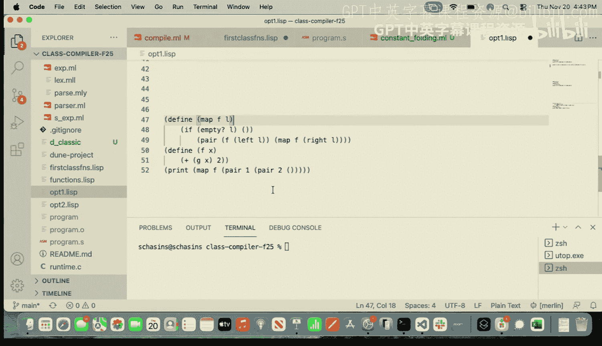

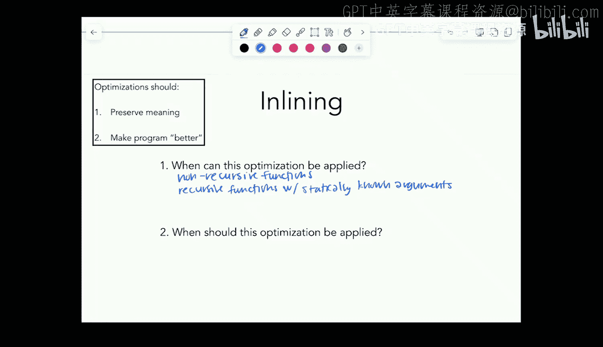

公共子表达式消除是指识别并提取程序中重复计算的相同表达式，将其结果存储在一个临时变量中，后续使用该变量代替重新计算。


### 核心思想

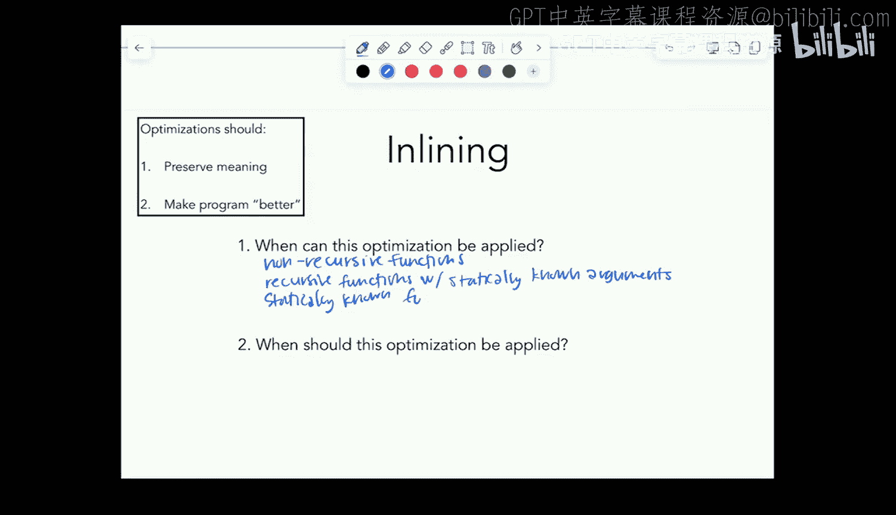

考虑以下代码片段：
```
let x = read_num()
print((x + 2) * 3)
print((x + 2) * 5)
print((x + 2) * 7)
```
表达式 `x + 2` 被计算了三次。公共子表达式消除可以将其优化为：
```
let x = read_num()
let y = x + 2  // 计算一次
print(y * 3)
print(y * 5)
print(y * 7)
```


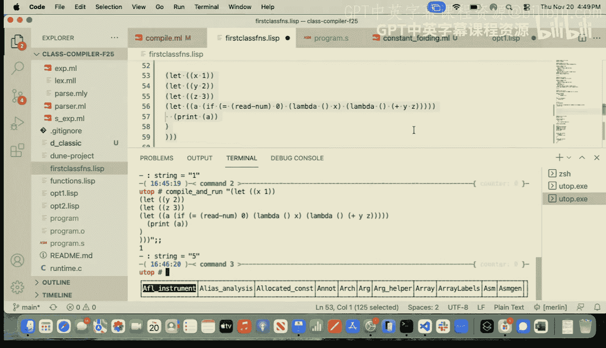

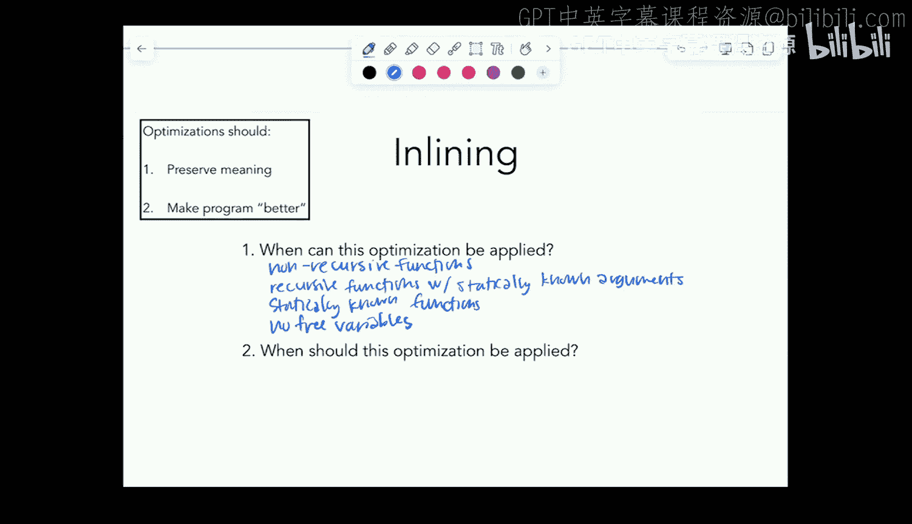

### 何时应用？

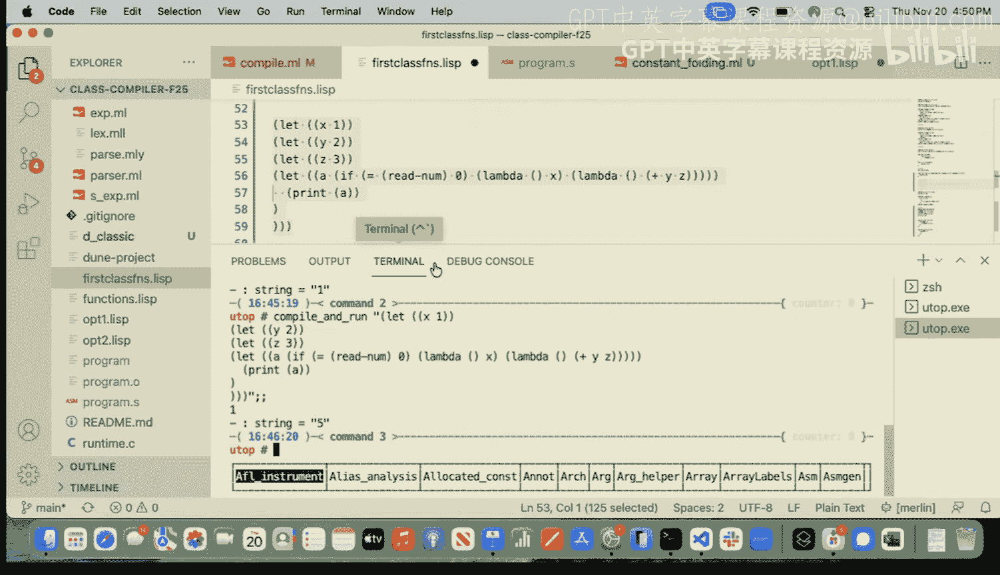

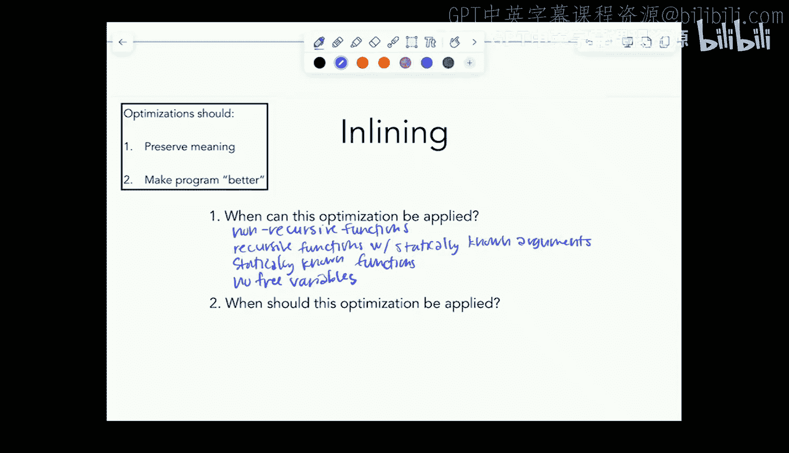

1.  **何时可以安全地应用？**
    当重复的表达式是**纯的**，即多次计算总是产生相同的结果，并且没有副作用。如果表达式包含像 `read_num()` 这样的操作，则不能消除。

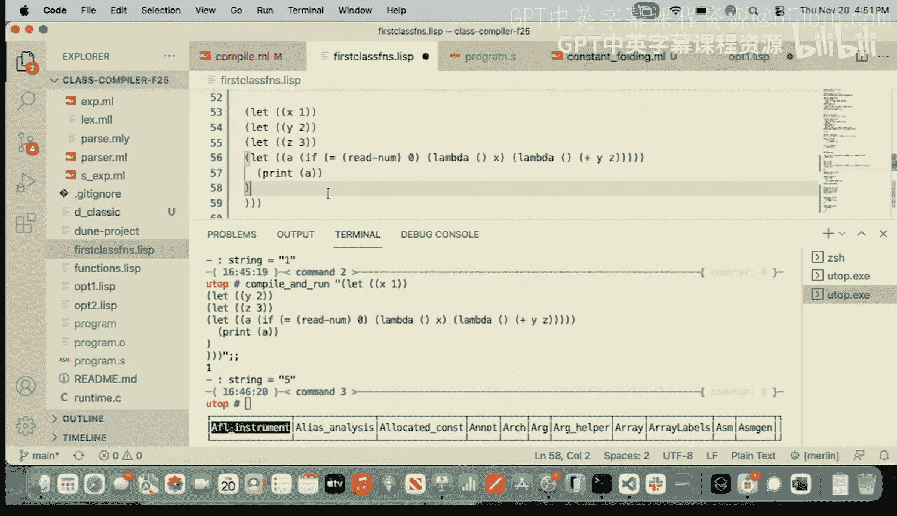


2.  **何时应该应用？**
    当表达式计算成本较高，且在程序中多次出现时。编译器需要判断提取公共表达式、引入新变量所带来的收益是否大于开销。

---

## 总结 📚

本节课中我们一起学习了编译器优化的基础知识。
*   我们首先明确了优化的目标是使程序在速度、内存或体积上“更好”，同时必须保持程序含义不变。
*   接着，我们探讨了优化在编译流程中的位置，主要关注AST层面的转换。
*   然后，我们深入学习了三种具体的优化技术：
    *   **常量折叠**：在编译时计算常量表达式。
    *   **函数内联**：用函数体替换函数调用，以减少调用开销。
    *   **公共子表达式消除**：提取并重用重复计算的表达式结果。
*   对于每种优化，我们都分析了其核心思想、安全应用的条件以及有效应用的场景。

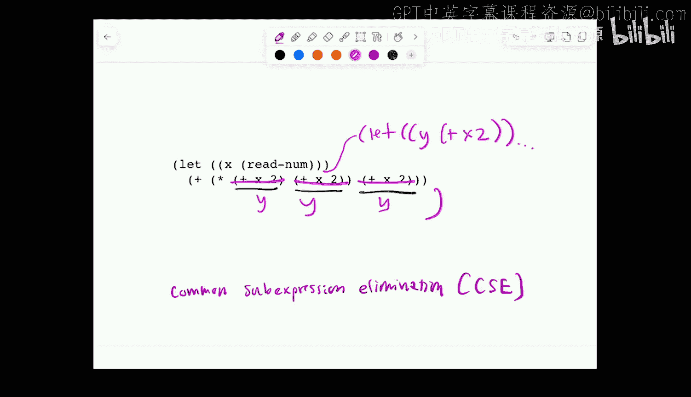

优化是一个广阔而活跃的领域，存在许多挑战，例如**阶段顺序问题**（以何种顺序应用不同的优化规则效果最好）。现代编译器通常基于大量基准测试来指导优化决策。希望本节课能为你打开编译器优化世界的大门。