# 互联网导论：架构与协议｜CS 168：P10：-9- 域间路由

## 概述

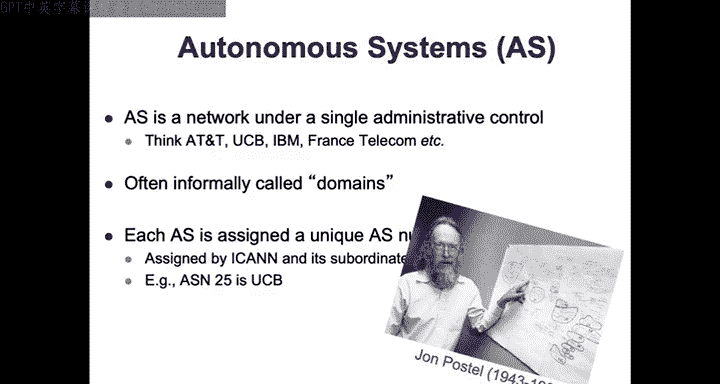

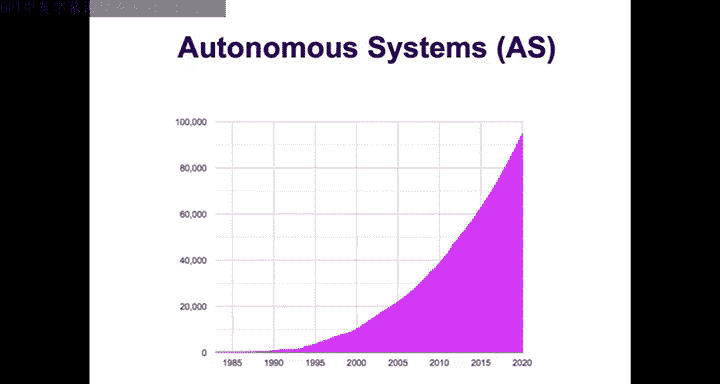

在本节课中，我们将要学习**域间路由**。到目前为止，我们讨论的路由都发生在一个单一的**自治系统**内部。现在，我们将视角提升，探讨不同自治系统之间如何相互通信和路由数据。我们将了解什么是自治系统、域间拓扑结构如何受商业关系影响、以及设计域间路由协议（特别是**边界网关协议**）时需要考虑的关键目标，如**可扩展性**和**策略**。

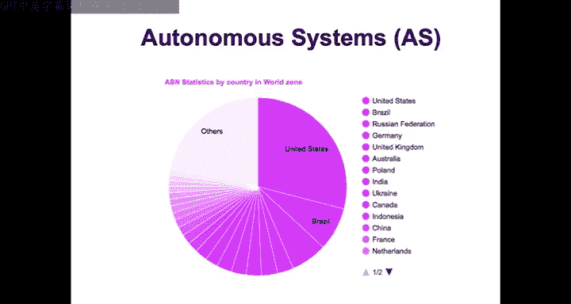

---

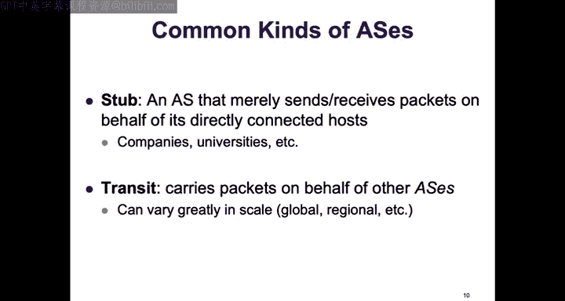

## 什么是自治系统？

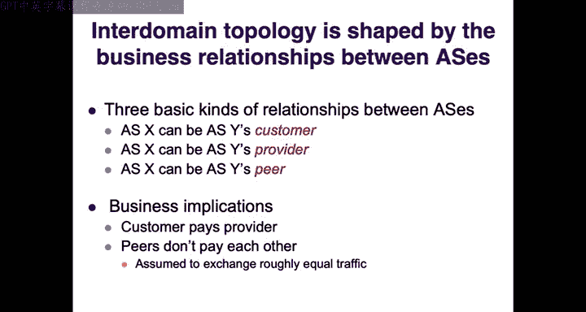

上一节我们介绍了域内路由，本节中我们来看看域间路由的基本单元——**自治系统**。

一个**自治系统**是一个处于单一管理实体控制之下的网络。例如，加州大学伯克利分校的网络是一个AS，AT&T的网络是另一个AS。自治系统被分配一个唯一的**自治系统号**，例如伯克利的AS号是25。

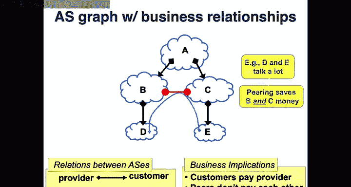

从路由的角度看，我们将每个自治系统视为一个逻辑节点，用云朵图形表示。我们不再关心AS内部路由器和链路的细节，而是关注由这些AS节点相互连接构成的**AS图**，即域间拓扑。

---

## 自治系统的类型

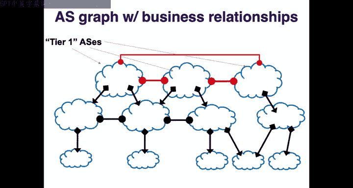

自治系统主要分为两种类型，理解这种区别对理解路由策略至关重要。

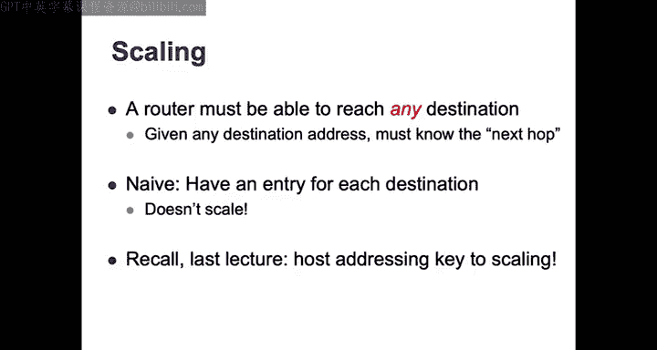

*   **桩自治系统**：这类AS的唯一目的是为其直接连接的用户或主机提供连接性。它不承载其他AS之间的流量。典型例子是企业、大学等非网络服务提供商。
    *   **公式表示**：`Stub AS` 的功能是 `F(host_traffic)`
*   **中转自治系统**：这类AS会代表其他AS承载流量。它们是互联网连接服务的提供者，如AT&T、Verizon等。其中，覆盖全球的顶级AS被称为**第一层AS**。

---

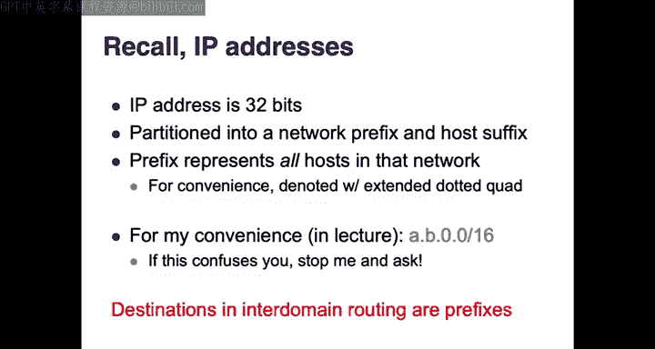

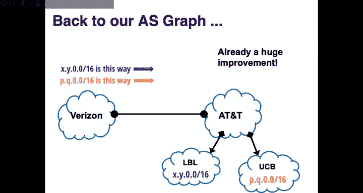

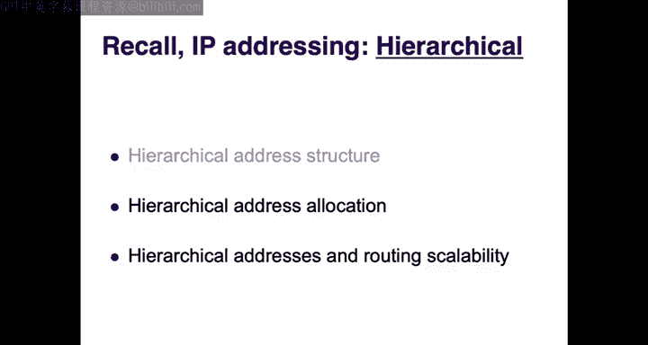

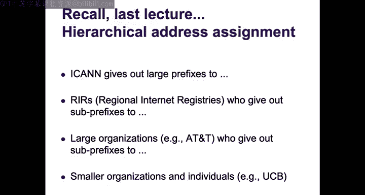

## 商业关系塑造拓扑

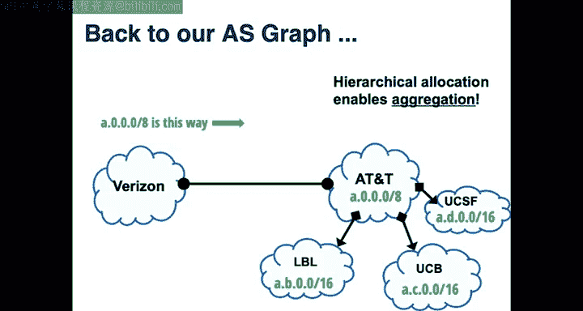

域间拓扑的独特之处在于，它由AS之间的**商业关系**所塑造。两个AS之间不仅是物理连接，还存在法律合同定义的服务关系。

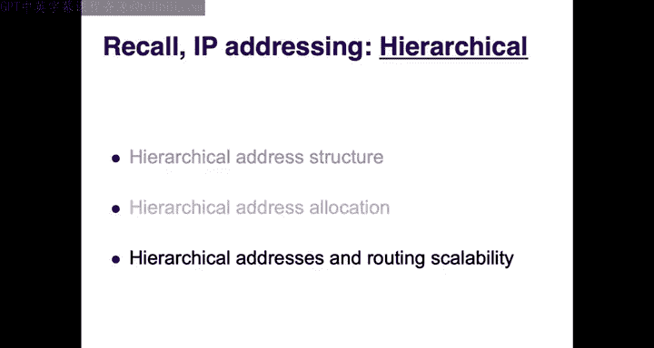

以下是三种基本的商业关系：

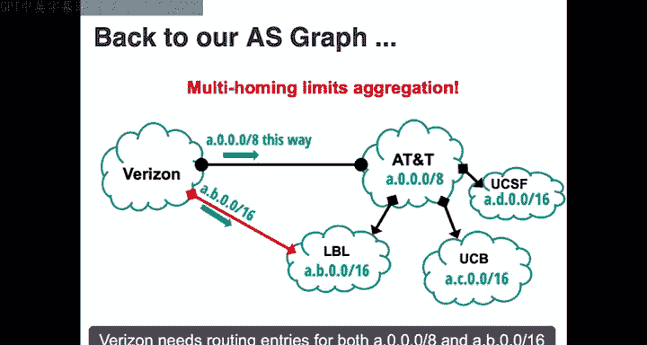

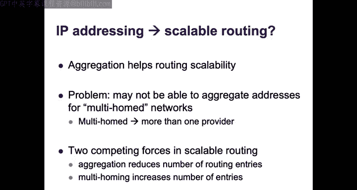

1.  **客户-提供商关系**：客户向提供商支付费用以获得互联网连接。例如，伯克利是AT&T的客户。
2.  **对等关系**：两个规模相当、流量对等的AS同意免费交换流量，以节省双方通过提供商中转的成本。
    *   **核心概念**：`Peering` 的目标是 `minimize(transit_cost)`

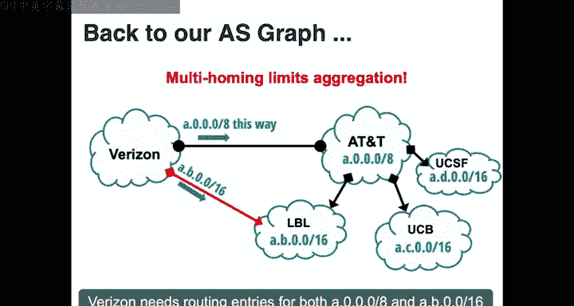

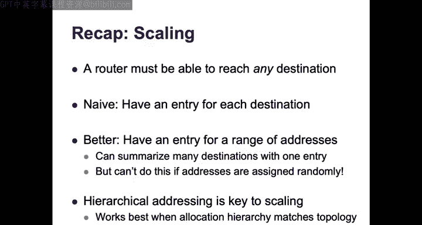

这些关系决定了“钱流向哪里”，进而决定了哪些路径在商业上是可行的。

---

## 域间路由的目标

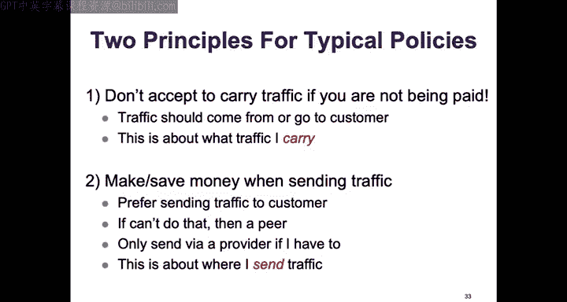

设计域间路由方案时，我们需要明确目标。除了域内路由也追求的**有效性**（无环路、无黑洞）外，域间路由还有两个核心目标：

1.  **可扩展性**：需要在互联网规模（数万个AS，数十亿主机）上工作。
2.  **策略**：必须允许每个AS的管理员基于其商业目标（赚钱或省钱）来实施路由策略，同时尊重其**自治性**和**隐私性**。

---

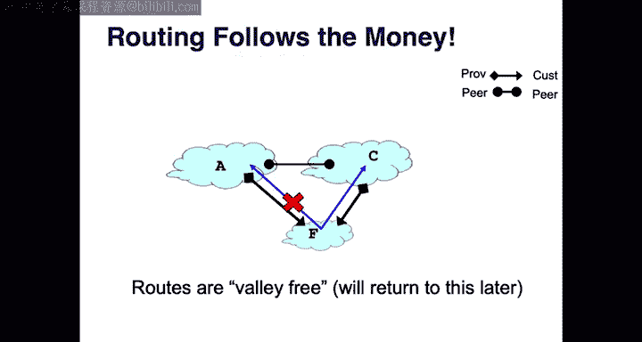

## 可扩展性的关键：层次化编址

要实现可扩展性，关键在于**层次化的IP地址分配**。

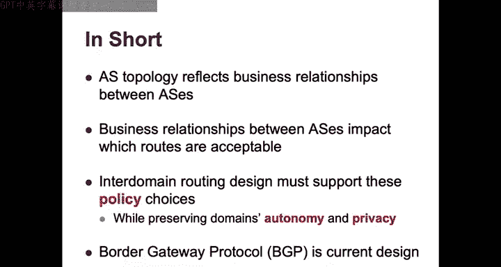

在域间路由中，目的地不再是单个主机IP地址，而是代表一个网络内所有主机的**IP前缀**（例如 `128.32.0.0/16`）。这实现了第一次聚合。

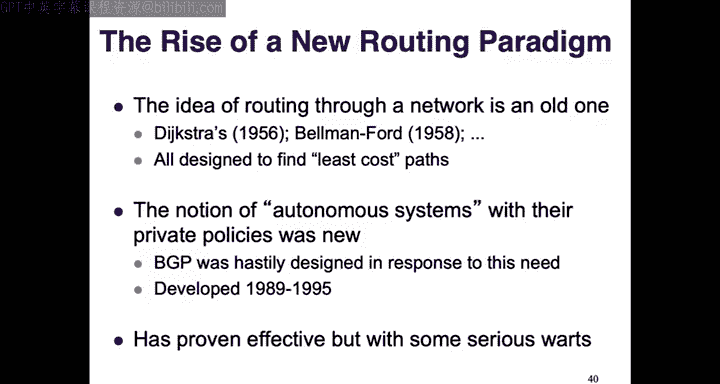

更重要的是，地址的分配也是层次化的。例如，一个顶级ISP获得一个大地址块（如 `A.0.0.0/8`），然后将其细分并分配给自己的客户。这样，其他ISP只需存储指向这个大ISP的聚合路由条目即可，实现了第二次聚合。

*   **代码表示**：路由表条目从 `{具体主机IP -> 下一跳}` 变为 `{IP前缀 (如 128.32.0.0/16) -> 下一跳AS}`

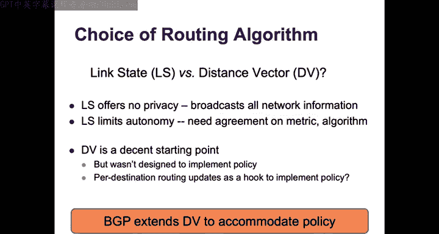

然而，**多宿主**（一个网络连接多个提供商）会打破编址层次与拓扑结构的对应关系，从而增加路由表规模，这是可扩展性面临的一个挑战。

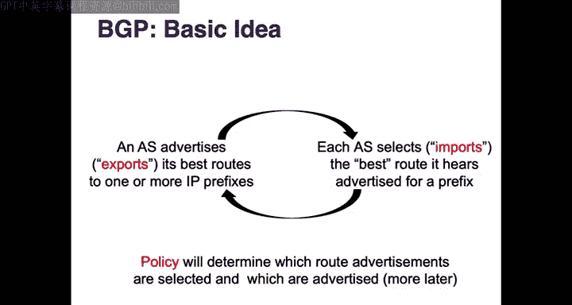

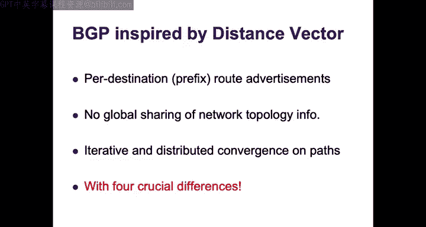

---

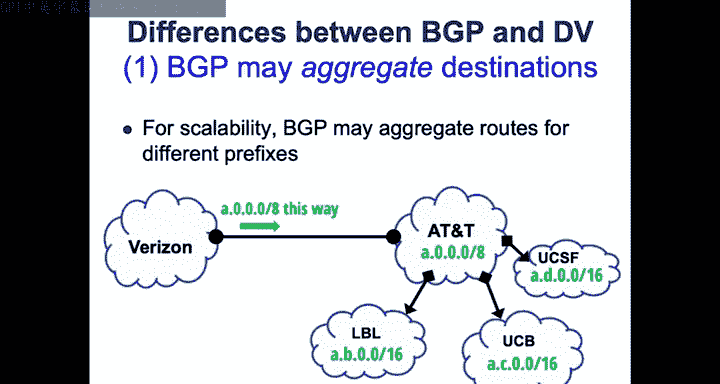

## 策略的实施：导入与导出

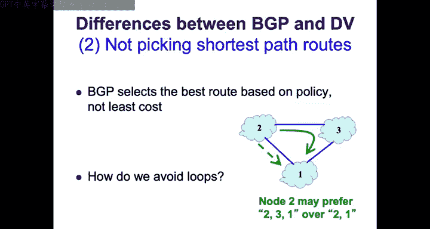

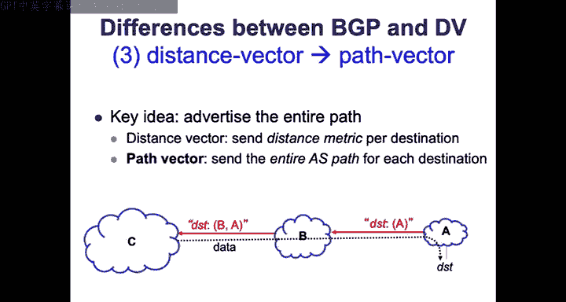

策略是域间路由的核心。它通过控制路由信息的**导入**和**导出**来实现。

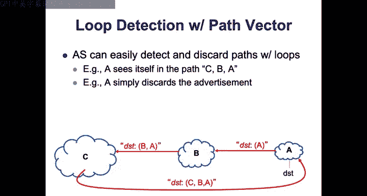

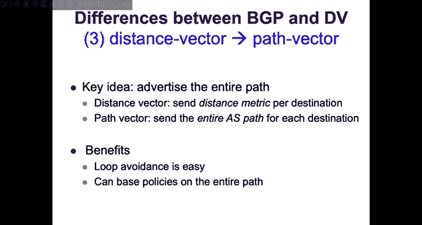

*   **导入策略**：决定从邻居AS收到的多条通往同一目的地的路由中，选择哪一条作为最佳路由。这决定了**本AS的出口流量**将发往何处。
*   **导出策略**：决定将本AS已知的某条路由通告给哪些邻居AS。这决定了**哪些入口流量**可以进入本AS。

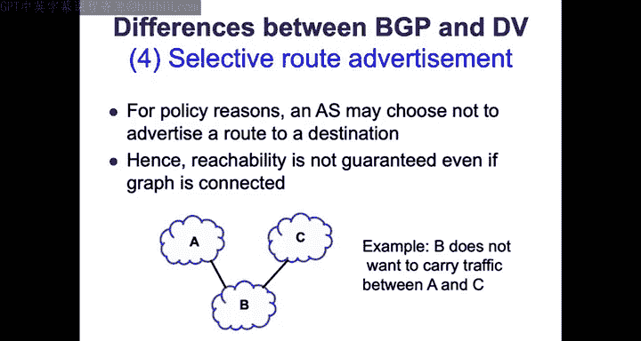

简单来说：**导入策略控制流量如何离开，导出策略控制流量如何进入**。

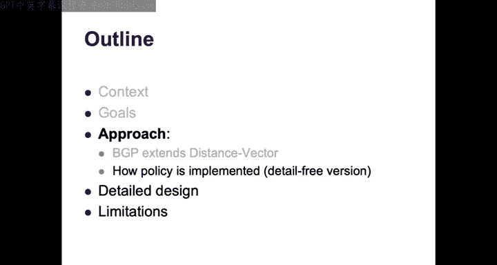

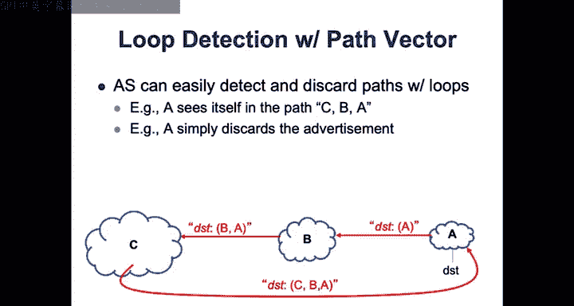

---

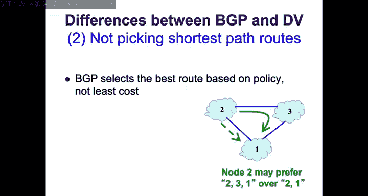

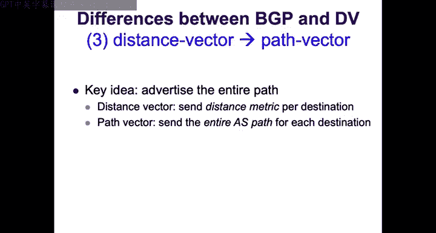

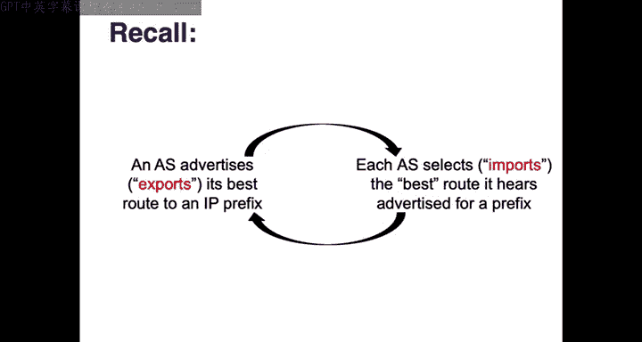

## Gao-Rexford 模型：常见的策略规则

研究人员Gao和Rexford总结了一套被广泛遵循的常见策略规则，为分析互联网路由提供了基线。

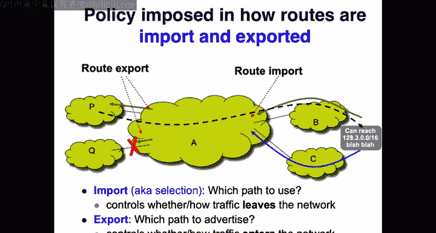

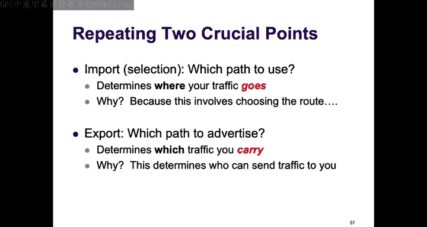

**导入规则（选择路由时的偏好顺序）**：
1.  优先选择从**客户**处学来的路由。
2.  其次选择从**对等体**处学来的路由。
3.  最后选择从**提供商**处学来的路由。
这个顺序体现了“发送流量时，优先赚钱（发给客户），其次省钱（发给对等体），最后才考虑付费（发给提供商）”的商业逻辑。

**导出规则（向谁通告路由）**：
*   对于从**客户**学来的路由：通告给**所有邻居**（客户、对等体、提供商）。因为承载去往该客户的流量能赚钱。
*   对于从**对等体**或**提供商**学来的路由：**只通告给自己的客户**。因为承载这类中转流量无法从对等体或提供商处获得报酬，只有客户会为此付费。

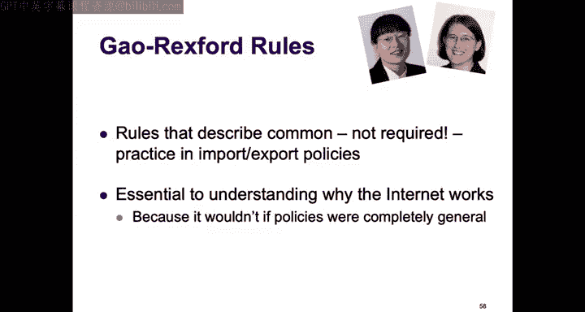

遵循这些规则形成的路径被称为**谷自由路径**，即路径在AS图中不会出现先“下坡”（到客户）再“上坡”（到提供商）的“山谷”形状。

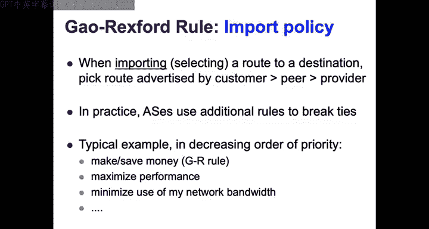

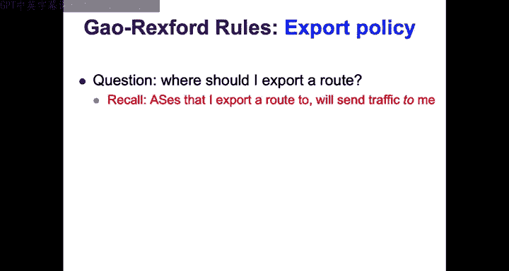

---

## 边界网关协议简介

**边界网关协议**是互联网上实际使用的域间路由协议。它基于**距离矢量**协议的思想，但为了支持策略，进行了关键扩展，成为**路径矢量**协议。

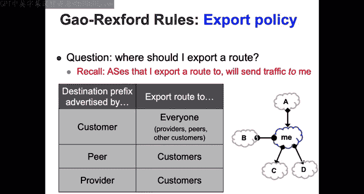

BGP与距离矢量的主要区别：
1.  **路径矢量**：BGP在通告路由时，不仅通告距离，还通告完整的**AS路径列表**。这易于检测和避免环路。
2.  **基于策略的选择**：最佳路由的选择基于复杂的本地策略（如Gao-Rexford规则），而非简单的全局度量。
3.  **选择性通告**：AS可以根据策略决定不通告某些路由。
4.  **路由聚合**：为了可扩展性，AS可以将多个具体前缀聚合成一个更短的前缀进行通告。

如果所有AS都遵循Gao-Rexford规则，并且AS图满足一定条件（如客户-提供商关系无环），那么BGP系统可以保证**可达性**和**收敛性**。

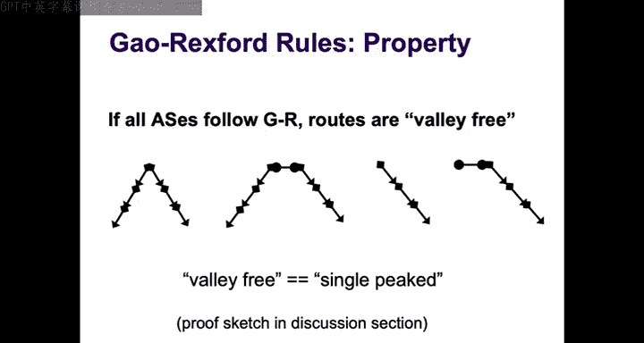

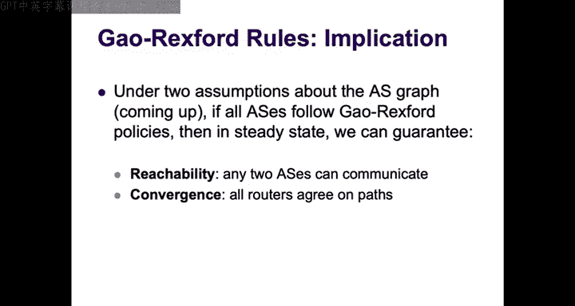

---

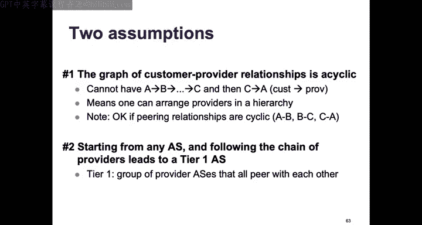

## 总结

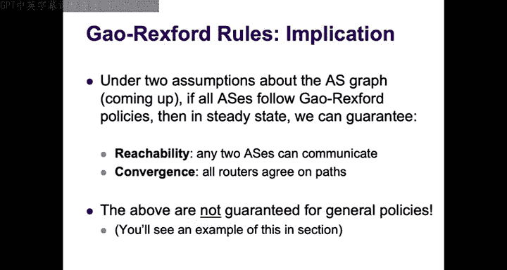

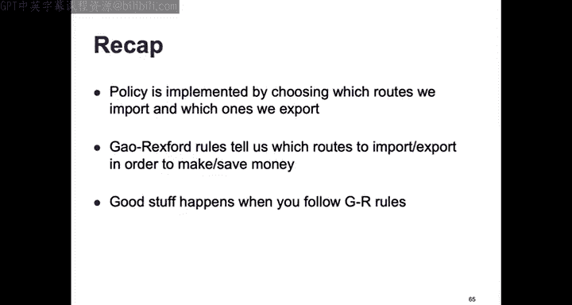

本节课中我们一起学习了域间路由的基础知识。我们了解了**自治系统**是互联网的基本管理单元，域间拓扑由**商业关系**（客户-提供商、对等）塑造。域间路由设计追求**可扩展性**（通过层次化编址实现）和**策略**实施。**BGP协议**通过**路径矢量**和**导入/导出策略**机制来实现这些目标。常见的**Gao-Rexford规则**为我们理解AS如何基于商业逻辑做出路由决策提供了清晰的模型。下一讲，我们将深入BGP协议的细节。