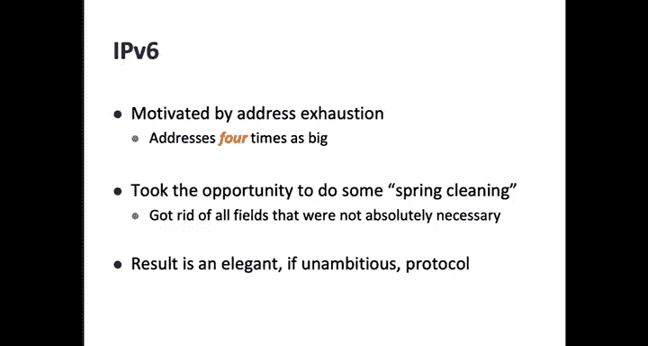
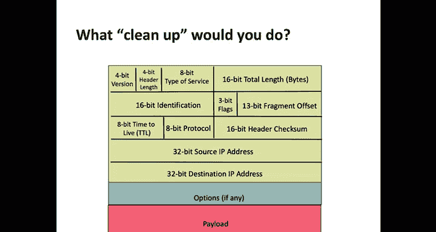
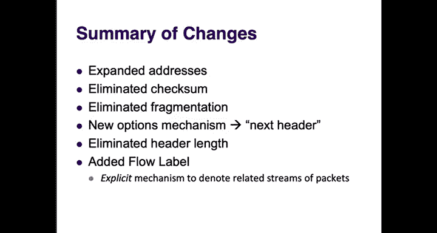
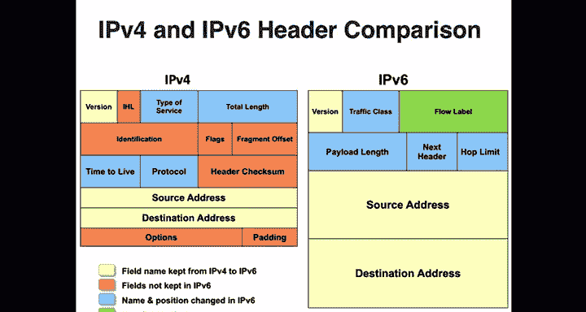
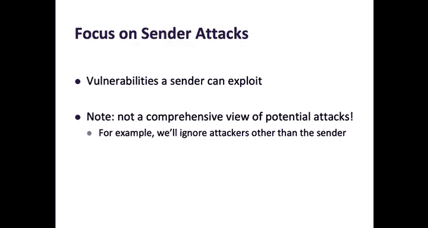
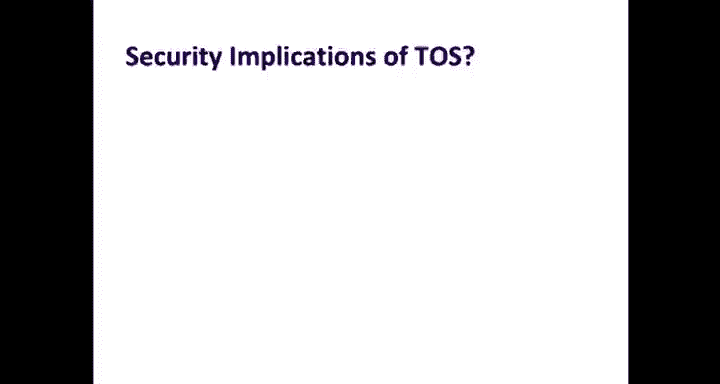
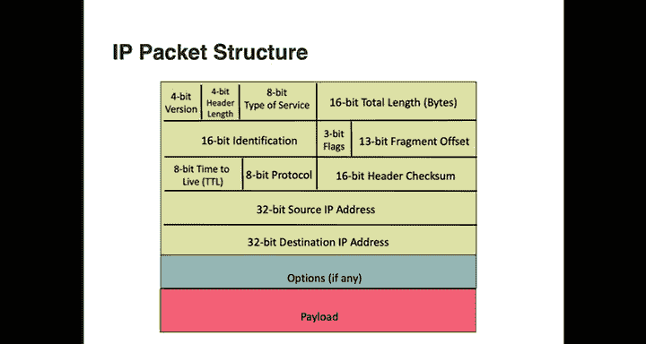
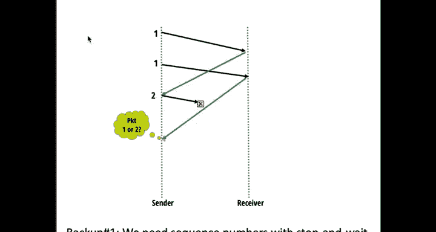

# 互联网导论：架构与协议｜CS 168：P13：可靠传输



## 概述
在本节课中，我们将要学习可靠传输的基本概念和机制。首先，我们会完成对IP报头的讨论，简要了解IPv6相对于IPv4的主要变化，并分析IP报头的安全影响。然后，我们将进入传输层，开始探讨如何在不可靠的网络上构建可靠的数据传输服务。这是理解TCP协议的基础，也是你第二个项目的核心内容。



---

## IPv4到IPv6的演进 🚀

上一节我们介绍了IPv4报头的各个字段及其功能。本节中，我们来看看它的继任者——IPv6。

IPv6的设计主要源于对IPv4地址耗尽（32位地址空间）的担忧。因此，IPv6采用了**128位**的超长地址，极大地扩展了地址空间。目前，全球约有30%到40%的互联网在使用IPv6，各大云服务商和中国等地区都在积极部署，它终将成为互联网的主流协议。

除了地址扩展，IPv6的设计者也借此机会对报头进行了一次“清理”，优化了一些在IPv4中被认为复杂或很少使用的功能。然而，它并非一个雄心勃勃的协议，其核心设计理念与IPv4保持一致，我们所学的关于IPv4的大部分知识仍然适用。

### IPv6报头的主要变化
以下是IPv6相对于IPv4报头的主要改进：





*   **地址扩展**：源地址和目的地址长度从32位扩展到128位。
*   **移除校验和**：因为校验工作可以完全由端主机完成，让数据包穿越网络到达接收方再检查校验和，即使出错也只是浪费一点带宽，从而减轻了路由器的处理负担。
*   **移除分片支持**：IPv6将分片工作推给了发送方。如果路由器收到一个超过链路MTU的数据包，它会丢弃该包并向发送方返回一个ICMPv6错误消息，告知其路径MTU。发送方随后会发送尺寸合适的数据包。
*   **改进选项处理**：IPv6报头中不再有“选项”字段。它引入了“下一个报头”字段，其作用类似于IPv4的“协议”字段，用于指示紧接在IP报头之后的是哪种报头（如TCP、UDP）。如果需要添加像源路由这样的选项，可以定义一个新的“扩展报头”（如源路由报头），并为其分配一个“下一个报头”值。这样，选项就变成了位于IP报头和传输层报头（如TCP）之间的一种扩展报头，可以通过链式结构实现多个选项。
*   **移除报头长度字段**：由于选项已从主报头中移除，报头长度固定为40字节，因此不再需要该字段。
*   **新增流标签**：这是一个20位的字段，用于标识属于同一“流”或相关会话的一系列数据包（例如，一次文件下载或一个网页浏览会话中的所有内容）。这为网络中需要识别相关数据包的中间设备（如防火墙）提供了明确的提示，而无需依赖临时规则（如五元组）进行猜测。

### 设计哲学
IPv6的设计体现了清晰的端到端原则：**任何可以推给端主机完成的工作，都推给端主机**（如校验和、分片）。同时，它也注重**简化**（移除选项和变长报头）和**可扩展性**（通过“下一个报头”机制）。流标签的引入则是一种巧妙的折中，允许端主机向网络传递应用语义的提示，而无需将应用逻辑嵌入网络。

---



## IP报头的安全分析 🛡️


在了解了IPv6的改进后，我们回过头来审视一下IP报头本身存在的安全问题。互联网的原始设计并未充分考虑安全，因此网络层存在多种安全威胁。这里我们分析攻击者通过篡改IP报头字段可能发起的几种攻击：

*   **IP地址欺骗**：发送方可以在源IP地址字段填入任意地址，而网络不会验证其真实性。这可能导致：
    *   **拒绝服务攻击**：攻击者伪造大量不同源IP的数据包攻击目标，使防御者难以通过源IP过滤攻击流量。
    *   **反射攻击**：攻击者向许多服务器发送请求，并伪造源IP为受害者地址，导致这些服务器的响应涌向受害者，耗尽受害者的资源。
*   **服务类型字段滥用**：攻击者可以为自己恶意流量标记高优先级，如果高优先级服务需要额外付费，结合IP欺骗，还可以将费用转嫁给被冒充的受害者。
*   **利用分片和选项发起资源消耗攻击**：发送大量需要分片或携带IP选项的数据包，会迫使路由器进行额外的处理（分片重组、选项解析），消耗其CPU资源，可能影响其正常功能。因此，许多运营商的路由器会直接忽略或丢弃带选项的数据包。
*   **利用TTL进行网络探测**：通过设置较小的TTL并分析返回的“超时”消息，攻击者可以探测到目标网络的内部拓扑结构，这正是`traceroute`工具的原理。有些运营商因此会配置路由器不响应TTL超时消息。

由此可见，IP报头的设计需要在**效率、安全性和可演进性**之间取得平衡。IPv4在这些方面做得尚可，而IPv6在某些方面（如简化设计）有所改进，但安全问题（如地址欺骗）依然存在。





---

## 可靠传输基础 🧱

现在，我们离开网络层，向上进入传输层，开始讨论**可靠性**。本节课我们将涵盖基本概念和机制，下节课再深入TCP协议的细节。

### 为什么需要可靠传输？
当你在互联网上传输文件时，你希望文件能够完整、无误地到达目的地。然而，我们构建可靠传输的基础——IP网络——只提供“尽力而为”的服务。数据包可能会**丢失、损坏、乱序、延迟甚至被意外复制**。因此，可靠传输的核心挑战就是在这样一个不可靠的网络上，为上层应用提供可靠的交付抽象。

根据端到端原则，可靠性是**端主机**（而非网络）的职责，通常由操作系统内核中的**传输层**实现，这样应用开发者就无需自己处理复杂的可靠性问题。

### 可靠传输的目标
我们的设计目标有三个：
1.  **正确性**：接收方至少收到每个数据包一次（`at-least-once`），且内容正确（通过校验和保证）。
2.  **及时性**：传输不应无休止地等待。
3.  **效率**：避免不必要的重传，充分利用网络带宽。

值得注意的是，可靠性协议允许在尝试足够次数后宣告失败（例如，网络永久分区），但必须向上层应用明确报告失败，绝不能谎报成功。

### 单数据包传输的基石
我们先从最简单的场景开始：如何可靠地传输**一个**数据包？这揭示了可靠传输所需的基本构件。

以下是处理各种网络问题的核心机制：

*   **应对丢失：超时与重传**
    *   发送方发送数据包后启动一个**定时器**。
    *   如果在定时器到期前收到接收方返回的**确认**，则取消定时器，传输成功。
    *   如果定时器到期仍未收到确认，发送方**重传**该数据包。
    *   **问题**：如果确认包丢失，发送方会超时重传，导致接收方收到重复的数据包。这是“至少一次”交付语义的必然结果，因为发送方无法区分是数据包丢失还是确认包丢失。

*   **应对损坏：校验和**
    *   接收方计算数据包的**校验和**，并与发送方提供的校验和比对。
    *   如果校验失败，数据包被损坏，接收方可以：
        1.  直接丢弃（什么也不做），依赖发送方的超时重传机制。
        2.  发送一个**否定确认**（NACK），明确告知发送方数据包损坏，促使其立即重传。TCP协议没有采用NACK。

*   **应对延迟和重复**
    *   **延迟**：如果数据包或确认在超时前到达，则没有问题。如果在超时后到达，会导致不必要的重传和重复确认，但仍在“至少一次”的语义范围内。
    *   **重复**：网络设备故障可能导致数据包被意外复制。接收方会收到重复包并发送重复确认，发送方处理重复确认即可，机制上可以兼容。

**小结**：通过**校验和、确认（ACK/NACK）、超时重传**这些构件，我们能够可靠地传输单个数据包。其语义是接收方可能收到重复包。

---

## 多数据包传输与滑动窗口 🪟

单数据包传输效率极低。为了提升效率，我们需要同时传输多个数据包。

### 从“停等”到“滑动窗口”
最简单的多包协议是**停等协议**：发送方必须等待前一个数据包的确认到达后，才能发送下一个。这导致链路利用率极低，每轮往返时间只能发送一个包。

改进方法是允许发送方有**多个数据包在传输中**，即采用**滑动窗口**协议。
*   **窗口大小**：用一个参数 **`W`** 表示允许的未确认数据包最大数量。
*   **滑动机制**：发送方维护一个窗口，初始包含序列号1到`W`的数据包。每收到一个确认，窗口就向前“滑动”一格，允许发送下一个新的数据包。
*   **目标**：通过让发送方持续发送数据，来“填满管道”，充分利用网络带宽。

### 如何设置窗口大小？
理想情况下，我们希望发送方在整个往返时间内都保持发送状态。这引出了**带宽时延积**的概念：
```
理想窗口大小 (W) = 往返时间 (RTT) × 瓶颈带宽 (B)
```
窗口大小（以字节计）应至少等于带宽时延积，才能充分利用网络容量。设置过小会浪费带宽，设置过大会导致拥塞（后续课程讨论）。

### 确认信息的类型与权衡
当有多个数据包在传输中时，确认信息的设计变得重要。主要有三种类型：

1.  **独立确认**：收到数据包`i`，就回复`ACK i`。
    *   **优点**：简单、紧凑。
    *   **缺点**：对ACK丢失不健壮，任何ACK丢失都会导致超时重传。

2.  **完全信息确认**：确认中携带接收方已收到的所有数据包序列号信息（例如，“已收到1, 2, 4, 5”）。
    *   **优点**：信息完整，对ACK丢失非常健壮。
    *   **缺点**：确认包可能变得非常大，开销大。

3.  **累积确认**：确认中只携带一个序列号`N`，表示接收方已收到所有序列号小于等于`N`的数据包。
    *   **优点**：紧凑，对单个ACK丢失有一定健壮性（后续的累积ACK能弥补前面ACK的信息）。
    *   **缺点**：信息不完整。当发生多个数据包丢失时，发送方无法从重复的累积ACK中精确判断具体丢失了哪些包，只能知道有包丢失。

**TCP协议主要使用累积确认**，因为它平衡了开销和健壮性。后来通过**选择性确认**扩展来弥补其信息不完整的缺点。

### 基于确认的丢包检测
有了持续的确认流，我们可以比单纯依赖超时更早地检测丢包。一个常见的启发式规则是：如果发送方连续收到**K个**（例如3个）对**更高序列号**数据包的确认，而仍未收到对某个预期数据包`X`的确认，则可以推断数据包`X`很可能丢失了。
*   对于**独立确认**或**完全信息确认**，这个规则很清晰，能明确知道哪个包丢了。
*   对于**累积确认**，这个规则表现为收到**K个重复的累积ACK**（即ACK号不变）。这能告诉发送方有数据包丢失，但无法精确指出是哪个（当有多个包丢失时）。发送方需要进行一定的猜测。

### 响应丢包
检测到丢包后，自然要重传。对于独立或完全信息确认，重传哪个包是明确的。对于累积确认，在多个包丢失的场景下，需要结合其他机制（如TCP的“快速重传”和“选择性确认”）来决定重传策略，避免不必要的重传。

---

## 其他可靠传输思路 💡

除了这种基于确认、重传的“自动重传请求”模型，还有其他设计可靠传输的思路：
*   **无确认的重复发送**：简单地反复发送所有数据，直到接收方通知已收全。非常低效。
*   **前向纠错编码**：利用编码理论，发送方发送的并不是原始数据包的副本，而是包含冗余信息的编码数据包。只要接收方收到足够数量（可能少于发送总数）的编码包，就能通过解码恢复出原始数据。这种方法无需确认和重传，能容忍一定丢包率，常用于流媒体等场景，但尚未成为互联网传输层的主流。

---




## 总结
本节课我们一起学习了可靠传输的基础构建模块。我们首先回顾了IPv6对IPv4报头的简化和改进，并分析了IP报头存在的安全漏洞。然后，我们深入探讨了在不可靠网络上实现可靠传输的核心机制：**校验和、序列号、确认、定时器、重传以及滑动窗口**。我们比较了不同类型的确认信息（独立、完全信息、累积确认）的优缺点，并了解了如何利用确认流来更高效地检测丢包。这些概念是理解下一讲内容——传输控制协议（TCP）——的基石。TCP正是综合运用了这些构件，并加入了拥塞控制、流量控制等复杂机制，成为了互联网可靠的传输层支柱。