# 互联网导论：架构与协议｜CS 168：P14：期中复习

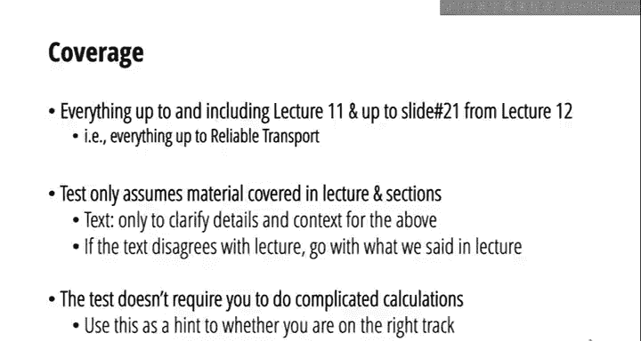

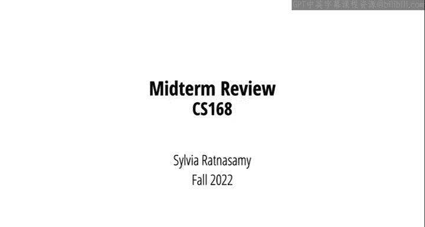

在本节课中，我们将回顾前半学期所学的核心概念，涵盖从底层链路到高层协议设计的全部内容。我们将快速梳理关键知识点，帮助你为考试做好准备。

## 考试概览与指南

首先，我们明确考试的范围和形式。期中考试将涵盖目前为止所有讲座中涉及的内容，但**不包括**最近一次关于可靠性的讲座（即超时重传机制）。

考试将基于讲座内容，教材可作为辅助理解的参考资料。如果教材与讲座内容有出入，请以讲座为准。

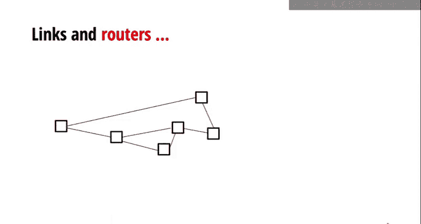

考试中不会有复杂的数学计算或冗长的运算。如果你发现自己陷入了复杂的计算，很可能思路有误。

考试旨在测试你对概念的理解和应用能力，而非死记硬背。你可能会遇到将课堂上学到的算法（如距离向量）应用到新场景或陌生拓扑结构中的问题。

考试格式通常包括约25道快速问答题和几道针对特定主题的深入分析题。题目难度可能递增，请注意合理分配时间。

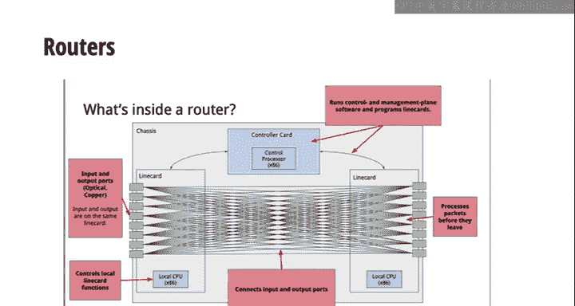

请保持自信，你已经掌握了解决问题所需的所有知识。如果遇到难题，不要慌张，冷静分析。

## 网络基础：从链路到路由器

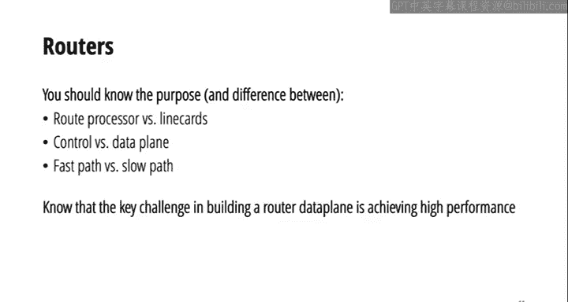

我们从最基础的链路开始。你需要了解链路的关键属性：
*   **带宽**：链路传输数据的能力。
*   **传播时延**：信号在链路上传播所需的时间。
*   **带宽时延积**：链路的容量，表示链路上能容纳的“在途”数据量。

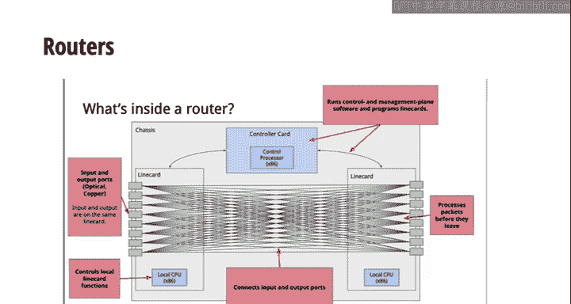

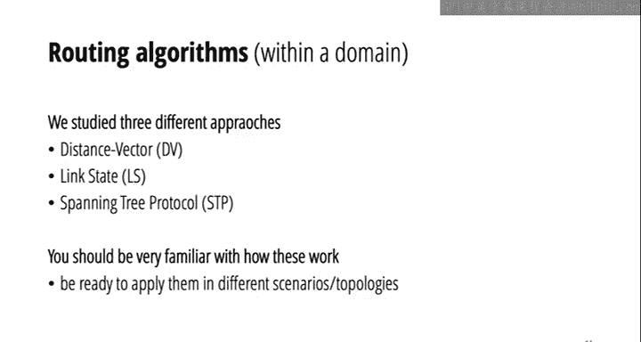

基于这些属性，你应该能够计算数据包从一点传送到另一点所需的总时间，并理解其组成部分：
*   **传输时延**：将数据包所有比特推送到链路上所需的时间。公式为：`数据包大小 / 带宽`。
*   **传播时延**：比特在物理链路上传播所需的时间。
*   **排队时延**：数据包在路由器缓冲区中等待处理的时间。

路由器将多条链路互连，形成网络拓扑。在罗伯的讲座中，我们深入探讨了路由器的内部结构。

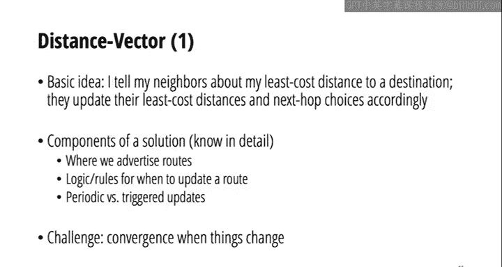

理解路由器内部运作的关键是区分**控制平面**和**数据平面**：
*   **数据平面（快速路径）**：负责数据包的快速转发。这通常由硬件实现，处理固定功能，如检查IP头、更新TTL、计算校验和、执行IP查找并转发数据包。
*   **控制平面（慢速路径）**：运行在控制处理器上，负责计算路由表（通过运行BGP、距离向量、链路状态等路由协议），并处理需要复杂操作的数据包（如带有选项的数据包）。

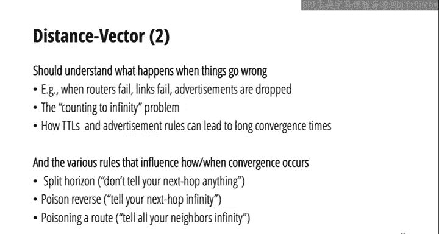

数据平面追求极致的性能，因此像分片、选项处理这类复杂操作对其压力很大。

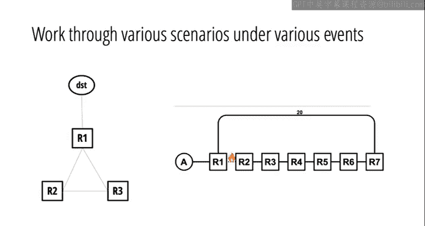

## 路由基础与域内路由

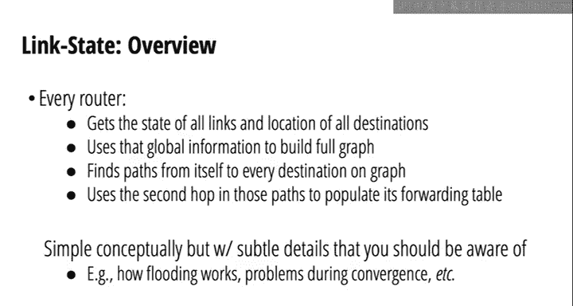

网络的核心挑战之一是如何进行路由。我们首先讨论了**有效路由状态**的含义：即对于任何目的地，都没有死胡同和路由环路。

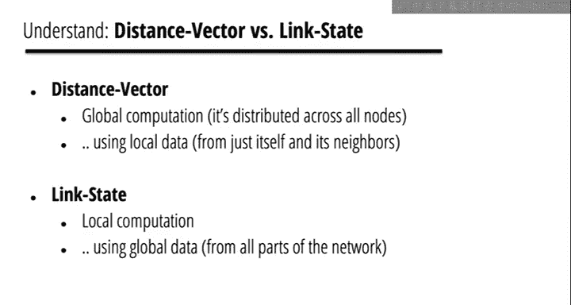

接着，我们引入了**链路成本**的概念，并探讨如何计算**最小成本路径**。成本度量通常是链路延迟，如果未指定，则默认成本为1。

除了动态路由，还有**静态路由**（由网络管理员手动配置）和**默认路由**（用于处理所有未明确路由的目的地，通常用于只有单一出口的网络）。

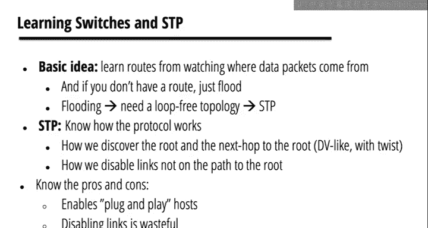

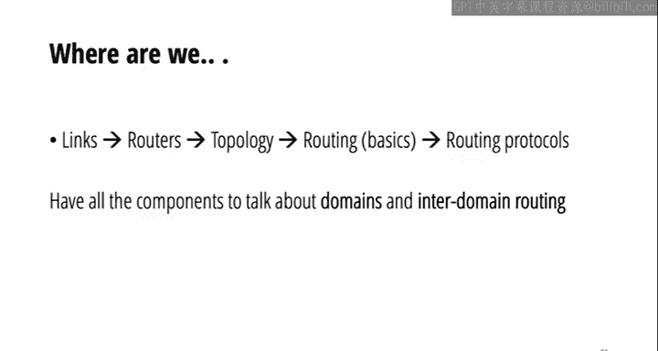

在域内路由中，我们学习了三种主要方法：

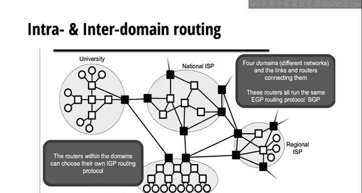

### 距离向量路由
这是一种分布式异步协议。每个路由器向其邻居通告它到所有目的地的最小成本距离，并监听邻居的通告，以此计算自己的路由表。

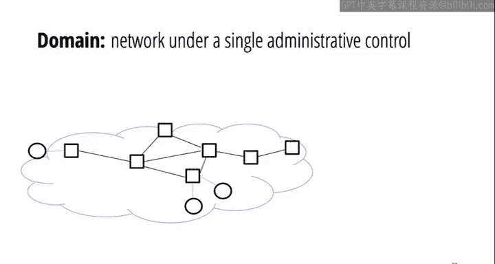

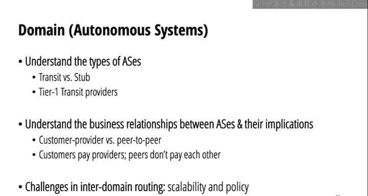

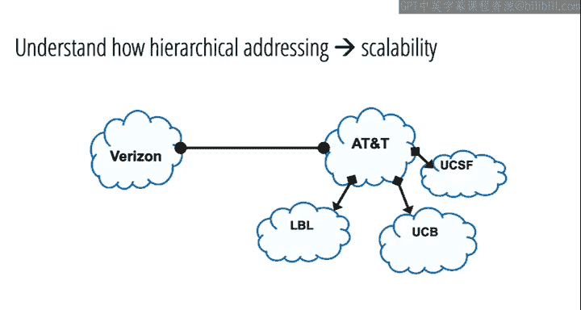

你需要掌握其详细组件：
*   **通告规则**：当听到一个新目的地、或听到一个成本更低的路由、或从当前下一跳听到距离变更时，更新路由表。
*   **周期性与触发更新**。
*   **收敛**：网络变化后，所有路由器重新计算路由直至达到稳定状态的过程。
*   **计数到无穷大问题**：以及如何通过设置最大度量值（如16跳）来避免。
*   **优化收敛的技术**：
    *   **水平分割**：不向下一跳路由器通告通过它到达目的地的路由。
    *   **毒性逆转**：主动向下一跳通告到目的地的成本为无穷大。
    *   **路由毒化**：当路由失效时，立即向邻居通告其成本为无穷大。

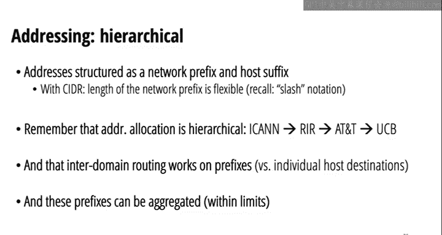

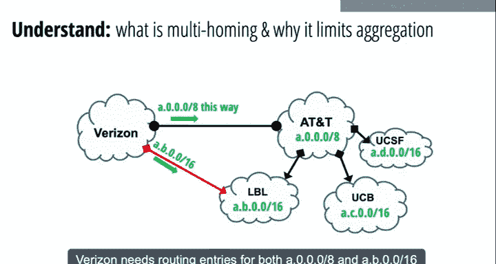

### 链路状态路由
这种方法与距离向量相反。每个路由器通过**泛洪**机制收集整个网络中所有链路的状态信息，从而构建出完整的网络拓扑图，并独立计算到所有目的地的最短路径。

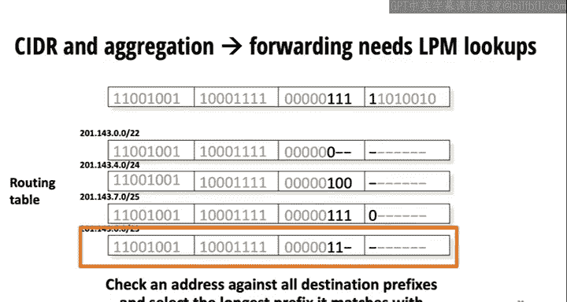

关键点包括：
*   **泛洪的可扩展性**：通过序列号机制避免重复泛洪同一链路状态通告。
*   **收敛期间的问题**：尽管链路状态收敛较快，但在收敛期间仍可能存在问题。

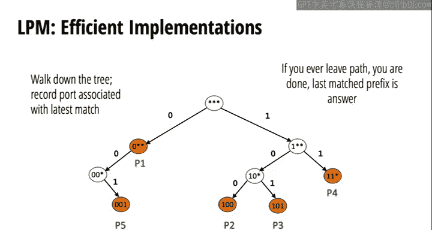

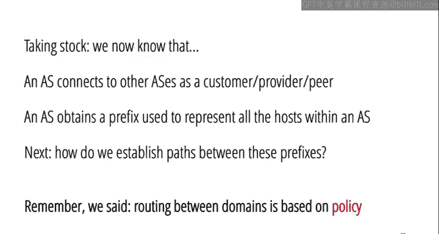

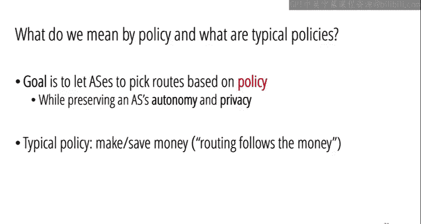

### 生成树协议与学习型交换机
这种方法用于实现“即插即用”的网络，无需手动配置主机位置。交换机通过观察数据包的源地址来学习主机位置（**学习型交换机**）。对于未知目的地的数据包，则进行泛洪。

为了避免泛洪引起环路，需要先使用**生成树协议**构建一个无环的树状拓扑，数据包只在这个生成树上泛洪。

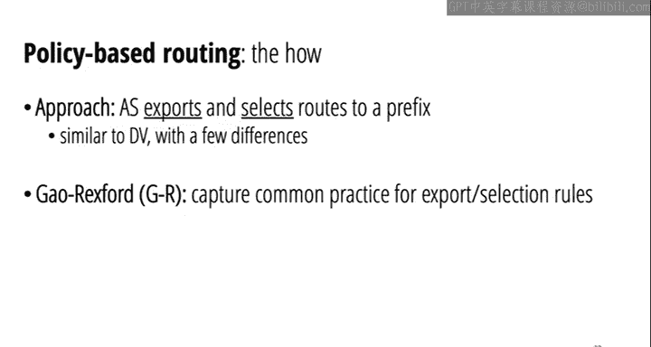

STP构建生成树的过程类似于距离向量，但同时确定树的根节点和到根的路径。

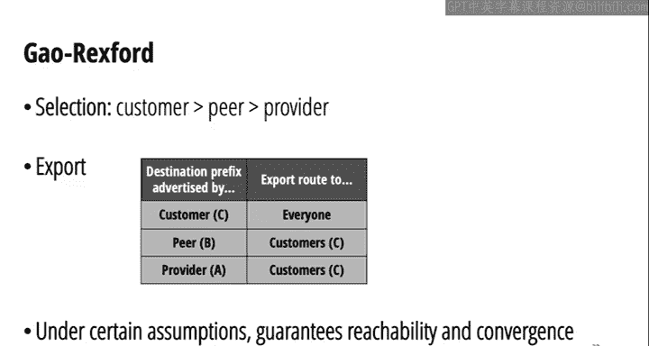

## 域间路由与BGP

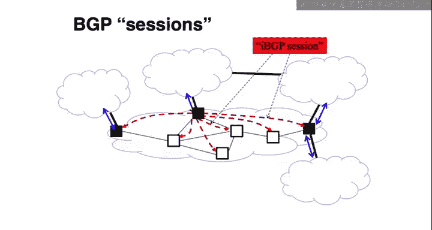

单个网络域被称为**自治系统**。AS内部使用**内部网关协议**（如距离向量、链路状态），而AS之间则需要**外部网关协议**，即**边界网关协议**。

AS分为不同类型：
*   **传输AS**：为不属于本AS的源和目的地承载流量。
*   **桩AS**：只包含本AS内部的目的地。
*   **一级传输提供商**：位于互联网顶层，彼此对等互联，没有上游提供商。

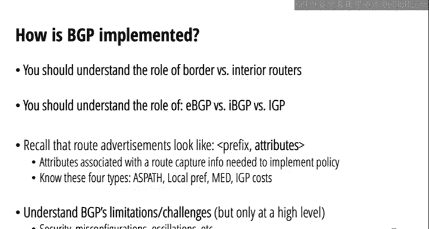

域间路由的核心挑战是**可扩展性**和**策略**。

**可扩展性**主要通过**层次化IP地址**和**地址聚合**来实现。IP地址按前缀进行路由，这导致了**最长前缀匹配**的查找需求（例如，目的地址`192.168.1.1`匹配前缀`192.168.1.0/24`，而非`192.168.0.0/16`，因为前者前缀更长）。

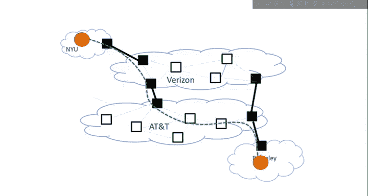

**策略**源于AS之间的商业关系（客户-提供商、对等）。核心原则是“**路由跟随金钱**”。策略通过BGP的**路由导入**和**路由导出**规则实现：
*   **导入策略（选择路由）**：通常优先选择客户发来的路由，其次是对等方，最后是提供商。
*   **导出策略（通告路由）**：
    *   从客户学来的路由：通告给所有邻居（客户、对等、提供商）。
    *   从对等或提供商学来的路由：只通告给自己的客户（不会通告给其他对等或提供商，因为不想免费为它们传输流量）。

BGP通过**路径属性**来实现策略和路径选择，重要的属性包括：
*   **AS路径**：记录路由经过的AS序列，通常优先选择路径最短的。
*   **本地优先级**：由管理员手动设置，用于影响本AS内的路由选择偏好。
*   **MED**和**IGP成本**：用于在多个出口中选择，以优化AS内部带宽使用。

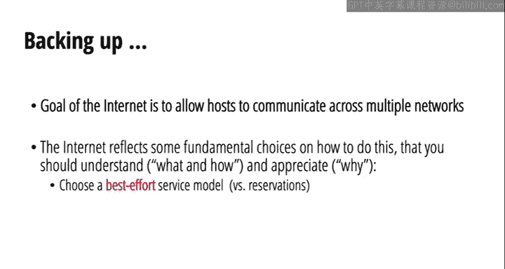

在AS内部，**边界路由器**通过**eBGP**与其他AS交换路由，并通过**iBGP**将这些路由传播给内部路由器。内部路由器同时运行**IGP**（如OSPF）来学习AS内部拓扑，以知道如何将数据包送达边界路由器。

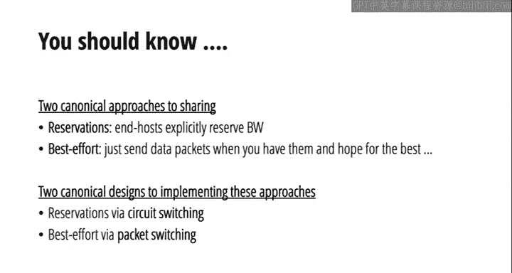

## 互联网架构设计原则

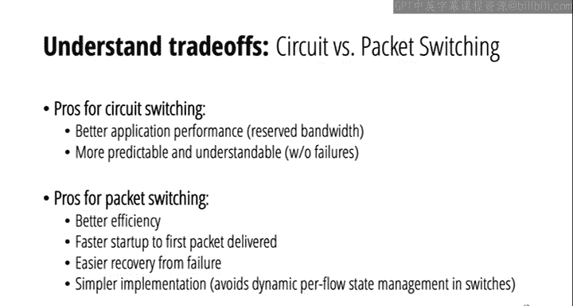

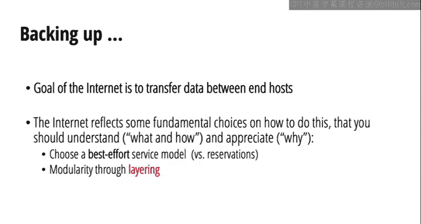

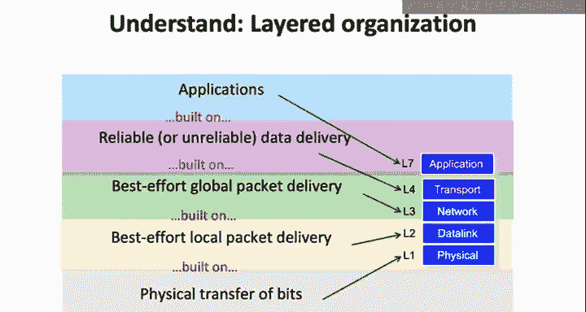

在理解了“如何做”之后，我们回顾一下互联网“为何如此设计”的根本原则。

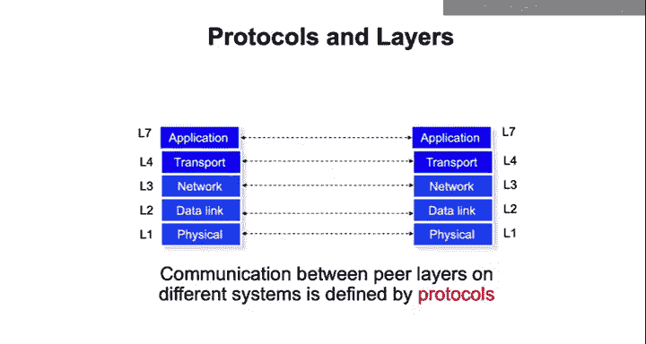

### 尽力而为服务与统计复用
互联网采用**尽力而为**的服务模型：发送数据包，但不保证一定送达。这建立在**统计复用**的基础上，即所有用户共享网络资源，这比为每个用户预留固定带宽（电路交换）效率高得多，成本也更低。

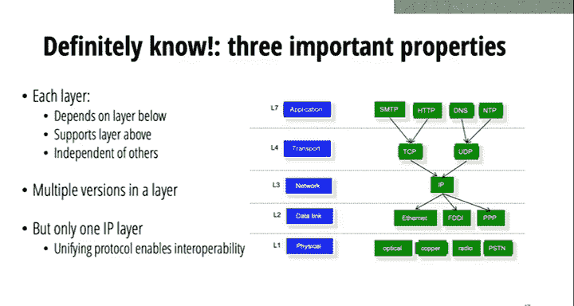

### 分层与协议
通过**分层**将复杂的端到端通信任务分解。我们采用五层模型：
1.  **应用层**
2.  **传输层**（如TCP/UDP）
3.  **网络层**（IP）
4.  **链路层**（如以太网）
5.  **物理层**

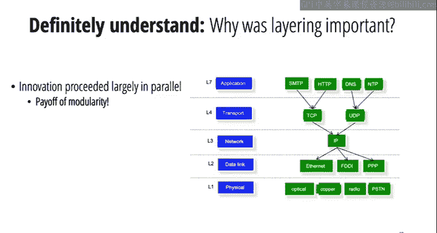

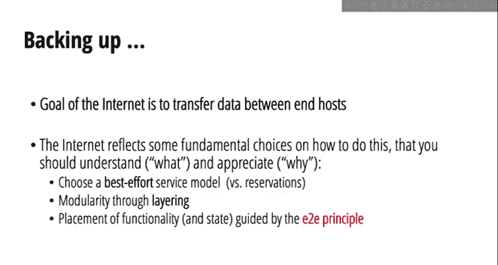

每一层通过**协议**进行通信。关键特性是**严格分层**和**网络层唯一性**（全球统一的IP协议）。这种模块化设计促进了并行创新。

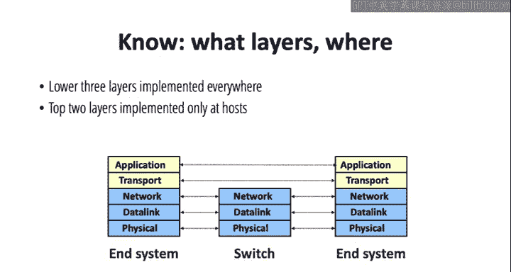

### 端到端原则
该原则指导功能应在何处实现。核心思想是：如果某个功能（如可靠性）无法在网络上完全正确地实现（因为最终仍需端系统确认），那么就应该在端系统实现，网络至多提供优化。

因此，在互联网中，**端系统**实现了全部五层，而**网络内部**（路由器）只实现下三层（网络层及以下）。

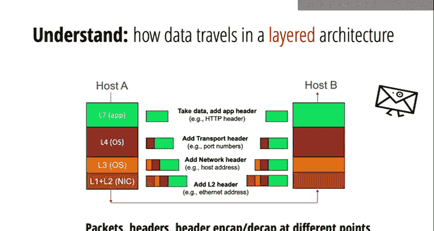

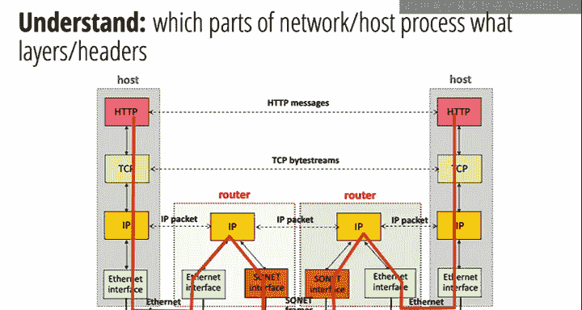

### 数据包封装与IP头
数据在发送时，从上到下每层添加各自的**协议头**（封装）；接收时，从下到上每层移除并处理对应的头（解封装）。

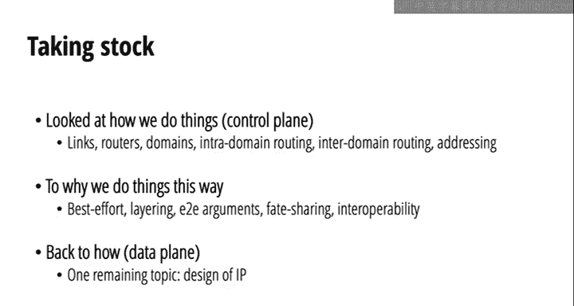

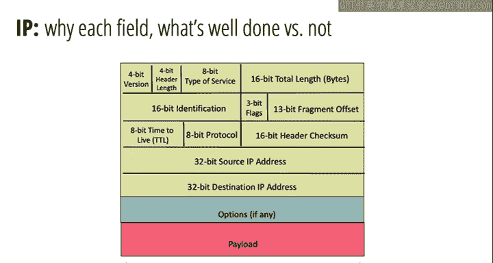

IP头的设计集中体现了网络层的功能与权衡。你需要熟悉IPV4头各字段的作用（如TTL防环、校验和检错、源/目的地址等）。通过对比IPV6（取消了头部校验和、分片等字段），可以理解哪些设计是成功的，哪些带来了问题。

---

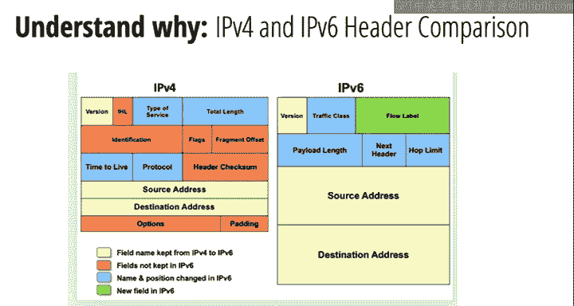

本节课中，我们一起回顾了互联网架构的核心内容：从底层的链路、路由器，到域内（距离向量、链路状态、STP）和域间（BGP、策略、地址聚合）路由协议，最后回归到互联网根本的设计原则（尽力而为、分层、端到端原则）。希望这次复习能帮助你梳理知识体系，祝你在期中考试中取得好成绩！