# 互联网导论：架构与协议｜CS 168：P15：-14- 传输控制协议 (TCP) 🚀

在本节课中，我们将要学习传输层的作用，并深入探讨传输控制协议（TCP）的具体设计。我们将从传输层的通用功能开始，然后聚焦于TCP如何实现这些功能，包括其可靠字节流抽象、连接管理、流量控制等核心机制。

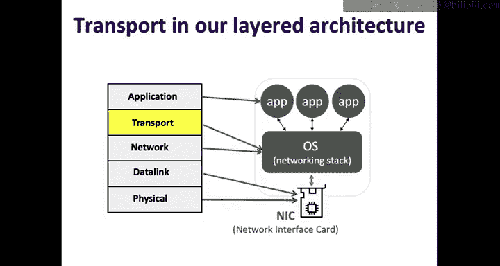

---

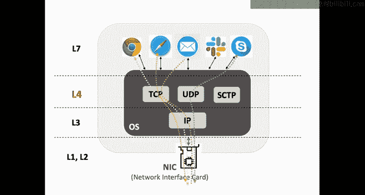

## 传输层概述

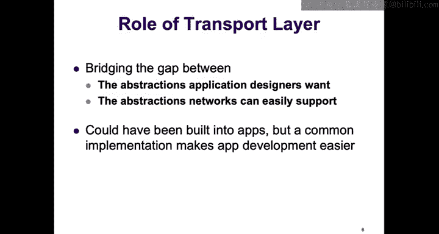

上一节我们介绍了网络层，本节中我们来看看位于网络层和应用层之间的传输层。传输层在端主机（通常在操作系统中）实现，其核心作用是弥合应用层期望的通信抽象与网络层提供的基础服务之间的差距。

与网络层不同，传输层可以同时运行多种协议（如TCP、UDP），不同的应用可以同时使用不同的传输协议，但它们都共享底层的IP层。

将传输层构建在操作系统中，使其能为所有应用提供公共服务。如果没有像TCP这样的传输层，每个应用都需要自行处理网络层带来的所有复杂性和不确定性。

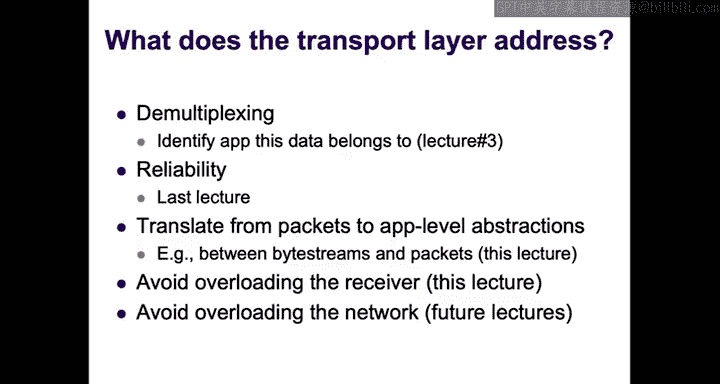

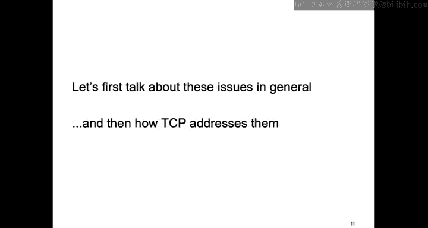

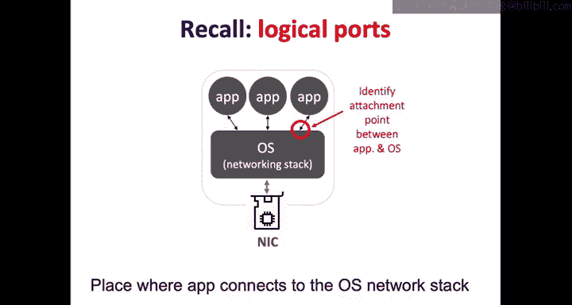

## 传输层的核心功能

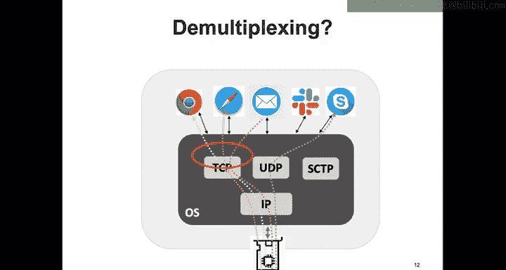

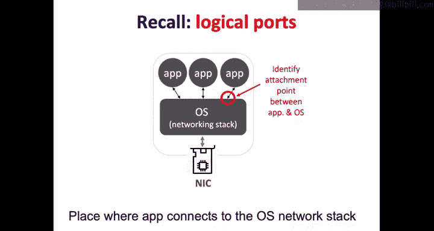

以下是传输层需要解决的几个核心问题：

1.  **多路分解**：当数据从网络到达时，如何确定将其传递给哪个应用进程。
2.  **可靠性**：确保数据在不可靠的网络上可靠地传输。
3.  **抽象转换**：将网络层的“数据包”抽象转换为应用层更易理解的抽象（如字节流）。
4.  **避免接收方过载**：控制发送速率，防止接收方缓冲区溢出。
5.  **避免网络过载**：控制发送速率，公平地与其他数据流共享网络资源。

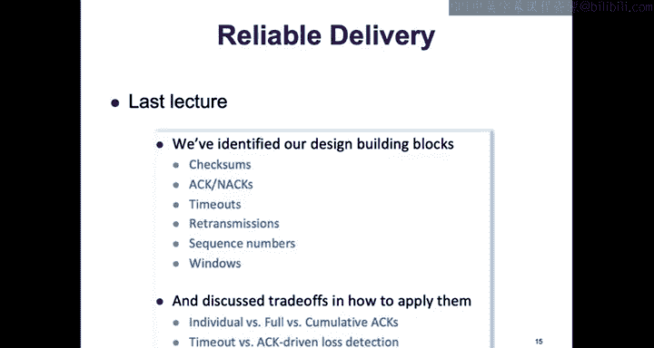

接下来，我们将逐一探讨这些功能，并了解TCP如何实现它们。

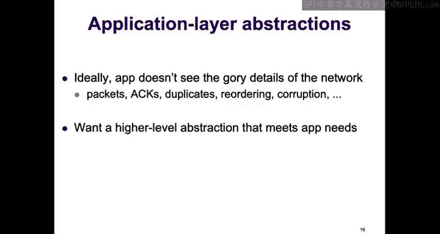

### 多路分解与端口

多路分解的核心问题是：当数据包到达主机后，如何确定将其交给哪个应用进程。

解决方案是使用**端口**。端口是一个16位的逻辑标识符，用于标识应用进程与操作系统通信的端点。端口号携带在传输层（如TCP或UDP）的头部中。

当数据包到达时，操作系统根据IP头中的协议字段（如值为6代表TCP）将其交给相应的传输层协议处理。传输层协议再根据头部中的目的端口号，将数据传递给监听该端口的应用进程。

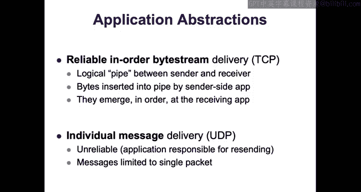

### 可靠性

关于可靠性的基本概念和构建模块（如校验和、确认、超时重传、序列号、窗口等），我们在上一讲中已经详细讨论过。TCP将利用这些组件来实现可靠的数据传输。

### 应用层抽象

应用开发者不希望处理数据包丢失、重复、乱序或损坏等底层网络问题。因此，传输层需要提供一个更高级的抽象。

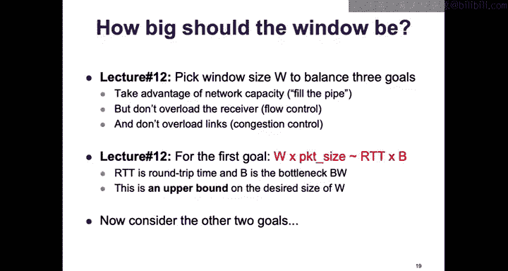

最常用且直观的抽象是**可靠的、有序的字节流**。发送方将字节按顺序放入一个“管道”，接收方从管道另一端按相同顺序取出所有字节。TCP就提供了这样的抽象。

另一个常见的抽象是**不可靠的单条消息传递**，由UDP协议提供。它只是简单地将一个数据报发送出去，不保证可靠性或顺序性。这对于那些可以容忍少量丢失、数据量小或对延迟极其敏感的应用（如IoT传感器、实时音视频）非常有用。

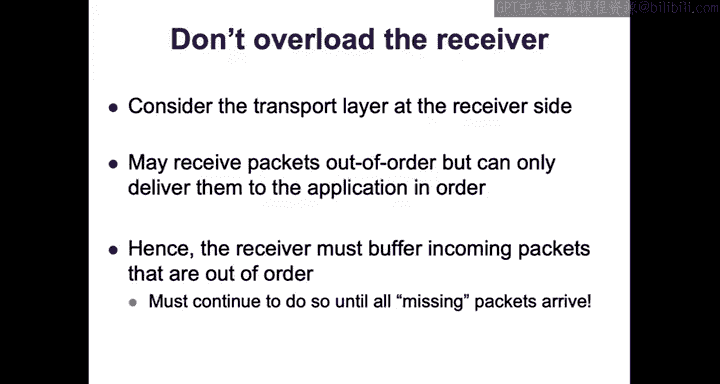

### 流量控制：避免接收方过载

在可靠性讨论中，我们引入了“窗口”的概念，它决定了发送方在未收到确认前可以发送多少数据。窗口大小的设定需要平衡三个目标：充分利用网络容量、不使接收方过载、不使网络过载。

本节我们先看第二个目标：**流量控制**。

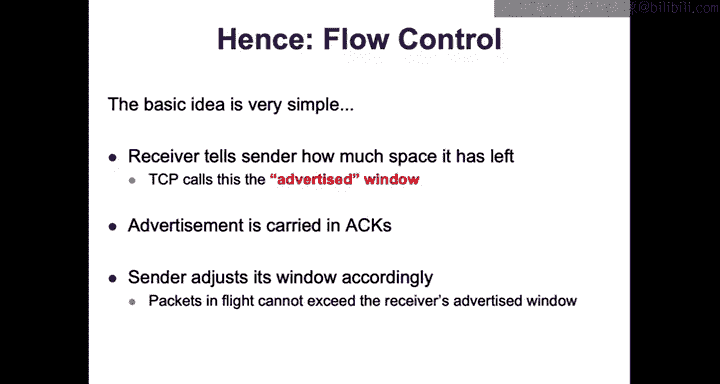

为什么接收方可能过载？因为TCP提供有序交付。如果数据包乱序到达，接收方必须将后续到达的数据包缓存在缓冲区中，直到缺失的包到达后才能按序提交给应用。接收方缓冲区是有限的。

解决方案是：接收方动态地告知发送方自己还有多少可用的缓冲区空间。在TCP中，这个值称为**通告窗口**，它被放在每个确认包的头部中发送给发送方。发送方则确保自己已发送但未确认的数据量不超过接收方通告的窗口大小。

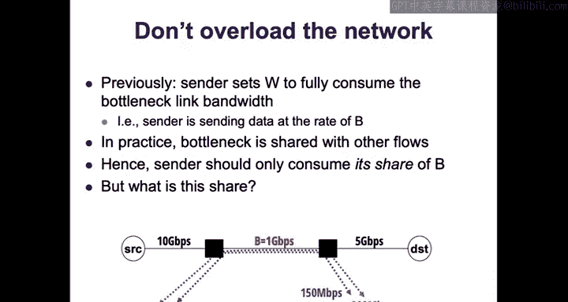

### 拥塞控制：避免网络过载

第一个目标（填满管道）给出的窗口大小上限是：**带宽延迟积（BDP）**，即 `窗口 ≤ 往返时间（RTT） × 瓶颈链路带宽`。但这假设了该数据流独占整个瓶颈链路。

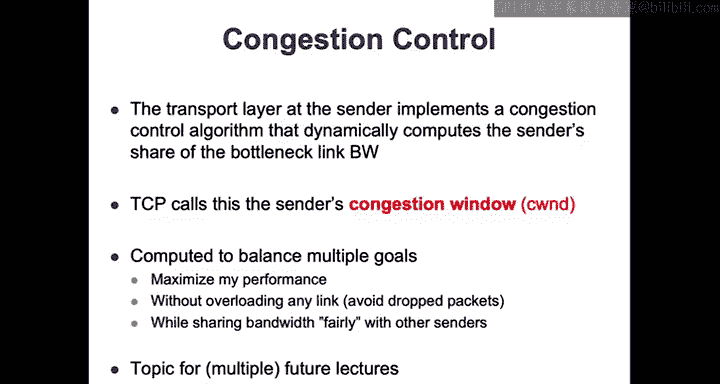

现实中，网络由许多流共享。因此，每个流应该只占用其“公平份额”，而不是全部容量。确定这个公平份额是一个复杂的问题，这就是**拥塞控制**算法的任务。

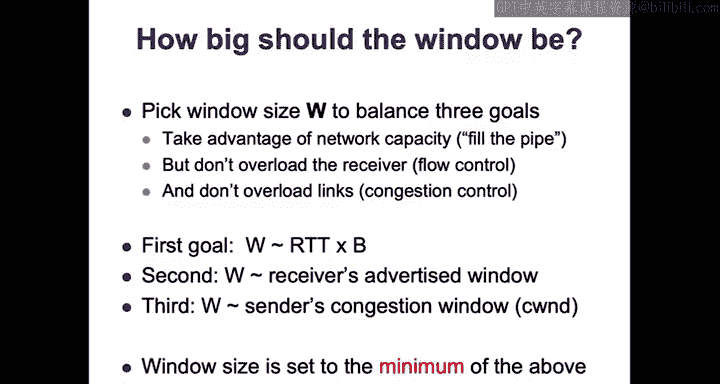

我们可以将拥塞控制算法视为一个“黑盒”，它运行在发送方，根据网络状况动态计算出一个值，称为**拥塞窗口**。发送方最终的可用窗口大小，是接收方**通告窗口**和自身**拥塞窗口**中的较小值。

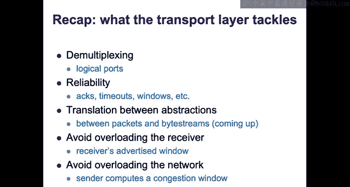

> **公式**：`发送窗口 = min(通告窗口， 拥塞窗口)`

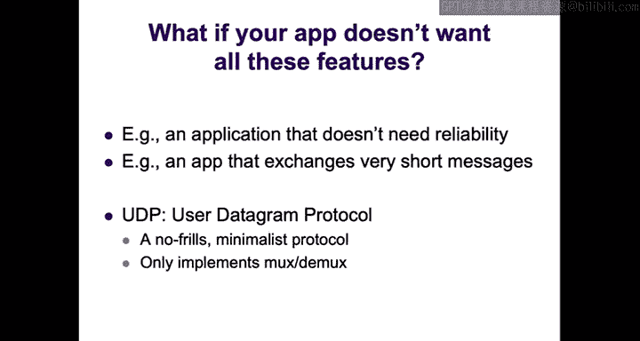

拥塞控制将是后续多节课的重点。

### 窗口大小决策总结

回顾一下，发送方窗口大小受限于三个因素：
1.  网络容量：`RTT × 瓶颈带宽`（理论最大值）。
2.  接收方能力：**通告窗口**。
3.  网络公平性：**拥塞窗口**。

实践中，由于难以精确获知瓶颈带宽，且拥塞窗口通常小于带宽延迟积，因此发送窗口由后两者决定。

> **公式**：`实际发送窗口 = min(通告窗口， 拥塞窗口)`

---

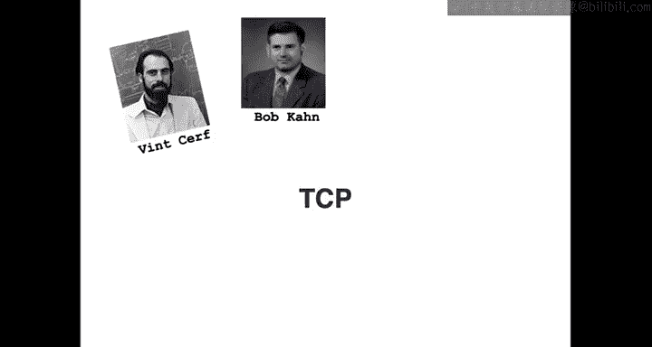

## 传输层协议：UDP简介

在深入TCP之前，简单了解下UDP。用户数据报协议（UDP）是一个非常轻量级的传输层协议。它只提供最基本的多路分解（通过端口）和可选的校验和，不提供可靠性、顺序性、流量控制或拥塞控制。

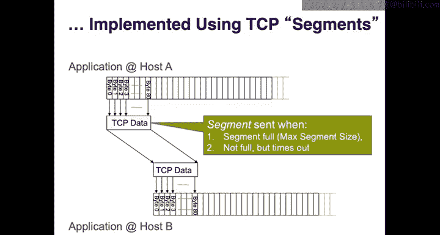

UDP适用于那些需要低开销、能容忍丢包或自身实现了简单重传机制的应用。

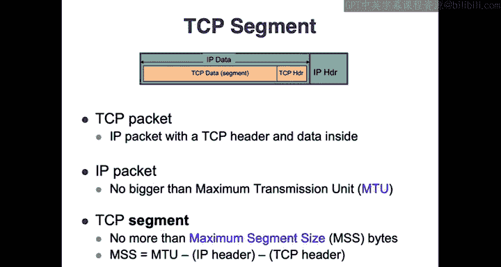

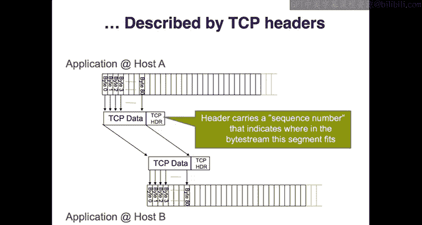

---

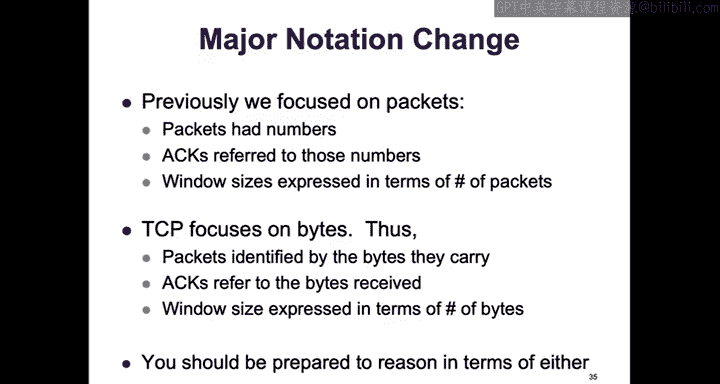

## 深入TCP 🧩

TCP由Vinton Cerf和Bob Kahn等人设计，是互联网的基石。它之所以重要，不仅因为绝大多数互联网应用都运行在TCP之上，还因为它体现了优秀的工程设计和细节关注。

### TCP抽象：可靠的、有序的字节流

TCP向应用层提供“可靠的、有序的字节流”抽象。这意味着应用看到的是一个连续的字节流，所有字节都会按发送顺序可靠地送达。

实现上，发送方将应用数据分割成一个个**TCP段**进行发送。每个TCP段都包含一部分字节流数据和一个TCP头部。

TCP段被封装在IP数据包中。TCP段的最大长度受限于链路的最大传输单元（MTU），计算公式为：
> **公式**：`最大段大小（MSS） = MTU - IP头长度 - TCP头长度`

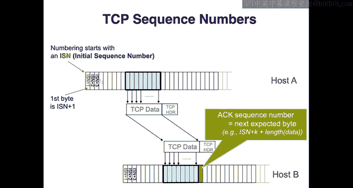

### 序列号与确认号

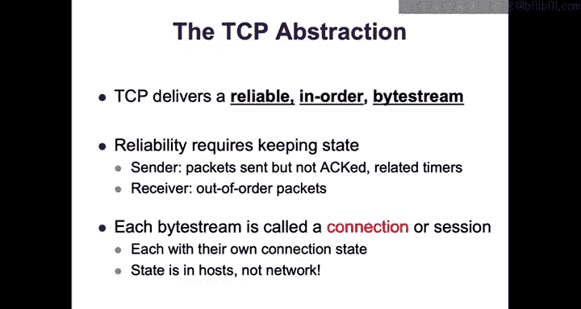

TCP的关键在于使用字节偏移量进行标识，而不是数据包编号。
*   **序列号**：标识该TCP段中第一个数据字节在整个字节流中的偏移量。
*   **确认号**：接收方用它来确认数据。其含义是“期望收到的下一个字节的序列号”，即接收方已正确接收该序号之前的所有字节。

**初始序列号**：每个TCP连接开始时，会随机选择一个初始序列号（ISN）。连接的第一个数据字节的序列号是 `ISN + 1`。使用随机ISN主要是出于安全考虑，防止旧连接的残留数据包被误认为是新连接的数据，或防止序列号预测攻击。

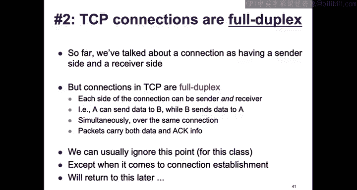

### TCP是面向连接的

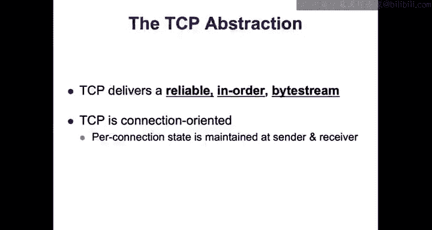

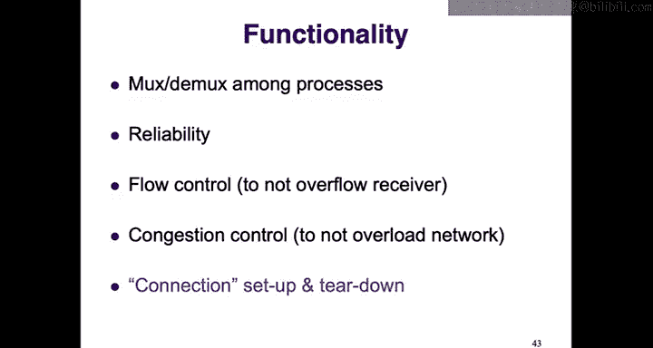

为了实现可靠字节流，TCP需要在通信两端维护连接状态（如序列号、缓冲区、定时器等）。因此，TCP是**面向连接**的协议，需要在数据传输前显式地建立连接，在传输后拆除连接。

此外，TCP连接是**全双工**的，意味着双方可以同时向对方发送数据。一个方向的数据包可以“捎带”另一个方向的确认信息。

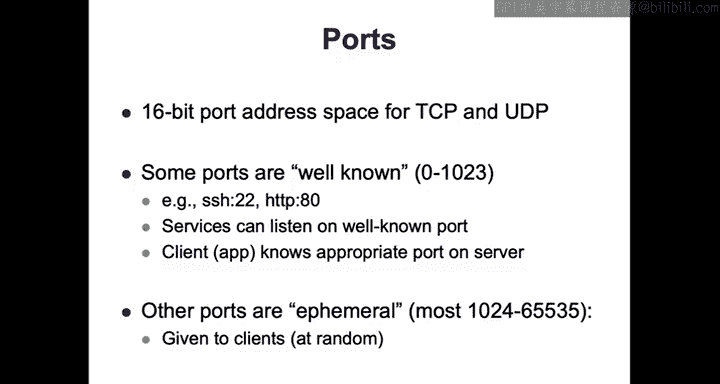

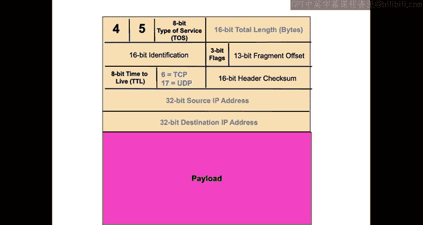

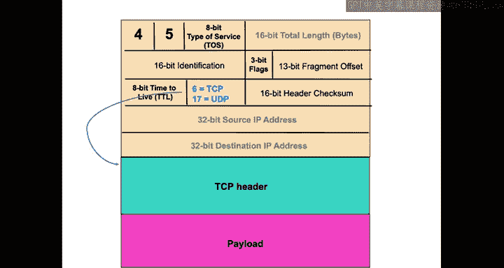

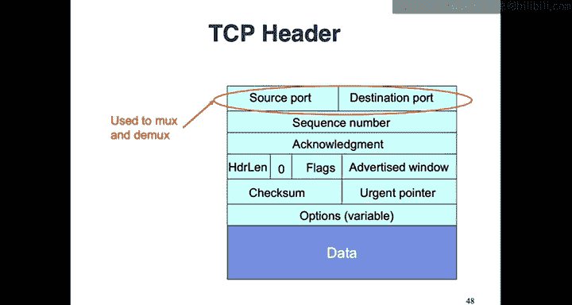

---

## TCP头部格式与功能实现

现在，我们结合TCP头部格式，来看TCP如何具体实现传输层的各项功能。

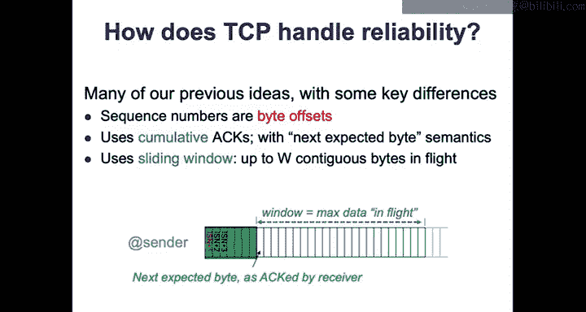

### TCP头部结构

一个TCP头部包含以下关键字段（对应下图）：

1.  **源端口 & 目的端口**：各16位，用于多路分解。
2.  **序列号**：32位，该段数据的第一个字节的序列号。
3.  **确认号**：32位，期望收到的下一个字节的序列号。
4.  **头部长度**：4位，以4字节为单位，指示TCP头部的长度。
5.  **标志位**：6个控制位，包括URG、ACK、PSH、RST、SYN、FIN。
6.  **窗口大小**：16位，即接收方的**通告窗口**，用于流量控制。
7.  **校验和**：16位，用于差错检测。
8.  **紧急指针**：与URG标志位配合使用，指示紧急数据的位置（较少使用）。
9.  **选项**：可变长度，用于扩展功能（如MSS、窗口缩放因子、SACK等）。

### 多路分解

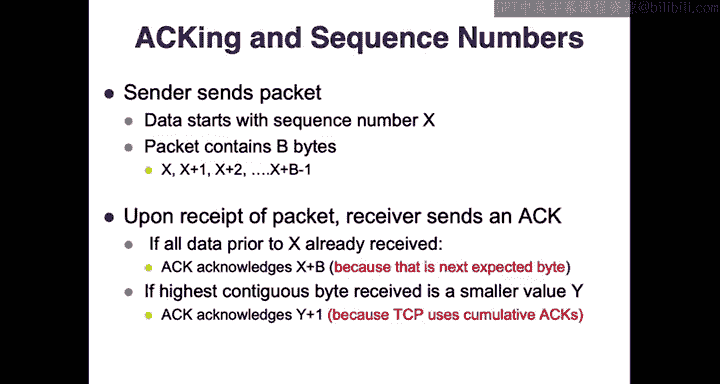

IP层根据协议字段（值6）将数据包交给TCP模块。TCP模块再根据目的端口号，将数据传递给相应的应用套接字。

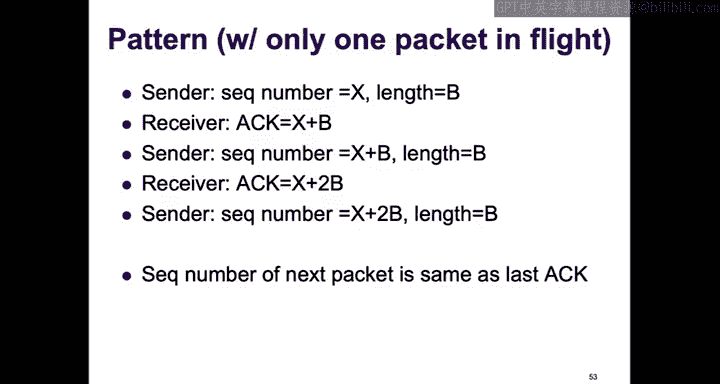

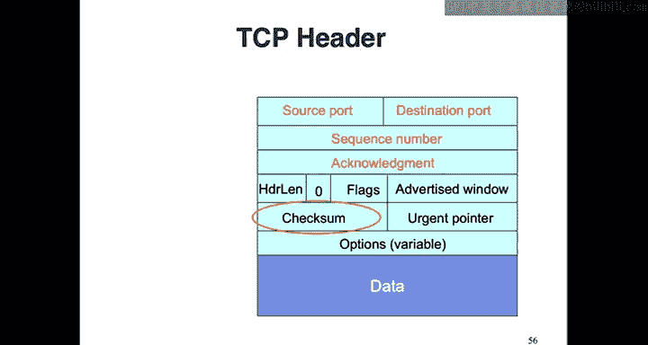

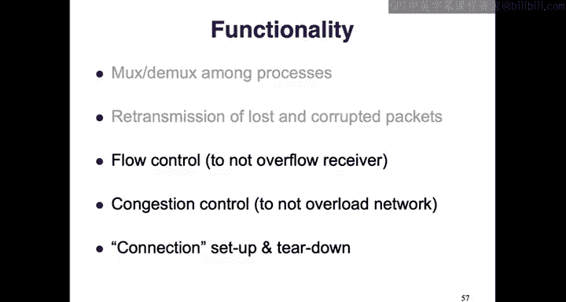

### 可靠性实现

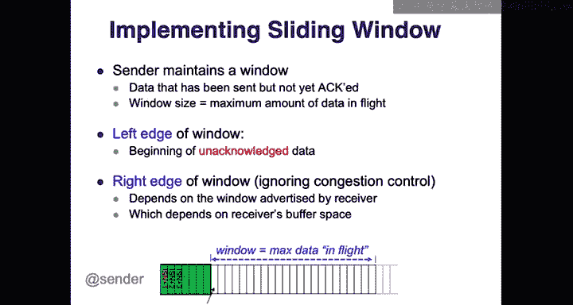

TCP使用我们讨论过的所有可靠性组件，但有其特定设计：
*   **序列号与确认**：基于字节偏移量，使用**累积确认**。
*   **滑动窗口**：发送方维护一个窗口，窗口左侧是已确认的字节，右侧是当前允许发送的最大字节序号+1。窗口大小受限于`min(通告窗口， 拥塞窗口)`。
*   **超时重传**：为窗口中最老的已发送未确认字节设置一个定时器。超时则重传。
*   **快速重传**：如果收到3个重复的ACK，TCP会认为数据丢失，在超时前立即重传。
*   **超时估计**：通过测量样本RTT，动态估算往返时间，并据此设置超时值。

### 流量控制实现

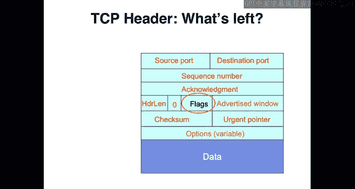

接收方通过头部中的**窗口大小**字段，向发送方通告其当前可用的缓冲区空间（即通告窗口）。发送方据此调整其发送窗口的右边界，确保不会淹没接收方。

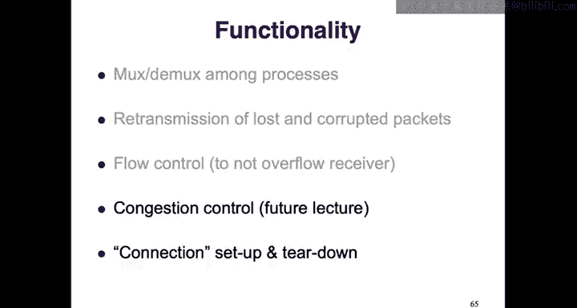

### 连接管理：三次握手与四次挥手

#### 连接建立：三次握手 👐

TCP使用三次握手来建立连接，同步初始序列号，并交换其他参数（如MSS）。

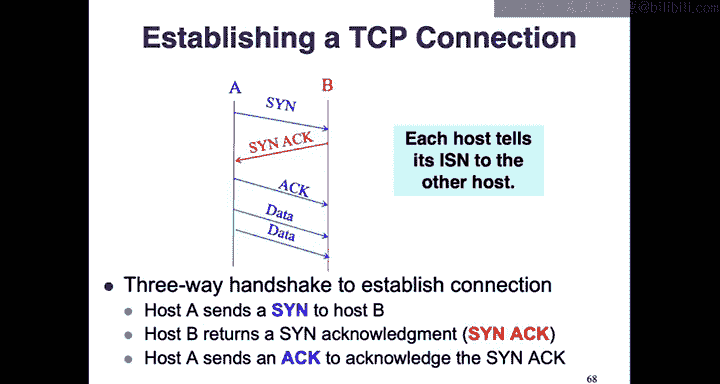

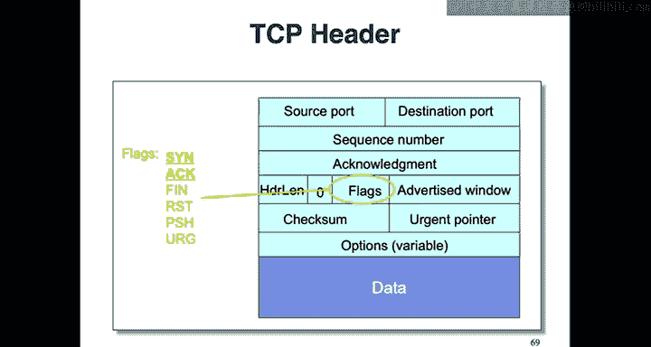

1.  **SYN**：客户端发送一个SYN包（SYN=1）到服务器，并选择一个初始序列号 `seq = ISN_c`。
2.  **SYN-ACK**：服务器收到后，回复一个SYN-ACK包（SYN=1， ACK=1）。该包包含：
    *   对客户端SYN的确认：`ack = ISN_c + 1`
    *   服务器自己的初始序列号：`seq = ISN_s`
3.  **ACK**：客户端收到SYN-ACK后，发送一个ACK包（ACK=1）进行确认：`ack = ISN_s + 1`。

至此，连接建立完成，双方可以开始传输数据。

#### 连接终止：四次挥手 👋

TCP使用四次挥手来优雅地关闭一个全双工连接。

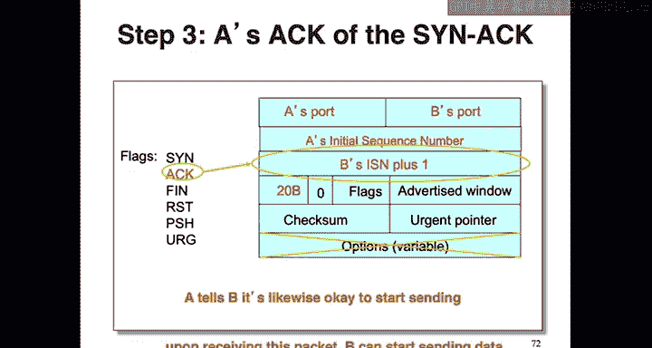

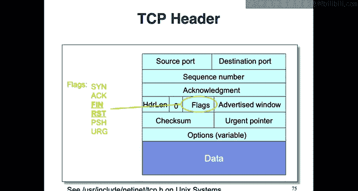

1.  **FIN**：当一方（如客户端）完成数据发送后，发送一个FIN包（FIN=1）。
2.  **ACK**：另一方（服务器）收到FIN后，发送一个ACK包进行确认。此时，从客户端到服务器的连接方向关闭，但服务器到客户端的连接仍然可用。
3.  **FIN**：当服务器也完成数据发送后，它发送自己的FIN包。
4.  **ACK**：客户端收到服务器的FIN后，发送ACK确认。

客户端在发送最后一个ACK后，会等待一个时间周期（2MSL），然后才完全关闭连接，以确保网络中所有残留的旧数据包都已消失。

#### 连接重置：RST

除了优雅关闭，TCP还支持使用RST标志位进行**强制重置**。任何一方都可以发送一个RST包来立即终止连接。这通常用于处理异常情况，例如收到一个不属于任何现有连接的数据包，或者需要立即中止连接时。

### TCP状态机

TCP连接在其生命周期中会经历一系列状态。下图展示了一个简化的TCP状态机（以主动发起连接的一方为例）：

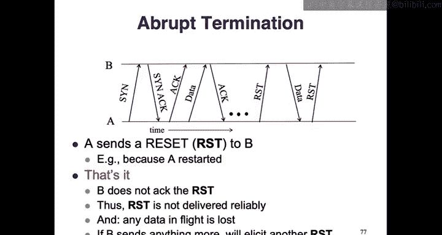

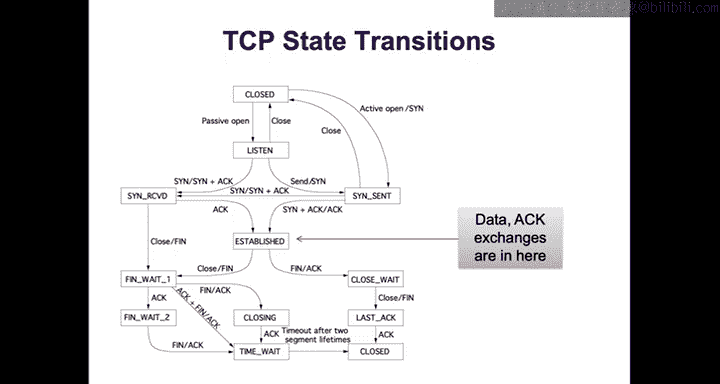

1.  **CLOSED** -> **SYN_SENT**：应用发起连接，发送SYN。
2.  **SYN_SENT** -> **ESTABLISHED**：收到SYN-ACK，发送ACK。
3.  **ESTABLISHED**：在此状态下进行数据传输。
4.  **ESTABLISHED** -> **FIN_WAIT_1**：应用关闭连接，发送FIN。
5.  **FIN_WAIT_1** -> **FIN_WAIT_2**：收到对FIN的ACK。
6.  **FIN_WAIT_2** -> **TIME_WAIT**：收到对方的FIN，发送ACK。
7.  **TIME_WAIT** -> **CLOSED**：等待2MSL超时后关闭。

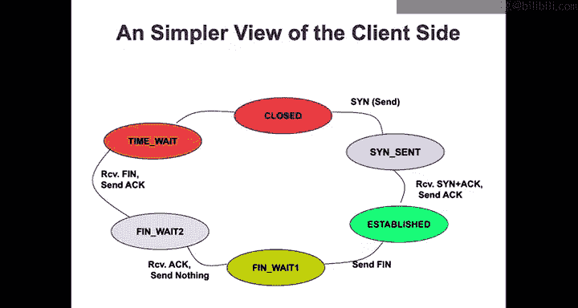

---

## 总结

本节课中我们一起学习了传输层，特别是TCP协议。我们了解到：

*   传输层是应用层和网络层之间的桥梁，提供多路分解、可靠性、抽象转换、流量控制和拥塞控制等服务。
*   TCP提供**可靠的、有序的字节流**抽象，是**面向连接**、**全双工**的协议。
*   TCP使用**端口**进行多路分解，使用基于**字节序列号**的累积确认、滑动窗口、超时与快速重传来实现可靠性。
*   **流量控制**通过接收方的**通告窗口**实现，防止接收方缓冲区溢出。
*   **拥塞控制**通过发送方维护的**拥塞窗口**实现，旨在公平共享网络资源（后续课程详解）。
*   TCP连接的建立和终止分别通过**三次握手**和**四次挥手**完成，并定义了相关的状态机。

TCP是一个经过精心设计、经受住时间考验的协议。尽管面临新的应用场景（如物联网、实时媒体）的挑战，其核心架构至今仍是互联网可靠数据传输的基石。

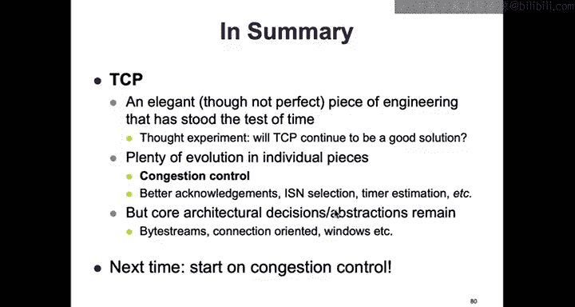

