# 互联网导论：架构与协议｜CS 168：P16：拥塞控制的目标、问题与方法 🚦

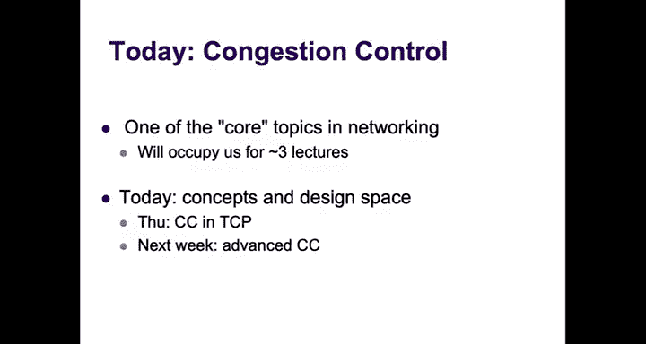

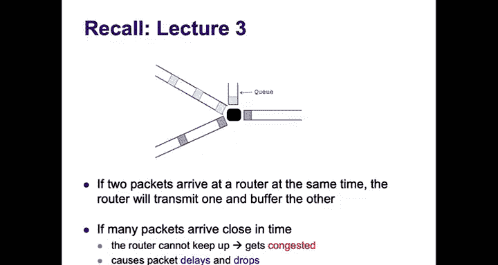

## 概述
在本节课中，我们将要学习网络中的一个核心主题：拥塞控制。我们将探讨为什么网络会发生拥塞，拥塞带来的危害，以及设计拥塞控制方案的基本目标、面临的挑战和可能的解决思路。本节课将重点介绍拥塞控制的基本概念和设计空间，为后续深入理解TCP的拥塞控制机制打下基础。

---

## 拥塞问题回顾
上一节我们讨论了可靠传输，本节中我们来看看网络中的另一个基本问题：拥塞。

当路由器同时收到多个数据包时，它会缓冲一个并转发另一个。如果短时间内有太多数据包连续到达，队列就会堆积，导致数据包延迟增加，最终可能不得不丢弃数据包。这种状态就是网络或路由器经历了**拥塞**。避免进入这种状态正是拥塞控制的目标。

### 为什么需要担心拥塞？
拥塞会显著影响网络性能。下图展示了一个理论模型：将网络视为一个具有特定容量和队列的链路。当网络负载（X轴）增加时，平均数据包延迟（Y轴）会急剧上升。虚线表示链路的容量。

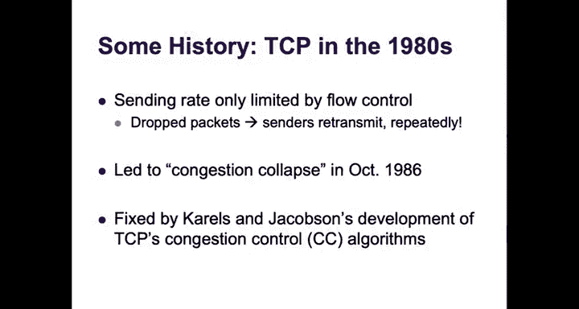

从这个图中我们可以得到两个关键结论：
1.  **性能权衡**：提高网络利用率（接近链路容量）是以增加延迟为代价的。拥塞控制的目标就是找到既能高效利用网络，又不至于导致应用无法接受延迟的“最佳操作点”。
2.  **丢包是延迟的后果**：当你看到丢包时，网络已经处于高延迟的糟糕状态。因此，如果关心延迟，丢包就是一个非常糟糕的信号。

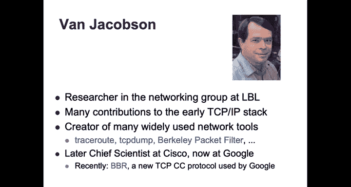

---

## 历史背景：拥塞崩溃
有趣的是，TCP在早期（70年代末到80年代中期）并没有任何形式的拥塞控制。发送速率完全由上一节讨论的**流量控制**（接收方的通告窗口）决定。旧的TCP版本会在超时时，将整个窗口的数据全部注入网络并持续重传。

在80年代中期，互联网用户和开发者观察到一系列被称为 **“拥塞崩溃”** 的事件。例如，Michael Karels和Van Jacobson观察到，从劳伦斯伯克利实验室到伯克利的吞吐量从32 KB/s骤降至40 B/s，下降了近一千倍。

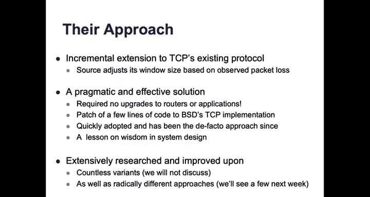

他们发现并修复了几个问题，包括超时估计算法（最初的TCP没有自适应超时估计）。更重要的是，他们意识到随着用户增多，数据源并没有降低向网络发送数据的速率。因此，他们在伯克利Unix的TCP/IP协议栈中引入了一系列算法，即我们现在所说的**拥塞控制**。自那以后，互联网上再未发生过拥塞崩溃。

Van Jacobson的贡献尤为突出，他后来还领导开发了BBR等新的拥塞控制协议，该协议现已用于YouTube、谷歌搜索等大量互联网流量。

---

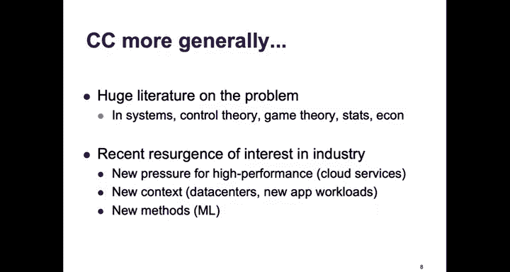

## 拥塞控制的基本思路
他们的方法巧妙而简单，是对TCP已有机制的增量扩展：
*   TCP已有**检测丢包**的机制（超时或重复ACK）。
*   TCP已有**控制发送量**的窗口机制。

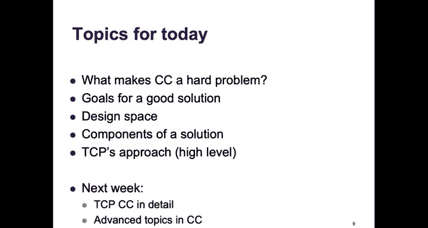

核心思想是：**让发送方根据检测到的丢包来调整其窗口大小**。

这个方案的优点在于：
*   **有效**：该补丁应用后，拥塞崩溃立即消失。
*   **实用**：无需升级路由器或应用程序，甚至只需升级发送方一侧。它只是伯克利Unix代码中的几行修改，因此在几个月内就被广泛采用。

这体现了系统设计的智慧：最好的解决方案往往源于对实际问题的具体理解。Jacobson从复杂的网络反馈控制模型中提取出核心直觉，并用简单的启发式方法（几行代码）实现。

---

## 拥塞控制的复杂性
为什么拥塞控制是一个难题？让我们通过一个例子来建立直觉。

假设有如下网络拓扑和链路容量：

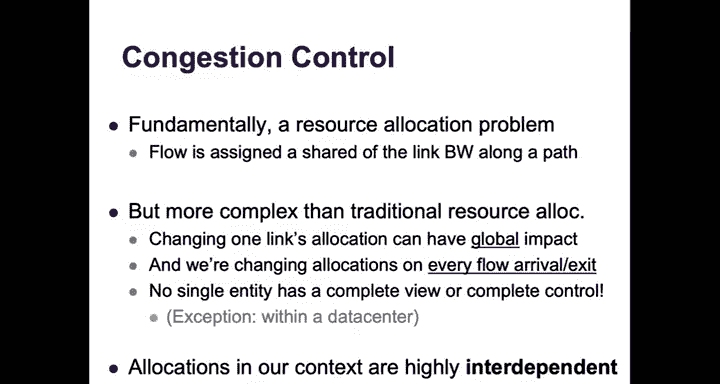

问：主机A应以多大速率发送数据？
答案取决于：
1.  **目的地**：如果发送给C，瓶颈是10 Gbps链路；如果发送给F，则不应超过2 Gbps。
2.  **路由动态性**：如果A发给E，初始路径是10 Gbps。但如果路由发生变化（主机不参与路由，故不知情），新路径的瓶颈可能是1 Gbps，A的速率也应变为此值。
3.  **竞争流**：如果A发往F（速率2 Gbps），此时B开始发往E。两条流共享1 Gbps链路，若公平共享，则A应降至1 Gbps。
4.  **间接竞争**：如果此时G开始发往D。蓝流和紫流在1 Gbps链路上竞争，各得0.5 Gbps。这意味着紫流不能超过0.5 Gbps，从而释放了红流（A到F）的瓶颈链路容量，**红流的速率反而可以增加到1.5 Gbps**。

这个例子说明，一个新流的加入，即使没有直接与我的流竞争资源，也可能改变我应得的带宽分配。

**本质上，拥塞控制是一个资源分配问题**，即我的流在其路径的每条链路上应分配多少带宽份额。但这比传统的资源分配（如CPU调度）复杂得多：
*   **高度相互依赖**：更改一个流或一条链路的分配，会对网络中所有流产生连锁反应（全局影响）。
*   **动态变化**：每当有流加入或离开系统时，分配就需要改变，且发生频繁。
*   **无集中控制**：没有一个实体能掌握完整的拓扑或流信息，也没有实体能控制网络中的所有流。

---

## 拥塞控制的目标
在开始设计之前，我们需要明确一个好的拥塞控制方案应达到什么目标。

从**资源分配结果**的角度看，我们希望：
*   **高链路利用率**
*   **低数据包延迟和丢包率**
*   **流之间的公平共享**

我们知道无法同时实现完美利用率和零延迟，因此需要在目标之间寻求良好的权衡。

从**系统解决方案**的角度看，我们希望方案是：
*   **可扩展的**
*   **分布式的**
*   **自适应的**

这些都是互联网环境所要求的。

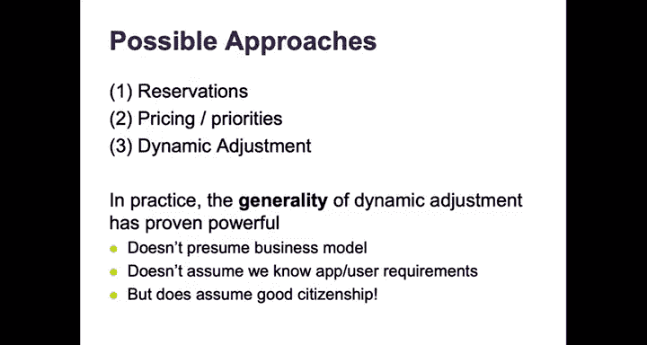

---

## 设计空间：可能的方案
以下是几种可能的拥塞控制思路：

### 1. 无控制
发送方随心所欲地发送。对于单个发送方，TCP的可靠性可以保证数据最终送达，但这会浪费大量带宽（非瓶颈链路），不是可行的方案。

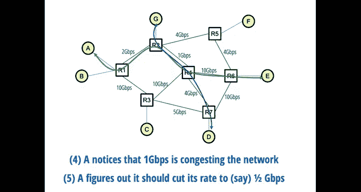

### 2. 预留资源
在流开始时，通过网络预留带宽。这可以避免拥塞，但正如之前课程讨论的，这不是互联网采用的方式（尽管某些场景如ISP会进行资源预留）。

### 3. 基于价格或优先级
经济学家认为这是最优方案：将带宽视为稀缺商品，通过定价调节需求。例如：
*   **优先级**：高优先级用户（付费更多）的流量在网络过载时优先通过。
*   **拥塞定价**：根据网络拥塞程度向用户收费（例如，观看Netflix时按需付费提升体验）。

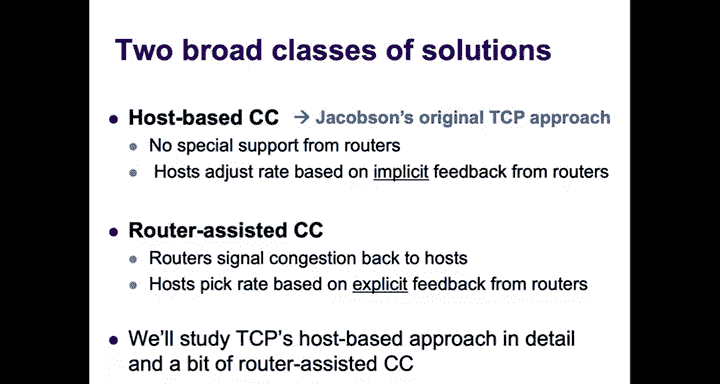

虽然随着城市交通拥堵收费和数字微支付的兴起，这个想法不再显得荒谬，但它需要相应的商业模式和支付模型，在互联网早期不存在，至今也未广泛部署。

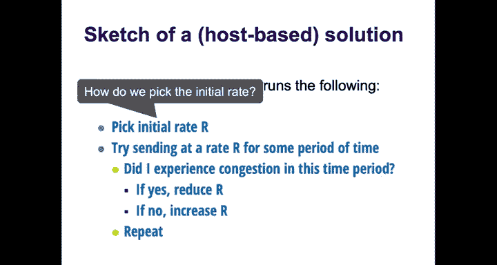

### 4. 动态调整（胜出方案）
主机动态学习网络当前的拥塞程度，并相应地调整发送速率。这是我们之前直觉判断A应该发送多少速率时所隐含的方法。

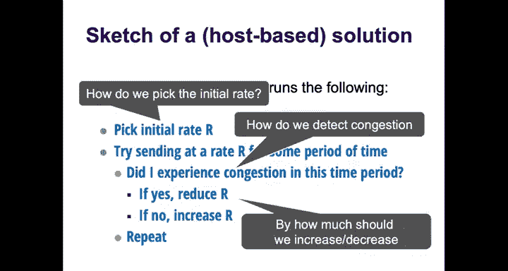

**动态调整方案在实践中胜出**，也是所有现代拥塞控制方案的工作原理。它通用性强，不预设商业模式或应用需求。但它假设了 **“良好公民”行为**，即发送方会“做正确的事”并降低速率以共享带宽。经济学家认为这有违常理，但互联网至今主要依靠非恶意参与者来维持这一状态。

---

## 动态调整方案详解
我们将深入探讨动态调整方案，这也是TCP采用的路径。

### 核心思想
每个源独立运行以下算法：
1.  以某个速率 R 向网络发送数据一段时间。
2.  在此期间结束后，询问：**我是否经历了拥塞？**
3.  如果经历了拥塞，则在下一周期**降低**速率；如果未经历，则在下一周期**提高**速率。
4.  重复此过程。

这引出了解决方案的三个核心组件：
1.  **如何选择初始速率？**（发现阶段）
2.  **如何检测拥塞？**（检测阶段）
3.  **如何对拥塞做出反应？**（即提高和降低的幅度是多少？）（调整阶段）

---

### 组件一：检测拥塞
在基于主机的方案中，我们依赖来自网络的**隐式反馈**。主要有两种信号：

#### A. 基于丢包（TCP主要采用）
*   **优点**：
    *   信号明确：丢包通常意味着路径上有路由器拥塞。
    *   工程便利：TCP中检测丢包的机制（超时、重复ACK）已存在。
*   **缺点**：
    *   **延迟代价**：丢包发生在高延迟之后，在检测到拥塞前已经历了性能下降。
    *   **二进制信号**：只告知“拥塞了”，不告知“应发送多快”。
    *   **非拥塞性丢包**：无线链路中，干扰可能导致丢包，但这并非拥塞信号。
    *   **与重排序混淆**：TCP使用累积确认，将多个重复ACK视为丢包。如果网络数据包重排序，会导致TCP误判为丢包并错误降速。这限制了网络设计（如数据中心中利用多路径负载均衡）。
*   **丢包类型**：TCP中，丢包检测有两种方式，暗示了拥塞严重程度不同：
    *   **重复ACK**：暗示轻度、孤立的丢包。
    *   **超时**：暗示严重拥塞（大量数据包或ACK未能通过）。

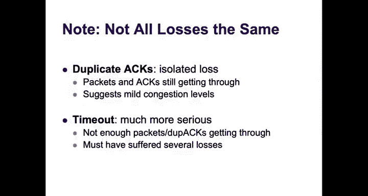

#### B. 基于延迟
*   **思路**：发送方观察估算的往返时间（RTT），如果RTT增加，则怀疑发生拥塞。
*   **历史**：长期被认为难以准确使用，因为延迟信号噪声大，且需要知道“正常”延迟基准。
*   **现状**：谷歌的BBR协议基于延迟，并证明在大规模数据样本下是可行的。它仍存在争议，但是一个重要的新方向。

---

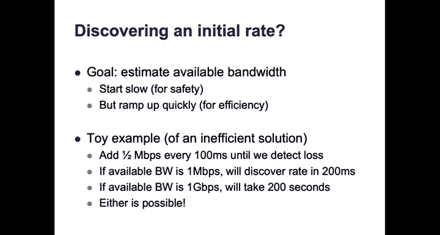

### 组件二：发现初始速率
目标是估算路径上可用的带宽。
*   **要求**：
    *   **安全性**：从低速开始，避免立即造成拥塞。
    *   **快速收敛**：需要迅速攀升到可用带宽附近，否则会浪费时间和带宽。
*   **线性增长的不足**：如果可用带宽范围很大（如从1 Mbps到1 Gbps），线性增长太慢。
*   **TCP的解决方案：慢启动**
    *   **名称误导**：它启动慢，但增长快。
    *   **过程**：从一个很小的值开始，然后**指数级增长**（例如，每轮加倍），直到检测到丢包。此时，发送方得知上一个未引起丢包的速率是安全的。

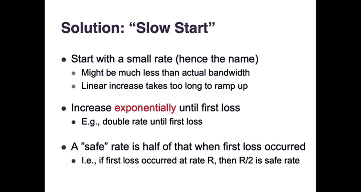

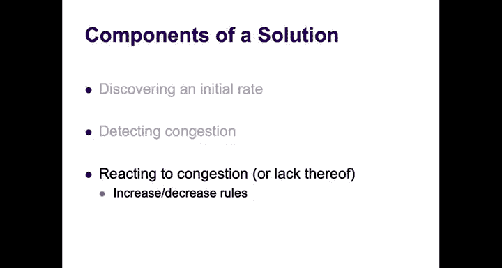

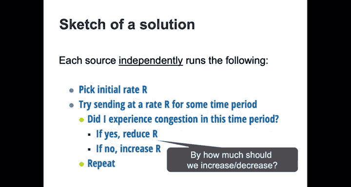

**示例**：从100 Mbps开始 -> 200 Mbps -> 400 Mbps -> 800 Mbps -> 1.6 Gbps（此时检测到丢包）。则安全速率被认为是800 Mbps。

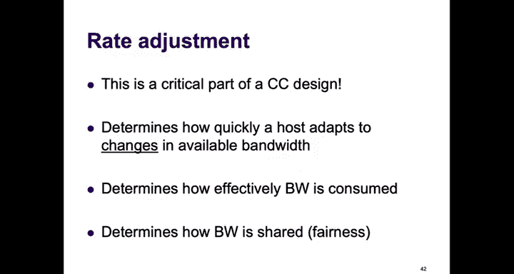

---

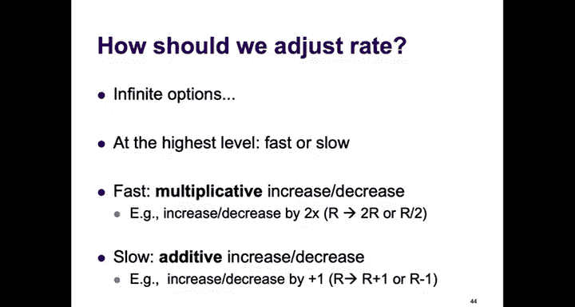

### 组件三：调整速率（增/减窗算法）
这是拥塞控制最关键的部分。调整的速度和幅度决定了：
*   **效率**：多快能充分利用可用带宽。
*   **公平性**：新流加入后，多快能达到公平共享。

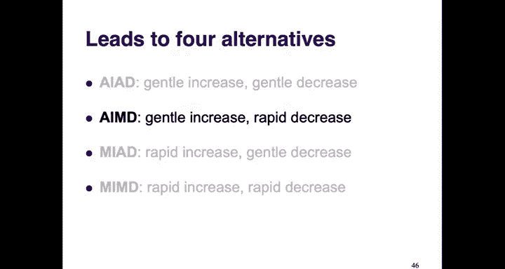

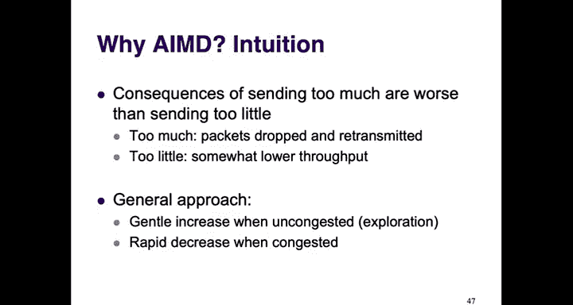

调整有两种基本方式：
*   **加性增/减**：增加或减少一个常量（如 +1 Mbps, -1 Mbps）。
*   **乘性增/减**：按比例增加或减少（如 翻倍，减半）。

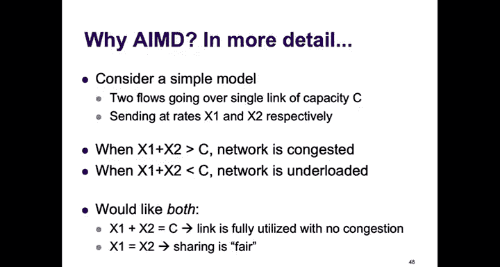

由此产生四种设计选项：
1.  **AIMD (Additive Increase, Multiplicative Decrease)**：加性增，乘性减。
2.  **AIAD (Additive Increase, Additive Decrease)**：加性增，加性减。
3.  **MIMD (Multiplicative Increase, Multiplicative Decrease)**：乘性增，乘性减。
4.  **MIAD (Multiplicative Increase, Additive Decrease)**：乘性增，加性减。

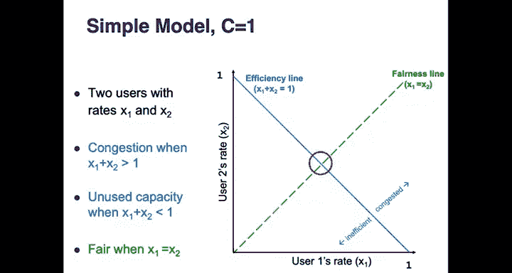

直觉上，我们倾向于“温和探索，遇拥塞快速撤退”的策略，即 **AIMD**。

---

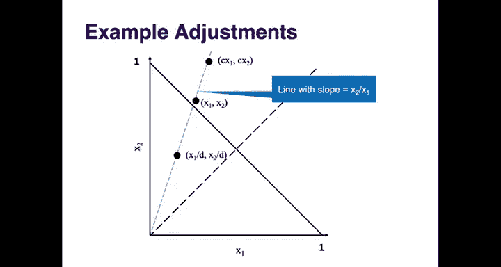

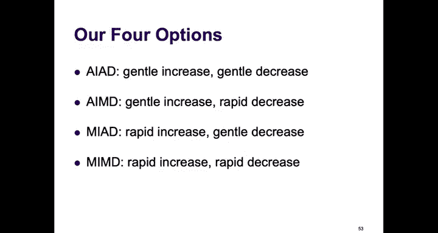

#### 为什么是AIMD？—— 效率与公平性的收敛
我们通过一个简单模型来分析。假设一条容量为 C 的链路上有两个流，其速率分别为 x1 和 x2。
*   **目标**：
    *   **效率**：x1 + x2 = C（充分利用链路）。
    *   **公平**：x1 = x2（公平共享）。
*   **图形化分析**（设C=1）：
    *   **效率线**：x1 + x2 = 1（蓝色线）。线上点效率最优。
    *   **公平线**：x1 = x2（绿色线）。线上点绝对公平。
    *   **理想点**：效率线与公平线的交点。

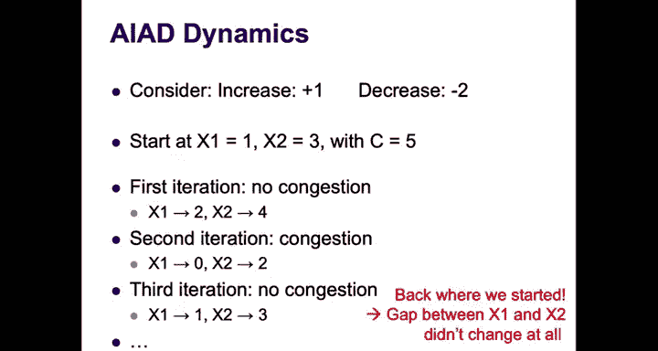

分析四种算法在图形上的移动轨迹：
*   **AIAD**：增减都沿斜率为1的直线移动。在效率线上下振荡，但**从不**向公平线移动，无法收敛到公平。
*   **MIMD**：增减都沿从原点出发的射线移动。同样在效率线附近振荡，但**从不**改变与公平线的角度，无法收敛到公平。
*   **MIAD**：增沿射线，减沿水平/垂直线移动。结果会**极度不公平**，导致一个流获得零带宽，另一个流独占所有带宽。
*   **AIMD**：增沿斜率为1的直线（加性增），减沿射线（乘性减）。每次“减”操作后，“增”操作会沿着不同的线（更靠近公平线）进行。经过数次振荡，操作点会**收敛到效率与公平的交点**。

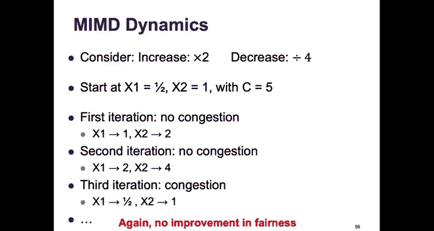

因此，**AIMD是唯一能同时实现效率与公平收敛的算法**。

---

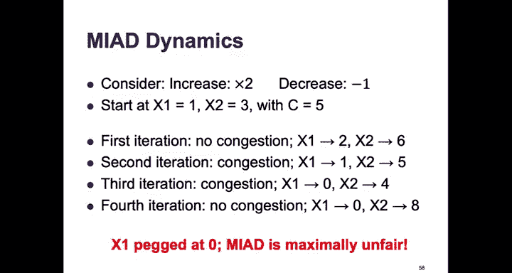

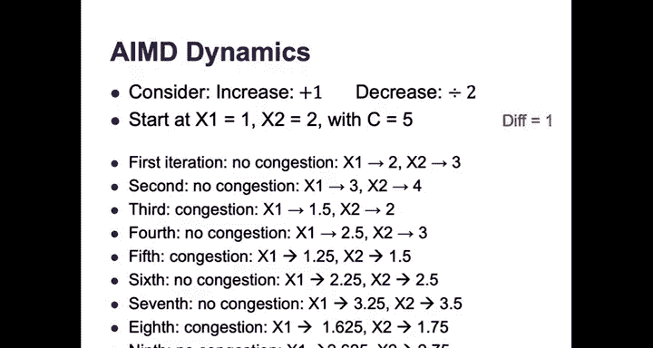

## TCP拥塞控制方案概览
综合以上组件，我们得到了TCP拥塞控制的基本轮廓：
1.  **初始速率**：采用**慢启动**。从很小窗口开始，指数增长（每RTT窗口加倍）直至首次丢包。
2.  **拥塞检测**：主要依据**丢包**信号（超时或重复ACK）。
3.  **速率调整**：采用 **AIMD** 策略。
    *   **无拥塞时（加性增）**：每RTT将拥塞窗口增加1个MSS（最大报文段长度）。
    *   **检测到拥塞时（乘性减）**：将拥塞窗口减半。

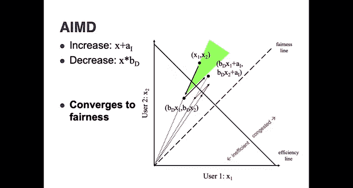

### TCP的“锯齿”行为
一个TCP连接的吞吐量随时间变化会呈现典型的“锯齿”状：
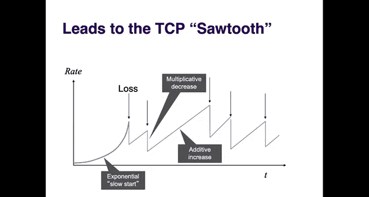
*   **慢启动阶段**：指数增长。
*   **首次丢包**：窗口乘性减半。
*   **拥塞避免阶段**：进入线性增长（AIMD的加性增），直到再次丢包，窗口再次减半，如此循环。

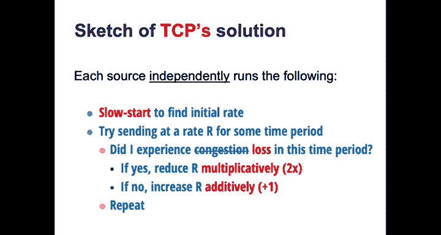

---

## 总结
本节课中我们一起学习了拥塞控制的基础知识。我们了解到：
*   拥塞是由于网络资源需求超过供给导致的，会引起延迟增加和丢包。
*   拥塞控制本质上是一个分布式、动态、相互依赖的资源分配难题。
*   一个好的拥塞控制方案需要在**效率**（高利用率）、**公平性**（流间公平共享）和**低延迟**之间取得平衡。
*   TCP采用的**动态调整**方案是主流，其核心是**AIMD**算法，并结合**慢启动**和**基于丢包的拥塞检测**。
*   AIMD被证明是能同时收敛到效率和公平的唯一一种基础调整策略。

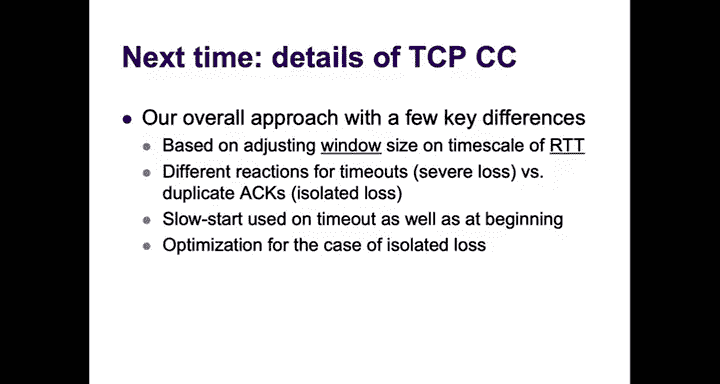

下一讲我们将深入TCP拥塞控制的实现细节，包括如何用窗口而非速率来表达这些概念，以及针对不同丢包类型（超时 vs. 重复ACK）的不同反应机制。