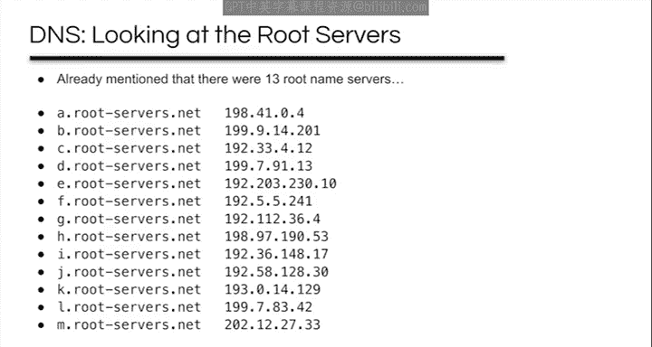
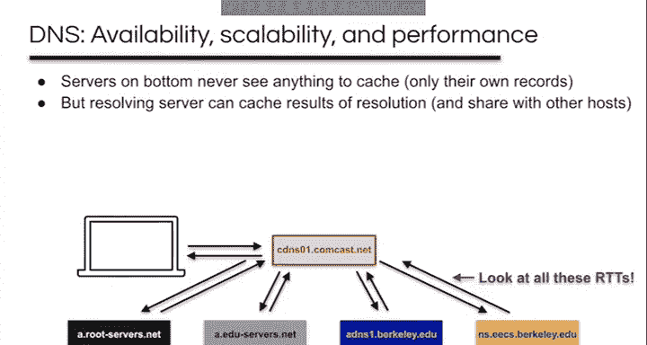
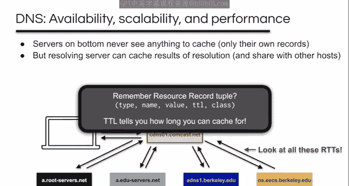
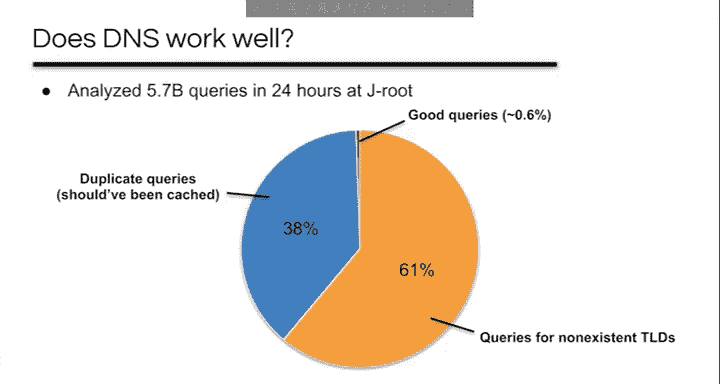
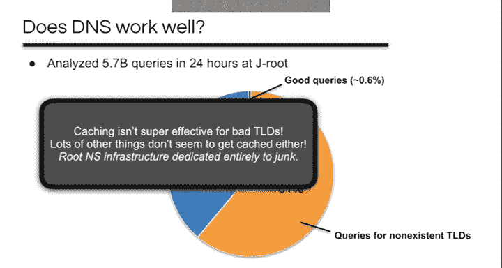
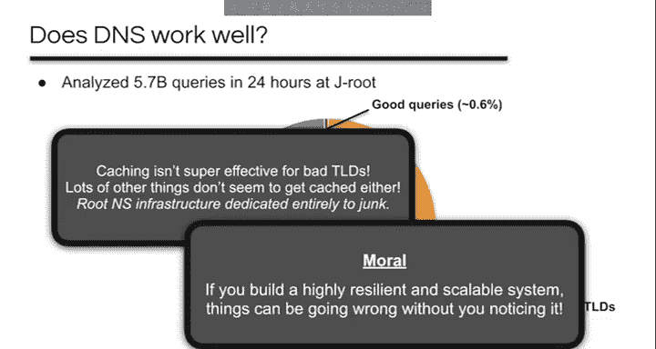
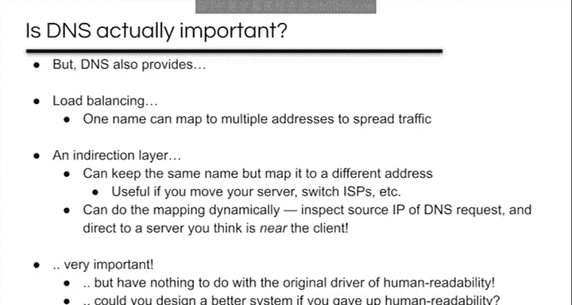

# UCB《互联网导论：架构与协议｜CS 168 Introduction to the Internet： Architecture and Protocols》 - P20：-19- DNS II - GPT中英字幕课程资源 - BV1VcrrYUEL5

So let's continue our discussion of DNS。 and specifically。

 let's talk about some requirements for the system。

The first is that we want it to be highly available。

 We have this expectation that the internet would be difficult or impossible to use without it。

 so we never want DNS to be down。DNS should also be highly scalable because we have this expectation that it'll be used heavily。

 it needs to be capable of dealing with a large number of domain names， a large number of requests。

 a large number of organizations and so on。Finally， DNS should be highly performant。

 it's got to go fast because of our above expectations。

So three challenges are all kind of intertwined and to a pretty large extent we address all of them with the same basic approach。

 which is that we add more servers， but we do this in several different ways and I'm going to talk about four of them。

So the first two I already mentioned and the very first one is that the name servers for different domains are independent。

 this means that just because Berkeley。edduu's name servers fail， that doesn't mean that。

 for example， Matt Holylyoke is affected and similarly if the doedduu top levelvel domain servers were disrupted。

 this wouldn't impact all the docom domains。So basically。

 this is just saying that there's not just one server。

 but they're independent servers for different parts of the DNS hierarchy。

The implication on availability here is that the fates of different parts of the hierarchy aren't tied together。

As far as scalability， this means that no one server needs to store information about all domains。

And from a performance standpoint， this means that even if some domains are getting hammered with requests and their performance is affected。

 performance elsewhere shouldn't be especially affected。

The second way I mentioned earlier is that all domains have at least two name servers。 For example。

 there are four authoritative name servers for Mount Holylyoke。

So rather than have one server per domain， we've got more than one。

 The availability implication is that if one server crashes， you've got others to fall back on。

 and the implications for scalability and performance are just that queries get spread across them。

 which hopefully evens out their behavior。The third way that we add more servers。

 we see in the context of the root name servers， and I mentioned earlier that there are 13。

 and this is them as of March 2020。

And the text has a map， something like this that purports to show where they're all located。

But you might ask yourself， you know， there are 4。5 billion Internet users are 13 root name servers really enough。

 and I think probably not。 The Jroot server alone got an average of 66000 queries per second on April of 2018。

 If you make a bunch of assumptions， I think that comes out to 15 microseconds per query。

So what's the trick here， How does this actually work？

The trick is that there are actually 162 duplicates of the J rootot server in different places and adjusting the math。

 I think that comes out to about two milliseconds per query。

 which is certainly a lot more comfortable。Across all the routes。

 there are actually about  a00 root servers as of 2020。And so here are where a bunch of the JSs are。

 and you can see that there's some in North America， South America， Europe， Asia， Australia， Hawaii。

 and so on， they're really all over the world。I think especially misleading on this map is the E route。

 which it shows in Mountain View， California。 The E route is run by NASA Ames。

 which is indeed in Mountain View。But there are actually 300 something servers spread out all over the world。

 The Eroot is actually the largest of all of the roots。 So you can see there are replicas in Ghana。

 Canada， Mexico， Mongolia， Korea， and indeed in Mountain View。

 But that's really just one place of many。😊，So for each of the lettered name servers。

 it's duplicated in many different places， but all of those duplicates have the same IP address。

 The idea here is that the same address is just advertised through BGP at each duplicate and BGP routes will always just deliver to the closest one for whatever notion of distance your BGP policies represent。

This way of using BGP is called anycast because it delivers packets to any one of the destinations。

 Everything we've talked about up until now is Unicast。

 which is delivery to one singular destination。The cool thing about anycast is that it just kind of works。

 There is no special changes to routing that were required to do this。

 You could imagine taking your code from Project 1 and just putting multiple hosts with the same address in an topology。

 and it should just do the right thing， right。😊，So any cast just works and it seems like a pretty powerful idea。

 so does it have any drawbacks， so are there reasons why we don't use this for all sorts of services。

 pause the video for a second and think about it。So here are a couple of drawbacks。

The first is that has a similar problem as multihoming in that any cast prefixes can't be aggregated。

 In fact， at the routing level， it's almost indistinguishable from multihoming， right。

 So you probably don't want to use this for everything， but for something really important like DNS。

 it makes sense。Secondly， it doesn't always play nice with TCP。

If your BGP routes change or even worse if they're unstable， or if a client moves。

 like because it's a cell phone or something， that may mean that your connection ends up on a different server that doesn't know anything about it。

 you know you haven't established the TCP connection with that server。Luckily。

 since DNS is generally just these simple two packet UDP exchanges， this isn't a problem for DNS。

So this is actually only a partial list of implications， but from an availability of perspective。

 this is great。 even if the network is partitioned。

 BGP should just automatically switch you over to a reachable server。From a scalability perspective。

 this further spreads load across more servers。And from a performance perspective。

 this is likely to reduce your RTT to the root servers because BGP shouldn't be routing you to one on the other side of the planet。

So the fourth way of improving availability and scalability and performance， Well。

 I said all of them were about adding more DNS servers and maybe this one I was cheating a little bit。

 but the basic idea here is to use one of our favorite CS tricks for performance。

 but there is a relationship to added servers here。So if you remember on Tuesday。

 we did an example of a DNS lookup that looked something like what you see here。

A host sends a recursive query to a resolving server。

 and then the resolving server does this iterative querying of all the other required name servers。

And like， you know， look at all these RTTs， this is five round trips for this query。

So how can we speed it up？I'll giveive you a second to think about it。Well， if you've taken 61C。

 this is something you should know well， we can use caching。So。

The first thing to notice is that the servers on the bottom here don't really have anything to cache。

 They never see any replies except their own， and there's no point cashing their own replies。

The resolving server， however， can cache everything it sees and assuming that it's serving more than one host。

 it can then share those results with everyone else。

 So you can imagine that things like Google are basically always in a cache and you almost never have to actually perform the iterative query to look it up。

Now， if you remember the resource record Tple， the TTL value and it tells you how long you can cache the results for。

Note that you can actually insert caching servers just about anywhere in the hierarchy to improve performance。

They don't even necessarily have to service recursive lookups like a resolving server。

 they can just answer queries out of the cache or forward them to some other server if they're not in the cache。

And finally， note that the hosts themselves can also cache results。

And so the implications of adding caches include from an availability perspective that even during some sort of a hiccup。

 like when BGP is transiently unconverged， common queries can still be served out of the cache。

From the scalability side， you can see how caches can reduce load on other servers。

And from a performance implication， first of all， they remove the need to do multirTT lookups for common queries。

 and if you put a cache close to clients， which is often the case with resolving servers。

 this can reduce the RTT to the server。So to sum up， we add more servers to get better availability。

 scalability and performance。 We looked at four different ways of doing this and to sort of quickly sum up the general thrust of the implications。

 If you have more servers， it's likely one is close to you， so you get a better RTT。

 we saw this both with any cast and with caches。Any particular server is less likely to be slow due to being heavily loaded。

You get good availability because the data you want should be replicated in several places and the amount of data that needs to be stored on any particular one is generally lessened。

And so that wraps up discussion of the entwined issues of availability， scalability。

 and performance in DNS。So let's close out our discussion of DNS with a little bit of skepticism。

DNS is generally presented as a vital aspect of the internet that we couldn't do without。

 but it never hurts to take a step back and ask some critical questions like did we name the right things？

Does DNS work well， Does DNS put your privacy at risk， and really is DNS even that important。

A caveat here is that I'm not going to come to too many conclusions。

 and I'm really only going to graze these questions。

 but we can certainly discuss them more on piazza or office hours if you're interested。 That said。

 let's get started by thinking about whether we name the right things。😊。

So if you remember the first DNS lecture， I started by talking about three killer apps of the early internet。

And the first one was Tnet for logging into a remote host and using it interactively。

 This is a huge use case for the early internet。And so you could ask， you know。

 what's the useful thing to name here And obviously its hosts， right。

 the whole point was to connect to a remote host and use it interactively。 And of course。

 that's what DNS generally names hosts。 so good job so far。😊。

FTP was another one for transferring files。Now， files already have names on machines。

 so we already had the file part of the name， and so just tacking on a host name seems pretty reasonable。

But is that ideal， you know， what if you move the file to another machine and what if you want to replicate the file on many hosts so that it's always available。

 even if a host goes down， like， do you ever actually care which host it's stored at。

And so you might wonder if there are better solutions to this problem。

 and there's actually been a fair amount of research on this about tying names。

 not to the hosts where some file resides， but about having names for the data itself and being able to use those names to access the data no matter where it happens to be。

This line of work has gone by a number of names like information centric networking and content centric networking。

 data oriented networking and so on， and the named data networking project is an ongoing NSF funded project that is building the system that works exactly like this。

The third killer app was email。Back when lots of users shared the same computer。

 email existed to send data between users on a single machine。

 you just needed to give their username on that machine。

 so it's sort of easy to see how that would have grown into a system based on the idea of user at host and host names would have seemed like a good fit。

Again， we can ask whether this is ideal， like what if the user moves to a different machine。

 and of course， it doesn't even really work like this in a lot of cases today。

 like when you send an email to someone at Gmail，It's as if you're sending it to a user at a particular host。

 but Gmail is not just a single host at all， it's many， many hosts。So are there better solutions？

I guess the obvious one is maybe you'd be better off with unique names for people independent of their email provider actually designing a system based on this would probably be tricky because you'd want to consider things like accountability and anonymity。

 and you might also try to have it generalized to any sort of person to person application instead of strictly email。

So skipping forward， the next real killer app of the internet was of course， the web。

And a web's URLs are basically a host name， plus a file name。 It's really a lot like FTP。

 The real innovation of the web was less about the mechanics of how it worked than about how it was used。

 And we'll talk about that later。So with that in mind。

 we might think the same idea that I mentioned in the context of FTP would apply。

 maybe the web also indicates that the right thing to name is content and not hosts。

But is the web just about transferring files？I think it's really more about accessing services today in a lot of cases。

 right， banking， Facebook and so on， and modern services certainly aren't tied to a specific host。

 When the web was first built， the host name you type into your browser referred to a specific machine。

 but modern web services are a dynamic army of machine。

 So even though we type a host name like Facebook dot com into a browser we're not really accessing a particular host and making up for that mismatch requires some elaborate workarounds。

 And ultimately， it makes you wonder whether we should specifically be naming services instead of hosts。

 perhaps unsurprisingly， there's also research on this。😊。

So to sort of sum up some thoughts on this particular question of whether hosts are the right thing to have named。

It makes perfect sense for Tnet， and this was a huge use case。

 so it's pretty understandable how we got here。But for files， people and services。

 we end up sort of artificially tying those things to hosts because host names are what we've got。

 If we stepped back， do you think we could design better schemes and mechanisms for these other use cases like a highly available scalable performance system for addressing people no matter where they are and my gut says yes。

 I think this probably has to do with my particular mix of pessimism and optimism。

 the pessimistic part always makes me think we're doing things wrong。

 but the optimistic part always makes me think we can do better。

I think that's one of the things that leads me to like doing research if you feel the same way。

 then maybe you should consider becoming a researcher as well。

Moving on， let's also ask how well DNS works， and that's a pretty vague question。

 but that's on purpose。 researchers have actually been asking different versions of this question for a long time。

 and the specifics of the answer is also vary over time because the way we've used the internet and the scale at which we use it have changed so much over the past almost 40 years that we've had DNS。

 but some of the results have been sort of alarming。

One result that I really liked came from a 2019 paper where they analyzed a day's worth of queries at the JRoot servers approaching 6 billion queries。

 and here's some of what they found。61% ofqueries were for top level domains that don't even exist。

How does that even happen， Are these all typos， Is there some sort of automated system gone wrong that's generating all these queries。

 I don't actually know。38% of the queries were duplicates。 They came from the same source。

 These should have been cached， but weren't。So it turns out that something like 0。

6% were actually good queries。And so I think you can take a few things away from this。

 The first is that caching isn't very effective for bad TLDs。 You actually can cash a failure。

 but apparently people either aren't doing it or they're requesting just totally different bad TLDs so that you'd never get a chance to cash them。

 It seems like the former is possible since it seems like caching in general may not be as effective as you'd want or as it could be。

But I think the big takeaway is that we've built this really robust scalable performance system with replication and any cast and so on。

 and it spends most of its effort on handling absolute garbage。

I guess a silver lining here is that， you know， even given how bad this looks。

 the DNS actually mostly works just fine from your in my perspective。

I also thought we should touch on how DNS impacts our privacy。

 especially because this happens to be a bit of a hot topic at the moment。

So the basic issue is if you're browsing encrypted websites。

 then nobody can see the content that you're communicating， but DNS isn't part of that。

 it's not generally been encrypted at all， and this has made it like trivially easy for ISPs or other third parties to log what sites you visit a few years ago。

 for example， there was a bit of a dust up about how AT&T was selling customer DNS logs to advertisers。

And there's currently two competing projects to make DNS more private through encryption。

 but of course you still need to have someone providing the DNS service for you that you actually trust not to be logging you The company Cloudfllaare has been offering encrypted DNS and Mozilla has now partnered with them to do DNS over HTTPS using the Cloudflare servers by default in Firefox So the question is how far you want to trust Cloudflare since now you're telling them about all the sites you visit。

Paul Vixie， who is one of the major contributors of bind。

 doesn't think much of this particular approach。Anyway， this is continuing to cause a bit of a stir。

 I think if we're lucky over the next few years， something will shake out of all this which will lead to much more secure in private DNS。

 but it's not exactly clear how yet。And so now I want to call into question the whole foundation of DNS。

 and we'll sort of segue that into some sort of an attempt at a conclusion。

So I'm guessing that you use the internet today。And yesterday， and the day before。

But when's the last time you typed in a domain name， and I'm guessing that for a lot of you。

 it wasn't today or yesterday。 And I think that's just because of the way we use the Internet has changed。

You know， if you wanted to get the weather on the internet in 1992， you would tellnet to rainmaker。

 wonderground com。But today you just open up the weather Underground app， you know。

 no typing in an address。Similarly， if you were browsing the web in 1989。

 it's decently likely that you typing a URL。But today。

 the starting point for a lot of web browsing is a search engine。You know。

 the address bar in web browsers is actually more of a search bar today than anything else。

So having addresses that you can remember and type， I'm not convinced they're actually important。

Similarly， I'm not sure it's useful or a good thing to be able to read addresses。

 I think it can provide sort of a false sense of security。It's too easy to mix them up like you know。

Should a website have a dash or not when you read it out to someone。

 are they going to write the dash， are you going to remember to type it if you see one when you're expecting the other。

 will you notice the difference？And， you know， fooling people with URLs is a whole game that attackers play。

 you know， is it safe to take a link to Wells Fargo， you know。

 are you going to see that extra L in there or not？And， you know。

 is it safe to visit Instagram dot com in this particular case， not so much。

 but it's kind of hard to see， especially if you're， you know， not looking for it。

And these aren't even really the trickiest examples。

 so you know you're probably better off searching than you are typing an address。

You may even be better searching than clicking an address。

So to the question of whether DNS is important。DNS maps from host names to addresses。

 for the most part， but people， services and data are in many ways more important than hosts are today。

Additionally， I think human supplied names are way less relevant today than they were。

 The killer apps and usage of the internet have changed。

 and I think today the pathway between a user and the internet is often a web search or an app and not a typed in address。

And it doesn't seem like human readability is that important in general either。

 or at least it shouldn't be with looklike domain names。

 attackers have actually weaponized the fact that you think you know what you're reading when maybe you actually don't。

So I think there are some arguments that the original purpose of DNS doesn't really stand the test of time and that we should be thinking about whether there's something better。

However， we also saw some interesting things that DNS can do。

 like it provides coarse grained load balancings and some resiliency by having multiple A records for a name。

We also saw how it can be a general indirect layer for the internet。

 allowing you to keep the same name but map it to a different address。

 which you might even do dynamically， for example， to send users to a nearer copy of data。

Things like that are pretty important to the internet today。

 and DNS is the tool that we have to do them， but they really don't have anything to do with that original human readable host name driver for DNS。

 which always makes me wonder if we could step back and design a system to solve these problems here independently of the human readable aspect。

 could we do better？And I'll leave you with that to ponder over spring break。 Have a good one。

