# UCB《互联网导论：架构与协议｜CS 168 Introduction to the Internet： Architecture and Protocols》 - P22：-21- Ethernet, End-to-End Operation.2020 - GPT中英字幕课程资源 - BV1VcrrYUEL5

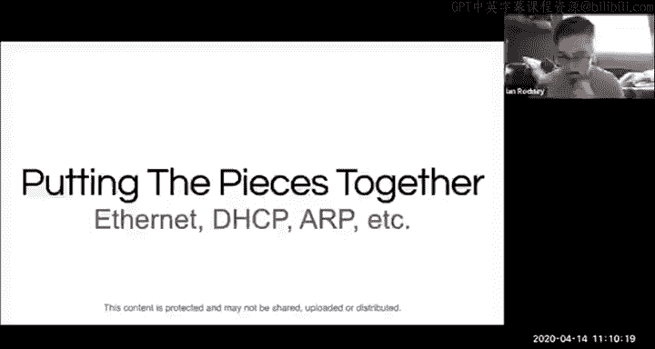

All right， well， then in that case。I think it's time to start。So good morning， everybody。Let's see。

 starting out with。A little bit of today in internet history as usual。22 years ago。

 the Netflix website was launched。At the time， they had a whole 925 movies which you could order on their website。

U， and they emailed you or rather they mailed you the movie on DVD。

 they didn't actually start streaming for another nine years。嗯。A year after launching their website。

 they tried to get blockbuster to buy them， which didn't happen。嗯。

I imagine a number of people have kicked themselves over that， you know， last year Netflix netted。

 you know， coming up on$2 billion blockbuster meanwhile has。One remaining store in Bend Oregon。

 or at least they did as of a few months ago， I hope they're doing okay under present circumstances。

 but don't actually know。嗯。But so moving on。Lecture today we're primarily going to be trying to put some pieces together to give sort of a holistic view of how a bunch of stuff works together and to get there we're going to answer some sort of lurking questions。

So in the past we've talked a bunch about L3 and specifically about IP and we've talked about you common routing approaches both at the intratro domainomain and intradomain levels。

 we've talked about IP addresses， you their structure and our properties with aggregation and so on and we've talked some about L2 mostly with a bias towards Ethernet and you know again we've talked about some routing approaches that are used you know Li state is used in L2 routing sometimes and we've talked about learning switches and span entry protocol which are very common in ethernet traditionally and are a bit of a different beast not even always classified as routing but we classifiedify them as routing。

On the other hand， I don't think we talked about ethernet addresses at all。

 so today we're going to fix that。😊，And we're going to fill in some other gaps， you know， so again。

 we're going to have this sort of bias towards Ethernet and IPV4。😊，There are generally。

 you know similarities with other L2s and L3s like you know Wifi as an L2 is similar in a lot of ways to Ethernet and IPB6 in a lot of ways is similar to IP4 So on Ethernet we're going to talk about addresses we're going to talk about the history of Ethernet。

And then going to kind of bring it around and talk about modern Ethernet。😊。

And then we're going to talk about how L2 and L3 really fit together， for example。

 we know that there's routing at L2 and at L3 and some of you may be wondering。

 you know when we do one and when we do the other and hopefully we're going to clarify that today。😊。

We'll also talk about two protocols mostly relating to addresses， which are ARP and DHCP。

And then we'll do an example where we see a whole lot of pieces， both old and new。

 sort of working together。Um， if there's time， we'll finish up with a discussion of network address translation。

 but we're definitely not going to have time。Um so。Let's talk about Ethernet， you know。

 start with like， you know why so much focus on Ethernet in this class and the answer to that is just because it's huge it's it's used all over the place it's a super common L2 technology。

 it's been around for a long time and it's still totally relevant today。

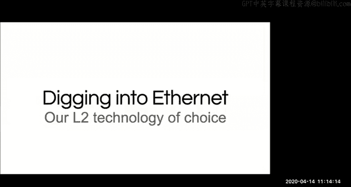

But before we get into it， let's talk about this guy， Norman Abramson， and so in 1968。

 he'd recently left California and become a professor at the University of Hawaii。

Before that he'd been at Stanford and I'm not sure if he was part of the Berkeley faculty。

 but I think he at least taught some classes at Berkeley。

 but at one point he went on a trip to Japan and on the way he stopped over in Hawaii for a couple days and while he was there。

 he got the bug for surfing and so shortly thereafter he got a position at the University of Hawaii which is on Oahu。

And so at the University of Hawaii on Oahu， they had a computer， an IBM 360 mainframe。

 a famous computer， and they wanted to allow access to it from people around Hawaii on other islands。

 I think mostly on Mauui and around Oahu， but maybe some of the other islands too。

And his solution was to build this thing called alohaNe。

 which is a really torturous acronym for additive links online Hawaii area。

 and while the system was like definitely tuned to the specific problem they were facing its design has been hugely and perseveringly influential。

 it's still really relevant today， the kind of aloha techniques are used in many。

 many current wireless devices。😊，And so we'll come back to Aloha in a second。

 but first I want to talk about this idea of shared media。

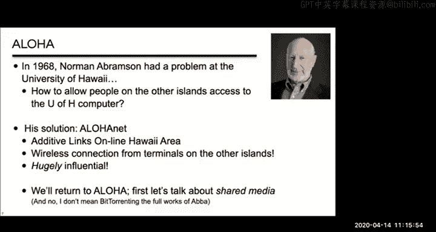

So in a radio network， all the nodes are utilizing a shared medium。

 that medium being the electromagnetic spectrum in some area。😊。

And because the medium is shared transmissions from different nodes may interfere or collide with each other and when that happens it's going to garble the communication it's like if two people are talking at once it becomes hard to make out what anyone is saying right so we need a system for allocating the medium to everyone that wants to use it and we can call that system a multiple access protocol。

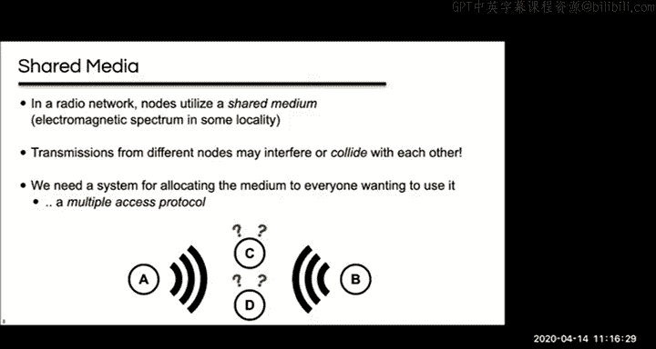

So there are lots of ways a multiple access protocol can work。

 I'm certainly not going to give an exhaustive list， but I'll list some of them。

And so one way is that you can divide up the medium by frequency like so every node gets its own frequency to transmit on。

Sometimes this may be a great solution in many situations it's not if your traffic is bursty。

 for example， then like a lot of your frequencies may be idle a lot of the time and since there's only so much like useful electromagnetic spectrum to go around。

 this is sort of unfortunately wasteful。😊，Another way is to divide it up by time and there are several ways of doing this for example one is to divide time into fixed sized slots and each sender gets their own slot and you know I think this is similar to a system we talked about in lecture to all the way back for doing reservations but ultimately this has。

😊，Similar drawbacks to the previous approach， like both of them sort of work on this idea of like a fixed partitioning of the medium。

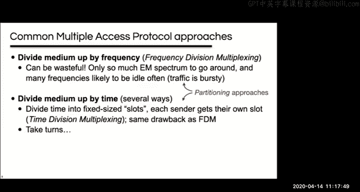

So a different approach are turn taking approaches。

And so like one turn taking approach is a polling protocol where there's some kind of coordinator that decides who gets to transmit at a particular time and this is sort of like Congress or something you know where you know you have a chair who's like the chair recognizes the senator from California and you know gives them a chance to speak and you know they may speak and then when they're done。

 you know the coordinator will ask someone else and then that someone else will have an opportunity to say something and so like Bluetooth I think for example basically works this way。

嗯。Another turn taking approach is token passing and so in this approach there is like a virtual token which is passed around and only the one that's holding it can speak or transmit and so this is similar to like the talking stick approach used famously by some of the people native to the Northwest of North America and it's also used by a local network technology a onetime competitor of Ethernet called IBM token Ring。

 it's also used by a protocol called FDDI which is used with fiber optic networks。

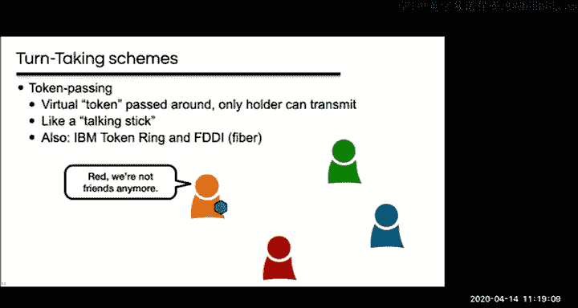

So you can divide up the medium by taking turns through pollen or token passing， for example。嗯。

There's also random access methods and this is what was pioneered by Aloha and is used in everything else that we'll talk about today。

Yeah。So giving me back to Aloha， Aloha had a big node on Oahu， this is where the big transmitter was。

 it's where the computer actually was and we'll call it the hub。

 it actually had a clever Hawaiian name。And then there were remote nodes spread across Hawaii。

 like I said， I think most of them were in Oahu and Maui， I think at the peak。

 I think maybe there was something like 40。And Aloha used two different frequencies。😊。

So only the hub transmitted on one of the frequencies and all of the mos received this。

 but since there was only one transmitter， there's no chance of collisions。And。

All of the remotes transmitted on the other frequency。

So these transmissions could collide and to deal with the collisions。

 they used a random access scheme。I'm about to explain how the random access scheme works。

 but is everyone clear on the context here and would anybody like me to repeat any of this？All right。

 so moving on。So I'm going to describe the pure Aloha random access scheme。

 there is a notable variation called slotted Aloha， but I'm not going to talk about it。

 but it's pretty similar。😊，And so the idea here is pretty simple if one of those remotes has a packet。

😊，It just sends it whenever there's no coordination between the remote sites。

And when the hub successfully receives a packet。It sends an acknowledgement。And if。

Two sites happen to transmit at the same time， then there's going to be a collision。

And the hub will have gotten garbled packets， and so it won't send that acknowledgement。

And so if a're remote doesn't get the expected acknowledgement。

Then it's going to wait a randomized amount of time， and then it's going to retransmit。

The fact that the time is randomized is super important。

 like you know if all the nodes waited the same amount of time， then they just collide again。

 but by varying the amount of time， then the chance of a collision on a retransmission is lessened。

And。So that's it， it's it's super simple， but it's also kind of ingenious， I mean。

 this is not how people thought about doing radio transmissions before before this point。

So it was kind of a breakthrough conceptually， anybody any questions on the Aloha protocol so far？

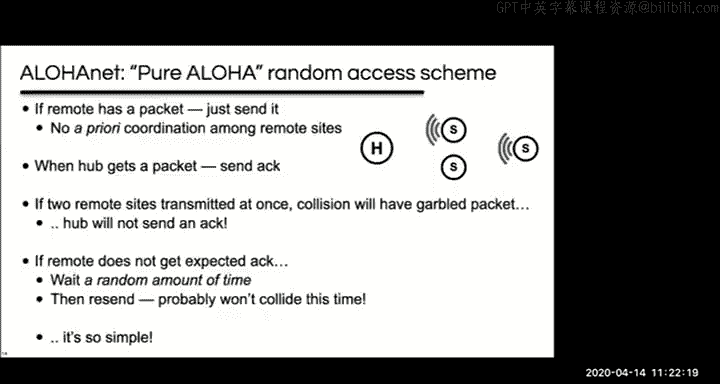

All right， so maybe you're thinking that this all sounds great。

 but aren't we supposed to be talking about ethernet which of course is wired and not wireless and yes you're right but we actually already are but before I really start。

😊，You know， tying it into Ethernet， I do want to share a tale about Alohannet because it's just too good。

Um， so alohanet was connected to the aRPpant， the the precursor of the internet。Way。

 way back very early on in like 1972 or 1973， and a story that's told about this is that it's because Nor Abramson was at a meeting with Apant's program manager Larry Roberts。

😊，And Larry stepped out of the room and Norm just added alohannet to a list of sites that were planned to be added to the Apant。

 just wrote alohannet on there， supposedly as a joke。But a few months later。

They sent him the Apant hardware so you know， according to the tale。

 he didn't even immediately remember why the Apant hardware showed up at the University of Hawaii so you know whether this was a historical accident or a cutting strategy or whatever I don't really know。

 but it puts like alohannet way， way back into internet history。So anyway， back to Ethernet。

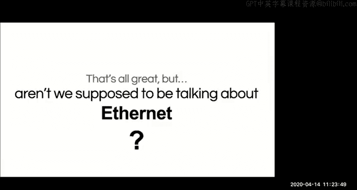

U。This guy is Bob Metcalf the father of Ethernet and it's not a great photo of him。

 but it's the best one I can find with a creativeative Commons license and in the full photo check out who he's hanging out with it's our friend inventor of the Webs Sir Tim Berns Lee I'm not sure if I mentioned it before but Tim Bernners Lee has been ignited so anyway Bob Metcalf。

Um，Among other things is known for MetCs law。Which basically says that like the value or impact of a network grows quadraically with the number of nodes because the number of possible connections grows quadratically or actually triangularly。

 but you know， whatever close enough。And this rationale has been used to explain the sort of like booming growth of the internet。

 you know like it has more value， you know， like quadraically as you add things to it。

 and I think this is also used you know really heavily when trying to get venture capital money for internet startups in the 90s。

But in 1972。He worked for Xerox， which was doing really groundbreaking influential work at the time。

 including designing a computer called the Alto， which was really the first attempt at a personal computer or a computing workstation。

😊，And the Alto did not go on to be a huge success as a product。

And really I mean they tried to commercialize it with like a successor called the Xerox star which they sold some of but not that many so as a product it wasn't very successful but as a sort of a you know just a piece of work it was hugely successful it was hugely inspiring to all the personal computing that came after it Apple in particular was super directly influenced by it the Mac user interface was basically borrowed from the Alto you know that's like the Mac was sort of like the first GuI interface that a lot of people saw and it was borrowed from the Alto I think Apple gave Xerox some stock to basically let them steal the interface and so。

😊，Xerox was talking about having businesses with like tens or maybe hundreds of these computers in one building。

 which was that was like a completely new idea。And they wanted a way to connect all of them。

And they also wanted a way to connect these computers to another product that Xerox was working on at the time。

 which was the first laser printer。😊，And so they needed to have this network that was going to be。

 you know， pretty cheap。But it also need to be you know pretty good need to be like pretty fast in order to like ship around like a bunch of high resolution images for their fancy laser printer which could print pretty fast so Robert Metcalf was put in charge of developing this network for。

For the alto and。He had done part of his PhD thesis on Alohannet。And so he thought， you know。

 rather than run a separate cable to each computer。

 the way that like every other early network worked。😊。

What if he just ran a single two conductor cable and all the computers just connected to that one cable。

 so like Aloha， he was going to use this one cable as a shared medium。😊。

So early ARPpant and other things we've looked at so far this semester looked something like this and Bob Metka's Ethernet looked like this and you can see how that might be quite a bit cheaper。

😊，So Ethernet sort of refined the Aloha scheme， giving us something called CSMA or Carer sense multiple access。

😊，And the idea here is that Aloha was kind of rude。

 like nodes just like send data and figure out if it collided later。

And CSmaA is sort of more polite it listens first and only starts talking when it's quiet and by listening。

 I mean that the network interfaces are sensing the signal or carrier from other nodes on the wire hence the name and so you know you probably use a protocol much more like CSmaA yourself when you're actually talking to people in real life right you kind of wait until there's a lull in the conversation than you say your part hopefully you don't interrupt too much but so like this is a nice improvement。

 but it doesn't completely avoid collisions you know it avoids a lot of them but not all of them so let me ask you why not why doesn't this avoid collisions completely and again you might consider whether this same basic scheme completely stops collisions in your real life conversation with people So anyone have an idea。

😊，No。Okay， here's a couple answers。Yeah， so when like multiple people think it's quiet and they both try to talk at the same time right。

 yeah， so I think you're onto something here and so I'm going to phrase it as the the key problem here is propagation delay。

😊，And so let's take a look at this using this time space graph。😊。

Time moves down the graph and the horizontal access is space and so we've got four nodes。

 four hosts on this network， H1 H2H3H4 and they're separated from each other by some space like as if these were four computers connected to a single ethernet cable at some distance from each other。

 right？😊，And。So。At time 0。H2 is going to start to transmit a packet。And as time goes by。

 the signal is going to propagate outwards， right， taking time to spread out in space to reach the other nodes。

😊，If you were a physicist， I think you'd call this the light cone。嗯。😊，And okay。

 quick quick side note or a quick quiz， what is this time that I'm showing here with the bar。

 we have a name for this。This time。Right here， what is that？

We talked about several kinds of delay earlier in the semester， what is that one？

Right it's the time that H2 is transmitting or the transmission delay right that's what that is good answer so you know this is you know from the top of that to the bottom of that from the kind of peak to the peak。

 that's the time when H2 is transmitting。U。Okay， so back to this graph， let's look at at time two。

So at time too。H3 has heard H2's packet， it knows that H2 is transmitting。So if。

It has a packet to send， it's not going to send it now because it would collide， right？😡。

That's the carrier sense。But if we look at H4。H4 has no idea that H2 is transmitting， right？

It's happening， but it doesn't know it yet。So H4 might start sending a packet of its own right then。

And。As that packet propagates。It's going to collide right so all this like deep purple area here。

 there's two packets on the wire and so you know these packets are going to be ruined for everybody。

😊，And so the solution here is to add this additional mechanism resulting in what's called CSM CD。😊。

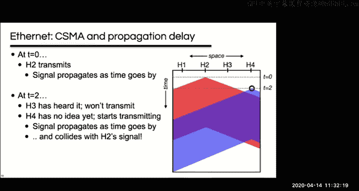

And so the CD here is collision detection and basically it just means that you also listen while you talk if you hear someone else at the same time。

 you shut up， don't even bother sending the rest of the packet because it's already been ruined。

And there's a bit more to it， but that's the basic idea， so does this make sense to everybody so far？

Anybody want to do a hand raise or anything， this is kind of making sense。All right， I'll take it。嗯。

😊，So a final word on retransmission。嗯。We've already talked about how you wait a random amount of time before retransmitting。

But if there's a lot of contention， a lot of nodes waiting to transmit。

 then you may still keep colliding。And so a solution to this is to use randomized binary exponential back and all that's really saying is that if a transmission a retransmission also collides。

😊，Then you wait up to twice as long before trying again again， you wait a random amount of time。

 but up to twice as long。Um， and basically， you continue doubling for every subsequent like recol。

And so ultimately this transmits quickly when it's possible， but it slows down when necessary。

And you know， you may remember you actually already have seen a binary exponential back off before back in discussion eight。

 the TCP retransmission timer keeps doubling and so that wasn't a randomized version。

 but this notion of sort of like binary exponential back off is pretty common in network protocols。

So to sort of sum up where we are so far， this ethernet。

 which I'll call classic ethernet using a shared medium and like a， you know。

 a single coaxial cable in the case of the original Xerox ethernet used a thick。

Generally yellow coaxial cable often called big yellow。And it used a random medium access protocol。

 CSNICD， which was inspired by Aloha。And so the kind of key ideas here are carrier sense， you know。

 don't interrupt if someone else is transmitting。Collission detection is notice if another node starts transmitting at the same time。

Randomness in when you start to retransmit so that you don't collide again。

And exponential back off where the higher the contention is the more conservative you become。

 and I didn't put it here， but like key to all of this is that Norman Abrasom liked to surf and moved to Hawaii and invented aloha。

So everybody good on this so far， anybody questions？All right。

So let's get into Ethernet addresses and service types。😊。

So on this shared medium like if you transmit everyone hears it right if H1 puts a packet on the wire here then H2 H3 H4 H5 they're all gonna get the packet like the signal is going show up at all of them so the L2 address isn't really useful as a locator but it is useful as an identifier so what am I talking about like we've used this postal metaphor for networks in this class before right but like here there's no need for an address to help you find the right street or anything like that it's sort of like everybody's already in the same dark room and you talk and everybody will just hear you right but you still want to say their name when you're talking like the name of the person that you want to talk to so that everybody knows whether you're talking to them or not。

So like you know， in contrast to IP there's no real like routing here， there's no aggregation。

 these addresses are like simple flat addresses and again I'd say they're really less like an address and more like a name in some ways。

😊，And so the actual format of these addresses is that they are 48 bits or six bytes。

 they're usually shown as six two digit hex numbers separated by colons or dashes。😊。

And the addresses are typically stored permanently in the network interface hardware itself。

 so sometimes they're called burned in addresses， which has to do with the term。

That you have for programmable ro chips， which is called burning a rum。嗯。

And they can often temporarily be overridden by software while the system is running and in some cases you can change them more permanently like by updating a piece of flash memory on old hardware。

 like I said they were often stored in like a separate programmable round chip so you could just like pull that chip out and put a different round chip in to change the address but like they're relatively difficult to change。

 because of that you'll often find them like actually printed on devices。😊。

So taking a slightly simplified look at the structure of these addresses。

 there are two bits which are sort of like flags and we'll talk about one of them in a minute。😊。

And then there's 22 bits which identify like a company or an organization。

 so usually this is like the manufacturer that made the device。

And then there's 24 bits to identify the device itself like a serial number， basically。

And so like here's a USB ethernet adapter and on the other side there's a 12 digit hex number and those are its ethernet address they didn't put the colons in here often they've also got a barcode form of it to businesses use these like to track the devices on their network like they'll have issued this adapter to some person and they will have like swiped the barcode to enter it into a database just because it's easier to type in and that way when they see traffic on their network from this ethernett address that they'll know it's some user。

😊，嗯。And。Anyway， you can look up the first three bytes here， 0050 B6。

 you can look those up in like a registry of device manufacturers and find out that this device was made by a company called Good Way Technologies。

 you can in fact go to their website and find this thing on it。嗯。😊，So。Usually。

These addresses are supposed to be globally unique so like each manufacturer has their own code and then they should fill in the other 24 bits with some value that they don't use for any other device we've got global uniqueness as a property for IP addresses also but the reasoning here is kind of different you know for IP it's because all the addresses are really all supposed to be on the same network。

😊，But for Ethernet that's not going to be the case right like the L2 addresses。

 the addresses on one ethernet network like shouldn't ever touch the addresses on another ethernet network。

 but since you can't easily change the addresses and you don't necessarily know when you manufacture them like if two particular devices are going to be on the same network or not。

 the easiest thing to do is just make them all unique。that is this all clear so far。

 either not addresses this so far？😊，All right， so a final note here。

 just sort of anecdotally I've heard that like some manufacturers may reuse addresses in particular they may do it when selling devices to different markets like if they sell devices to different countries that don't communicate much don't crossover much or if they sell like some consumer equipment and some equipment to like ISPs so I've heard that this happens and that people usually get away with it。

 but it sometimes causes headaches when you end up with two devices on the same network with the same Ethernet address if you think about it。

 they only have 24 bits for the device ID so like that's up to 16 million IDs and there may be a few hundred million servers on the planet and of course lots of other devices to routers and switches and that sort of thing and many servers have more than one network interface and of course over time like old adapters might break or need to be replaced or upgraded with new one。

That are faster and that sort of thing， so like maybe 16 million isn't really all that many。

And then there are virtual network interface devices like if you have a virtual machine it probably has a virtual ethernet adapter in it and in my experience the way this works for a lot of virtualization solutions is they just pick a random number essentially to be the ethernet address so there's no real guarantee of uniqueness there either and so all of that is just to say that ethernet addresses are mostly unique。

😊，All right， so moving on to service types， we've talked about a couple this semester so far。

 we've talked about UniIA that's sort of our default assumption where you're sending to one specific recipient and then we also talked about any cast in the context of DNS。

😊，On classic Ethernet it's also trivial to support broadcast and so broadcast is just sending to everyone in the context of Ethernet this means everyone on the same ethernet network like everyone on the same ethernet cable and this is so easy just because you know the packet already reaches everybody on the cable right they just need to be listening for it。

😊。

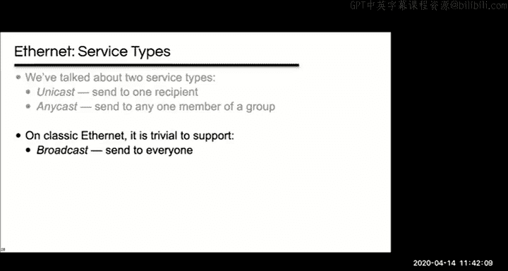

So this is implemented by using an address which is all ones。

 so six ptes of ones Fff FF F F Fff FF is the Ethernet address for broadcast and so again you know this really only influences the receiver like all it has to do is listen to the broadcast address as well as its normal ethernet address the network itself behaves just exactly the same way。

😊，Not that like the internet does not support the notion of a universal broadcast。

 you can sort of imagine the problems we might have if it was easy to send a packet to literally everyone on the internet。

 but for Ethernet， it's easy。

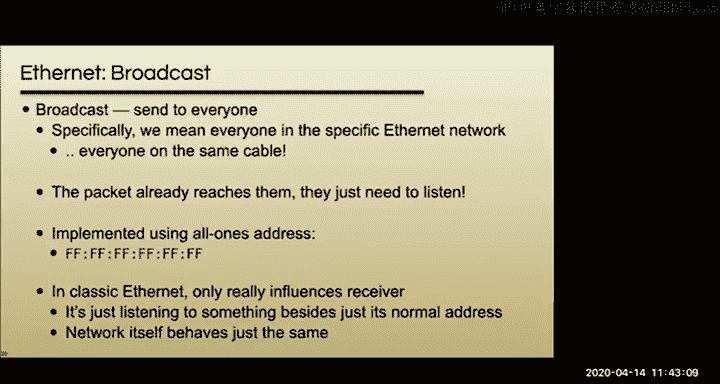

So EtherNe can do broadcast and it can also support a service type called multicast。

 which is basically when you want to send to all the members of a particular group and so you can sort of contrast this with any CA which was sending to one member of a group。

😊。

and much like broadcast， like this is really pretty trivial for Ethernet like a group is just a special address and whether you're a member of the group or not is just a matter of whether you're listening to that address or not。

😊，So I mentioned those flags in the ethernet address and one of them basically marks whether an address is a multicast address or not。

 if it's a one then it's a multicast address and so specifically it's this bit right here the lowest bit in the first byte of the address so all normal ethernet addresses are going to start with an even number because that bits going to be zero for a normal address。

嗯。On first glance。This maybe seems like a weird bit to have chosen。

 but it's actually not on the actual wire on Ethernet， the bits are sent。

From the low bit to the high bit and you know from the first bite to the last bite so this is actually the first bit that's of the address that's actually sent on the wire。

😊，嗯。So。Note that the broadcast address is all ones， so the multicast bit is set。

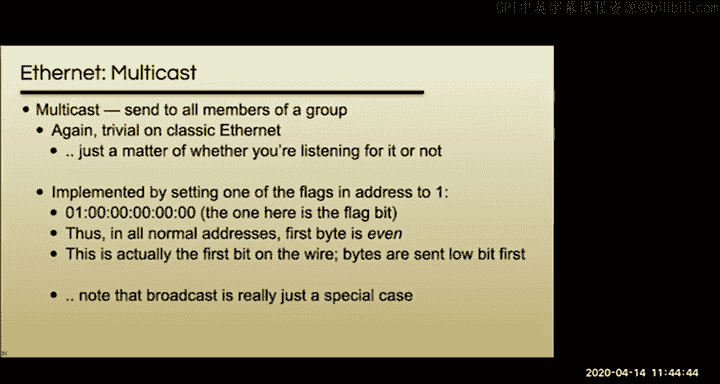

So like the broadcast address is really just a special case of the multicast addresses。

A quick example of when Ethernet Multicast is used that maybe connects to your own life a little bit。

 you know like how does a Mac know when there are things around it to Airplay to or how does your Mac know like when network printers are nearby that you can print to and the answer is that they're communicating over the local network using multicast maybe it's w-fi and not ethernet but they're basically the same and so your computer occasionally sends queries that basically say I'm looking for a printer or I'm looking for an Airplay screen and it sends them to this particular multicast address and printers or TVs or whatever are listening on that address and they send back responses。

😊，And just to kind of tie this back to stuff we've talked about already。

 it turns out that these queries and responses are actually all formatted as DNS records so it's like a bunch of pointer and serve and text records。

 but unlike when we talked about DNS before this isn't like a global and there's no central server infrastructure either it's really just each device like is listening and responds when it sees a query that's relevant to it and so this is called multicast DNS or MDNS and DNS service discovery or DNSSD Windows does something like really really similar but not identical for similar stuff like you know showing the local computers on a network。

😊，So anyway， an example of using multicast on a local network。And finally。

 I wanted to note that there is such a thing as IP multicast for a brief period of time。

 there was an experiment to support it on the actual public internet， but it didn't。😊，Sustain。

But multicast is still used in some private IP networks one example of that is AT&T Uverse which is you a cable TV and internet service some of you may have it as your ISP and as your TV service that use IP multicast to deliver TV content you can see how multicast is a really great fit probably for TV content right or a bunch of people are watching the same thing at the same time no need to send those packets individually to everybody with multicast you can sign to send it as a group。

😊，So basically it's really easy to implement multicast in classic Ethernet two。

 really broadcasting multicast are just a matter of listening to the right broadcaster multicast address in addition to your own unique address。

U so。Quick quiz here。Does Ethernet support UniIA？Yeah。Gotta know。Anybody else want to weigh in？

So I think， I mean， you're right in that so okay， another interesting answer。 Yes。

 it's just multicast with one user in the group。 and that's sort of an interesting way to look at it。

 And so I'm gonna say that the answer is yes and you know， it's basically like， you know。

 when you put the packet on the wire it gets to everybody but not everybody pays attention to it right if you put。

😊，Somebody's you know unique ethernet address on it then they're the only one that's going to pay attention to it so I think you'll agree with me that yes。

 ethernet easily supports UniIcast as a service model。

 even though the actual like packet actually gets sort of broadcast。😊，嗯。

So I think I hope that makes sense， let me know if you don't think that makes sense。Um。

 and while you're， you know， internalizing that， maybe also does Ethernet support any caste？嗯。

No guesses on this one。Got a yes， got a no canceling each other out。Maybe another yes。

I'm going to say no not really not not directly right I mean you could implement anycast using multicast basically right but it would take some extra work to make that happen right because you need to have a way to basically have everybody but one ignore it so it doesn't like natively support any cast so you could add something on top of it pretty easily to support any cast。

So yes， I think mostly no。

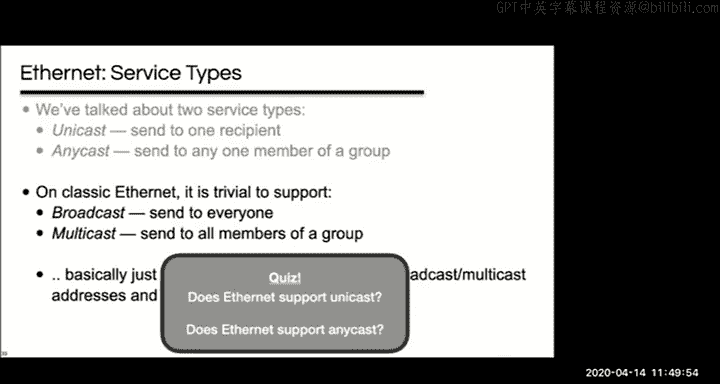

All right， so any questions on Ethernet addresses or service types？All right。

 so let's move on to talking about modern Ethernet。And so far。

 I've sort of been hedging talking about classic Ethernet。

 by which I mean like shared media with CSMA CD。😊，But modern ethernet rarely uses shared media it's what we call switched ethernet it looks a lot more like everything else that we've done so far this semester and notably it's got switches in it。

😊，So in Switch Dethernet there is only two nodes on any particular link and the nodes actually transmit on separate wires。

 so it's actually sort of like two unidirectional links and so there's no possibility of collisions in these networks and therefore you don't actually need CSMICD at all and of course there's no collisions on the switches because of the switches queue packets from each link so ass everybody kind of see what's what's going on here how there's sort of this evolution from classic to switch。

😊，Now the big trick here。Is that switched Ethernet still mostly acts like shared media Ethernet？

And what am I talking about？嗯。With classic Ethernet， the infrastructure is a single cable， right？

And what falls out of that is that when you send a packet， everyone gets it。

 or at least everyone can get it。Whether they pay attention to it or not is a separate question。

With Switch Ethernet， the essential primitive， which we talked about， you know。

 earlier on is flooding。😊，And again， what falls out of that is exactly the same thing when you send a packet。

 everyone's going to get it。😊，And so it's implemented in a different way。

 but it's got basically the same semantics and so that meant the transition from like a single shared medium to a switched world was relatively straightforward。

 there was no you know big new element required here。

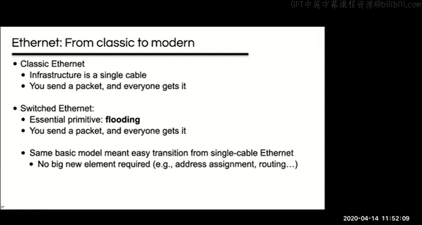

So。Quick quiz here。On classic shared medium ethernet to support broadcast or multicast。

 you basically just sent the packet。So。How do you do it？

On how do you support broadcast or multicast on switched Ethernet？Just send the packet。So I think。

 yes， what's going to happen with that packet or what needs to happen to that packet on Switch Ethernet for it to actually be broadcast or multicast。

I think you all probably know this。Maybe you don't know， you know。

Everyone needs to send it similar to flooding and so yeah that's which we need to send it to the other links and so yeah like you just flood it right like that's it。

😊。

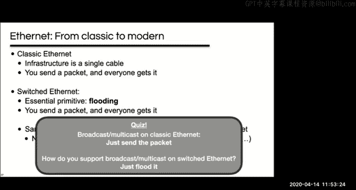

So。You know。Learning switches are really just an optimization here right specifically therefore're for unIA right if you know the destination's specific singular location。

 then you can stop flooding for that destination， but for everything else you flood them。😊。

In modern ethernet， some people talk about bum ethernet packets， which are broadcast。

 unknown uncast and multicast BUM， and they lump them together because they're all treated the same way by flooding。

 which has the same semantics as just sending on a single shared medium， so good answers everybody。

Soll that' all making sense。

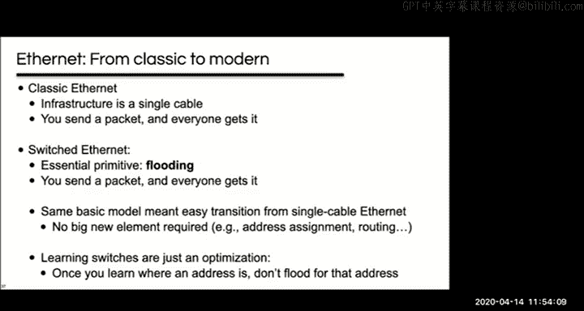

All right， so yeah， I've just made this argument that like classic shared media ethernet and modern Sw ethernet are semantically pretty much equivalent。

 even though they work quite differently， and I hope kind of as you think about this。

 you'll see sort of how the shared medium history may have sort of led to the switched ethernet's design。

😊，Again， any any questions before moving on here？All right。

So now we're getting to the real crux of the matter here。

 which is how L2 and L3 interact with each other。So first a quick important note。

 I'm mostly going to be drawing L2 networks like on the bottom sort of for clarity as if they were a shared media network。

 but like based on what we just discussed like anywhere that I'm showing one like that。

 we should just be able to substitute one using L2 switches like that should just be fine to do。😊。

So all right。Remember that IP is the internet protocol and its purpose is to like compose many networks into one internet。

😊，So what are those many networks， many of them are local networks built with Ethernett and if it's not Ethernet then it's some other L2 technology probably and in the context of IP。

 these separate networks are often referred to as subnets。

So imagine you have a couple of companies with Ethernett networks。And within their companies。

 their computers can easily send each other packets。

 they can even send IP packets among their computers。😊，But the network。

 which in this case means like the cable and the network adapters on the computers。

 they don't actually care that theirre IP packets， they just know that they're ethernet packets。

 they happen to be carrying IP， but the network doesn't care about that part。

But you can't send a packet between these two companies with just Ethernet。

 that's what IP is for and so you add IP routers to their networks。😡。

And you connect those IP routers to other IP routers。

 which connect to other IP routers and so on and so on in the internet。

 and somewhere these two networks are going to meet。

So if a host at Dunder Mifflin here wants to send a packet to a host Adv refrigeration。

It sends the packet to R1 and that's an L2 thing right like the address that got it from H1 to R1 is an ethernet address and you can sort of see that it has to be that just by process of elimination right like because the IP destination address is going to be the same for the whole lifetime of the packet it's always going to be some host advanced refrigeration。

Um， so， you know， but the packet needs to get to R1。

 so it must be because we're using R1's Ethernet address。😡。

Once the packet gets to R1 R1 operates at L3 because it's a router it's an L3 switch。

 it looks to the IP address and it sends the packet to the internet where other things are also going to look at the IP address and that's what eventually gets the packet to R2 of course between R1 and R2 there's also a bunch of L2 networks so you know a bunch of individual hubs in there are also happening in L2 which I'm just not showing here。

😊，And remember that these networks don't need to be shared media right like they could use L2 switches instead。

 so here I've got IP switches shown with an R for router and ethernet switches shown with an S。

And so just to finish our example， once the packet gets to R2。😊。

It's going to be an ethernet address which actually sort of takes the packet to its final destination。

So is everybody following along here kind of see how L2 is responsible for some of the forwarding and L3 responsible for other parts of the forwarding anybody？

IHave a question or want me to walk through this again。Yeah， sure， Okay。

 so I'll repeat this we'll go back so。We're going to say that。

The H1 at Dunder Mifflin wants to send a packet to some host advanced refrigeration。

And so it's going to create a packet with an IP address for， you know。

 some some host in refrigeration。And where is it going to send that packet。

 you can see by looking at how this is connected that that packet needs to go to R1。

And so how does R1 know that it needs to handle this packet you need to put R1's ethernet address on it and so it's sort of that ethernet address which is going to take the packet from H1 to R1 like that's what's going to be responsible if you put H2's ethernet address on the packet then it wouldn't get to advance refrigeration right so part of the forwarding is kind of taking place at L2。

In this case， it's pretty trivial because it's a single shared media。

 but it could be a switch dethernet， right？Once it gets to R1。

 R1 is going to look at the IP address of the destination， the destination IP， and it's going to say。

 oh， well this is somewhere else on the internet， and so it's going to send it into the internet and eventually the internet should get it to R2。

And once R2 gets this packet， it's going to say， well。

Somehow I know this packet needs to go to some host here in V refrigeration like we'll say H2 and so I'm going to need to put you know H2's ethernet address on it and put it into the network and so you know here I've shown that you know it's going to put H2's address on it and that's somehow going to take it to H2。

Does the packet contain destination L2 addresses？Yeah， so it does。

 you know we looked at this way earlier on I don't remember which lecture。

 but like you know the packet's generally going to have this like stack of headers right and so it's going to have an L2 address and then it's going to have an L3 address。

😊，And the L2 address is going to change a bunch of times like you know the L2 address when this packet is in Dunder Mifflin is going to be one thing when the packet gets to advanced refrigeration。

 it's going to be a different set of L2 addresses because those are local to those networks on the other hand。

 the L3 addresses are going to be the same across all of it。So。I hope this makes sense。

 I hope that clarified a little bit， let's actually walk through the next couple examples and you can tell me whether those you know help you make even more sense out of this。

嗯。First a couple notes here and the first is that there's no reason that you can't use IP routers to connect local networks together in a private part of the network too like that is without going through the internet so like here maybe this is a university network and it's got separate ethernets for computer science and EE and biology and again youd probably call these subnets and they're connected by IP routers。

And there's also no reason that your ethernet needs to have more than two nodes。

 like in this case we've got two ethernets， which only have two nodes like the router is one of the nodes for both of them。

And so this isn't like a single ethernet because they're connected by a layer three switch or a router here。

 so there are two separate ethernets， if they were connected by an L2 switch。

 then basically we wouldd consider them the same ethernet。😊，So。

Let's do these these kind of more detailed examples here， so we've got this network here。

 it's got two ethernet subnets connected by a router and you can see that the IP addresses have been allocated in such a way that all of the addresses on a subnet have a common prefix。

And I've shown our ones table here and these two entries in this case would be static routes when the network designer decided that the network on top would be 10。

0。0。0/16 and the bottom would be 10。1。0。0。/16， he or she would have plugged the static routes into the router and you know like note that because they all share like a common prefix like you could add like 65000 hosts onto either one of these subnets without changing those routes because we're using you know the entire prefix in the routing table。

And note that the router ports have different addresses。

 each port has an address in the appropriate range for the subnet that it's on。😊。

A side note here is that I've made the Ethernet addresses pretty simple， just for clarity。

 maybe maybe too simple in the real world they could and would be like pretty arbitrary。

 they wouldn't match the IP addresses or host names in any way。

So I hope you all kind of see what we're looking at here。

And so let's do an example where H1 is sending an IP packet to H2 on this network。😊。

And they're on the same subnet， so this should actually be really easy like if H1 just puts the packet to 10。

0。0。2 on the wire， it should get to H2 so is that it or are we missing something？

Anybody think we're good now？Anybody think we're missing something？🎼Yeah。自 go。

Do you need R1's ethernet and so in this case， you don't need R1's ethernet address。

 but you're on the right track what you need since we're sending this packet to H2。

 we need H2's ethernet address。Right like without the right ethernet address the host is just going to ignore it so somehow you know we need to find out H2's address and so you know one option you might think would be well okay what if we just put the broadcast ethernet address on there right like that should kind of get it there H2 should be listening to the broadcast address a couple downsides here are first of all like this doesn't allow for you know taking a learned path which doesn't apply to this network since there are no switches but you know in general。

It also kind of annoys I wrote I wrote annoys other nodes on the network here and I actually mean something really specific there like usually network interfaces themselves like filter out packets to addresses that they don't care about so even if there are many packets on the wire like if they're a different addresses the CPU and the OS never need to know but when there is a packet to an address that cares about the CPU and the OS have to actually process it so if the CPU is in a low power state it's got to wake up and the OS needs to serve and interrupt and actually run the packet through its networking code and so on there was a day when that processing was like expensive enough in terms of CPU usage they could actually slow machines down I think on machines today that's probably rare。

😊，I think the bigger issue is probably power consumption like battery life I has to wake the CPU up for every packet。

 even that's probably not a huge deal， but it's certainly like bad form and kind of needlessly wasteful。

This also doesn't necessarily work like a lot of OSs will actually ignore UniIcast IP packets sent to the broadcast ethernet address。

 so what we really need like I think you were kind of getting at there is we need the correct ethernet address。

 which in this case is H2's ethernet address。😊，And so the question here。😊，Is how do we find that。

 how do we know that we know the IP address， how do we get the Ethernet address？And。😊。

The answer is a protocol called ARP。

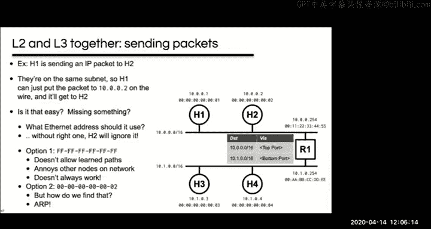

And so ARP is the address resolution protocol and it solves this specific problem like given an IP address。

 you want to know the corresponding ethernet address， ARP runs directly on top of L2。

 it's not you know on top of IP。😊，And art makes use of L2 broadcast and so basically a host just broadcasts a message asking who has this particular IP address and the host that has that address answers the query and just unIcasts back an answer that tells it the Ethernet address that it has hosts cache the results of this in what's called an A table or a neighbor table and then occasionally resend requests to make sure that the table is up to date。

😊，So that's all the aRP you need to know for this class， that's really most of ARP。

And so pretty simple， you just call out asking。Who has this IP address。

 whoever has it tells you their Ethernet address。

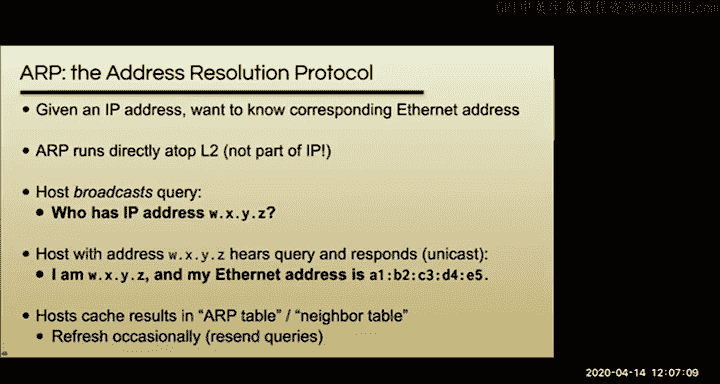

So back to our example， we use ARP to find the Ethernet address that corresponds to the IP address of the destination。

But we actually skipped over another important question here。

 which is how did we know that H2 was on the same subnet and you know keep in mind that ARP relies on a local broadcast right like if H2 was on the other subnet then the ARP wouldn't have gotten there and you would have never gotten an answer so how did we know that H2 was on the same subnet we already sort of grazed this in a slightly different context during our discussion of cider does anybody remember the sort of relevant technique？

That we can use。Yeah， you check the prefix so you know。

 we we showed that you know using a net mask or using a prefix in this context it's usually called a subnet mask。

Um， and so， you know， basically by just sort of like logically or rather bitwise ending the mask versus the destination address and the mask against your address。

 you can see whether you're on the same network or not。This， of course。

 raises the important question of how a host knows its own network mask。

 which I'll come back to in just a second。😊，But。Before I get to that， any questions on this。

 I'm going to move on to another example if there are no questions on how this one works that you know you first check。

 you find out the H2 is on the same network then you can ap for the EtherNet address and then you just put the packet on the wire or the right EtherNet address。

Let me know if that's not clear and I'm going to move on to the next example。So for this example。

 we've got H1 sending to H3。And this time the hosts are not on the same subnet and that means that we must be sending the packet through a router right that's what it means that when we're on a different subnet it's got to be somewhere else so we need a router so we're going to assume that the host knows the routers IP address again we'll come back to how it knows this in a minute but let's look at the packet headers when H1 sends the packet。

So the source IP and the source Ethernet address are pretty obvious they're just going to be H1's addresses。

 right？嗯。The destination Ethernet address， Evan， what's it going to be？

The destination Ethernet address is going to be R1's Ethernet address right it's sorry this destination IP is going to be H3s IP the destination Ethernet address is going to be R1's Ethernet address right so yes you're right it's going to be R1's ethernet address because this time it does need to cross this router。

😊，And so when R1 gets the packet， it's going to have to forward it itself onto you know。

 this other subnet。And。So first of all， how did we know that this was the Ethernet address that we wanted to use here？

We knew the router's IP address。How do we know that the routers Ethernet address， right。

 we optped for it perfect。All right， so the packet headers once R1。

 it's now R one's job to forward this packet。I thought R one that ap was only local yeah。

 so though if you look at this， I mean R one is actually local to both。😊。

Subnets right it's got an interface on both of them and so when you're arping for R1 you know your H1 is sending out an ap for 10。

0。0。254 the router's IP address and so R1 can answer it it is local to H1 it's also local to H3 and H4。

So yeah， good question。So it's not R1 that does the aping here， like for H1。

 when H1 wants to send the packet and it knows that it needs to send it to a router。

 it knows it needs to send it to R1。So how does it know the Ethernet address for R1 and it does that by aping for R1。

Yeah， how would we know the route is the IP address， I'm going to come back to that in just a minute。

 good question。Okay， so， so now we've got the packet on our one and。

So what are the source and destination IP addresses going to be here？

Or this packet going from H1 to H3。Yeah， you've all got it， they're going to be the same， right。

 like these own change。Um， what about the source Ethernet address。

 what's it going to be when R1 forwards the packet？Yeah。So it's going to be R ones。Yeah。

 router is Ether， right， It's gonna be R ones。R1's ethernet address。

 specifically R1's ethernet address on the ethernet that it's forwarding the packet to。

And the destination ethernet address is going to be what？Right。

 it's going to be H3's Ethernet address and how did R1 know H3's Ethernet address？

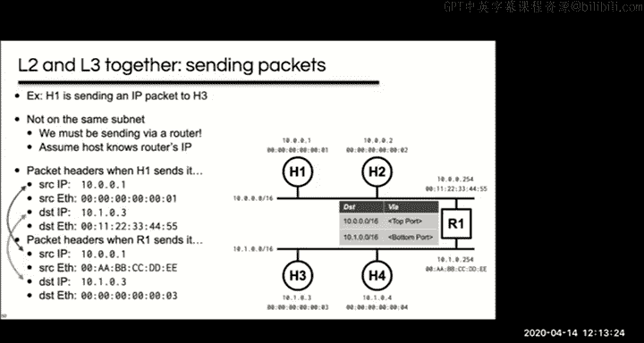

It aped for it， perfect。哦。All right， so just to jot down some of the things that we noticed that we needed a host to know。

 it obviously needs to know its own IP address， it needs to know its subnet mask or the size of the you know the prefix of the network that it's attached to。

And with those two things together you can find out you know like if something should be directly reachable at L2 or whether you need to go through a router to reach it so why does the source IP we've got a question why does the source IP not change at the router when R1 sends it so the source IP doesn't change because the packet is still from H1 at the IP loopops at the IP layer it's still from H1 so the IPs are never going change well actually there's there's a caveat to that but in general the Is shouldn't change right the packet still came from H1 it's the sort of global L3 level at the local level it's changing who it's coming and going to but the global level it's the same you can sort of think about this like when the packet gets to H3 if H3 wants to send a packet back it needs to know H1's address so it doesn't change there。

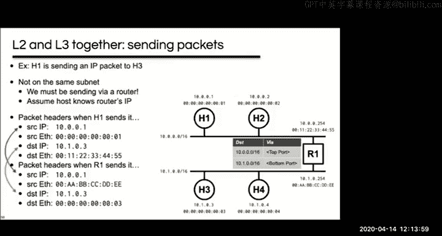

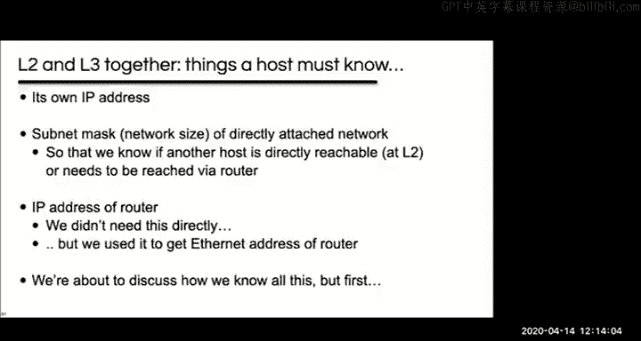

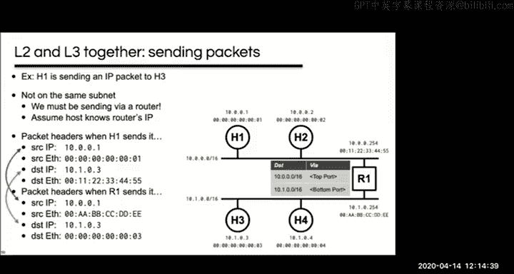

嗯。Right， so the we also need to know the IP address of the router we had the question about how we know that we didn't use that directly。

 we used it to get the ethernet address。But I said you know what we're going to get is the IP address of the router we can ap to find the Ethernet address and so let's talk about how we learned those things。

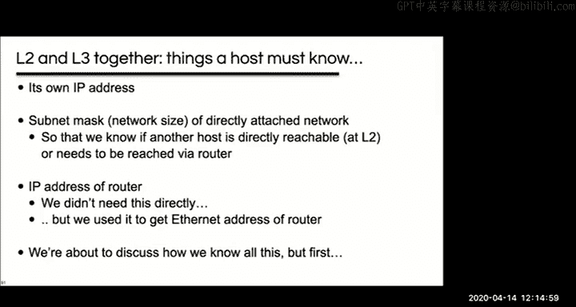

Does aRP form a table so redundant queries are not asked yeah it's it's basically exactly that it's like a cache right it's like you know if you keep communicating with R1 you don't have to send you don't want to have to send an aRP for R1 for every single packet so you keep this table and just every once in a while you look up R1's ethernet address and then you keep it in a table and just check it again every once in a while。

😊，So yeah， good question。Okay， so how do we know those things that u that we said we needed to know？

嗯。And so the single most important thing that we need to know， really， is our own IP address。

And if we think about ethernet addresses， like the sort of ground truth。

 the thing that dictates ethernet addresses is basically the hosts themselves right like I said。

 it's like burned into a chip on the network adapter and so it's therefore clear that like the state in the network。

 the routing state， the state and switches needs to adapt to the hosts in this case and so that sort of motivates the learning approach。

On the other hand， the ground source， the ground truth for IP addresses。

 you know you can't just pick them out of a hat like something else dictates them and there's a couple answers to this like you could say static routes on the routers dictate what those are so those are something that you the network designer operator puts in you could also think about it as they're dictated by the allocation of addresses that you got from like Aaron right for your AS youve got some set of addresses and of course those inform the static routes that the operator includes。

And so you know， really it ends up being sort of exactly the opposite right like the authority doesn't come from the hosts。

 it comes from the network or one of the regional registries or ultimately from Aana。

 and so you end up with this opposite where like the hosts need to adapt to the network in this case。

😊。

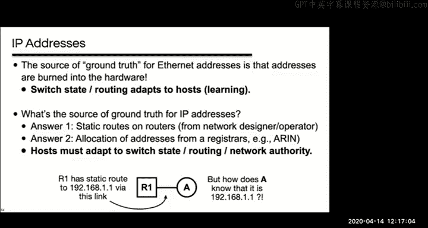

And so you could think about ways to do that and one would be manually。

 you could actually like you know plug in static addresses on the host the same way you plug in static entries on a router。

😊，That would have worked pretty well at one point in time it did for many years these days you know with laptops and other mobile devices when we're not all trapped at home。

 that would be a real pain to change your network configuration manually all the time and so we end up with this protocol called DHCP and it sort of is built on this idea that you know the network has already been configured with the correct information and so we just need a way to sort of query the information that the operators are already putting in the network。

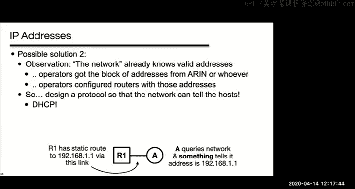

And so DHCP is the dynamic host configuration protocol and basically it lets hosts find out the stuff they need to know and crucially this includes the IP address that the host should use and its net mask and what's often called its default gateway I've mentioned before gateway is like sort of antiquated term for router so really what this is talking about is the first top router。

😊，And so that is the answer to all those questions this also often includes like the local DNS resolving server that you should use on that at work and there's like a bunch of other stuff as well。

 which I'm not going to talk about at all。😊。

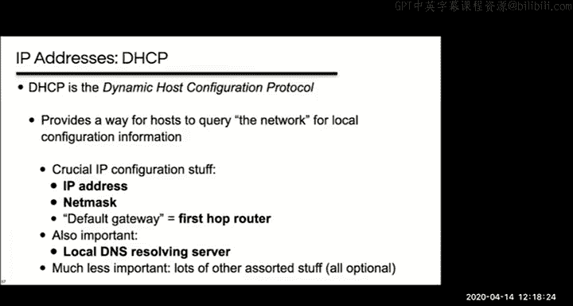

U。So the way this works kind of digging into it pretty quickly here is that you start by adding one or more DHCP servers to the network。

 usually it's just one， but it doesn't have to be。And these servers can be a separate machine or they can be built into a router like if you have a normal home Wifi router。

 it's got a DHtP server built into it。The servers listen on UDP port 67 and they're configured with all the required information like the first top router address in the local DNS server in the case of your local home router。

 like the router is probably both of those things and the DHP server is also configured with a pool of addresses。

😊，So like some number of usable IP addresses and basically the server gives clients a lease for one of those IP addresses and the lease is valid for some limited time like hours or maybe a day if the host wants to keep it has to renew it otherwise it gets returned to the pool。

 but as long as a host has it， the server is not going to lease it out to someone else。

And so there's a number of different DHTP message types。

 but we're going to discuss the four really important ones。

And so things start out when a host joins a network or powers up or whatever。

 and it sends a DHCP discover message， which is basically just asking for configuration info。

And the DHP server is going to send an offer with an offer for a lease and other information。

The client is going to select the offer that it wants， it may have gotten more than one。

 so it's going to select the one that wants and it's going to send a request message saying that it wants it。

😡，And then the server is going to send back an acknowledge message。

 which confirms that the request was granted。So we've got a couple of questions that come up here and so the first is like how does a client know the server's IP address to send these queries to anybody quickly have a suggestion on how they think you might do that？

😊，So it's a tough question right， it might not know the address。We've got the question of what。

What if there are no IP addresses left in the pool in that case you don't get an address its as simple as that so it's definitely possible that a pool gets exhausted and then you can't get on the internet so we've got one suggestion maybe this server continually sends out an IP good suggestion not actually how it works how it actually works is that you broadcast messages to the server instead and so this also works if you have multiple DHCP servers this this gets to all of them。

😊，We've got this question so the offer still gets sent through and so that's actually a good question if there's no nothing in the pool。

 I think most DHCP serverals will probably just never send the offer。

 but I don't actually know that for a fact。Yeah， I wrote a DHcP server and it just doesn't send one。

 but I'm not sure if that's true for all DHcP servers。嗯。Okay， so。Turns out。

 you know the same way we can use an ethernet address of all ones。

 if you use an IP address of all ones， then that'll do like a local broadcast again there's no such thing as like an internet wide broadcast。

 but if you send an IP packet with all ones as the destination address。

 then it'll get turned into an ethernet broadcast。嗯。And you know。

 you've also got this question of like what IP does the server use to send a message back to the client because again。

 the client doesn't actually have an address yet right that's part of why it's doing DHCP and so again it broadcasts messages。

😊，And then you've got this question of like what's the source IP in the packet header in the packets from the client。

 it turns out they usually just fill it in with zeros。😊。

And so anyway you can sort of see that like typically these are all broadcasts。

 at least initially during a renew they may have actual UniIcast addresses in there。

 but usually this is all broadcasts， which also has the nice benefit of if there are multiple DHCP servers when the client sends a request。

 the other DHCP servers can see that their offer wasn't the one that was accepted。😊。

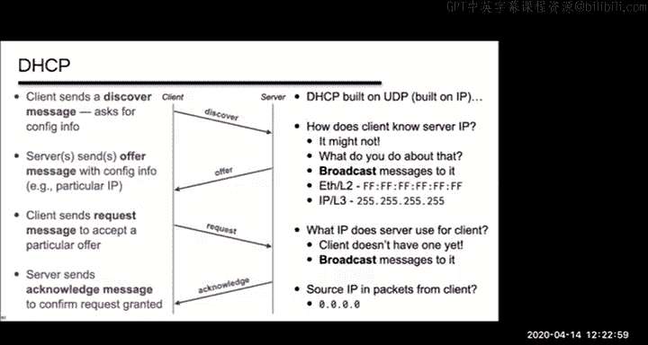

so a quick quiz for time management i'm going to answer this。

 but you know what does broadcasting imply about the location of the DHcP server or someone else quick jump in if you if you know the answer off the top of your head I want to make sure we get to the end of this though it must be local yep perfect you guys know this。

😊，So if it's not local， you can actually have something called a DHTP relay， which is， you。

 usually it's a router feature that knows how to forward DHTP across different networks。

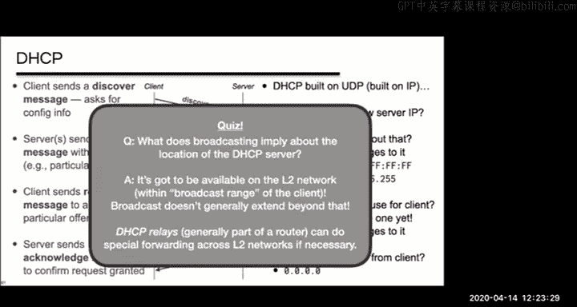

So that's the thing that exists so going I skip this again for time management。😊。

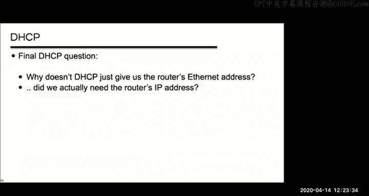

And so now we have all the pieces to do an example， which brings a lot of stuff together。😊。

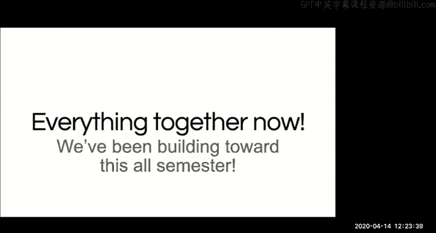

I do really want to kind of quickly review some of the stuff that we've talked about today。

 so first hosts know their ethernet address because it's burnt right into the hardware， right？😡。

They know their IP address because DHCP told them。They learn how to map between an IP address on the local network and its EtherNet address using ARP。

And DHCP also lets you learn your subnet mask and the first H router IP address and the local DNS server。

And finally， both DTP and ARP use a lot of broadcast right and the scale' is okay because it's only broadcasting to the local L2 network and you know it's like using this broadcast address lets you kind of solve these chicken and egg problems where you don't really know what address you should be using so you just kind of address packets to everyone。

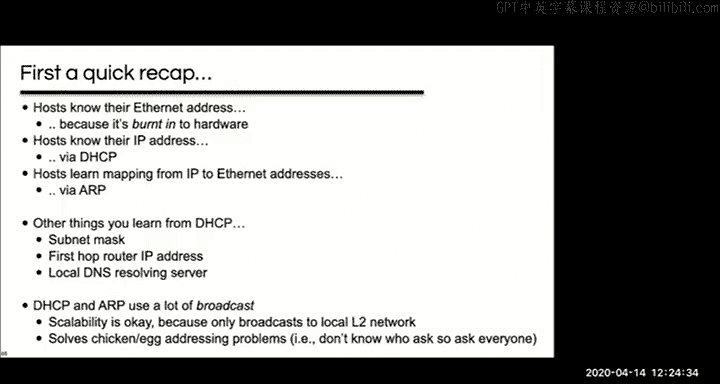

And so here's the setup for this kind of final example。

 we've got this network with two subnets kind of like before they're connected by a router R1。😊。

And H1 is going to be our client machine and it's just booted up。So it doesn't have any state。

 its ARP and DNS caches are all empty， it doesn't have an IP address and so on。

And what it's going to do is it's going to fetch one file from a local web server， H2。

 it goes by the DNS name H2。com， and then it's going to fetch two small files from a web server called H5。

com and so our task here is to actually list all of the packets that H1 sends and receives。

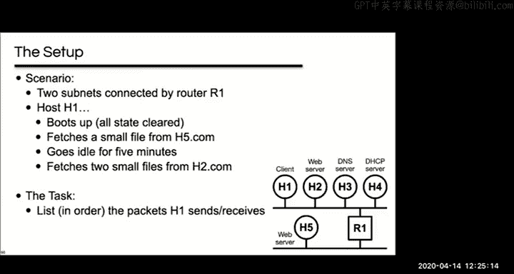

A few assumptions here， we're going to use persistent HTTP connections。

 we're going to say that the browser times these out when they've been idle for a minute。😊。

And second， we're going to assume that all the HTTP requests and responses fit in a single packet。

 so very small web pages。😊，And third we're going to say that there's no TCP piggy back and what that's saying is you know there's like every TCP packet contains an act number so like。

A packet sent as an act could also theoretically have data in it。

 but that doesn't happen in this example。Really quickly why that's true， why that's realistic。

Is you know TCP is typically implemented in OS kernel right so the acts are generated in the kernel on the other hand applications like HtTP are typically implemented in user space right it just a normal application and so their requests are processed and replies are generated in user space。

😊，And so the acts often get generated before an application has a chance to respond。

 like the kernel gets a packet and immediately sends an act。😊。

And it schedules the application to run， but the application are actually going to run until sometime later。

 so there are a couple exceptions here like if you're doing something called delayed Act which we haven't talked about and it's also not true if the kernel actually has data already waiting to be sent but that doesn't happen in this example。

 something similar happens with TCP closes it's why you usually see a F an act and a Fin and an act four packets instead of three。

 a Fin and then a Fin and an act for that F and then an act。😊，嗯。And。

So in what follows no piggybacking， except for the S act， you might say looks like a piggyback。

 but the S act when you're opening a action is done entirely in the kernel。

Does this all basically make sense？All right。So at the high level。

 I said what we're going to be doing here is have H1 boot up and then download some files。

 so let's make a detailed to do list here。😊，I'll start us off。

 the very first thing that's going to happen is that H1 is going to use DHCP to get configured。

 right？😊，And now we're going to want to download this small file from H5。com。

 what is the first thing we need to do here？嗯。Yeah， we're going to need to do DNS。

 but before we can do DNS， we need to do something else in order to do DNS yeah。

 we're going to have to aRP to get the to get the not the IP right to get the Ethernet address of the DNS server right so we're going to ap for the DNS server。

Then we're going to do the DNS。Then we're going to actually be able to download this first file。

 which is across the network， so we're going to need to ap for our ones ethernet address。

Once we know that， we can open this TCP connection for H5。Then what comes next？

We've opened a TCP connection to the web server。😊，So we can do an HtTP request。

The purple i'm just kind of separating the the steps you know first we DHP then we're going to do this resolution then we're going to do in blue again it's just all this。

All the stuff related to kind of fetching the file from the server once we get this。

 it's going to time out， we're going to close the connection。Then we're going to resolve H2。Um。

 then we're going to now notice when we resolve H2 again， we don't need to arp again， right。

 because it's going to be cached at this point。😊，Then we can art for H2， open the connection to H2。

We could do HP request for H2。Do the second HtTP request for H2， right， there's two files。

And then eventually we're going to close the connection here。So all right。

 we're pretty much out of time right before we get to where the rubber really hits the road here。

 unfortunately。I will keep going， you will probably want to look at this。

Yeah okay I'm going to go along so that we have it on the recording so that you can watch it perfect all right so here's what we'll do and you can watch this after the fact if you have to go now so now we're going to look at this at the packet level packet level detail and so looking at our tu do list on the right the first thing we're doing is DHCP。

😊，And so if you remember DCP that starts out with this discover message and so basically I've shown this du column showing the direction and so arrows pointing to the right are messages that H1 is sending if it's pointing to the left it's going to be a message that H1 is receiving and I've put a double arrow as a way of showing that it's a broadcast。

😊，The O here is the other host that's involved， in this case， it's up to broadcast。

 there's you know no specific host。😊，And then the next column is the transport protocol。

 which is UDP for DHCP。And then this is a DHCP discover message。

 so hopefully that all basically makes sense if it doesn't and you're still here。

 feel free to chime in。😊，So。The next thing that happens is the next part of a DHCP transaction is going to be an offer。

 so the server， which in this case is the DHCP server H4。😊，Is going to broadcast back an offer。

Following this。The host H1 is going to send a DHCP request， it's going to basically saying yes。

 I want that offer。And then the server is going to broadcast back a DHCP acknowledge。

So that finishes up our DHCP part。And we can move on to this next part where we're trying to resolve H5。

com， but before doing that， we need to find out the Ethernet address of the DNS server。

And we do that because it's a local DNS server so I'm in the same sububnet。

 so we send out an R request for H3。😊，And that's a broadcast。😊。

H3 is going to send back an A response to H1 and this is a unIcast， it's not going to be a broadcast。

 it knows who was asking， it can send back a unIcast right to H1。So that finishes our ap。

And now we can send a UDP packet with a DNS request for an A record for H5。com。

The DNS server is going to send back the response。And so now we've resolved h5。com。

 we know the IP address to use。We can look at that IP address for H5 and we can see that it's not local and therefore that we need to go through the router。

So we're going to arp。For our ones。Etherna address。

 and we know R one's IP address because we got it from DHCP。So again， we get a uncast back from R1。

Yeah， the difference between single arrow is single arrow is a unIcast and multiarrow is going to be a broadcast。

😊，Sorry， if I didn't make that clear earlier。嗯。So。Now we've aped for R1 and now we can create a TCP connection to H5。

So we send the sin packet。And what happens next？Somebody who ares listening want to chime in。

 what's the next packet going to be？Right， it's going to be a synac coming from H5， right。

 it's going to be Unicast from H5。Transport protocols TCP。Then， of course。

 the third part of the three way handshake is going to be a。😊，And then what happens after this？

Multiarrow is broadcast， yes， yes you're right， it is。So HtTP， right。

 so we're going to get this HtTP over the TCP connection to H5。😊，What is the next packet going to be？

This one's a little bit tricky。Yeah， but you got it， it's going to be the act from the server。

It's just acting the fact that you got this HttP get。

Then it's going to send back the actual HTTP response。So what's the next packet going to be？Right。

 you got it， it's going to be act from the client saying I got the response。And then。

Nothing's going to happen for like a minute。I said there was going to be this delay between the downloads and so the next thing that happens is after a minute the browser says okay。

 this connection is idle。😊，And it's going to send a fan。

And I'm sure you all can guess that the server is then going to act that fin。😊，Send its own fin。

And the client is going to act that f。So with that， weve now disconnected from H5。

That' all make sense so far。All right， so the next part， there's nothing too interesting。

 too new here。We've got to resolveh2。com。We can just do that we've already cached you know the the ethernet address in our arc table for the DNS server so we can just send that DNS request for the a record for H2 we'll get back the response。

Then what's the next thing that happens， we need to ap for H2。

We're going to get the response back again， the A request is broadcast。

 the A response is going to be unIcast。😊，You know， you can think about that the request。

 you don't know who is going to answer that， so you need to broadcast it on the other hand。

The one answering it definitely knows who asked the question， so no need to broadcast that。So。

That gives us H2's Ethernet address。We can then do the three way handshake to open a TCV connection to H2。

Then we do this HttP request to H2， we get the AC。Get the response， we act the response。

 this is pretty much just the same as before。So that gets us our first of the two files that we said we wanted to download from H2。

Then since this is a persistent connection on this same TCP connection。

 we can then send the second HTTP Git。😊，It'll get act。We'll get the response。We'll act the response。

And that's gotten us our second file。And then again。

 after waiting for a minute for the browser to decide the connection is idle。😊。

The browser will send a fI。😡，And we'll do the four step TCP connection teardown。

And that finishes this up。Any questions on this sequence of events？

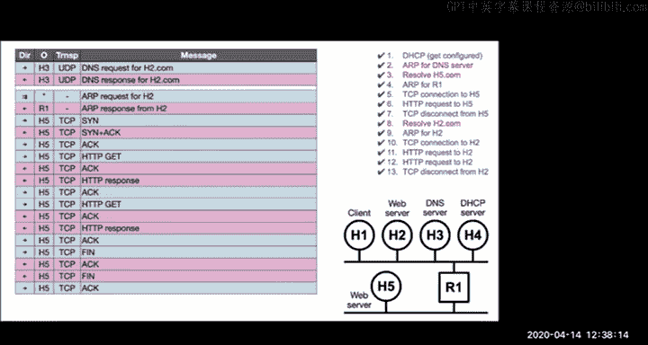

All right， so you know， that's like from start to finish how a host would download some web pages like packet by packet and so you know that's something I don't think you would have been able to do when when you started this course but hopefully with a little bit of practice now you will be able to it's a good thing to know probably for the final。

And so that's everything for today sorry I went a bit long this was my last lecture it'll be Sylvia from here on out I'll still be around on Piazza and email of course and I'll have office hours on Thursday so thank you all who stuck around sorry for those of you that are watching this after the fact I wish you all the best on the project and on the final exam and on the rest of your courses this semester again thank you all very much。

😊。

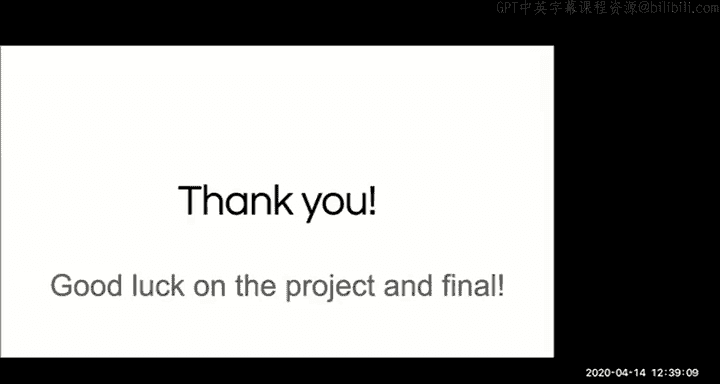