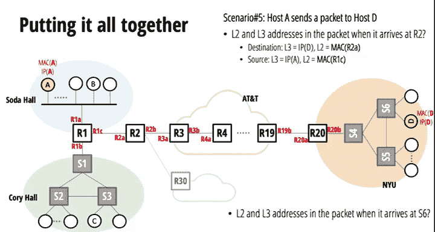
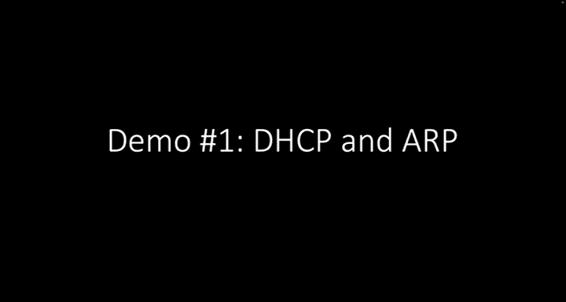
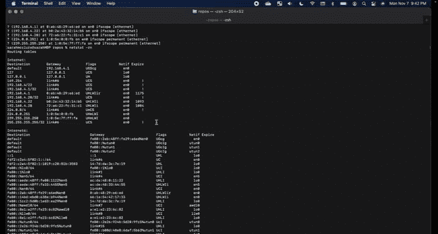
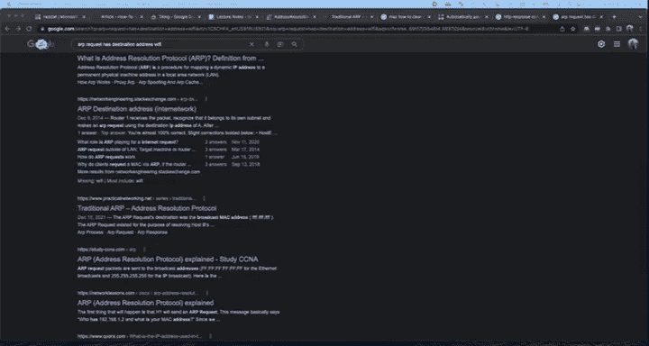
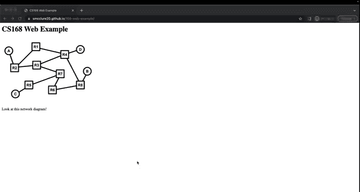
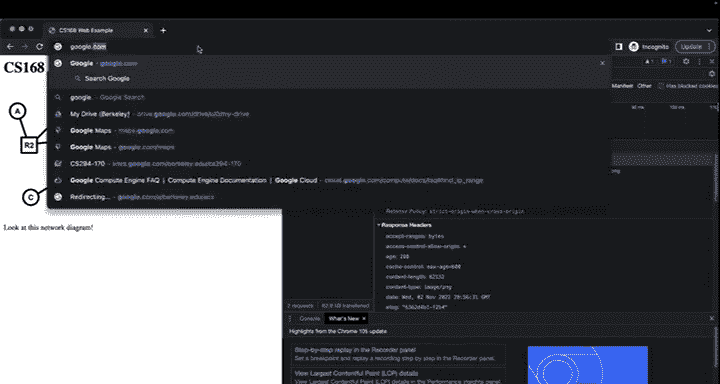
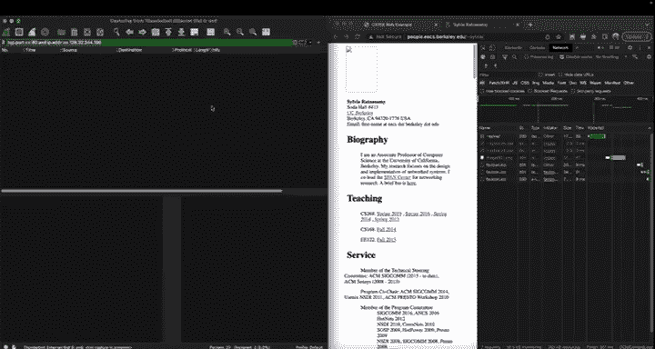

# 互联网导论：架构与协议｜CS 168：P23：端到端操作回顾

在本节课中，我们将学习互联网端到端通信是如何工作的，特别是第二层（L2，如以太网）和第三层（L3，如IP）如何协同工作。我们将通过回顾核心概念和实际演示来理解数据包从源到目的地的完整旅程。

---

## 地址：L2与L3

上一节我们介绍了网络分层，本节中我们来看看L2和L3各自使用的地址。

L2和L3有各自独立的地址结构和转发方式，但它们必须协同工作。每个数据包在网络中传输时都同时携带L2和L3的头部信息。

以下是L2（以太网MAC地址）和L3（IPv4地址）的关键区别：

*   **来源**：MAC地址通常**硬编码**在网络接口硬件中。IP地址则由网络运营商根据设备在网络拓扑中的位置**动态分配**（如通过DHCP）或手动配置。
*   **结构**：MAC地址是**扁平**的，不利于聚合。IP地址是**分层**的，可以进行聚合（例如，将多个IP地址合并为一个前缀）。
*   **可移植性**：MAC地址随设备移动。IP地址则取决于你连接的网络，移动后会改变。
*   **作用**：MAC地址用于在**同一本地网络**（如一个以太网）内的设备间通信。IP地址是互联网的**端到端**寻址方案，用于跨网络通信。

这些特性是相互关联的。例如，MAC地址硬编码在硬件中，意味着它随设备移动，这导致无法对其进行有效的聚合分配。

**为什么需要两种地址？**
*   **为什么不能只用MAC地址作为全局标识？** 因为MAC地址无法聚合，互联网上有数十亿设备，如果路由表需要为每个MAC地址都维护一条记录，这将导致**无法扩展**。
*   **为什么不能只用IP地址，跳过L2？** 虽然理论上可能，但L2（如以太网）提供了非常**便利的“即插即用”引导机制**。当一台主机启动时，它只知道自己的MAC地址。L2的广播发现机制（如ARP、DHCP）使得主机能够自动发现其IP地址、第一跳路由器等信息，从而顺利引导L3。如果没有L2，IP协议本身需要增加复杂的广播和发现机制，这实际上会重新发明L2的许多功能。此外，历史原因也起了作用，在互联网发展初期，已经存在许多以太网网络。

---

## 引导与发现协议

主机启动时，只知道自己硬编码的MAC地址。它需要通过发现协议来获取所有其他必要信息才能与远程主机通信。

以下是两个关键的引导协议，它们都**运行在主机所在的本地L2网络内**，并**严重依赖广播能力**（这在本地网络内是可行且方便的）。

### 地址解析协议

ARP用于将同一本地网络内的**IP地址解析为对应的MAC地址**。

其操作非常简单：
1.  发起主机**广播**一个ARP请求包，询问“谁拥有这个IP地址？”。
2.  网络上的所有主机都会听到这个广播。
3.  拥有该IP地址的主机（或路由器接口）会**单播**回复一个ARP响应，告知其MAC地址。

### 动态主机配置协议

DHCP用于主机启动时，动态获取其L3（IP层）的配置信息。

以下是DHCP的工作流程：
1.  **DHCP发现**：客户端广播“我需要配置”。
2.  **DHCP提供**：DHCP服务器（可能有多台）响应一个“提供”，包含建议的IP地址、子网掩码、默认网关、DNS服务器地址等。
3.  **DHCP请求**：客户端选择一个“提供”，并广播“我请求使用这个配置”。
4.  **DHCP确认**：服务器最终确认，客户端正式获得该IP地址的租约。

**关键点**：
*   DHCP基于UDP/IP。在客户端获得IP地址之前，它使用特殊的**广播IP地址**（如`255.255.255.255`），该地址会转换为**广播以太网地址**，从而实现L2层的广播。
*   为了效率和状态管理，ARP和DHCP都使用**缓存**。ARP结果会被缓存一段时间；DHCP获得的IP地址有**租约期限**，客户端需要定期续租，否则服务器会回收地址。

---

## 数据包转发：L2与L3的协同

现在我们已经了解了地址和引导过程，本节中我们来看看数据包在实际转发过程中，L2和L3是如何协同工作的。请记住，**每个数据包都同时包含L2和L3的头部**。

### 从主机发送数据包

假设主机A想发送一个IP数据包给主机B。以下是发生在主机A上的步骤：

1.  **L3决策**：主机A的IP层（L3）查看目标IP地址（B的IP）。
2.  **判断是否在同一网络**：主机A将自己的IP地址和子网掩码与目标IP地址进行比较。
    *   如果**在同一网络**，则“下一跳”就是**目标主机B本身**。
    *   如果**不在同一网络**，则“下一跳”是**默认网关（第一跳路由器）**。
3.  **确定下一跳的IP地址**：此时，主机A知道了下一跳的IP地址（要么是B，要么是路由器）。
4.  **L2封装**：主机A将数据包交给L2（以太网）。L2需要知道下一跳IP地址对应的**MAC地址**。
    *   如果不知道，则使用**ARP**进行查询。
5.  **发送**：L2将数据包封装成以太网帧，**源MAC地址是A的MAC**，**目标MAC地址是下一跳的MAC**，然后发送出去。

**关键规则**：在数据包的端到端路径中，**IP地址（源和目的）始终保持不变**，而**MAC地址在每一跳（每一个L2网络段）都会改变**。

### 数据包到达路由器

现在，假设数据包到达了一个路由器（例如主机A的默认网关R1）。

1.  **L2接收**：数据包到达路由器R1的某个接口。路由器检查以太网帧头中的**目标MAC地址**。
2.  **判断是否给自己**：
    *   如果目标MAC地址**匹配**该接口的MAC地址，说明这个L2帧就是发给路由器本身的。路由器**剥离L2头部**，将IP数据包向上传递给L3处理。
    *   如果目标MAC地址**不匹配**，则路由器是在作为一台**L2交换机**进行工作（这种情况在连接多台设备的路由器接口上可能发生），它会根据MAC地址表进行L2转发。在简单的点对点链路或主机-路由器链路上，这通常不会发生。
3.  **L3路由决策**：路由器查看IP数据包头的**目标IP地址**。
4.  **查找路由表**：路由器在其IP路由表中进行最长前缀匹配，决定从哪个**出站接口**发送数据包，以及下一跳的**IP地址**是什么。
5.  **重新进行L2封装**：路由器确定了出站接口和下一跳IP地址后，过程回到“从主机发送数据包”的步骤4和5。路由器会为这个数据包**构建一个新的L2帧**：
    *   **源MAC地址**：路由器出站接口的MAC地址。
    *   **目标MAC地址**：下一跳IP地址对应的MAC地址（通过ARP或配置获得）。
6.  **转发**：路由器将新的L2帧从出站接口发送出去。

这个过程在路径上的每一台路由器上重复，直到数据包到达目标主机所在的本地网络。最终，目标主机会收到一个目标MAC地址是自己的数据包，剥离L2头后，将IP数据包向上传递给传输层和应用层。

---

## 实例分析

让我们通过一个具体例子来巩固理解。考虑一个简单网络：Soda Hall有一个共享以太网，Cory Hall有一个交换式以太网，它们通过路由器R1连接。

**场景1：Soda Hall内主机A发给主机B（同一网络）**
*   **路径**：A -> B（直接通过共享以太网）。
*   **数据包信息**：
    *   **L3**：源IP = A的IP， 目的IP = B的IP。
    *   **L2**：源MAC = A的MAC， 目的MAC = B的MAC。

**场景2：Soda Hall的主机A发给Cory Hall的主机C（跨网络）**
*   **路径**：A -> R1 -> ... -> C。
*   **在A到R1的链路上**：
    *   **L3**：源IP = A的IP， 目的IP = C的IP。
    *   **L2**：源MAC = A的MAC， 目的MAC = R1接口（连接Soda Hall侧）的MAC。
*   **在R1到C的链路上**（例如，在Cory Hall的交换网络内）：
    *   **L3**：源IP = A的IP， 目的IP = C的IP。（**不变**）
    *   **L2**：源MAC = R1接口（连接Cory Hall侧）的MAC， 目的MAC = C的MAC。

这个例子清晰地展示了IP地址的端到端不变性，以及MAC地址的逐跳变化。

---

## 实践演示：使用Wireshark观察网络流量

理论需要结合实际观察。本节中我们将使用网络分析工具Wireshark来观察真实的网络操作。

### 演示1：观察DHCP和ARP

1.  **断开并重连Wi-Fi**：在Wireshark中开始捕获无线网卡流量，然后打开电脑Wi-Fi。
2.  **观察流量**：你会看到大量数据包。通过过滤可以找到关键流程：
    *   **DHCP交互**：可以看到`DHCP Discover`, `Offer`, `Request`, `Ack`四个报文，其中包含了分配的IP地址、网关、DNS服务器和租约时间。
    *   **ARP请求**：在获得IP后，电脑可能会发送ARP请求来解析网关的MAC地址。
3.  **查看结果**：在终端使用命令如 `ifconfig`（查看IP和MAC）、`netstat -rn`（查看路由表）、`arp -a`（查看ARP缓存）来验证获取到的配置信息。

### 演示2：观察HTTP/TCP流量

1.  **访问一个简单网页**：在浏览器中打开一个自己搭建的或已知的简单HTTP（非HTTPS）网站。
2.  **使用浏览器开发者工具**：在“网络”标签页中，可以清晰地看到浏览器发起的每一个HTTP请求（如HTML文件、图片），以及请求/响应的头部信息、状态码（如200成功、304未修改）、时间线等。
3.  **使用Wireshark进行包级观察**：
    *   在Wireshark中捕获流量，并设置过滤器（例如 `tcp.port == 80 && ip.addr == <服务器IP>`）来聚焦于与该网站的HTTP通信。
    *   你可以观察到：
        *   **TCP三次握手**：`SYN`, `SYN-ACK`, `ACK`。
        *   **HTTP请求/响应**：在TCP连接建立后的数据包中，可以看到明文的HTTP `GET`请求和服务器返回的`HTTP/1.1 200 OK`响应及HTML内容。
        *   **TCP流控制**：可以查看序列号、确认号、窗口大小等TCP字段。
        *   **连接终止**：`FIN`包等。

**注意**：对于HTTPS网站，应用层数据是加密的，因此在Wireshark中看不到HTTP明文，但依然可以观察TCP和TLS握手过程。

---

## 总结

本节课中我们一起学习了互联网端到端操作的核心原理。我们回顾并厘清了L2（MAC地址，以太网）和L3（IP地址）在寻址、转发中的不同角色与协同工作方式。我们了解了主机如何通过ARP和DHCP协议完成初始引导。更重要的是，我们一步步分析了数据包从源主机发出，经过路由器逐跳转发，最终到达目的主机的完整过程，明确了**IP地址端到端不变**而**MAC地址逐跳变化**的关键原则。最后，通过Wireshark的实际演示，我们将理论知识与真实的网络流量联系起来，加深了对HTTP、TCP等协议在实际中如何运作的理解。掌握这些基础概念是理解更复杂网络协议和应用的基础。