# 互联网导论：架构与协议｜CS 168：P24：软件定义网络 (SDN)

## 概述
在本节课中，我们将要学习软件定义网络（SDN）。SDN 是一种管理网络的方法，它并非革命性的技术，而是一种组织网络功能的方式。我们将探讨 SDN 为何出现、它解决了什么问题，以及其背后的核心设计理念。课程将从背景介绍开始，逐步深入到 SDN 的具体架构和抽象概念。

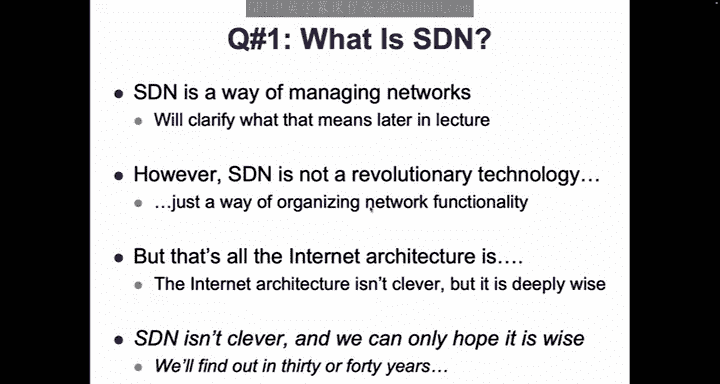

---

## 课程背景与动机

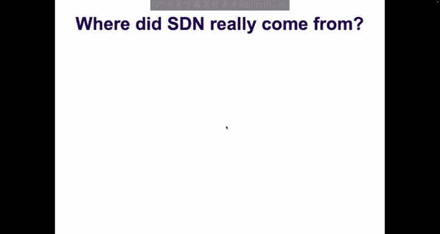

首先，我们需要理解 SDN 诞生的背景。在 2004 年左右，多个研究团队（如普林斯顿、CMU、斯坦福、伯克利）以及谷歌、微软等工业界公司，都在探索类似 SDN 理念的网络管理新方法。这些想法在 2008 年左右汇聚，并被《麻省理工科技评论》命名为“软件定义网络”。


SDN 的快速采纳（例如，2011年成立了拥有众多成员的开放网络基金会）表明它必定解决了某个强烈的痛点。这个痛点主要有两方面：一是思科（Cisco）在当时网络设备市场的绝对主导地位，其他厂商渴望能削弱其优势的新技术；二是更根本的原因——传统网络管理变得异常复杂和困难。

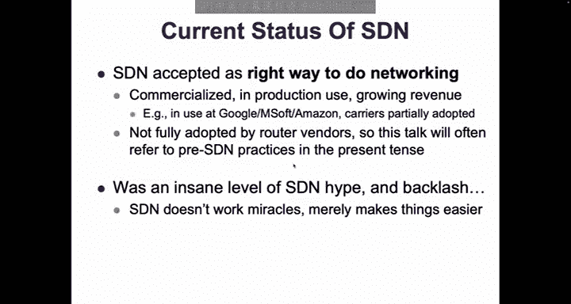

上一节我们介绍了 SDN 出现的时代背景，本节中我们来看看网络管理本身面临的挑战。

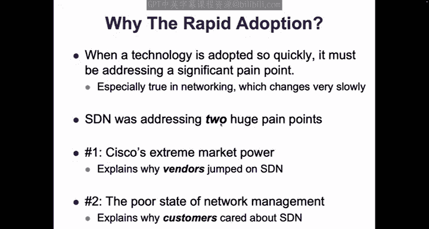

## 网络管理的困境

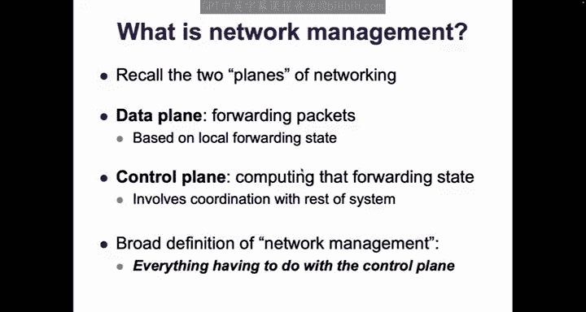

什么是网络管理？在网络中，我们通常区分两个平面：
*   **数据平面**：负责根据本地转发表状态处理每个数据包。例如，一个数据包到达，路由器查看其目的地址，查询路由表，然后从相应端口转发出去。这个过程基于本地信息，功能明确。
*   **控制平面**：负责计算和设置数据平面所使用的转发状态。这通常需要了解整个网络的拓扑等信息，并涉及设备间的协调。

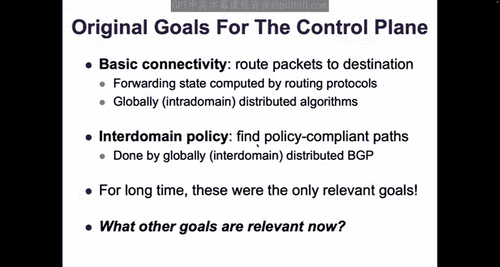

**网络管理**，在这里我们将其定义为与控制平面相关的一切，即如何设置网络设备的状态。

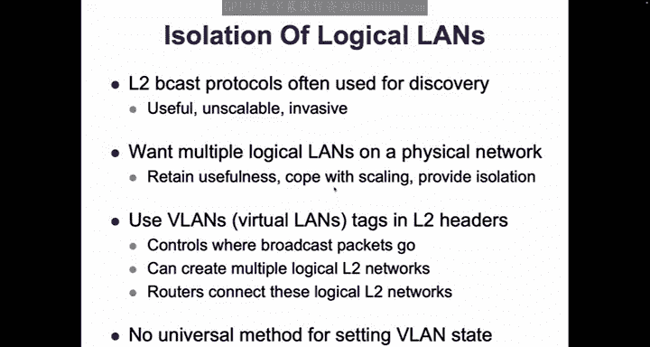

互联网早期，控制平面的目标很简单：实现基本连通性（域内路由）和符合策略的域间连通性（BGP）。然而，随着网络发展，控制平面需要实现的目标变得复杂多样。

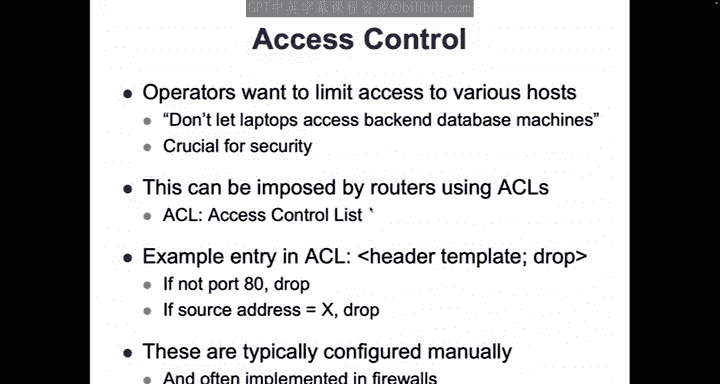

以下是几个使网络管理复杂化的目标示例：

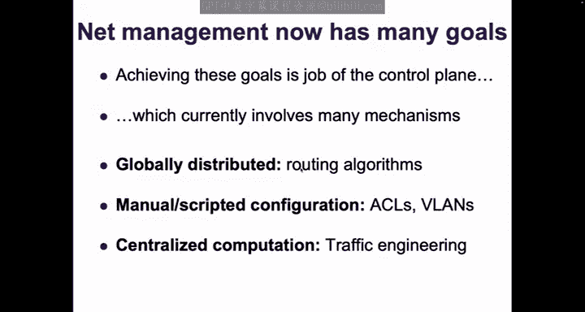

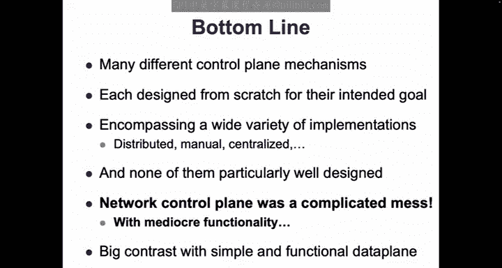

*   **逻辑网络（VLAN）隔离**：为了限制广播域范围并实现资源隔离，虚拟局域网（VLAN）被广泛使用。但 VLAN 的配置通常通过脚本或手动完成，缺乏自动化的分布式算法。
*   **访问控制**：出于安全考虑，网络需要使用访问控制列表（ACL）来限制流量。例如，禁止来自大堂 Wi-Fi 的访问连接到核心服务器。ACL 的配置也通常是手动或脚本化的。
*   **流量工程**：在大规模网络中，需要根据流量矩阵计算路由，以避免链路过载。这通常通过集中式计算完成，然后将其推送到网络设备。

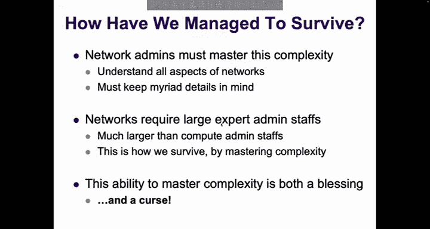

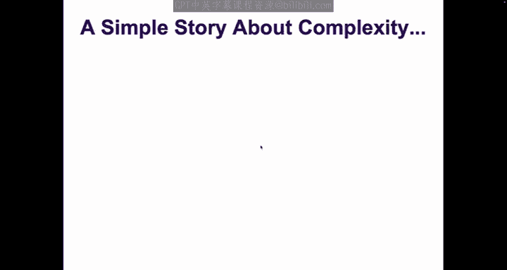

总而言之，现代网络的控制平面需要处理众多目标，但实现这些目标的机制（分布式算法、手动脚本、集中式计算）各自为政，缺乏统一的设计和良好的抽象。控制平面变成了一个功能平庸的复杂混乱体，这与简单高效、数十年保持不变的数据平面形成了鲜明对比。

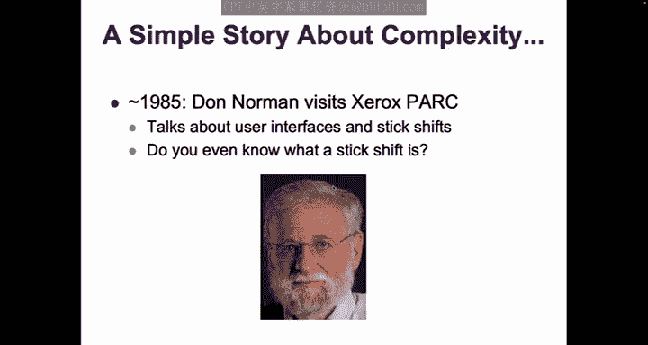

那么，在 SDN 出现之前，我们是如何应对这种复杂性的呢？答案是依靠**网络管理员**。他们凭借专业知识，将所有这些复杂细节记在脑中，手动管理和配置网络。这种“掌控复杂性”的能力是一种祝福，但也是一种诅咒。

## 从“掌控复杂性”到“提取简单性”

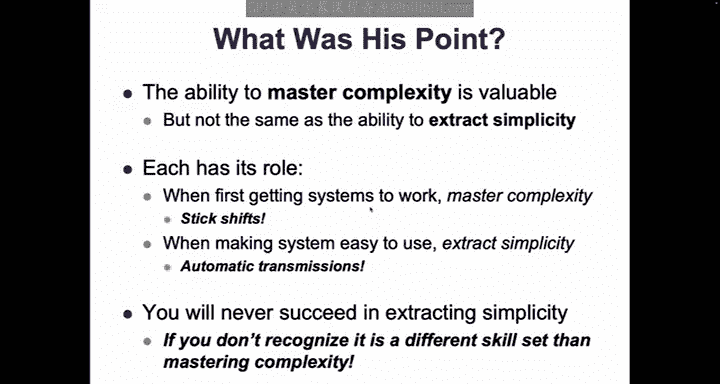

“掌控复杂性”意味着深入系统内部，理解并操作所有细节使其工作。这在系统构建初期是必要的。然而，当目标是让系统易于使用时，我们需要的是“提取简单性”——即定义清晰的抽象接口，让使用者只需关注高层目标，而将底层复杂实现隐藏起来。


一个经典的类比是汽车的手动变速箱（手动挡）和自动变速箱（自动挡）。喜欢驾驶手动挡的人享受的是“掌控复杂性”的乐趣；而自动挡的设计目标是“提取简单性”，驾驶员只需告知车辆“前进”、“后退”或“停车”的意图即可。

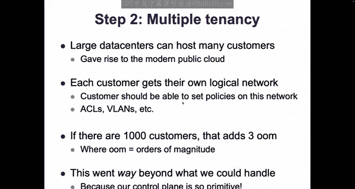

在 SDN 出现之前，网络领域从未真正完成从“掌控复杂性”到“提取简单性”的转变。网络专家们满足于精通 OSPF 中某个特定字段的微妙作用，并认为这是运行网络的合理方式。但随着网络管理需求日益复杂，仅靠“掌控复杂性”已不足以应对。

如何促使人们做出这种转变？通常，需要让他们感受到现有方法的极限，即“让他们哭出来”。对网络运营商而言，这个转折点出现在他们需要管理**大型多租户数据中心**时。

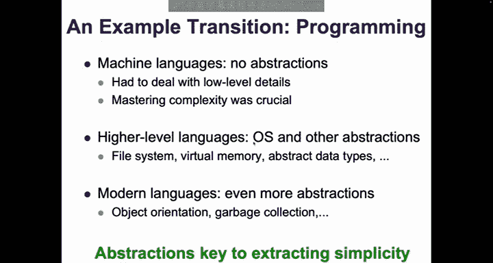

当数据中心需要同时为数以千计的不同客户（租户）提供网络服务，并为每个客户营造独立管理其网络的假象时，管理的复杂度增加了数个数量级。传统的、临时拼凑的控制机制完全无法应对。网络运营商们被复杂性彻底击败，他们迫切需要一种更简单、更系统化的设计。就像做算术题无法解决复杂代数问题一样，他们需要“代数”——也就是 SDN 所提供的抽象方法。

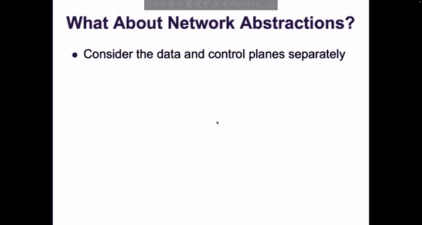

## SDN 的核心：为控制平面引入抽象

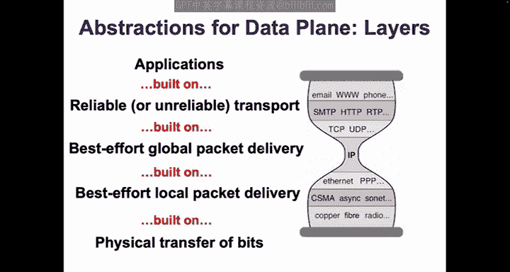

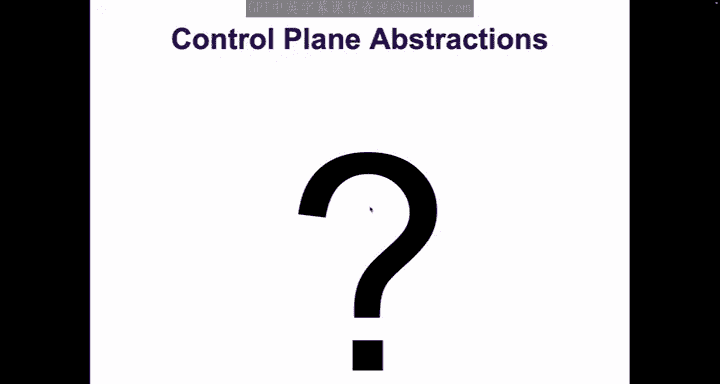

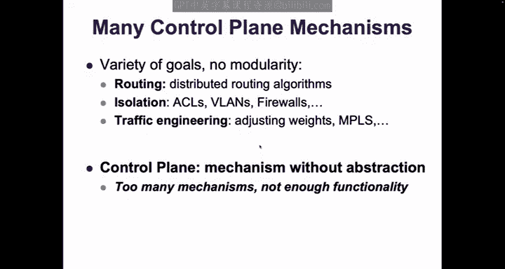

计算机科学构建大型可用系统的核心方法是**基于抽象的模块化**。通过定义清晰的抽象接口，我们可以将系统分解为模块，每个模块隐藏其内部复杂性，只通过接口与外界交互。


互联网的数据平面正是这种思想的成功典范，它拥有层次清晰、经受住时间考验的抽象：
*   应用层构建在 **可靠的字节流** 抽象之上。
*   传输层构建在 **尽力而为的全局数据包交付** 抽象之上。
*   网络层构建在 **L2 网络** 抽象之上。
*   链路层构建在 **物理比特传输** 之上。

然而，在 SDN 之前，控制平面**没有任何类似的抽象**。各种控制机制（路由算法、脚本、流量工程）都是从头开始设计，互不重用，导致机制繁多且各自功能并不出色。

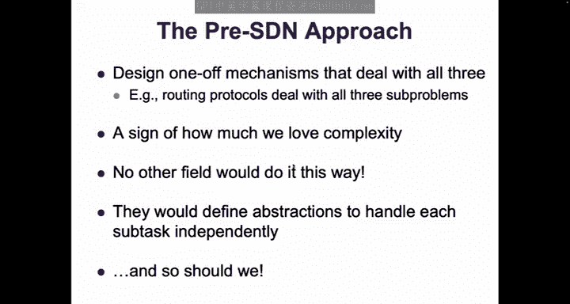

**SDN 的本质，就是为控制平面寻找合适的抽象。**

控制平面的总体任务是：在满足各种需求（连通性、隔离、安全、流量工程等）的前提下，计算网络中所有设备的转发状态。这个任务可以分解为几个子任务或约束：

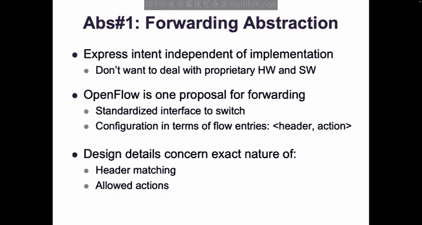

1.  **与底层硬件和软件兼容**：网络设备来自不同厂商，内部数据结构和查找机制各异。
2.  **基于全网状态做决策**：许多控制逻辑（如路由）需要了解整个网络的拓扑等信息。
3.  **计算每个物理设备的配置**：需要将高层策略转化为每个交换机/路由器的具体转发条目。

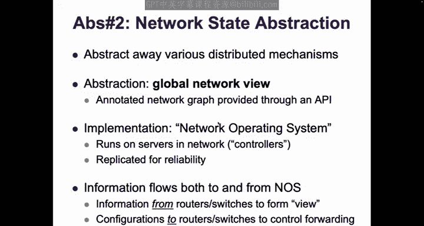

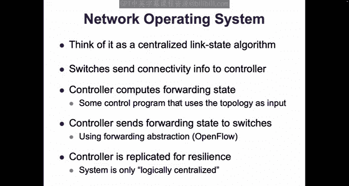

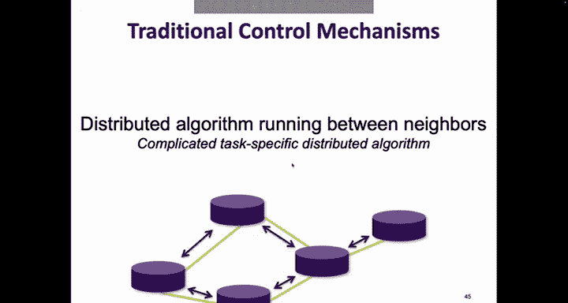

传统的“前 SDN”方法是为每个特定任务设计一个“一站式”的分布式协议，该协议需要同时处理上述所有方面。SDN 则希望通过定义抽象来分离这些关注点。

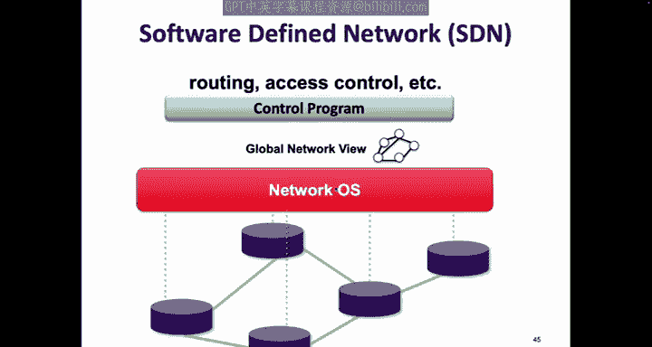

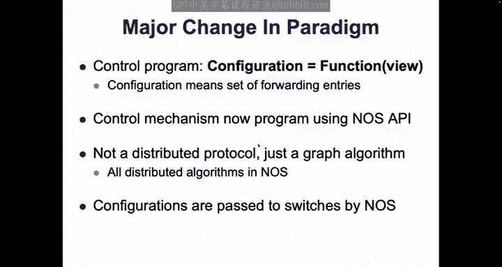


以下是 SDN 提出的三层抽象，对应上述三个子任务：

### 1. 转发抽象（如 OpenFlow）
这个抽象的目标是：向设备表达“应该做什么”，而不关心其内部如何实现。
*   **核心思想**：定义一个通用的转发模型，使控制层能够独立于厂商专有硬件和软件来指定转发行为。
*   **示例**：OpenFlow 协议。它本质上是一个描述匹配-动作规则的接口。控制器可以告诉交换机：“如果数据包头符合**某个模式**，则执行**某个动作**（如转发、丢弃、修改）”。
*   **代码示例（概念性）**：
    ```python
    # 伪代码：一个 OpenFlow 流表条目
    flow_entry = {
        "match": {"ipv4_dst": "10.0.0.1", "tcp_dst_port": 80},
        "action": "FORWARD(out_port=3)",
        "priority": 100
    }
    # 控制器将此条目下发给交换机
    switch.install_flow_entry(flow_entry)
    ```

### 2. 网络状态抽象（网络操作系统）
这个抽象的目标是：为控制程序提供一个全局的、一致的网络视图。
*   **核心思想**：将分布式状态收集机制（如链路状态协议）抽象出来，集中到少数称为“控制器”的服务器上。这些控制器共同维护一个逻辑上集中的网络图谱。
*   **工作方式**：网络设备（通过 OpenFlow 等）向控制器报告其邻居信息。控制器汇总这些信息，构建出全局网络拓扑图。控制程序可以基于这个全局视图（一个图）来编写算法，计算所需的转发状态。

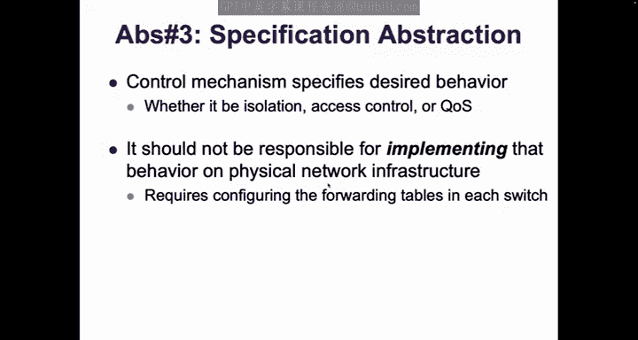

### 3. 规范抽象（虚拟化层）
这个抽象的目标是：让控制程序只需指定“想要什么行为”，而无需操心“如何在物理网络上实现”。
*   **核心思想**：在控制程序和网络操作系统之间引入一个“虚拟化层”。该层向控制程序呈现一个简化的、与任务语义相关的抽象网络视图（例如，一个将所有主机连接起来的大交换机）。控制程序在这个抽象视图上指定策略（如“A 不能与 B 通信”）。虚拟化层则充当编译器，将这些高级策略“编译”成具体的、针对物理网络设备的配置指令。

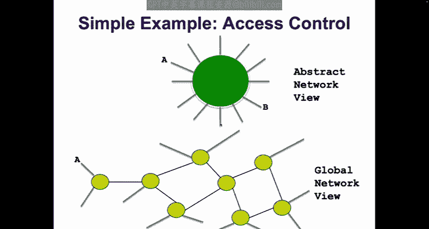

综合以上三层，完整的 SDN 架构栈如下图所示（概念图）：
```
+-----------------------+
|   控制程序 (Control Apps)  |  (例如：路由、访问控制、负载均衡)
|  (基于抽象网络视图编程)      |
+-----------------------+
            | API
+-----------------------+
|   虚拟化层 (Virtualization) |  (将抽象策略编译为具体配置)
|  (提供抽象网络视图)         |
+-----------------------+
            | API
+-----------------------+
| 网络操作系统 (Network OS)   |  (维护全局网络视图，管理设备)
|  (逻辑集中式控制器)         |
+-----------------------+
            | OpenFlow/南向接口
+-----------------------+
|   物理网络设备 (Switches)   |  (执行数据包转发)
+-----------------------+
```

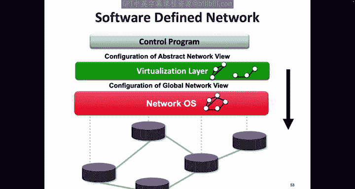

通过这种分层抽象，SDN 实现了关注点分离：
*   **控制程序**变得简单：只需基于抽象视图声明意图。
*   **复杂性被局部化**：所有复杂的分布式协调、状态一致性维护、策略编译等工作，都被封装在可重用的 SDN 平台（虚拟化层和网络操作系统）中。

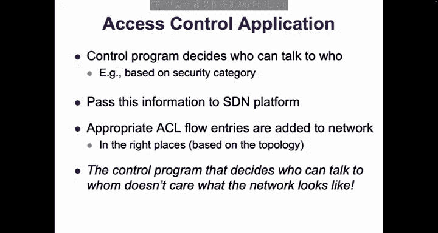

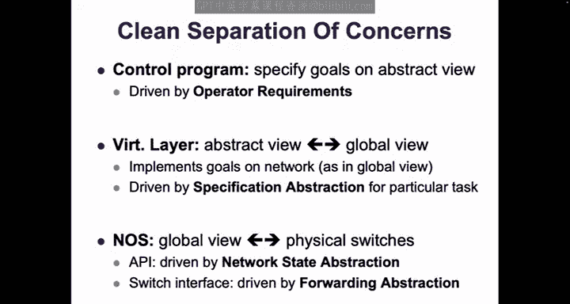

## SDN 的部署与实际影响

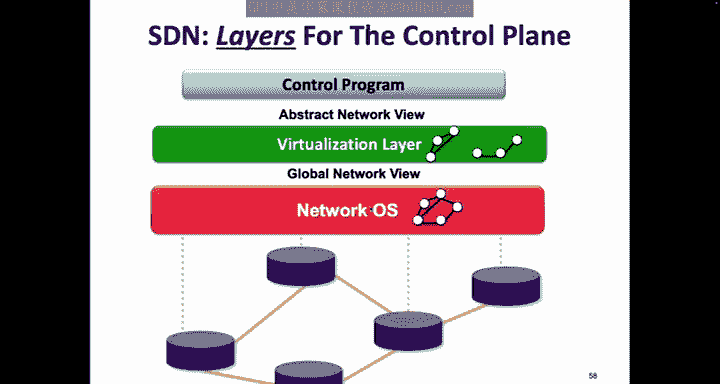

一个关键问题是：SDN 要求网络设备支持 OpenFlow 等新接口，如何能在现有网络中部署？答案在于发现：大多数控制平面功能（如访问控制、VLAN）可以在网络**边缘**实现，而网络核心只需高效地转发数据包。

当时迫切需要 SDN 的“多租户数据中心”恰好提供了完美的部署环境。在这些数据中心中，大量虚拟机运行在宿主机上，虚拟机之间的流量以及虚拟机外出流量，首先会经过宿主机上的**虚拟交换机**。

通过将虚拟交换机（如 Open vSwitch）改造为支持 OpenFlow，就能在完全不更换硬件网络设备的情况下，在数据中心边缘部署 SDN。管理员只需与负责计算资源的团队合作，在服务器上部署软件即可。这正是 SDN 最初得以快速落地和推广的原因。

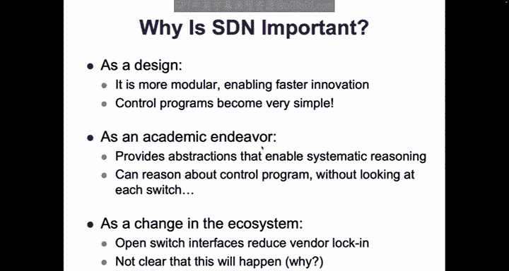

SDN 的设计带来了重要影响：
*   **促进创新**：控制程序变得更简单、更模块化，加快了新网络功能的开发。
*   **赋能研究**：清晰的抽象使得形式化验证等工具更容易应用于网络。
*   **改变生态**：它挑战了传统网络设备厂商的商业模式，虽然未能完全颠覆，但深刻影响了云服务提供商（ hyperscalers ）的网络建设方式。

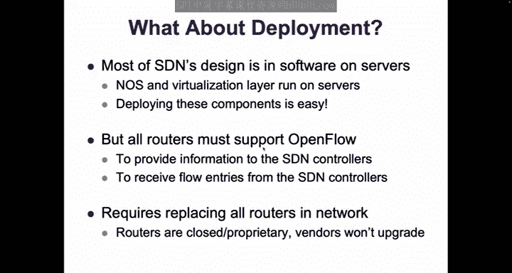

关于 SDN 的一些常见问题：
*   **SDN 是否更不可扩展、不安全、不可靠？** 否。SDN 的设计可以做到具有良好的扩展性、安全性和弹性。
*   **SDN 能扩展到广域网吗？** 可以，相关研究正在进行。
*   **OpenFlow 是正确的转发抽象吗？** 社区普遍认为不是。它过于复杂且不够灵活。像 P4 这样的可编程数据平面语言是更有前景的方向。
*   **SDN 可以增量部署吗？** 可以，正如在虚拟化数据中心中的部署所示。

## 总结

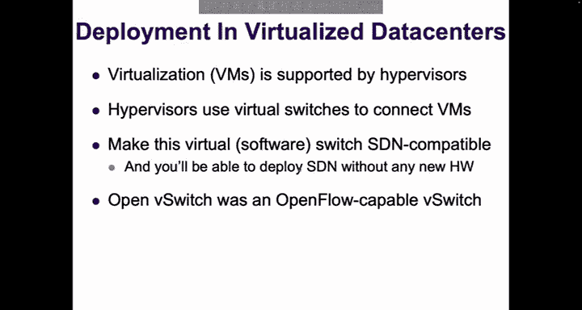

本节课中我们一起学习了软件定义网络（SDN）。我们从其诞生的背景和动机开始，分析了传统网络管理因目标增多而陷入复杂混乱的困境。我们探讨了从“掌控复杂性”到“提取简单性”这一思维转变的必要性，以及多租户数据中心的需求如何成为 SDN 发展的催化剂。

SDN 的核心贡献在于为控制平面引入了三层关键抽象：
1.  **转发抽象**（如 OpenFlow）：分离了转发行为规范与设备具体实现。
2.  **网络状态抽象**（网络操作系统）：提供了逻辑集中的全局网络视图。
3.  **规范抽象**（虚拟化层）：允许控制程序在高层声明意图，而由下层负责编译实现。

这些抽象通过基于模块化的设计，将复杂性封装在可重用的平台层，从而简化了网络管理程序的开发，并最终通过虚拟交换机在数据中心边缘成功部署，推动了网络的创新与发展。SDN 并非魔法，而是一次将计算机科学中经典的抽象与模块化思想应用于网络控制平面的成功实践。