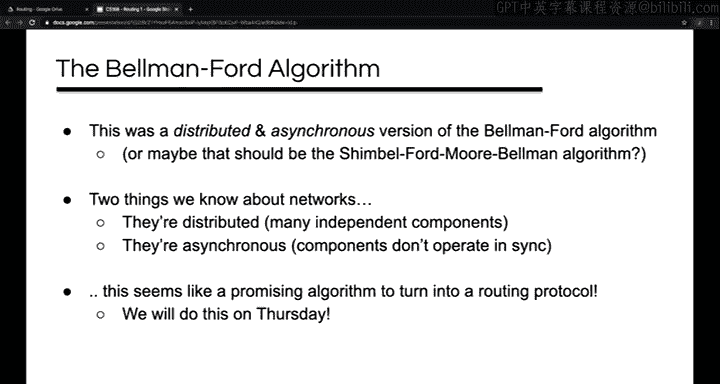

# 互联网导论：架构与协议｜CS 168：P5：路由基础

在本节课中，我们将开始探讨网络中的一个基本问题：路由。我们将了解路由器的概念、路由与转发的区别，并学习如何判断路由状态是否正确。

## 概述与场景设定

今天的课程计划如下：首先，我们将简要说明地址的概念，然后讨论什么是路由器以及为什么需要路由器。接着，我们将介绍路由和转发各自面临的挑战，并对两者进行比较。之后，我们将进入理论部分，学习路由的图表示法和路由状态有效性的概念，并了解如何利用这个概念来验证路由状态。最后，我们将进行一个课堂活动。

需要说明的是，路由的实现方式多种多样。我们今天的初步讨论将主要围绕典型的互联网工作方式展开，并基于此做出许多假设。下周我们将讨论一些替代方案。

## 地址与主机

回想两周前关于数据包头的讨论，我们说过数据包头必须包含一个特定字段。这个字段是**目的IP地址**，或者更广义地说，是**目的地址**。虽然理论上可以构建一个不需要此字段的网络，但对于所有我能轻易想到的网络技术，尤其是互联网，这确实是必需的。

这暗示着主机拥有地址。实际上，主机可能拥有多个地址。原因主要有两个：
1.  主机可能在不同网络层拥有不同的地址（例如，L2的以太网地址和L3的IP地址）。
2.  主机可能连接到多个网络，在每个网络上拥有不同的地址（例如，手机同时连接Wi-Fi和蜂窝网络）。

在接下来的路由讨论中，我们将进行更抽象的思考，将主机视为拥有一个单一的抽象地址。

## 什么是路由器？

路由器是一个中间节点，通常连接多个邻居。在网络图中，我们通常用方块或圆圈来表示路由器。

从实际设备的角度看，路由器有多种形态：
*   家用Wi-Fi路由器。
*   数据中心中常见的“机架顶部交换机”（如24端口或96端口的Cisco Catalyst交换机）。
*   大型ISP中使用的高带宽、多链路的运营商级路由器（如Cisco CRS1）。

在本课程中，我们主要将它们视为方块。

## 为什么需要路由器？

假设我们有一些主机需要通信。
*   **全连接网络**：每对主机之间都直接连接一条链路。这种方式延迟低、带宽专用、健壮性好（单条链路故障不影响其他通信），但**扩展性极差**（链路数量随主机数呈平方增长）。
*   **共享总线网络**：所有主机共享同一根线缆。这种方式成本低、添加主机容易，但**带宽共享导致竞争**、**单点故障影响大**、且难以扩展到全球规模。

引入路由器作为中间节点是一种折中方案：
*   不需要指数级数量的链路。
*   流量不必全部共享单一链路，带宽利用率更高。
*   如果某条链路故障，可能找到替代路径。

## 路由的挑战

路由的基本挑战是：当一个数据包到达路由器时，路由器如何知道下一步应该将其发送到哪里，以确保其最终到达预期目的地？

我们希望数据包沿着“好”的路径传输。“好”的定义因上下文而异，可能意味着最低成本、最快速度、最高可靠性或最少跳数。

我们需要路由算法能够适应任意的网络拓扑，因为网络图可能千差万别（如运营商网络、校园网、企业网、数据中心网络），并且网络拓扑是动态变化的（设备故障、链路增加等）。

## 转发的挑战

转发是路由器在数据包到达时面临的另一个挑战。路由器需要决定将数据包重新发送给哪个邻居，并且这个决策必须非常**快速**（数据包到达速度可达纳秒级）。

几乎 universally 的解决方案是使用简单的**表查找**。

以下是一个网络示例，路由器R2可能有一个如下所示的转发表：
| 目的地址 | 下一跳 |
| :--- | :--- |
| A | R1 |
| B | R3 |
| C | R3 |
| D | R4 |
| E | R4 |

例如，如果R2收到一个目的地为B或C的数据包，它会将其发送给R3。

在实际底层，路由器需要确定从哪个物理端口发出数据包，因此转发表也可能将下一跳映射到端口号。逻辑上，这两种表示是等价的。

在这种方式下，转发决策仅由数据包头中的**目的地址字段**和转发表中对应行的值决定。这被称为**基于目的地的转发**或**基于目的地的路由**，是最基本、最常见的方式。

## 转发与路由的比较

总结一下路由器做的两件事：转发和路由。
*   **转发**：查看数据包的目的地址，查询本地转发表，并将数据包发送到表中指定的邻居。这是一个**本地**操作，只涉及到达的数据包和本地表。它是路由器**数据平面**的主要功能，操作时间尺度在数据包到达级别（纳秒级）。
*   **路由**：路由器之间相互通信，以确定如何填充转发表。这是一个**全局**操作，需要了解非本地信息（如目的主机的位臵）。它是路由器**控制平面**的主要功能，操作时间尺度较慢，通常在网络发生变化时（如链路故障）才需要更新。

## 路由理论：图表示与有效性

我们可以通过数据包遵循表项所走的路径来绘制图。对于一个特定的目的地，由于每个节点只有一个下一跳，所以路径会形成一个**以目的地为根的有向交付树**。这是一个覆盖所有节点的**有向生成树**，所有边都指向根节点。

我们期望路径是“好”的，而“好”的最低要求是数据包最终能到达目的地。因此，能够推理这一点很有用。

我们需要区分两种状态视图：
1.  **本地路由状态**：单个路由器上转发表的内容。仅凭此无法评估其有效性。
2.  **全局路由状态**：所有路由器上所有转发表内容的集合。这决定了数据包在整个网络中采取的路径。

我们说全局状态是**有效的**，如果它产生的转发决策总能将数据包送达目的地。路由协议的目标就是计算有效的状态。

那么，如何判断路由状态是否有效呢？对于基于目的地的转发，存在一个简洁的正确性条件，由以下定理描述：

> 全局路由状态是有效的，**当且仅当**对于所有目的地，既没有**死胡同**，也没有**环路**。
> *   **死胡同**：数据包到达一个节点，但该节点没有对应的下一跳表项（目的地本身不计为死胡同）。
> *   **环路**：数据包在一组节点中无限循环。

**必要性证明**：如果存在死胡同或环路，数据包显然无法到达目的地。
**充分性证明**：假设没有死胡同和环路。数据包不能重复访问同一节点（否则是环路），也不能在到达目的地前停止（否则是死胡同）。因此，它只能在不同节点间移动。由于网络节点数量有限，它最终必然到达目的地节点。

## 验证路由状态有效性

如何利用这个定理来验证状态有效性？我们聚焦于单个目的地，忽略其他主机。
1.  对于每个路由器，标记出指向其下一跳的箭头。
2.  消除所有没有箭头的链路。
3.  观察剩余的图。状态有效**当且仅当**剩余的图是一个**以目的地为根的有向生成树**（所有箭头指向根，无环路）。

让我们看几个例子：
*   **示例1**：箭头形成一棵汇聚于目的地A的树。**有效**。
*   **示例2**：某个节点没有出箭头，是一个死胡同。**无效**。
*   **示例3**：箭头形成一个闭环，与目的地断开。**无效**。
*   **示例4**：一个节点有两条出箭头，这在基于目的地的转发中不可能发生。
*   **示例5**：存在死胡同。**无效**。可以通过为该死胡同节点添加一个指向任何邻居的箭头来修复。

检查过程很简单：死胡同（无出箭头）和环路（与目的地断开的循环）都很明显。只需对每个目的地重复此过程，即可判断整个全局状态是否有效。

这个“无环路、无死胡同”的基本规则可以推广到任何基于固定包头进行确定性转发的系统，不仅限于基于目的地的路由。

## 课堂活动：分布式路由算法模拟

我们进行了一个模拟分布式路由算法的活动。规则如下：
*   每个人初始“魔法数字”为无穷大。
*   目标是获得尽可能低的数字。
*   如果邻居提供给你一个比你当前数字更低的数字，你就接受它作为你的新数字。
*   一旦你的数字更新，你立即向你的所有邻居提供“你的数字 + 1”。
*   活动后期，我们引入了“信封”，你需要将信封传递给给你数字的那个人（你的“最佳朋友”，即数字比你小1的邻居）。

这个活动模拟了**贝尔曼-福特最短路径算法**的分布式异步版本。它展示了如何在分布式、异步的网络环境中，通过本地邻居间的信息交换，逐步计算出到达特定目的地（活动中的“Ian”）的“距离”（即跳数）。信封沿着计算出的“距离”梯度向下传递，最终到达目的地，这模拟了数据包沿着路由表确定的路径转发。

活动中可能出现的问题（如分区、忘记数字、更新错误、丢包、链路故障、恶意行为）也反映了真实网络中路由协议需要应对的挑战。

这类实现贝尔曼-福特风格算法的路由协议被称为**距离向量协议**。相邻路由器交换一个“距离向量”（即到各个目的地的距离列表）。RIP协议就是这类协议的典型代表。

## 总结

本节课中，我们一起学习了路由的基础知识。我们了解了路由器的角色、路由与转发的区别及其各自挑战。我们学习了用图论表示路由状态，并掌握了通过检查“无环路、无死胡同”来判断路由状态有效性的关键定理。最后，通过课堂活动，我们直观体验了距离向量路由算法（如贝尔曼-福特算法）如何在分布式网络中运作。下周我们将深入探讨距离向量协议的细节。