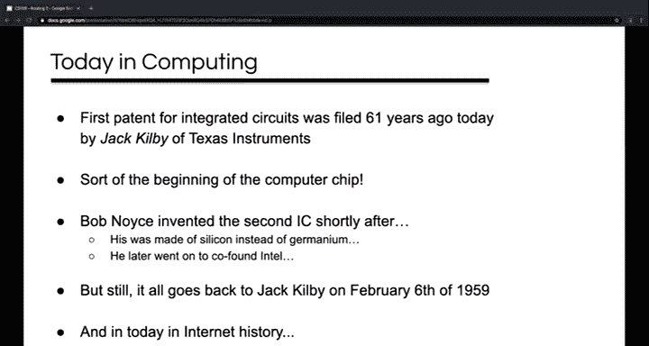
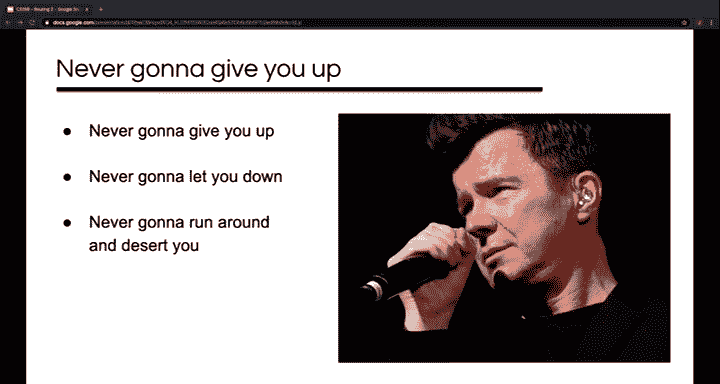
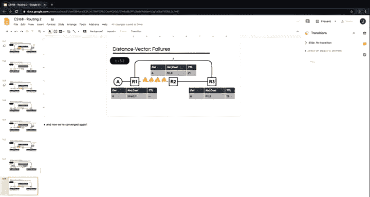

# UCB《互联网导论：架构与协议｜CS 168 Introduction to the Internet： Architecture and Protocols》 - P6：-6- Routing 2 - GPT中英字幕课程资源 - BV1VcrrYUEL5

Can you all hear me， yes？All right， so today begins rowing。Roouting lecture two。

It'sStart out today in computing。😊，61 years ago， Jack Kirby of Texas Instruments patented the first integrated circuit。

 so the beginning of the computer chip， he made his out of Germanermanium， which of course。

 you know semiconductors these days are mostly made out of silicon。

 that was invented by Bob Noyce a little bit later， he went on to found Fairchild and then Intel。

 but。😊，Jack Kilby was where it started February 6 of 1959。

Today in internet history。I'm not Rick or Ro you， it's Rick Aston's birthday。

If you don't know what this has to do with the internet， you will not learn it in this class， but A。

 how， and B lucky you。

All right， so today I'm going to start out talking about some kinds of routing and some kinds of router。

 a couple ways of classifying things。😊，Intra domain and Inter domainomain routing。

 which we'll get the term IGP and EGP。 We'll talk about internal and external routers。

Then I'll talk about this notion of least cost routing。I'm going to introduce a couple of terms。

 trivial and static routes。😊，Then' going to go into distance vector in depth。😊。

And end up maybe doing if we have time， a second version of the routing activity。All right。

Kinds of routing kinds of routers。So the internet does not in fact work。

By having one single gigantic instance of a single routing protocol。The internet is。

 as we have said a number of times， it's a network of networks。

 and the best way to route on one of those networks may not be the best way to route on another。😊。

Somebody have an idea why that is。Why might you route differently on different networks？現在て番で。Yeah。

 so the suggestion was the one from last time wouldn't scale too well because of how many routes you need to keep track of。

😊，Yeah， it would work fine in a smaller network but maybe wouldn't scale to a big one。

 certainly I think you're right， especially the way we did it last time things will change a little bit when we talk about some tricks with addresses instead of just having a single address for everything like we did today and that'll be next week。

 but yes that's why and anybody any other thoughts。😊。

On why you might route differently on different networks。いや。Yeah。

 so the sparsity of the network may be different， right， that's what you're good at。😊，Yeah。

 so you know you may have networks with you know a bunch of nodes and very few links or you may have ones with some number of nodes and a very large number of links right。

 you may remember you saw this data center topology last time which was you know very structured and very heavily connected and the best way to route may change depending on that factor anybody have。

😊，Any other ideas？Well those were two great answers I wrote down。Some。

 the density or sparsity is in there， there are a couple things here to do with scaling。

 but you know I mean the high level takeaway is that you know like different networks are different。

 you know they may be different physical sizes， they may have really different you know propagation delays。

 they may have different bandwidths， they may have different numbers of hosts。😊，You know。

 they may have been built at very different times right and you know things may have sort of moved on technologically people may have had better ideas for how to route over time also depending on who built the network and what for you know they may have different amount of resources and different amount of investment in it right if you're someone like Google you can spare some manpower and some equipment power and so on for your network because you know it's very core to your business on the other hand if you know it's something mostly used by your employees to waste time then maybe not so much。

 so you know there's a whole bunch of different factors that might change sort of how you route。😊。

So the sort of notion that the internet embraces is you let individual networks choose how to route inside their own network。

 and we call that intra domain routing。😊，And then all the networks agree on how to route between those networks。

 and that's inter domainomain routing。So to sort of sum this up， intra domainoma routing。

 more or less means routing within a single network， technically it's an autonomous system。

 I believe we'll come to that term later in the semester。😊。

The protocols used inside a domain are often called IGPs or interior gateway protocols Gway here is sort of a。

😊，A little bit of an antiquated term for router in this context。

And a number of these are actively used today， there are some based on distance vector as we've been talking about。

 there' are some based on another type of protocol called Link state。

 which we'll talk about next week。😊，And then inter domainomain routing is it's routing between networks。

 it's routing between these autonomous systems， and this routing is sort of like the glue that binds all these separate networks into the internet。

😊，So the protocols used for interdomain routing are called EGPs or exterior gateway protocols。

 and there's only one of these used at a time ever。

 all the ASs agree on this and so the internet has used this one called BGP since the mid-90s。😊。

So much of the discussion this week and next week is really very general。

 it's going to be true of any routing， but kind of the focus for these two weeks is on intra domain routing。

 routing within a particular network， and we're going to talk about BGP specifically later。

 I believe it's now going to be week seven。😊，Sort of graphically here， here's this diagram。

 it looks something like one that we've seen before where you have know these different domains that may be different things。

 you know you may have a university network， you may have a couple different ISP。

 you may have some cloud service provider and。😊，So， you know。These domains。

Have their own networks and there's links and routers connecting these domains。

 and so these routers I' run some EGP today that means they run BGP。😊，But internally。

 these domains have a bunch of routers and a bunch of hosts of their own。😊，Inside these domains。

 they kind of each choose their own IGP to run their own interior gateway Roing protocol。U。

And so you can sort of classify the routers here as being border routers。

 the ones that connect the domains to each other， and internal routers。

 the ones that are used within the domain。😊，Is that clear anybody any questions on？Internal。

 external IGP。O。So now I'm going to introduce this concept of least cost rounding。

And so last time we mentioned that we wanted good routes， right？

What was the first thing that we said， the kind of most important thing that makes a route good？

Yeah lets the packet get to the destination it lets the packet get to the destination right it works that's kind of the first thing that you might look for and so you know we kind of touched on you know the state for these must not have any loops。

😊，And it must not have any dead ends， both of these things， as was brought up on Piazza， you know。

 there's this sort of ambiguity where De Morganorgan's law meets English。

 and so you need both of these things to be true。😊。

The second goal is that we want them in some way good。

 and commonly this is done by minimizing some bad value， which you might call a cost。

 hence lease cost routing。😊，So in our activity last time。We were actually trying to minimize a cost。

 what were we trying to minimize？Yeah。Yeah， the number of hops it took to deliver message， right。

 the number of， in this case， you know people in this room that it needed to go through。

 each one of those was a hop， right？😊，And so what are other things that we might choose to minimize。

 what might be good things to minimize on a network， I talked about some of them last time。

 anybody remember or have any ideas of their own。Yeah。The latency。

 like the actual time to get it from the source of the destination， right？Yeah。

Any other things we might want to minimize？Yeah。You might want to avoid competitors。😊，Yeah。

 I suppose you might be able to find a way to phrase that as a minimization problem。

 like the number of hops that belong to your competitor that you go through。Any other thoughts？Yeah。

 so you know， price would be one if there was some actual know monetary value associated with some of these links。

 you know， not all links are equally cheap， you know， satellite links， for example。

 might be very costly， they might also have very large latency。😊，嗯。Distance， unreliability。

 other things， but for this class in many cases， we don't really care。

 we can sort of abstract this away。😊，And so if we have some topology like this with some routers。😊。

We can just associate a cost with each edge in a graph theory， you' would just call this a weight。

And then you look to find a path with the smallest sum right。

 so if you're looking for a path from R5 to R3， this one along the top has a cost of 12。

 so that's not it。😊，This one has a cost of five， so that's going to be your least cost path between R5 and R3。

And so you may well have seen this before if you've taken an algorithms class or anything like that。

In the routing activity， every edge， essentially you could think of it as having a cost of one that gives you the hop count if we don't give you costs on an exam or something。

 just assume that they're one if we don't give you any。😊。

And so you might ask you know where do these costs come from right I mean I just wrote them on that graph but I mean know where do they really come from and so generally they're going to be local to a router a router is going to know the costs of the links that are directly attached to it。

 these might be something that are configured by an operator they may actually get into the router and configure it and tell it this link is going to be this cost they may be determined automatically OSPF which is an IGP of a type called link state which we'll talk next week。

 uses the link bandwidth and essentially higher bandwidth is a smaller cost so you can think about it like one over the bandwidth would tell you a smaller cost for a higher bandwidth。

So thinking about least cost paths， you know they're an easy way to avoid loop you know loops right because no reasonable metric is minimized by traversing a loop right I mean if you had a negative metric。

 then yes， but if you had a negative metric on a loop then actually you minimize it by staying in the loop forever right so no reasonable metric for networks is negative like that usually。

😊，Leasase cost routes are also destination based， right。

 like all you need to know to follow a least cost path is the destination。😊。

And you know they form a spanning tree， which implies that they have no loops。

 but we sort of looked at this concept of these delivery trees that were laid to spanning trees last time。

😊，So a terminology note here， when I say shortest path， I mean least cost path。

 you know when the weights are one， these are the same things， they're just the hop count。

 but the text uses shortest path specifically to mean based on the hop count and it uses least cost path when it's talking about edge weights。

 I think this is actually kind of unusual but that's what the text does。😊。

Any questions on least cost routing？All right， moving on。So trivial and static routes。

So there's a couple kind of routes which are uninteresting。

And you probably get them kind of for free， and therefore I will often ignore them。

 but I want to mention what they are， I'm going to call them trivial routes。

 which is not a standard term， but it's how I'm going to classify them together。😊。

And so the first one of these is a route to yourself， with a cost of zero。

 there's no better way to get to yourself than yourself。😊，In some contexts。

 these are called loopback routes， but don't feel a need to remember that。

 but if you ever read that because you are。A masochist and reading Cisco documentation。

 that's what this refers to in lots of scenarios， you know these don't even end up in routing or forwarding tables。

 you know it's just sort of assumed that these exist that you can reach yourself。😊。

The second one I mentioned last time and it's a default route， and it makes sense。

 especially in a case like A B and C here where each of them only has one link if any of them have a packet that isn't to themselves。

 then you know the one possibility is your one neighbor you don't need a detailed routing table to know that the only way that you might possibly reach your destination is using your one hub that makes sense。

😊，嗯。So you sort of just have this wild card entry， you know， like here。

 like if the destination is anything， then the next top is going to be R1 at some cost。In fact。

 you often also just have， even if you have multiple links。

 you probably have a default route because you're probably going to prefer some links to others。

 for example， your cell phone may have a link of virtual link。

 you know a wireless link between your phone and your cellular network and your phone and some Wi-F network。

 and you probably want to have a default route for the Wi-F network right because it's probably going to be less costly for you。

😊，Any questions on trivial routes？Okay so the other one is static routes and this is a standard term and so static routes are manually entered by an operator。

 so why would you do this， why would an operator want to manually enter a route。

 we're talking about these routing protocols they're supposed to know populate routing tables for us。

 why would an operator do it manually。😊，Yeah。Ro that is likely to stay up。

So maybe it's a route that's likely to stay up for a long time， yeah。

 and you don't need to have some dynamic protocol to figure it out， sure。Monitoring reason。

Can you say a little more？A censorship thing。嗯。Well。

 you certainly might want to direct some traffic a certain way so that you could monitor it like get it out of its normal path so that you can do it so an operator might want to sort of override for one reason or another。

 they might want to kind of override what the routing protocol would do right the operator may just be like I know best or I know what I want to do so they're going to use this static route to kind of override it does that kind of fit with what you're thinking any other thought。

いや。You might want to keep packets from going over a competitor' network yeah sure again this sort of falls in this category of you know the operator may know best。

 you would hope that your routing protocol would actually be flexible enough to let you you know configure it so that it would do that for you for example。

 by changing the weights on some path but sure that same idea of you know operator may know best yeah。

😊，You may know what path you want to take， yeah。Maybe for debugging you may want to do it so yeah I think these are all kind of falling into the same sort of general category of you know the operator may have something very specific in mind that they're trying to accomplish and so that's certainly one reason sometimes the operator just knows what they want。

😊，Maybe more importantly is that know I mentioned last time that hosts generally don't participate in routing protocols。

 so how would a router even know where the hosts are to begin with？

And the answer is that an operator actually on the router adjacent to hosts specifically enters a route that tells it that that host is there on that particular link。

 so like for R1 here， an operator would have entered static routes for A and C。😊。

And so you can sort of see you know A andC have these static routes saying C is out port zero here。

 if ever matters， we'll note that they're static somehow。

 and I've shown it here using the port number style of table that we looked at last time。😊。

Like I mentioned， we usually won't show them like that。

 so we'll show them something like this when we're using the neighbor name。

 we'll just use the neighbor name as the next top。So the same thing as the destination。

 or we'll say direct。And so you might not believe me at this point that some operator somewhere has actually entered your phones or your laptops address on every network that you've ever connected it to。

 but as the semester goes on， we'll talk a little bit more about how IP addresses work and we'll talk about this protocol called DHCP。

 and it should become more believable。😊，Any questions on these？じ。つ。Say this again。

 I may have missed the first part。Well， so I guess trying to draw a parallel to the routing activity。

 right？When you were sitting next to someone。In some sense。

 maybe you knew that there was a router adjacent to you。

Because they at some point tried to give you their number， right？They said， you know。

 the person next to you said， I'm offering you number 45， right？

And so that's the routing protocol that was them offering you that thing。

 and so if they're a host and they don't participate in the routing protocol。😊。

How would you know they were there？I mean， they're a person so you just look next to， but you know。

 conceptually。So there isn' you know with routers， there's this protocol that they're communicating in。

 which lets them sort of say hello to each other and know that they're there in some sense。

 but hosts don't do that。Does that make sense？Any other questions on this stuff？Okay。

So now let's talk about distance vector routing protocols。

As I mentioned last time you know they' got this long history on the internet and on its predecessor。

 ARPnet on a bunch of other early networks， going back at least as farar back as 1969。

 the sort of prototypical Dis vector protocol is R， the routing information protocol。

 which was written here at Berkeley。😊，And so our discussion of this inspector is pretty similar to R in a lot of ways。

😊，It's got this strong relationship to the Belman Ford shortest path algorithm and our in- class exercise was basically a version of Bellman Ford。

 it's sort of halfway between Belman Ford as you would find it in a textbook and a shortest actual useful routing algorithm。

 routing protocol， and so today we're going to talk about it some more and we'll get much closer to being a useful routing protocol。

😊，The text has a much more sort of formal and logarithmic write up。

 logarithmic algorithmmic write up of distance vectoror， you are welcome to read it。

 you're welcome to talk about it with people in office hours。

 but what I'm going to try to do in this lecture is give you sort of a more procedural sense of how it actually works as a routing protocol in practice。

😊，It gets a little bit tricky， so please stop me， ask questions。

 be aware that your first project is on this subject。😊。

I want to start by sort of refreshing your memory of the activity。

And I'm going to propose some small changes and so basically I was having you all pretend to be routers。

 you all had links to your neighbors， and we were routing to Ian one of our TAs。😊。

And so a major part of what you did was remember your distance from Ian along the best path as far as you knew。

 and you didn't know it was your distance to Ian at the time because I call it a magic number。

 but that's what it was and when we started，😊，You all had infinity as your distance because you didn't know about any path at all。

I also asked you to remember who gave you your number。

 but I told you not to worry too much about it because we could figure it out easily later。

 and I didn't want to burden you with remembering two things。

 but that person who gave you that number， which we called your best friend， of course。

 that was the next hop on the way to Ian。But you especially if you'd written it down， right。

 you could have kept track of this too， you didn't need to figure it out after the fact。

 right you could have kept track of both the distance and the next top at the same time， right？Right。

I'll take that as a cent。So when you changed your mind about your distances， right。

 when you got a new number。You immediately told your neighbors， right。

 because it might change their mind about what their best distance is。And。

You added the additional hop when you offered them the number， right， I had you take your number。

 add one and offer it to the person next to you。But you could have just told them your distance and had the neighbor add the one right like that's equivalent which one of you does't right I did it the way I did it because this way you only had one person doing the addition and the other person doing the comparison。

 I thought that would be easier doing one operation per person instead of both。

 but I think you would agree that especially if you' were writing a program you could certainly do these both at the destination side。

You also you added one every time you did it right one more hop。

 but you could have added some arbitrary other number right， you could have said。

 you know we could have had a rule like， well， if the neighbor that you're handing it to is wearing blue and gold。

 then the cost is one， if they are not， then the cost is two right。

 and then we'd have paths that like optimized for people with Berkeley spirit。

You could have taken the number and added your age to it and then we would have been finding paths with like you know the least you know average age right so I mean you could have added any number besides just one and you could have added a different number for different neighbors。

 right？And finally you could have done this for multiple destinations right I mean I didn't want to have to have you keep track of an IA number and a Sya number and a Vaasu number and whatever。

 so I just had you do one， but you could have especially if you were writing them down that would have worked right you could completely independently say。

😊，I offer you the Ean distance of seven and the raphael distance of 10， right？听你。

They'rebody good with this。All right， so quick aside now。呃。

I wanted to sort of relate what we were doing to something some concepts that we covered last time。

 and so last time I had this slide that looked very much like this at one point。And was comparing。

 routing and forwarding， and it said routing。Communicate with other routers to determine how to populate tables for forwarding。

And forwarding looks up packet's destination and table and sends packet to given neighbor。So。

Figuring out your best friend。By sharing magic numbers was routing， right。

 That was building routing state。You knowYour number， your magic number was your routing state。

 it was the distance to the destination。So what was forwarding？In the exercise。Yeah。

It was referencing your magic number， sure， that's true。Do you guys have a different answer？

giving the。Yeah， it was giving the envelope to the neighbor。

 it was passing that envelope right I mean when you passed the envelope you were referencing that state to figure out who to pass it to right but you got an envelope some of you anyway and you thought who's my next top and you passed the envelope to them what's a packet？

😊，The envelope a， right， the envelope lo was the packet。So that's forwarding。

 right forwarding is the one that actually got the data， the message to the destination。😊。

That's what forwarding was， the way you' figured out how to do the forwarding。

 that's what routing was。Is that clear？I know the two concepts can be a little bit muddled at first。

 but hopefully having done it physically， I hope that connects。All right。

So I wanted to compare what we were you know， compare the normal serial Belman Ford algorithm that you'd see if you looked it up in an algorithm's text with what we were doing in class。

 so the serial Belman Ford algorithm is something like this unless I，😊，Misremembered， wrote a bug。

 but I think it's pretty much that。And。Don't worry about trying to understand immediately everything that it does。

 but we can see some things that we recognize， you know， the magic number and the best friend， right。

 the distance in the next talk， it's keeping track of these things。😊。

We started with infinity right except for the destination， Ian who started with zero。

 right these are sort of the setup， the initial conditions。😊。

And you can see where it compared an offer to a current value， right。

 it looked to see is some distance from my neighbor is my neighbor's number。

 plus the distance to my neighbor。😊，Smaller than the distance that I currently have now I'm distance R2 and you know。

 if that's true， then you accept the offer， you change your distance to be the distance of your neighbor to the destination plus the distance from you to the neighbor。

 right？And then you remember your best friend， right， you remember your next top。

But we were doing this in parallel， right？Nobody iterated over all of the links。

 no one person iterated over all of the links when we were doing this experiment right。

 you only ever iterated over know the links that were directly attached to you right your immediate neighbors together all the links got iterated over。

 but no one person did it right as in the serial version of this algorithm。😊。

And we did it asynchronously， right， like everything here。You know。

 looking at your neighbors and comparing the distances。

 each one of you was doing that individually asynchronously right you weren't all like being like okay everybody it's time to exchange your numbers with your neighbors。

 it's time to compare it's time to exchange your numbers with your neighbors right we weren't doing it in this lockstep sequence like the serial version of the code here you are all doing it at different times and probably at different rates。

 you probably did different numbers of this。😊，So， you know， you were doing it you know。

 completely asynchronously with everyone else and in parallel with everybody else。😊。

And then there's this thing like what is this thing。

 this thing wasn't really in the version that we did at all。

 this is like this termination condition for this thing。😊。

So you know the basic idea with this thing is that if you do the inner part synchronously。

 then the most steps it could ever take to get the answer is like the person with zero tells their neighbors one who tells their neighbors two who tells their neighbors three right and this is going to stop when you run out of neighbors right so like the maximum number of steps this could possibly take is the total number of routers right？

😊，So that's what this kind of termination condition is。😊，We didn't have that at all。

 it doesn't make sense if you're doing it asynchronously right because you're doing perhaps different numbers of these updates。

 but fortunately it doesn't matter the version that we did selfterinated。

 or at least it could self termminate， you know eventually everyone got or should have gotten like the lowest possible number。

At which point？You wouldn't have anything to tell your neighbor right nobody would ever give you a better number eventually because you are actually some distance away from EM right like eventually youre find the right answer。

 you have nothing else to say to your neighbors so eventually this stops。

 everyone goes quiet and we reach this new stable state that's correct and actually represents the state of the world and。

We call this being converged and getting there is converging on good routing state。And finally。

 just to drive this home， a difference from the zero version algorithm， you know。

 the inputs to this are all the routers。😊，And all the links and the outputs are all the distances and all the nexttops。

😊，But that's not what we had at all， right， you know， no single person here。Knew the whole topology。

Knew who all the routers were or even how many routers there were。Or who people were sitting next to？

All you ever knew。Was this local information about who is directly around you？

And all you knew at the end was your distance to your distance。😊，To Ian。

 not everybody's distance to Ian。嗯。So at least this worked for most people。

 I think we had some partitions， I think we had some malicious actors， but at least in theory。

 that's how this works， right？😊，And so my point with all that is that as a group。

 we did implement something very close to this serial algorithm， but everyone executed parts of it。😊。

Using parts of the input。And learned parts of the output。

Does that make sense the sort of relationship between what we did in Belman Ford？

A serial version of Belllman for it。So there was this great question after last。😊，Gasss。

Why not use Dykster as an algorithm instead， isn't it faster？嗯。So。Is it faster？I mean， the big O。

 like usually right， you know， it's got this additive part。

 even if it was e plus v right as opposed to e times v， right。

 that's going to be worse generally speaking。😊，But what's not fair about this。

 this is not an apples to apples comparison， why is this not an apples to apples comparison？对啊。哎对对因为。

Yeah， so that's a big part of it that's a good observation that you know Dykster assumes you know everything ahead of time right and we didn't。

 you in fact we never knew everything right， and sort of you know on that same sort of note。

 you know what we were implementing was this parallel distributed asynchronous version。😊，And。

You know is it possible to do with Dykests， is it efficient with dikests。

 you know the big O you know of the zero version doesn't necessarily apply to a parallel version。

 so you know we will later next class talk about an IGP routing protocol that uses Dyketra's algorithm and it does not do it by making it parallel and distributed an asynchronous so anyway it's just not sort of an apples to apples comparison here。

😊，Does that make sense。Yeah。Dys can come up with all pairs。

All sources to one destination or all destinations to one source， it can do that。呃。So I mean。

 there are variations of Dykster that do what you're saying or at least don't get all of the ones。

 but it can。Okay。Moving on a final point is that with distributed algorithms。

 the performance killer is often not the computational complexity it's the communication and you know what we did on Tuesday。

 you know you kept having to tell your neighbors essentially this quantity I've highlighted in blue here you know you keep having to communicate that but that's kind of the only thing you need to communicate different algorithms like maybe if you tried to paralyze Dystar you might find that you need to communicate other things or you might need to communicate more often so it's often you know I mean the computational complexity of some of these things you know there's an addition operator and a comparison in there you know these are things your CPU can do very fast quickly network time will probably dominate this。

😊，Okay so in a second， I'm going to get to some examples where we look at the behavior of the full network。

 but first I want to make sure that you're really comfortable with the basic table update process and so before even that I want to make sure to point out that this table can be used for forwarding too right？

😊，The way we've set it up here is there's a destination and there's a next top which looked like the tables that we looked at last time。

 but now there's also this distance in there， right？😊。

But you can certainly just use the next top to do forwarding， I mean。

 you did it with the envelope globes。And so now thinking about how we do updates of this table。

 you know， if you had this table and the person to your left told you that they could reach Ian in seven hops。

We'd say that they advertised a route to Ian with a distance of seven。😊，And you think， well。

 all right， if they can do it in seven， I can do it in eight。😊，You know。

 that's my neighbor's distance to Ian plus my distance to my neighbor。And so。

You would cross out your old entry and write in this new one， use the person to my left。

 and it'll be a cost of eight。Make sense， thumbs up。当然了。Now， the person in front of you tells you。

 I can reach Rafael in three。You might say， what， who？And。

What you do is you've got another road to your table that says， all right， well。

 using the person in front of me， I can reach Raey El in4。😊。

And you can just sort of keep processing updates or advertisements like this from your neighbors and you end up populating this table and you know you know it looks like for Shiria here。

 you know somebody told you 16 and somebody told you 13 and now somebody told you 12 right so you just kind of keep updating this every time you get a message yeah。

😊，For the versions that we're doing right now in this context， yes。Because we don't have any way of。

 I mean， we could think of having some sort of aggregate route， you know。

 you could say all the names of people from starting with the letter A。

 all the people starting with B， that sort of thing， we're not there yet， but yes。😊，Yeah。Pretty much。

 potentially yes， you know， kind of when you did it doing the activity。

 it was like when somebody told you something that changed what you would say， you said it， right？

So I mean， if people send you something and it doesn't change your mind。

 then you don't do anything if it does， then you do。

And we'll come back to that specific question in a minute。All right。

 so now let's walk through some examples starting with this really simple one and as we do later ones。

 we'll run into some problems and we'll see what we can do about them。😊，Okay。

 so right now there's nothing for this grounding protocol to do right， unlike the exercise， you know。

 we don't even have routes with the cost of infinity here， right。

 like we don't have any routes at all。 So what needs to happen。😊，Yeah， in destination。

You need a destination， how does the destination get entered into the system？

So what are the destinations？Yeah。Posts， right？And so why are there no host routes in any of these tables。

 there's a host right， A is here， Why is there no route for A？😊，いや。

Hosts don't participate in routing。So how did we fix that？Put it in manually， right， a static route。

So what's the static route look like here？Which router is it on？Everybody's say。It's on R one。

And so what's the destination column of this table going to be？I heard someone say it。It's a， right。

 we're talking about A。And this direct route to our neighbor and we'll say it's a cost of one。So。

 you know， our operator decided she thought it was a cost of one and put that in there。

 it doesn't actually matter what cost。Our operator decide to put in， does it。

 why does it not matter what cost the operator puts in here？Yeah。

It's the only way to get there right， they put in one and a path would be 10。

 they put in 100 and the path would be 110。 it doesn't make any difference。

 the only way to compare it is by adding that number anyway。All right， so what happens next？

What did you do in in in there。Yeah。You got to tell R2 that you've got this route， right。

 so we're going to make a packet to send to R2 to tell them something。

And so R one is going to advertise this route to its neighbors。😊。

And we're going to write down the source of this route advertisement。

 We'll do it on the left side of this packet here， so this is a route coming from R1。

 so we put R1 in the packet here。😊，Might be in like the source address field。And on the right side。

 we're going to put the destination that the router is referring to。And the cost。Right。

So notice that we don't put the next top in a packet right because what's R2 going to do with it。

 it's R1's next top， it's not R2's next top。not necessarily useful information for R2 to know。

That makes sense。All right。It's going to send that packet to R2。R2 looks at it and says。

 this is a route for the destination A。It doesn't have a row for A。 What's it do？Creates one， right？

And so now it's got to figure out what the next top and the cost is， so what's the next top？😊，R1。

And what's the cost？Two， right？It's one from the packet and then one for that link that it came in on。

So now the world looks like this， and now what happens。Yeah， R two， tells R three。R 2 tells R3。

But something else， I think， which is sort of interesting， happens。😊，You know。

 there's this question is this what you would have done？

Would you have sent it to both R2 or rather to both R1 and R3。

 and I doubt it you apparently would not have， I bet a lot of you didn't。Ths up。

 would you have sent the one to R1 or not？I see a lot of thumbs down。

So I think that's really interesting and I'll come back to it in a minute。

 I'll point out that I definitely said to do it in the instructions that I gave you。

 I said send it to all your neighbors， so I think this is interesting， we'll come back to it。😊。

But all right， if you violated my directions and didn't send this advertisement to R1 or wouldn't have。

 then good for you。😊，Get a。It took the early networking community。Five years。

To decide not to do that。And a lot of you seem to have done it intuitively on your first try without knowing what you were doing。

So。Interesting。All right， so pretending you actually follow my directions。

 our Wood would have gotten this advertisement here right。

 and we see that there it's an advertisement for a， which we have in our table。😊。

And if we use this advertisement， what would the cost be？What's the cost being advertised？

Just say it。Two and so what would the cost be if our1 used it？Three， right？

That's worse than the current route。So we would ignore it， right？And this other one on the right。😊。

What's the destination？Hey， and what's the next top？2。2。And what's the cost？Three。

 and so we fill that in， right？And so now what happens， are we done？Yeah。

 so if we followed my directions to the letter。😊，Our3 is going to send it back。Right。

And it's worse than the current route at R2， and so it's going to get ignored。

And now we've converged， now we're done， right， now there's nothing else to do。

Everybody's got a table entry that reflects reality， their table hasn't changed， and so we're done。😊。

Any questions on this example？😊，So for IP。For IP routing。

You know it doesn't necessarily need to- it will have them in their forwarding table。

 it gets into this bit of complexity with the layering， but in many cases for IP routing。

 you would have destinations for all the other routers。Any other questions？Yeah。

How does it work within？When a router goes down， yeah， we'll come back to that。Another question。

About adding new things， okay。So before we get to that we will come back to this momentarily what about multiple hosts and I hope you've gotten this by now but I just want to really drive home how this works with multiple hosts right so here's a version of those topology we've added a new host we've added B there is a static route that's been added 4B at its adjacent router at R3。

😊，Right？And so at some point in time。Our three would be sending these。

These advertisements to its neighbor， right doesn't really matter when these two things can happen asynchronously at the same time。

 they're completely independent， they're routing for A， they're routing for B。

 they follow the same process， but with different rows in the tables。

Does that make sense to you believe that but this thing just kind of trivially scales to hold multiple things？

Therefore， we can sort of ignore multiple hosts for many of these examples because it makes things a lot easier。

All right。I want to talk about this exception to the rule。

So thinking about our logic for when we update our table。

If we get it out and we don't have a destination on the table at all， we should add it， right。

 that's sort of one condition that we have。And another one。The big one。

What's the big one that we have， what's the big condition for when we update the table？

We've said it a bunch of times。Yeah。The cost of the new one would be less than the cost of the current one。

 right？So there it is。The current route distance is greater than the advertised distance plus the distance to that neighbor。

 you replace the current one， right？So。Here is a rounding update from R 11。For cost nine。

Are you going to update the one in our8 here？Comumbs up， if you're going to replace it。

 thumbs down if you're not going to replace it。Films down， right， We're not gonna replace it。

 This one's worse， right， The one that's there is 6。 This one is 9。 You had one。 It's going be 10。

 That's worse， Allright。How about this route from R5 with the same cost， cost9。

 you' going to replace the one that's in there。Comumbs up， replace it， comes down， don't replace it。

I see a little bit of a mix， anybody want to argue one way or the other？😊，Yeah。

Because this particular packet is coming from the router that originally。Like the lowest cost。

 something may have changed like down the road。Yes。

Something may have changed down the road like to the left of R5 here， right。

 I think you know one way to think about this is。What is the only reason that you know about this particular route at all。

 how do you know about this route， where did it come from？It came from our5。

And our five at some point told you six or told you five， right？Now R5 is telling you nine。

Have you between then and now decided that you don't trust it？I mean。

 the only reason you know anything about it is because it told you。😡。

It's telling you something different now。It's right。Does that make sense？Yeah。Well。

 so like the one in the table is this one， right？If you've got eight from R 11。So that's right。

 so I think you're getting at something here which is you know this one that's R9。

 you should accept it， you should just trust it right because know so here's the other condition right if the advertiser is the current next top right then replace the current one so that's the condition you need to think about right like if your next top the route you're using is from that same router then you want to update it。

😊，But so here we get to this thing。😊，If。If it told you 12。Right？You should update your cost to 13。

Because if that R 11 sends you this 9 again， you want to choose that9。

 So before you can choose that 9， you have to choose that 13， right？

Like if you'd left your routing table at six， then when you got that nine， the nine's worse。

 you're not going to pick it。But R5 is also telling you 12。And so if you take the 12。

 now all of a sudden the9's better。Does that kind of get at what you were getting at？Yeah。

So I see what you're saying and I think we're going to come back to this a little bit。

 but I mean you're saying it may matter what order you'll get them in。Though I would say， you know。

 you're always。Yes， so I get what your point is there， it kind of matters what order you get them in。

 you're absolutely right， we're going to come back to that in just a couple slides。😊，Yeah。

Say this again。Yeah。Yeah， and so I think that's the same question of like the ordering matters。

 and so let's come back to this in just a moment。😊，Yeah。Say this again。啊。Yes。

 so you're saying you could have some version of this protocol if I'm understanding what you're saying。

 where when F updated， I went to 13。😊，It might tell R 11 something。

 and then R 11 might say something back。Is that where you're getting it Yeah， okay， so yes。

 there are ways you could work around this problem of the ordering mattering agreed。

We'll come to a really simple version， yeah。😊，Ne to see a surgery。So instead of destroyoring the one。

 you'd store like a bunch of different like of the possibilities。

 and then you're saying when you lose one， you could maybe just pick the next best one， yeah。

 so you can do that。😊，It's a slightly different version of the algorithm the version we're going to implement doesn't do that one of the things that you find is that many of your neighbors often downstream are using the same path anyway so in one of thems wrong it ends up that they're both wrong。

 but yes that's a possibility the idea was you know you could keep track of you know the advertisements from a bunch of your neighbors and then just sort of always pick the best one。

But we'll get to a very simple mechanism for doing this。Which is this。

 it's pitched a slightly different way。 It's askinging the question of is this reliable， You know。

 we're sending these distances between neighbors， but our networks are only best effort right so those distances could be dropped。

😊，And sort of equivalent， you know the distance being dropped could be they coming in the order that you don't want right there's a relationship between these things where youve sort of missed the one you want。

 do you get a chance to fix it later， right？And so。Like earlier。

 we saw R1 create and send this advertisement to R2， what if？You know， this packet doesn't get there。

 this packet gets dropped， something bad happens to it so from what we've described so far as I think we've been coming up with。

 you know we don't really have a way to deal with this so does anybody have a really simple idea of how you could fix this problem if this routing update got dropped？

😊，You might think about if you were doing this in the activity。

The equivalent of the packet being dropped would be if your neighbor didn't hear you。

How do you fix this？Yeah。Retransmit， right？You know， if you just drop one packet。

A super simple thing you could do is just resend your announcements every so many seconds。

 and we call that so many seconds， the advertisement interval。😊。

And you know this should work eventually right assuming the link is working and it's kind of just dropping a packet here and there right if you just sort of keep telling your neighbors。

 then this will go through and similarly this solves the problem of ordering right because if you get to the you know if it sends the nine and you don't take it but then you get the 12 and then it's like oh now the nine would look good later the nine will come again if our 11 had just been sort of retransmiing。

😊，So you know what you did on Tuesday was what we'd call triggered updates right when you got something that changed your number。

 you told your neighbors， right it was this sort of reactive， triggered effect。

 you got this event it triggered your reaction， but we can also do this sort of timer based one。

And so for the sake of examples here， we'll do every 10 seconds we'll say we're going to retransmit。

😊，And so sort of comparing this sort of timed interval one to these triggered updates。Right？

Like the timed interval should always work right it gets you reliability on the other hand。

 if you're only doing every 10 seconds or every you know in the case of rip。

 it's every like 60 seconds so you know it's not as timely right between updates you know you may get an update and wait another 60 seconds before you tell somebody so one gets you reliability and one gets you you know speed does that makes sense why you have both of these two things。

😊，A final note here is that the timers， when they retransmit their advertisements。

 they're not synchronized， like every router is potentially doing it offset from the other ones。😊。

So because of the timers being offset and because of packets being dropped。You know。

 advertisements can sort of come in unexpected orders and so in the following examples， you know。

 I'll show you some things which can happen， it doesn't mean that they're always going to happen。

 It depends on you know the ordering of a bunch of these things and in particular like I'm going not show triggered updates a lot just because it makes things hard to reason about。

So a minute ago I mentioned that I thought something interesting happened。

 and I want to investigate that， so it goes something like this， R3 gets an advertisement from R2。😊。

And adds it to its table。And if R3 is advertising all its threats to all his neighbors。

 then it'll send one back like this， which R2 is going to ignore because it's worse than the existing one and a lot of you said that you didn't do this and so why not。

 why did you not do this， why did it not even kind of occur to you to do this？😊。

You want have have a reason， right？Yeah。Yeah so it's back in the same direction right like the next top would have been the one that gave it to you right so you know there's sort of no point right the route that R3 is advertising is the same one but R2 gave it in some sense right it's like R2 gave it and then R3 is trying to give it back it couldn't possibly be on the shortest path R3 could not possibly be on the shortest path between R2 and R1 considering R2 gave it the route。

😊，So aside from being pointless， that can be problematic and this is a contrived example for the sake of simplicity here。

 but this can happen other ways， and I'm just trying to make the point。

 so imagine there's a momentary power outage and R1 and R2 reboot。😊。

They come back and their tables are empty。 What's the next thing that happens？

Somebody's going to send an update， who's going to send an update。

 or three is going to send an update。This is what it's going to be， right？

It's going to accept that because it didn't have a route at all。

And the next thing that's going to happen is R2 is going to send an update， it's going to go to R1。

 right？😊，I like。What's up with our table entries right now？Are they going to forward the packet to A？

They're going to forward it the opposite direction of a， right？They're totally backwards。

So that's not so good。😊，So the sort of takeaway of here is you know。

 like why would you advertise a path back to the person who advertised it to you， you know。

 telling about your entry going through them， like doesn't tell them anything new。

And it can mislead them into thinking that you've got this independent path。

 which you don't actually have。So the solution is if you're using a nexttops path for some destination。

😊，Don't advertise that destination to that next top。Advertise everybody else， but not back to them。

And so we call this split horizon。Does that make sense？See a couple nods。All right。

 so going back a second， I want to look at another problem and you know again this is sort of a contrived example。

 but this does happen other， so let's pretend that we didn't implement split Hizon here and we'll ignore R one for the moment because it's not that interesting but。

😊，So R3 sent the update to R2 and that changed R2's table entry， right， it didn't have one before。

 now it has one， so it's going to send an update back to R3 right with this cost。

 its current cost of4， right？So would our three accept this advertisement？We got to know。

Anybody else want to accept it？I see a guess， why would accept it？Yeah。

Yeah right so this is a special case right like our current next top is R2。

 this advertisement is from R2 so we always accept it， right， this is the special case。😊。

So it's going to update its entry to five。And so later， it's going to send an advertisement。

 What's that advertisement going to be。It's going to send thisす。This update。For a cost of five。

And that should say six， but it says seven。嗯。But it's going to update it to something six or seven somewhere in there。

😊，And you know like。That's going to then advertise it back。

It's going to say oh well you know that's worse or you know it's from the right neighbor so now mine is going to be eight and so this is never going to converge right These are just going to keep toggling back and forth with each other。

 each one saying oh well you told me six so mine is going to be seven so I'll tell you seven and you say。

 okay well then mine' is going to be8 and so just goes back and forth forever and so we call this counting to infinity。

 the counting to infinity problem。😊，And again， this particular instance of the County2 infinity problem is solved by implementing split Hor。

 but there are cases you will see one in the project。

 I think you will see one in discussion where it doesn't solve it。

 but does anybody have an idea of what to do about it， the accepted solution is very simple。😊，Yeah。

Well that split horizon， right， just don't send it back ever， that would be split Hor。

 which I admit does solve it for this case， but doesn't solve it for all cases。

So how can you make sure that to solve this problem so that it's going to converge to something obvious？

How could you stop it from counting yeah？Interesting。

 you could have R2 also say where it got it from and you can sort of detect the loop right it's an interesting idea。

 we will come back to that later， not today but next week probably a good idea。😊。

But even simpler than that。So。Pick。Some maximum value。😊，And when you reach that， just stop。So rip。

When it gets to 16， it's like， all right， 16， it's unreachable， just stops。😊。

So 16 is effectively infinite for rib。 And so then you get to 16 and you stop。

 It doesn't update your table anymore。 You say， okay， And then you converge， right。

 And so you don't think in this case， youd say， okay， A becomes infinity。 A is unreachable， which。

 of course， you know， it was in this example。走。Now we come to this question that we got you know can this handle new links。

 this question was asked from up there and so we said we want to adapt to changes into apologies。

 so what if we add a new link？So imagine we've converged on this topology like we've had before。

 and we add this new link， what's going to happen？😊，Is anything ever going to happen？

There's these periodic updates， right？So at some point， R1 is going to send an advertisement。

And you know it's going to be better than the current route that's in this table。

 and so it gets updated。And so。When you add a link， pretty much just works， right？

So we're going to skip the break。And we're going to ask this question， can it handle failed links？😊。

嗯。And so let's go back to this  topology with the extra length but this time it's going to have this cost of four。

 so this network is going to originally converge to the same routes as before because R3 is getting advertisements on the top link。

 but they're worse than the routes that it's getting from R2 so it's ignoring them right？😊。

And now we're going to say that this link between R1 and R2 fails completely。

 no packets are ever going to make it across this link again。

 but there's still connectivity between every node in this topology right。

 but the paths from R2 and R3 don't work。😊，So。You know。

 what can we do to detect and handle this failure？And I'll give you a second to think about it。

 but remember first that R2 had been getting an advertisement from R1 every 10 seconds right。

 had been getting those periodic updates and now it's not。😊，How can we deal with this？Yeah。Yeah。

 so you're skipping ahead a little bit here， but you've definitely got the right idea。

 and so the idea is that you know。😊，We can add sort of another field to this table。

 a time to live and basically say a given route only lives for a certain amount of time right and so that number when you get the route it just sort of counts down。

 but every time you get an advertisement for the same route。

 you just charge it back up right so every time a neighbor advertises it to you maybe you say that it's 21 seconds so you get a route and you say this is valid for 21 seconds。

😊，Your neighbor is advertising every 10 seconds。So even if it misses one。

 it's going to keep it alive if it misses two in a row。Well， now that one's going to time out， right？

And so。How this works。It gets the advertisement。It fills it in with this time to live of 21 seconds。

It's going to advertise it， R2 is going to advertise it to R3。

 we'll say that you know the first advertisement happened at T0 and so you R1 is advertising you know every 10 seconds。

 0， 10， 20， 30， R2 is going to advertise offset by5， so 5， 15，25， so on。😊，And so at time equals five。

 it's going to send an advertisement to R3。😊，And so at that point， you know。

 the time to live for the original route in R2 is only 16 seconds。😊。

And the route from R2 is better than R3's current route。

 so it's going to replace that and set the TTL to 21 seconds and so R3 is now going to be advertising to R1 and R2 also。

 but for now those routes are always going to be worse so we're going to ignore those somebody sort of clear on what's happened so far we've just sort of。

😊，Coopied these in， but now these routes have this time to live from when they originally got it。

If that makes sense， there's counting down。So five seconds later at time 10。

 R1 sends its periodic advertisement again。And R three ignores it because it's worse。

So I'm going to hide that。But looking at R2， R2 is。

 has a TTL of 11 seconds because it got it 10 seconds ago， right 21 minus 10。😊。

But R2 looks at this new advertisement says yeah， this is the route I'm using， right。

 it's got the same route through R1 with a cost of1。

 and so it's obviously still alive and so it's going to bump the TTL back up to 21。😊。

So it's keeping that route alive from these periodic advertisements。

So now let's say right at this moment， immediately after R2 processed this advertisement。

That's when the link fails， this route is now worthless， but nobody knows it yet。

So five seconds later， our2 advertises to R3 again， R3 is route gets recharged。

 so now it's got 21 seconds again。Five seconds after that， R1 sends its update again。

R three ignores it again。But the1 to r2 is now were going to get there， right。

 because this link is down。So R2s route doesn't get recharged， it's just going to keep counting down。

Five seconds later， the TTL on R2 is now only six seconds， R2 is going to recharge the route on R3。

Five seconds later， R1 sends routes again， it's the same as last time。

 but now notice that R2's route is almost dead， right， it hasn't gotten an update now for 20 seconds。

So one second later， this route expires。And you clean it out of the table。So。15 seconds later。

 what happens？Yeah。Yeah， the time to live right now is 15 seconds in R3， so 15 seconds later。

 it's not getting any more updates from R2， so that one gets cleaned out。😊，So。

Following that at t equals 50。Again。Our ones timer goes off， it sends its advertisements。

R2 doesn't get it。But our three gets one。And this time it accepts it， right。

 because it had no entry at all。And so it fills it in an R3。

And we've been ignoring R3s updates because they weren't interesting until now。

 but now at some point we'll say at t equals 52， R3 sends an update。And it gets to R2。

It's going to update the one on R2。And now we have converged it again， right？Does that make sense。

 anybody， any questions on how this worked with the timeouts？Yeah。

Well so the TL isn't the TTL is set by the receiving router right。

 so when it gets it it sets it to you know we've said it whenever it gets one， it sets it to 21。So。

I mean， you could set your router to do it differently， yes， I mean for some attack or whatever。

 the way the specification works， if you want to stop correctly， you don't do that。

 there are certainly any number of things you could do if you wanted to make things go wrong。在。Yeah。

So I think what you're going to do is like why don't you synchronize the TTLs between the routers？

Yeah， I think we'd have to talk about this in more depth。

 but I mean I think you're onto to something， I think there's certainly this is not the most efficient algorithm and some of that comes just from having deynchronized clocks。

😊，嗯。Where are we time wises？It's time， all right， well then that's it， I'll see you all next week。😊。

They're up， they're on Piazza， I will post them， yeah， they're on Piazza。

 I will post them on the website。

