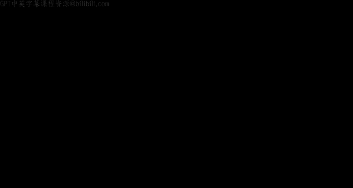
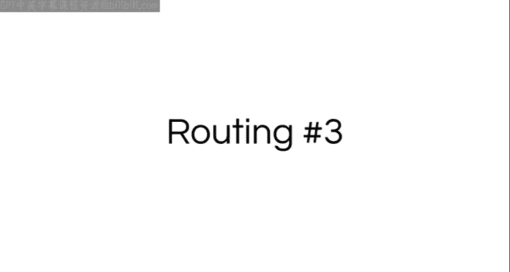
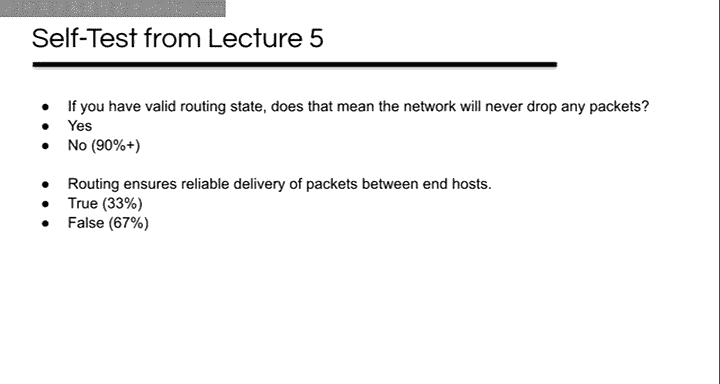
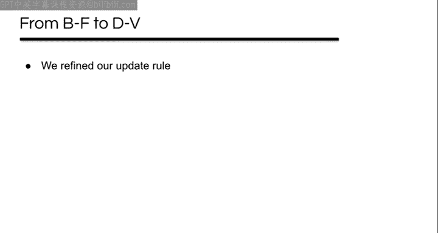
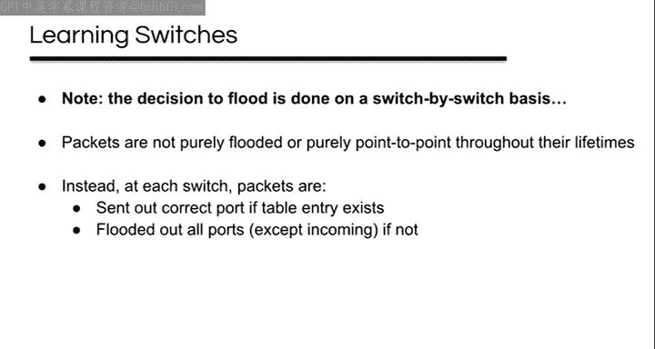

# UCB《互联网导论：架构与协议｜CS 168 Introduction to the Internet： Architecture and Protocols》 - P7：-7- Routing 3 - GPT中英字幕课程资源 - BV1VcrrYUEL5

All right。Thank you。

Okay。

So。Routing lecture three。starting off。Today in computing， it's Mike Mcelll's birthday。

 we mentioned last time the second semiconductor was invented by Bob Noce who went on to found Fairchild in Intel。

 Mike Mcla Markula worked for both of those also， he also was Apple employee number three。

 he was like an angel investor for Apple， he also at different points in time served as the CEO and the chairman。

 he wrote some software for them despite being sort of a management type in the early days。😊。

I think he was also a key player if I remember this story right in both the outsting of jobs and the rehiring of jobs。

😊，嗯。And so Steve Wozniak said that while he and Steve Jobs get a lot of credit。

 Mike Mark was probably more responsible for the early success， so a kind of impressive guy。😊。

All right， so today I'm going to start out by taking a look at some of the self test questions。😊。

Going to have an introduction to Project one sort of。

I'm going to finish talking about distanceinor protocols。

 then we're going to talk about link state routing protocols。

Then we're going to switch gears a little bit and talk about learning switches and a Spning tree protocol and then if we have time。

 we will play the Spning Te game。All right， so starting out with some self test questions。😊。

So here is one， routing ensures reliable delivery of packets between end hostss。

 and so most people got the right answer， which was false。

 but there's a fair percentage of people who were confused and thought the answer was true。😊。

I thought this was really interesting， maybe somebody will clue me in。

 but an earlier question on this same self testest was if you have valid routing state。

 does that mean the network will never drop any packets and 90% of people said no。😊，So。

If packets can still get dropped when you have bad routing state。

 then the network can't be ensuring that they're reliably delivered， right。

 this seems to be a conflict to me， so routing may be necessary for reliable delivery。

 but it's not sufficient。😊，We're still talking about best effort networks。So moving on。

 we had this question， does the no loops， no dead ends theorem only hold true for destination based forwarding。

 and most people got the right answer， no， but like a third got yes。😊，嗯。And。

So I said this is copy pasted straight out of lecture five。😊。

Same basic no loops or dead ends condition generalizes to at least any other system that does deterministic forwarding based on fixed packet headers。

 that is， it's not limited to destination based routing。So it's not。

We will probably come back to that a little bit next lecture。All right。

 this one routing occurs when a data packet arrives at a router and is sent out another port。

 and so this one again， most people got the answer this was false， but it was pretty darn close。😊。

So when a packet arrives， a router forwards it to one of its neighbors。

 this is copy pasted from previous lecture there。😊，SoWhen a packet arrives， a data packet。

 the router forwards it to one of its neighbors， so that's the act of forwarding。

 which is being described here if you change that first word from routing to forwarding。

 then the statement is absolutely true， forwarding occurs when a data packet arrives at a router and is sent out another port。

😊，Yeah。For the perception。R guarantees。That also election。U。No， so let's see here， the question was。

 routing ensures reliable delivery of packets。😊，I don't know what to say about that。

Holy cow。That knows。

Not an improvement。All right。This is the state of the world， not reliable。😊，嗯。So。So， you know。😊。

Forwarding doesn't show reliable delivery of packets between end hostss either。

 right like nothing we've talked about so far actually guarantees that packets are going to get delivered。

 right， they could be dropped at any time。 Forwarding is trying to deliver them。

 routing is working to try to help forwarding help deliver them。

 but you essentially know we've talked about like queuees， for example。

 right and when the queuees fill up。😊，We'll drop packets。 And so that can happen。

 And so we're not going to talk about like， basically mechanisms to sort of。

Reliability until a couple weeks from now。Okay， so。This statement。

 forwarding occurs when a data packet arrives at a router and is sent out another port。

 that's what forwarding is right forwarding was like with the envelopes it's when you actually hand it to someone else。

 so routing is what determines which neighbor to forward to。😊，Yeah。Soに。Any questions on selftest？

Questions。All right。So project one was supposed to be released today。

 I have just been told that the plan is now to delay it， I think， for a week。The reason is， well。

 youve still got to do it the reason。😊，The decision was made that this will be the last time that we do it in Python 2。

7 and we will port it to Python3 between now and the next time it's offered and then yesterday Homebrew yanked Python 2。

7 out of Homebrew so Mac users now may have a problem getting it to run so as it happens last Friday I ported part of it to Python3 so we're going to now test and actually make sure that it'll work on Python3 and release it in a little while。

😊，All right， so project one， a little bit delayed。All right。

 so finishing up talking about our favorite rounding protocol， disinspecor。😊。

So last time we started building up from like our simple sort of distributed Belllman Ford into like an actual routing protocol right and so like we refined our update rule。

 you know we said that we should always trust our neighbor if we're using that neighbor as our next top for a route and it tells us a different advertisement。

 we should always include that even if the cost is worse， right？😊。

We resolved some wacky problems using split horizonor， you know， without that， we saw like a case。

 for example， where we could end up with routes that go backwards。😊。

We ensured that we eventually converged instead of counting to infinity by sort of adding this like artificial limit to infinity right。

 so eventually we stopped counting。😊，We made it robust to packet drops and reordering by readvertising our routes periodically。

We saw that it can adapt to new links easily， right， basically when a new link comes up。

 you send advertisement out of it and it basically just works。😊。

And we saw that we can identify failed links and adapt to them by essentially when we miss advertisements。

 we can let our current routes time out and that's our way of sort of detecting and we can then remove those timed out routes。

😊，And so that's basically where we finished off last time。

So I want to really quickly revisit that last one where we were using T knots to handle failed links。

 and I'm going to go through this example， I'm going to do no triggered updates。

 I'm not going to show every update。😊，But like remember， we got to this point here at time10。

 where our one is sending periodic updates every 10 seconds and it sends this one which charges the one on R2 back up to the maximum time to live of 21 seconds。

😊，And then right after that happened。The R1R2 link failed。The projector failed。

And so R2 doesn't know that this route is no good yet。

 so it eventually at time 15 advertises it to R3， recharging R3's entry。😊，Five seconds after that。

 R1 sends its updates again， the one to R2 never gets there because the link is down。

 so the TTL on R2 decreases， the one on R3 gets ignored because it's worse than the current route。😊。

Five seconds later， R2 recharges the route on R3 again。

 the TTL and R2 is continuing to decrease right because nothing's charging it up。😊。

Five seconds later。R1 sends its routes again， this is the same as last time R2 doesn't get it。

 R3 ignores it。But R2's route is now almost dead， right， it's just about to time out。

So one second later。That route expires。And so we remove it is what we did last time。

 and since R2 stops advertising it， then 15 seconds later at time 46。

 it's going to expire on R3 as well。😊，So now both of these tables are empty。

Until our one timer goes off at time 50， our three gets the route and accepts it。Fills in that entry。

Which eventually gets advertised to R2。Which accepts it because it's empty。And now we've converged。

 right， so that's how we converged last time with timeouts。

So any questions on that on how that mechanism worked？😊，All right。

 so you learned a little bit about poisoning in section yesterday。

 so let's take a closer look at that same example that we just went through， but with poisoning。😊。

So at time 31， this route times out right and we removed it and then we wait 15 more seconds for it to expire on R3 and this was preventing both R2 and R3 from having working paths right like until R1's timer goes off like the next time R1's timer goes off at T40 actually。

 like there's still this expiring route in R3 right it's still got six seconds left。😊。

So we don't actually get the new route until time 50。

 so that's 19 seconds after the route expired on R2。😊。

So there's something that we can do to improve things here， and in fact。

 someone jumped ahead last time when I put this question out to the audience。

 somebody leaped ahead and got it。And so going back to time 31 here， when the route on R2 expires。😊。

We can do something instead of deleting it。 and so at this point， maybe some of you know。

 what can we do besides deleting it？So instead of deleting it。

We create a route with an impossibly large distance。We call this a poison route。So。

This one within possibly large distance gets advertised at T35 when R2 sends its advertisements。

R3 is going to accept it right， because R2 is the next top for the current route。

 so it's just going to blindly accept that and it's going to say， okay， my cost is now infinity to a。

So now when T40 comes around。And R1 advertises its routes。

It's clearly better than the infinite costing one that has got， right？

And so this gets propagated to R2 the next time R3's timer goes off。

And so that the key idea here was basically， instead of just not advertising a route。

 you actively advertise that you don't have a route。

 you advertise that your distance to that destination is infinity。

And so we do this with this like infinitely high poison route。😊。

So this route propagates just like other routes， poisoning this entry on other routers that were using it。

And so this can be much faster than waiting for timeouts。😊。

You only have to wait for it to be advertised。And this doesn't just work for timed advertisements either。

 right like if you get a poison advertisement and it changes your table。

Then that's going to trigger you to send an update right because your table changed so your neighbor's tables might change。

 And so this means that you can propagate dead routes basically as fast as they can reach and be processed by the neighbor instead of waiting for a timeout。

 so that could be much， much faster than waiting for timeouts。

Does that make sense how that mechanism works， how we go from waiting for timeouts to poisoning route yeah？

How do the router know that a link is dead so like in this case？😊，Right。

The router didn't actually know that the link was dead， right， I mean， it didn't really know。

 What it knows is that this route timed out。because if the link was alive。

 then it should keep getting charged up by every periodic advertisement， but it wasn't getting those。

 so it decides， ah， it must be dead。There are other ways that they can know directly and I'll come back to that in a minute。

😊，这。So any other questions on this， yeah？Or when it's just like talking。

Right so the basic question is you know do we wait for the TTL to run all the way down to zero or does it just need to be some other number and the answer is that you wait for the TTL to run all the way down to zero and so basically you set the TTL usually to like some multiple of the advertisement interval right so if the advertisement interval is like oh I'm gonna to periodically advertise every 10 seconds right then if your TTL was like five seconds then you would constantly be timing it out right like youd never get it charged up basically right if you set it to like11 seconds then that's probably mostly going to work but if it misses one advertisement you're going be like oh this route's dead but it may have just been one unlucky packet right so you usually set it to some multiple like rips default sets it like three times the advertisement interval so you can actually miss like several updates in a row before you're like I'm just not getting them anymore。

😊，Does that make sense like while you set that， the time out to be like some multiple of the advertisement。

 it gives you like multiple chances to charge it up。Any other questions on？Timeouts and on poisoning。

All right， so besides expired route。Where else did we not advertise something？

Where we had something to advertise， but we didn't。Yeah。F like a new link。Yeah。

 so that's an interesting interesting one， not what I'm thinking of。

 so maybe when you have a new link， maybe you don't advertise immediately， yeah。

 we'll actually come back to that， but not what I was thinking of。😊，Yeah。Next up。

 do you remember what that rule is called？Split H， yeah。So split Horizon is this other one， right。

 like in split Hor， we had a route。😊，But we didn't advertise it to one of our neighbors。

 specifically， we didn't advertise it back to the neighbor that advertised it to us， right？U。

Why would we， they already know about this route and we couldn't possibly be on the shortest path。

The split H rule is the other one， but so instead of just not advertising。😊。

Back to the router that gave us the route。We can advertise an infinite cost to that one。

 and we call that poison reverse。 So it's the same exact idea。As a split horizon。

 but it's more aggressive， right？😊，Let's like walk through a really quick example here。

 so assume we're converged and then R1 goes down。😊，Sometime later。R2 and R3。

 let's say they advertise their routes to each other at exactly the same time。

And note that these routes are through R1， which is dead， and they're about to expire。

 look at the TTLs， they're like almost dead。😊，So while they're in transit。

 like halfway between R2 and R3。These routes time out， contrived example， but just making the point。

So when they end up getting to the destinations here， right？

They both get accepted because the tables were empty。So this is describing a loop here， right。

 that's what we've got now R2 says it wants to forward to R3， R3 says it wants to forward to A。

And so with split Horizon， neither of these would now be advertising to each other， right？

So after the TTL runs down in 21 seconds。😊，Both of these routes would expire。 Does that make sense。

 That's what Sp Horizon does。Yeah。U so。😊，In this case， at this time。Their routes are through R1。

So they wouldn't advertise these to R1 because that's the upstream one， right？

Like split Horizon says， don't advertise it to the next top and the next top at this time is R1。

Does that make sense？So that's why they're not going to advertise into R1。When they arrive。

Their next hops are through each other。And so anyway， like I said， you know。

 they're going to get eected， split horizon wouldn't advertise to each other。

 they're going to time out in 21 seconds。😊，But with poison reverse incentive us not advertising them to each other。

 what do we do？We advertise infinity right， so they say all right R2 is like okay。

 so R3 wants to go through me， so I'm going to tell it infinity and R3 is likeR2 wants to go through me so I'm going to tell it infinity。

😊，And so these get delivered， they get accepted due to the special case， right。

 like always except from the next top。😊，And so this basically now sets these routes so that they're infinitely bad and so you we'll never forward using a route if you notice that the route says that the distance is infinite。

 you don't use that for forwarding。😊，And。So instead of having to wait for a timeout。

For these to go away， right， we only had to wait for an advertisement， which is either， you know。

 on average， half of the advertisement interval。Or it's immediate if you're using triggered updates。

 so like as soon as they got them， they would send back the poison reverse routes and this would get resolved。

😊，Does that make sense？How this makes things happen faster？

It's the differenceance between saying nothing and saying no， right？Yeah。

So can I explain that example of split H？Yeah， so in this case。😊，Where were we？So they're here。

They time out， they get delivered， we get these routes， right？And so the question is。

 are they going to keep counting in this case or not？😊，And so。Essentially， if you have split horizon。

That says don't advertise the passportboard cost， so there's nothing to make them count。

 the TTL is going to just count down to zero， right？If you T split horizon turned off。

And they actually advertised。Then like R2 in this case would advertise a cost of three。

 R3 would accept it。With a cost of four adding the one， right。

 which would then advertise for a cost of five。 and so with split horizon off， they would count up。

But with split horizon on， you have to wait for them to time out and with poison reverse。

 you don't have to count or wait for them to time out。Does that make sense？Yeah。

So what exactly is triggering the？Send the in length。So the question is。

 what is causing the routers to send the infinite length？The answer is basically when they get。

This route， so it's where is it here？So this is when that route。It occurs， right？And so R2。

Now has this one， its table just changed， right， it went from empty to this so you can say a triggered update now says。

 okay， my table is now changed， I should send updates。

And the update to your upstream one to your next top is going to be infinite。

 right because that's what the poison reverse rule tells you to do。

Does that makes sense if you had split horizon， then you wouldn't tell your next top anything with poison reverse。

 you'll tell your next top infinity。😊，Making sense， kind of， not really。呵呵。😊，Yeah。啊。So。聞事アを。我。被告上。

小啲事嘅。And you got even before they went down。Normallyally that virus is talking can accept it。Greater。

Right， so like in this case right here， we're seeing and like at R2。

 it's getting an advertisement from R3 with a path of infinity， right？And so you're saying。

 why would it accept that？The I just because that。Exactly。

 this is that special case that we said where if you get an advertisement from the route that you're currently using as your next top。

 always accept it even if it's greater。😊，Yeah二。Is that。

The finaloneer worse is to add do wait till keep the out back。But you know you have to。Okay。

To know its infinity， do you need to wait for the TTL？Mand it tells。Yeah， so in poisoning， right。

 this is the difference between poisoning and poison reverse， right。

 like when a route expires because the TTL runs down。😊，You can change that route to say， okay。

This route is now infinite law， infinite length， instead of removing it， right， then you say， oh。

 it's infinitely distant。😊，So that's just poisoning。Poison reverse is slightly different， right。

 you're still using this infinite length route。😊，But you're doing it where you would have sent nothing because of split horizon before。

And so in case， whenever you do an advertisement。嗯。Whenever you do an advertisement。

With split Horizon， you never advertise a route。To the router that gave you that route。Why would you。

 it's the one that gave it to you， it doesn't need it。So that's what split Hon tells you to do。

 Poison reverse tells you， tell the one that gave it to you infinity。😊。

That you can't reach that destination through me。Does that kind of make sense？

You've got lots of time to figure this out also in the project。Yes。😊，Yeah。So if nothing goes down。

 there wouldn't be any reason for them to advertise infinity to each other， right？Well。

 so that's the normal poisoning case。 But the other case is poison reverse tells you if nothing went down then。

Both R2 and R3， what's their next top？R why。And so they advertise infinity to their next top。

So both of them would be advertising infinity to R1。Does that makes sense， always to the next top。

 you advertise infinity if you have poison reverse on。

That prevents your next top from trying to forward backwards through you。

 right because you're telling it if you try to send it back through me。It's infinitely far away。

That's what convinces it not to try to do that。Y。Not to accept it so the question is you know when in the example that I walked there earlier like as shown on the screen right now。

 you know when R2 and R3 get these infinities from each other they know to accept it on the other hand I was just saying if nothing ever went down then R2 and R3 are both advertising infinity to R1 and R1 isn't accepting it so why doesn't R1 accept it。

 why does R1 know that it shouldn't accept it？😊，Anybody want to， yeah？Yeah， so in that case。

 with this rule that's up here， right？😊，The next top for that one is a， right。

 that's the next top for the rule that's up there。And so it's going to do the normal comparison and say。

 well， I have one route with a cost of one and you're offering me one with a cost of infinity。

So under all things being equal， I'm going to take the one。

The only reason why it would take the infinity is with the special case when if it next top was R2。

 then it would accept one from R2， if its next top was R3， it would have accepted one from R3。😊，Yeah。

有好的。不好意思啊，不好意思。研究？How does poison reverse relate to R1 being broken？Yeah。

 and so the reason that R1 is broken in this case is because that's what。😊。

We needed in order to make this happen。Where。R2 and R3 are advertising to each other。If this route。

 the one that's listed in R2 andR3 through R1。If that's there。

Then they're not going to accept that route。Right，They're just going to ignore it。

 So we don't get this loop in the first place。 It's only because R one was down that。

R2 and R3's routes expired。Which is the only reason that it accepted these advertisements from each other。

 which is how we got the loop。So that makes sense， so that's just part of the example。

 that's like how this example works。Does that make sense？Yeah。我还问。

Why would you use split horizon over poison reverse。 Yeah， in general， it doesn't seem like。

As good of a mechanism， right， I would agree with that。 People have made arguments that like， oh。

 well， you know。Poisoning like creates more traffic。

 right you have to actually go to the you know spend the bys to send it。

 And so some people say under certain circumstances， it's not worth spending the bites。

 I think that's probably a weak argument， but I think that's why people would say I'd also say split horizon you know some of this is historical like I said。

 you know for all that you all came up with this split horizon rule。

 basically you know like unprompted when we were doing the activity。

 it did take networking researchers like five years to figure that out on the Apant So by the way。

 you know nice job， all you like round of applause for all you so。😊。

Then they came up with split Horon， and then after that somebody came up with poison reverse。

 so part of it is just sort of this was the historical trajectory。😊，All right。

 so I'm going to move on off this subject， we can talk about in office hours if y'all want to talk about poison anymore。

 but so to finish up really quick， poisoning and poison reverse in both cases without poisoning。

 you would have not sent a route and instead we explicitly send a terrible route。

 such that any other route would be better， and we never forward when our route is one of these terrible infinite routes。

😊，All right， so one last thing on distance Spector。

 more events to trigger on we know that if your table changes that should trigger you to send updates to your neighbors right because it might change their tables too。

 but there are other events that are useful and so a couple of these has sort of come up in discussion already today and so sometimes you can detect when a link becomes available sometimes you can detect it very quickly and so when that happens。

😊，You should immediately send advertisements to that neighbor， right。

 you don't need to wait for a timer to go off to send。

 you can say as soon as you know that there might be a neighbor。

Give it your rats and maybe it'll use them。Similarly。

 sometimes you can detect when a link fails really quickly， and this is one of the questions we got。

Like how do you know that that happens like usually it's because of something that happens at a lower layer like at the physical layer。

 there might be like an electrical failure right like an actual circuit breaks and the voltage goes away and at that point you know。

 okay this link is dead right and so you may know very quickly that a link has failed and when that happens。

😊，You should basically just poison all the routes that are using that link right because they're not going to work anymore if the link's broken。

 so you can quickly poison them and then update your neighbors based on that。😊，Does that make sense？

Those things there's like a couple other events that you can react to。All right。

 so summing this up back to our list of things we've been doing to convert our simple Belman Ford into like an actual useful routing protocol。

😊，We now can converge faster by explicitly signaling the absence of a route by advertising a poison on infinite distance route。

We can adapt more quickly by advertising when triggered by events like when our table changes or when a link goes up or when a link goes down。

 if we know that for sure， right if we've been notified by some lower layer that a link has come up or failed。

And this is now。A pretty good drowning protocol。 And so this is disinfeectctor。

 This is more or less rip。 A lot of people say it's not the best drowning protocol。

 but it's not terrible。Any final questions on distance Spec？Yeah。Yeah。

 so in the literature is there any like formal way of like quantifying how good a routing protocol is and there are a couple things that you can do like you can sort of look at like the order of how many messages need to be sent you know and how it relates to like the network diameter and stuff like that so yeah you can analyze a little bit and I may next lecture talk a little bit about that maybe not we'll see where we are on time but so to some degree though in general it's very context sensitive right it's probably going to depend on the particulars of your network you know if your network's very stable then maybe a lot of stuff is overhead right if your network is very dense it may react differently than if it's very sparse etc cetera。

 so you know it's often kind of context dependent。😊，Yeah。て。せぐな。司。Yes。

 so the question is you know we've been kind of looking at these small examples and like at scale the internet does this go up do we actually have you know does the your little Wi-fi router at home have like a full routing information for every host on the internet and so I'd say first of all remember we've been kind of focusing on IGPs on interior routing protocols right so that's one thing to keep in mind。

😊，And。So。There's also we talked one thing you could think about is we talked about the default route right in a lot of cases which is basically like the wild card if I don't have other routing entry to follow use this one right and so for example。

 your home router。😊，Very much can just be default right unless it's an address in your house then it's that way out towards the internet right so I gonna need one routing entry for all that you don't actually need to know a lot about the routing on the internet you just need to know the only thing you need to know is that it's not here it's somewhere else right and so we'll talk about this a little bit more next time when we start to talk about addressing so you the two things I'm trying to get at here are one you know the way that you route inside your network。

😊，You're very concerned about like individual things inside your network。

 but the rest of the things you often aren't so concerned about the details of， right？😊，嗯。

So that's one of them， and the other one is we'll actually see how you don't necessarily need to know about every host because of the way aing works。

😊，We'll see that next lecture。Yeah， good。Anything else or we'll move on。All right。

 moving on to link state routing so this is the other class of routing protocol that we're going to look at in depth this week and so it's newer than distance Spec。

 it's really common as an Inter gateway protocol there are two major examples or instances of it。

 one is IIS or intermediate system to intermediate system。😊，The other one is OSPF。

OPF is what is used to do routing on the Berkeley campus。

And it works really differently than distance Spec。

So let's kind of explore Link state and kind of sketch out the design for it。😊，So。

We're going to try to position it against a distance vector。

 so distance vectoror is doing this global computation it's distributed， it's asynchronous， right。

 it's this distributed computation。😊，It uses local data， right。

 the data that it's acting on at any particular time is just the data that it got from its neighbors。

 right？Link state is like the opposite。It's doing a local computation。Using global data。

 data from far away in the network。And so what does that mean？Well。

 hopefully the distance vector part makes sense to you。

 at least a little bit what I'm getting at there， right。

 this distributed computation shares data with its neighbors right with these advertisements。😊。

So let's look at the Li date part。So。A router locally computes writing state using global data from all parts of the network is what I wrote on that last slide。

 so what is this global data that I'm talking about？😊，It's the state of every link in the network。

So every router is locally computing using information about the state of every link in the network。

😊，Is that wake up？What is the cost of that link？So。

If someone told you that there was a link R1R2 with a cost of one。Right。It's the state of that lake。

 it exists， it's got a cost a lot。Then you know， there's two routers， R1 and R2。

And you know there's a link between them with a cost of one， right？😊，If they tell you。

 there's a link R1， R3， which exists and has a cost of 10。

Then you can kind of add that to your mental picture of what this network looks like， right？

And so on and so on， our4 R5 exists and has a cost of 7。

 so okay there's two routers R5 and R4 with a link of cost7 between them。😊，R 1 r4 has a cost of two。

So you can fill that in。R2R5 has a cost of1， R3 R4 has a cost of1。And you know， so on and so on。

 and so you could sort of build up this map of the topology， what's missing from this？😊，Or you。

 to jo， you're thinking like you know what we have some of one thing and none of another thing in this topology that we're drawn。

 what's missing？Yeah， we don't have any hosts right。

 so we also want some host information right like destinations more generally， right。😊。

Information about destinations。 R 3 has destination A。 R 4 has destination B， right。

 Those statements， we can add those to our picture， right， And now we have this complete map。😊。

Of what this topology looks like just by listening to information about individual links and about where the destinations are。

 does that make sense， thumbs up make sense。I was Danana， not so much。All right。

So if the router has a global view， you can pretty easily compute paths， right？😊。

Like imagine you're R5， what's the best path？To a。Well， it's R5， R2， R1， R4， R3 to A。

 right so that's not too hard to figure out on this particular topology。

And so what of that information is actually useful to R5？😊，Yeah。Forwarding to R2， right。

 that's the only piece that's actually useful to R5， right， like R5 has this table， right？😊。

The only thing in is the next top right So what's the next top from R 5， it's R2， right。

 so it computes the path and only that next top is actually useful to it。😊。

And so every router can do basically this same thing， right？😊。

And so the routers in these protocols basically follow these four steps。😊。

They need to get the state of all the links and the location of all the destinations。

 right that's what we said you just calling out you know these links and the costs and the destinations。

😊，And we're going to use that global information to build a full graph， like I just said。😊。

We're going to find paths from our from whatever router we are to every destination on the graph。

And we're going to use the second hop and all those paths to actually populate our forwarding table。

 right， These are the steps that Link state' is going to use。These all kind of make sense。

We don't know how to do them yet， but does this make sense why this would work？

Thumbs up if it makes sense， thumbs down， you're not so sure。A lot of people not willing to commit。

 that's all right。All right， so let's walk through them so you know we need to get all this global information that we talked about right about the state of links。

 I'm not going to talk about that just yet， we're going to come back to it。😊。

We're going to use that global information。To build the graph。

 And we just saw how to do that a second ago， right we sort of just pastd together all these individual messages about neighbors and destinations。

 We just sort of paste them together。 and we get this graph of the entire network， right。😊。

We're going to find paths from our。To every destination on the graph。

And since the router has the complete topology， you can basically do this however it wants， right？😊。

For least cost paths， this is called the single source shortest path problem。

And so like note that this isn't a distributed asynchronous algorithm like with this inspector。

 like each router is really just running like whatever algorithm it wants to find paths starting from itself。

 so like we know a couple for this already right I mean you could use Belman Ford not the distributed version。

 you could just use the plain old textbook Bellllman Ford algorithm right just the router runs it figures out what it thinks the paths are。

 installs the next top for each destination right。😊，You could use diykesters， as someone pointed out。

 that's more efficient in a lot of cases anyway， if you look at the complexity， can you do better？😊。

Then these， anybody want to volunteer a way you could beat diyksters？

What if your graph isn't weighted， is Dyketras the most efficient？Bed first search。

Dykesters is basically just like a fancy bread for search。But if you don't need weights。

 read for a search， we'll smoke it。U。You can do other things。

 There's a class of algorithms called dynamic shortest path algorithms。

 And the idea there is that often you've got some graph。😊，And you can compute shortest paths on it。

And then maybe you add an edge or you remove an edge， right like a link fails or something， right。

 but the graph is still mostly the same。😊，So I mean， you could run dike stars again from scratch。

But these dynamic shortest path algorithms take advantage of the fact that the graph is mostly the same as the last time you did it。

 and you usually only mutate it a little bit you add a link here， you add a node here， et cetera。

 so there are these dynamic algorithms which can be quite a bit faster。😊，You also。

 there are approximate shortest path algorithms， which often have much better runtime。

There's also parallel shortest path algorithms， which might have better runtime。😊。

And so there's probably some others that I'm forgetting to。😊。

So you there's this whole array of things you can do to do this quickly。

 which is important if you have lots and lots of routes。

 but the thing to note here is that there's nothing that says you even need to do least cost routing。

😊，You're just doing this like centralized computation。

 you can pick the paths however you want with a caveat that I'll come to in just a second。

So the last thing is you use the second hop in those paths to populate the forwarding table， right？

And so it's important to remember that each router only influences like its own next hop behavior。

 like other routers must be coming up with paths that are compatible to the ones that you come up with。

 right？😊，If you're doing least cost routing， like this is really easy if you're minimizing the same cost and if all the costs are greater than zero。

😊，And of course you have to agree on what the topology looks like， but like given those two。

 you don't even need to implement exactly the same algorithm。

 like you don't need to break ties the same way， for example。

 because like if every time you forward it， it's getting closer to the destination。😊。

Then the next top is never going to send it back to you， right， You're never going to get a loop。

So a counter example here is R2 and R5 both compute apparently feasible paths right like both of these you know R2 thinks the path is going to go R2。

 R5， R4， R3 right R5 thinks it's going to go R5， R2。

 R4 right both of these would work if that was the path that packets actually took。😊，But。

They don't work together， right？So like R2 is going to forward it to R5。

 R5 is just going to forward it back to R2 which is going to forward it back to R5 right。

 does that makes sense like the paths that you choose have to be consistent across routers。Yeah。

Allright。So it populates your tables and you're done， except for the tricky part。

 which is the part that I skipped earlier。😊，So you need to get the state of all the links and the location of all the destinations and network。

 right you need to build that map， right， that's going to be the tricky part。😊。

So all the routers need information about all the links between all the routers， right？😊。

And they need to know where all the destinations are attached to the riders。嗯。

So we can sort of break up what needs to happen here into three steps。

so every router must find out who its neighbors are， first of all。😊，That's the first step。

 you find out who your neighbors are。Then you tell everybody in the entire network。

Who your neighbors are， that is like about your links between you and your neighbors。

And then you tell everybody about the adjacent destinations， like what destinations are attached to。

😊，And so starting with the first one。How does a router find out who its neighbors are？

How does anybody find out who their neighbors are？You introduce yourself， right？So， you know。

 you say， hi， I'm Charles， hi， I'm Ada， hi， I'm Margaret， right？😊，And after everyone says hello here。

😊，Charles learns， okay， my neighbor said she was Ada， so I know I have a neighbor named Ada。

And you can look at that as a graph where it's like， okay， here I am， I'm Charles。😊。

And I've got some Neda。And Ada learns from her neighbors， okay， I've got a neighbor。

 Charles and a neighbor Margaret， and so I can put them in a little graph。😊，Right。

Margaret learns that she's next to Ada。And so basically。

 routers periodically send hello messages to their neighbors， they just say hi。😊。

And if a neighbor goes quiet for a certain amount of time， very much like with distance vector。

 we have these timeouts， this expiration， so if a neighbor goes quiet。

 you eventually assume that that neighbor is gone。😊，Does this make sense how this works。

 how this lets you discover your neighbors？So。You know who your routers are。

 your immediate neighbors are by exchanging hello messages。

So now you need to tell everyone about your neighbors so that everybody knows who's connected to who。

😊，And。So in order to do that， we use a process called flooding so the idea is。

When you have interesting local information， you send it to your neighbors。

And here are our three friends again， and maybe Margaret has just learned that she's friends with Ada。

And so she tells her neighbors。😊，Margaret his neighbors with data。And her neighbors hear that。

And her neighbors passed that on to their neighbors。

And so now everybody knows that Margaret is neighbors with Ada， right？😊。

Like Ada might have already known that because she's also neighbors with Mar。

 But Charles wouldn't have known that， right， He's not a neighbor to this conversation。

 So by sort of passing it between us。We've all learned it， does that make sense？

It's sort of like a gossiping。About your neighbors？So does that always work？

Anybody think this always works， thinks there are cases where this doesn't work？

If I tell my neighbors and those neighbors tell their neighbors。

 those neighbors tell their neighbors， those neighbors tell their neighbors， this is going to work。

 is everybody going to learn？Yeah。来问题。Would it get super？一份呗。Super big。Yeah。

 so maybe this doesn't scale very well。 you're right， when the network gets super big。

 maybe this doesn't work， so maybe there's a scaling problem。

 we're going to assume for now that the network is a manageable size though， but good idea， yeah。😊。

Maybe the graph's not connected right so that's certainly true you know you may pass it on to all your neighbors but not everybody learns because the graph isn't connected and that's true。

 on the other hand it kind of doesn't matter， it actually works out well because there's no point in people who in a disconnected part knowing anything about your part because they couldn't possibly reach you anyway but you're right。

😊，Yeah。If you drop a packet， sure， yeah， let's come back to that one。

 but let's assume for now that they go through， but yes， good， yeah。していく。哇。Yeah。

So it's possible that you know you get one and then you get another， you know。

 like maybe Margaret says， you know， maybe you get a message that says。

 Margaret is neighbors with Ada and then you get one that says。

 Margaret is neighbors with Frida and you're like which is true， so yes that's another one。😊，W well。

Yeah， neighbor a neighbor could die so these are all some interesting thoughts。

 but there's a really fundamental， really big problem I mean you're all getting some corner cases like we're going to probably deal with a lot of these as we go on。

 but there's a really fundamental problem going on here and so I will。😊，Show you why。

 though it's difficult considering I can't really see the screen over here。 All right。

 so here's a graph and R1 might send a packet on this topology and you can see it tells everybody R5 tells both of its neighbors and it gets to everybody same with R2。

😊，It gets to everybody Same with R3。 If R3 sends a packet and everybody just tells their neighbors。

 it gets everybody。 So this seems to work。 In fact。

 any node on here will work just fine on this topology。😊。

But what happens when we add a loop to this topology？R one sends it， it gets duplicated there。

And now what's going on， just kind of sending。Around and around with cycle forever in opposite directions。

 And this will just go on forever and ever。So that's not great。😊，Things get so， so much worse。😊。

What if we had？A second loop。Now it's going to happen。 R1 sends a packet。

 gets duplicated by that first loop。Both of those duplicates get duplicated by the second loop。

Which all get duplicated by the first loop again， which all feed back into the second loop。

So this is exponential growth in a number of duplicates of this packet。😊，On a real network。

 this will consume all of your bandwidth immediately。😊，So。Bad news。

The naive solution just telling all your neighbors。Does't work when the topology has loops。

With one loop， pack a loop around the cycle forever。That's bad。When you have multiple loops。

 packets multiply exponentially。Whi is very bad。So what's the solution？😊，There are a number。

But we're going to start with a pretty simple one here。

So this is the statement we had before when you have local information that's interesting。😊。

Send it to all your neighbors。Something happens to me， I tell everybody。

 and when you receive this information from a neighbor， you send it to all your other neighbors。

 right that's the basic flooding algorithm， the naive one， how do we fix it with one statement？😊。

Anybody have a good idea for how we can fix this yeah？Yeah， when you receive new information。Right。

 so I'm going to phrase it as， unless you've already seen。This info packet， in which case drop it。

 so you flood it to your neighbors unless you've already seen it。

So how do you know if you've already seen it or not？

The easy solution is that routers keep a sequence number。You know。

 put a sequence number in each of their updates。😊，To their neighbors。

 So the idea is every route has its own sequence number。And when it sends a routing message。

 it puts that sequence number in the packet and increments it。

So every update it sends has an increasingly large number， right？😊。

So every router also tracks the largest sequence number it's seen from every other router。😡。

And so if it sees an update with a smaller or equal sequence number。Then it updates it old。

 it's already seen it， right？If it sees an update with a larger sequence number。😊。

Then that update is new， it's never seen it before。

 so it remembers the highest sequence number associated with the router that sent that update。

And then it floods it to its neighbors。Yeah。Is there a point when this number resets with a finite number of bits it has to right so yes。

 there is a point we're going to ignore it for the sake of this class。

 the algorithms to deal with that correctly can actually be a little bit subtle。😊。

But also if you've got like a 64 bit number， for example， it might take a pretty long time。第二。Yeah。

 so it might make sense to build resetting into this Yeah yeah so there are some tricky things that have to do with eventually it's going to have to wrap around or whatever we're going to ignore them and assume that you can just keep counting up this makes sense of the basic idea how this works and how this prevents you from looping infinitely。

😊，Thumbs up if you kind of got it。Yeah。All right。😊，Quick question here， would this be a problem？

If we use this protocol as an EGP， as an internet scale routing protocol。😊，Sure it would， right。

 you don't want to remember the sequence number for every single router on the internet。All right。

So this question kind of came up earlier， how do you make flooding reliable。

 packets could drop while you're doing this flooding process right so who's got a quick idea of how you could make this kind of reliable？

😊，What's our favorite trick for making things reliable。Yeah。Periodically readvertise it right yeah。

 so you could just periodically resend things right ISIS and OSPF both do this。

 they also do some more clever stuff which basically lets them get higher reliability with fewer retransmissions we're not going to explore this idea like good reliability algorithms in the context of link state or of routing we're going to talk about reliability kind of a little bit more generally in week six but you baseline you can just repeat yourself right that'll work。

😊，So。The second thing。We need to tell everybody about our neighbors。

 and we're going to do that by flooding this information， right？😊。

The final thing was we need to tell everybody else about any adjacent destinations。

 like about what hosts kind of are nearby。And we do that by just flooding that information too。

 right we've got this mechanism now for flooding information to everybody。

 so we use that same mechanism， so you know basically you've got something like this and maybe R3 has a static route to A。

 right？😊，So it's like， hey， everybody， I can reach A with a cost of two。

So it fled that to its neighbors。And they're like， yeahall right？They fled it to their neighbors。

And now everybody knows。So tell everybody about adjacent destinations by flooding info about those destinations。

That was the third step。So by implementing all of these routers work together to share their local information globally。

 does that make sense？So if you remember， going way back now。

 all of this was in service of the first part of the protocol where we said that we needed to share links and destinations。

 and now we know how to do that。😊，By sending hellos to learn about our neighbors and by flooding the information that we learn。

And so we're done， that's Li state， right？So what many questions？Yeah。Yeah。

 so you're worried about flooding because you think it could be exploited and yes。

 it can probably be exploited， it's probably not the only exploitable thing or the most exploitable thing。

 we're going to put security aside in this and just assume this is going to work okay。😊。

The internet has gotten by it for a long time without worrying about this too much and you know remember we're generally talking about interior gateway protocols here right so this is again the routing that happens inside a network that you own so it's not like you're necessarily vulnerable to people far away but you're right。

 certainly there are vulnerabilities。To this sort of thing。

So a couple statements here on Li state convergence。

 so you know we're using the plain nonparal Dyxster's algorithm like or whatever pathfining algorithm we want。

 and you know Dyxster's algorithm is never going to find a path with a loop。

 so therefore with Li state protocols，😊，We're never going to have loops。Is that true？boss。

Anybody want to say why they think what they think？Anybody want to。

 why is it true or not true that we will get loops with Link State protocol golf？Yeah呀。be false。

Has that the routers individual turn。Yeah， it could be false because the paths that the routers individually come up with aren't compatible with each other right since they're only responsible for their next top。

 and so it's definitely false because we only have control of our next top。😊，And in particular。

 if routers don't have the same view of the global topology right， then all bets are off right。

 for example， in this case， R1 doesn't know about the failure yet because it's far away。

 R3 knows about it because it's right there， but R1 hasn't gotten an update yet。😊。

So you if R1 gets a packet to A， it's going to send it to R3， R3 is going to say， oh well。

 I've already figured out a good new path， it goes R3， R1，R2。So it's going to send it back to R1。

 R1 still hasn't gotten the update， it still thinks the best path is through R3。

 so you can definitely still get a loop here。So what are some sources of convergence delay with Li state algorithms？

Well， you've got the time to detect a failure， right。

 you can't respond to a failure until you know the failure is there。

You've got the time to flood the link state information。

 which is going to be proportional to how the diameter of the network。

 like how far away another node can be。😊，And then there's the time to recompute the paths and update the tables。

 right？So during that period of time， right between like a failure and when you've done those three things。

 you can have dead ends。You can have packets looping。

You can have out of order packets reaching the destination right so like you sent packet one and then packet two。

 but the destination gets packet two and then packet one right usually that doesn't cause semantic problems。

 but it can cause performance problems for reasons you will find out about when we get to talking about TCP。

😊，U。And so the timeline for local failures。First， when a failure first happens。

 I've got this period of time where the failure hasn't been detected yet， right。

 and so the packets are sent into a dead link， those packets are lost， right？

Eventually the adjacent router， the one next to the failure realizes there's a failure。

 but it hasn't computed new routes or new table entries yet right so that's like a dead end right it's going to get the packet and it's going to be like well。

 I know the link I had is dead but I haven't figured out what else to do about it right？😊，Eventually。

 that adjacent router， the one right next to the failure， is going to compute some new path。

 but nobody else knows anything about this yet， right？😊，And so during that period of time。

You can have loops， right， because when a packet gets to that one where the failure was。

 that router is going to say， oh well， I'm going to send it on this other path。

 maybe that's back the way it came， maybe it's somewhere else， but there's a possibility。

That whatever chain of neighbors I send it to is just going to come right back through me。

 so you might have a loop transiently here。As different nodes become aware。

 different routers actually get the new link state messages that tell them that this link is down。

 right， routes are going to start changing over the network。😊。

So you might have some loops at this point。You also potentially have reorders of packets again。

 like where packets I mentioned you know they come in a different order， so why is that。

 why do you potentially get packets coming out of order during this period of reconvergence？😊。

Anybody have a sense of why that is？Well， a simple example we can go through。Where did it go？

I lost it there we go， all right， so you can think about an example here right。

 so maybe there's a packet to a at R3。😊，At the same time。That a packet to a arrives at R1。

And this is at the same time that R1 learns that the link had gone down。

 right all these things happening at once。😊，So。R1 now knows the better path right。

 so the second path packet right at R1 is going to take the path on the left side here。 Meanwhile。

 the one at R3 if it was going to make it there it' going to have to back up and go back around from R3 to R1 and then to R2 right so the packet that had gotten further now has to backtrack to get there right。

So the one that didn't have to backtrack is going to beat it there。That makes sense。

 so these packets can come in different orders more generally just you're going to end up know when you're adapting to failures。

 things are going to take different routes。😊，And some may be faster than others。All right。

 any questions？On link state routing。Yeah。What's the benefit over distance Specor？

I think you can come up with a number for one on different topologies。

 they are going to have different convergence properties again it's going to be sort of dependent on the topology。

嗯。Potentially， I mean， Link state was originally developed because of sort of like stability problems with distance vector。

 you know due to the fact that it has to count up sometimes and things like that。

 which I think especially when it was used for like more of the network。

 like for the internet at large were problems， also before some of the enhancements that were made to distance vector where problems。

 but there are some others， like for example want to have if you want to compute your paths using some really weird pathbinding algorithm。

😊，It's pretty easy to do that with Link state。With distance vectoror it's just bellman forward。

 your options are minimize some cost metric and that's it right。

 so it's also a little bit more flexible so flexible some people would say it's kind of can be more stable。

 can be faster to converge， which I certainly buy for old versions of distance Spec for modern versions I'm sure。

 but that's an argument anyway。😊，All right， so Link state in a single slide。

 it's super simple conceptually， everyone floods link and destination information。

 everyone then has a global map of the network， everyone independently computes the next tops。

 all of the complexity is in the details of doing these things。😊，All right。

 so now in the remaining period。going to start to talk about learning switches and Sp protocol。

 we will not get through it， but we'll start。So we've been looking at distance spectra in Li state where the tables are filled by the sort of like ongoing independent routing process。

 right， and all of these routes have sort of been seeed with these static routes for destinations。😊。

And these two classes of routing protocol are really common for routing at the network layer like L3 with IP addresses。

 right？😊，So let's look at a really different way of doing things。😊，Which is with learning switches。

And so with learning switches， the tables are filled in opportunistically using the data packets instead of this sort of like ongoing routing process。

😊，And there's no seating with static entries required。

And this is super common for routing at layer2 in Ethernet in specific。

 many people would say that this isn't actually properly routing。

 but it solves the same problem of filling in tables， so I'm going to call it routing。😊。

So the idea here is that when a data packet arrives at a switch from some neighbor， like here。

 there's a packet from A to B arriving at S1。😊，You know。

 S1 knows that it can reach the source of the packet using that neighbor， right。

 like if you follow the packet backwards， you're going to reach who sent it。Does that make sense？

So we use the source address in the packet to create a table entry for packets destined to that address。

 right this packet came from A so that we know we can use A by sending the packet backwards。

So this packet is going2 B。And we don't have a table entry for B。

So what would we have done so far with everything we've talked about at this point？

What happens when a packet arrives at a router that doesn't know anything about that destination？

You drop it。In this case， we're going to do something else。 We're going to be optimistic。

We're going to assume that B is out there somewhere。😡，So we flooded。To all our neighbors。

And so S2 and S4 now get this packet and they both learned that they can reach a using S1 right。

 it got a packet from a from S1， so therefore a must be in the direction of S1， right。😊。

They also don't have entries for B。So they also flood it， S3 learns that it can reach A through S2。

 S5 learns that it can reach A through S4。They don't have entries for B， so they flood it， and look。

 B got the packet。So you know， because we kept flooding it， if there was any way for it to get there。

 it's going to get there， right？So usually communication isn't un adirectional， right。

 usually if I'm talking to you， you're talking to me。😊，So what if B replies to A？

So now if packet it from B to A， it arrives at S3。Well， when it gets to S3。

 there's our table entry for a， right？This pack can just follow a path straight back to A。

 it doesn't need to flood it anywhere， it's just following the table entries。Moreover。As it goes。

 it's leaving behind table entries pointing to B。So now if A sends another packet to B。

 this doesn't need to flood either， right， We've now got table entries in both directions between A and B。

 We've fully populated this path between A and B。So what's the big problem here？

Where does this break down？Yeah。If you' pluging every packet。我在怎么？So if you're flooding every packet。

 maybe it's a lot of like extra traffic， right， sure。

 maybe it's not the most efficient use of your bandwidth， even worse than that， give you a hit。

 we saw an example earlier。Yeah。😊，What if you have a loop， right， like that's bad news？

We already saw that。 So this doesn't work when there's a loop。

 So the major problem with organ switches is that floods。

When the destination is unknown and floods have problems when the topology has loops and our previous solution to this problem。

😊，Doesn't work in this case。 And I will come back to it in a second。By which， I mean， Thursday。

So I think I will， well， I'll make one last statement。

 one last note which is you know the decision to flood or not is done on this like switch by switch basis right like packets are not purely flooded or purely sent just between neighbors for like the entire lifetime of that packet right instead at each switch you know packets are either sent out the correct port if you have a table entry for it or they're flooded。

 sent out all the ports except the incoming port if they're not。😊。

The whole algorithm looks something like this。We've got。40 seconds。 the quick part of it is。

 when a packet arrives， that' some switch。The first thing you do is learn from that table entry。

 you set the table， you use the source address， you set the next top to the previous hop。

 where the packet came from， and then you set some TTL， so eventually this table entry times out。

Then you forward it if it's in the table， you send it to the next top unless the next top is the hop that the packet came from。

 right if you're going to try to send it back the packet back the way it came。

 if you're going to try to forward it directly back， don't bother doing that。

The switch that it gets to is probably just going to send it back to you again。

 You've got this really tight loop。 Otherwise， you do send it to the next top。

And if you don't have it in the table， you flood it to everybody。

 and so that's the basic algorithm we will pick this up on Thursday。

Thank you so much。

や。あそで。

