# 互联网导论：架构与协议｜CS 168：P9：翻转课堂第二讲 - 路由与交换协议详解

在本节课中，我们将深入探讨距离向量路由协议中的核心优化概念，并回顾学习型交换机和生成树协议的工作原理。我们将重点澄清一些容易混淆的术语，并通过实例帮助初学者理解这些网络基础概念。

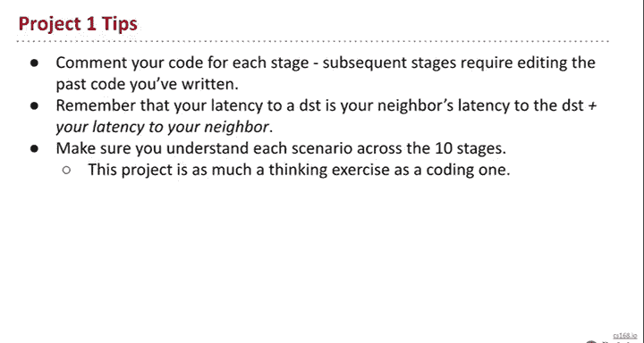

## 项目一发布与提示

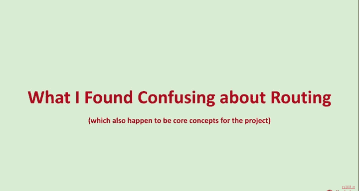

首先，我们有一些重要公告。从本周开始，线下课程恢复，无需再提前观看视频。此外，项目一已于今日发布，这是一个关于实现距离向量路由协议的项目。项目使用了一个由Murphy Mcauley和过去的研究生开发的模拟器，你可以直观地看到网络中数据包的流动和路由表的变化，非常有趣。

项目分为10个阶段，目标是逐步实现距离向量路由的各种优化，例如水平分割、毒性逆转和路由毒化。项目截止日期为10月7日午夜，所有信息都可在Ed平台上找到。

以下是开始项目时的一些实用提示：
*   **代码注释**：由于后续阶段可能需要修改早期代码，强烈建议为早期代码添加详细注释。
*   **路径成本计算**：当节点收到邻居关于到达某目的地成本为X的更新时，你通过该邻居到达目的地的总成本应为 `X + 你到该邻居的成本`。
*   **深入理解**：本课程作业不多，因此请务必通过项目彻底理解水平分割、毒性逆转等概念，这对考试至关重要。
*   **利用日志**：在更新路由表时记录日志，有助于理清事件序列和理解协议行为。
*   **使用模拟器**：模拟器是交互式Python终端，你可以实时查看节点的路由表，例如输入 `print S1.table`，这对调试非常有帮助。

## 路由协议的核心问题与优化

上一节我们介绍了项目概况，本节中我们来看看路由协议试图解决的核心问题。路由的核心任务是制定数据包转发规则，即路由器收到数据包后，根据报头信息决定将其发送给哪个邻居。理想的路由协议需要满足两个基本要求：**全网可达性**和**最小化延迟**。

网络功能分为数据平面和控制平面。数据平面负责实际的数据包处理和转发，而控制平面则负责制定转发决策。我们已学习链路状态和距离向量两种路由协议。由于项目一聚焦于距离向量，且其通过逐步添加优化来完善，更容易令人困惑，因此本节将重点讨论距离向量协议。

距离向量协议基于两个简单规则：
1.  **发言者**：每个节点周期性地向所有邻居广播它到达各个目的地的距离。
2.  **倾听者**：每个节点接收邻居的更新，并选择最优（成本最低）的路径来更新自己的路由表。

然而，在实际网络中，我们会遇到一些问题，导致路由状态失效。以下是三类主要问题：
*   **缺失表项**：网络中存在可达目的地，但某些路由器没有对应的路由条目。
*   **路由环路**：两个或多个路由器相互认为对方是到达目的地的最佳下一跳，导致数据包在它们之间循环。
*   **过时信息**：网络发生故障（如链路中断）后，并非所有路由器都及时知晓。

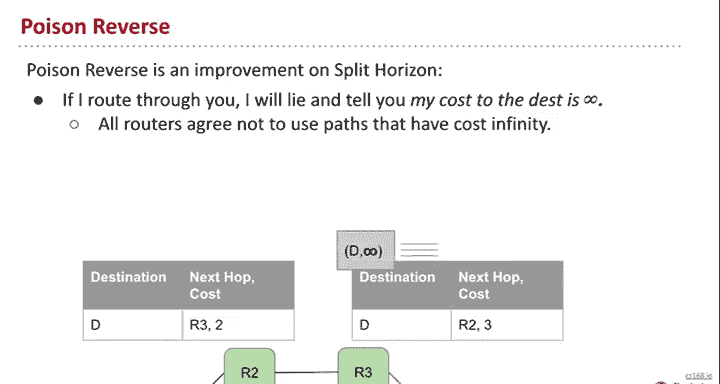

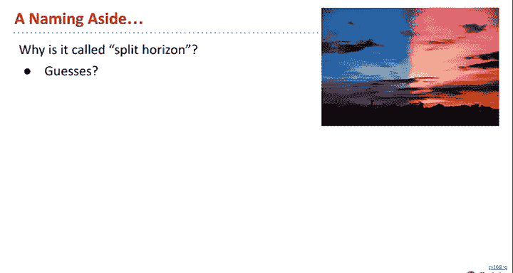

### 解决路由环路：水平分割与毒性逆转

缺失表项问题通常可以通过定期重发广播来解决。接下来，我们重点讨论如何**防止和消除路由环路**，这正是水平分割和毒性逆转等优化所要解决的问题。

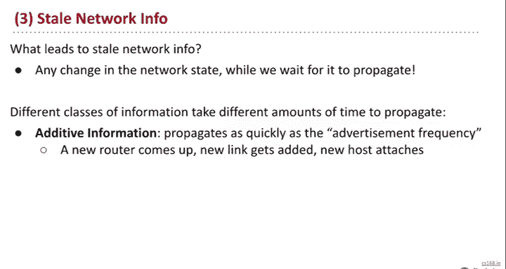

考虑一个简单的网络：R1直连目的地D，R2连接R1和R3，R3也连接R2。初始时，R2通过R1到达D，R3通过R2到达D。当R1-D之间的链路中断后，R2丢失了到达D的路由。此时，如果R3告诉R2“我可以通过某路径以成本2到达D”，R2会很高兴地接受，并更新自己的路由，下一跳指向R3，成本变为3（2+1）。随后，R2又会告诉R3它的新路由，成本可能变为4，如此循环，成本会不断递增至无穷大，形成环路。

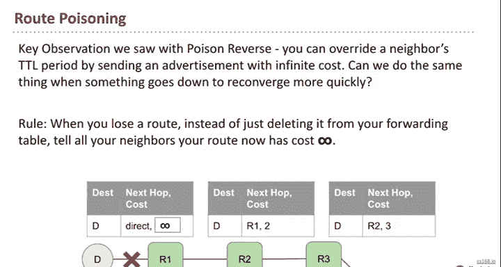

**水平分割** 的规则是：**如果我的某条路由的下一跳是你，那么我将不会向你通告这条路由**。这样做的逻辑是：我不应该告诉你一个需要经过你才能到达目的地的路径，如果你需要从我这里获得这条路径，那说明我们已经陷入了环路。在上面的例子中，应用水平分割后，R3不会向R2通告其经过R2到达D的路由，从而在R1-D链路失效后，避免了环路的产生。

然而，水平分割存在边缘情况，例如当两个路由器都通过第三方路由器到达目的地，而第三方路由器失效时，在特定的计时情况下仍可能形成瞬时环路。一旦形成环路，水平分割需要等待路由条目超时（TTL到期）才能解除，这可能需要较长时间。

**毒性逆转** 是对水平分割的改进。它的规则是：**如果我的某条路由的下一跳是你，那么我将主动告诉你，我到达该目的地的成本是无穷大（∞）**。这本质上是一种“说谎”，目的是确保你永远不会把目的地为D的数据包发给我。在环路形成时，毒性逆转能通过立即发送“成本为∞”的更新，快速打破环路，而不必等待超时。

**核心区别**：水平分割和毒性逆转在**预防直接环路**方面效果相同。但当环路不幸发生时，**毒性逆转能比水平分割更快地消除环路**，因为它主动发送更新，而非保持沉默。

### 加速收敛：路由毒化

解决了环路问题，我们来看如何加速网络在故障后的**收敛速度**，即解决“过时信息”问题。网络状态变化中，“新增信息”（如新链路）传播很快，但“删除信息”（如链路中断）的传播速度受限于路由条目的超时时间，这通常比广播周期长得多。

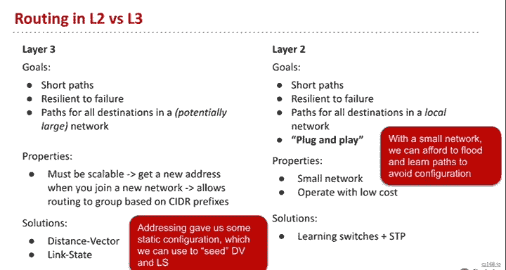

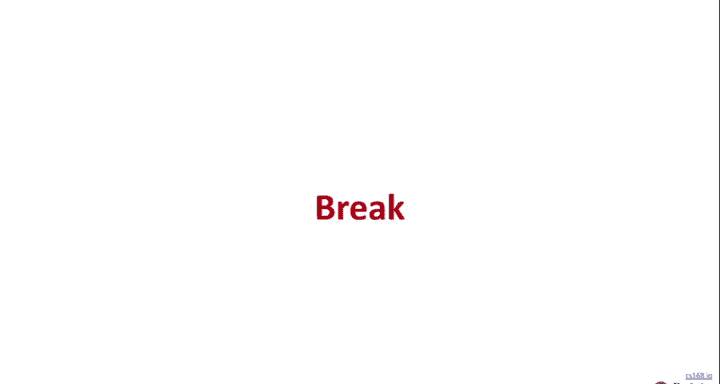

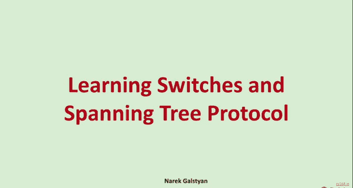

**路由毒化** 旨在加速故障信息的传播。其规则是：**当你失去某条路由时（例如直连链路中断），不要只是从路由表中删除它，而是立即向所有邻居广播，告知你到达该目的地的成本变为无穷大（∞）**。这样，邻居可以立即更新自己的路由表，而不是等待旧条目超时。这个信息会像波浪一样在网络中快速传播开。

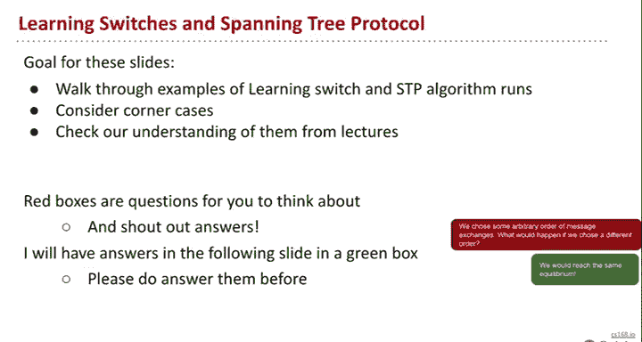

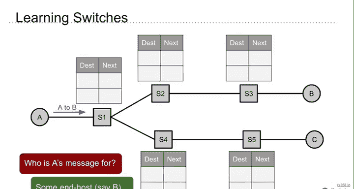

**路由毒化 vs. 毒性逆转**：虽然两者都使用“无穷大成本”这个机制，但它们触发条件和目标不同：
*   **毒性逆转**：是一种**预防性措施**，针对**特定邻居**（我的下一跳）持续说谎，以防止环路。
*   **路由毒化**：是一种**反应性措施**，在**自己失去路由时**，**向所有邻居**广播，以快速清除网络中的过时信息。

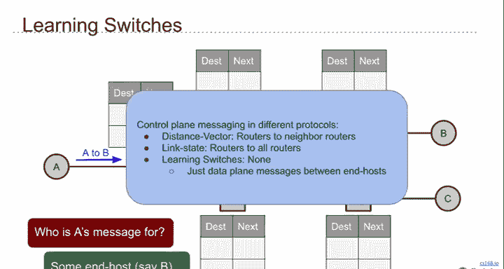

### 概念梳理与总结

现在，我们可以回答一些常见的困惑：

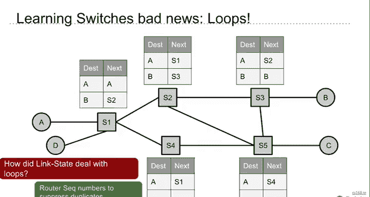

**可以使用哪些组合？**
水平分割和毒性逆转互斥（一个要求沉默，一个要求说谎），因此对于环路防止，你只能选择其中一种或都不选。路由毒化是独立选项。所以可能的组合是：`(水平分割 或 毒性逆转 或 无)` 加上 `(路由毒化 或 无)`。

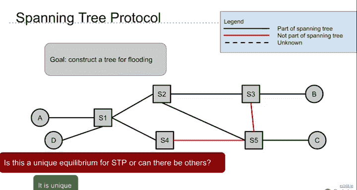

**哪种组合最好？**
通常，使用毒性逆转（比水平分割消除环路更快）加上路由毒化（加速收敛）被认为是较好的组合。

**生成树协议概览**

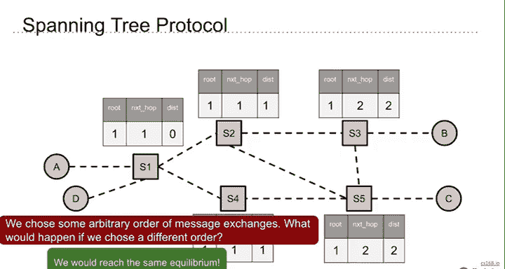

上一节我们深入探讨了L3的路由协议，本节我们来看看L2（数据链路层）如何解决类似的问题。在学习型交换机网络中，交换机通过观察数据帧的源地址来学习主机位置，并通过泛洪来处理未知目的地的帧。然而，当网络拓扑存在物理环路时，泛洪会导致广播风暴。

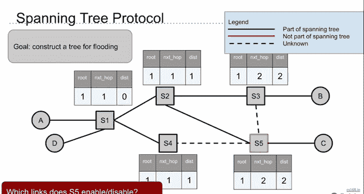

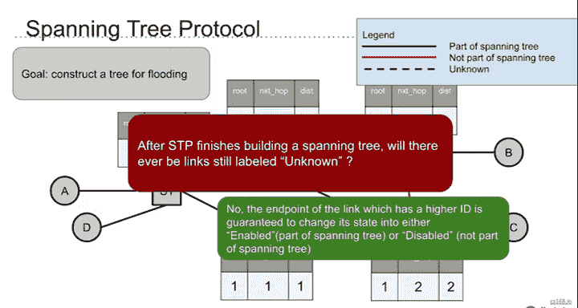

**生成树协议** 就是为了解决这个问题。它在具有环路的物理拓扑上，通过分布式算法计算出一棵无环的“逻辑树”，并阻塞（禁用）不在树上的冗余链路。这样，泛洪仅在生成树上进行，避免了环路。协议通过选举根桥、计算最短路径等步骤构建这棵树，并在网络拓扑变化时重新计算。

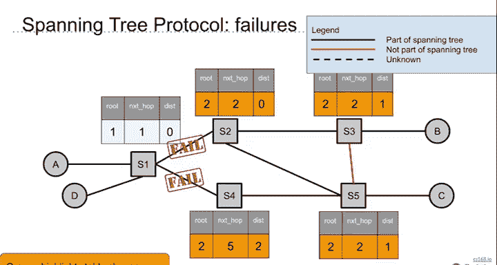

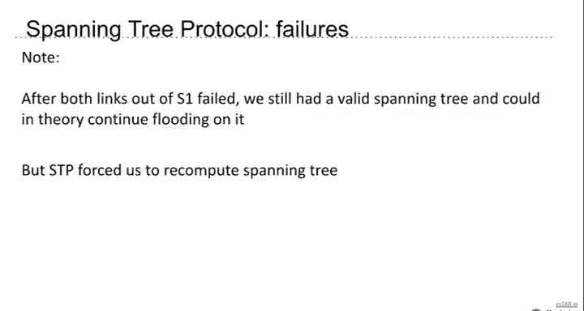

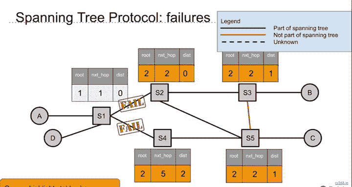

## 课程总结

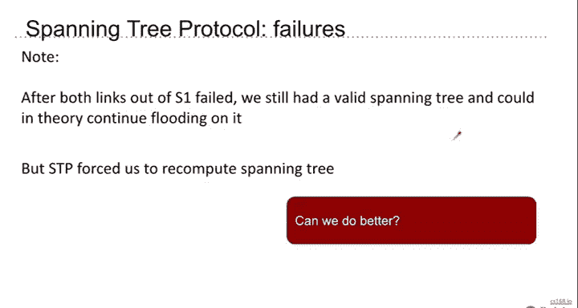

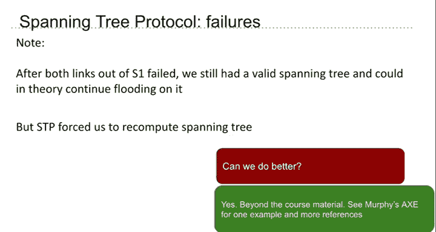

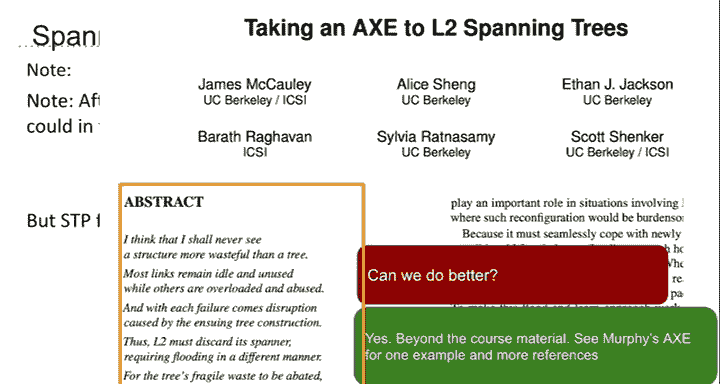

本节课中，我们一起学习了距离向量路由协议的关键优化机制。我们明确了**水平分割**和**毒性逆转**都用于防止路由环路，后者在环路发生时收敛更快；而**路由毒化**用于在网络故障后快速传播信息，加速全网收敛。我们还回顾了L2网络中**学习型交换机**的工作方式以及**生成树协议**如何解决物理环路带来的广播风暴问题。理解这些概念的区别与联系，对于完成项目一和掌握网络基础至关重要。