# 2：互联网工作原理概述 🧭

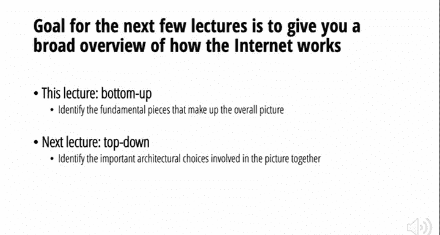

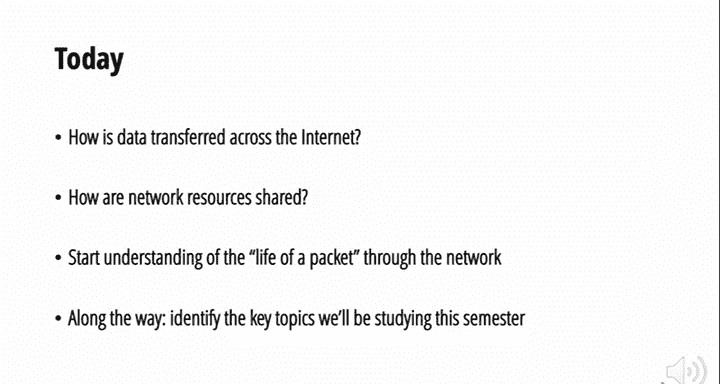

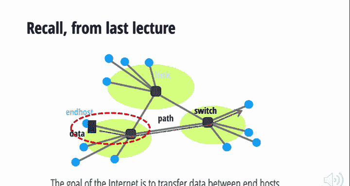

在本节课中，我们将学习互联网如何工作的基础概述。我们将从最底层的链路和数据传输开始，逐步构建对互联网整体运作的理解。课程将涵盖数据如何组织、网络资源如何共享等核心概念，并初步了解数据包在网络中的“一生”。

---

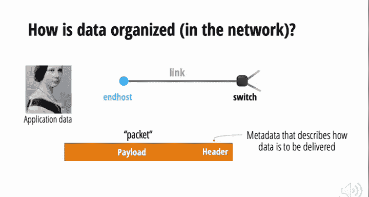

## 数据如何穿越互联网 📦

上一节我们介绍了互联网的基本任务是在终端主机之间传输数据。本节中，我们来看看数据是如何被组织并跨越互联网传输的。

首先，当终端主机上的应用程序（例如，一个图像文件）需要发送数据时，它不会一次性发送所有数据。相反，它会将数据分割成称为**数据包**的单元。数据包是互联网上数据传输的基本单位。

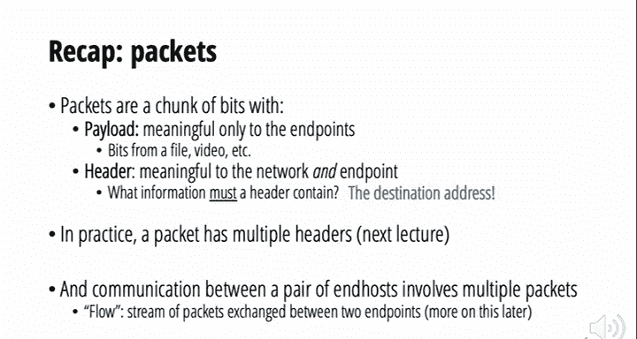

一个数据包主要由两部分组成：
*   **有效载荷**：这是应用程序希望发送的实际数据（例如，图像的一部分）。网络本身通常不关心这些数据的内容。
*   **头部**：这是附加在有效载荷前面的元数据，包含指导网络如何处理这个数据包的指令。你可以将头部视为网络的**API**，它告诉交换机如何处理这个数据包，并可能告诉下一个交换机接下来该怎么做。

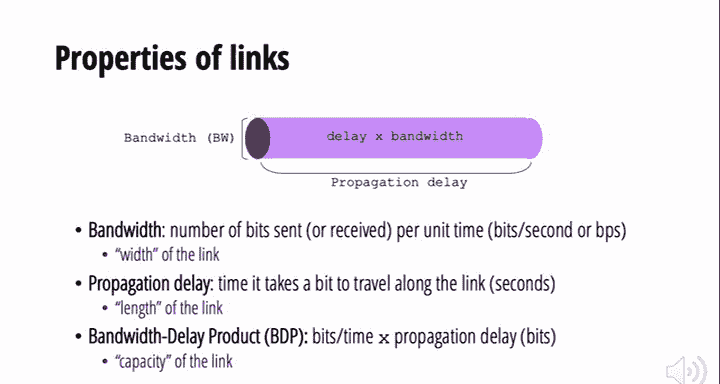

数据包的大小通常不是固定的，但存在一个上限（例如，以太网的最大数据包大小约为1500字节）。因此，一个大的文件需要被分割成多个数据包进行传输。

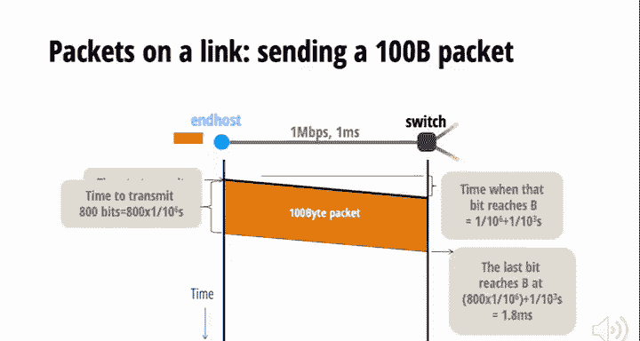

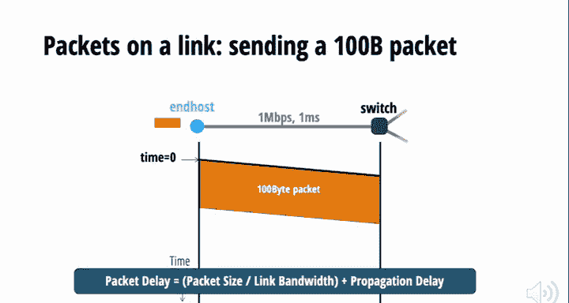

---

## 数据包的“一生”与转发 🔄

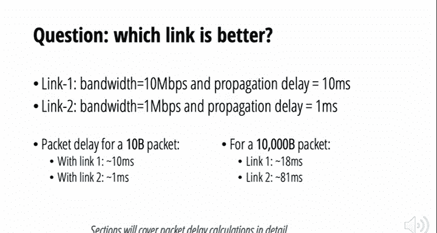

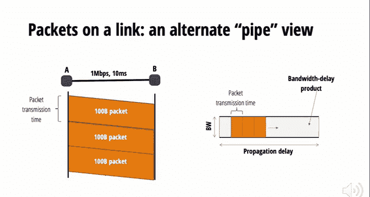

现在我们已经了解了数据包的基本结构，让我们跟随一个数据包，看看它如何在网络中移动。

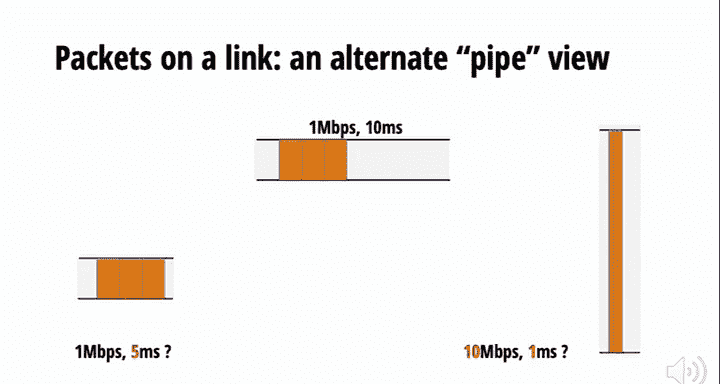

数据包通过**链路**从一个设备传输到另一个设备。链路有三个关键性能属性：
*   **带宽**：单位时间内可以放入链路的比特数（比特/秒），类比为管道的宽度。
*   **传播延迟**：一个比特从链路起点传播到终点所需的时间，由物理距离和介质决定，类比为管道的长度。
*   **带宽延迟积**：带宽与传播延迟的乘积，代表链路的容量，即在不取出数据的情况下，链路上能容纳的最大比特数。

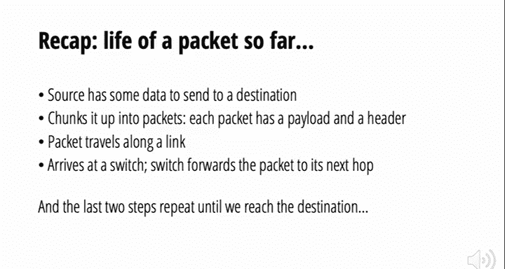

数据包通过链路的**总延迟** = **传输延迟**（将数据包所有比特放入链路的时间） + **传播延迟**。

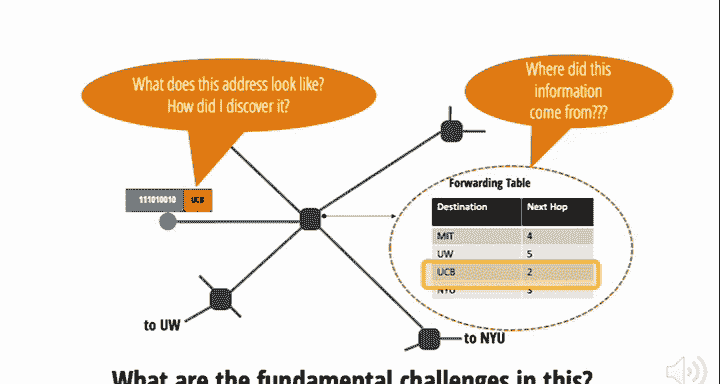

当数据包到达一个**交换机**（或路由器）时，交换机的核心任务是**转发**数据包。它通过查看数据包头部的**目的地址**，查询本地的**转发表**，来决定应该从哪个出站链路将数据包发送出去，以使其更接近目的地。

因此，数据包的“一生”可以概括为：源主机将数据分块成带地址的数据包 -> 数据包通过链路传输 -> 到达交换机 -> 交换机查表并转发到下一跳 -> 重复最后两步，直到数据包到达目的主机。

---

## 互联网的核心挑战与主题 🎯

在理解了数据包转发的基本流程后，我们意识到其中隐藏着许多复杂的挑战。本节中，我们来看看这些挑战构成了本课程将要深入研究的核心主题。

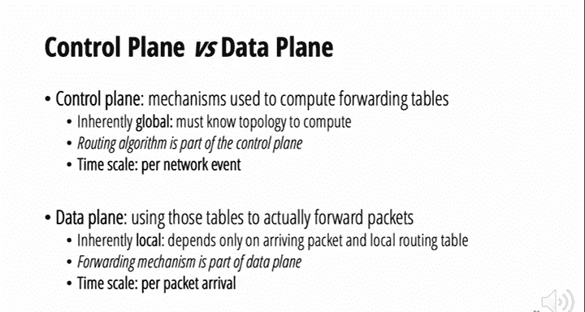

以下是构建一个可工作的互联网需要解决的关键问题：
*   **命名与寻址**：互联网上的主机如何被命名（如 `google.com`）？如何被寻址（如 `142.250.190.78`）？
*   **域名系统**：如何将用户友好的名称（如 `cnn.com`）映射到机器可读的网络地址？这由 **DNS** 系统完成。
*   **路由**：网络中的交换机如何计算出正确的**转发表**？这涉及到在由交换机和链路组成的网络拓扑图上计算路径，是一个分布式算法问题。
*   **IP转发**：如何高效地实现数据平面的转发操作？这需要在极短的时间内（如每10纳秒处理一个数据包）完成查表和发送。

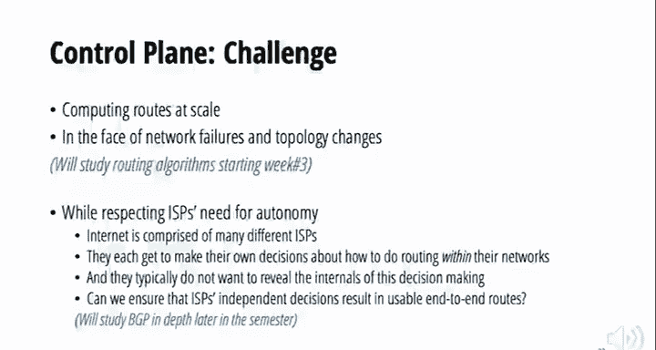

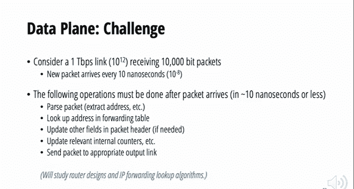

这里引出了一个重要区分：**控制平面** 负责计算和维护转发表（路由算法），其操作时间尺度是网络事件（如链路故障）。**数据平面** 负责使用转发表实际转发每个数据包，其操作时间尺度是每个数据包的到达。

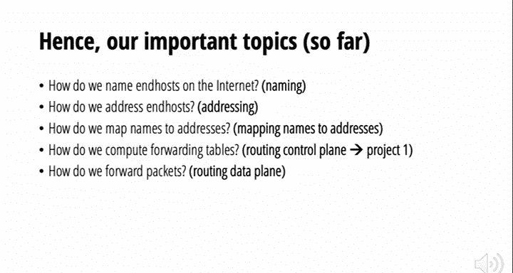

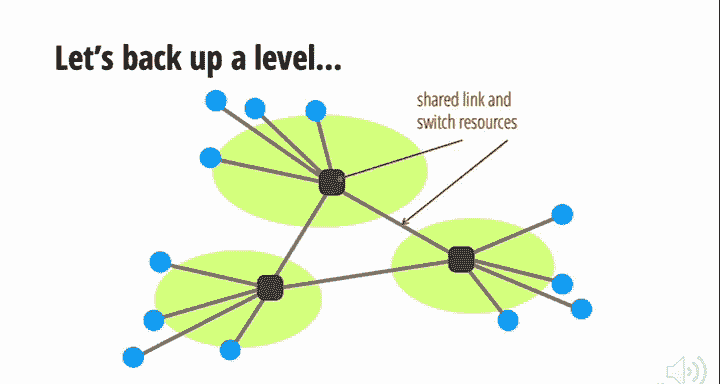

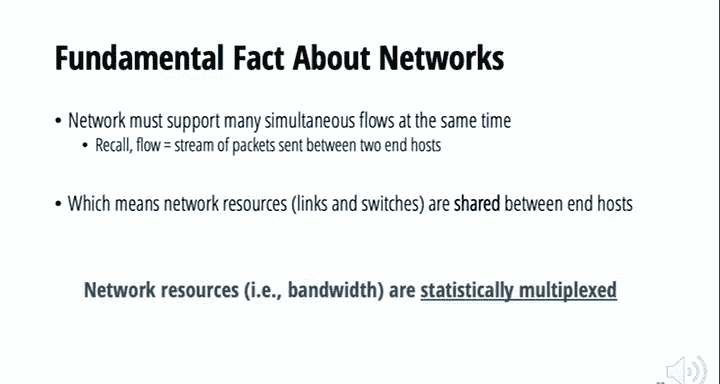

---

## 网络资源共享：统计复用 🤝

互联网需要同时支持大量用户、应用和数据流。这意味着网络资源（如链路带宽）必须被共享。本节中，我们探讨资源共享的基本模型。

资源共享的核心思想是**统计复用**。其原理是：不同用户或数据流对资源的需求是随时间变化的（峰值需求）。统计复用通过合并这些需求，使得在大多数时候，所有用户的总需求峰值远小于每个用户峰值需求的总和。这就像航空公司不会为每位乘客准备一架私人飞机，而是让大家共享航班座位，从而显著降低成本和提高效率。

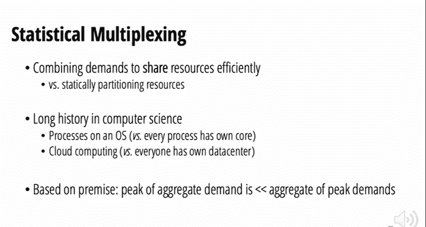

统计复用可以在不同粒度上进行（例如，在用户粒度、进程粒度或数据包粒度）。

实现资源共享主要有两种机制：
1.  **预留**：在发送数据前，终端主机向网络申请并预留特定数量的资源（如带宽）。如果预留成功，就建立了一条**电路**，数据可以在这条有保障的路径上传输。完成后，电路被拆除以释放资源。传统电话网络采用这种方式。
2.  **尽力而为**：终端主机直接发送数据包，不预先预留。网络中的交换机会尽力转发每个数据包，但如果当前资源不足（如出站链路拥塞），数据包可能会被丢弃。互联网主要采用这种方式。

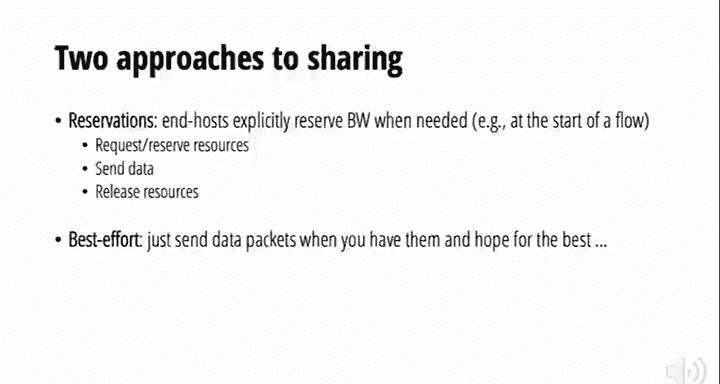

值得注意的是，**电路交换**和**分组交换**（即数据包交换）都是实现统计复用的方式，只是资源分配的粒度和时机不同：电路交换在“流”的粒度上预留资源，而分组交换在“每个数据包”的粒度上即时分配资源。

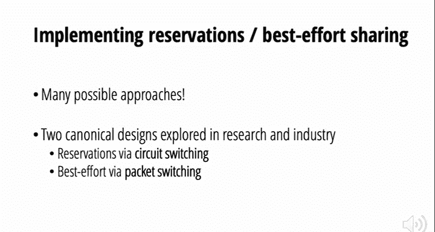

---

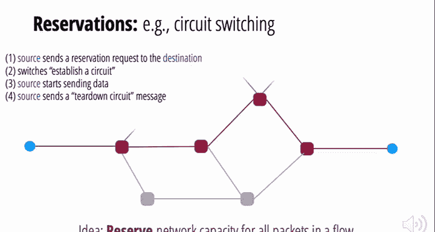

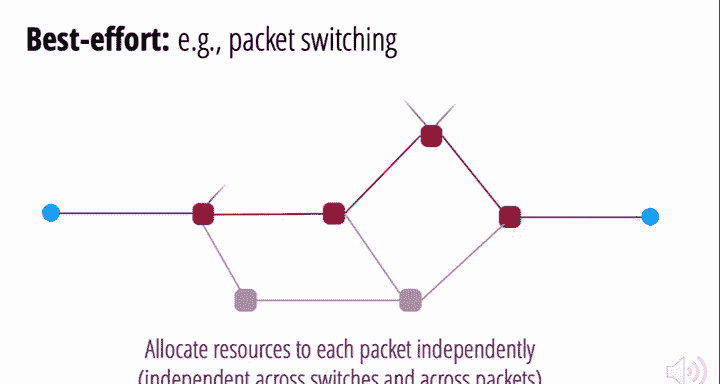

## 总结 📝

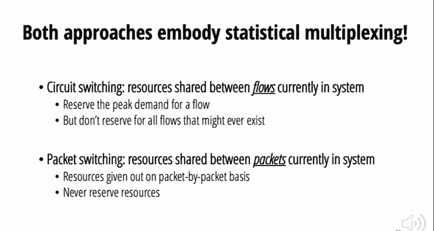

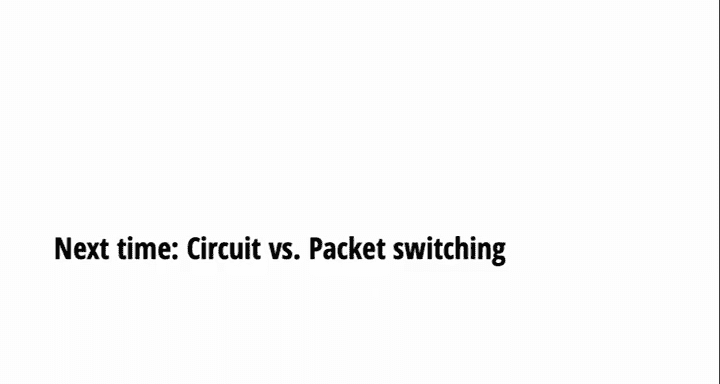

本节课我们一起学习了互联网工作原理的底层基础。我们从数据包的结构和传输开始，理解了头部和有效载荷的作用，以及数据包如何通过链路延迟的计算和交换机的转发在网络中穿行。我们识别出了构建互联网需要解决的核心挑战：命名、寻址、DNS、路由和转发。最后，我们探讨了网络资源共享的根本必要性，并介绍了统计复用的概念及其两种主要实现机制：预留（电路交换）和尽力而为（分组交换）。在接下来的课程中，我们将对这些主题进行更深入的探讨。