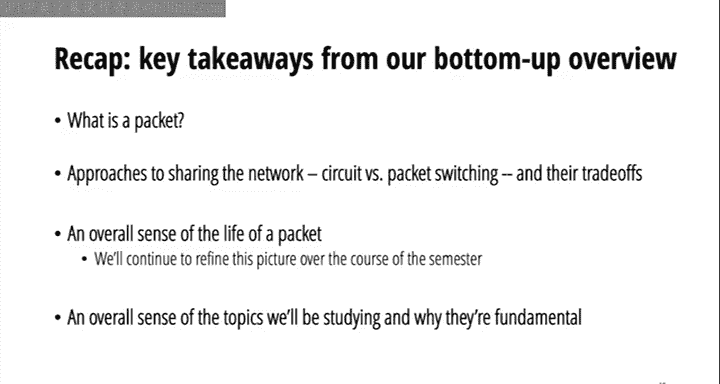
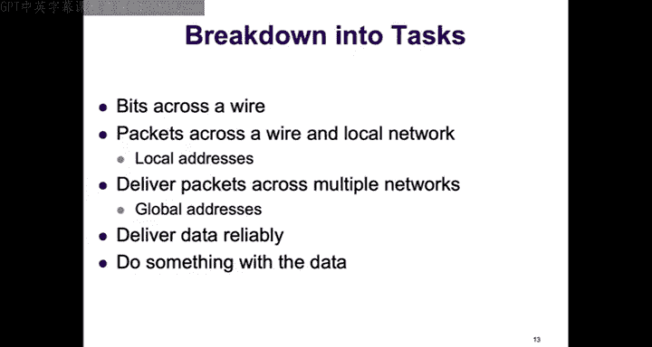
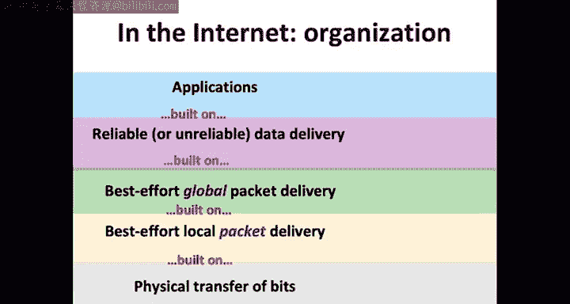
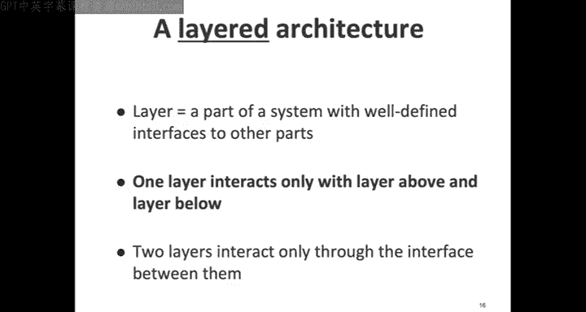
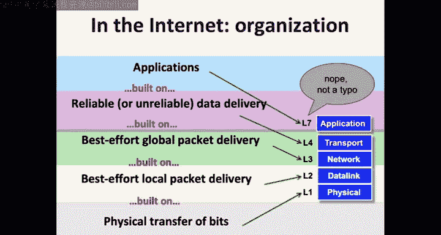
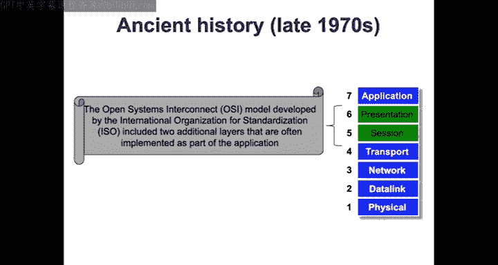
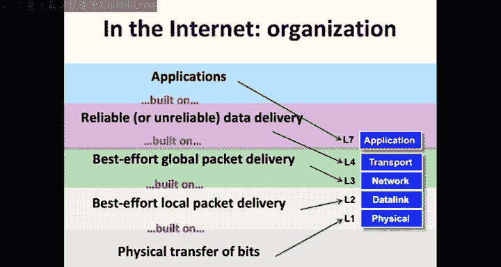

# 3：互联网工作原理概述（续）

## 概述

在本节课中，我们将继续从底层视角概览互联网的工作原理，完成关于电路交换与分组交换的讨论，并开始从顶层视角审视互联网的架构。我们将探讨这两种交换方式的优劣，并引入互联网的分层架构模型。

---

## 电路交换与分组交换的对比

上一节我们介绍了网络资源共享的两种基本方法：电路交换与分组交换。本节中，我们将从几个关键维度来比较这两种方法，以理解为何互联网主要采用分组交换。

以下是评估电路交换与分组交换优劣的四个主要标准：

1.  **对应用程序的抽象**：网络向应用程序开发者提供了怎样的编程接口（API）？
2.  **网络资源利用效率**：哪种方式能更有效地利用昂贵的网络带宽？
3.  **故障处理能力**：当网络中的链路或交换机发生故障时，哪种方式能更快速、简单地恢复？
4.  **实现复杂度**：哪种方式的协议和系统设计更简单、更易于大规模部署？

### 应用程序抽象

*   **电路交换**：为应用程序提供**预留带宽**的抽象。应用程序可以请求特定速率的带宽（如10 Mbps），如果网络确认，则在整个通信期间保证提供该速率。这使得性能可预测、可理解，并且便于运营商基于使用量进行计费。
*   **分组交换**：为应用程序提供**尽力而为**的抽象。应用程序只是发送数据，网络不保证带宽、延迟或可靠性。应用程序获得的性能可能随时变化。

从应用程序开发者的角度看，电路交换提供的确定性保证通常更受欢迎。

### 网络资源利用效率

分组交换通常在效率上更具优势，原因在于**统计复用**的粒度不同。

*   **电路交换**：以**整个数据流**为粒度进行资源预留。即使应用程序的流量是突发性的（峰值高、平均低），它也必须为整个会话预留峰值带宽。这可能导致网络资源在大部分时间未被充分利用，并可能因为预留的“碎片”无法满足新流的峰值需求而拒绝服务。
*   **分组交换**：以**单个数据包**为粒度进行资源复用。多个突发性数据流的包可以交错传输，填充彼此的空闲时段，从而更高效地利用链路容量。对于流量平滑的应用（如传统语音通话），两者效率可能相近；但对于突发性强的数据应用（如网页浏览），分组交换的效率优势显著。

此外，对于发送数据量很小但很频繁的应用（如物联网传感器），电路交换中频繁建立和拆除连接的开销可能远大于实际数据传输的开销，效率低下。

### 故障处理能力

当网络路径中的某个交换机发生故障时：

*   **分组交换**：
    1.  网络（控制平面）检测到故障，并重新计算一条绕过故障点的路径。
    2.  **终端主机无需任何操作**，继续发送数据包。新路径上的交换机会自动将包转发到新路径。在路由收敛期间可能会有包丢失，但对终端透明。
*   **电路交换**：
    1.  网络同样需要检测故障并计算新路径。
    2.  **终端主机必须参与恢复**：它需要先拆除旧的预留（向原路径发送拆除消息），然后沿着新路径发起新的带宽预留请求。这个过程复杂、耗时，并且新路径可能无法满足原有的带宽预留要求。如果故障影响大量数据流，将引发“信令风暴”。

因此，分组交换在容错性方面简单且健壮得多。

### 实现复杂度

电路交换的实现远比分组交换复杂，核心挑战在于**状态的一致性**。

建立一个电路预留需要多个网络设备（交换机）就“某个流是否拥有预留”达成一致。在异步、大规模、动态变化的互联网环境中，实现这种分布式共识极其复杂。需要考虑和处理各种边界情况，例如：
*   预留请求或确认消息丢失怎么办？
*   计时器超时与确认消息到达的竞争条件如何处理？
*   预留被拒绝后如何协商？

虽然可以通过复杂的协议（如多次握手、确认、超时重传、状态同步）来解决这些问题，但这显著增加了系统的复杂性和开销。分组交换的核心“存储-转发”逻辑则相对简单直接。

### 小结与现状

综上所述：
*   **电路交换的推动力**：更好的应用性能（保证带宽）、可预测性、便于计费。
*   **分组交换的推动力**：更高的资源利用效率、更快的连接启动、更简单的故障恢复、更易于实现的架构。

因此，当今互联网的基石是**分组交换**。

尽管存在如**RSVP**（资源预留协议）这样的协议，但它并未被广泛用于端到端的动态带宽预留。更常见的是企业购买**MPLS专线**，这是一种静态配置、昂贵、非统计复用的“专属管道”，用于连接分支机构或承载高优先级流量，与理想的动态电路交换相去甚远。

历史上，在90年代，人们曾认为语音和视频将成为互联网的“杀手级应用”，并因此大力推动电路交换技术。但最终，电子邮件和万维网成为了真正的驱动力。随着链路带宽的增长、编码技术的进步以及自适应应用（如可根据网络状况调整质量的视频流）的出现，分组交换互联网已能很好地支持实时媒体。

---

## 深入分组交换：队列与丢包

现在，让我们更深入地看看分组交换网络中的关键机制。考虑一个简单的场景：一个交换机有两条输入链路和一条输出链路。

*   **瞬时过载**：在某个时刻，两条输入链路同时有数据包到达，都需要从同一输出链路发出。由于输出链路一次只能发送一个包，交换机需要做出决策。
*   **队列（缓冲区）的作用**：交换机使用一个**队列**（内存缓冲区）来临时存储无法立即发送的包。它会选择一个包发送（例如，先到先服务），将另一个包放入队列。队列吸收了流量的突发性，平滑了输出。
*   **持续过载与丢包**：如果输入速率持续超过输出链路容量，队列将被填满。当新包到达而队列已满时，交换机别无选择，只能**丢弃**这个包。这是网络丢包的主要原因之一。
*   **其他可能性**：理论上，交换机可以通知上游设备暂停发送（如流量控制），或将包转发到其他可用路径。但这些方法会引入额外的复杂性和状态管理。在互联网核心，**尾部丢弃**（丢弃最新到达的包）是常见且简单的策略。

因此，我们需要更新对数据包生命周期的理解：
1.  包到达交换机。
2.  交换机可以**转发**包到下一跳，**缓冲**（放入队列）包，或者**丢弃**包。
3.  重复此过程，直到包到达目的地**或**被丢弃。

数据包的端到端延迟现在包括三部分：**传输延迟** + **传播延迟** + **排队延迟**。

---

## 由此引入的新挑战

分组交换的“尽力而为”和“队列管理”特性引出了两个核心挑战，这也是本课程后续的重点：

1.  **可靠数据传输**：既然网络可能丢包，我们如何确保应用程序的数据最终能完整、正确地送达目的地？这将是**传输层**（如TCP协议）的核心任务，也是你的第二个项目主题。
2.  **拥塞控制**：每个终端主机独立决定发送速率。如果大家都过快发送，共享链路上的队列会溢出，导致大量丢包，性能急剧下降。如何让所有主机分布式地、自适应地调整发送速率，在保证自身性能的同时不过度占用网络资源，并充分利用可用带宽？这是**拥塞控制**算法要解决的问题。

---

## 互联网的顶层视角：分层架构

现在，让我们切换视角，从顶层（应用程序的角度）来理解互联网是如何组织起来的。构建复杂系统的关键方法是**模块化**，而互联网采用了严格的**分层架构**。

### 分层设计思想

类比公司间寄信：
*   **CEO** 写**信**（应用数据），交给**助理**。
*   **助理** 把信装入**信封**，写上收件CEO姓名和公司地址（本地地址），交给**FedEx**。
*   **FedEx** 把信封装入**运输袋**，贴上**路由标签**（全球地址），通过其运输网络递送。
*   到达对方公司后，过程反向进行。

每一层的对等实体（CEO与CEO、助理与助理、FedEx与FedEx）理解相同的信息格式和语义。每一层只关心自己层的封装，利用下一层的服务，并为上一层提供服务。这就是**分离关注点**和**抽象**。

### 互联网的五层模型

互联网将数据传送任务分解为五个层次，构成一个严格的层级结构（上层仅使用下层的服务）：

1.  **物理层**：负责在单条链路上传输原始比特流（如光信号、电信号）。
2.  **数据链路层**：负责在**单个本地网络**（如一个以太网、一个Wi-Fi网络）内，实现节点到节点的**尽力而为帧**（数据包在此层的称呼）传递。它处理本地寻址（如MAC地址）、错误检测等。
3.  **网络层**：负责在**全球范围**内，跨越多个不同网络，实现主机到主机的**尽力而为数据包**传递。其核心是**IP协议**，提供全局唯一的**IP地址**和路由功能。
4.  **传输层**：负责在主机上的**应用程序进程之间**，提供**可靠或不可靠的数据传输服务**。它处理将应用数据分段成包、重组、可靠性（如重传）、流量控制和拥塞控制。主要协议是TCP（可靠）和UDP（不可靠）。
5.  **应用层**：包含具体的网络应用程序（如HTTP、SMTP、DNS）及其协议，直接为用户提供服务。

**历史注记**：在早期的OSI七层模型中，还有会话层和表示层，但由于过度设计，其功能已被融入应用层，因此互联网实际广泛采用的是这个五层模型。

### 分层架构的优势

*   **简化设计**：各层独立，定义清晰的接口。
*   **技术演进**：可以更改某一层的实现而不影响其他层（例如，从以太网升级到Wi-Fi，只要数据链路层接口不变，上层无感知）。
*   **互操作性**：不同厂商的设备只要遵循相同的层次协议就能通信。

---

## 总结

本节课中我们一起学习了：
1.  **电路交换与分组交换的详细对比**，从应用抽象、效率、容错和复杂度四个方面分析了分组交换成为互联网主流技术的原因。
2.  **分组交换网络中的队列与丢包机制**，理解了瞬时过载、持续过载以及由此产生的排队延迟和丢包现象。
3.  **分组交换带来的两大核心挑战**：可靠数据传输和拥塞控制，它们将是后续课程的重点。
4.  **互联网的分层架构模型**，从顶层视角将互联网分解为物理层、数据链路层、网络层、传输层和应用层，理解了这种模块化设计如何通过抽象和分离关注点来管理复杂性。

下一讲，我们将更深入地探讨传输层存在的必要性及其核心协议。