# 4：设计目标与历史

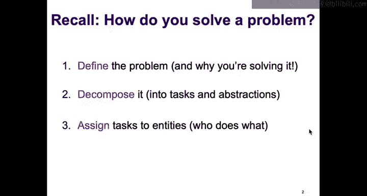

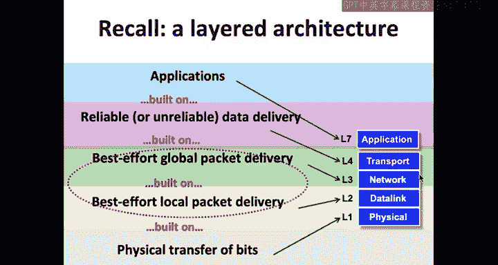

## 概述

在本节课中，我们将学习互联网架构的核心设计思想，特别是分层模型、协议栈以及“端到端原则”。我们将探讨互联网如何通过分层结构将复杂的端到端数据传输任务分解，并理解为何将某些功能（如可靠性）置于网络之外是明智的设计选择。

---

## 分层架构回顾

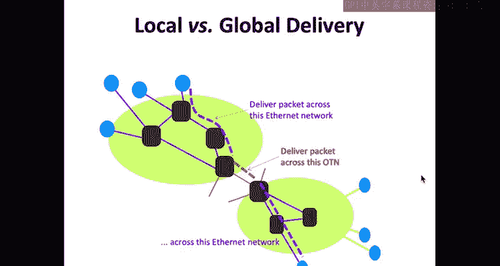

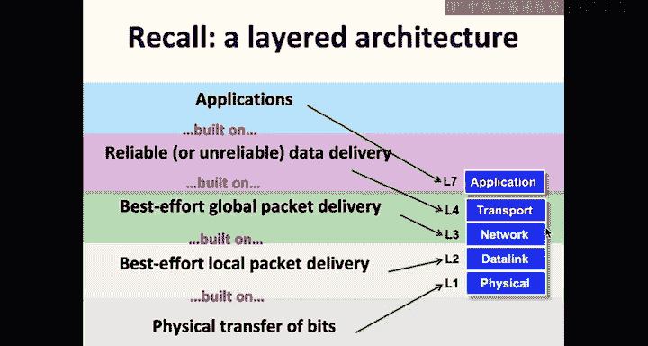

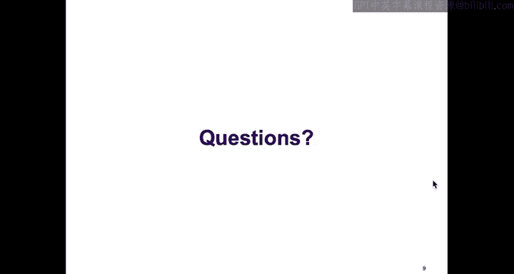

上一节我们介绍了互联网的五层模型。本节中，我们来看看这个模型的具体含义和逻辑通信过程。

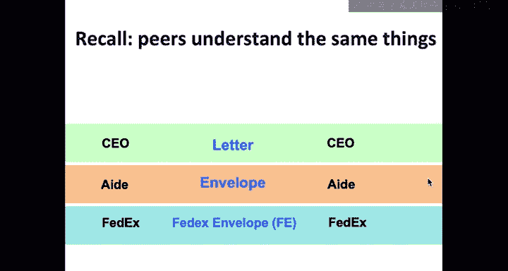

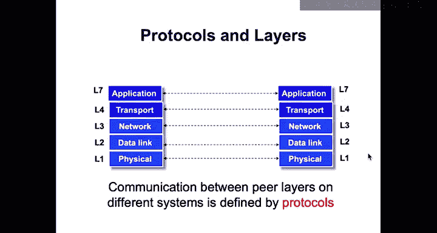

我们通过“自上而下”的方法分解了互联网的核心任务——将数据从一个终端主机传输到另一个终端主机。最终，我们得到了一个五层任务分解模型：

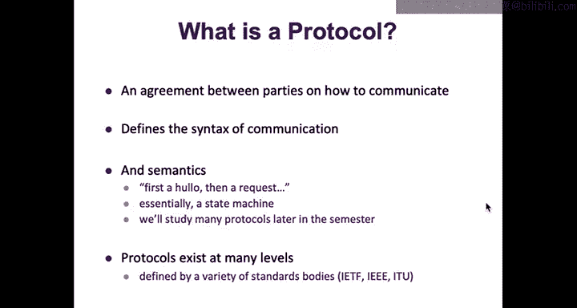

*   **应用层**：建立在可靠数据传输之上，处理应用程序间的通信。
*   **传输层**：提供可靠的数据传输服务，将数据转换为数据包。
*   **网络层**：提供**全局尽力而为的数据包交付**，实现端到端的路由。
*   **数据链路层**：提供**本地尽力而为的数据包交付**，在特定链路技术（如以太网）内传输数据包。
*   **物理层**：负责在物理媒介上实际传输比特。

### 全局交付与本地交付的区别

理解网络层（全局交付）和数据链路层（本地交付）的区别至关重要。

考虑一个由多种链路技术（如以太网、光传输网络OTN、蜂窝网络）互联而成的网络：

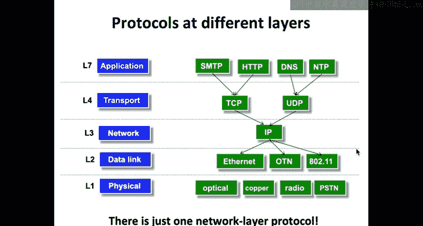

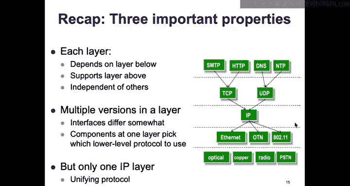

*   **本地交付**：每种链路技术（如以太网）都有自己的寻址和路由方式，知道如何在其自身的网络范围内（例如，一个以太网段）传输数据包。但它不知道如何跨越到另一种技术（如OTN）的网络。
*   **全局交付**：网络层（IP协议）的职责，就是利用这些本地交付能力，将它们“缝合”在一起，形成一条从源到目的地的端到端路径。IP协议不重新发明每种链路技术，而是知道如何与它们对接。

这正是“互联网是网络的网络”这一说法的具体体现。

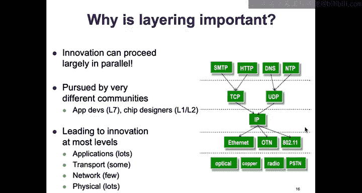

---

## 协议与协议栈

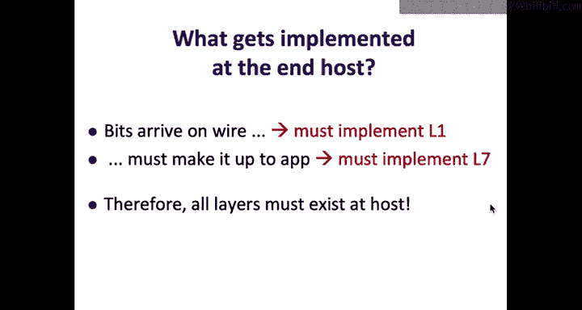

上一节我们介绍了分层模型，本节中我们来看看各层之间如何通过“协议”进行通信。

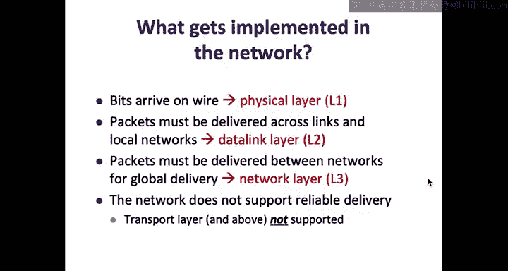

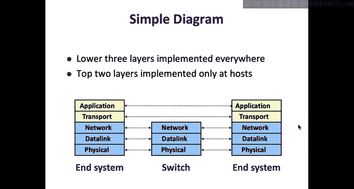

### 协议的定义

协议是通信实体之间关于如何通信的规范或约定。它包括：
*   **语法**：定义了报文（或数据包头部）的确切格式，例如字段的长度和顺序。
*   **语义**：定义了接收到报文后应采取的动作和步骤。

### 多层协议

互联网的每一层都有一个或多个协议来实现该层的功能。协议通常由标准组织（如**IETF**）定义。

以下是各层常见协议的示例：

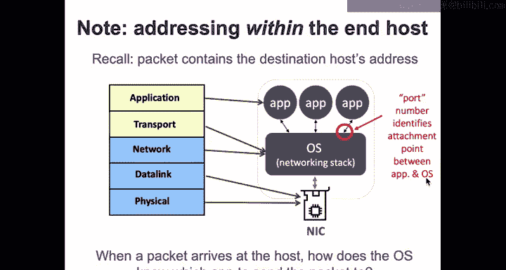

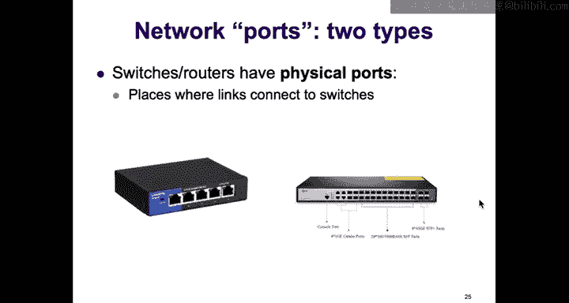

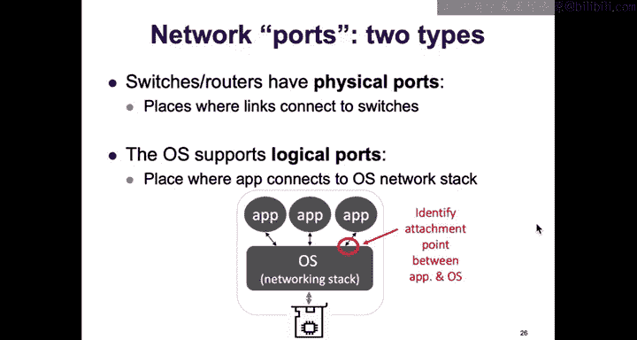

需要理解的关键点：
1.  **同一层可以有多个协议**：这意味着该层功能有不同的实现方式。
    *   例如，数据链路层既有**以太网**协议用于以太网链路，也有**OTN**协议用于光传输链路。
    *   传输层既有提供可靠服务的**TCP**协议，也有不提供可靠性保证的**UDP**协议。
    *   应用层有用于网页传输的**HTTP**协议，也有用于时间同步的**NTP**协议。
2.  **对等通信**：通信双方必须在同一层使用相同的协议（例如，TCP只能与TCP通信，HTTP只能与HTTP通信）。
3.  **协议栈**：一个设备（如你的电脑）上实现的一系列特定协议的组合，构成了一个“协议栈”。数据在网络栈中被逐层处理。
4.  **唯一的网络层协议**：在整个互联网中，**IP协议是网络层唯一的核心协议**。它是将所有不同类型网络和应用粘合在一起的“胶水”。（注：IPv4和IPv6是IP协议的不同版本，它们之间不能直接互操作）。

### 分层的重要属性与优势

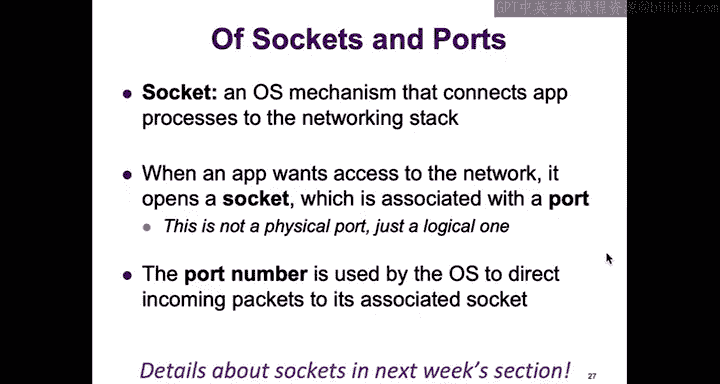

分层架构有三个重要属性：
1.  每一层依赖于其下一层提供的服务。
2.  每一层为其上一层提供服务。
3.  每一层只与它的直接上层和下层交互（严格分层）。

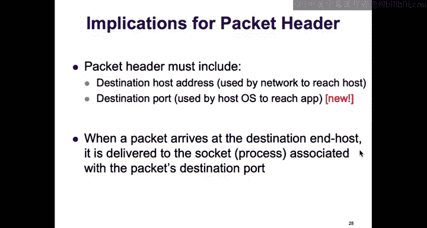

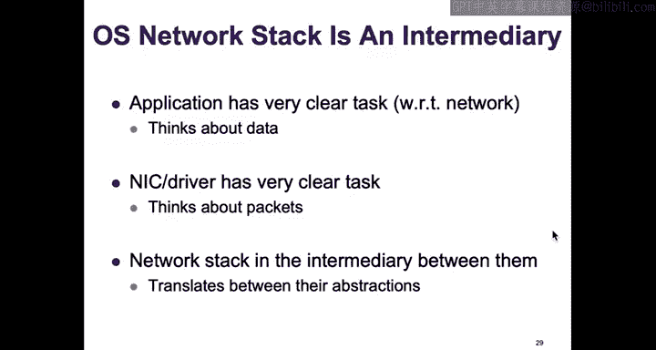

这种设计是一种模块化形式，其主要优势在于**促进创新**。由于层与层之间接口清晰，各层可以独立地进行创新和演进。例如，物理层开发新的光纤技术时，应用层的开发者完全无需关心。这种独立性对于由众多不同厂商参与建设的互联网至关重要。

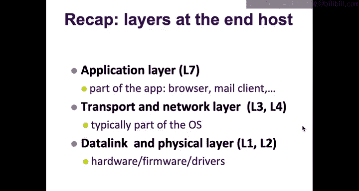

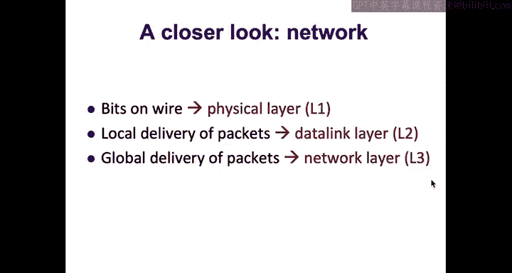

唯一的例外是网络层（IP层），由于它的唯一性和核心地位，其演进（如从IPv4到IPv6）非常缓慢和困难。

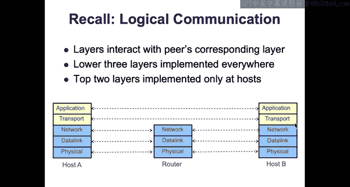

---

## 功能在终端与网络间的划分

上一节我们讨论了逻辑上的分层，本节中我们来看看这些功能具体由谁（终端还是网络设备）来实现。

### 终端主机的实现

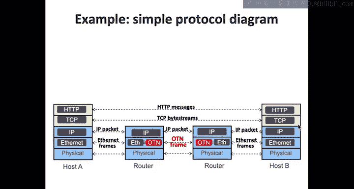

终端主机（如你的笔记本电脑、手机）必须实现全部五层。
*   **原因**：它既要运行应用程序（应用层），也要能够从物理线缆上收发比特（物理层）。根据严格分层原则，它需要实现中间所有层来连接这两端。

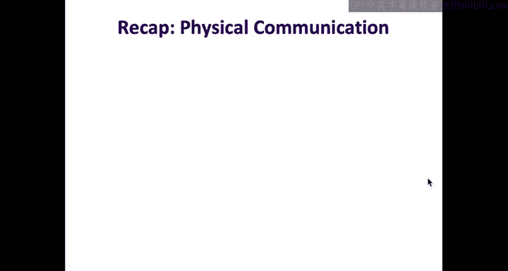

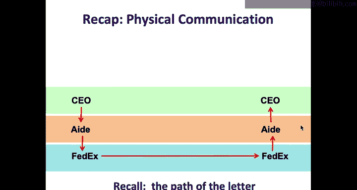

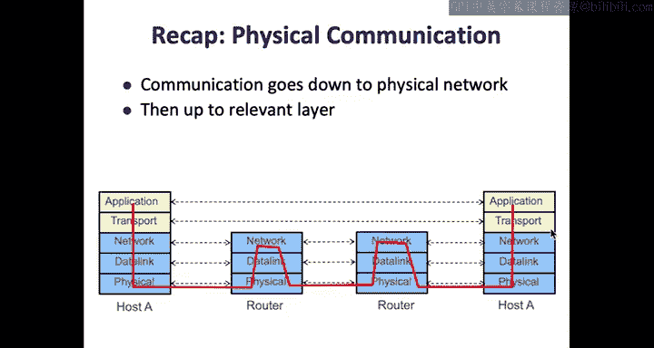

在终端主机内部，功能通常这样分布：
*   **应用层**：由应用程序自身实现。
*   **传输层和网络层**：通常由操作系统内核中的**网络栈**实现。这样做的原因是提供通用、可复用的服务，避免每个应用都重新实现数据分片、可靠性保证等复杂逻辑。
*   **数据链路层和物理层**：通常由**网络接口卡**及其驱动程序实现。

### 端口：将数据包交给正确的应用

当数据包到达目的主机后，操作系统如何知道该将它交给哪个应用程序？答案是**端口**。

需要注意区分两种端口：
*   **物理端口**：设备上连接网线的物理接口。
*   **逻辑端口**：操作系统中的一个数字标识符，用于标识应用程序与网络栈之间的连接点。数据包头部中包含**目的端口号**，操作系统根据这个端口号将数据递交给对应的应用程序（更具体地说，是递交给与该端口绑定的**套接字**）。

### 网络设备的实现

网络设备（交换机、路由器）只需要实现下三层：物理层、数据链路层和网络层。
*   **原因**：它们的核心工作是转发数据包，而不需要理解应用程序数据或提供端到端的可靠性保证。**网络不实现传输层和应用层**。

这就形成了互联网最基本的功能划分视图：

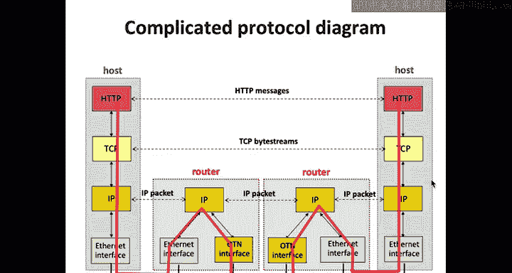

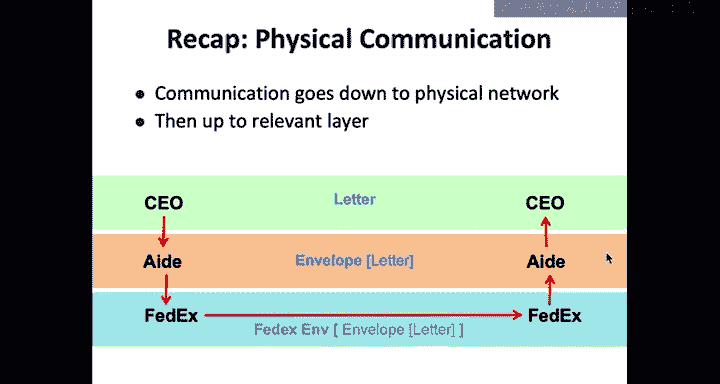

*   **终端主机**：实现全部五层。
*   **路由器/交换机**：实现下三层（L1-L3）。

---

## 数据流：封装与解封装

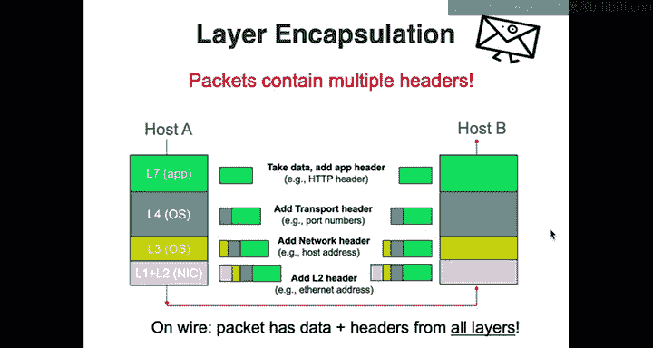

上一节我们知道了功能在哪里实现，本节中我们来看看一个数据报文是如何实际穿越网络到达目的地的。

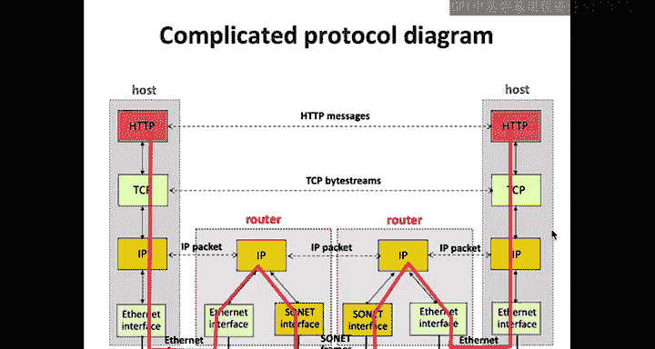

### 逻辑通信与物理路径

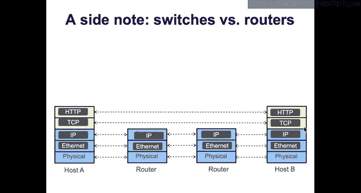

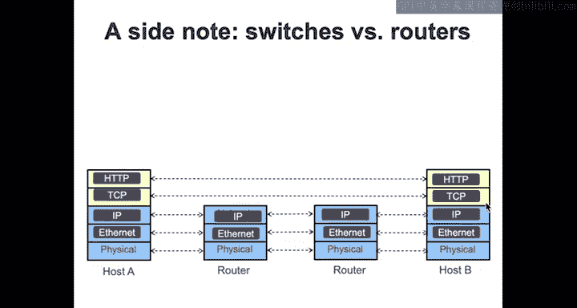

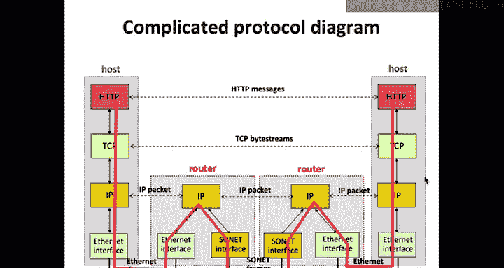

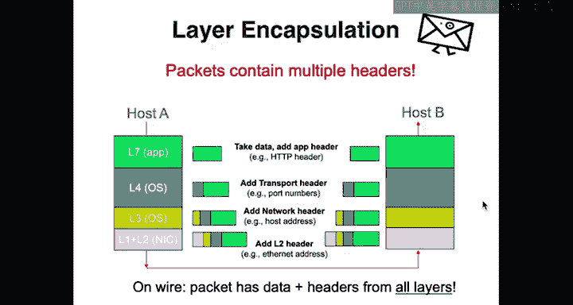

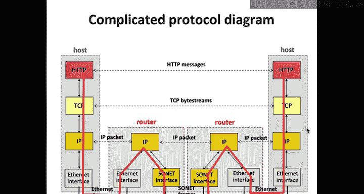

协议图中虚线表示的“对等通信”是**逻辑通信**，即双方理解相同的语言。而数据实际的**物理路径**是：从源主机的应用层开始，逐层向下传递，通过物理链路传输到网络设备，在网络设备中可能上到网络层进行路由决策，然后再向下传递，通过新的链路传输，最终到达目的主机，再逐层向上传递到目标应用。

### 封装过程

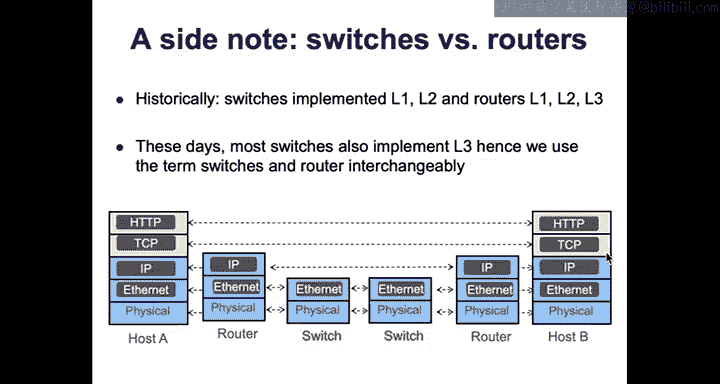

数据在源主机向下传递时，每一层都会在数据前添加自己的**头部**（封装）：
1.  应用层生成**应用数据**。
2.  传输层（如TCP）添加 **TCP头部**，形成**数据段**。
3.  网络层（IP）添加 **IP头部**，形成**数据包**。
4.  数据链路层（如以太网）添加 **以太网头部**，形成**数据帧**。
5.  物理层将帧转换为比特流发送出去。

每一层的头部都包含了该层协议对等通信所需的信息（如目的IP地址、目的端口号、目的MAC地址等）。

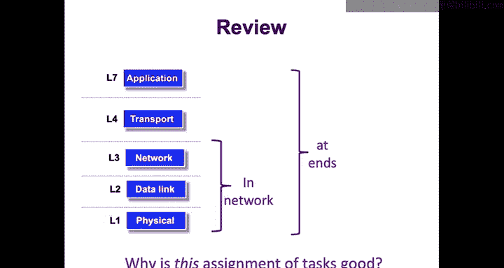

### 解封装与转发过程

数据在传输过程中：
*   在**路由器/交换机**上：设备根据其实现的层次查看相应的头部。例如，一个路由器会查看**IP头部**中的目的IP地址，查询路由表，决定从哪个接口转发出去。在转发前，它会去掉旧的链路层头部，并加上新的链路层头部（因为出接口的链路技术可能和入接口不同）。**路由器不会查看TCP或HTTP头部**。
*   在**目的主机**上：数据帧被网卡接收，操作系统网络栈逐层向上处理，每层移除对应的头部，最终将原始应用数据交给目标端口对应的应用程序。

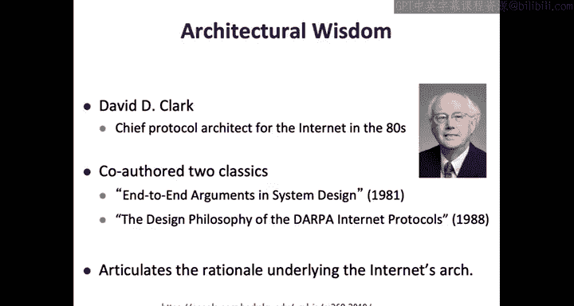

这个过程完美体现了IP协议作为“粘合剂”的角色：它利用各种链路技术的本地交付能力，通过查看IP头部进行全局路由决策，实现了跨异构网络的端到端通信。

---

## 设计哲学：端到端原则

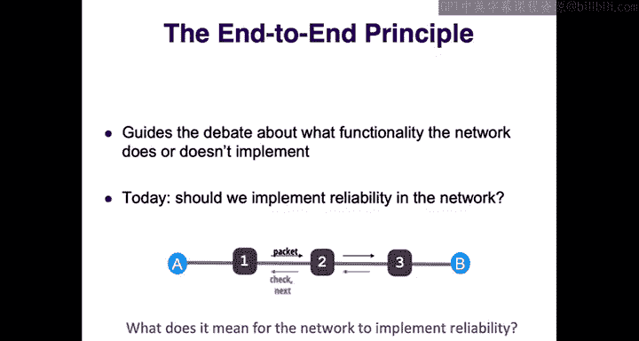

上一节我们详细了解了数据流动的机制，本节中我们从更高视角探讨一个核心设计哲学：为什么互联网选择不将可靠性等功能内置在网络中？

### 问题的提出：可靠性应该放在哪里？

考虑一个简单的任务：将文件从主机A可靠地传输到主机B。这涉及多个步骤：A读磁盘、操作系统处理、网络传输、B的操作系统处理、B写磁盘。

有两种实现思路：
1.  **方案一（网络实现可靠性）**：在每一个步骤（包括网络中的每一段链路）都实现可靠性机制（如确认和重传），然后将这些可靠步骤拼接起来。
2.  **方案二（端系统实现可靠性）**：网络只提供尽力而为的服务。由主机A和主机B的应用程序进行**端到端的校验**（如计算并核对整个文件的校验和）。如果校验失败，则端到端地重传整个文件。

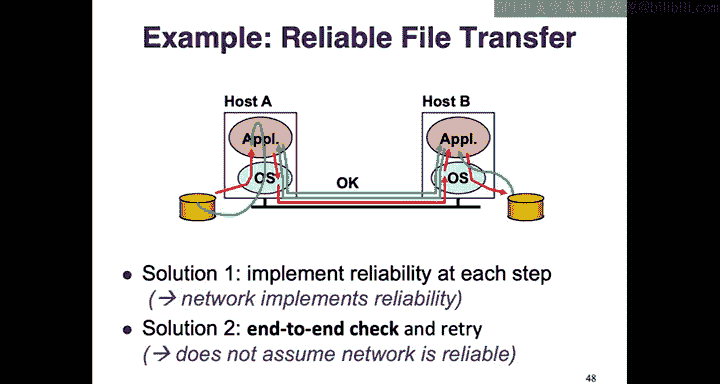

### 端到端原则的论证

**端到端原则**主张，像可靠文件传输这样的功能，**正确性**只能通过端到端的检查和恢复来保证。理由如下：

*   **方案一（网络可靠）的缺陷**：即使网络中的每一跳都保证可靠，仍无法确保端到端的正确性。例如，主机B的应用程序可能在接收文件后、写入磁盘前崩溃；或者某个网络组件可能存在软件缺陷，导致数据静默损坏。除非你能保证**所有**组件（包括所有网络设备和两端主机的软件）100%正确无误，否则方案一无法提供真正的端到端可靠性。为了正确性，**最终你仍然需要在端系统进行端到端的校验**。
*   **方案二（端到端可靠）的优势**：方案二将确保正确性的逻辑放在端系统。网络可以出错（丢包、损坏数据），但这不会导致**语义错误**（即主机B错误地认为自己拥有一个正确的文件）。最坏情况是传输失败或延迟，但不会静默地接受一个错误文件。端系统只依赖于自身实现的正确性。

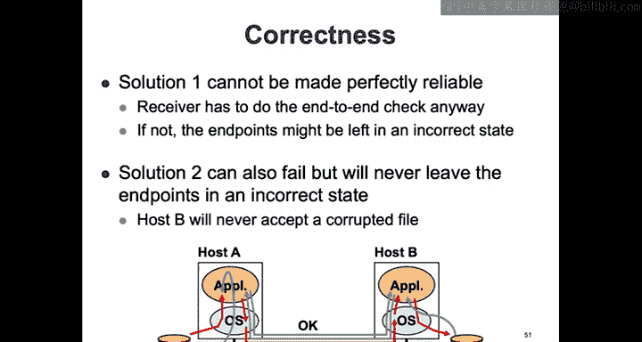

因此，端到端原则的结论是：**某些功能（如确保数据传输正确性），如果端系统为了正确性最终必须实现它们，那么将这些功能内置到网络中就变得不必要，甚至有害**。因为：
*   它增加了网络的复杂性。
*   它带来的开销（如延迟、状态维护）会施加给**所有**流量，即使某些应用不需要这种可靠性。

### 性能优化与原则的灵活性

端到端原则是一个指导性准则，而非绝对法则。有时，为了**性能优化**，在网络中增加一些可靠性机制是合理的。例如，如果一段链路的丢包率很高，在该链路上进行局部重传可以显著提高端到端传输的成功率和效率，从而帮助端到端的协议更好地工作。但这仍然是出于性能考虑，正确性的最终责任仍在端系统。

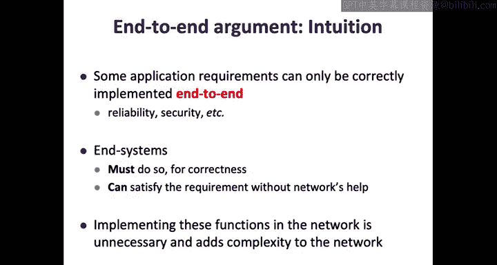

**端到端原则的核心思想**：在设计分布式系统时，应仔细考虑功能的正确性语义，并将确保该语义的责任放在能够完全、正确实现它的端点，从而保持中间网络简单、通用和高效。

---

## 总结

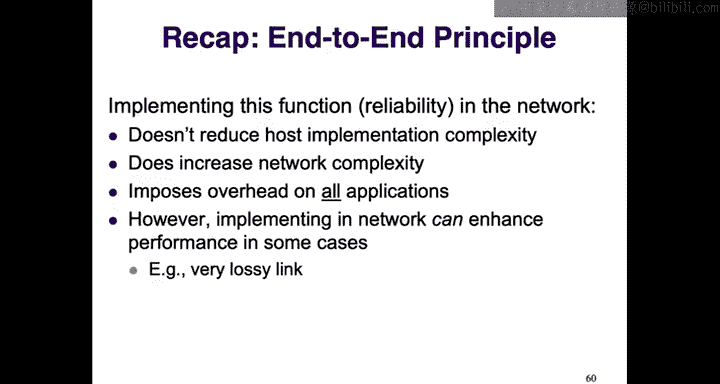

本节课中我们一起学习了互联网架构设计的核心内容：

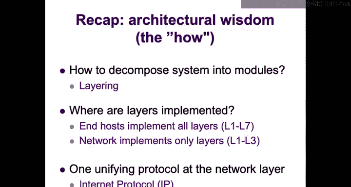

1.  **分层模型**：互联网采用五层模型（应用层、传输层、网络层、数据链路层、物理层）来分解复杂的通信任务，实现了清晰的关注点分离。
2.  **协议栈**：每一层通过特定的协议进行对等通信。IP协议是唯一、统一的网络层协议，负责将异构网络互联。
3.  **功能划分**：终端主机实现全部五层，而网络设备（路由器/交换机）只实现下三层。操作系统中的网络栈和端口机制是连接应用与网络的关键。
4.  **数据流**：通过封装（添加头部）和解封装（移除头部）的过程，数据穿越各层和网络设备，IP头部指导全局路由，各链路层头部指导本地转发。
5.  **端到端原则**：这是一个关键的设计哲学，主张将确保应用语义正确性（如可靠传输）的功能置于通信端点，而非网络内部，以保持网络简单并促进创新。网络内部的优化可以出于性能考虑，但不能替代端点的职责。

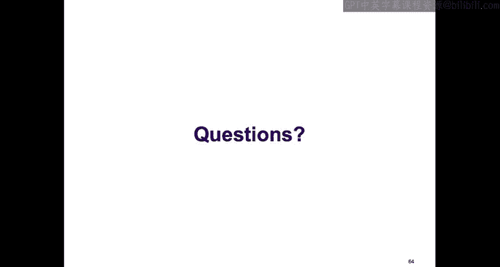

这种以IP为核心、严格分层、遵循端到端原则的设计，是互联网能够持续增长、适应各种新技术和新应用的根本原因。