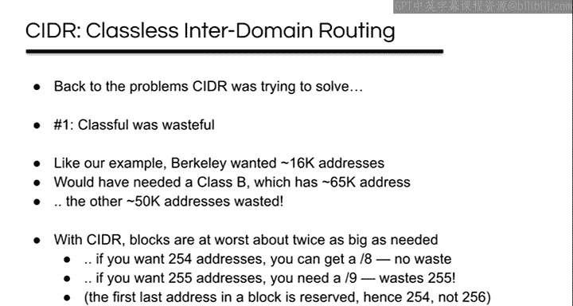

# 8：路由（三）与寻址

## 概述
在本节课中，我们将完成对学习型交换机和生成树协议的讨论，并开始探讨互联网寻址的核心概念。我们将了解分层寻址如何解决路由扩展性问题，并介绍IP地址的结构及其演变。

---

## 项目一更新
首先，助教Lloyd将为大家介绍项目一的相关信息。

项目一的内容是实现一个距离矢量路由协议的变体。所有项目相关材料，包括详细说明和演示，都已发布在Piazza上。请务必仔细阅读项目说明，并跟随每个阶段的演示进行操作，这将有助于你更好地理解项目内容和距离矢量协议的原理。

关于项目的任何问题，请在Piazza上提问或参加专门的项目答疑时间。常规的答疑时间将不处理项目相关问题。

---

## 学习型交换机与生成树协议
上一节我们介绍了距离矢量和链路状态协议，它们通过持续的路由消息交互来填充路由表。本节中，我们来看看一种截然不同的方法：学习型交换机和生成树协议。

在学习型交换机中，路由表是通过数据包“机会主义”地填充的，没有独立的路由消息，也无需静态路由作为种子。这种方法常用于第二层（L2）的路由（或称为交换）。

其工作原理是：当一个数据包从某个邻居到达交换机时，交换机可以从数据包的源地址学习到一条路由。如果数据包的目的地址不在表中，交换机会将数据包**泛洪**到除来源端口外的所有端口，期望目的主机能收到它。当目的主机回复时，其回复数据包又会沿途留下指向它的路由条目。

然而，这种方法在存在网络环路时会遇到严重问题。我们之前用于链路状态泛洪的解决方案（如序列号）在这里不适用，因为数据包可能由大量主机发送，且数据包本身可能没有序列号字段。

因此，生成树协议的解决方案是：**通过禁用网络中的某些链路来消除所有环路，将网络拓扑变为一棵树**。一旦网络成为树状结构，就可以安全地进行泛洪。

生成树协议主要做三件事：
1.  找到从每个交换机到**根交换机**（通常是ID最小的交换机）的最低成本路径。
2.  禁用所有不在通往根交换机最佳路径上的链路的数据传输。
3.  当树结构断裂（如链路故障）时，重新开始这个过程。

协议的第一部分与距离矢量协议非常相似，但目标是构建一棵以根交换机为目标的单一树。每个交换机开始时都认为自己是根，并通过交换消息来发现真正的根和到达根的最佳路径。

在确定了最佳路径后，每个交换机执行以下操作来决定启用或禁用哪些链路：
*   启用通往根交换机最佳路径上的那个链路。
*   禁用所有通往比自身更接近根交换机（但不在最佳路径上）的邻居的链路。
*   对于通往比自身更远离根交换机的邻居的链路，不做决定，由对方负责。
*   启用所有连接主机的链路。

通过这个过程，网络最终形成一个无环的生成树，学习型交换机可以在这个树上安全地进行泛洪操作。

---

## 寻址
现在，让我们转向互联网路由如何扩展到全球规模的问题。其奥秘主要在于**寻址**，特别是IP寻址。

互联网是“网络的网络”。这种结构自然形成了一个两层级的层次结构，而层次结构是解决扩展性问题的关键工具。

我们可以设想一种寻址方案，其中地址由两部分组成：**网络部分**和**主机部分**，格式类似于 `网络.主机`。例如，主机地址可以是 `3.7`，表示它在网络3中，是第7台主机。

这种分层寻址对路由扩展性带来了巨大好处：
*   **域间路由器**（连接不同网络）只需要知道如何到达其他**网络**，而无需关心每个网络内的具体主机。这极大地减少了路由表条目和需要处理的路由更新。
*   **域内路由器**需要知道如何到达本网络内的所有主机，以及一个指向边界路由器的“默认路由”或具体的外部网络路由，以便将数据包送出本网络。

边界路由器通过外部网关协议（EGP）学习到其他网络的路由，然后通过内部网关协议（IGP）将这些路由信息传播给域内的其他路由器。同时，域内路由器也通过IGP学习本网络内所有主机的路由。

### IP地址与分类寻址
IP地址长度为32位，通常写作点分十进制的形式，例如 `192.168.1.1`。

在互联网早期，地址被固定地划分为网络部分和主机部分。随着网络数量增长，出现了**分类寻址**：
*   **A类地址**：首位为 `0`，前8位为网络号，后24位为主机号。约有126个网络，每个网络可容纳约1600万台主机。
*   **B类地址**：前两位为 `10`，前16位为网络号，后16位为主机号。约有1.6万个网络，每个网络可容纳约6.5万台主机。
*   **C类地址**：前三位为 `110`，前24位为网络号，后8位为主机号。约有200万个网络，每个网络可容纳约254台主机。

分类寻址存在两个主要问题：
1.  地址块大小不灵活（A类太大，C类太小，B类数量不足）。
2.  随着B类网络即将耗尽，域间路由表条目数量增长过快，给路由器带来压力。

### 无类别域间路由
为解决这些问题，引入了**无类别域间路由**。CIDR做了两件关键事情：

1.  **引入层次化的地址分配**：地址分配不再是集中式的，而是形成了层级。ICANN将大块地址分配给区域互联网注册管理机构（RIR，如负责北美地区的ARIN），RIR再分配给大型ISP，ISP再分配给更小的组织或最终用户。每一级分配的都是一个连续的地址块。

2.  **放弃固定网络/主机边界**：使用**前缀长度**来灵活表示网络部分。地址写作 `基础地址/前缀长度` 的形式，例如 `192.168.0.0/16`。这表示前16位是网络前缀，剩余16位可用于主机。这允许更精细地分配地址空间，减少了浪费。

例如，一个组织可能需要2000个地址，ISP可以分配一个 `/21` 的地址块（包含2048个地址）给它，而不是强迫它使用一个B类或几个C类地址。

这种灵活的、基于前缀的寻址方式，结合层次化的分配，是当今互联网能够持续扩展的基石。

---

## 总结
本节课我们一起学习了以下内容：
*   完成了对学习型交换机和生成树协议的探讨，了解了如何通过构建生成树来解决L2网络中的环路泛洪问题。
*   深入探讨了互联网寻址的核心思想：通过将地址划分为网络部分和主机部分，并利用层次化结构，极大地提高了路由的扩展性。
*   回顾了IP地址从早期固定划分到分类寻址，再到如今无类别域间路由的演变过程，理解了CIDR如何通过灵活的前缀和层次化分配解决地址耗尽和路由表膨胀的问题。

下一讲，我们将继续深入探讨互联网的架构与协议。