# 11：设计IP协议

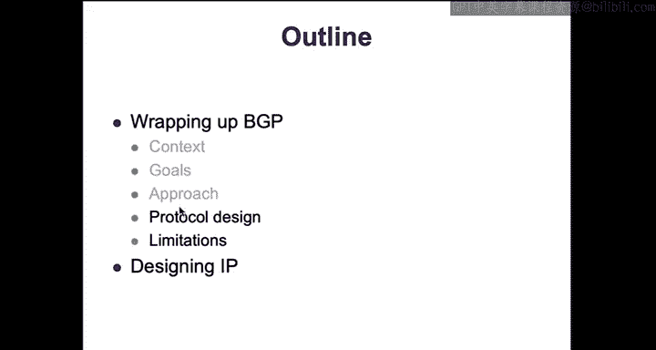

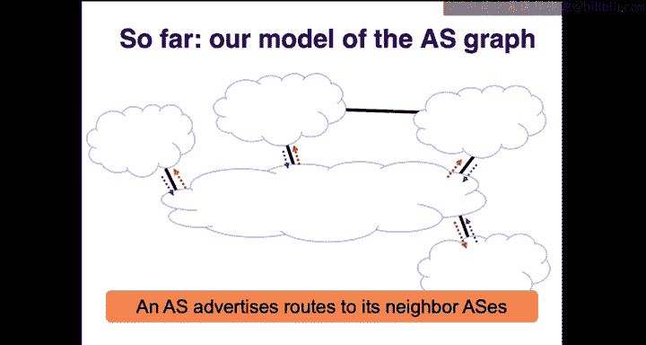

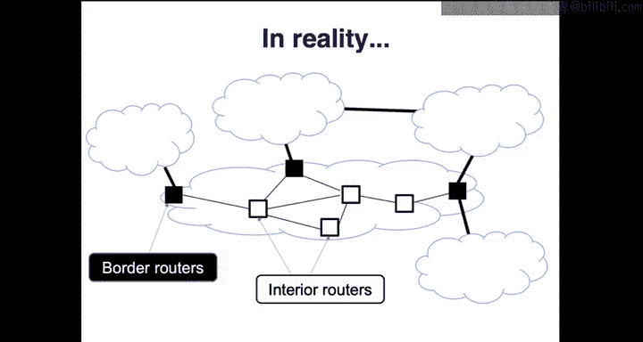

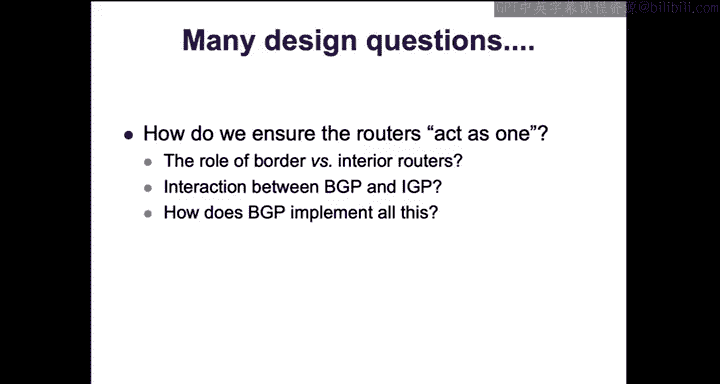

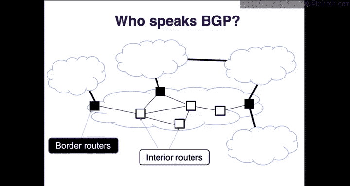

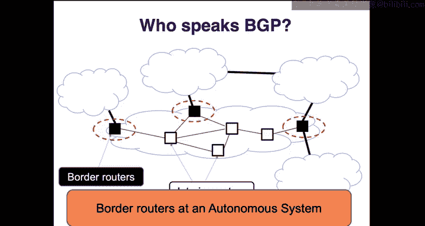

## 概述
在本节课中，我们将完成对BGP协议的讨论，并转向设计IP协议。我们将探讨BGP在路由器层面的分布式实现，以及IP数据包头部（IP Header）的设计原理、字段含义和作用。

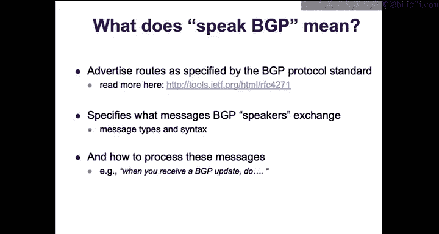

---

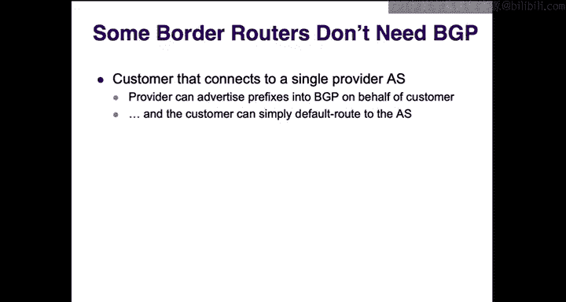

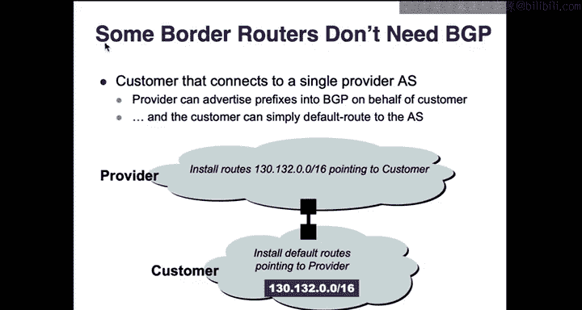

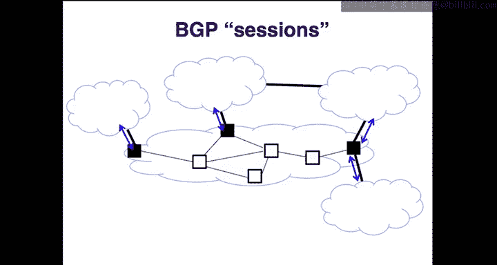

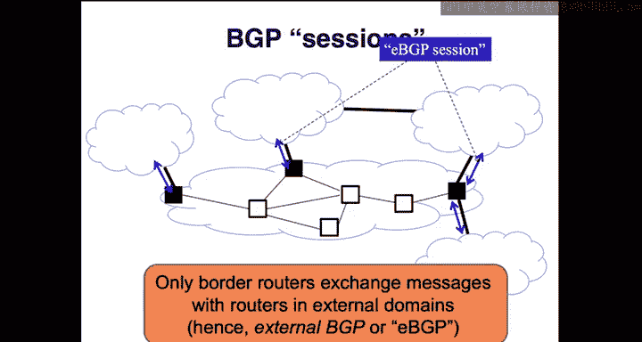

## 回顾BGP：从AS层面到路由器层面

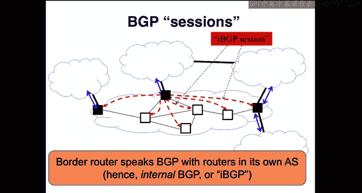

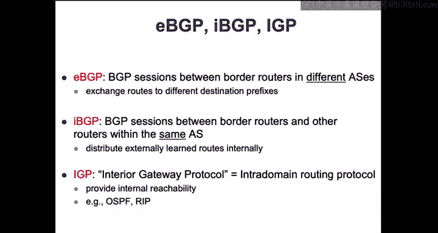

上一节我们介绍了BGP在自治系统（AS）层面的工作原理，包括目的地前缀、路径通告和基于策略的路由选择。

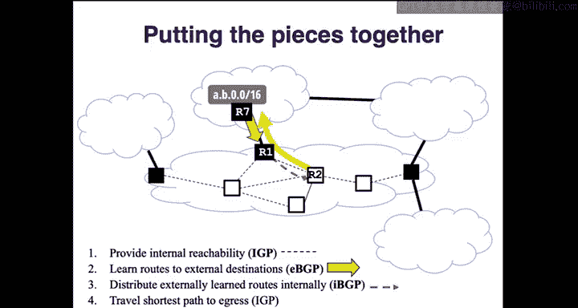

本节中，我们来看看如何在实际的路由器网络中实现这些AS层面的策略。关键在于，AS并非一个物理实体，而是由路由器和链路组成的网络。因此，核心挑战在于如何让每个独立运行的路由器协同工作，分布式地实现BGP策略。

以下是实现分布式BGP需要解决的关键问题：
*   **目标**：确保AS内的所有路由器都能执行AS层面的策略。
*   **角色**：区分边界路由器（Border Router）和内部路由器（Interior Router）的职责。
*   **集成**：如何将域内路由（Intra-domain routing）与域间路由（Inter-domain routing）结合起来。
*   **协议**：路由器之间交换哪些具体的协议消息来实现上述目标。

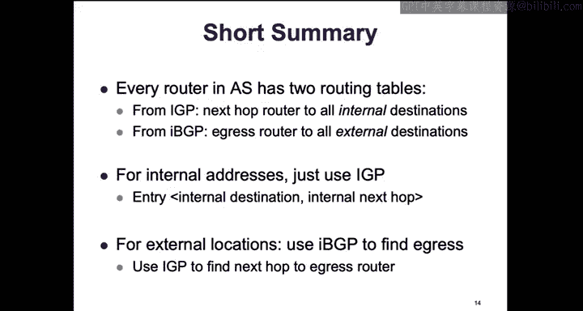

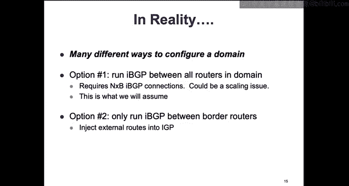

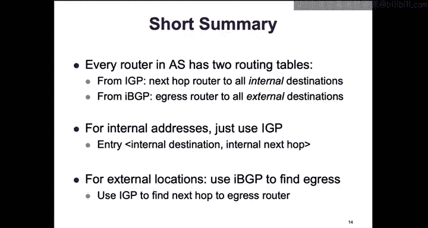

---

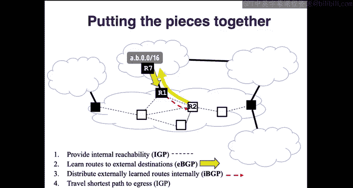

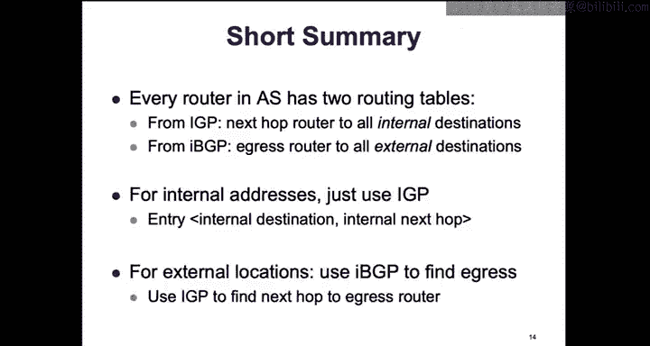

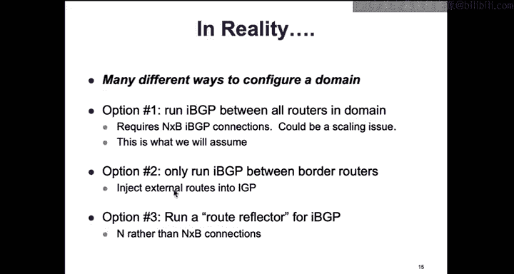

## BGP协议实现细节

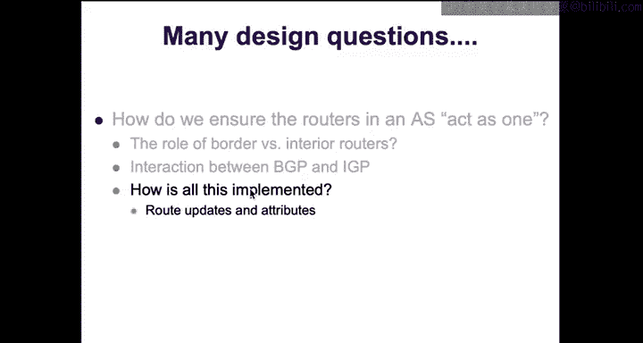

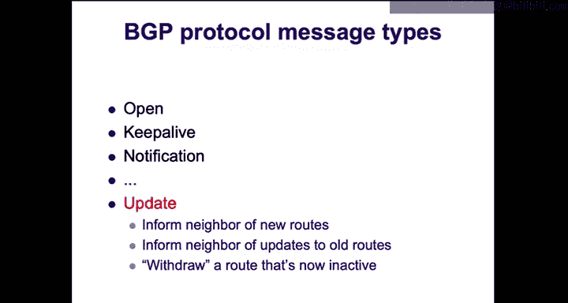

### BGP发言者与会话
在BGP术语中，运行BGP协议的路由器被称为 **BGP发言者（BGP Speaker）**。这通常指的是边界路由器。它们运行实现BGP协议规范的代码，能够发送、接收BGP消息并执行相应操作。

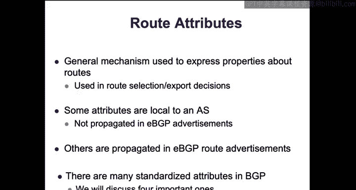

BGP发言者之间建立的连接称为 **BGP会话（BGP Session）**。主要有两种类型：
1.  **外部BGP会话（EBGP Session）**：位于不同自治系统的边界路由器之间的会话。用于学习外部网络的前缀，并向外部通告本AS的前缀。
2.  **内部BGP会话（IBGP Session）**：位于同一自治系统内部，边界路由器与所有其他路由器（包括其他边界路由器和内部路由器）之间的会话。用于在AS内部传播从外部学到的路由信息。

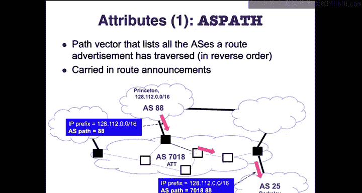

**简单回顾**：
*   **EBGP**：用于AS间交换路由信息。
*   **IBGP**：用于在AS内部分发路由信息。
*   **IGP**：域内网关协议，如OSPF、RIP，用于AS内部的路由计算。

### 路由信息整合流程
所有部分如何协同工作？以下是整合流程：
1.  **域内路由（IGP）**：在AS内部运行IGP（如OSPF），计算到达所有内部目的地（包括边界路由器）的最短路径。
2.  **域间路由学习（EBGP）**：边界路由器通过EBGP会话学习外部目的地的IP前缀。
3.  **内部信息分发（IBGP）**：边界路由器通过IBGP会话，将学到的外部路由信息分享给AS内的所有路由器。
4.  **完整路由视图**：此时，AS内的任何路由器都拥有到达互联网上任意目的地所需的信息。对于一个发往外部地址的数据包，路由器会进行两步查找：
    *   首先，根据目标IP前缀，通过IBGP信息确定应该使用哪个**出口边界路由器**。
    *   然后，根据IGP信息，确定到达该出口边界路由器的**下一跳**。

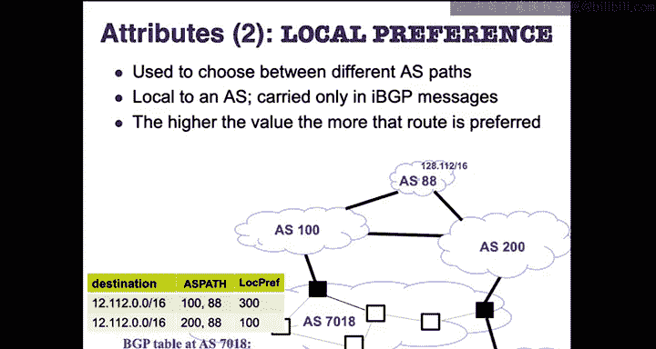

**示例**：假设AS 7拥有前缀 `A.B/16`。AS 1的边界路由器R1通过EBGP从AS 7学到该前缀。R1通过IBGP将此信息告知AS 1内的所有路由器，例如R2。现在R2知道，要到达 `A.B/16`，需要将流量发送给R1。同时，R2通过IGP知道如何到达R1。

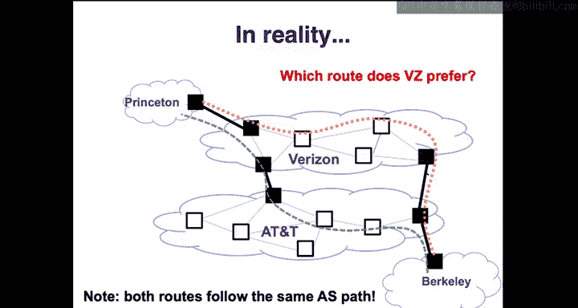

### BGP配置选项
在实际部署中，有多种配置BGP的方式。本课程假设采用以下方式（选项一）：
*   **选项一**：每个边界路由器与AS内所有其他路由器（共n台）建立IBGP会话。这需要 `n * B` 个会话（B为边界路由器数量），在大型网络中可能带来扩展性问题。
*   **其他选项**：包括边界路由器之间建立IBGP全连接，并通过IGP注入前缀；或使用专用的**路由反射器（Route Reflector）** 服务器来集中管理和分发路由信息。

---

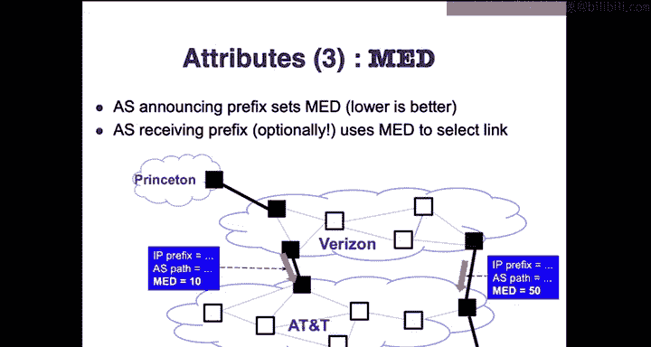

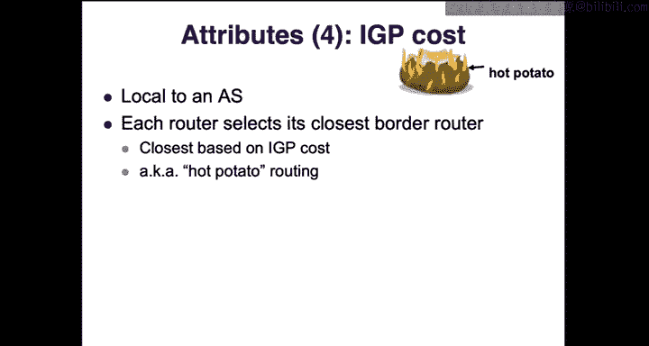

## BGP属性与路由选择

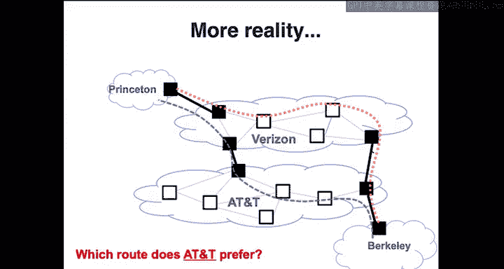

BGP的核心智能体现在其**属性（Attributes）** 上。属性是与路由（前缀）关联的一组键值对，用于描述路由特性、实施策略和做出路由选择/导出决策。

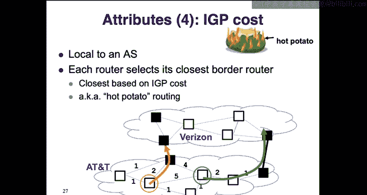

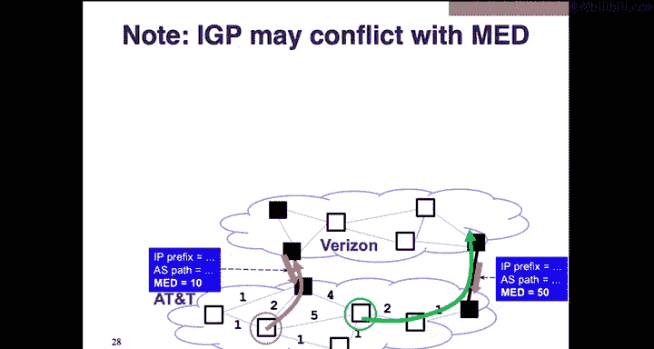

以下是四个重要的BGP属性：

### 1. AS路径（AS Path）
*   **作用**：记录到达目标前缀需要经过的自治系统序列。这是BGP作为路径矢量协议防止环路的基础。
*   **示例**：前缀 `128.112/16` 位于AS 88。当AS 88通告它时，AS Path为 `[88]`。当AS 7018（AT&T）进一步向AS 25（伯克利）通告时，AS Path变为 `[7018, 88]`。

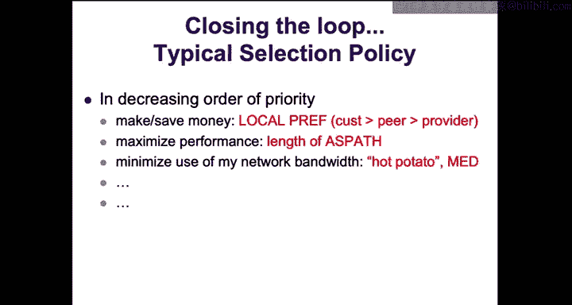

### 2. 本地优先级（Local Preference）
*   **作用**：用于在AS**内部**选择最佳路径，数值越高越优先。这是实现“客户>对等>提供商”等商业策略（Gao-Rexford规则）的主要机制。
*   **特点**：该属性仅在IBGP消息中传播，不会通告给其他AS。
*   **示例**：AS 7018从两个邻居AS 100和AS 200都学到了到达某个前缀的路由。如果AS 100是客户，AS 200是对等体，AS 7018可以配置边界路由器，为来自AS 100的路由分配本地优先级300，为来自AS 200的路由分配100。AS内所有路由器都会选择本地优先级更高的路径（即通过AS 100）。

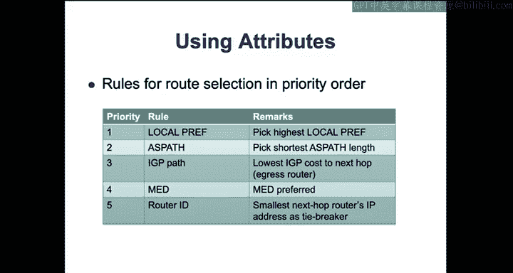

### 3. 多出口鉴别器（MED）
*   **作用**：用于向**相邻AS**提示，从哪个入口点进入本AS到达目标前缀更“近”（成本更低）。数值越低越优先。常用于存在多条并行链路（如东海岸和西海岸）的场景。
*   **特点**：只是一个“建议”，接收方AS可以选择忽略。
*   **示例**：AS Verizon向AS AT&T通告某个前缀。它在东海岸链路上通告时设置MED=10，在西海岸链路上设置MED=50，暗示AT&T从东海岸入口点发送流量更优。

### 4. IGP开销与热土豆路由（Hot Potato Routing）
*   **作用**：当AS从多个边界路由器学到同一个外部前缀时，会选择**IGP开销最小**的那个出口路由器。这被称为“热土豆路由”，目的是尽快将流量送出本AS网络，以节省内部带宽。
*   **冲突**：IGP开销可能与MED的建议冲突。例如，AT&T可能因为西海岸出口的IGP开销更低（热土豆），而选择忽略Verizon希望从东海岸入口（MED更低）的建议。这会导致往返路径不对称，在互联网中很常见。

### BGP路由选择优先级总结
路由器在收到多个到达同一前缀的BGP路由更新时，按以下**优先级顺序**选择最佳路径：
1.  **最高本地优先级**（Local Pref）：实现商业策略（赚钱/省钱）。
2.  **最短AS路径**（AS Path）：优化性能（通常路径越短越好）。
3.  **最低MED值**：尊重邻居AS的入口建议。
4.  **最低IGP开销到下一跳**（Hot Potato）：节省本AS带宽。
5.  （其他 tie-breaking 规则，如最早学到的路由等）。

---

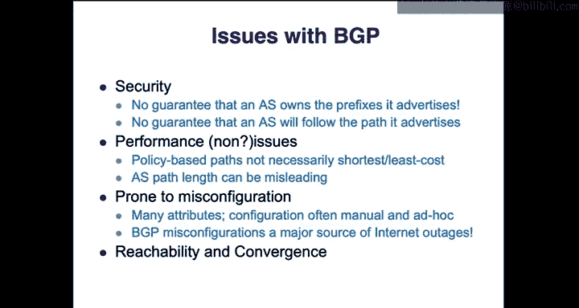

## BGP的局限性

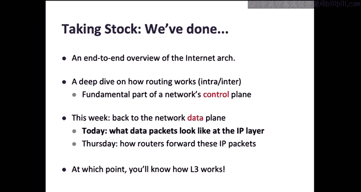

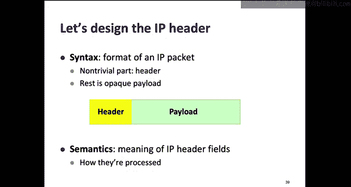

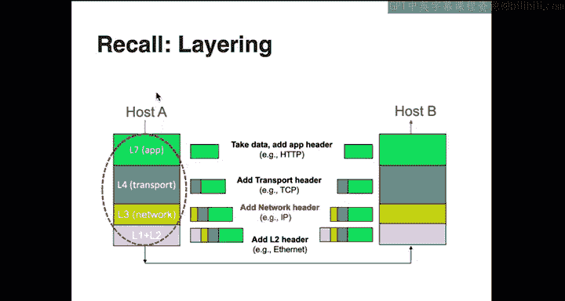

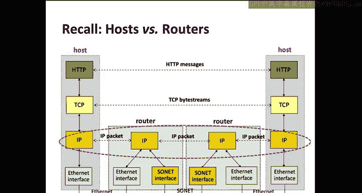

在理解了BGP的工作原理后，我们来看看它的一些主要局限性：
*   **安全性**：BGP缺乏对路由通告真实性的验证机制。恶意或配置错误的AS可以**劫持前缀（Prefix Hijacking）**，声称拥有不属于它的IP地址块，或将流量引导到非预期路径。这是互联网的一个重大安全隐患。
*   **性能**：基于策略的路由选择不一定选择性能最优（最短）的路径。AS路径长度可能掩盖内部跳数的巨大差异（例如，一个AS可能横跨全球）。
*   **配置复杂性**：BGP配置涉及大量手动策略设置，复杂且容易出错。配置错误是导致互联网重大中断的常见原因。
*   **可达性与收敛**：如果不遵循Gao-Rexford等良好实践，BGP可能无法保证所有目的地的可达性，甚至可能无法收敛，导致路由持续振荡。

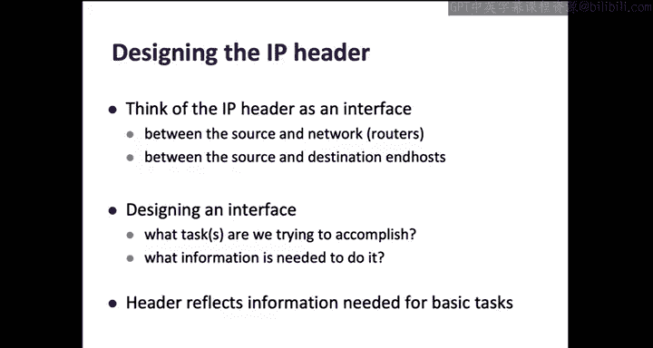

---

## 设计IP协议头部

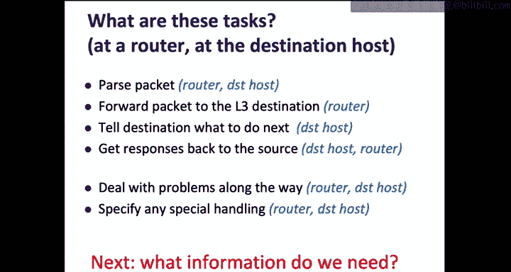

现在，我们将话题从网络层的控制平面（路由）转向数据平面，即数据包本身。本节重点在于设计IP数据包的头部。

### IP头部的设计目标
可以将IP头部视为互联网的“接口”，它需要承载足够的信息，以便网络（路由器）和终端系统（目的主机）能够完成以下任务：
1.  **解析数据包**：识别这是IP数据包，并确定头部和整体的边界。
2.  **转发数据包**：提供足够信息让路由器将数据包向目的地转发。
3.  **交付给正确应用**：让目的主机知道将数据包交给哪个上层协议（如TCP或UDP）处理。
4.  **返回响应**：提供源地址，以便目的主机能够发送回复。
5.  **处理网络问题**：应对传输过程中可能出现的错误，如比特损坏、环路、数据包过大等。
6.  **支持特殊处理**：允许对数据包进行优先级标记或特殊操作（如记录路径）。

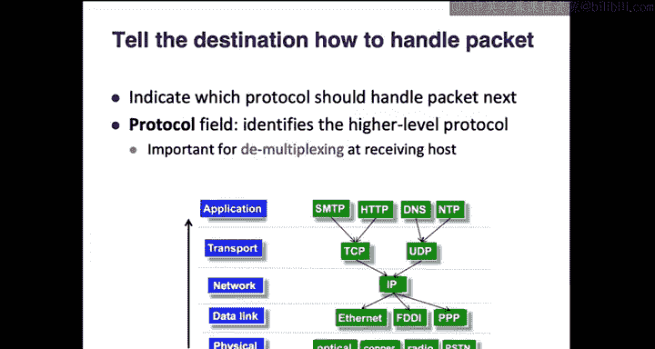

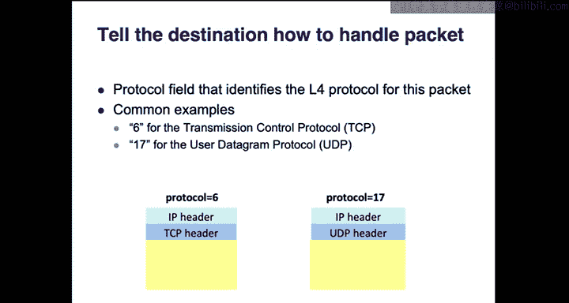

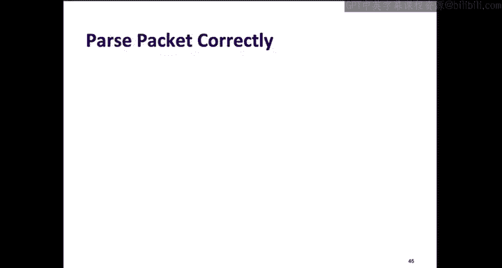

### IP头部关键字段及其作用
基于上述目标，IP头部（以IPv4为例）包含以下关键字段：

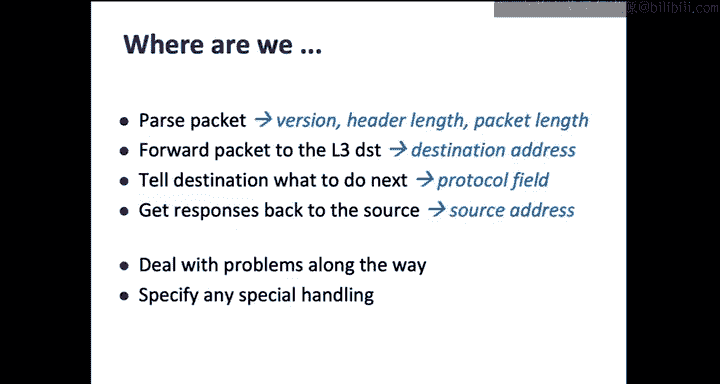

**基础字段**
*   **版本（Version）**：标识IP协议版本（如4或6），允许协议演进。
*   **头部长度（IHL） & 总长度（Total Length）**：定义IP头部和数据包的总大小。
*   **源IP地址（Source IP Address） & 目的IP地址（Destination IP Address）**：用于路由转发和响应返回。
*   **协议（Protocol）**：指示IP载荷中的下一个头部是哪种协议（例如，6代表TCP，17代表UDP），以便目的主机进行多路分解（Demultiplexing）。

**处理问题的字段**
*   **生存时间（TTL, Time To Live）**：每经过一个路由器减1，减至0时数据包被丢弃。用于防止因路由环路导致数据包无限循环。
*   **首部校验和（Header Checksum）**：针对IP头部计算的校验值，用于检测头部在传输过程中是否发生比特错误。路由器在转发前会验证并重新计算（因为TTL变了）。
*   **分片相关字段（Identification, Flags, Fragment Offset）**：当数据包大小超过某条链路的MTU时，路由器需要对其进行分片。这些字段用于标识同一原始数据包的所有分片，并在目的主机进行重组。

**特殊处理字段**
*   **服务类型（ToS, Type of Service）**：最初用于指示数据包所需的QoS（如低延迟、高吞吐量），但未广泛成功应用。现在其部分比特被用作**差分服务代码点（DSCP）** 来标记数据包优先级，以及**显式拥塞通知（ECN）** 比特。
*   **选项（Options）**：可变长字段，用于支持一些高级功能，如记录路由、时间戳、源路由指定路径等。但由于处理开销大、对硬件不友好且可能被用于攻击，现已很少使用。

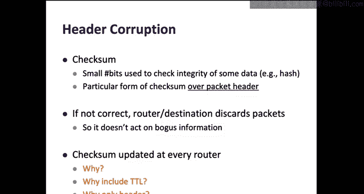

### IPv4头部格式一览
一个标准的IPv4头部固定部分为20字节（若不包含选项），按32位（4字节）对齐排列，包含上述所有字段。

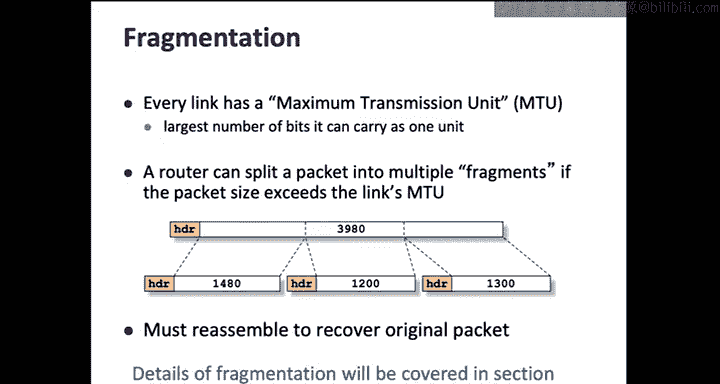

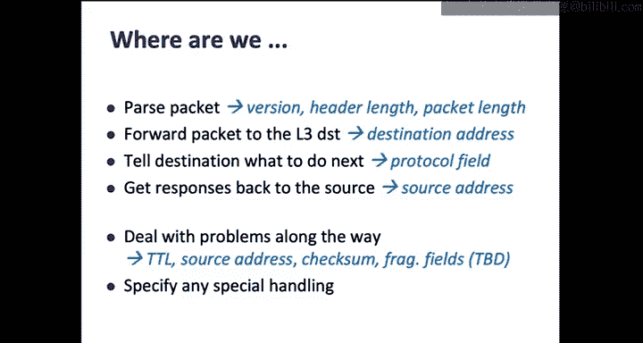

---

## 总结
本节课中，我们一起学习了BGP协议在路由器层面的分布式实现机制，包括BGP会话类型、路由信息整合流程以及通过AS Path、Local Pref、MED和IGP开销等属性实现复杂路由策略的方法。我们还探讨了BGP在安全、配置和收敛方面的局限性。

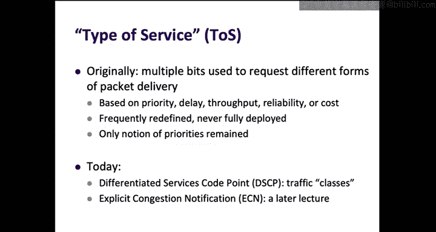

随后，我们转向IP协议的数据平面，深入探讨了设计IP头部的目标，并逐一解释了IPv4头部中各字段的语义和作用，包括用于寻址、多路分解、防环、检错、分片以及服务质量指示等关键功能。理解IP头部的设计是理解互联网数据包如何被处理和转发的基石。

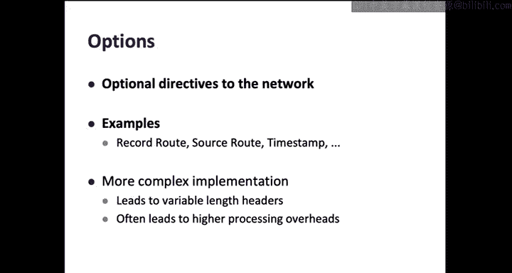

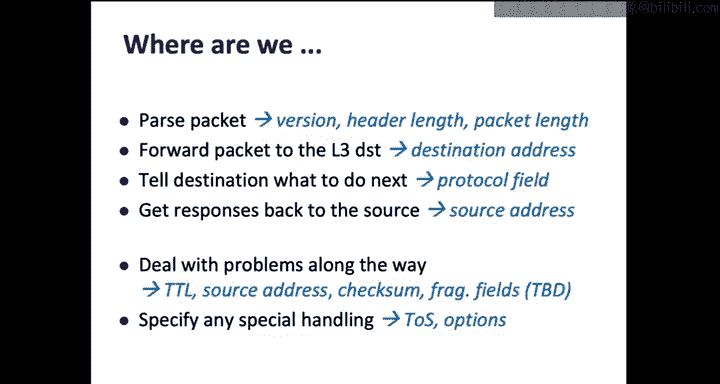

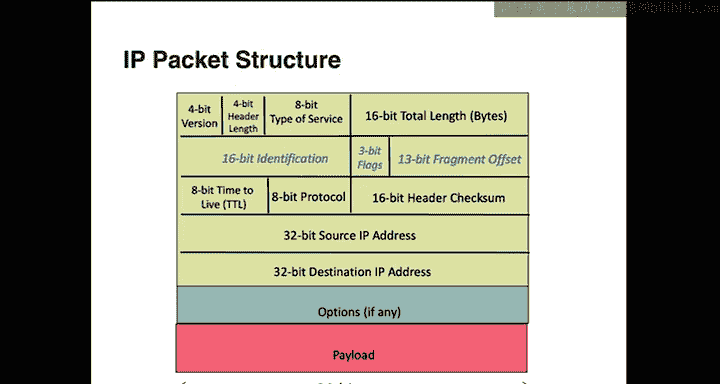

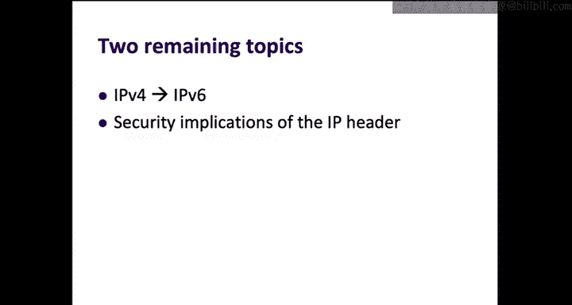

下一讲，我们将探讨从IPv4到IPv6的演进，以及IP协议相关的一些安全问题。