# 12：IP 转发 (Rob Shakir - Google)

## 📖 概述
在本节课中，我们将要学习 IP 转发的核心概念。我们将了解路由器的基本构成、工作原理，以及它是如何在互联网中高效地转发数据包的。课程将涵盖路由器的数据平面、控制平面和管理平面，并深入探讨最长前缀匹配这一关键算法。

---

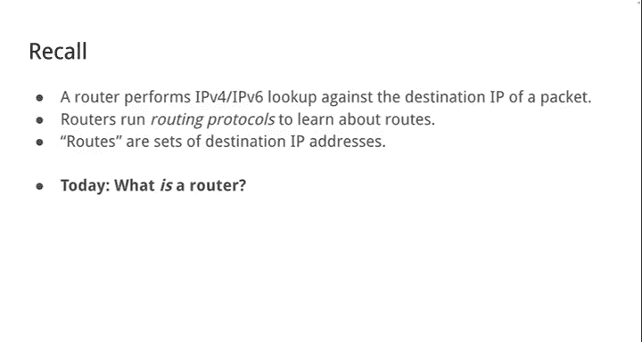

## 🏗️ 路由器是什么？
路由器是一种专门设计用于转发数据包的计算机。它的核心功能是接收数据包，根据其目的 IP 地址决定将其发送到哪个链路，并沿着正确的链路转发出去。

上一节我们介绍了路由器的基本定义，本节中我们来看看路由器在现实世界中的物理形态和部署环境。

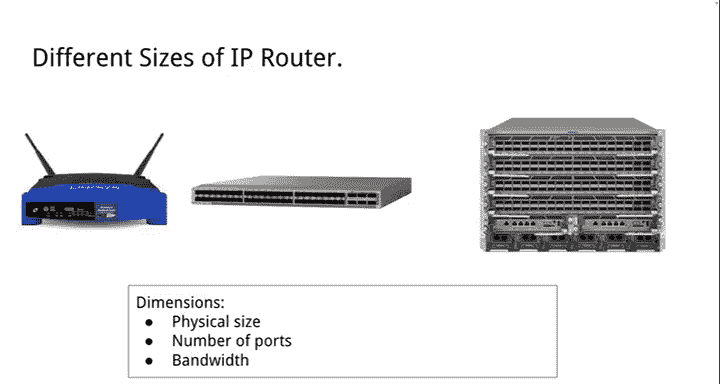

### 路由器的物理形态
互联网本质上是由许多相互连接的网络组成的，而连接这些网络的正是路由器。这些路由器被部署在专门的数据中心设施中。


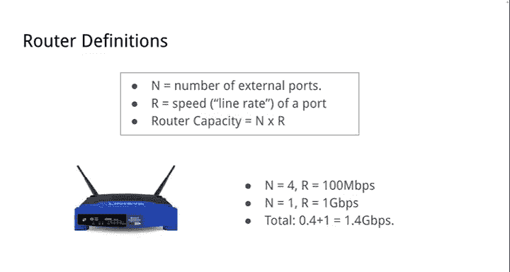

这些设施拥有专门的电力、冷却系统，以便放置路由器并实现互连。例如，当谷歌与康卡斯特或 Horizon 互连时，通常就在这样的建筑中进行。建筑内部是成排的机架，里面装满了用于构建互联网、连接万物的路由器。

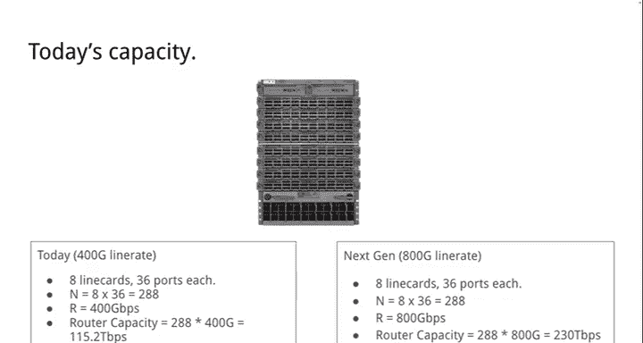

以下是几张相对历史但具有代表性的路由器照片：

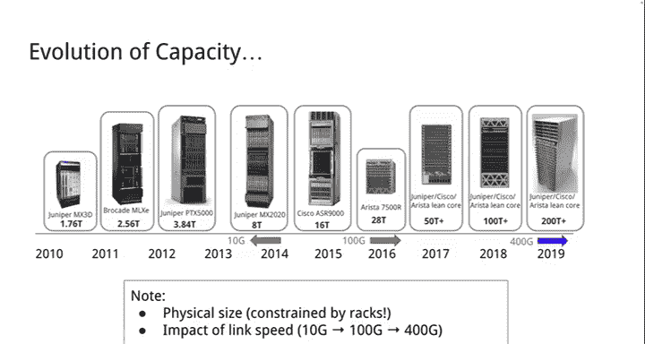


它们本质上就是为快速转发数据包而专门设计的计算机，并且有不同的大小规格。

### 路由器的规格参数
我们通常从几个维度来衡量路由器：
*   **端口数量**：路由器外部有多少个可以与其他系统互连的端口。
*   **端口速率**：每个端口能够运行的最大速度，通常称为线速。
*   **路由器容量**：这是路由器整体转发能力的总和，计算公式为：
    ```
    路由器容量 = 端口数量 × 端口速率
    ```
    例如，一个家用路由器可能有 4 个 100 Mbps 端口和 1 个 1 Gbps 端口，其容量约为 1.4 Gbps。

在像谷歌这样的网络中，我们部署的是大型系统。例如，一个 8 槽系统，每个线卡有 36 个端口，每个端口运行在 400 Gbps，其总容量为：
```
288 端口 × 400 Gbps = 115.2 Tbps
```
随着技术发展，端口速率提升到 800 Gbps，容量也随之翻倍。

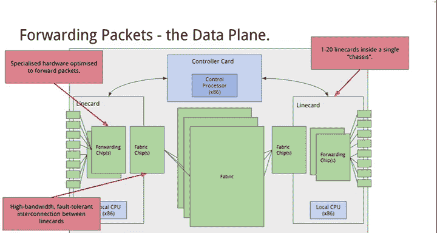


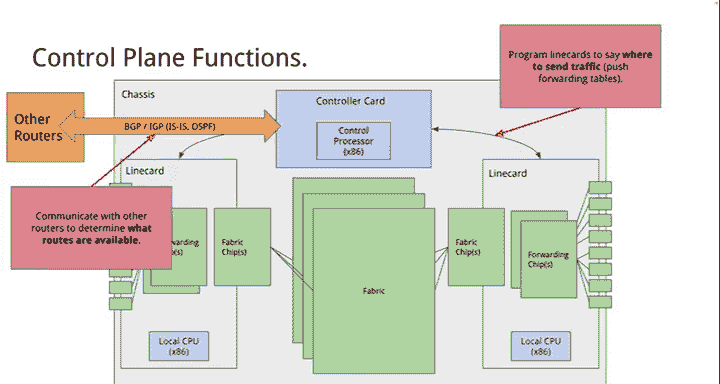

路由器容量的增长受到物理空间的限制。一个机架大约 7-8 英尺高，能容纳的设备有限。同时，功耗和散热也是关键约束。因此，容量的提升主要依赖于端口速率的增加，而非简单地增加端口数量。

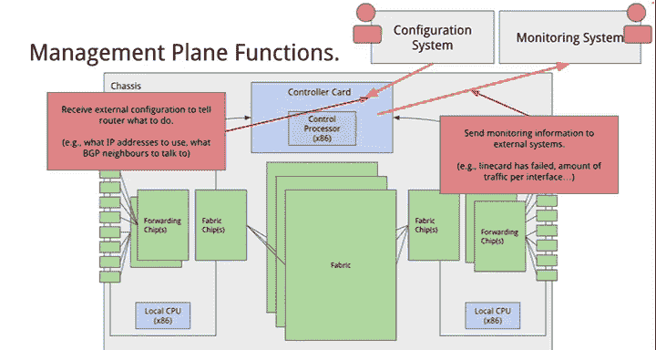


---

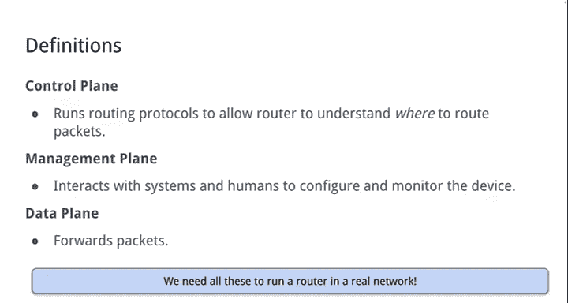

## 🔧 路由器内部架构
了解了路由器的外部形态和规格后，本节我们来剖析其内部结构。路由器内部主要由几个关键部分组成。

### 核心组件
一个路由器机箱内包含两种主要类型的板卡：
1.  **控制卡**：通常包含一个 x86 处理器（可能运行 Linux），负责运行控制和管理平面软件，与外部交换路由信息，并编程线卡。
2.  **线卡**：专门用于数据包转发的板卡。端口（输入/输出）位于线卡上。线卡本身可能也有自己的控制处理器，用于管理本地链路状态或协议。

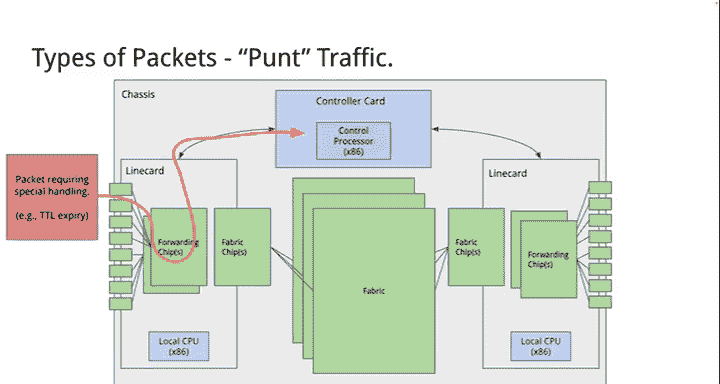

数据包进入输入线卡，经过处理后，通过一个内部互联网络（称为交换矩阵）发送到输出线卡，最后从输出端口发出。

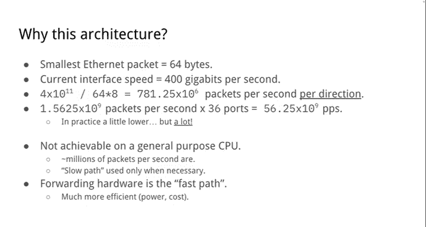


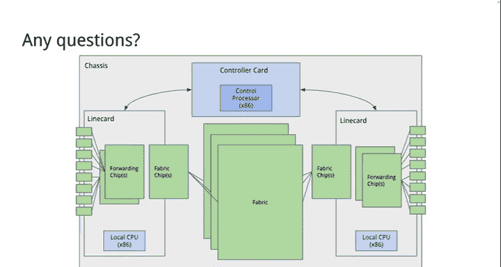

### 三个功能平面
路由器功能通常被划分为三个“平面”：
*   **数据平面**：这是我们最关心的部分，负责快速转发数据包。它主要由线卡、专用的转发芯片和交换矩阵芯片组成。
*   **控制平面**：负责运行路由协议（如 BGP、OSPF），与其他路由器通信以确定网络路径，并将计算出的转发表下发到各个线卡。
*   **管理平面**：负责与外部系统或人员交互，用于配置路由器（如设置 IP 地址、启用协议）和监控路由器状态（如流量统计、故障告警）。这对于实际运营网络至关重要。


所有这三个平面对于运行一个真正的路由器都是必不可少的。缺少任何一个，路由器都无法正常工作。

下图展示了一个真实路由器（Cisco 7606）的内部视图，可以清晰地看到控制卡和线卡：


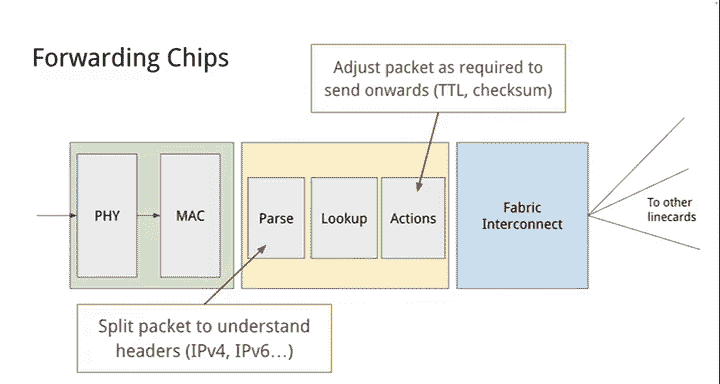

---

## 📦 数据包处理流程
我们已经了解了路由器的架构，现在聚焦于数据平面，看看它是如何处理不同类型的数据包的。

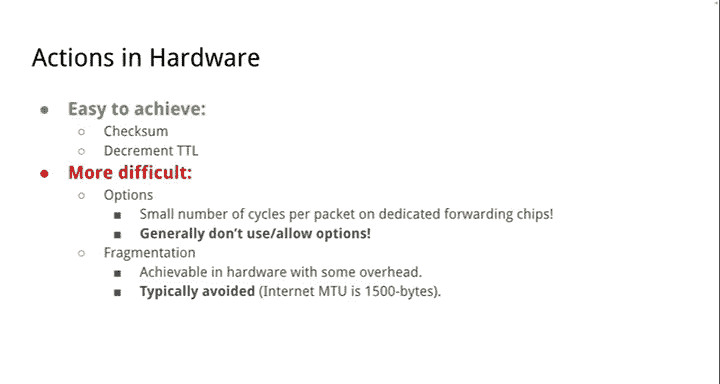

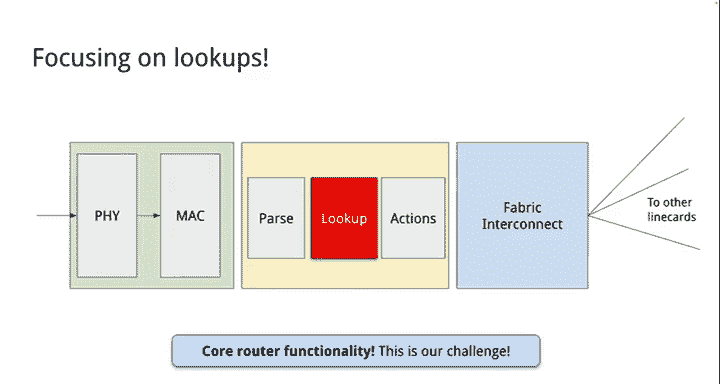

路由器需要处理几种不同类型的数据包：
1.  **用户数据包**：这是需要被转发的普通数据包。它们在线卡上根据已安装的路由进行查找，然后通过交换矩阵转发到输出端口。
2.  **控制平面数据包**：例如，用于 BGP 会话的数据包。这些数据包是发给路由器本身的，因此会被从线卡“上送”到控制平面进行处理。
3.  **异常数据包**：例如，IP TTL 过期的数据包。对于这些不知道如何处理或需要特殊响应的数据包，线卡会将其“上送”给控制平面处理。


### 为什么需要专用硬件？
以最小的以太网数据包（64 字节）和 400 Gbps 端口为例，每个端口每秒需要处理约 7.81 亿个数据包。一个有 36 个端口的线卡，每秒需要处理的数据包数量是天文数字。

通用 CPU 每秒只能处理数百万个数据包，这被称为“慢路径”。为了达到所需的带宽和查找速度，我们必须使用专用的转发硬件，即“快路径”。这些专用芯片牺牲了灵活性，换来了极高的速度和能效，对于控制大规模网络的成本至关重要。


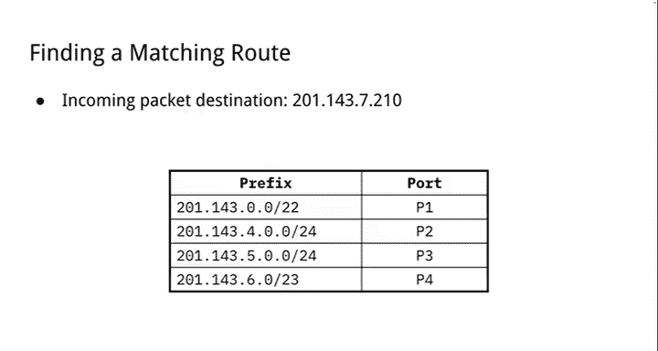

---

## 🔍 核心：IP 查找与转发
数据平面最核心的任务是 IP 查找。本节我们将深入探讨这一过程，特别是“最长前缀匹配”算法。

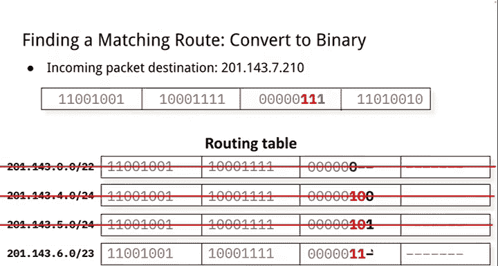

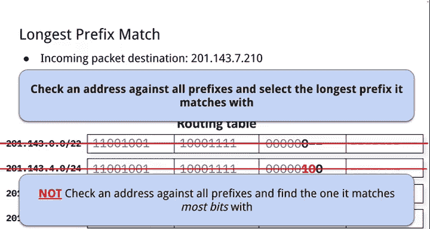

### 输入线卡的处理步骤
当用户数据包到达输入线卡时，会经历以下步骤：
1.  **接收与解码**：从线路上（电信号或光信号）接收并解码数据包。
2.  **链路层处理**：处理以太网帧等链路层协议，检查有效性。
3.  **IP 查找与转发**：这是最关键的一步，决定数据包的去向。
4.  **交换矩阵交互**：通过专用芯片将数据包发送到系统内的其他线卡。

转发过程本身又可分为几个阶段：
*   **解析**：解析数据包，识别其是 IPv4、IPv6 还是其他封装。
*   **查找**：执行实际的查找操作。
*   **动作**：根据查找结果对数据包进行操作，如减少 TTL、更新校验和。


### 硬件中的动作
有些动作在硬件中很容易实现：
*   **减少 TTL**：操作固定，易于实现。
*   **更新校验和**：规则明确，易于实现。

有些则较难或我们希望避免：
*   **IP 选项**：灵活多变，处理耗时，通常被过滤或避免使用。
*   **分片**：可以实现，但有开销。网络通常通过协商 MTU（最大传输单元）来避免分片。互联网上通用的 MTU 是 1500 字节。


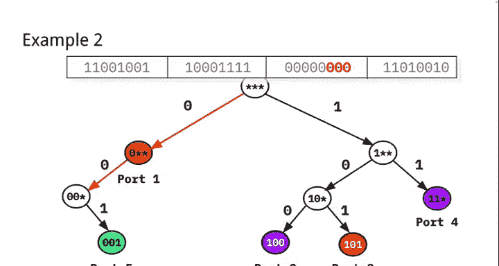

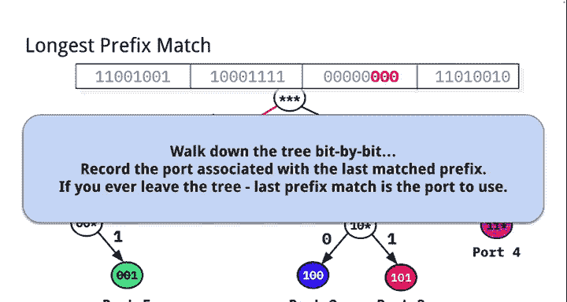

---

## 🧮 最长前缀匹配
查找的核心是“最长前缀匹配”。为了理解它，我们首先需要明白为什么不能进行精确匹配。

### 从精确匹配到前缀匹配
理想情况下，我们希望进行精确的 IP 地址匹配。但 IPv4 有 2^32 个地址，IPv6 有 2^128 个地址，存储和更新如此庞大的精确匹配表是不现实的。

更重要的是，IP 地址具有层次结构。例如，谷歌从注册机构获得一个大地址块，然后在内部将其划分给搜索、YouTube 等部门。对于外部网络来说，它们只需要知道如何将数据包发送到谷歌，而不关心谷歌内部的具体划分。这种层次结构使得我们可以使用更紧凑的前缀路由表。

**前缀** 代表一组共享相同高位比特的 IP 地址。例如，前缀 `192.0.2.0/24` 表示前 24 位固定的所有地址。

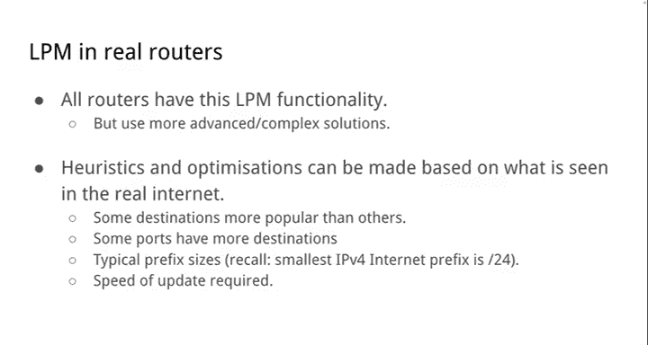

### 什么是 LPM？
在互联网中，网络之间是多点互联的网状结构，而不是简单的树状结构。一个目的地可能通过多个不同长度的前缀可达。

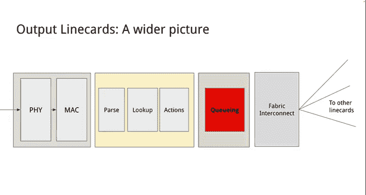

**最长前缀匹配** 规则是：当数据包的目的 IP 地址匹配多个路由前缀时，选择其中 **前缀长度最长**（即最具体）的那条路由。如果没有匹配的前缀，则使用默认路由（如果存在），否则丢弃数据包。


### LPM 查找示例
假设我们有一个简单的路由表：

| 端口 | 前缀 |
| :--- | :--- |
| P1 | 192.0.0.0/22 |
| P2 | 192.0.4.0/24 |
| P3 | 192.0.5.0/24 |
| P4 | 192.0.6.0/23 |

现在有一个目的地址为 `192.0.5.10` 的数据包。
1.  将其转换为二进制。
2.  与表中每个前缀的二进制形式进行比较。
3.  发现它与 P2 (`192.0.4.0/24`) 不匹配，但与 P3 (`192.0.5.0/24`) 和 P4 (`192.0.6.0/23`) 的部分比特匹配。
4.  应用 LPM 规则：`192.0.5.0/24`（长度 24）比 `192.0.6.0/23`（长度 23）更长、更具体。
5.  因此，数据包应该从 **P3** 端口转发出去。


### 高效实现：前缀树
对于只有几个前缀的表，我们可以逐个比较。但互联网 IPv4 路由表有约 100 万个前缀，线性查找效率太低。

我们可以利用 IP 地址的二进制树状结构。将路由前缀组织成一棵**二叉树（前缀树）**：
*   树的每一层对应 IP 地址的一个比特位（0 向左，1 向右）。
*   在每个代表有效前缀结尾的树节点上，关联一个转发动作（输出端口）。

查找时，从根节点开始，根据数据包目的 IP 的每个比特位遍历这棵树。我们需要记录**沿途遇到的最后一个有效转发动作**。当遍历到无法继续匹配的叶子节点或空节点时，就使用最后记录的那个动作。这保证了我们找到的是最长匹配前缀。


### 优化与挑战
实际路由表中，多个前缀可能指向同一个端口，我们可以利用这一点来压缩树结构，减少需要存储和查找的节点数量。

设计 LPM 算法时，我们不仅关心查找速度，还关心**更新速度**。因为 BGP 等协议会频繁更新路由，我们需要快速更新前缀树以反映网络状态的变化。此外，还可以利用实际部署中的特征（如前缀长度分布、热门目的地）进行启发式优化。


---

## ⏳ 超越基本转发：队列管理
除了基本的查找和转发，现代路由器还实现了更复杂的功能，如队列管理，以满足不同的业务目标。

### 为什么需要队列管理？
并非所有数据包都同等重要。例如：
*   语音或视频流量对延迟敏感。
*   不同客户可能支付了不同等级的费用。
*   需要确保关键业务流量不被淹没。

当多个输入端口的数据流需要从同一个输出端口发出，且总速率超过端口带宽时，就会发生拥塞。此时，路由器需要将数据包暂存在内存（缓冲区）中排队等待发送。队列管理就是决定如何**分类**、**缓冲**和**调度**这些数据包。

### 队列管理的三个阶段
1.  **分类**：根据数据包的某些特征（如入端口、IP 头中的 DSCP 字段、协议类型）将其划分到不同的队列中。
2.  **缓冲区管理**：当缓冲区快满时，决定丢弃哪些数据包。简单的策略是“队尾丢弃”，但更复杂的策略如“随机早期检测”可以在缓冲区满之前就主动丢弃部分数据包，以通知发送端（如 TCP）降低速率。
3.  **调度**：决定从各个队列中取出数据包发送的顺序。例如，优先级调度让语音包先出队，轮询调度公平地服务多个流。


### 互联网的实际情况
在公共互联网上，由于网络互不信任，通常**不会**使用基于数据包内容的分类和优先级。进入网络的数据包的 DSCP 等字段通常会被重置为 0，所有数据包被同等对待（“尽力而为”服务）。队列管理主要用于实现网络运营者自身的业务策略（如保证企业客户质量）或在私有网络、高级服务中。

为了简化分析，我们通常假设最简单的模型：
*   **无分类**：所有数据包同等重要。
*   **队尾丢弃**：缓冲区满时，新到的数据包直接被丢弃。
*   **先进先出调度**：数据包按到达顺序发送。

---

## 💎 总结
本节课中我们一起学习了 IP 转发的核心知识：

1.  **路由器的本质**：路由器是专门用于转发 IP 数据包的计算机，具有数据、控制和管理三个功能平面。
2.  **核心任务**：其核心任务是在数据平面上对数据包目的 IP 地址执行**最长前缀匹配**查找，以决定转发端口。
3.  **LPM 算法**：LPM 利用 IP 地址的层次结构，通过查找最具体的匹配前缀来实现高效路由。前缀树是实现 LPM 的一种基础数据结构。
4.  **硬件与软件的权衡**：为了实现极高的转发速度（每秒数百亿个数据包），路由器使用专用的转发硬件（快路径）。而灵活性要求高的控制和管理功能则由通用 CPU 软件（慢路径）处理。
5.  **高级功能**：除了基本转发，路由器还通过队列管理实现流量分类、缓冲和调度，以支持服务质量等高级特性，但这在公共互联网上应用有限。
6.  **设计挑战**：路由器设计始终在**速度、灵活性、成本和功耗**之间进行权衡。更多的功能通常意味着更低的转发容量或更高的成本。

理解 IP 转发是理解互联网如何工作的基石。从你家中的小路由器到谷歌全球骨干网中的庞然大物，它们都遵循着这些基本原理，将数据包准确地送达目的地。

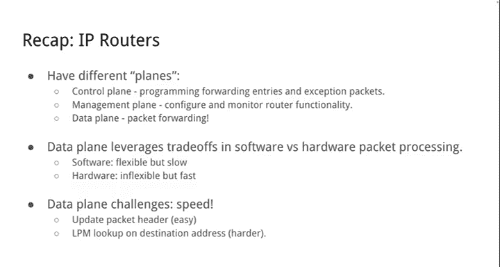

