# 17：TCP拥塞控制设计 🚦

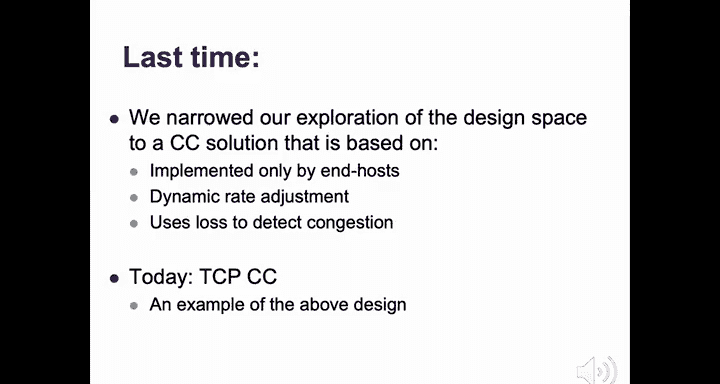

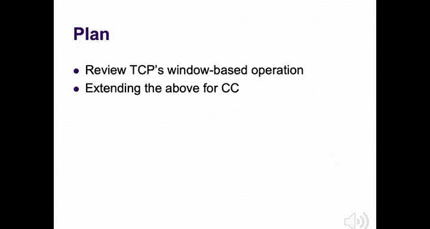

在本节课中，我们将深入学习TCP拥塞控制的具体实现。我们将回顾TCP的滑动窗口可靠性机制，并详细探讨如何在此基础上扩展，通过调整**拥塞窗口（cwnd）** 来实现拥塞控制。核心在于理解TCP如何通过**确认（ACK）时钟**来调整发送速率，并遵循**慢启动（Slow Start）**、**拥塞避免（Congestion Avoidance）** 和**快速恢复（Fast Recovery）** 等状态来动态适应网络状况。

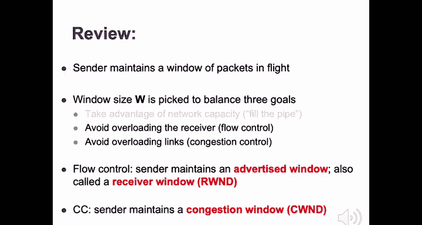

---

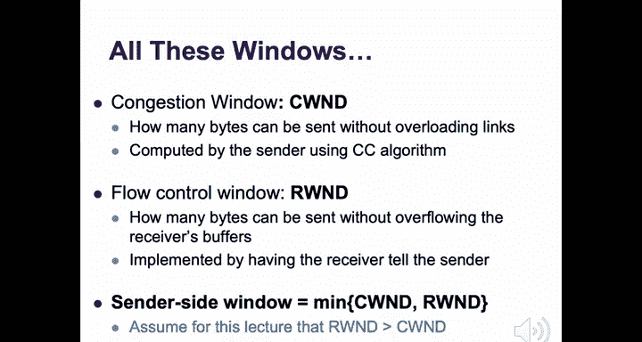

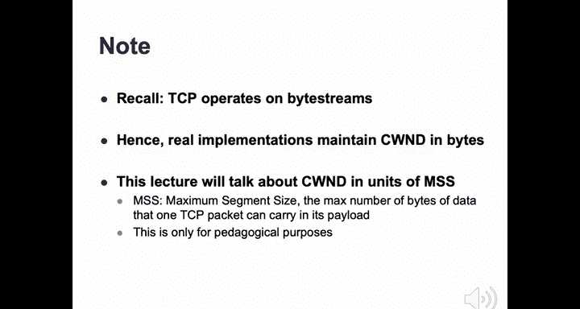

## TCP可靠性回顾：滑动窗口

上一节我们介绍了拥塞控制的基本问题与设计空间，本节中我们来看看TCP如何具体实现。首先，我们需要回顾TCP实现可靠数据传输的基础：滑动窗口协议。

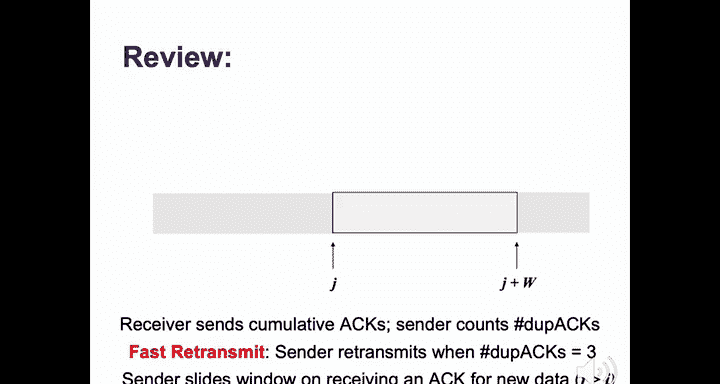

在滑动窗口协议中，发送方维护一个大小为 `w` 的连续字节窗口。窗口左侧的字节（已发送且被确认）可以释放，右侧的字节尚未发送。发送方只能发送窗口内的字节。

*   **发送方行为**：发送窗口内的字节。它只维护一个与窗口左侧（即最早未确认字节）关联的计时器。若该计时器超时，则重传从该偏移量开始的所有字节。
*   **接收方行为**：发送**累积确认（Cumulative ACK）**，指明期望收到的下一个字节序号。
*   **快速重传（Fast Retransmit）**：当发送方收到**三个重复的ACK（Duplicate ACK）** 时，它会认为数据包已丢失，并立即重传第一个丢失的包，而无需等待计时器超时。
*   **窗口滑动**：当发送方收到对新数据的确认时，窗口向右滑动，允许发送新的数据。

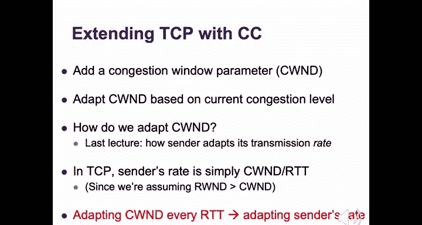

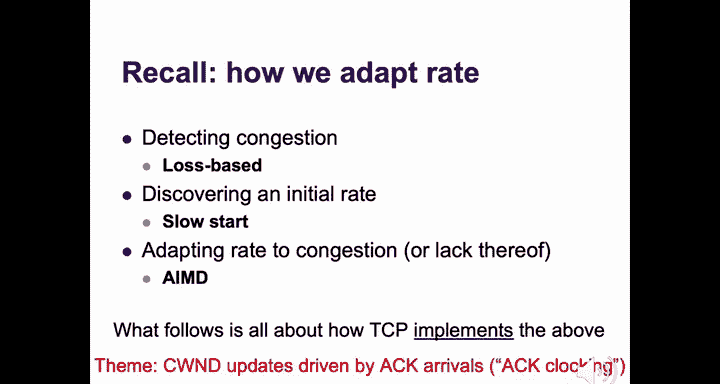

## 引入拥塞控制：拥塞窗口（cwnd）

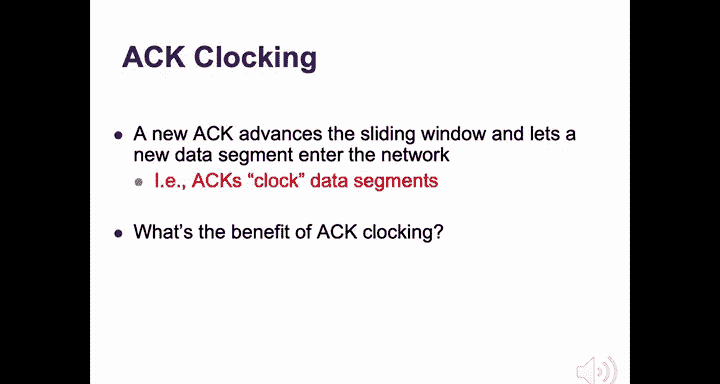

现在，我们在TCP的滑动窗口设计中加入拥塞控制。关键是为发送方增加一个新的状态变量：**拥塞窗口（cwnd）**。

发送方的实际发送窗口大小由以下公式决定：
```
实际窗口大小 = min(cwnd, rwnd)
```
其中 `rwnd` 是接收方通告的窗口大小（用于流量控制）。在本讲座中，我们假设 `rwnd` 足够大，因此发送速率主要由 `cwnd` 决定。

发送方的发送速率（Rate）与 `cwnd` 和往返时间（RTT）直接相关：
```
发送速率 ≈ cwnd / RTT
```
因此，通过调整 `cwnd`，TCP就在调整其发送速率。

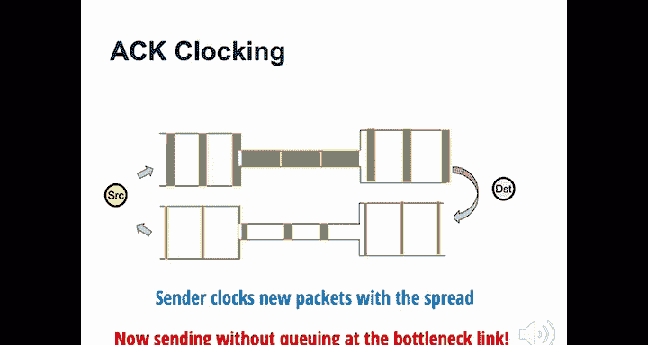

## ACK时钟（ACK Clocking）


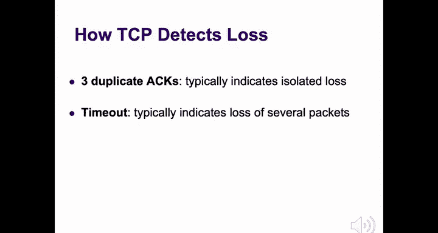

TCP拥塞控制的所有更新（除了超时）都由**确认（ACK）的到达**驱动，这种机制称为**ACK时钟**。

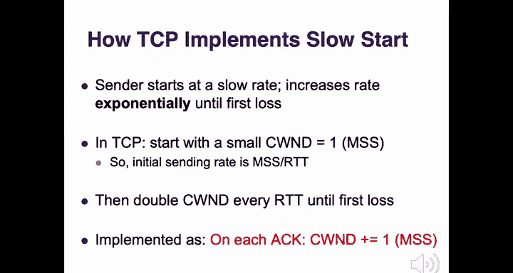

其核心思想是：每当发送方收到一个新的ACK（意味着一个数据包已成功离开网络），它就被允许向网络注入一个新的数据包。这样，发送方的数据包传输就被ACK的到达速率所“计时”。

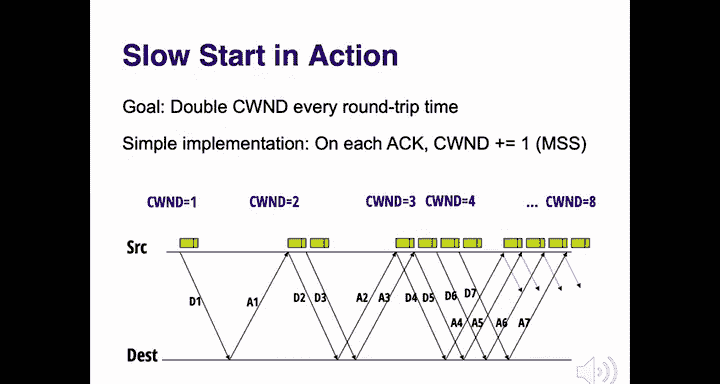

ACK时钟的好处在于：
1.  **自我调节**：发送方能自动将发送速率调整到网络可用带宽的水平。
2.  **平稳发送**：避免了突发流量，减少了网络中瞬时队列和丢包的可能性。

ACK时钟优雅地实现了我们在上节课提到的“守恒原则”：在稳定状态下，从网络中取走一个数据包，才允许放入一个新的数据包。

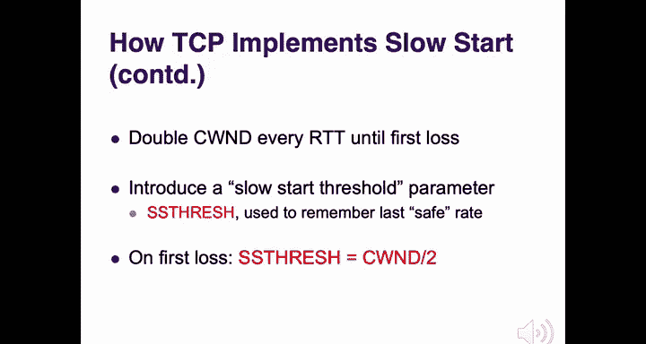

## TCP拥塞控制的核心组件

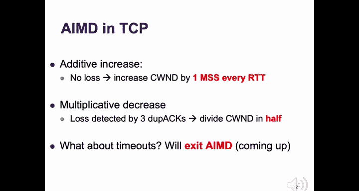

TCP的拥塞控制实现基于我们之前确定的三个设计组件，以下是其具体实现方式：

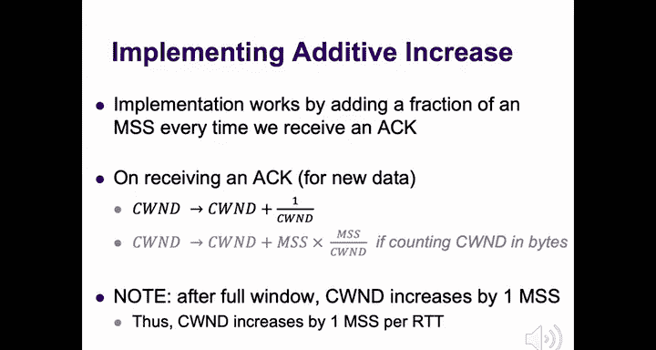

### 1. 丢包检测
TCP通过两种方式检测拥塞（丢包）：
*   **收到三个重复ACK**：通常表示发生了**单个数据包丢失**。
*   **重传计时器超时**：通常表示发生了**严重拥塞**，可能丢失了多个数据包。

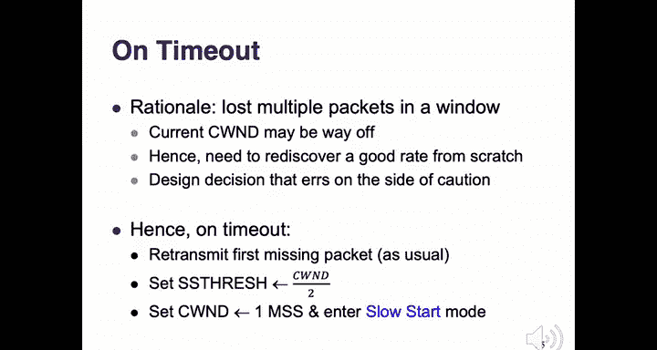

### 2. 初始速率发现：慢启动（Slow Start）
慢启动的目标是快速找到一个合适的初始发送速率。

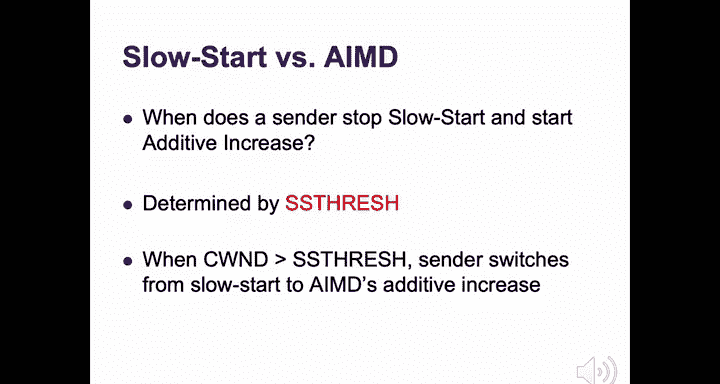

*   **启动**：连接开始时，`cwnd` 设置为 **1个MSS**（最大报文段长度）。
*   **增长规则**：在慢启动阶段，**每收到一个ACK，`cwnd` 增加1个MSS**。
*   **效果**：由于每个RTT内大约会收到 `cwnd` 个ACK，因此 `cwnd` 在每个RTT内会**翻倍**，实现指数级增长。
*   **慢启动阈值（ssthresh）**：TCP维护一个 `ssthresh` 变量，记录“安全速率”的估计值。当发生丢包时，`ssthresh` 被设置为当前 `cwnd` 的一半。下次进入慢启动时，`cwnd` 会指数增长直到达到 `ssthresh`，然后转入更谨慎的**拥塞避免**阶段。

### 3. 速率适应：AIMD与状态转换
在探测到安全速率后，TCP使用**加性增、乘性减（AIMD）** 来调整速率。

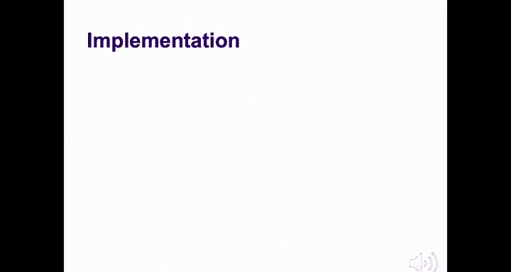

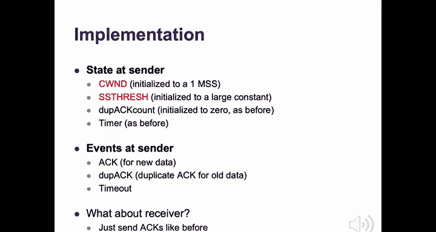

*   **加性增（Additive Increase） - 拥塞避免状态**：
    *   当 `cwnd >= ssthresh` 时，TCP进入拥塞避免状态。
    *   在此状态下，**每收到一个ACK，`cwnd` 增加 `1/cwnd` 个MSS**。
    *   这样，**每个RTT内，`cwnd` 总共增加1个MSS**，实现线性增长。
    *   代码/公式表示（以字节为单位）：
        ```
        cwnd = cwnd + (MSS * MSS / cwnd)
        ```

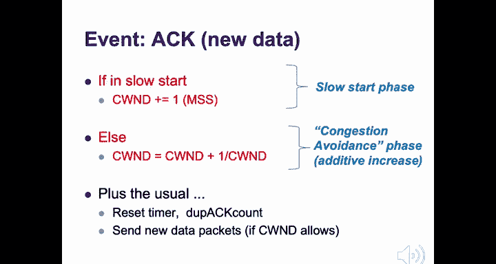

*   **乘性减（Multiplicative Decrease）**：
    *   当通过**三个重复ACK**检测到丢包时，TCP执行：
        ```
        ssthresh = cwnd / 2
        cwnd = ssthresh  （不低于1个MSS）
        ```
    *   然后进入**快速恢复**状态。

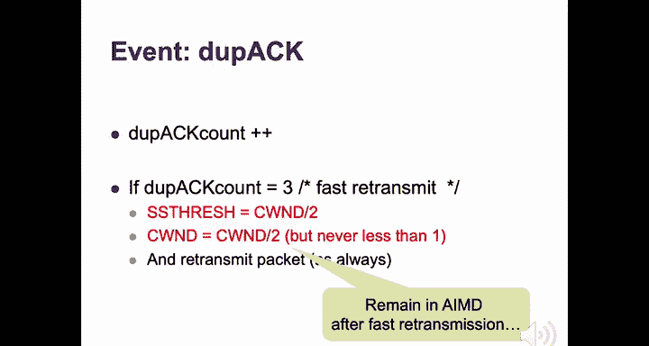

*   **超时处理**：
    *   当发生**超时**时，TCP认为网络状况不明，采取最保守策略：
        ```
        ssthresh = cwnd / 2
        cwnd = 1 （重置为1个MSS）
        ```
    *   然后**重新进入慢启动**状态。

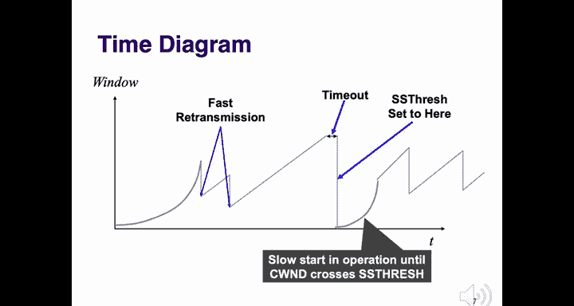

## 快速恢复（Fast Recovery）优化

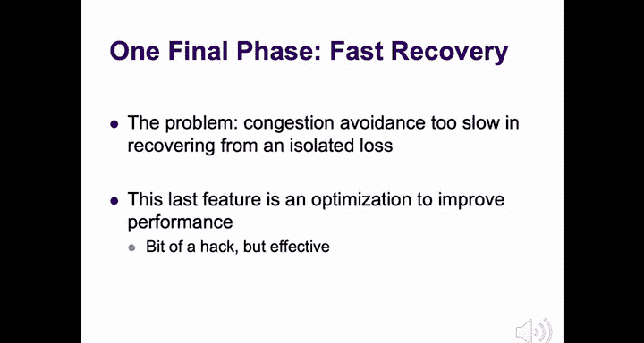

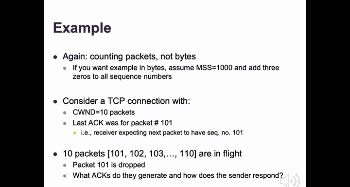

在拥塞避免阶段，如果仅丢失一个数据包，标准的AIMD行为（将 `cwnd` 减半并等待重传包被确认）会导致发送方在较长时间内停滞，且丢失ACK时钟的节奏。**快速恢复** 就是为了优化这种情况。

快速恢复的核心思想是：在收到三个重复ACK后，不立即将 `cwnd` 减半到 `ssthresh` 并等待，而是**临时“赊账”**，允许发送方在收到重复ACK期间继续发送新数据包，以保持管道充盈和ACK时钟。

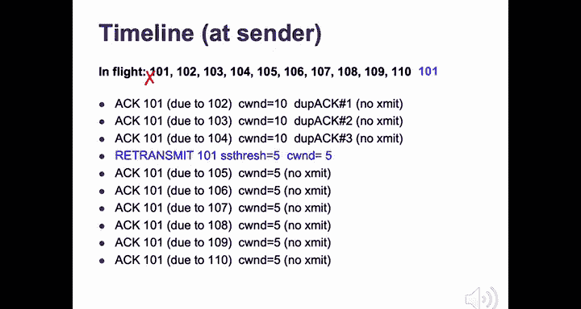

以下是快速恢复的规则：
1.  当收到第3个重复ACK时：
    *   设置 `ssthresh = cwnd / 2`。
    *   设置 `cwnd = ssthresh + 3`（为已收到的3个重复ACK给予信用）。
    *   重传丢失的包，并进入**快速恢复**状态。
2.  在快速恢复状态中，**每收到一个额外的重复ACK**：
    *   `cwnd = cwnd + 1`（再给予1个信用）。
    *   如果允许（有可用的窗口），则发送一个新数据包。
3.  当收到一个**新的ACK**（表明重传的包已被接收，缺口被填补）时：
    *   设置 `cwnd = ssthresh`（正式执行乘性减）。
    *   退出快速恢复状态，进入**拥塞避免**状态。

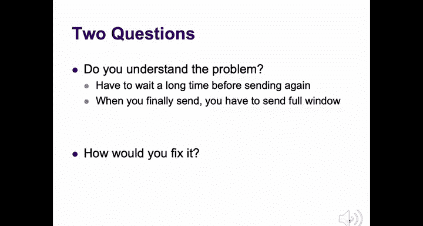

## TCP状态机总结

TCP拥塞控制的行为可以通过一个状态机清晰地概括，包含三个主要状态：

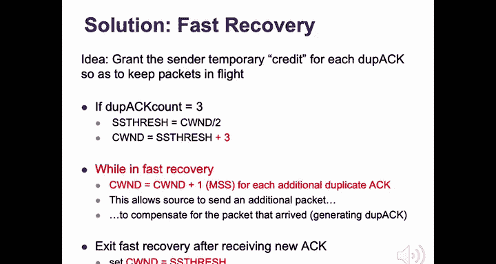

1.  **慢启动（Slow Start）**：`cwnd` 指数增长。
2.  **拥塞避免（Congestion Avoidance）**：`cwnd` 线性增长（AIMD中的AI）。
3.  **快速恢复（Fast Recovery）**：优化单个丢包后的恢复过程。

状态转换由以下事件触发：
*   **任何状态下的超时** -> 进入**慢启动**。
*   **慢启动中，`cwnd >= ssthresh`** -> 进入**拥塞避免**。
*   **慢启动或拥塞避免中，收到3个重复ACK** -> 进入**快速恢复**。
*   **快速恢复中，收到新ACK** -> 进入**拥塞避免**。

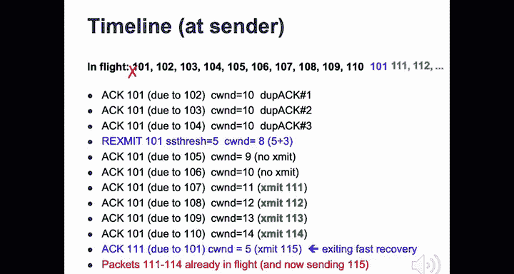


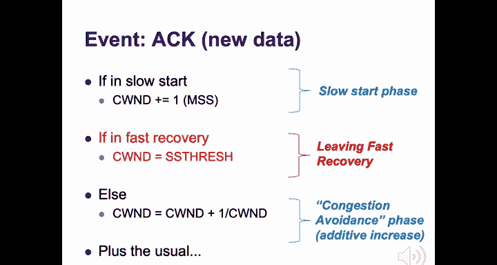

理解这个状态机以及每个状态下 `cwnd` 的更新规则，就掌握了TCP拥塞控制的核心。

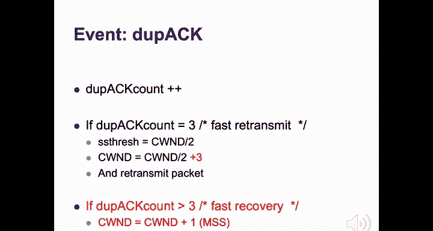

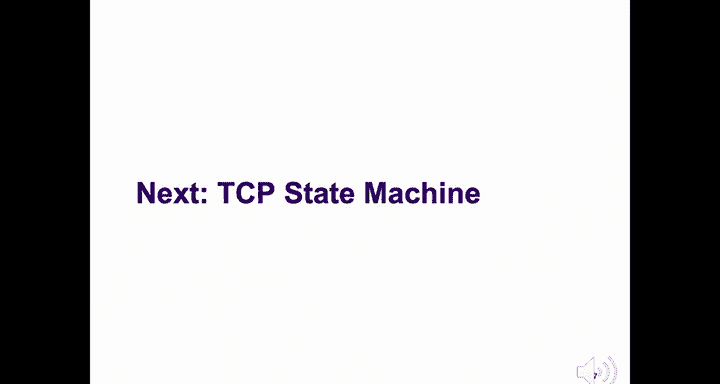

## TCP变体与互操作性

存在多种TCP拥塞控制变体（如Tahoe、Reno、NewReno、SACK）。我们今天讨论的机制基本对应 **TCP NewReno**。

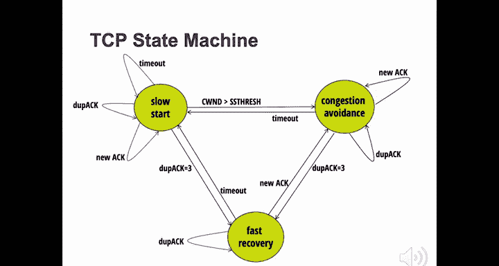

*   **互操作性**：只要变体不改变TCP头部格式或ACK的语义（如Tahoe、Reno、NewReno），仅改变发送方内部的 `cwnd` 更新逻辑，它们就可以互操作。因为接收方行为不变。
*   **需要协商的变体**：如果变体改变了协议字段（如**SACK**使用选择性确认选项），则需要连接双方都支持才能正常工作。

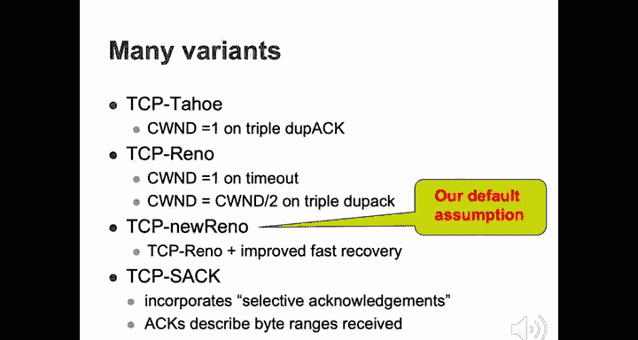

---


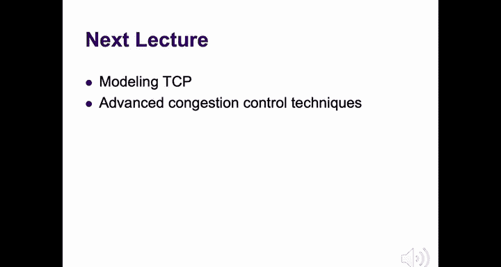

本节课中我们一起学习了TCP拥塞控制的详细设计。我们从滑动窗口可靠性基础出发，引入了**拥塞窗口（cwnd）** 的概念，并深入探讨了TCP如何通过**ACK时钟**机制，在**慢启动**、**拥塞避免**和**快速恢复**三个状态间转换，动态地执行**加性增、乘性减（AIMD）** 算法来应对网络拥塞。我们还了解了**快速恢复**优化如何改善单个丢包后的性能。掌握这些状态和转换规则是理解TCP行为的关键。下一讲，我们将探讨更高级的拥塞控制主题及其性能分析。