# 18：高级拥塞控制

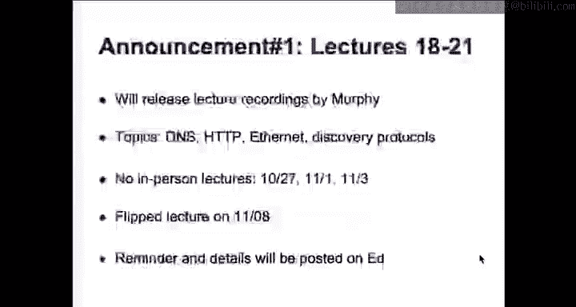

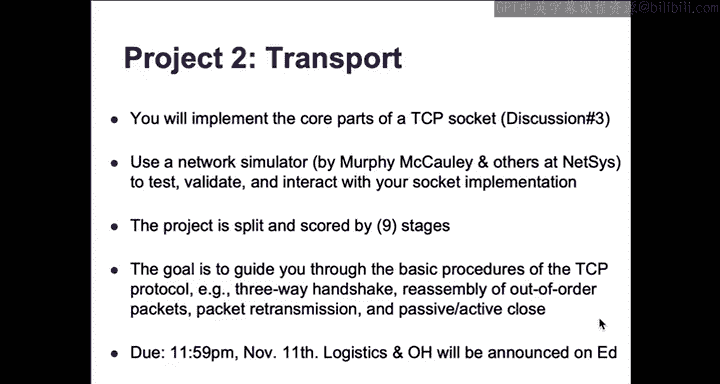

在本节课中，我们将学习TCP拥塞控制的高级主题。我们将首先学习一个用于估算TCP吞吐量的模型，然后探讨TCP拥塞控制存在的一些局限性，最后了解几种由路由器辅助的拥塞控制方案。

## 项目与课程安排

大家好，我们开始上课。今天我们将发布项目二。

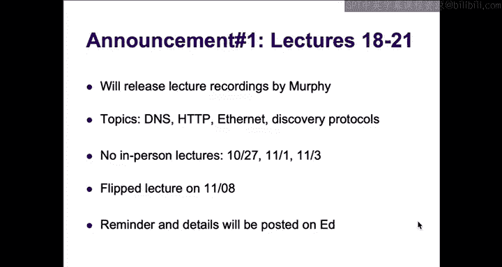

Tenzan将为大家介绍这个项目。项目二将围绕传输层展开，你们将使用Murphy开发的网络模拟器来实现一个TCP套接字的核心部分。这个网络模拟器与项目一的不同，它是一个名为POX的模拟器，将帮助你们测试、验证并与你们的套接字实现进行交互。这个项目分为九个阶段，类似于上一个项目的十个阶段。

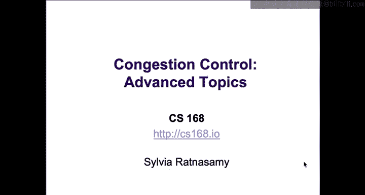

项目截止日期是11月11日午夜。如果需要任何帮助，请参加项目答疑时间，而不是课程内容答疑时间。

请大家尽量往前坐，这样能让课堂更紧凑一些。

在课程开始前，有一个快速通知。接下来的四节课，我们将恢复之前尝试过的模式，发布四节录播课。这些是Murphy在2020年的精彩录播，主题涵盖DNS、HTTP、以太网以及各种发现和引导协议，如DHCP和ARP。这样你们就可以从头到尾地理解从设置笔记本电脑到下载网页的所有步骤。这些录播课非常棒。根据我们收到的调查反馈，大家普遍欢迎录播课。

对于每隔一节课就进行一次翻转课堂，大家的感受有些复杂，因为这增加了时间投入。因此，我们将在四节录播课结束后进行一次翻转课堂。我们可能会对这几节课中涉及的协议（如DHCP、DNS等）进行一次更偏向动手实践的讲解。

重申一下，从本周四开始，接下来的一周都没有现场授课。请务必观看录播课。和往常一样，我们会有测验。在接下来的周二，我们将进行一次翻转课堂。请务必在来上课前观看录播，翻转课堂将假设你们已经看过了。

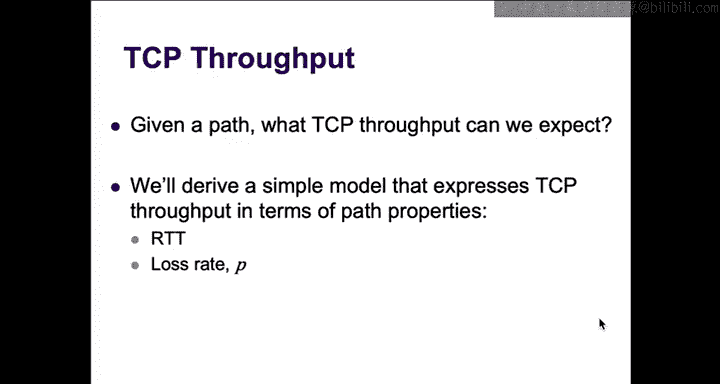

所有关于此事的提醒和细节都会发布在网站上。在后勤方面有任何问题或想法吗？

## 课程概述

好的，那么今天是关于拥塞控制主题的最后一讲。这是关于拥塞控制的第三讲。

上次我们详细介绍了TCP拥塞控制的工作原理，逐步讲解了如何实现窗口、重传时如何滑动窗口等规则。

今天的课程将有很大不同。我们将从更高的层面退一步，审视几个主题。我们将尝试对TCP的性能进行建模，从而摆脱那些详细的、逐秒的行为描述。

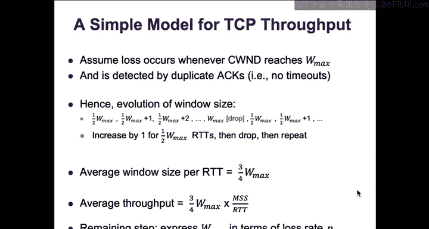

我们还将对TCP进行一些批判性分析，看看它做得好和不好的地方，这引出了TCP的一些演进和变化。

最后，我们将讨论路由器辅助的拥塞控制，其中一些已在实践中应用，一些还处于研究开发阶段，我们会探讨所有这些想法。

为了让你们思路清晰，我们将涵盖相当广泛的设计理念。其中一些甚至仍处于研究阶段，我们不期望你们在本课程中完全理解这些理念，但你们应该知道这些设计试图解决什么问题，以及它们试图如何解决这些问题的高层思路。

与之前详细讲解的TCP拥塞控制不同，我们不要求你们了解这些想法如何工作的细节。

## TCP吞吐量方程

那么，今天的第一个主题是TCP吞吐量方程，它试图回答的问题是：我们已经详细讨论了TCP和拥塞控制的工作原理，包括滑动窗口、AIMD（加性增乘性减）等。但如果我问你，给定一条路径，作为应用开发者或用户，你能期望获得多大的TCP吞吐量？你能回答吗？

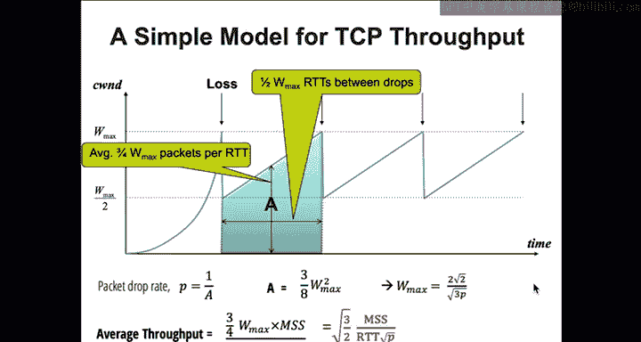

如果我告诉你，你的路径有特定的往返时间（RTT）和丢包率（P），这很难回答，因为我们研究的是TCP如何工作的非常底层的机制。你可能能告诉我，如果窗口大小是17，你收到了三个重复确认，你会将窗口大小减少多少，然后在某个时间点能在网络中发送多少数据包。但这并不令人满意。这不是我们在更高层面思考性能的方式。我们想要一种更简洁、更通用的方式来推理性能。这就是TCP吞吐量方程试图给我们的东西。它是一个简单的模型，做了一些简化假设，因为可以想象，没有精确的闭式方程能准确预测TCP吞吐量。

但这个方程要回答的问题是：如果我告诉你源和目的地之间有一条路径，并且我告诉你这条路径的大致往返时间（RTT）和丢包率（P），那么这个方程将告诉你，作为应用开发者或用户，可以期望获得多大的吞吐量。

让我们逐步推导这个方程是如何工作的。简单模型从一个假设开始：假设每当发送方的拥塞窗口达到一个参数 **W_max**（即经历丢包时的最大窗口大小）时，就会发生一次丢包。

我们进一步假设丢包是通过重复确认（Duplicate ACK）机制检测到的。这意味着我们没有超时，只有一次孤立的丢包。这是另一个假设。

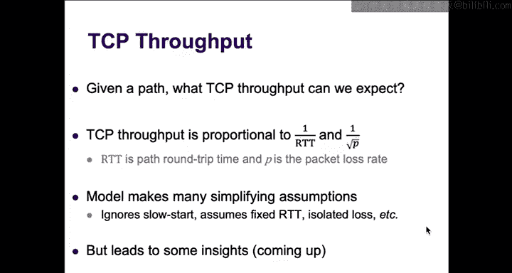

那么，思考一下发送方窗口大小将如何演变。第一步，你收到三个重复确认，检测到丢包，第一件事就是将窗口大小减半。此后，我们进入AIMD阶段（加性增乘性减）。因此，在检测到丢包后的一个RTT，我们期望窗口大小为 **W_max / 2 + 1**。再过一个RTT，我们增加2。再过另一个RTT，我们增加3。依此类推，直到在我们的模型中达到 **W_max**，即最大窗口大小，此时我们再次经历丢包。

然后，在这一点上，再次将窗口大小减半，并重复此过程。因此，我们窗口大小的演变过程是：从 **W_max** 减半到 **W_max / 2**，然后每个RTT增加1，直到再次达到 **W_max**，然后再减半。

我们每个RTT增加1，持续了 **W_max / 2** 个RTT。因为从 **W_max / 2** 开始，每个RTT增加1，直到达到 **W_max**，这意味着我们经过了 **W_max / 2** 个RTT。然后，我们一遍又一遍地重复。

基于这个非常简单的假设，这告诉我们，假设我们始终处于这种在减半和全满之间上下波动的稳定行为中，那么每个RTT的平均窗口大小是 **3/4 * W_max**。

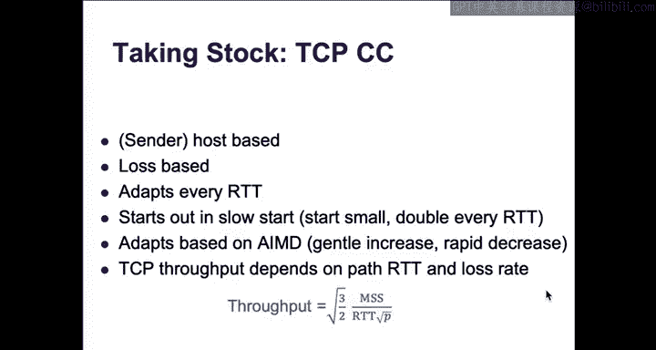

那么吞吐量，窗口大小就是你发送的数据包数量。因此，吞吐量是 **3/4 * W_max** 乘以 **MSS**（每个数据包的字节数），再除以往返时间（RTT）。因为我们平均每个RTT发送 **3/4** 个窗口的数据。字节除以时间，我们就得到了吞吐量。

到目前为止都清楚吗？有任何问题吗？

这样，我们已经用往返时间表达了吞吐量（但还包含 **W_max** 项）。**W_max** 本身并不是路径属性。所以下一步是用其他东西替换 **W_max**，这将是丢包率的表达式。

到目前为止有任何问题吗？

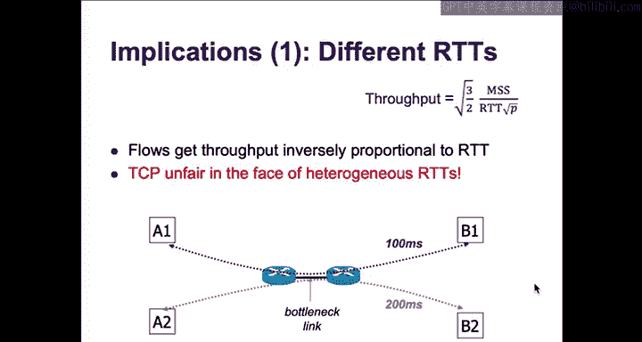

好的，这将是模型的第二步。现在我向你们展示的是拥塞窗口大小（以数据包数为单位）随时间（X轴）变化的图。

我们从慢启动阶段开始，达到 **W_max**，一次丢包后减半，然后在这两点之间上下波动，进行AIMD。我们将关注点放在这里。我们假设我们永远停留在这个AIMD阶段，忽略初始的慢启动。

现在，让我们关注这里用蓝色高亮显示的其中一个周期，标记为 **A**。

如果我们现在考虑这个图中的丢包率，我们在那个阴影区域恰好丢了一个数据包。平均而言，我们在整个阴影区域每发送 **A** 个数据包就丢失一个。因此，我们的丢包率 **P** 是 **1 / A**，其中 **A** 是那个阴影区域发送的数据包总数。

剩下的就是计算阴影区域实际有多少个数据包 **A**。我们刚刚说过，这个时间段是 **W_max / 2** 个RTT。因为每个RTT我们增加1，我们从 **W_max / 2** 增加到 **W_max**，所以有 **W_max / 2** 个RTT。

我们还说过，平均每个RTT我们有 **3/4 * W_max** 个数据包。因此，阴影区域的数据包总数就是这两者的乘积。即 **(3/4 * W_max) * (W_max / 2) = (3/8) * W_max^2**。

现在，如果我将项移来移去，我可以用丢包率 **P** 来表示 **W_max**，然后将其代入我们之前得到的用 **W_max** 表示吞吐量的公式中。

这样我们就得到了这个函数，即吞吐量用路径的往返时间（RTT）和丢包率（P）表示。

我暂停一下。有任何问题吗？或者有人希望我重复某个部分吗？

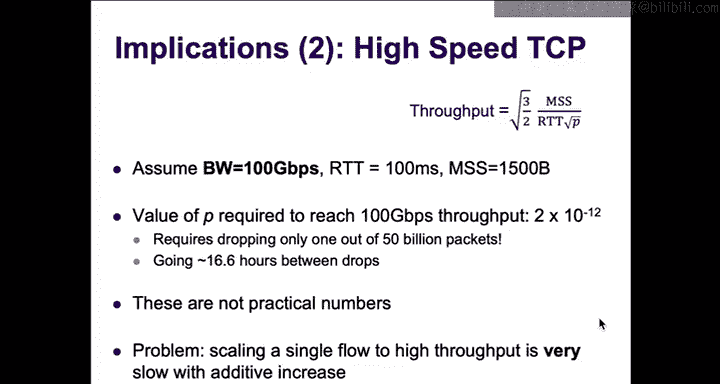

MSS是最大报文段大小，即一个数据包中的字节数。在我们乘以MSS之前的所有计算都是以数据包为单位的。当我们乘以MSS时，就得到了比特每秒。

还有其他问题吗？或者有哪个点希望我重复吗？我们将在接下来的幻灯片中使用这个方程，所以理解它很重要。

因为我们在线性增加，从一半到全满，所以平均值是四分之三。

好的，给定一条路径，我们可以期望的TCP吞吐量是多少？我们现在知道，吞吐量与 **1 / RTT** 成正比，与路径丢包率的平方根成反比。

你们可以离线查看推导过程，那里没有什么复杂的东西。但从直觉上思考，这应该完全合理。为什么它与往返时间成反比？因为请记住，我们在TCP中所做的一切都是基于确认（ACK）来计时的。你等待一个往返时间来接收确认，然后做出反应。所以，如果我的往返时间更短，我就能更快地收到确认，反应也更快，增加得也更快。因此，吞吐量与往返时间成反比是合理的，短往返时间意味着反应更快。

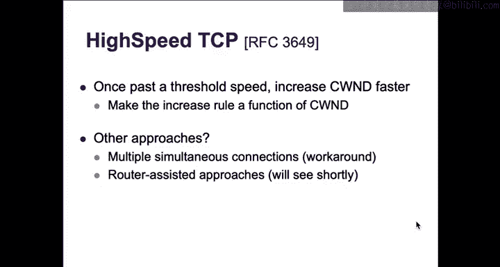

丢包率也是如此。如果路径丢包率高，那么我会更频繁地减少窗口。因此，我的吞吐量更低是合理的。如果我丢包率非常低，那么我会持续增加并保持在那里，不会减少。同样，吞吐量与丢包率成反比也是合理的。

这个模型做了一些简化假设，特别是忽略了慢启动。如果你有一个长连接，通常只慢启动一次，然后大部分时间进行AIMD，那么这个假设是合理的。它还假设固定的往返时间和非常清晰的丢包模式，即每次达到 **W_max** 时恰好丢一个包。

尽管有这些假设，但这个模型实际上很有用，因为它让我们能够退一步，摆脱对单个确认的思考，转而考虑TCP的整体行为。

正如我们将在接下来的几张幻灯片中看到的，仅仅看这个方程就能给你很多关于TCP做得好和不好的地方的见解。我们马上会讲到。

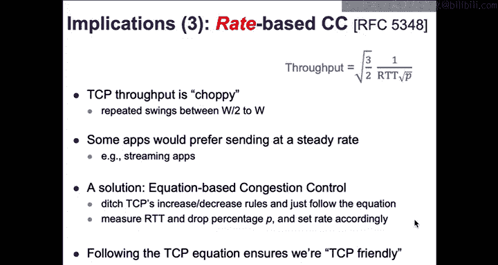

## TCP拥塞控制的局限性

总结一下，我们已经完成了TCP拥塞控制的讲解，现在将转向探讨TCP做得不好的地方。

让我们回顾一下TCP进行拥塞控制的主要特点：
1.  它是基于主机的，无需路由器支持。实际上，它是基于发送方的，所有智能都在发送方。
2.  它是基于丢包的，我们使用丢包作为拥塞的指示。
3.  我们适应的时标是往返时间。
4.  我们从慢启动开始，拥塞窗口（cwnd）从1开始，每个RTT翻倍，直到发生丢包。
5.  在稳定状态下，我们通过加性增乘性减（AIMD）来适应并找到正确的速率。这是一种非常温和的增加和非常保守的减少。
6.  最后，吞吐量取决于往返时间和丢包率，根据我们推导的方程。

现在，如果你审视这个设置，并稍微转变角度，进行一些批判性思考。对于这个设置或这套设计选择，有哪些是我们不喜欢、可能有问题、可能显得怪异或值得评论的地方？

我们不断改变速率，总是在增加或减少，从未处于一个稳定的点。是的，这是一个问题。还有它是基于丢包的。丢包可能并非由拥塞引起，这绝对是个问题。关于这个设置还有其他问题吗？关于发送方呢？它纯粹是基于主机的，这既是优点也是缺点。我们稍后会讲到。还有其他吗？

好的，让我们看看其中的一些问题。我想我列出了大约八个。第一个影响实际上直接来自于观察TCP吞吐量方程。

### 1. 面对异构RTT的不公平性

我们已经说过，流的吞吐量与往返时间成反比。这在某种程度上是设计使然。我们决定等待确认返回，并基于此决定如何调整拥塞窗口。但这带来了一些影响。

如果我给你看一个非常简单的例子，比如这个：A1与B1通信，往返时间为100毫秒；A2与B2通信，往返时间为200毫秒。TCP吞吐量方程告诉我们什么？你期望A1和A2的吞吐量关系如何？在其他条件相同的情况下，A1的吞吐量是A2的两倍。

因此，面对异构的往返时间，TCP实际上是不公平的。我们讨论过AIMD如何收敛到效率和公平，但如果你回顾那个例子，你会意识到我们假设它们有相同的往返时间，它们在同一时间做出反应，因此我们收敛到完全公平。但在实践中，如果你的往返时间短，你增加得更快，因此你更贪婪地获取带宽份额。所以TCP并不完全公平。

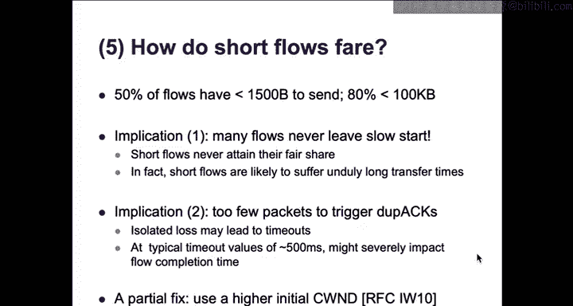

例如，如果你坐在伯克利，从旧金山的服务器下载文件，假设往返时间与地理距离成正比，那么你的吞吐量将比从东海岸下载要高，因为你的往返时间更短。实际上，当我们讨论Web和HTTP时，你会听到内容分发网络（CDN），比如Akamai或Cloudflare，它们将内容缓存到离用户非常近的地方。这有几个原因，一个是传播延迟更低，但你还能获得额外的提升，因为TCP增加得更快，给你更好的吞吐量。因此，在实践中，这也是推动内容边缘计算、将内容和计算移近用户的原因之一。

对此有任何问题吗？所以，这可以被称为一个问题，也可以不称为问题，但这确实是TCP的实际行为，作为互联网用户，我们就是这样体验它的。

### 2. 高速TCP问题

第二个影响来自于观察TCP吞吐量方程，即高速TCP问题。这里的设置如下：假设你在互联网上有一条路径，其瓶颈容量或作为发送方可以发送的容量是100 Gbps。假设你的往返时间是100毫秒，MSS是1500字节。

如果我将这些值代入TCP吞吐量方程，它会告诉我，为了达到100 Gbps的吞吐量，我需要的丢包率大约是 **2 * 10^{-12}**，这是一个低得离谱的丢包率。这意味着每500亿个数据包才丢一个。

或者，如果你计算一下需要多少个RTT才能增加到那个速率，可能需要数小时。这里发生了什么？我说的是，我希望一个流获得100 Gbps。它必须能够增加。如果你在这里代入数字，并计算这种带宽延迟积对应的拥塞窗口数据包数，可能是成千上万，甚至十万个数据包。

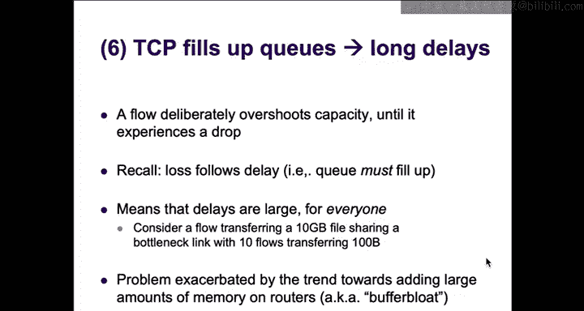

那么，思考一下，如果我的拥塞窗口有10000个数据包，我丢了一个包，TCP会将拥塞窗口减半到5000个数据包。现在，它每100毫秒增加一个数据包。但要重新增加到10000个数据包，需要5000个RTT。5000个RTT乘以100毫秒，你将花费数小时才能重新增加到100 Gbps。

所以，基本上，这些数字是不切实际的。即使是 **10^{-12}** 的丢包率，也接近大多数通信介质的比特误码率。因此，在你试图增加到那个速率的过程中，几乎肯定会遇到丢包。

因此，TCP面临的根本问题是，为了将单个流扩展到非常高的吞吐量或非常高速的链路，如果你采用每个RTT增加一个数据包的加性增加方式，速度会非常慢。

通常有人会问，这种情况有多常见？一个流需要占用100 Gbps路径的情况多吗？答案是不太常见。所以这不是每个互联网用户都面临的问题，尽管我们有100G或10G的链路，但它们被数百万用户共享。然而，在某些场景下，这个问题确实会出现。实际上，提出这个问题并在标准机构中推动解决的团队是ESnet（能源科学网络）。这是一个连接美国国家实验室并连接到能源部的网络。

这些物理学家和天体物理学家有粒子模拟器，以及从外太空收集的巨大数据集需要传输。因此，他们确实经常需要在站点之间移动这些非常大的数据传输，并且他们建立了一个专为他们（也不仅仅是他们）的网络，虽然通过互联网，但他们已经在所有实验室之间部署了100 Gbps的链路，他们希望能够使用它们。所以，这是一个非常糟糕的情况：你部署了高速网络，但由于TCP的阻碍，你实际上无法达到那种高吞吐量。

因此，他们提出的解决方案，也是他们一直在努力标准化的方案之一，叫做高速TCP。它对TCP做了一个非常简单的改变。如果你处于这种场景，你会怎么做？

如果你被要求修改TCP的拥塞控制来解决这个问题，你会怎么做？增加超过一个数据包。这绝对是一个方法。但有一个附加条件：你必须小心不要影响其他流。

非常接近你的想法：流（发送方）监控其拥塞窗口。一旦超过某个阈值，它就说，好吧，我处于高速状态，我不是在竞争100 Mbps，而是在竞争大量带宽。我可以开始更快地增加，因为有很多可用带宽。因此，高速TCP通常的做法是：在达到阈值之前进行低加性增加，之后，它会根据拥塞窗口的函数来增加，即在那之后超线性地增加。即使在减少时，它也会比减半更温和一些。

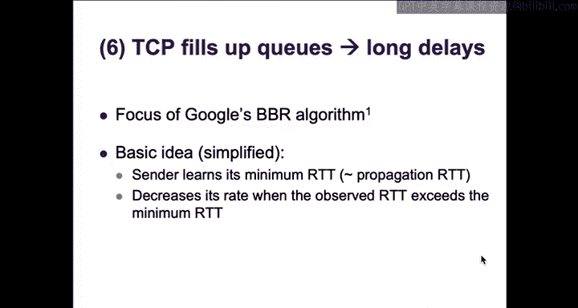

再次强调，我们不要求你们知道高速TCP如何工作的细节，但要理解它解决的问题：如果你试图占用这些高速链路，TCP增加得太慢。其基本思路是增加得更快，比线性更快。

你能想到其他解决这个问题的方法吗？不改变TCP？这在互联网上经常发生。发送更多流，打开多个同时连接。人们提出的另一种方法是使用路由器辅助的拥塞控制，我们稍后会讲到。

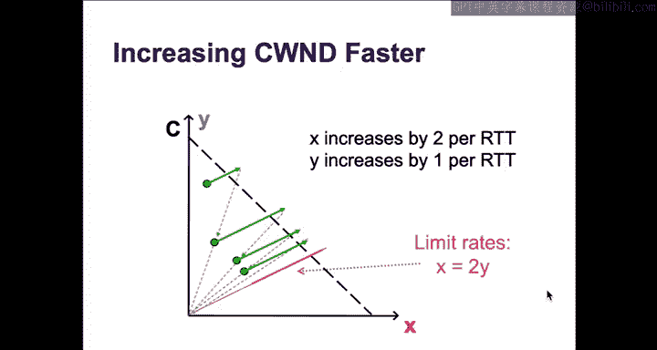

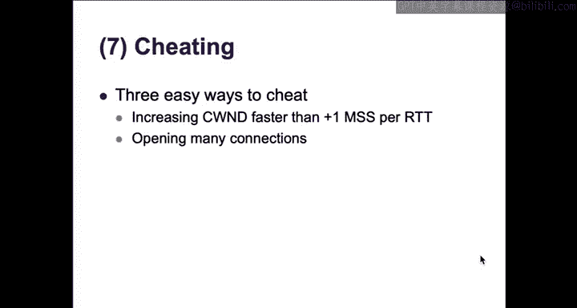

对于打开多个连接，人们怎么看？作为解决方案有什么缺点吗？你可以打开100个连接，获得100倍的吞吐量。但有一个小原因使得这样做很痛苦。从应用开发者的角度来看，TCP的一个优点是它提供了一个很好的字节流抽象。你只需要说，我有这些数据要发送，打开一个连接，发送过去，就完成了。如果你要打开多个连接，应用现在必须考虑如何在连接之间划分应用数据，必须跟踪这个特定连接是否被重置、需要重启并重新发送数据，或者一个连接慢而另一个快，可能需要重新在连接之间分配数据。所以作为应用开发者，需要做更多工作，但这当然是可行的。这可能比一开始就让你的程序多线程化更容易，是的。这是个很好的类比。

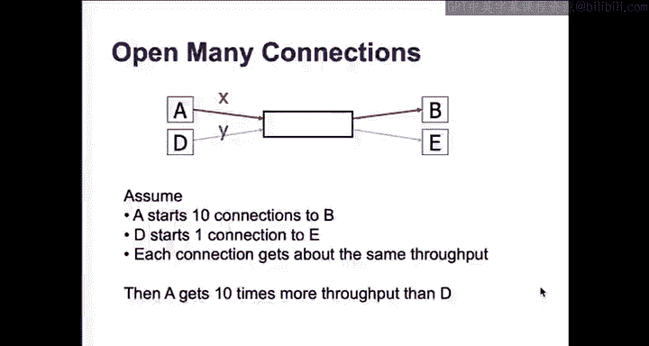

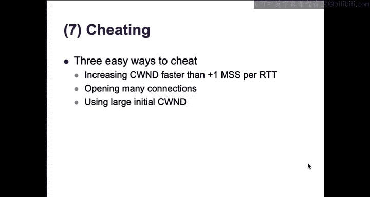

### 3. 基于速率的拥塞控制

第三个影响是我们称之为基于速率的拥塞控制。这正是之前有人提到的，即TCP吞吐量是波动的，我们不断重复那种上升、下降、再上升的模式。对于某些应用来说，这不是自然的行为方式。特别是，如果你考虑音频或视频流应用，它们以特定的速率采样音频或视频，应用的自然行为是选择一个速率并以该速率传输数据。

因此，支持此类应用的一个解决方案直接来自于吞吐量方程，我们称之为基于方程的拥塞控制。

想象一下，你是一个应用开发者，由于这种波动行为，你实际上不想使用TCP。你可以做的是发送几个数据包，测量往返时间，估计丢包率 **P**，将这些值代入TCP吞吐量方程，然后以该速率发送。

在讲座早些时候，有人问过，如果你有一个UDP应用，而UDP不做任何拥塞控制，我们不应该担心UDP如何与TCP竞争吗？构建UDP应用的正确方法就是这样做，即计算TCP会占用多少带宽份额，我将占用相同的份额，然后我就以那个速率发送。

对此有任何问题吗？我们这样做的原因是，这个方程告诉我们，我们允许一种不同的方式来实现TCP友好性，而无需实际遵循TCP的拥塞控制行为。

这通常有一个标准，RFC编号在那里，叫做基于方程的拥塞控制。它不一定是TCP。你可以使用TCP头部，如果你想保持TCP兼容性，但让速率由方程决定，而不是滑动窗口；或者它也可以是基于UDP的实现。所以它不一定是TCP。

### 4. 其他局限性

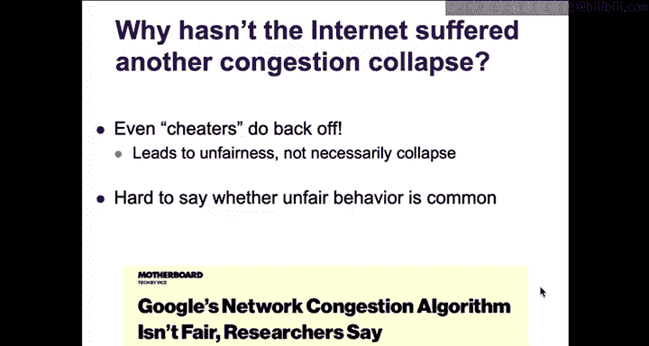

TCP拥塞控制的其他局限性。一个是之前提到的，我们过去讨论过，TCP会将其他原因（如链路损坏）造成的丢包误认为是拥塞造成的丢包。对于TCP来说，任何丢包都意味着拥塞，它会降低速率。

所以，如果链路上发生了损坏之类的事情，TCP不会知道。它仍然会表现得好像发生了拥塞，并降低速率。因此，你获得的性能比实际需要的要低。同样，我们不一定有解决方案。

另一个问题：你认为短流在TCP下表现如何？这个问题尤其相关，因为大多数测量显示，实际上大多数流都非常短。例如，这是几年前谷歌研究的一个数据点：50%的流只发送一个或少于一个数据包的数据。

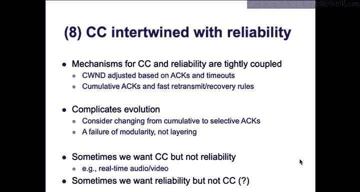

想想为什么会这样。例如，很多数据中心应用是键值对查找，你说“给我这个键对应的值”。这不是一个长流，而是一个请求-响应，非常短的流。大约80%的流要发送的数据少于100 KB，这大约是少于10个数据包。

如果我们有绝大多数流都只有少量数据包，你认为TCP拥塞控制会怎么做？你认为这样做有什么缺点？让我们从TCP会怎么做开始。TCP启动连接时处于慢启动。想象一下，如果有四个数据包要发送。我会发送一个数据包，等待确认；发送两个数据包，等待确认；发送第四个数据包。所以我花了三个RTT发送了四个数据包。吞吐量低得离谱，大约每个RTT一个数据包。而我们刚刚说过，大约50%或80%的流将看到这种吞吐量。

这可能是个问题，因为许多流永远不会离开慢启动。我们在TCP中做了所有这些工作来找到你的公平份额并保持它，但事实上，大多数短流只会处于慢启动，它们花费的时间比应有的要长。这只是短流将经历的情况。

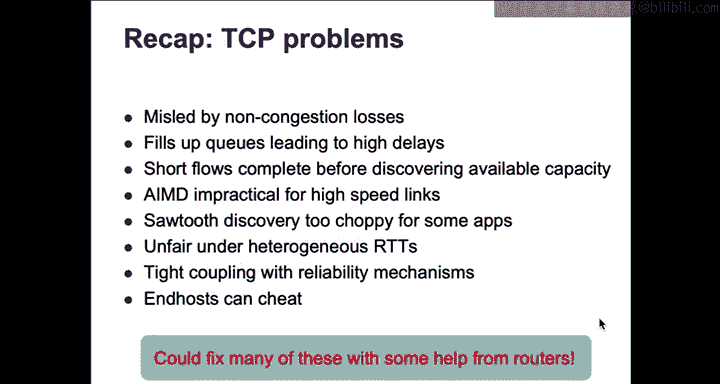

另一个出现的问题，这涉及到TCP拥塞控制的具体细节：请记住，我们严重依赖重复确认来避免超时。但是，假设我有一个五六个数据包的流，第四个或第五个数据包丢失了。我管道中没有足够的数据包来触发重复确认。因此，短流如果发生丢包，通常会导致超时，而超时时间与典型的RTT相比非常长。所以，如果你有一个短流，你又会得到很差的性能。

如何解决这个问题？首先，这有多大问题？你可能会想，哇，如果50%的流都是一个数据包，为什么我们一开始要在TCP中做所有这些工作？因为当你从另一个角度看测量数据时，网络上99%或90%的字节来自长流。我们称之为大象流和老鼠流，大多数字节在这些长流中，尽管大多数流是这些短的老鼠流。这种大象与老鼠的现象，我们将在讨论数据中心时再次提到。

回到这个问题。我们有很多短流，它们从未离开慢启动，性能很差，并且遭受超时。你能想到一个快速、有点取巧的修复方法吗？从一个更大的初始窗口开始。这实际上是谷歌几年前游说标准机构提出的，叫做初始窗口10，即从初始窗口10开始。所以现在，如果你要发送的数据少于10个包，你只需将它们全部丢到网络中，就完成了。

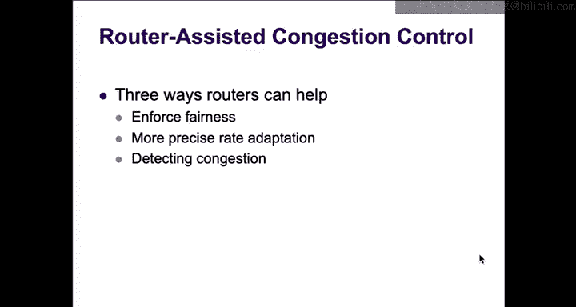

这是一个非常务实的快速修复方案。它并没有完全解决问题，因为它没有解决没有足够重复确认来触发重传的问题，所以你仍然会有超时。但除此之外，它解决了慢启动导致多个RTT的问题。

为什么不为短流使用不同的协议？事实上，在数据中心领域，有很多工作致力于能够快速发送短流。在实践中，这已经足够好了，对吧？初始窗口为10，这在一定程度上解决了问题。你不需要去重写网络栈和你的应用。所以从务实的角度来看，这解决了问题。没有特别的理由必须使用不同的协议。

### 5. TCP填满队列（Bufferbloat）

另一个问题：TCP填满队列。这再次与使用丢包作为延迟指示有关。所以，如果你记得TCP的工作方式，它在设计上故意试图找到最大可持续速率，而它这样做的方式就是导致丢包发生。因此，TCP设计上会填满瓶颈链路的队列。

如果你记得，我们说过丢包跟随延迟。这意味着在你经历丢包之前，你肯定已经经历了延迟，因为你填满了队列，你的数据包在队列中等待，增加了延迟，然后你才看到丢包。

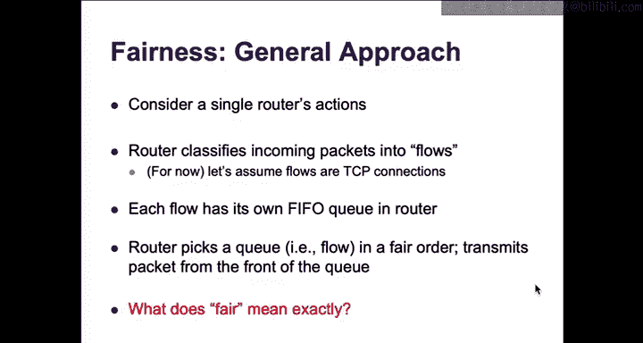

这意味着延迟很大，而且对每个人都很大。想象一下，你有一个瓶颈链路，并且有很多这些短流，它们只有一两个数据包要发送。如果网络中没有长流，它们将看到零排队延迟，它们只是通过。现在，你有一个大流启动，传输一个10 GB的文件。这一个长流填满了所有队列。它不仅给自己造成延迟，也给网络中的所有流造成延迟，因为那些短流现在也被卡在长流后面，坐在队列中并产生延迟。

特别是，这确实是TCP设计的行为方式。所以并不是设计者不知道这种行为。但真正导致这个问题的是，很多供应商开始在路由器上添加越来越多的内存，特别是我们家里的家用路由器，它们有大量的缓冲空间。这里的想法是，家用路由器供应商只是不想在家里发生数据包丢弃，所以他们开始放入大缓冲区。于是我们开始看到这些非常大的延迟。

现在，这种由排队引起的缓冲区延迟实际上可能非常显著。在互联网上，这个问题被称为缓冲区膨胀（Bufferbloat）。这对于提供内容或关心延迟的互联网服务尤其成问题。当谷歌开始运行YouTube时，这个问题的典型例子真正惹恼了人们。

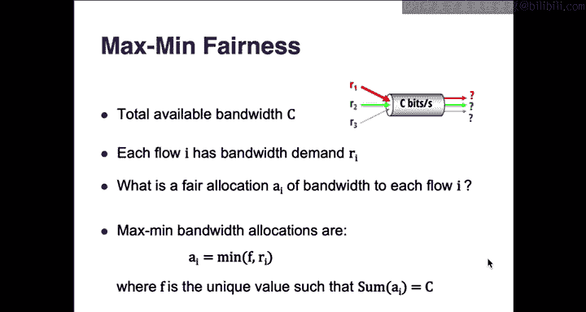

他们发现，当家中的用户同时观看YouTube时，搜索响应时间会下降。所以，如果你正在观看YouTube视频，而你家里有人在搜索，他们会看到更差的搜索延迟或搜索响应时间，因为有时家庭路由器上有数秒的缓冲。

这个问题清楚了吗？好的。那么，路由器在做什么？通过链路发送数据包。而TCP在设计上会增加其速率，直到导致丢包。这意味着什么？发送方（比如这里的YouTube）会继续尝试以更高的速率发送流量，这意味着在你家路由器朝向用户的方向上，家庭路由器的队列开始填满。但TCP会继续增加该速率，直到看到丢包。这意味着你路由器上的队列是满的。所以现在，当一个数据包到达该路由器时，它会坐在队列顶部，等待队列被清空。但是，如果我有，比如说，10000个数据包在队列中，那个数据包可能会被延迟很长时间。

还有其他问题吗？

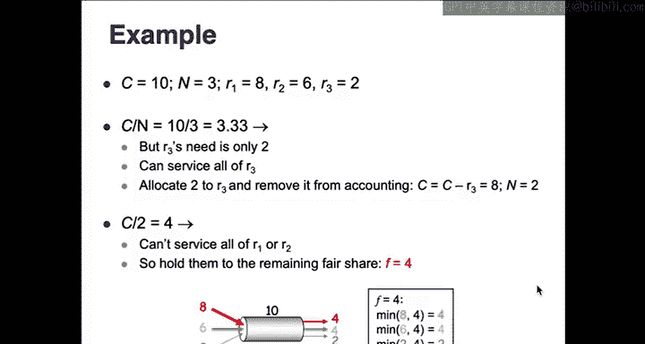

这正是导致谷歌开始研究这种新的拥塞控制算法BBR的原因。这里的想法是，如果你是谷歌，试图解决这个问题，你会怎么做？

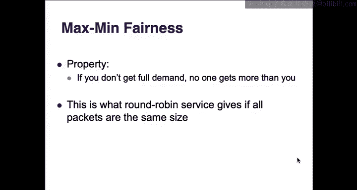

你想要低延迟。因为如果你想一想，坐在路由器缓冲区里有什么好处？从性能或吞吐量的角度来看，没有任何好处。我们设置缓冲区是因为我们说流量是突发的，我们想吸收暂时的突发。但现在，如果我们说我们总是让这个队列满着，它实际上并没有以任何方式帮助我们。

你会尝试做什么来修复这个问题？缩小队列。有一个关于这个的幻灯片。你可以告诉路由器供应商，特别是家用路由器供应商，不要在家庭路由器上放那么多缓冲。但这样做的担忧是，如果你有突发流量，会导致丢包。是的，没错。

实际上，这是一个巧妙的想法。虽然不是BBR采用的方法，但你绝对正确。这个想法叫做随机早期检测（RED），意思是当你的队列开始填满时，让我们主动丢弃一个数据包来告诉发送方减速。很好的想法，但不是BBR采用的那个。让我重新表述这个问题：如果不改变路由器，你会怎么做？如果你只是YouTube或谷歌，这是你唯一的选择，是的。这是一个有趣的思路。如果你没有突发流，但这能解决问题吗？因为这里的问题是TCP故意试图增加其速率，它唯一知道如何停止的方式就是先填满队列。

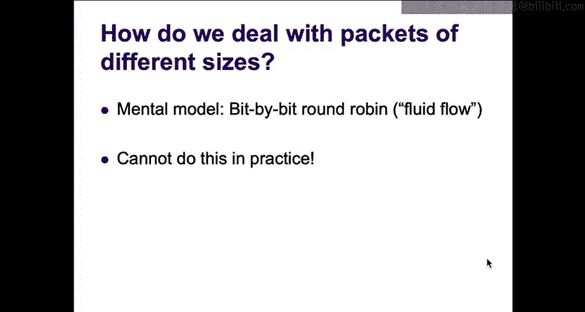

是的，所以这里的想法是基于延迟的拥塞控制。这是对TCP所做工作的一个非常简化的版本。这里你应该理解的是BBR试图做什么。我希望你理解BBR试图做什么的思路。

BBR试图做的是说，我们仍然希望以链路瓶颈或可用容量的最大可能吞吐量运行，但我们希望在不建立队列的情况下做到这一点。

因此，BBR的见解是，随着队列的建立，我作为发送方得到的信号表现为延迟。所以，如果我测量一个数据包从我发送到确认返回所花费的时间，如果我开始建立队列，数据包开始坐在队列中，我应该能够通过测量数据包的延迟来看到它。

因此，他们的主要思路是：与其等待丢包，不如测量延迟。让我们很好地了解路径的最小延迟是多少。所以，如果我能够足够频繁地测量延迟，我得到的最低测量值，即最小延迟，是在没有排队的情况下我可以预期的延迟的合理近似值。如果我开始看到我的延迟超过这个值，那么我就可以降低速率。

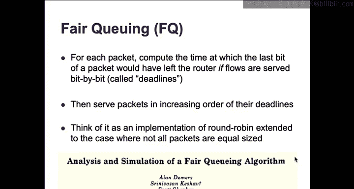

所以，它在检测到延迟增加时提前降低速率，而不是等到丢包。但除此之外，TCP适应和搜索、上升和下降以找到正确发送速率的基本思路在BBR中仍然存在。主要思路是测量延迟，观察其是否增加，并对延迟做出反应而不是丢包。

有任何问题吗？再次强调，我们不要求你们知道BBR如何工作的细节，但要理解它解决的问题：TCP会建立队列。并理解其核心思想：我们将测量延迟并对延迟的增加做出反应。

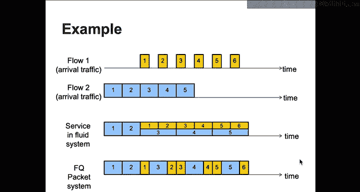

关于延迟，我们能作弊吗？为什么我们测量最小RTT？BBR中的想法是，我们不想让数据包在队列中堆积。当队列堆积时，延迟增加。但我需要知道一个基线，我需要比较什么。我需要知道一个好的延迟是什么样的。那个好的延迟将是我曾经看到的最小RTT。我将猜测或希望那个最小RTT对应于我没有排队的时候。

还有其他问题吗？

### 6. 作弊方式

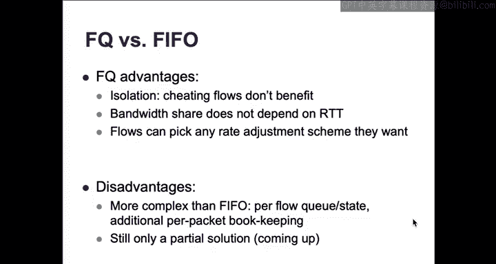

作为TCP发送方，你可以作弊的方式。如果你只控制TCP连接的发送方，你可以做些什么来获得更高的吞吐量？不将窗口减半，这当然是一种。另一种是每个RTT增加超过一个MSS。事实上，如果你回顾我们上次做的效率-公平曲线，如果你说X每个RTT增加2，而Y每个RTT增加1，你会看到X获得Y两倍的速率。这是一种非常容易获得超过你公平份额的方法。

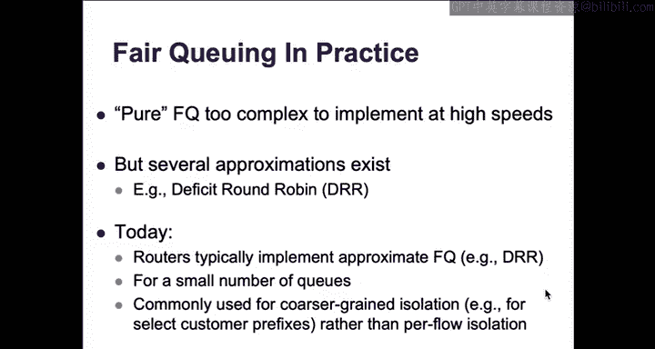

其他方式：直接打开多个连接。

再次回到这里，如果A向B打开10个连接，而D打开一个连接，那么A将获得D吞吐量的10倍。这可能是获得超过你公平份额的最简单方法。

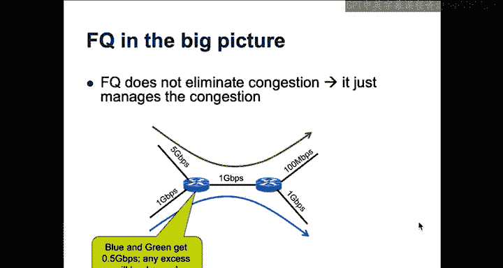

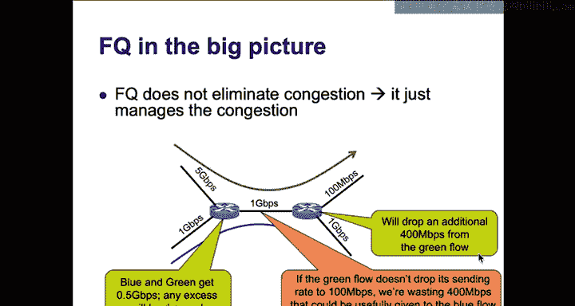

使用大的初始窗口。没有什么能阻止你从1000个数据包的窗口开始。基本上，TCP中没有什么能阻止你不遵守规则，只是发送比你应有的更多的数据。

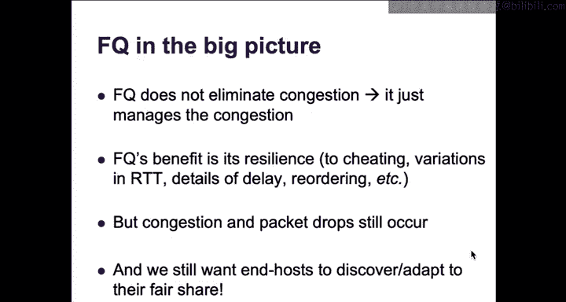

这对大家来说有道理吗？那么，每个人通常会问的自然问题是：为什么互联网没有遭受拥塞崩溃？我们开始讲拥塞控制时谈到，人们引入拥塞控制的原因是因为他们经历了拥塞崩溃。现在我们有了这个非常复杂的拥塞控制算法。但我们也知道，我们生活在一个互联网上有很多恶意行为者的世界。而我们刚刚说过，你不必遵循那个拥塞控制算法。你认为为什么我们还好好的？至少据我所知，自80年代以来，互联网上从未有过拥塞崩溃的报告。

当然，如果你有一组发送过多流量的源，它将被视为拒绝服务攻击，ISP可能会进行速率限制。另一个原因是，即使是那些在拥塞控制上作弊的人，他们也会退避。所以，回顾一下拥塞控制的早期原因，当时的TCP实现有一个固定的超时，它们从不调整超时，也从不降低速率。所以每次超时（可能是一个很短的值），它就会将整个窗口的数据丢到网络中。而今天，即使你打开10个连接，当这些连接遇到拥塞时也会退避；或者即使你从一个更大的初始拥塞窗口开始，当你丢包时，你也会进行乘性减少。所以，原则上，你可以向网络狂发数据包，但这通常是一种攻击，并且会受到严格限制。如果你只是想稍微修改TCP以获得不公平的优势，这会给你不公平的优势，但不会导致拥塞崩溃。

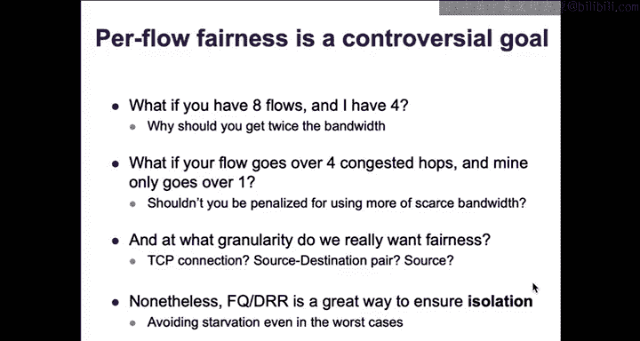

所以，这是对为什么我们尚未遭受拥塞崩溃的推测。那么你应该问的第二个问题是：好吧，我们没有拥塞崩溃，但不公平在互联网上常见吗？答案是，我们实际上不知道。有一些轶事报告偶尔出现在媒体上。例如，几年前，有一项研究显示BBR实际上并不公平，在某些BBR与某些传统TCP连接竞争的场景中，BBR会占用超过其份额的带宽。这导致了一些新闻报道，谷歌与这些研究人员合作修复BBR等等。但这确实会发生。我无法告诉你这在互联网上有多普遍，不公平的程度有多大。你可以想象，这实际上是一个很难回答的问题。在谷歌和BBR的案例中，他们开源了系统，所以人们可以获取并进行实验。但我们真的不知道Netflix做了什么（我并不是特意针对Netflix），但许多拥有闭源实现的内容提供商，我们就是不知道。

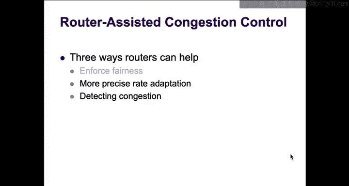

问题：BBR实际上是，如果你与YouTube服务器通信，该服务器在向你发送数据包时会使用BBR。BBR是TCP，它只是TCP内部一种不同的拥塞控制算法。所以这里的技巧是，拥塞控制只是在发送方运行的一种算法。所以它仍然是TCP。很好的观点。谷歌的原始实现是对Linux中拥塞控制算法的修改，并且是开源的。所以现在，你可以去获取源代码并在你的笔记本电脑上运行BBR。

### 7. 与可靠性的紧密耦合

最后一点，这与作弊关系不大，更多是软件工程实践：拥塞控制与可靠性深度交织在一起。我们详细讨论过，如果你看TCP中如何实现拥塞控制，其机制与TCP如何实现可靠性密切相关。我们使用重复确认、确认、超时，我们有窗口的概念，我们有围绕快速重传和快速恢复的规则，这些都与TCP如何做可靠性有关。

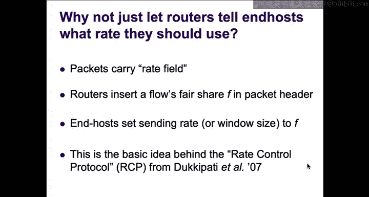

当我第一次介绍它时，我谈到这是TCP进行拥塞控制的一个有吸引力的方面。在当时，这只是TCP实现中的几行代码更改。这是积极的方面。缺点是，它使演进变得复杂。

当你考虑实现中的模块化时，我们希望有一定的关注点分离。例如，如果我想从累积确认切换到选择性确认，这应该是我们如何实现可靠性的问题。但在TCP中，它也影响我们如何进行拥塞控制。我们必须回过头来重新审视所有关于拥塞控制的快速恢复、快速重传规则。

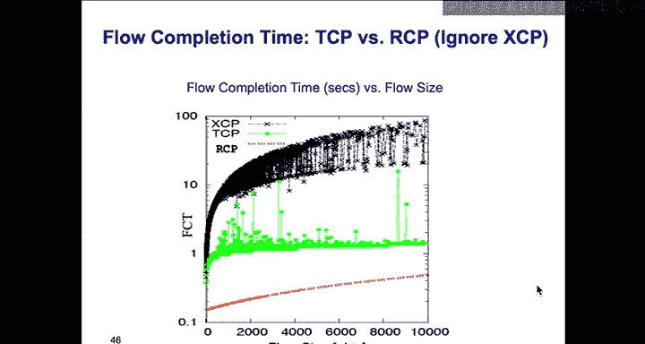

所以这不一定是性能问题，更多的是代码可维护性和软件模块化的问题。为什么这很重要？有时我们想要拥塞控制，但不想要可靠性，比如实时音频或视频。但在TCP中，没有简单的方法可以关闭可靠性而获得拥塞控制，你两者都得到。反之亦然。原则上，我们可能想要可靠性而不想要拥塞控制，比如一个简单的请求-响应，一个键值查找。我其实不需要拥塞控制，但我想要可靠性。同样，在TCP中，没有简单的方法可以关闭拥塞控制而保留可靠性。

所以，仅仅从软件模块化的角度来看，这可能不是最好的决定。

## 路由器辅助的拥塞控制

快速回顾一下TCP的问题：被非拥塞性丢包误导、填满队列导致高延迟、短流并未从拥塞控制中受益太多、AIMD对于高速链路不切实际、锯齿状模式对某些应用不理想、在异构RTT下不公平（我们对此没有真正的解决方案）、与可靠性紧密耦合、以及端主机可以作弊。

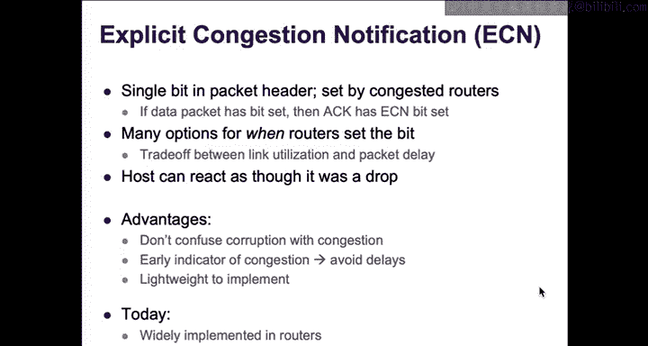

这可能看起来是一个很长的列表。你可能会觉得，哇，TCP有这么多问题。实际上，我认为除了端主机可能作弊这一点，其他大多数问题都不是致命问题。我们有处理它们的方法或合理的变通方案，这可能就是TCP能持续这么久的原因。大家觉得这合理吗？

另一个观察是，事实上，我们接下来要讲的最后一部分内容是：大多数这些问题，如果我们能从路由器那里得到一些帮助，就可以非常干净地解决它们，你们中的几个人在整个过程中已经提到了这一点。

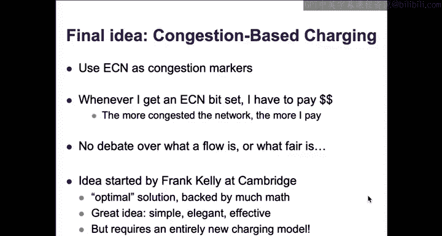

例如，我们被丢包误导，或者你必须等待填满队列才能看到丢包。路由器知道它们正在经历的拥塞程度，它们可以直接告诉端主机是否拥塞。同样，如果我们不确定端主机（发送方）应该以什么速率发送，也许路由器可以直接告诉你它可以容纳的速率。路由器可以直接向发送方发送反馈。最后，如果端主机可以作弊，一种策略是让路由器在流之间强制执行隔离，以确保作弊不是一种选择。

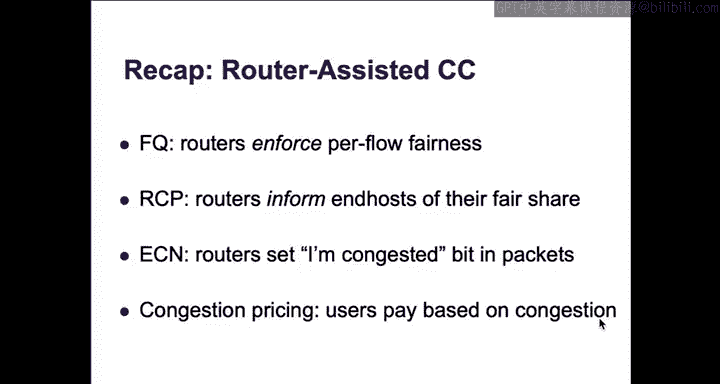

这大致上是三种我们称之为路由器辅助拥塞控制的方式。这是一个很大的设计空间，但三种最有帮助的方式是：一是强制执行公平性，这样我们就不依赖发送方做正确的事；二是进行更精确的速率适应，这样发送方就不需要不断搜索正确的速率；最后是提供一种非常直接、明确的拥塞检测方式。

### 1. 公平队列（Fair Queuing）

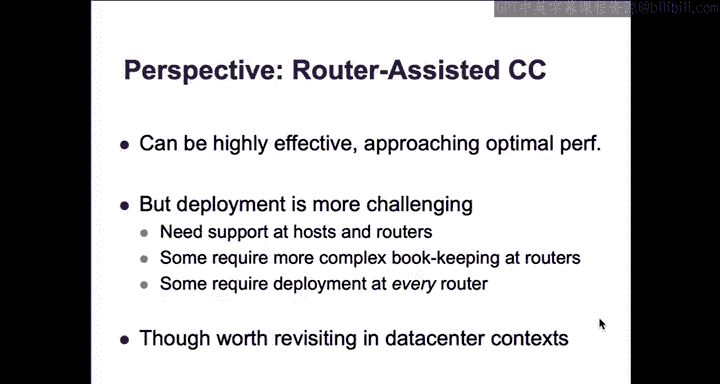

我们将从第一个开始，探讨路由器如何确保每个流获得其公平份额。我们一直在诉诸你们对公平的直觉理解，现在我们将最终更严格地定义公平性。

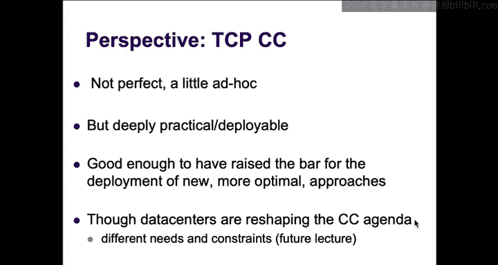

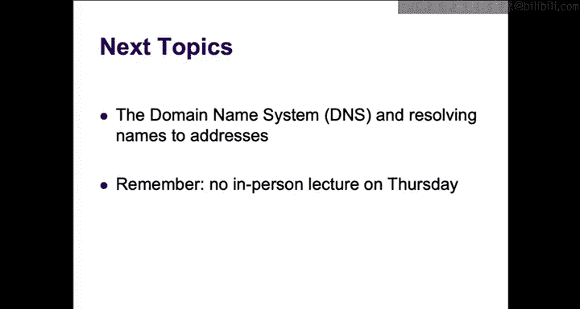

这里的基本思路是，公平性背后的设置是什么？在继续之前，你们