# 19：DNS I

## 概述

在本节课中，我们将学习域名系统（DNS）的基础知识。DNS是互联网的一项核心服务，它负责将人类易于记忆的域名（如 `www.google.com`）转换为计算机用于路由的IP地址（如 `172.217.14.206`）。我们将从DNS的历史背景和设计目标开始，逐步深入到其工作原理、协议细节以及实际应用。

---

## 历史背景与设计目标

上一节我们回顾了互联网的基础架构。本节中，我们来看看DNS出现之前，互联网是如何管理主机名与地址映射的。

早期互联网依赖于一个名为 `hosts.txt` 的集中式文件。这个文件由网络信息中心（NIC）维护，包含了所有联网主机名及其对应的地址。每个站点需要定期通过FTP下载此文件以更新本地副本。

然而，随着网络规模扩大，这种集中式管理方式暴露出诸多问题：
*   **管理负担重**：NIC团队需要手动处理所有新增主机的请求。
*   **分发效率低**：文件体积和下载频率随主机数量增长而急剧增加，导致网络流量和更新延迟问题。
*   **存在单点故障**：如果NIC的FTP服务器宕机，整个网络将无法获取最新的地址映射。
*   **与互联网去中心化理念不符**：集中式管理与互联网开放、分布式的设计原则相悖。

为了解决这些问题，保罗·莫卡派乔斯在1983年设计了域名系统（DNS）。DNS的设计目标包括：
*   **核心功能**：将人类友好的名称映射到IP地址。
*   **可扩展性**：能够处理海量的域名（如今约3.6亿个）和查询请求。
*   **分布式管理**：避免更新瓶颈，允许不同组织管理自己的域名空间。
*   **高可用性**：消除单点故障。
*   **高性能**：由于大多数网络通信都始于名称查询，因此查询速度至关重要。

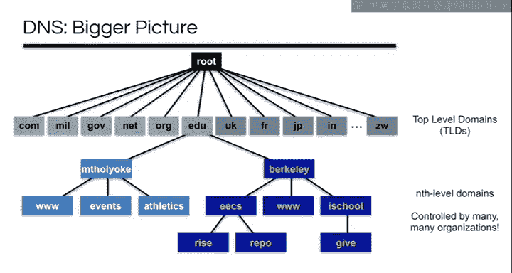

---

## DNS的层次化结构

DNS通过三个相互交织的层次结构来解决上述问题。

**1. 名称层次**
域名本身是层次化的，例如 `eecs.berkeley.edu`。你可以从任何节点向上追溯到根节点，中间节点（如 `berkeley.edu`）本身也是有效的名称。

**2. 管理权限层次**
管理权限是分层委派的。例如，`.edu` 域由Educause管理，而 `berkeley.edu` 子域的管理权限则被委派给加州大学伯克利分校，`eecs.berkeley.edu` 又可以进一步委派给电气工程与计算机科学系。

**3. 基础设施层次**
DNS服务器本身也构成一个层次结构。根域名服务器知道所有顶级域（TLD）服务器的地址；TLD服务器（如负责 `.edu` 的服务器）知道其下权威域名服务器的地址；权威域名服务器则存储其负责区域内的具体映射记录。

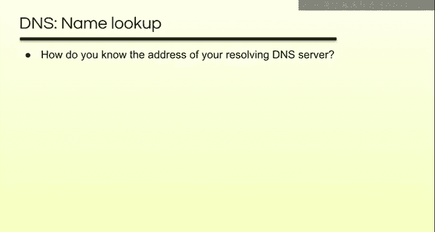

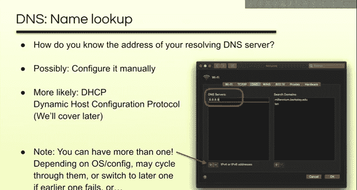

一个**区域**对应一个管理权限所负责的连续域名层次部分。例如，伯克利分校的权威服务器负责 `berkeley.edu` 区域，但它可以将 `eecs.berkeley.edu` 子区域的权限委派给另一个独立的服务器。

---

## 域名解析过程

了解了DNS的层次结构后，我们来看看一次具体的域名查询是如何完成的。这个过程称为**迭代解析**。

以下是解析 `repo.eecs.berkeley.edu` 的步骤：
1.  查询者向**根域名服务器**询问 `repo.eecs.berkeley.edu` 的地址。
2.  根服务器不知道答案，但它知道负责 `.edu` 域的TLD服务器，于是返回一个**NS记录**，指引查询者去问 `.edu` 服务器。
3.  查询者向指定的 `.edu` TLD服务器询问同样的问题。
4.  `.edu` 服务器也不知道答案，但它知道负责 `berkeley.edu` 的权威服务器，于是返回另一个NS记录。
5.  查询者向 `berkeley.edu` 的权威服务器询问。
6.  该服务器知道 `eecs.berkeley.edu` 子区域已被委派，于是返回负责 `eecs.berkeley.edu` 的权威服务器的NS记录。
7.  查询者最终向 `eecs.berkeley.edu` 的权威服务器询问。
8.  这台服务器存有 `repo.eecs.berkeley.edu` 的**A记录**，于是返回对应的IP地址。

在实际应用中，用户的设备（主机）通常不会自己完成所有这些迭代查询。相反，它会将查询任务委托给一个**递归解析服务器**（通常由ISP提供）。主机向递归解析器发送一个**递归查询**请求，递归解析器则代表主机执行上述迭代查询步骤，并将最终结果返回给主机。根服务器和大多数权威服务器通常只接受**非递归/迭代查询**。

---

## 关键问题与解答

上述解析过程引出了三个关键问题：

**1. 谁执行查询？**
可以是主机自身，但更常见的是主机将递归查询请求发送给递归解析服务器（如ISP提供的DNS服务器），由后者执行迭代查询。

**2. 主机如何知道递归解析服务器的地址？**
通常通过动态主机配置协议（DHCP）自动获取。也可以手动配置。主机可以配置多个DNS服务器地址以提供冗余。

**3. 递归解析服务器如何知道根服务器的地址？**
这里存在一个“先有鸡还是先有蛋”的问题。解决方案是：DNS解析软件在发布时，其内部会**预配置**一组根服务器的IP地址（称为“根提示”）。解析器启动时，先用这些预配置地址查询根服务器，获取最新的根服务器列表，这个过程称为**“ priming ”**。只要至少有一个预配置地址有效，这个机制就能工作。

另外，为了提高可靠性，DNS规定每个区域必须至少有两台权威服务器作为副本。根服务器也有多个（目前有13个集群，通过任播技术实现全球分布）。

---

## DNS协议与记录类型

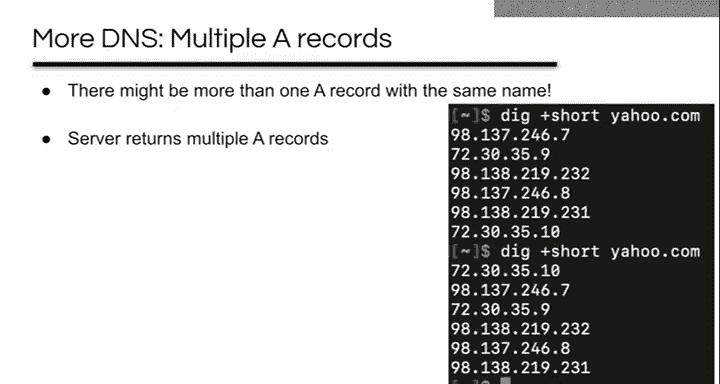

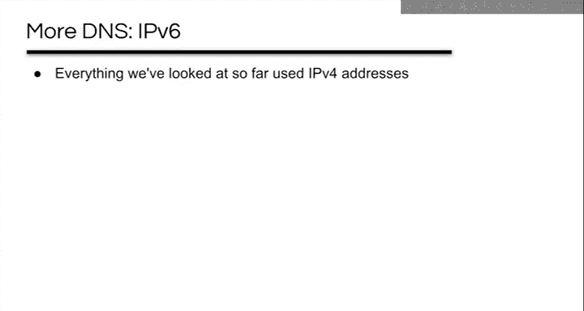

现在，让我们深入到协议层面，看看DNS查询和响应具体是如何进行的。

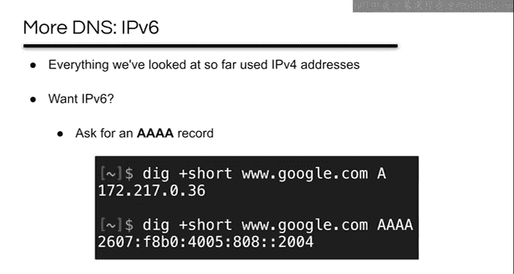

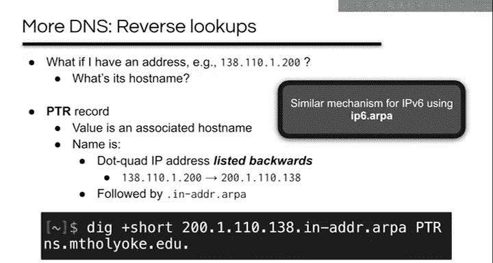

**协议基础**
DNS主要使用**UDP**协议，端口53。选择UDP是因为：
*   节省了TCP三次握手的往返时间。
*   无需为大量短期查询维护连接状态。
*   查询和响应通常很小，一个数据包即可容纳。
*   可靠性通过简单的超时重传机制处理。

DNS也使用**TCP**端口53，主要用于**区域传输**（在权威服务器间同步整个区域的数据），因为TCP为大数据量的可靠传输提供了保障。

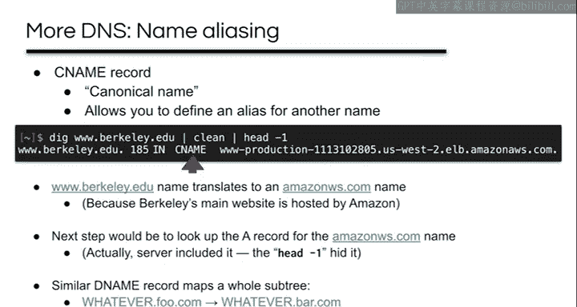

**资源记录**
DNS存储和传输的数据单元称为**资源记录**。它是一个包含多个字段的元组，核心字段包括：
*   **类型**：记录的类型，如 `A`、`NS`、`CNAME` 等。
*   **名称**：该记录关联的域名。
*   **值**：记录的具体内容，如IP地址或别名。
*   **TTL**：生存时间，指示该记录可被缓存多久（秒）。

**核心记录类型**
*   **A记录**：将主机名映射到IPv4地址。这是DNS最核心的功能。
    *公式*：`主机名 -> IPv4地址`
*   **NS记录**：指定负责某个域或子域的权威域名服务器。
    *公式*：`域名 -> 权威DNS服务器主机名`

**查询示例**
以查询 `ischool.berkeley.edu` 的A记录为例：
1.  向根服务器查询，根服务器返回 `.edu` TLD服务器的NS记录及其A记录（附加记录）。
2.  向 `.edu` TLD服务器查询，它返回 `berkeley.edu` 权威服务器的NS记录及其A记录。
3.  向 `berkeley.edu` 权威服务器查询，它返回 `ischool.berkeley.edu` 的A记录及TTL值。

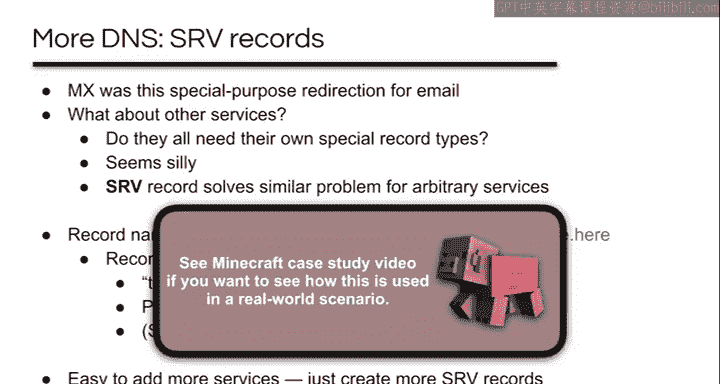

---

## 域名的创建

最后，我们了解一下一个域名（如 `example.com`）是如何诞生的。

以下是创建流程：
1.  **获取IP地址**：从ISP处获得一个IP地址块（如 `192.0.2.0/25`）。
2.  **注册域名**：通过ICANN授权的**注册商**（如GoDaddy）注册 `example.com`，每年支付约15美元费用。
3.  **设置权威服务器**：运行至少两台权威DNS服务器（或使用注册商/托管商提供的服务）。
4.  **告知注册商**：将你的权威DNS服务器的主机名和IP地址提供给注册商。
5.  **注册商更新TLD**：注册商在 `.com` TLD服务器的区域文件中，为 `example.com` 插入指向你的权威服务器的NS记录和A记录。
6.  **配置资源记录**：在你自己的权威DNS服务器上，添加所需的资源记录，如 `www.example.com` 的A记录。

如果想要自己的顶级域（如 `.cs168`），则需要直接向ICANN申请，费用高昂（约18.5万美元）。

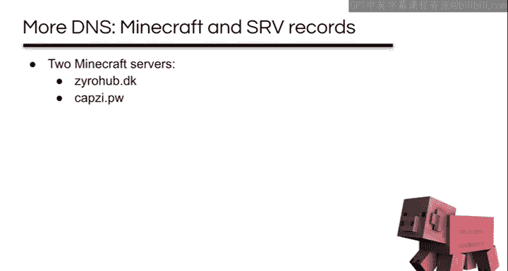

---

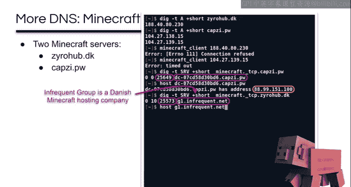

## 总结

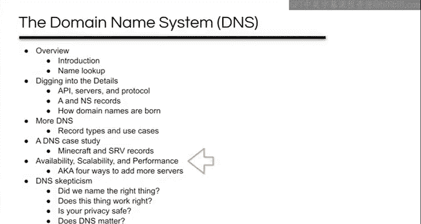

本节课中，我们一起学习了域名系统（DNS）的基础知识。我们从DNS产生的历史原因和设计目标出发，理解了它通过名称、权限和基础设施三个层次结构来解决可扩展性与分布式管理问题。我们详细剖析了域名迭代解析的全过程，以及递归解析服务器在其中扮演的角色。我们还探讨了DNS基于UDP的协议设计、核心的资源记录格式，并了解了A记录和NS记录如何协同工作完成地址解析。最后，我们梳理了一个新域名从注册到生效的完整流程。DNS作为互联网的“电话簿”，其高效、可靠的运行是互联网得以顺畅使用的基础。在接下来的课程中，我们将探索DNS更多样化的用途和记录类型。