# 21：Web

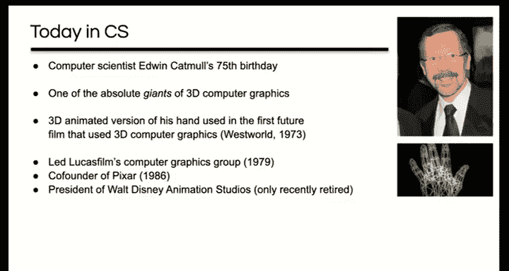

## 概述
在本节课中，我们将学习万维网（Web）的基础知识。我们将从Web的诞生背景和核心思想开始，逐步深入到其关键技术组件，包括HTML、URL、HTTP协议以及浏览器。随后，我们将探讨如何通过缓存、内容分发网络（CDN）和TCP优化来提升Web的可用性、可扩展性和性能。最后，我们将对所学内容进行总结。

---

## Web的诞生与核心思想

上一节我们介绍了DNS，它为用户提供了基于名称而非地址的网络交互方式。本节中，我们来看看万维网，它真正成为了互联网的“面孔”，并彻底改变了世界。

万维网的成功源于其设计理念。它并非试图强制规定数据的结构或存储方式，也不依赖于特定的计算机或数据库系统。相反，它提供了一个非常抽象的模型：由链接（超链接）连接的节点（内容）。这种抽象性使得Web能够构建图书馆、银行、商店等各种应用。

Web是去中心化的，这意味着任何人都可以通过购买或租用服务器和互联网连接，将自己的内容或服务添加到Web上。它让我们能够快速浏览来自不同来源的所有内容和服务，并可以即时组织和重组它们。

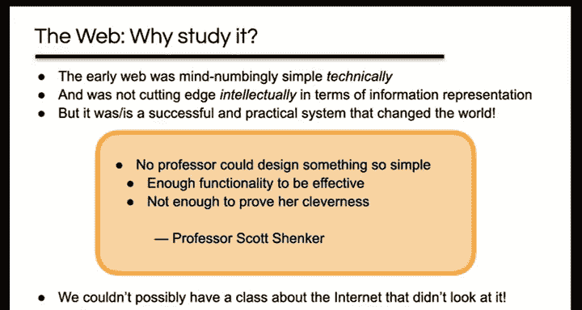

## Web的基础组件

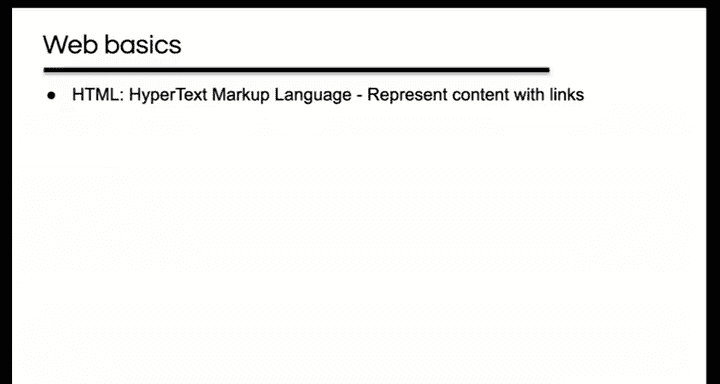

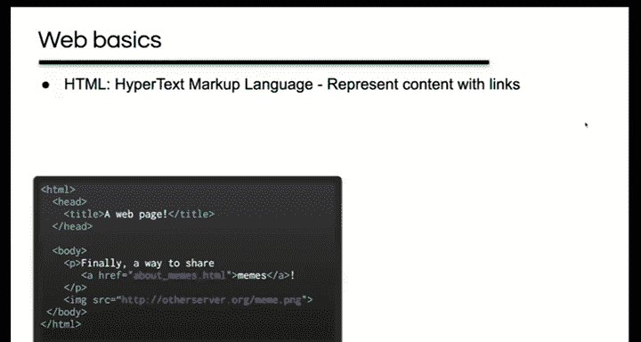

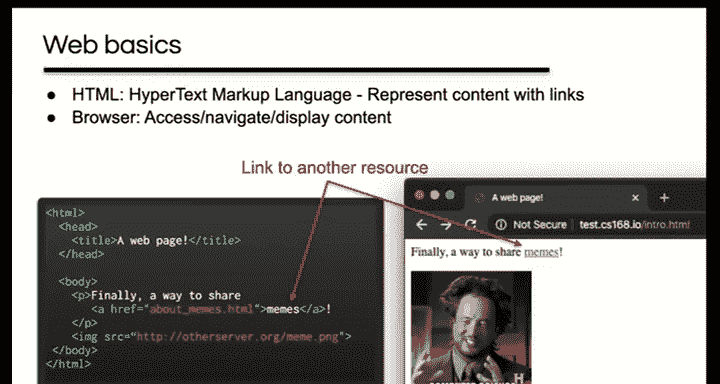

了解了Web的核心理念后，我们来看看构成它的具体技术组件。一个完整的Web系统需要满足几个基本要求。

以下是构成Web的核心技术：
1.  **HTML（超文本标记语言）**：用于表示包含链接的内容。
    ```html
    <html>
      <body>
        <h1>欢迎</h1>
        <p>这是一个<a href="https://example.com">链接</a>。</p>
      </body>
    </html>
    ```
2.  **Web浏览器**：用于访问、导航和显示内容的客户端程序。
3.  **URL（统一资源定位符）**：用于引用内容，是链接或嵌入其他内容的方式。
4.  **Web服务器**：用于托管内容。
5.  **HTTP（超文本传输协议）**：用于从服务器获取内容到客户端的协议，本质上是将URL转换为TCP连接的方式。

URL的通用格式为：`<协议>://<主机名>[:端口]/<路径>[?查询][#片段]`。例如，`https://www.example.com:443/path/to/page.html?search=term#section`。

## HTTP协议详解

我们已经了解了Web的各个组成部分是如何协同工作的。现在，我们将重点深入探讨其中的关键协议：HTTP。

HTTP采用客户端-服务器架构。客户端使用TCP连接到服务器的知名端口（通常是80端口）。客户端发出请求，服务器返回响应。该协议本身是无状态的。

一个基本的HTTP交换流程如下：
1.  客户端在端口80上发起TCP连接。
2.  客户端发送一个HTTP请求。
3.  服务器发送一个HTTP响应。
4.  客户端确认收到响应。
5.  服务器关闭连接。

### HTTP请求与响应
HTTP请求和响应都是纯文本、人类可读的，行之间由CRLF（回车换行）分隔。

一个典型的HTTP **GET** 请求如下：
```
GET /about.html HTTP/1.1
Host: www.example.com
User-Agent: Mozilla/5.0
Accept: text/html
```
*   **请求行**：包含方法（如GET）、资源路径和协议版本。
*   **请求头**：提供额外信息或修改请求。
*   **空行**：分隔头部和可选的正文。
*   **正文**：用于提交数据（如POST请求的表单内容）。

对应的HTTP响应如下：
```
HTTP/1.1 200 OK
Date: Mon, 23 May 2022 22:38:34 GMT
Server: Apache
Content-Type: text/html; charset=UTF-8
Content-Length: 138

<html>
<body>
<h1>关于我们</h1>
</body>
</html>
```
*   **状态行**：包含协议版本、状态码（如200表示成功）和原因短语。
*   **响应头**：提供关于响应的额外信息。
*   **空行**：分隔头部和正文。
*   **正文**：包含请求的资源内容（如HTML文档）。

常见的HTTP方法包括：
*   **GET**：获取资源。
*   **POST**：向服务器提交数据。
*   **HEAD**：类似于GET，但只返回头部，不返回正文。

常见的状态码类别包括：
*   **2xx**：成功（如200 OK）。
*   **3xx**：重定向（如304 Not Modified，用于缓存验证）。
*   **4xx**：客户端错误（如404 Not Found）。
*   **5xx**：服务器错误（如500 Internal Server Error）。

## 提升Web性能：缓存、CDN与TCP优化

掌握了HTTP的基础后，我们从用户和内容提供者的角度来思考：我们需要Web快速且高度可用。这与我们在DNS课程中讨论的目标非常相似。我们将使用类似的思想——复制和缓存——来解决这些问题，并同时解决一些TCP相关的问题。

### Web缓存
缓存之所以有效，主要是基于**时间局部性**原理：如果访问了一个资源，很可能很快会再次访问它。

HTTP通过请求和响应中的头部字段来实现缓存控制。关键的头部包括：
*   **Cache-Control: max-age=<秒数>** （HTTP/1.1）：指定资源可以被缓存多长时间（生存时间，TTL）。
*   **Expires: <日期>** （HTTP/1.0）：指定资源的绝对过期时间。
*   **Cache-Control: no-cache**：客户端使用此头部表示希望跳过缓存，直接向源服务器请求。
*   **If-Modified-Since: <日期>**：客户端在缓存资源过期后，使用此头部向服务器询问资源是否已修改。如果未修改，服务器返回 **304 Not Modified** 状态码，从而节省带宽。

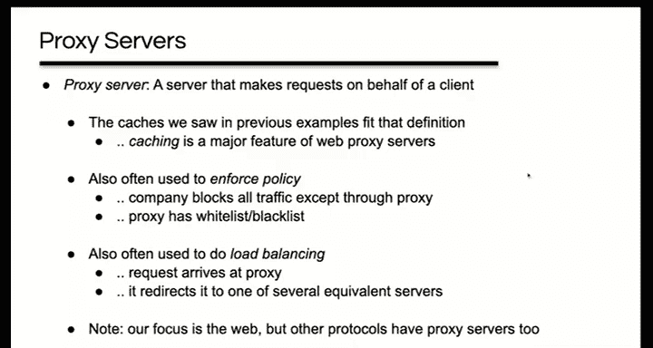

缓存可以位于多个位置：
1.  **浏览器缓存**：每个浏览器都有自己的本地缓存。
2.  **代理服务器缓存**：
    *   **正向代理**：位于客户端附近（如企业或ISP网络），为多个客户端服务，减少网络流量和延迟。
    *   **反向代理**：位于服务器附近，减轻源服务器的负载。

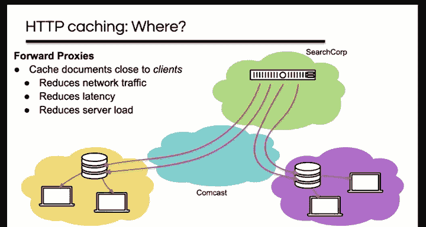

### 内容分发网络
如果内容提供者希望确保其内容始终被复制并靠近客户端，可以使用**内容分发网络**。CDN是一个大型分布式存储基础设施。

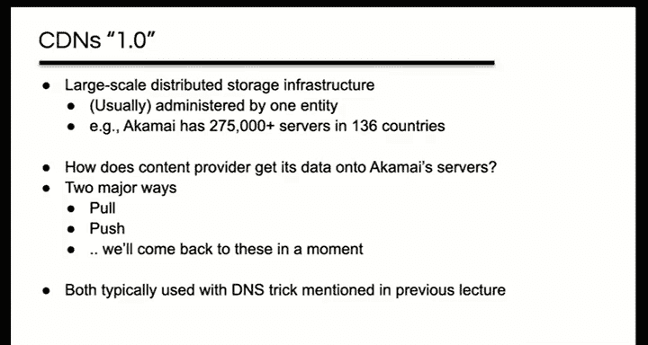

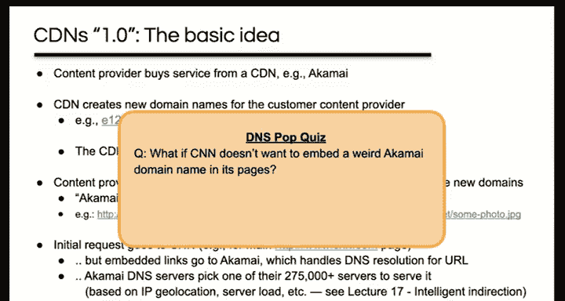

CDN的工作原理通常涉及DNS技巧：
1.  内容提供者（如CNN）购买CDN服务。
2.  CDN为客户的资源创建新的域名（如 `e12596.dscj.akamaiedge.net`）。
3.  内容提供者将其网页中的资源URL“重写”为CDN的域名。
4.  当客户端请求这些资源时，DNS查询会将客户端引导至CDN网络中离它最近、负载最轻的服务器。

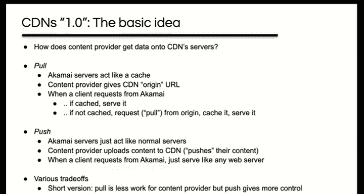

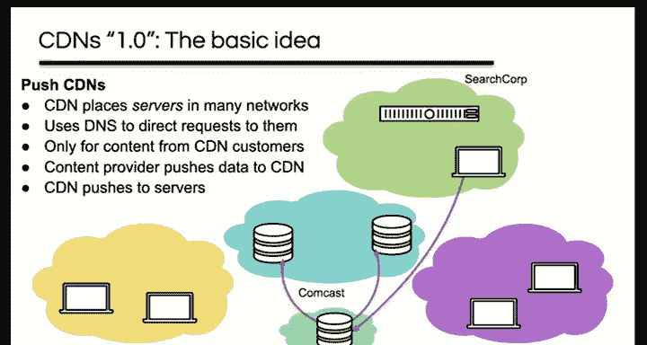

内容进入CDN的方式有两种：
*   **拉取**：CDN服务器像缓存一样工作，在未命中时从源服务器拉取内容。
*   **推送**：内容提供者主动将内容上传到CDN，由CDN分发到其所有服务器。

### HTTP与TCP的交互优化
许多网页由多个小对象（如图片、CSS、JS）组成。如果为每个小对象单独建立TCP连接，由于往返时间（RTT）占主导，性能会非常差。

以下是几种优化策略：
1.  **并发连接**：浏览器同时打开多个TCP连接（例如6个）来并行下载对象。
2.  **持久连接**：在同一个TCP连接上发送多个HTTP请求/响应，避免为每个对象重新建立连接。这可以将下载N个小对象的时间从 `2N` 个RTT减少到 `N+1` 个RTT。
3.  **管道化**：在持久连接的基础上，不等待响应就连续发送多个请求。理论上这可以将时间减少到2个RTT（建立连接+所有请求/响应）。但由于实现复杂和**队头阻塞**问题（一个慢请求会阻塞同一连接上的后续请求），实践中已被弃用。
4.  **多路复用**：HTTP/2引入的技术，在单个连接内创建多个“流”，有效解决了队头阻塞问题，是当前的主流优化方式。

**公式：估算下载时间**
假设下载 `N` 个小对象，每个对象的传输时间可忽略，主要耗时是RTT。
*   非持久连接：`时间 ≈ 2N × RTT`
*   持久连接：`时间 ≈ (N + 1) × RTT`
*   `K` 个并发持久连接：`时间 ≈ (N/K + 1) × RTT`

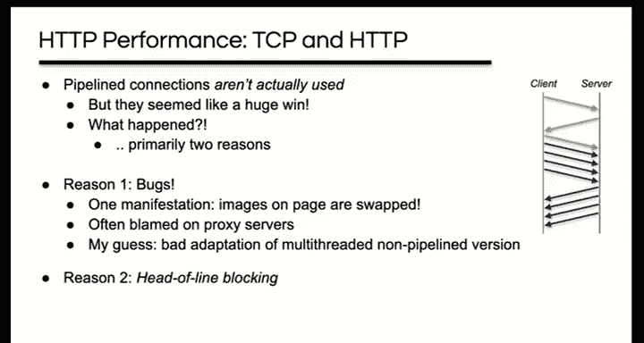

## 总结
本节课中，我们一起学习了万维网的核心架构。我们从Tim Berners-Lee解决CERN信息管理问题的初衷开始，理解了Web去中心化、抽象链接模型的设计哲学。我们剖析了Web的基础组件：用HTML表示内容，用URL定位资源，用HTTP协议在客户端和服务器之间传输数据，并由浏览器呈现给用户。

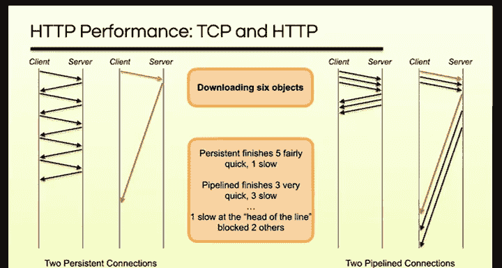

随后，我们深入探讨了如何保证Web的可用性、可扩展性和性能。我们学习了缓存机制如何利用时间局部性提升效率，包括浏览器缓存和代理缓存。我们介绍了内容分发网络（CDN）如何通过全球分布的服务器和智能DNS将内容推送到用户附近。最后，我们分析了HTTP与TCP的交互，以及如何通过并发连接、持久连接和多路复用来克服由小对象和RTT导致的性能瓶颈。


万维网的成功在于其简单的核心思想与强大的可扩展性相结合，使其成为了塑造现代世界的基石应用。