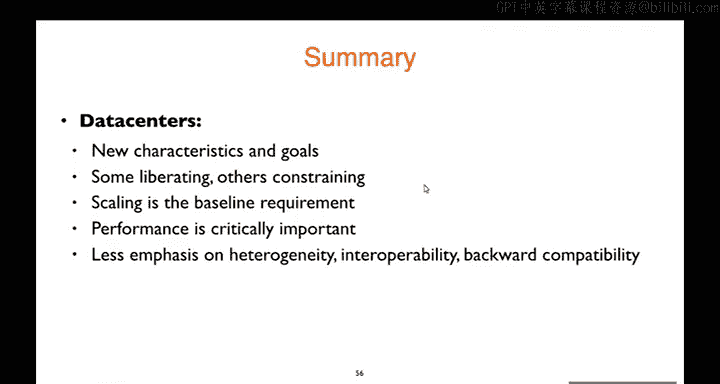

# 25：数据中心

## 概述
在本节课中，我们将要学习数据中心网络。我们将探讨数据中心网络与传统互联网网络有何不同，重点关注其独特的设计目标、拓扑结构、路由寻址以及拥塞控制方法。我们将看到，由于数据中心具有单一管理控制、规模庞大且对性能要求极高的特点，其网络设计采用了全新的思路。

---

## 数据中心网络的独特之处

上一节我们介绍了课程的基本信息，本节中我们来看看数据中心网络与之前讨论的互联网网络有何根本区别。数据中心网络具有几个关键特征，这些特征深刻影响了其设计。

以下是数据中心网络的主要不同点：

1.  **单一地点的庞大规模**：现代超大规模数据中心可以在一个物理位置容纳数十万甚至上百万台服务器。这种在一个地点内连接如此多端点的规模是独一无二的。
2.  **单一组织管理**：整个数据中心网络由一个组织控制。这意味着可以实现集中策略和控制，并且网络运营商同时控制网络和（大部分）终端主机。例如，可以控制网卡、操作系统，甚至自定义TCP协议栈。此外，还能控制流量源和目的地的放置位置。
3.  **异构性大大降低**：与互联网中设备类型、技术、往返时间差异巨大不同，数据中心内部主要是服务器，且通常是当前或上一代型号。链路技术（如以太网）和往返时间也相对统一且有界。
4.  **对性能的极致追求**：在互联网设计初期，性能并非首要目标。但在数据中心，最小化延迟、最大化吞吐量至关重要，这直接关系到服务商的竞争力和用户体验。

---

## 数据中心网络拓扑：追求高二分带宽

了解了设计背景后，本节我们来看看如何构建数据中心网络的基础设施。核心目标是支持服务器间（东西向）的海量流量，并实现**高二分带宽**。

**二分带宽**的定义是：将网络中的所有节点划分为两个数量相等的集合，需要切断的**最小割集**中所有链路的带宽总和。**全二分带宽**意味着，划分后两个集合中的所有节点可以同时以各自接入链路的全速相互通信。

为了实现高二分带宽，我们考虑几种拓扑方案：

*   **巨型交换机方案**：将所有服务器连接到一个巨型交换机。这不可行，因为需要交换机端口数等于服务器数量，且交换容量需达到 petabits 级别，这超出了当前技术能力，且成本极高。
*   **树形网络**：构建交换机层级树。如果所有链路容量相同，顶层的链路会成为瓶颈，无法实现高二分带宽。
*   **胖树网络**：树形网络的改进版，越靠近树根的链路容量（带宽）越大。逻辑上，如果顶层链路足够“胖”，就能实现全二分带宽。但问题在于，构建这些超高速的“胖”链路本身非常昂贵且非标准化（非“商品化”）。
*   **Clos网络（折叠Clos网络）**：这是目前的主流方案。它使用大量**相同端口数、相同链路速率**的小型、廉价（商品化）交换机，通过规则的互连方式，构建出一个大规模、高容量的交换网络。这种拓扑天然提供了多条并行路径，能够实现高二分带宽，并且具有容错能力。

**Clos网络**本质上是一种**横向扩展**设计：通过增加更多廉价组件来获得更高能力，而非纵向升级单个组件（纵向扩展）。这种思想贯穿于数据中心和云计算的软硬件设计。

---

## 路由与寻址：利用并行路径

我们有了提供高带宽的物理拓扑（Clos网络）后，本节中我们来看看如何设计上层的路由和寻址机制，以充分利用这些并行路径。我们探讨两种设计思路。

### 增量式方案：等成本多路径路由（ECMP）

一种方法是在传统距离矢量或链路状态路由协议上进行扩展。

*   **路由发现**：修改协议，使其记录到达目的地的**所有**等成本下一跳，而不仅仅是选择一个。
*   **流量分发**：在转发时，需要将流量分散到这些下一跳上。**基于数据包的负载均衡**可能导致同一TCP流的包乱序，严重干扰TCP性能。因此，通常采用**基于流的负载均衡**：使用数据包五元组（源/目的IP、端口、协议）的哈希值，为每个流选择一个固定的下一跳。这样，同一流的所有包走同一路径，不同流则被分散到不同路径上。

这种方法可行，但面对数据中心内数十万个目的地的规模，动态路由协议的可扩展性面临挑战。

### 革新式方案：基于位置的寻址

由于数据中心拓扑规则且已知，我们可以采用更激进、更可扩展的方案：**基于位置的寻址**。

*   **核心思想**：为服务器分配的IP地址直接编码了其在Clos拓扑中的精确位置。例如，地址 `10.2.0.1` 可能表示“第2个Pod，第0个机架，第1台服务器”。
*   **路由表生成**：因为网络设计者知道拓扑结构和地址分配规则，所以可以**直接计算**出每个交换机上应该有哪些路由表项，而无需运行动态路由协议。每个交换机的路由表项数量仅与其端口数相关，与服务器总数无关，实现了完美的路由聚合。
*   **优势**：极其可扩展，利用了所有路径，且负载均衡效果好。这体现了在单一控制下进行“白板”设计的优势。

---

## 拥塞控制：应对排队延迟挑战

路由解决了路径问题，本节我们来看看数据传输过程中的另一个关键问题：拥塞控制。在数据中心，**排队延迟**成为端到端数据包延迟的主导因素。

**原因分析**：
1.  数据中心的**传播延迟**极低（约10微秒量级），因为服务器间物理距离很近。
2.  在10Gbps链路上，一个8000字节数据包的**传输延迟**约为0.8微秒。
3.  如果平均队列中有10个包，则在该跳的**排队延迟**为 10 * 0.8 = 8 微秒。
4.  经过多跳后，排队延迟累积（如5跳可达40微秒），可能远超传播延迟，成为总延迟的主要部分。

这对需要低延迟的短流（如数据库查询）影响巨大，而长流（如数据备份）则会填满队列。传统的TCP为了追求高吞吐量会主动填满缓冲区，加剧了这个问题。

以下是两种解决思路：

*   **增量式方案：DCTCP**
    DCTCP 是对TCP的改进，它更积极地利用**显式拥塞通知（ECN）**。交换机在队列开始增长（而非已满）时就标记数据包，发送端据此更迅速、更精细地降低发送速率，从而将队列长度维持在一个很低的水平。实验表明，DCTCP能显著降低流完成时间，尤其在高负载下优于传统TCP。

*   **革新式方案：pFabric**
    pFabric 提出了更根本性的改变。其核心思想是**基于优先级调度**。发送端根据剩余数据量（流大小）为数据包标记优先级：短流（小鼠）标记高优先级，长流（大象）标记低优先级。交换机始终优先发送高优先级包。这样，短流几乎不受排队影响，而长流利用剩余带宽。pFabric 的性能非常接近理想情况。

---

## 总结

本节课中我们一起学习了数据中心网络的设计。

*   **设计驱动力**：我们首先了解了数据中心网络在规模、控制权、异构性和性能目标上与互联网的根本区别。
*   **拓扑结构**：为了经济地实现高二分带宽，业界普遍采用基于商品化交换机的 **Clos网络** 拓扑，这是一种横向扩展的设计典范。
*   **路由寻址**：为了充分利用Clos网络提供的多路径，可以采用 **ECMP** 进行基于流的负载均衡，或者更激进地采用 **基于位置的寻址** 来简化路由、提升可扩展性。
*   **拥塞控制**：由于**排队延迟**在数据中心成为主要矛盾，传统的TCP不再适用。我们介绍了 **DCTCP** 和 **pFabric** 等方案，它们通过不同的机制（ECN或优先级调度）来大幅降低排队延迟，以满足数据中心应用对低延迟和高吞吐量的双重需求。

数据中心网络是集中控制、规模化和性能优化思想的集中体现，展示了在网络条件可控的情况下，如何重新设计网络协议栈以获得极致性能。