# UCB《软件工程｜UCB CS169 software engineering 2019》中英字幕deepseek p05 5 CS169 5.zh_en -BV1UsB7YPEMj_p5-

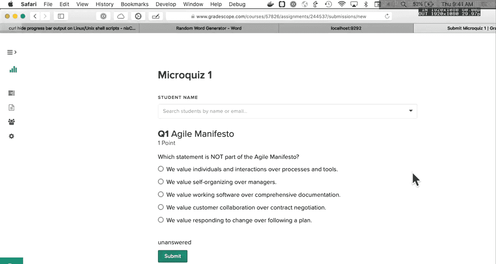

Testing one， two， testing。All right，For the first 10 or 15 minutes today， microquiz。

 it should only take you five to10 minutes， it is three multiple choice questions。

 you can just go directly to gradecope it is called microcroquiz1。

 you can also get to the link on GrScope through B courses。

 but all you need to do for each question is read it。

 do make sure you read the options and then select the correct answer。

And remember that like the goal is to get these correct， obviously。

 to show that you're learning things。 But by and large， you know， we're not。

 we're looking more for participation than correctness on microquizzes。 but you know， you should be。

 you should be trying to get them correct And as long as you get， you know。

Half or so of the microquiz questions correct through the semester you will get full points for the microquiz option it's not really you know like you can basically tap out on your microquiz points and there's basically a way you know there'll be half a dozen or so of these throughout the semester。

Hello， so go ahead， take that on grade scopepe。And then you can resubmit after each question if you need to。

 it's not going to show you the correct answers， I should actually double check that right now。

Well I'll do it later， but it shouldn't show you the correct answers。You know， just。

Take about 10 minutes for that。Sorry。Okay。Yeah， if you have wF， it should hopefully work。But yeah。

 you should。We'll give people like a full 10 minutes。We can just kind of count that as starting now。

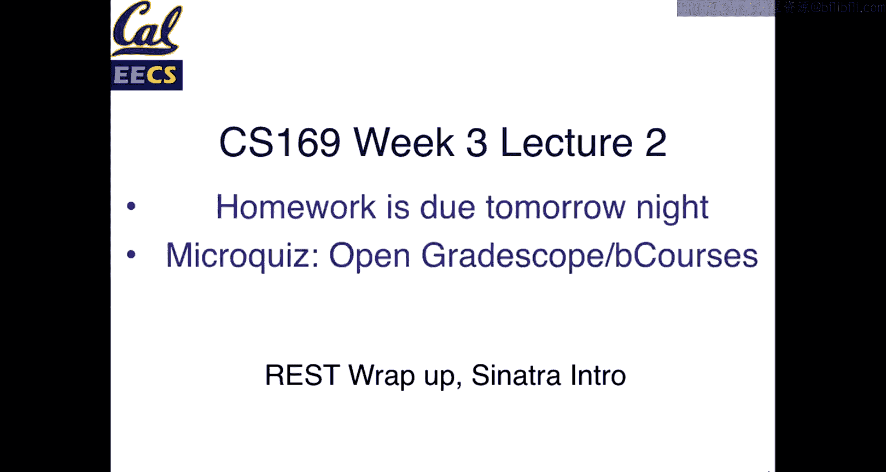

Actually， that's really quick。

Oh， talking while people are still taking the quiz。Let's see。응。Yeahこ。I'll like go back。嗯。嗯。Okay。

 let me， let me do something right quick。Try refreshing great scope。okay케。That see。嗯。

So the quiz will close in about 90 seconds， so if you haven't submitted something。

 you can tap and change your answers until then， but you。

Guesing is better than no submission as well if you're still reading through， but yeah。

 we'll get started in about 90 seconds or so。That's an extra question， too。sorryrry， yeah。

 don't worry about。Yeah啊。嗯 right。Yeah， that'll be remote。Yes， so it won't affect anything。

 and since the quiz is closed， there was the text unanswered that somehow got left over from pasting these in。

 but that won't affect any of your actual answers。 so don't worry about that we'll talk about this for a few minutes on Tuesday。

 but。Yeah， so far， the both mean and median score was 2 out of three， which is pretty good。

 There were a couple little tricky things in there， which is to be expected， but nothing。You know。

Nothing surprising there。 So don't worry about the microquiz。

 There's sort of a sense of just what types of things， readings， lectures， you know。

 all that stuff is what was on there。 Let's see。 how are we cool。 Now it's back up and。

Get out of my way。 There we go。 So again， as long as you're completing most of them， you know。

 if you get two out of three， then that is， you know。

 the equivalent of the points that we're sort of hoping that you'll get。

 So don't stress about it too much。 We'll do these。 not quite once a week， but， you know。

 somewhere around that frequency。 So today is gonna to be a little bit of wrapping up rest。

 we're gonna demo Sinatra， which is a very light ruby web framework。

And then in there we'll have a little bit about just some debugging and getting help online。Oh， no。

 that's not what I wanted I clicker。 So rest at the end of last lecture， we got into the basics of。

 we have， you know， a bunch of different HP methods or verbs。 So get， put， post， you know。

 delete those kinds of things so。You know， as we said。

 get is the HP method that you should use when you are literally just trying to get some data。

 So I have a request。 I want a response。 I'm trying to read something from you know。

 from whatever service I'm using。 That is the R in crud。 So get and read correspond to each other。

 So the thing is oftentimes we'll need to update or create some data， right， So。

That doesn't necessarily make sense for the word get。

 So one one of the things that is commonly used is verb post。

 So post typically means I'm going to send you some data， and I expect it to create a new resource。

 So this could be a new movie in a database。 This could be a new student at a school。

 this could be know a new course whatever new thing that you have。

 post is typically the verb that you use for there。

 And along with the post there is something special about post request and then also we'll talk about put and patch。

 but it typically includes a body。 So a body is some data that gets passed along with that says here is the more additional information that the server should operate on。

 So in this case， we're creating a new movie entry in a movie database。 It has some title a rating。

 again， these parameters or whatever makes sense for know that particular service。😊，But you know。

If we want to be able to identify a movie by something useful， you know， it needs some。

 some information， so。Then we also might want to change something about our information in the database right。

 you know， you might update a student's name， you might regrade an exam， you know。

 the release date might be pushed back or forward or something like that。

 So one of the common methods is patch put is also common don't worry about the distinction between them for the most part。

 you can think of them as。Nearly identical in usage。

 the HP spec will specify minor distinctions about what should happen。

 But for the purpose of this course， post creates things， put and patch。

 update things and then delete， as one would hope， deletes things but know the nice thing here is with patch。

 this will depend on whatever your API is。 but notice that we're only updating one bit of information So in this case。

 we're just changing the release date， most APIs when you update something are pretty good about saying。

 you， only send me the relevant bits of information so that I know what to change and there's no necessarily redundant information here。

 So know， when you update something， now the distinction is that。

We're gonna change the release data in this movie。 How do we tell the server what movie we want to update。

 There is this Id here。 And so， you know， when when you update a resource。

 you are identifying a specific thing， sending only the relevant bits。

 And this all sort of depends on， the specifics depend on what the API is asking you for。

 But that's really the gist there。 So things other than crud。 So create， read， update。

 delete an index， What happens when you have something that is。You know， doesn't necessarily fit in。

In an ideal sense of what you know about the API。 So if we have a movie database。

 what if I want to add a movie to my watch list， Well I'm not creating a movie， I might be。

Updating a watch list， you know， you could think of it something like that。 but you know the。

The thing here is to about like what we want to have happen is for every single type of operation or entity that we could express on our database。

 there's a single set of operations so if you have a student service with a roster you know how do you add a student to a course one thing that you might do is you might have a model or an entity that is a course membership or a course enrollment for a watch list you might have a watch list entity。

 and so when you do that if you ever have an operation that sort of combines two pieces of information that usually is a suggestion that you might want to have a single endpoint that says you know update this watch list or create a watch to movievie maybe you could call it something like that。

 we will get into more examples of this， especially when you start working on the rotten potato？App。

 which is like rotten tomatoes， but you'll look at what it means to have relationships in your application that operate on multiple different models。

You know， sometimes this will be in the perfect view will be sort of changing if you you how your application might work。

 but in general， you know it's sort of finding the best representation for the job。

 So the thing here is that if we're talking about things like good API design。

 what does it mean to be restful， this is probably the hardest part of what it means to be restful。

 a lot of stuff， you know we talked about versions Well。

 there's a few different ways to specify version in your API， you should do it。

 but you know you pick one of those methods and it's gonna to solve your problem。

 hopefully you use you know a sensible numbering scheme for versions and not random words。

 please don't version your API as red， yellow green blue that would be confusing although nothing would stop you from doing so。

 but the hard part here is， you know what is a good API design。

 should I have a course enrollment service， should this be a post to。

Course enrollment should it be you know？Some other name。

 how should I entangle these two different ideas， how can I decompose them？the idea here is that。

As as you're working on an API is try and think about what makes the most sense of splitting things up。

 you know can we get it so that each entity has a set of。

 you know these five basic operations and so if we create a course membership you know that is enrolling someone in this course。

 if we create you know a new exam then that belongs to some exams you know entity， but。You know。

 the actual specifics of the design are something that you really have to get a feel for as you go through doing this。

 So when you get to your projects， when we get working on the larger homework assignments。

 you will start to see some of this yourself， so。You know， again。

You the real question here that we're trying to answer is what is this primary resource and so if something is ever operating on two different pieces of data you know that sort of suggests that you might want to create a new resource that represents a combination of those two pieces of data so a word that you'll hear later in the semester is a join table which is a way of sort of linking to distinct entities in the database。

 so you know might that might be something that suggest。

 you know if you have memberships and courses you join them somehow into course memberships。You know。

 that would be one way of doing things。 And then remember， you know。

 what are the operations and side effects。 So， you know。

 this is basically just sort of the same bits of rest， so。For the clicker question。

 let's see if it gets started here。Which one of these API endpoints is？

Definitively something that you know would we would say you should not do for rest there are a lot of options here as to how you design your API。

 but one of these makes the least sense。And remember。

 the action here is adding a movie to our watch list， so assume that we have a watchlist model。

 we have some movies and we want to add a movie that already exists to our watch list。

 and we could assume also that you know our watch list also exists。H。Nice。

 the numbers keep going up each lecture so that is a good sign。And they are sort of leveling off。

 so I'm going to pause this。We have a pretty good distribution of results， so again。

 take about 30 seconds， talk amongst your neighbors。

 convince them that they are either right or should change their answer。

 and I'm going to start a new question here so once your partner has convinced you please re and then we'll talk about this again in about a minute or so。

てま。系佢个。は。有啊。Yeah。That my difference。Yeah。俾。おざいます。か。いましょう。All right， take about 30 more seconds or so。

And then we'll discuss。知嗰啲。Yeah。解啊呢。可以。系住上。系。Yeah。やる物です。ませ。All right， 15 or so more seconds。三分有。

Go ahead and vote。LetSee if we can get it close to 70。It's pretty close。One more。And all right。

 let's just go with it。Yep， so。In this case， B is the best answer。

 so a pretty good movement from the first question。Why。

 why is B the answer that might not make sense in this scenario。

 Does anyone want to take a good guess at why we don't want B right。

It's unclear what the request is asking for， it's like if you said like， oh yeah。

 you're adding this to your watch list right， it doesn't make sense to put it in like pose it as a get request。

Yeah， yeah， so。Yeah， its the key thing here is that you know we are adding something。

 so we are going to be modifying some entry in our database probably we are changing something about the state of our world。

 There are lots of ways to think about that， but。You know， are we are changing something。

 so we expect to you know。Do more than just get back a response。

 Our API will probably return some response， such as whether we are successful or not。

 but what we are really doing is saying we want to get more information or we want to change the information。

 not just receive some information here。 So you know the fact that this includes a movie I maybe our get API return specific things if we request a specific movie。

You know， that could happen，Between the rest of these。 so put slash watchlist ID slashmo ID。

 this would be a pretty annoying API format because unless your IDs are very specific。

 you you know like you might do put slash1 slash2 and that would be a pretty confusing API So it might not be the best idea but you could name your watchlist Is as watchlist one or something like that where your application could you distinguish between them but。

This would totally work put slash users。 if a watchlist belongs to a user， which it probably does。

 then this could make sense， but that's really up to you in terms of how you design the API you you could decide that watch list always belong to a user and you would nest them。

 you could say that even if a watch list belongs to a user as long as I somehow elsewhere in my application validate that the person making the API request has access to modify that watch list。

 It's okay。 so you have a lot of structure there if we were totally designing an API。

 you know a is nice and simple， it's a put， it specifies the watch list ID it specifies a movie I。

 it's clear what both of those Is are referring to and so。That would be， that would be the， you know。

 probably the nice and simple option， but all them would work。 Quetion on this。Any questions new？

And if you have a question just also feel free to shut it out。

 so this is really the gist of rest right here， which is everything is a resource so。You know。

 movies， courses， students， whatever you have in your application， everything is a resource。 and。

 you know， we have some basic operations that we might， you know， do to them。 So create read， update。

 delete list is the same as index。 an index is fundamentally just a list of things。 you know。

 wrestle APIpis are good at distinguishing between， you know what the resource is。

 what actions should happen if there are any side effects and then what parameters are are needed。

 And within there， there is a lot of freedom and leeway as to how you define those things， but。

You know that is the gist of basics as far as what the server returns。

 that is really you know up to the API and the needs of the application commonly that's JO。

 if you have you know an API first service or you're building a command line tool。

Stick to JON because it's easy， there are tools in rails and every other framework that make dealing with JSON easy。

 you know in specific scenarios， there are obviously going to be legitimate reasons to deviate from that and there may be a couple of your projects where you find a good reason not to do that but if you have a protocol that is meant to be consumed。

 modified by other applications， JSON is a great starting point but you know the human side of things。

 HTML is going to be the best because that's what the browser world display。

 but you have know again some options there you might build your HTML in some other way as well will'll talk about that a little bit later。

And again， rest is a great design practice because it when implemented well。

 it simplifies the distinctions around working with large and complex applications。

 It is easy to understand at a simple API call what should be happening and then because JSON is fairly human readable it looks。

 you know sort of like a dictionary or hash that we're familiar with。

 you know it works as a great default starting point。

 So that's you know this kind of summary with rest and then。In section。

 you hopefully got a little bit of experimenting with APIs and I'm just going to take like five to 10 minutes here and show you a couple things that you don't need to know for this course at all。

 but just sort of the thought process of some of the things that I would do if I were trying to learn an API what you know。

 I might experiment with and so on。 So I'm gonna to hop over here to a terminal。

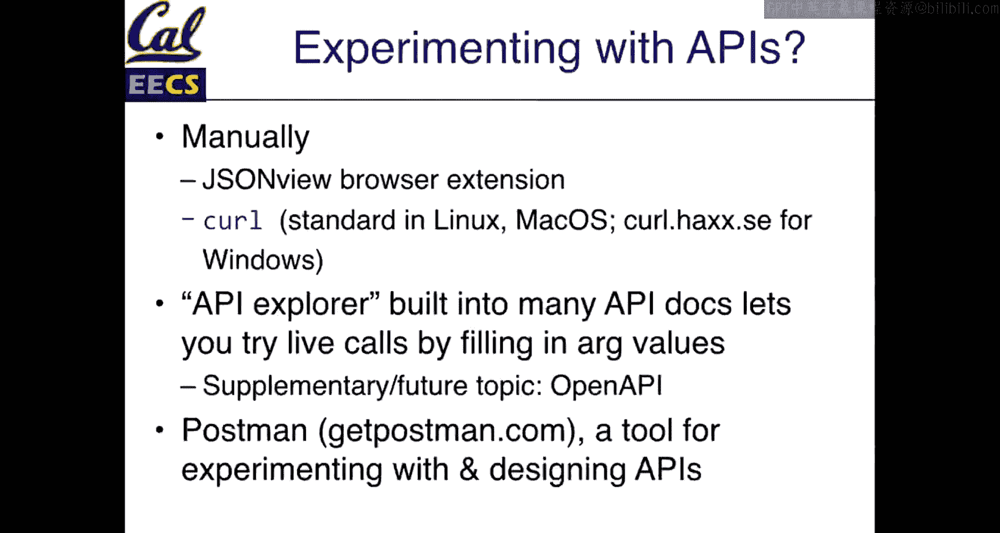

And let me just move things up。 cool So one of the things is we've been using， you know。

 the movie database API。 And again， if you have， you know。

 a query and some letters you might want to put that in single quotes。 So bash doesn't eat it。

 And I get back a bunch of Json。 So this is not， you know， super readable。

 I showed you in a browser where if I were to just。

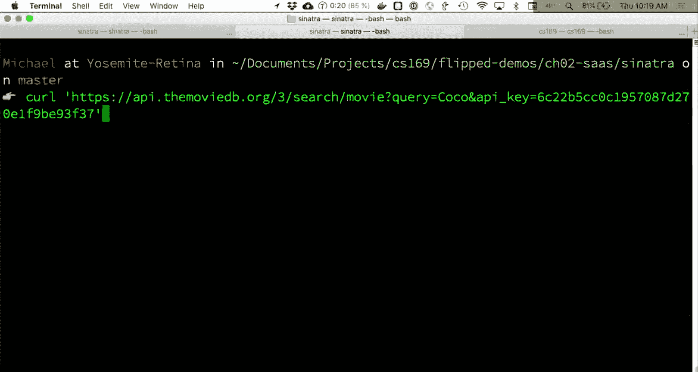

Copy。😔，诶。This URL。That was not great。嗯。Yeah。So one second me。So this is JSON in the browser。

 but it's also not readable the web inspector when we go over to resources will nicely format this for us so that's a helpful thing the other thing that I would encourage you to think about as you're working through things is what tools do I have available to me so if you're working a lot with JSON there is this really awesome tool called JQ JQ is a command line tool called JSON query I'm not expecting you to know this and you what I would say is I get JSON back in a terminal I'm doing curl。

 how do I nicely deal with this thing So if you start googling for that you might come across JQ and so the pipe operator just passes this output to the next command and I get back some nicely pretty printed JSON in the terminal so if nothing else JQ is useful for this。

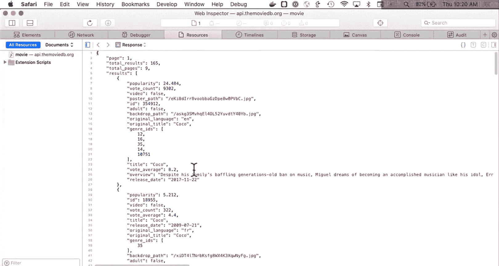

I can just quickly read through things it has a nice and annoying syntax for filtering stuff。

 but it is pretty powerful again， this is one of those things where like you probably will have to look it up if you use it。

😊，But you know， that's part of the thing。 And then just as a highlight。 So， you know。

 you might notice that when you start doing this， you see this output from curl and that sucks。

 So what do you do， You Google， you know， how to get curl to silence output。

 And this is the first post that comes up， which I linked a pretty similar post on piazza about different curl commands。

 But we get dash S。

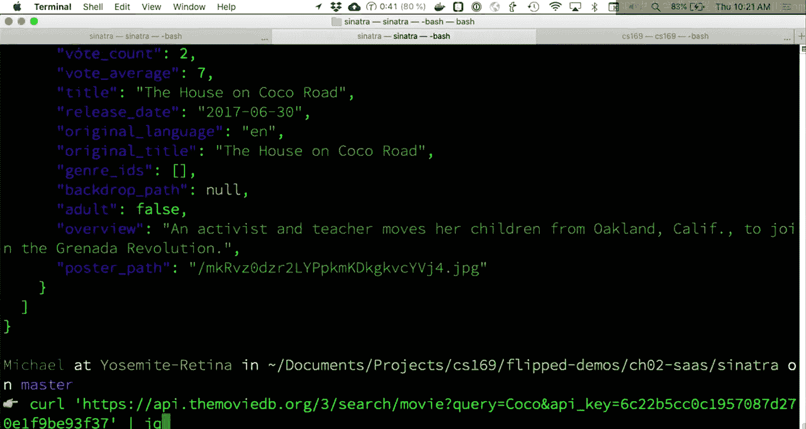

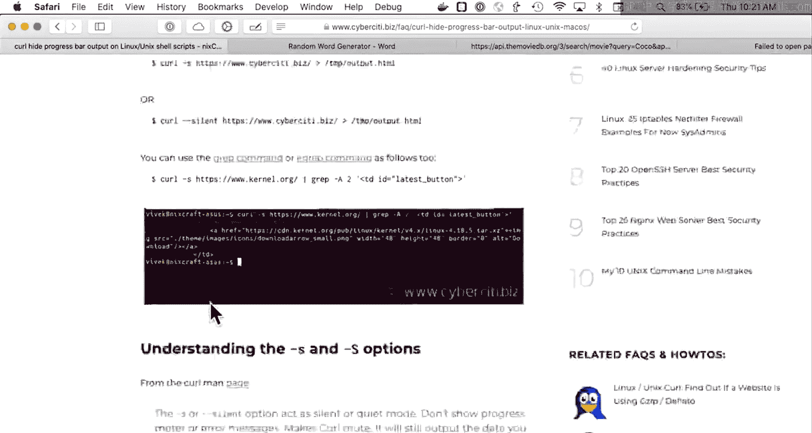

And， you know， that is the silent switch。 and we don't have any more noise。

 So just kind of keep that in mind as you're going through things。

 don't expect to memorize stuff all at once。But you know there are tools available and what is really handy is to you know sort of build up your tool repertoire piece by piece。

 So don't worry about the weird syntax of JQ but as a point of what tools are powerful at if you're more comfortable you could certainly write a Ruby or Python program that you know requires a JsonN library makes an HtTP request and balance the data but JQ has this cool stuff where dot tells me to reference an item in a results list so or in the sorry in the results object so dot results is this top level thing here the array tells me that this thing was an array and the title says I want the title of each item of the array and by doing this and again I will whoops。

I will， if I can type correctly。Add dash S just to clean up the output。

And what JQ will do is it give me just the titles back。 So， again。

 depending on what you're doing with APIs， you have a whole bunch of tools at your disposal。

 Postman is a great one， as well。Im certainly no one is ever gonna quiz you on the syntax because it is a little bit esoteric and annoying。

 and I frequently need to look it up。 But what is useful is that I know that I have this tool and I know that I can look up this tool。

 it's popular enough that there's a bunch of stack overflow posts with references and examples。

 so that's one thing and the second thing in terms of useful tools。

 So we should watch out for snakes a couple lectures ago， I refresh you know a random word。

 we showed how the API if I just use curl I can。

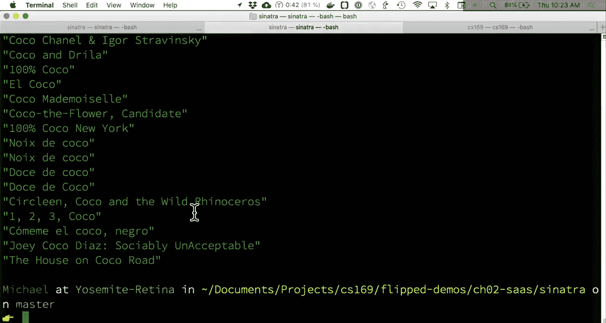

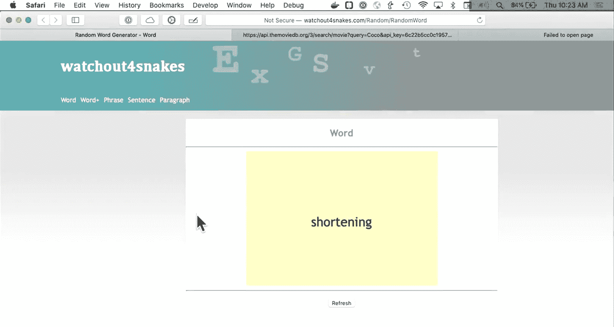

Do this。And I get back a bunch of HTML and that kind of sucks because no one wants to parse HTML。

 doing it properly is literally like a browser's job and Google and Apple all have dozens of engineers。

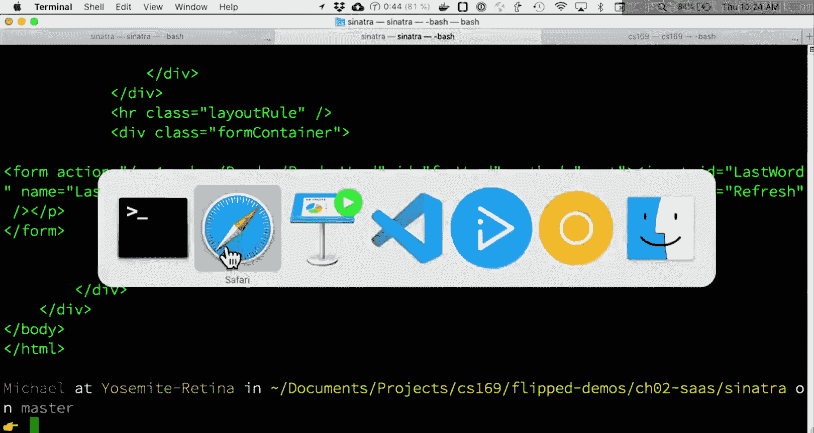

Doesn't make sense to replicate all their work。 But， you。

 what we can do in a web inspector is look at what's going on with Watch out for snakes。

 So there's a whole bunch of resources that this thing loads。

 one thing that I'm gonna to go to is the timeline view。

 And if I refresh my page with the Web inspector open。 It's going show me everything that's going on。

 And what I want to do is look at just the network requests。

 And why is the Internet being really slow。All rightSo it loads a bunch of stuff here。诶。

And it's being a little bit slow。Why it's being so slow now。呃Com on。Cool。

 so I'm just going to click refresh a bunch of times。 And so it's loading more words。

 And one thing that we'll see。咁晚啊。Why aren't you showing me here？Okay。New。Okay， why。Good job。

 computer， not what I wanted you to do。我。系。Okay， there we go。ok。

So we're going to refresh a bunch of words and reopen the inspector。

 And what we're looking for here are some things that。It's not actually showing me right now。

 which is fine。Okay， so I don't know why they weren't showing in the timeline view。

 Web inspectors are sometimes funny。 But one of the things that we see here is I clicked random word a bunch of times。

 And what， what we're looking for here is as we do things in our applications， as we use APIs。

 we're kind of gonna be， if you're trying to debug something。

 a lot of the things that you're gonna be do is pattern matching， so。

You'll see that I have the thing random word here a bunch of times。

And that's because I clicked random word a bunch of times。 So if I click on this。

 this resource that it loaded， I get， you know， the different random words that I got back from Mark out for snakeakes。

 And if I go through the inspector。 So I'm using Safari here， Chrome and Firefox are pretty similar。

 But what you see here is it shows me all the options that were sent with this request。 So。

What we'll be talking about in the next lecture is stuff like cookies， what what they're used for。

 how you can use them， it shows me a verb and a path。It shows me the full URL。

 some data about the server。And then again， I can also inspect the actual data that was sent。

 So the browser is a really handy resource for working with APIs。

The other thing is that's really cool here is you can right click so this works in Firefoxcom safari and I assume edge。

 although generally not best to assume things about edge。

 but I have this command that says copy as curl。 And so I do that it puts on my clipboard。

 and what I get back is a very large Ch request。 but what this is doing it is mimicking exactly everything that's happened in my browser。

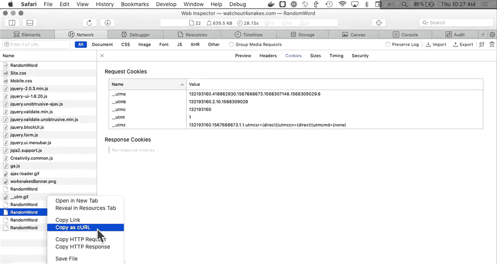

And so the nice thing is this tells curl that I'm going to be posting data。

 it sends all the same headers that my browser requests。 It even updates this user agent string。

 so I came from Safari， so it lets the API know that this request should look like it's coming from Safari。

Most of the time that probably won't matter， but， you know， maybe your API does something different。

 what I wanted to do。 And so I'm gonna hit enter， and I get back a single word again。

 And so the watchout for snakes API it doesn't require all these headers。

 but it does require some random subset that I'm actually not sure what the exact subset is。

 when I was just playing with it the other night， but。

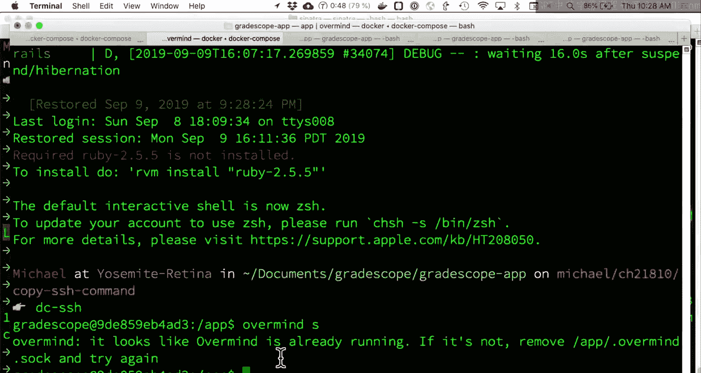

Nice thing is with curl with your browser tools， you can go through and inspect these things。 And。

 of course， if you really want to do figure out exactly what the API needs。

 you now have a successful request and you can work backwards。

 So sometimes working backwards through problems is going to be your best tool。

 But just kind of a reminder that， as you're going through debugging， developing apps。

 you have a bunch of tools here， that。😊，You know， some of them will be new。

 some of them will be things you've used before。 but， you know。

 just keep that in mind as you go through。 And then again， don't try and learn all the tools at once。

 I certainly， you know， did not like start off and say， you know， I have a problem。

 Let me find 50 tools。 add them one by one as you go through this course。 You know。

 you've been using curl。You'll get some experience with the browser inspectors this semester。

 you're also winning Ruby。The point is not to memorize these things。

 but that you have the option there。Questions on things so far， rest， APIs。

 stuff like that before we move along。No。So we're going to go through this very。

 very briefly just so that you know we you have everything that you need to get started on the next few homework assignments but。

You HTML and CSS are the presentation layer of the web so you know that document we got back from Workout for Sakes was an HTML document。

 The browser knows how to present that document so you know we're not going to walk you through all this you know but we're just going to give you a bunch of concepts that you need to know and again。

 design is tricky if you want to you know classes in design， there's a bunch of them。

 depending on the topic of the semester， CS160 will give you some good experience。

 but you know there's really plenty of excellent decals that are there so if you haven't seen HTML besides what we've shown in this class。

Html is really a markup language。 It specifies some content and some description about what that content represents。

 which kind of includes how it should be displayed。

 but not necessarily you know a strict way to style it。 CS will be the way that you style things。

 So CSS stands for cascading style sheets And the reason is that CS lets you style HTMLl in sort of an approach that uses the tree that an HTMLl document is to you know。

 structure your styling so that things can inherit in a way from other things。

 So CS uses Is in classes to target things。 And then if you haven't used it before bootstrap is a great frontend CS framework that。

Gives you a really good set of basic styling that we would recommend using for your applications as a starting point because you know without CSS。

 the web is pretty barren。 you know， it's functional。 It definitely works。

 but Boottrap is a really good starting point， it gives you the basics。 And then if you want to。

 you can spend time customizing it， but that's really up to you。

 And the point of this course again is not necessarily flashy web applications。

 but the process and they set up behind them so。This is an HTML document you can see that it has a set of tags that are in red and those tags correspond to sections of this result。

 so H's mean headers， Ps mean paragraphs， this UL stands for unordered list。

 which if it were an ordered list or OL， these resulting items would be numbered but again the specifics are not necessarily the goal of this course you know LI corresponds list item。

As you're going through building your applications。

 you will be using HTML either directly or using tools within your rails applications that help you generate HTML so that you don't have to do。

All the work of generating every single tag yourself so Rails has plenty of great helper tools that will simplify this there's also you know most of your projects if you're taking over a legacy project。

We'll use some sort of templating library。That makes the process of writing HTML a little bit less tedious。

 but fundamentally， the output is the same。You know。

 we've linked some HTML tutorials on the syllabus， you know check those out。

 There is also a wealth of information in the HTML specs。 They are very dense。

 so I don't recommend reading them like as a book unless you have insomnia in which case they are a great reference for that。

U。But what is worth mentioning is that the HTML spec is sort of the answer as two。

You know how things should happen， what should be there and if you're ever looking for， you know。

 is there a proper way to represent something in HTMLM that the spec has， you know。

 will probably have an answer for that so。You know， what we've seen so far so tags。

Tags include content within that content you can use other tags and nest them。

 so a div is just a general container。 It is almost as meaningless to you know the semantics of what's in there as it could be。

 but you know it just says there's a bunch of stuff in this thing that are semi loosely grouped together。

And then within there you know we have things like spans， we saw the paragraph tag。

 there's a whole bunch of them there are things for articles and sections and navigation。

 all useful stuff。You know， but that's you'll kind of pick those up over time。 And then there are。

 you know， specifically things。 So the image tag specifies， you know， an image。 And within each tag。

 they can have attributes。 So， you know， the source of an image is the place that the image gets loaded from。

 you may have seen the class attribute before， which tells you what CS class being applied to。

To that element， there is the HRF attribute on an a tag。

 So that tells you where that link is pointing to， you know。

 but between tags and attributes and the content of those tags。

 you have three simple things that let you do pretty much everything you need with HTML CSS in one slide。

 Obviously， there's way more to CSS than is on one slide。And， you know。

 when you get into large applications， there are tons of complexity。

 but the gist of what will be useful for this class is CSS classes and CSS IDs are ways of referencing HTML content。

 So things that are in this class， you access in CSS with a dot and things that are using the ID attribute you'll access with a hash and so。

诶。We don't actually have an。哦。This one does not have an ID example。But， you know， in。

It's perfectly available to you， but so you this one would be row。

 so the class in your CSS document would be dot row。

These ones all happen to be standard bootstrap classes， so the nice thing is if you use Botrap。

 you import their CSS file。And then you look at their documentation and you don't have to worry about writing the CSS and it will do the things like centering things for you。

 Boottrap is also really great if any of your customers ask for a mobile friendly view。

 use bootstrap because it handles all the really nasty bits of making a UI that scales from one。

You know， from one screen size to the next。 and it gives you the tools to do that。

 So that is an option as there as well。 So okay， here are the bigger bits about CSS。 you know。

 this is just treated as a reference， but。Two big things， dots for classes， element names。

 you can just use the element name， IDs， you use a hash， and if things are a child。

 so if you have a div and it has some nested element that has a class name。

 you can just put a space in there。And within CSsS。

 there are dozens of ways of representing relationships between elements。 there， you know。

 this is any descendant。 there are sibling elements。

 There are selectors that give you only the first child。

 there are selectors that give you only the even children。 So if you have a table。

 and you want to style all the even rows and all the odd rows。

 There are plenty of selectors for that kind of stuff， so。You know， you can。

 you can take a look at CSS tutorials for all that stuff， but that is a very brief overview。

 so not meant you know， to to be exhaustive there， but you know that's。

A bit about HTML and CSS questions so far on this kind of stuff， HTML CSS。Any questions？

So the next bit， as we're getting into some advanced stuff are just some quick little reminders on how to ask for help and how to debug things。

Debugging is a fact of life as a programmer， by this point I assume that you all have some pretty good experience with debugging。

 especially if you've done larger class projects。But especially if this is one of your first upper division courses。

 one of the things that will be unique about web applications is the space of problems that you're dealing with is now much larger。

 you now have not only your own code but you have rails as a framework。

 you have any gems that you have pulled in and so keep in mind that as you're going through debugging things。

 the complexity here is increasing over time and so when you get you run into a situation where something doesn't make sense。

It is often very easy for all of us to throw spaghetti at the wall and see what sticks。

Professional software engineers do this all the time， because we are humans。

 but you know trying to remember that when something doesn't make sense。

 you can always ask yourself why is this happening， what's going wrong， So。

 you know what like start off with what did you expect to happen and then trying and determine what actually happen。

 So you know， when you write some code， you expect some result back hopefully， you know。

 you were trying to solve some problem after all right。

 then trying to understand what you actually got back， was this an error message。

 was this different kind of output， was there no output instead of some output， this could be an API。

 this could be your own code this is a pretty general process。And then try and explain it。 So that's。

 you know。The hard part。 But this involves taking educated guests。 If you got no output back。

 is there maybe some error message that you're not expecting to see， You know， when you have。

A web application that you expect to be running and you suddenly see your browser， refresh the page。

 And it's like this website can't be found。 Well， your browsers not telling you much information。

 but maybe there's somewhere else that you could go look to find that information， you know。

 your terminal， server log， something like that。And then， you know。

 once you have a guest try and test it。 So maybe that's changing code， maybe that's rebooting things。

 never underestimate the power that restarting an app server can have on fixing problems while you're going through developing them。

 you know it。You know， it's always an option。 And then as a reminder that if you're working with a partner。

 theyre always a great source because we have all spent 20 minutes trying to debug something willing to realize that we misplaced a comma or had to typo at the beginning of a variable name your eyes and your brain are very good you know sort of reading what you want to read。

 if you've ever done one of those studies that shows you that if you jumble。

 you know the middle letters of words， your brain is still very good at reading the text and figuring out the meaning even if you misspell words all the time。

 So you know， never never forget that a second pair of eyes can be super helpful especially for really simple errors。

 if it's a configuration thing or if you just have a misplaced you know character somewhere。

 a second pair of eyes are definitely helpful。 So these are sort of the common set of steps for you know debu。

So remember that we all have to debug， right， It's there。 So if you have an error message。

 read it and then。Read it again， so error messages are often cryptic because the programmer who wrote the error message might not have the context of what you're trying to do。

 but it is almost always you know going to have some kind of information that will be a starting point to debugging it might not be what you exactly need at that time。

 but you know there will be a hint there of where to start。😡，If you're working with a partner。

 ask them if they have seen this error message， if they understand something。 And the next thing is。

 if， you know， you still haven't gotten somewhere post online。

 the goal here when you share something online is to give minimal but complete information。 So don't。

 you know， take your Ruy logs and say， okay， I've got a two page long stack trace here。

 I have no idea what's going on。 you know， can someone help。

There's really not enough information to go on there。 And you have to read through， you know。

 two pages of text， but。You know minimalim but complete information is the goal here and then of course searching Google will be helpful there as well so one thing that's great is if you get an error message。

 just paste it into Google one of the things that you will also learn is when you read error messages。

 they will often include things like you know the path to your particular file name or it might say you know users slash bob slash document s ruby something or whatever right。

 if you see text in an error message that you recognize as being sort of specific to your own system。

 delete that and then post the rest of the error message into Google because the stuff that is generated by a program will generally be more similar。

😊，And you'll get better search results that way。 you know。

 the nice thing is that especially for problems that you run into in this course。

 know the further out you go， the more people that are more likely to run have run into some particular problem。

 So especially for configuration issues， you know errors with certain kinds of libraries。

 So with you know Ruby， there are tons of standard approaches and standard gems that help solve problems。

 you know your course staff， we might not have used one of those gems before， you know。

 if you really get stuck， we are happy to help you debug and provide advice and that's our job。

 but the Internet has millions of people that may have used the same thing or run into a similar issues so。

Hello gentlemen， so reading error messages， we talked a bit about this。

 but someone thought it was a good error message。You know。

Don't assume that all error messages are completely useless。

There are certainly plenty of examples to be found online of error messages that are not very helpful。

 if you've ever used， you know， a Windows 95 computer and just kept seeing illegal access。

 like not super helpful。 but you know， what is important to remember is that especially for a programmer。

You know， they were trying to write a message that they thought would be helpful。

 you will also have to write error messages at some point in your application as well。

 so keep in mind that as you are writing error messages。

 someone who is not you is going to be receiving that error message and you want it to be as helpful as possible for them as well。

YouThe really important thing is what part of my application was generating this message and then what are the related bits that are interacting with it？

😡，You know， just keep this in mind especially as you're going through， you know。

 if you see something that says a syntax error， well syntax errors come from Ruby， you know。

 if you see something that says when we get into an active record which is one of the rails libraries that interacts with the database。

 you know， active record in an error message means that it probably came from the active record part of rails。

 you know， if you're using a gem is the gems name in that error message， all that kind of stuff。

And you know if you're working with a partner or a different system。

 is this error message reproducible。 So is it something that is reliable to reproduce。

 you know that is always gonna to go a long way in helping figure out， you know。

 is this a single oneoff configuration issue or is there something in my code as well。

 if you're working in pairs especially know and you get an error message。

 this is where Gi and Gitthub are super useful because you can just check out your teammates code and run it on your system And if you get different results。

 well， then there's a place to start debugging right if it works on one computer and not the other。

Then you've now isolated the problem to the fact that it's not the code。

 but something on one person system and if you have the same problem on two machines。

 well that's further confidence that there's a bug somewhere so。

You know here's something really common that you'll see， undefined method for nil class because。

Nil has no methods， so if you try and do A dot B and A is nil， well。

 you're always going to get an undefined method for a Nil class and so what what happened there well。

 ask yourself where is this thing coming from and why might it be nil So when you get into your applications。

i， you'll see this a lot， you know， Find by some I。

 So if we're looking for a movie and we're trying to find it from the database。

 this is a method that if it can't find a movie in your database。

 it will return nil because nothing could be found。 So if you get， you know， an error。After this。

 you know， put in a debugger statement。 So buybug is a gem that you'll probably using in some of your projects。

 There are others as well。 Sometimes the keyword is just debugger。 but whatever tools you're using。

 you know， that's available。And insert of break point and figure out， you know。

Why is this thing nil what's causing it， It could be your ID， it could be。

 you know something elsewhere that， you know， in this example。

 there's you know not really much information to go on， but as as a reminder， you know。

 the breakpoint are your friend here that looks very pleasant。But， you know， you can。

You can insert this break point in your console then you'll have a place to step through if you're not you know great with interactive debugggerers。

 you know don't stress out about it， they do take a fair amount of practice they are something that I think you know as you go through your career you're always getting better at learning how to use。

But， you know， there's， if you can't use a debugger or you're having trouble with it， never。

 you know， forget that puts debugging or print F debugging is also， you know。

 a start at debugging things。 there's also the very handy， just raise error to say crap。

 I have no idea what's going on。 Let's just blow up right here。 that works too。

 But keep in mind that you know， you， you have plenty of tools to debug this。

 And the things that you realize probably won't help。 you know。

Just pasting an error message saying fix this， I have no idea what's going on。

 that's not going to go a long way， asking a question。

 saying why doesn't it work is also not going to go a long way because we have no idea what it is。

 We have no idea what works means you know that the minimal but complete information is what we're going for。

And also the most critical thing that you know can be hard for videowagging is not telling people what you've tried。

 So， you know if you have tried something and it hasn't worked like tell us because then you we won't suggest that as our first option。

 know if you run into a ruby error where it seems like something isn't refreshing in your application and you have actually tried rebooting your rail server or something like that。

 tell us that because the first question will probably be have you tried restarting it because for a remarkable amount of problems。

 have you tried restarting it is actually a good solution。

It is fascinating how effective have you tried to restarting it can be as a solution。

Another thing is， you know， have you found a bug in Ruia Ras for this course。

 probably not the projects that you're working on are not super huge。

 I will guarantee you that it is theoretically possible， but you know。

 it is much more likely that you have found something that's a misconfiguration。 There's a typo。

And so on， or if you're using a gem， it's much more likely to be a bug in a gem than a bug in Ruia rails。

But you know， bugs do happen everywhere， so you know within the realm of possibility。

 have you found a bug in a homework， also much more likely to find a bug in a homework than to find a bug in Ruby or in rails。

 although interestingly， I was reading a blog post today about you know a recent bug in Ruby that。

I'll share on Piazza and there there are times in life where you will run into bugs in languages or frameworks as well。

 Grcope actually ran into a decimal conversion bug a few months ago that was in Ruby's decimal library so it is happened。

 it is possible but you know exhaustively check know the stuff that you're working with you first as well so。

For the last two minutes， what we're just going to do is play around with a framework called Sinatra and a demo app。

I am in。A， I'm in a folder that has this app set up。 This repo flipped demos is on Gitthub。

 We'll also post a link to all that stuff on Piazza。 If you want to follow along with the content。

 but。In。诶。In this folder， there's。A few things。Some stuff that is not up。You know， super interesting。

 but there is one file here called Ada RB。 And so what we're going to do here is I'm just going to open this。

 I use visual Studio code。 It's pretty handy， but whatever you like， you're more than welcome to use。

 So this is a Sinatra application。 It has a couple things that you might recognize。

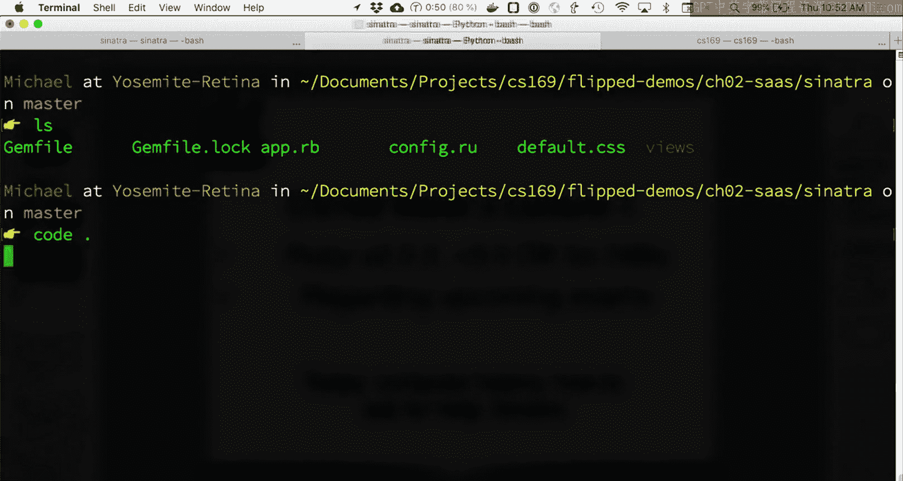

So it is Ruby， it requires something， so it's going to say， I'm using Sinatra。

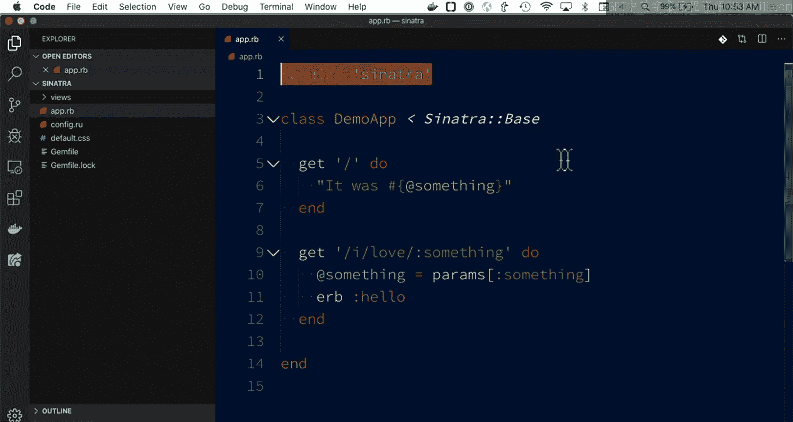

It creates a class because that's the way that Sinacho works。 And then it has these routes。

 So we have a couple routes here。 Get slash slash。

Get slash。 So just the base route。 And we have， you know， another one。 and so。

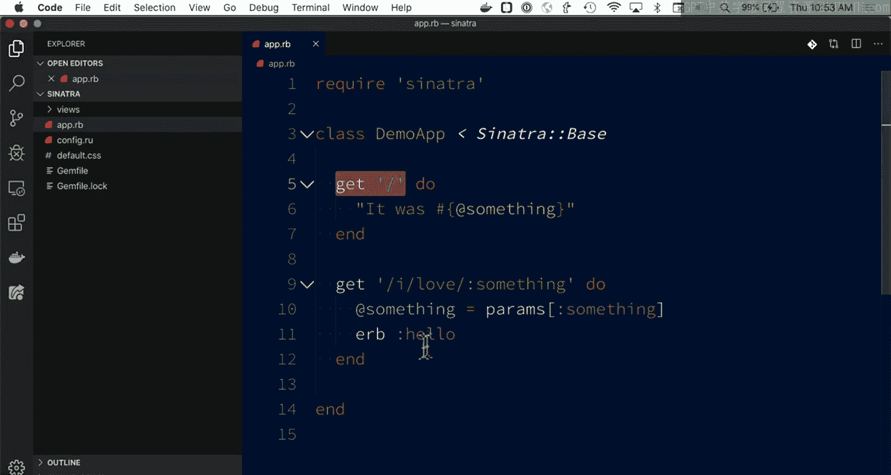

I have an application。 How do I， how do I use it， So one tool that's useful。Again。

 this is an optional tool， but rerun we'll just watch for changes in my file system and restart the next command that I type when my local files change so as we mess with this。

 we don't have to kill our server and restart it。But rack up。Rack is。A web server for Ruby。

 it is sort of what underpins the bits that handle responding and handling HTTP requests and what we can see is if I go over here so our config file is if you have a configda RU file that is what the rackup command looks for so all it's doing is it's saying require my application。

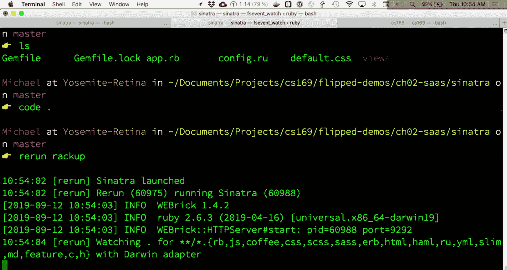

And then telling it to run demo app， so this is just a really simple ruby file。

Get my app and then run it so not much happening there。

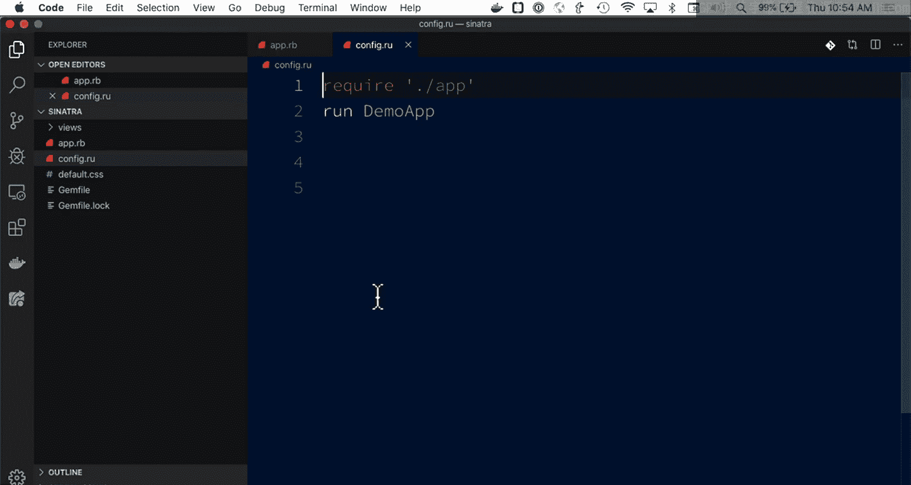

But that's what's happening。 you know， that's what rack up is going to do。 We have a now we have a。

A web server running。In here。Where might I go to find this web server。

 so does anyone just want to shout out an idea for what what bits of information in this in this response are going to be useful for knowing where to go look for my application。

There's going to be some relevant information here that is helpful， what might I need to know？

Feel free to just shout something out if you have an idea， the port， yeah， yeah。

The port here is going to be the useful bit。 So 92，92， that is the default for Sattra。

 Every application has its own default。 And unless you specify otherwise for rails for Sattra for most other frameworks they are going to be on local host。

 So on my computer， the local host address。And we're going to use port 9292。 So why that value。 Well。

 that's what they picked。 I had visited the page earlier。 The app wasn't running。

 so it couldn't find the server。 if I refresh now， I get an HTML page back。 and it's pretty boring。

 It was。 It was what I don't know what it was。 It was something。 that's for sure。

 And where is that coming from， that's coming from this thing that says get。 And so。

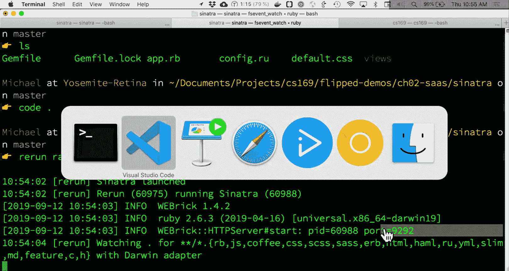

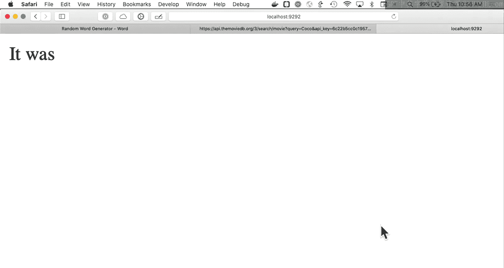

What we've done here is we have a method。It returns some data， and the browser renders that data so。

Does anyone have a guess of where something might come from in this case？Yeah。

request that I want something。Yeah， so。So if， if we're in this route， that the parameter would would。

Would fill in something。 What about， what about here。

 is there like what is at something in this case in our first method。So in this case。

 it's just nil because we haven't defined any data here。嗯。

What what's happening in our application is if you ever have a variable and this will be true of Ruby in general。

 not just synattra and not just rails， but you know。

 we're putting a a value that is nil and a string and happily continues along and renders the request because if you add mill to a string。

 you just， you know， it's an empty string and things go along。 So this will you know。

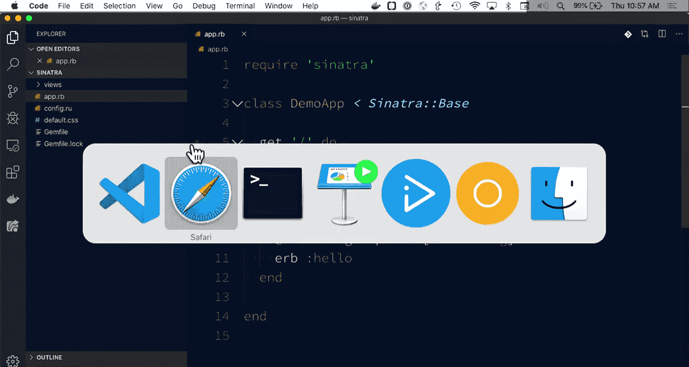

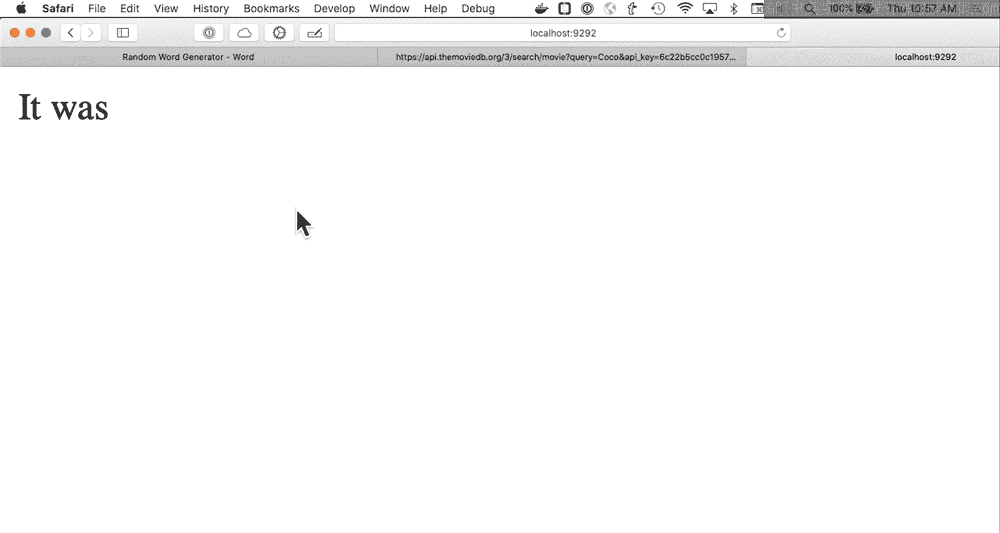

That will be something I'll run into so we can do something like this， right？

If I can type at something。Is good。So I'm going to save my file。

 will note that it says that I've restarted my server to load my changes。

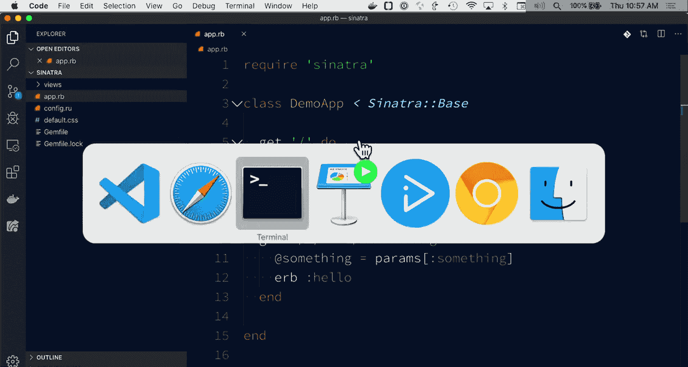

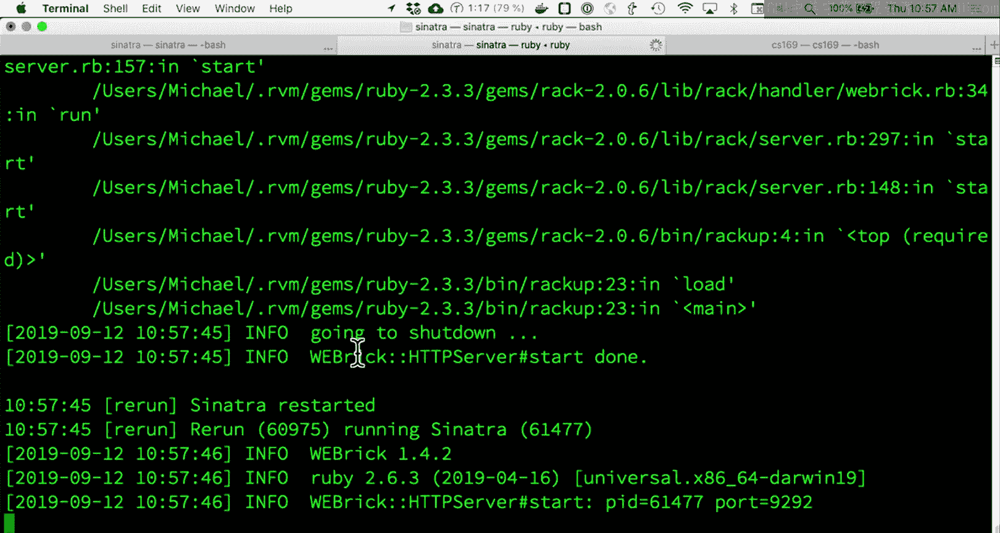

And I now get the sentence， it was good。

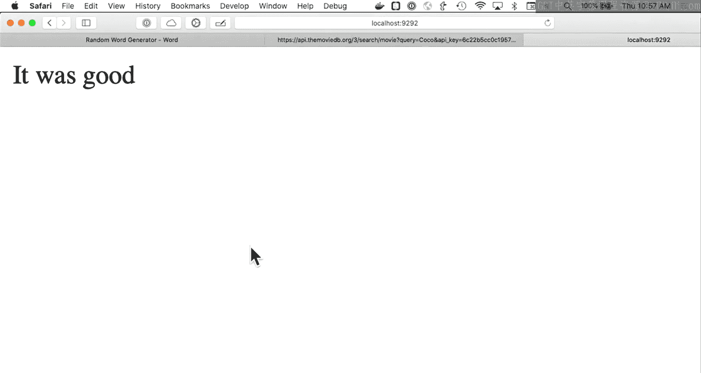

What Sinatro is doing here is it's just filling in the data that I have。 And of course。

 what's going to be more useful is if this is actually a parameter。

So let's actually have this do something useful。 So parameterss。

 the object for getting parameters from a URL， you know， now if I refresh this。

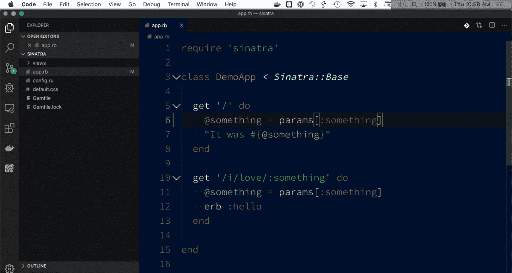

Back to it was， what might I use to specify a parameter here？

How might I pass in a parameter in this URL？s。A query parameter， Yeah。

 so question defines a query parameter and just see。Something is the name of our parameter。

 so these are key value pairs， so something equals life。It was life。

 not not a very great sentence there， but it is a， you know， it is a noun。 So it was life。

 we can pass in whatever data we want and Sinatra will stick that data back into our string。

 And so we've made a request。 It does something to render this response。

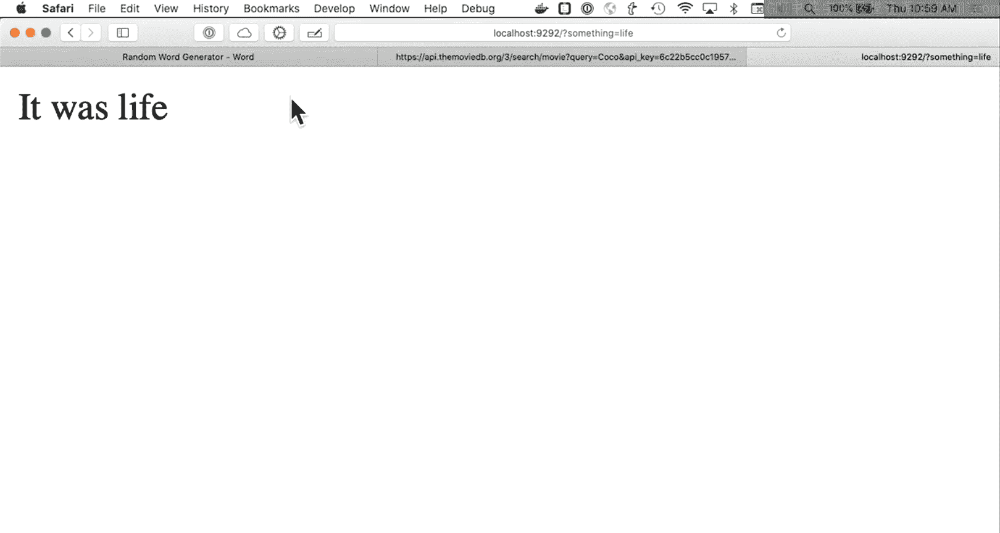

And， you know， what we'll see in the next few lectures is we'll build up the complexity of these routes to handle things like storing data。

 rendering some more complicated H and so on。 So we'll see you on Tuesday， as a reminder， homework 1。

 If you haven't done it yet， is due Friday night it is midnight。

 So the grade scope date will be updated to reflect that。 But Friday at midnight。Okay。

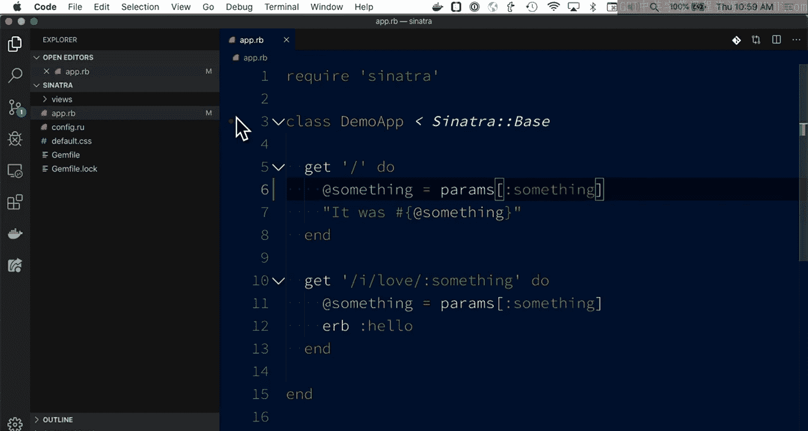