# UCB《软件工程｜UCB CS169 software engineering 2019》中英字幕deepseek p06 6 CS169 6.zh_en -BV1UsB7YPEMj_p6-

All right。What's song yep， all right， let's get started for today so。Just reminders。

 homework2 is going to be due this Friday， it's Q&A style format directions on B courses then next week after the assignment is due you will be peer grading your peers assignments so that will be on B courses and we'll post on Piazza when the peer grading is assigned。

 we can't assign the peer grading until everyone's submissions have been turned in so。That will take。

 you know， that will be sort of a small assignment next week along with homework 3。 But in general。

 the peer grading won't be incredibly difficult。 You know， there will be a rubric。

 and you'll be looking at what your peers have done。 with homework 2， the responses， you know。

 there are correct things to do。 but there's not a single。

 necessarily correct answer because you're making real API calls。

 So that's why it's peer graded and not auto graded and then。

We'll have another microquiz Thursday in class again。

 you know two or three short questions will be pretty quick same deal will be on grade scope so just that。

Today， what we're going to do is we're going to keep working on the Sinatra app that we started on Thursday。

We'll finish up sort of just a basic requests， views， parameters。

And then we will look at how we share sessions using cookies。

And then we'll get into some dependency and maybe some model view controller stuff。

What we saw again on Friday was Hello World on Sinatra。

You know where we are right here again is this piece of the stack so where have an application server。

 it's going to be handling requests and responses and then what we're going to be doing is controlling you know when we get a request how our application should respond to that and so for the first few bits of lecture this will be entirely stateless so everything that happens。

You know each request will be entirely independent of the next one and there'll be no information sharing between them and then we'll get to the question of how do we deal with state and saving and reloading information。

 so let's just jump into things。

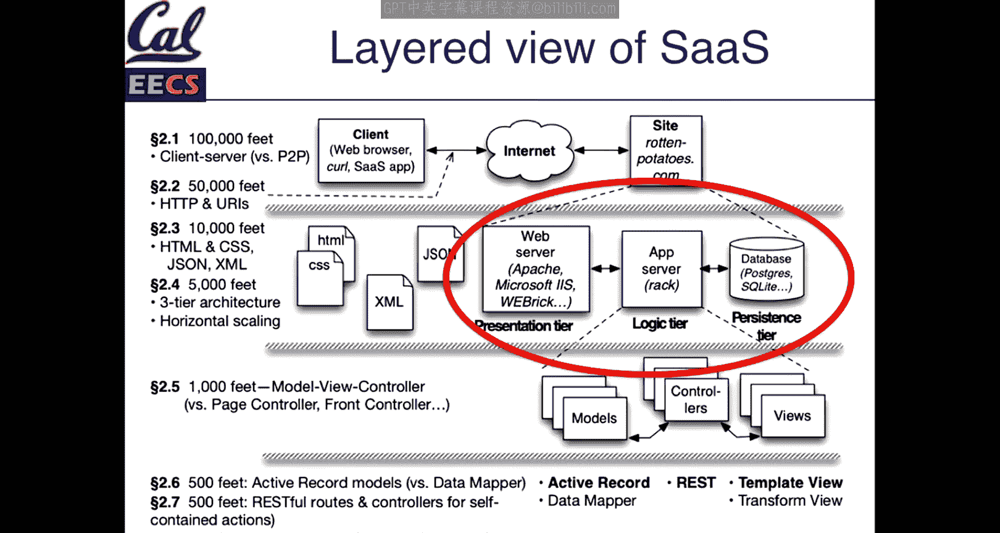

U。

So what I have here right is our Sattra application。 I've already started running it。 this is。

The command rerun rackup and rerun is just a handy gem that will reload our application when the files change。

You know， I happen to know about that if you're curious。

 this is also sort of the recommended approach in the Stra documentation。 So again。

 what we see here is some information when the server starts。

 each line here is the result of a request。 You'll notice this looks like a full route。 get slash。

 It tells me some stuff about HP。 200 is an okay response。And if you go into the server。

 I can keep refreshing and it just loads a very， very simple web page。

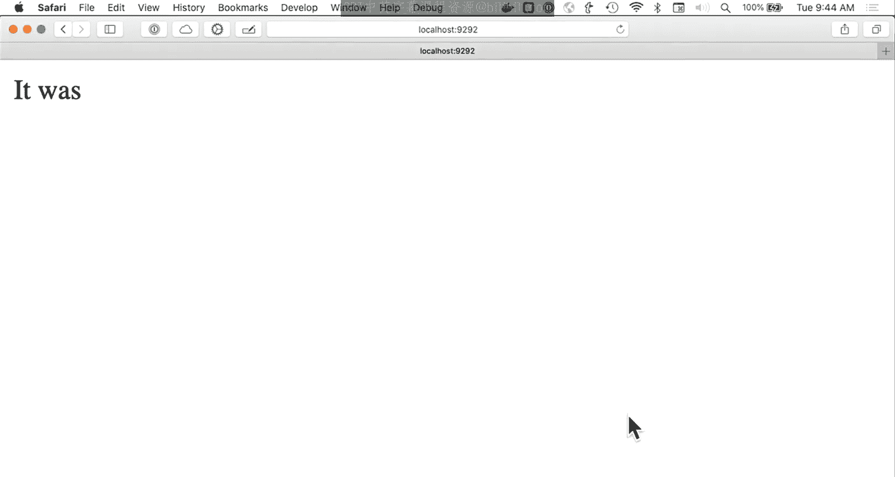

And so。You know this is our application， it's handling two routes right now。

 get slash and get slash I love something and。嗯。Remember that for the。

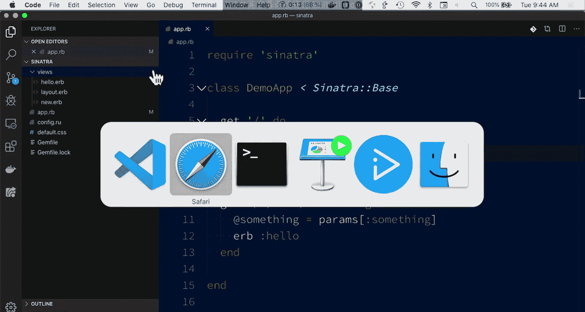

The first parameter。 So our， our slash route， we have a parameter named something。

 so we can add that as a query string。So something。Equals good。What did it。Assuming I type correctly。

There we go， so now we have it was good。So what we have is a URL。 it has a。

A parameter and in our our view， in this case， Sinatra， the view is really just a very simple string。

 It's not even really HTML at this point， but you know it passes back something into entire string and。

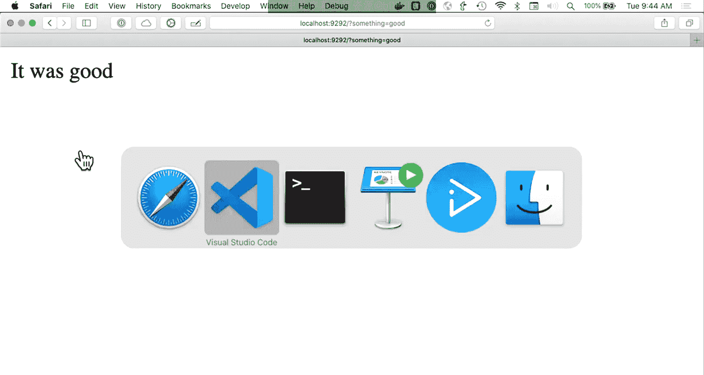

We go along there。The next thing is making our routes and our views。

Ever so slightly more interesting。And。What we have is this second amount。 So I love something。

 So someone shout out something else。 Give me， what should I love。

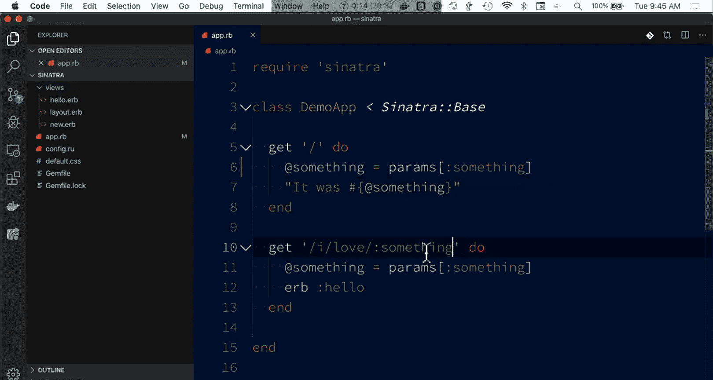

DogsDogs， okay？That's good。 I'm a cat person， but dogs are good tick late， Why can't I take？

I啊 what do啊啊。顶下。My page， I love dogs。 Yep， so we fill in and now we have some HTML。

 it's a page and it fills in the sentence I love dogs。

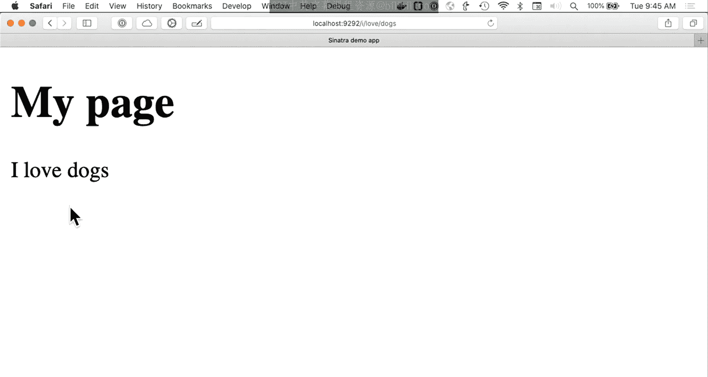

So where did we get this web page that says， I love dogs。

 and how does it know that there's a dog there， Well， we have this line here that says E RB， hello。

 So some people call this herb， which is。Not something that I prefer to call it。

 but you'll hear the acronym herb I usually just say ERB。 It stands for embedded Ruby。

 which is just a fancy way of saying that we get to mix Ruby and HTML。

 so I have a folder here in our application that is called View and in there we have this thing called hellello。

So hello is what looks like an H2M file。It is could just be straight HTML。

 but you'll notice that there's something interesting here， right。

 and what we have is so this is HTML， but we also have this tag here so。If you've used HTML before。

 if you've reviewed the links about HTML on the syllabus。

 you'll notice that this does not look like HTML， there is no percentage。In HTML， there's no。

There's no sort of HTML element that looks like this。 And then， of course， we have this at something。

 You can't just drop at something into a web page。 And you know， it's。

 it's just gonna to be the text at something if we didn't do this， right， we could。Just go back to。

 well， we need an actual HTML tag。You know， if we did。Yeah span。Rui。What we get here？

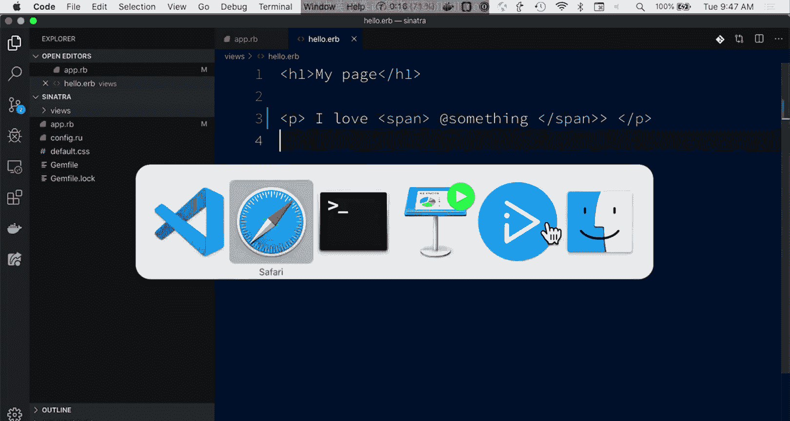

And I go refresh， well'll have an extra tech， but that's all right。

 if we don't use this percent equal system， we're not going to get anything back。

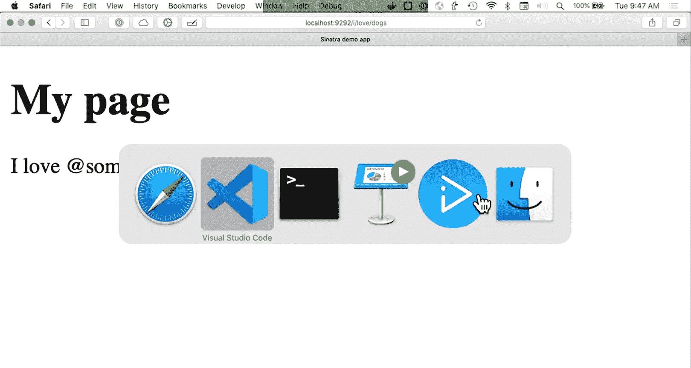

And so what just to undo a few times， what's happening here is anything in between an opening percent equals and a closing just percent bracket is going to be treated as Ruy code so。

In this case， we're just going to access the variable at something。

 but in the future with your own applications， this could get a little bit more complicated in general。

 the goal is to keep the logic that are in our views pretty simple。

 we're not going to try and build up a whole bunch of stuff right in our view files。

 but you're certainly able to you know you might see something like user doc first name or at user dot first name depending on。

The kind of data or setup that you have。 So you can embed Ruby inside an HTML file。

 And this is a very common way of passing data back and forth， so。We have a file here。

 Sinatra just happens to know when I say that this symbol hello corresponds to the file views slash hello do ERB。

 And so that's what Sattra is doing there， it happens to know as a framework where everything should be set up。

 but。You know， so you don't have to do any configuration in your own applications。

 you will probably have a similar structure with rails。 There's a views folder as well。

 but in general， you know， this is just the convention of a framework that we have set up here。

 So questions so far on how on how this Sinatra app is working what's going on here。Yeah。Next。

So what does line 12 to， Sorry， which one， line 12， This one right here，12， Oh， yeah， yeah。

 So what we have here is this。 So this line is defining a route which corresponds to a URL called I love。

 and then。In rails， these walks should be named， but we don't really have a name here。

 So something is what we can call a wild card。 And so what this means is。

A wild card is any data that when I go to that URL， it's going to match to the same route， so。

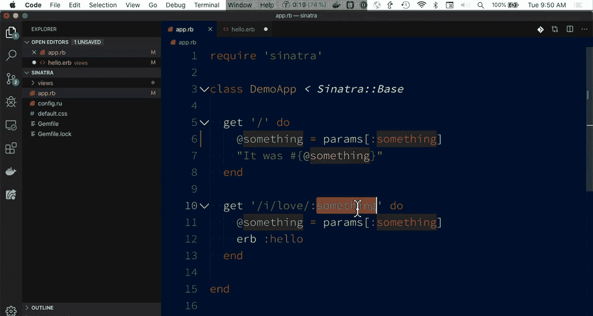

If I refresh again。

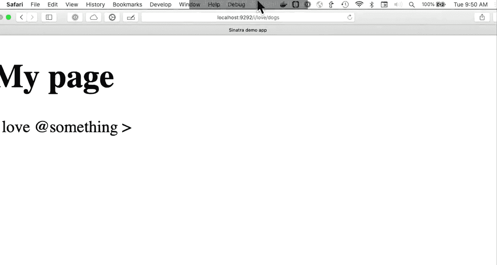

Did I not save my file on a second。

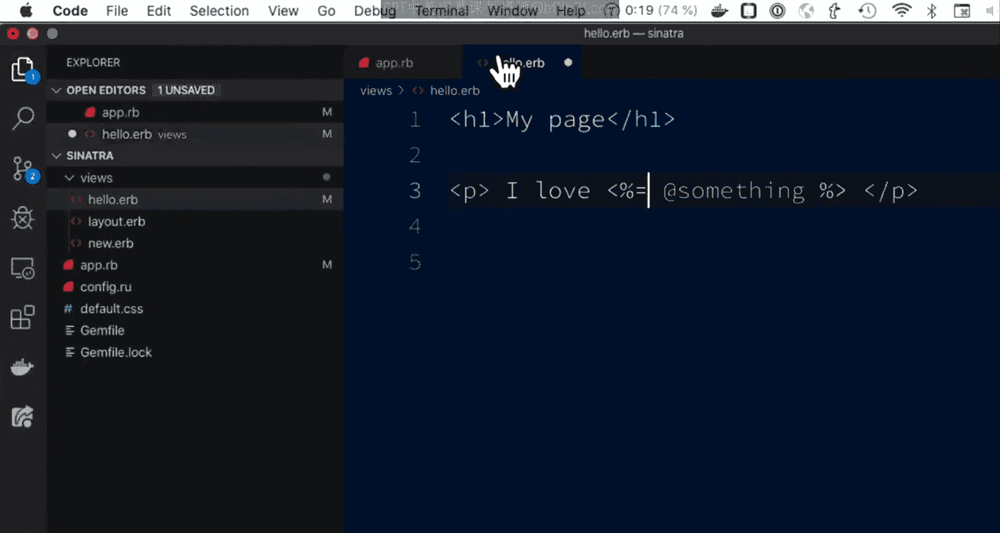

Let's save it and refresh。 So， you know， I have dogs here。 I can say， cats。I can say。Coffee。You know。

 anything that we have here， the path or the the structure I love something。

 And so what Sinatra is doing for us is， let's go back to our file is this something gets turned into a hash called Params。

 So you'll notice that there's a couple things that are interesting here。 So。

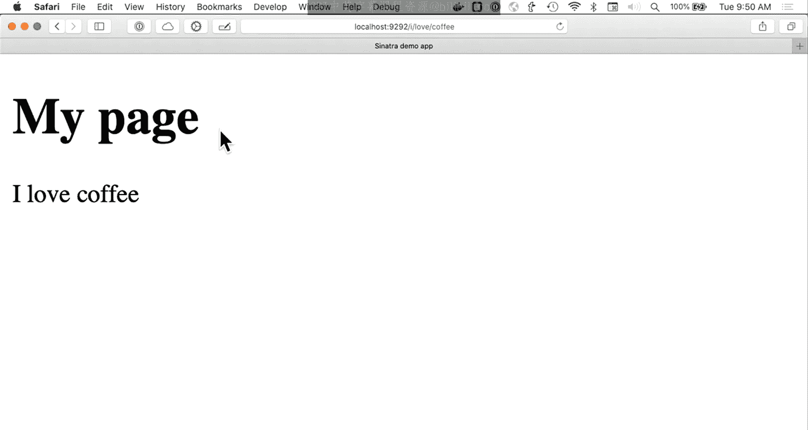

This wild card colon something， so this specifies。Any sort of any variable that or data that we might want accept on our URL。

And Sinatro puts that in the pram's hash with the key something。 So whatever。

 whatever name we give it。Here we will access it here。 So one thing I could do here is， you know。

 I could call this。I don't know。Data。And then here I have something called data。And notice。

 I've given the instance variable another name。 that's quite al right。 It should still work。

 It does indeed。

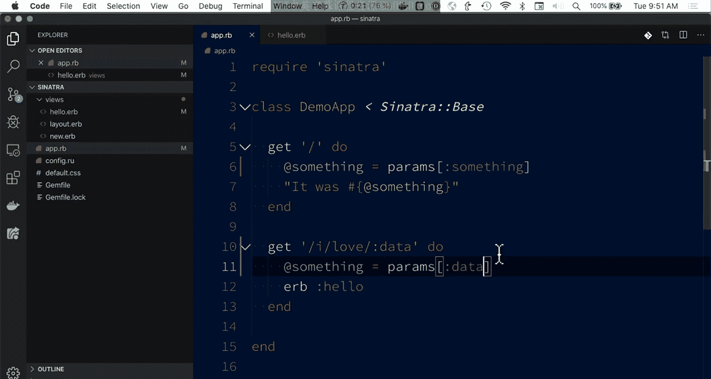

Just to confirm， save it， pretty low。 well， did I reload too quickly？Yeah。

 just reload it too quickly。 So you know， what， what's happening here with Sattra is that this thing。

 the wild card and the URL corresponds to the hash in the parameters file。

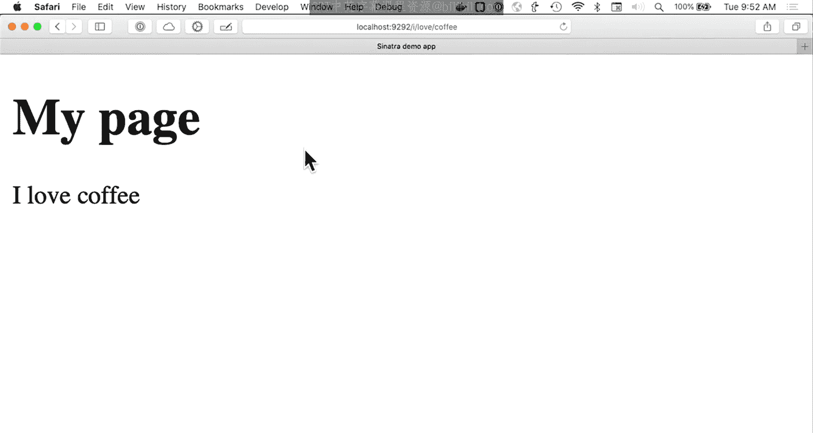

This instance variable， something we can use within our method here。

 this the body of this skip method， we can also use that variable something in our views as well。

You have two pieces， the structure of Sattra， the framework itself sets that in the prams hash。

 and then how you use that data is up to you。What about about the colon hello the colon here。

 two lines below colon hello Oh colon hello。 Okay， yeah。

 so colon hello is so data that starts with a colon is a symbol in Ruby。

 It is like it's equivalent in a way to an immutable string。 I believe。

 but I'm not positive that this will also work。 Well。

 assuming I don't have cap clock on that would not work。

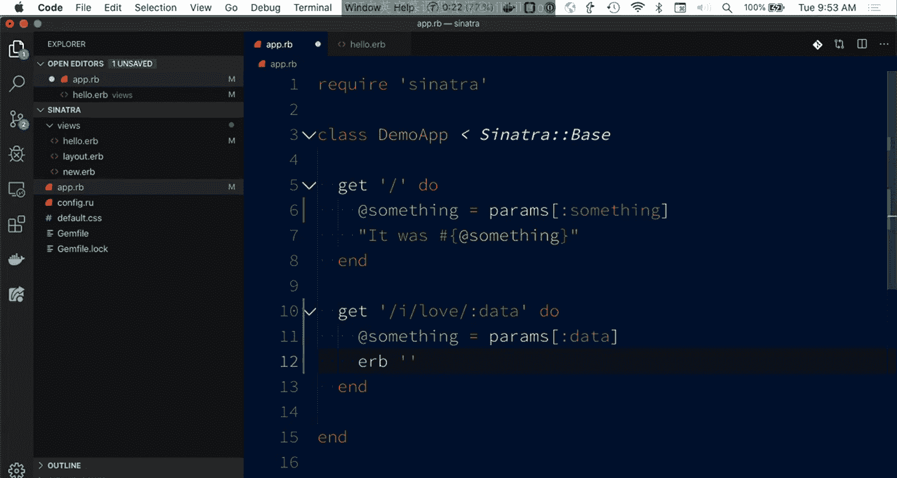

Okay， so let's see what happens there， string hello。

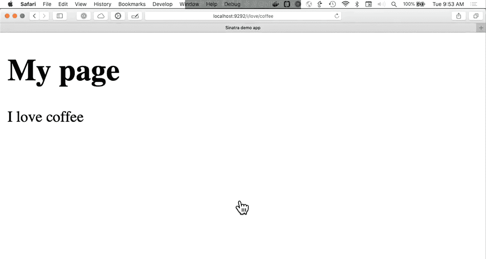

It does not like the interesting。嗯。Some live testing there of what Sinatra does。 So this is a symbol。

 So it's just， you know， a data type in Ruby。 And what Sinatra the framework does is it says I'm gonna look for a file called hello dot E RB。

 And where that file is happens to be in this folder in our application views。

 And it's named hello dot ER RB。 And so we could， let's see what else do we。 We don't have。

Is there a news file， Okay， well， there's no interesting parameters there， but。Let's。

Let's just see what happens if I do。

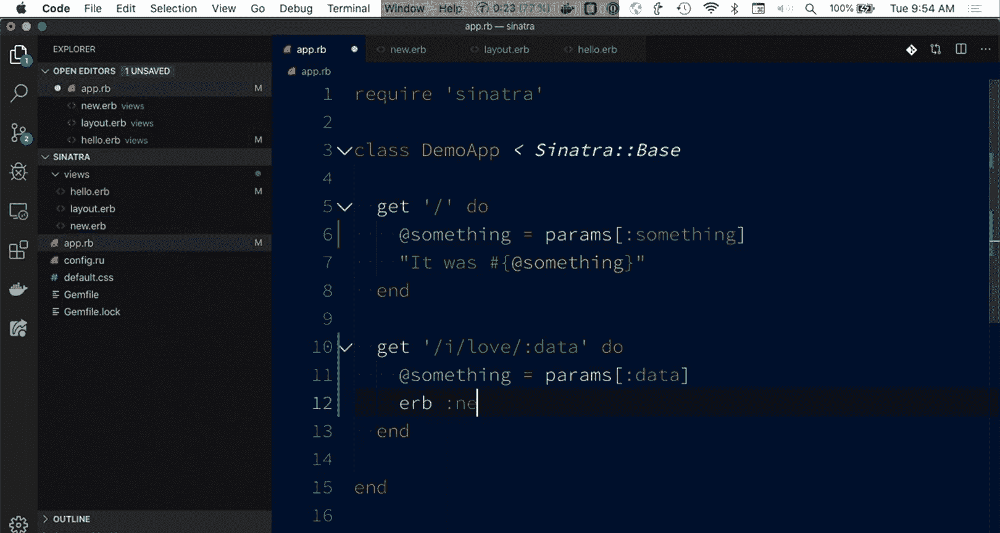

模式。And wait for it to refresh。

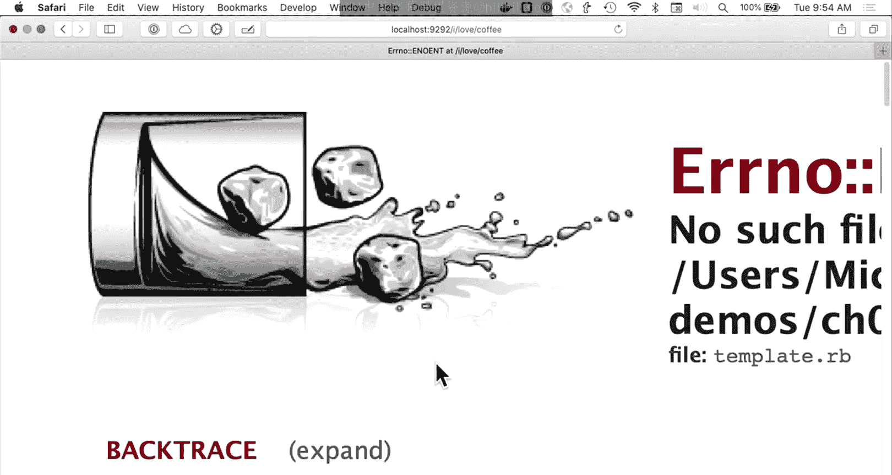

No such。'tt， what is this named？

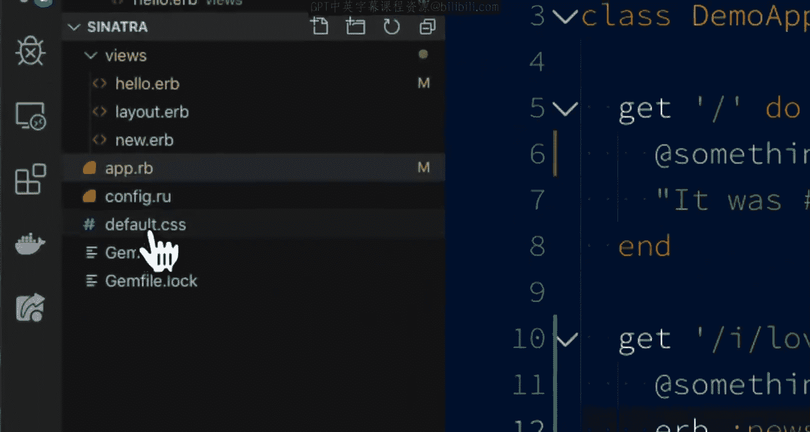

Oh， new， not newshu。So this file is not going to do anything in this application。

 but anything that is in our views folder， we in Sinatra。

 we can access by using a colon and the name。 So there's this layout file。

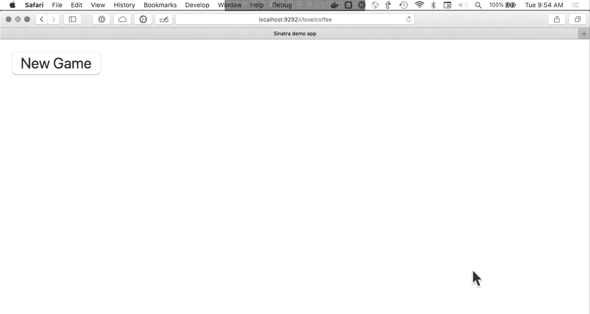

诶。Which might give us a little more structure。

Oh okay， so layout requires some different stuff， that's not a great demo。

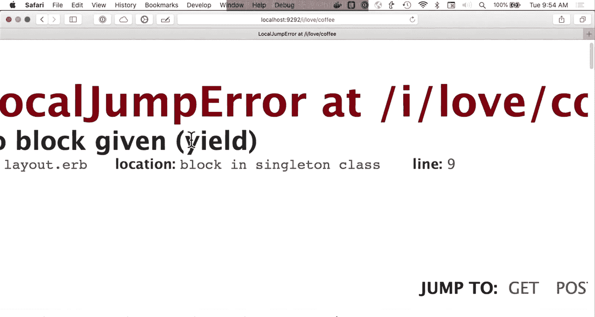

So let's just go back to hello。But what Sinatro is trying to do basically is any file that you have saved as a view。

 it's going to render that content and within this view file so you can put this is one kind of file。

 this looks a little bit more like you know there's some more H2L here。Oh。

 we're not going to deal with this right now， but you can pass content to other files。

 this has an HTML form that is also not going to do anything in this example but whatever file you have there。

 Sinatra will map that back to whatever you have there。

 and the colon is just Sinatra syntax in rails you can actually call them with a string and not just a symbol but in Sinatra it requires you to do a symbol hell of colon hello。

And same thing here， this data is a symbol and our hash。

 the keys of our hash are symbols and not strings。 So that's kind of just a convention amongst most of the rubby applications。

 But it you could choose to set things up in a different way， potentially。CoolGood question。 Yeah。

 other questions。 Yeah， and there's one in the back， if you want to。Yeah。Next。

What if you don't provide anything in data and you， your URL would look like something I slash love。

 So， you would trigger the other get。

Yeah， so if we just do like this， yeah， let's see what happens。So in this case。

 this depends on our framework， so I'm going to be honest。

 I wasn't exactly sure what Sinacho would do。know for this class。

 we're not going to become experts on Sattra， you might on rails depending on what you do。

 but in this case， Sinatra is expecting there to be data when we put a parameter there。

So in this case。Sinara is looking for route that just starts off with I Love。

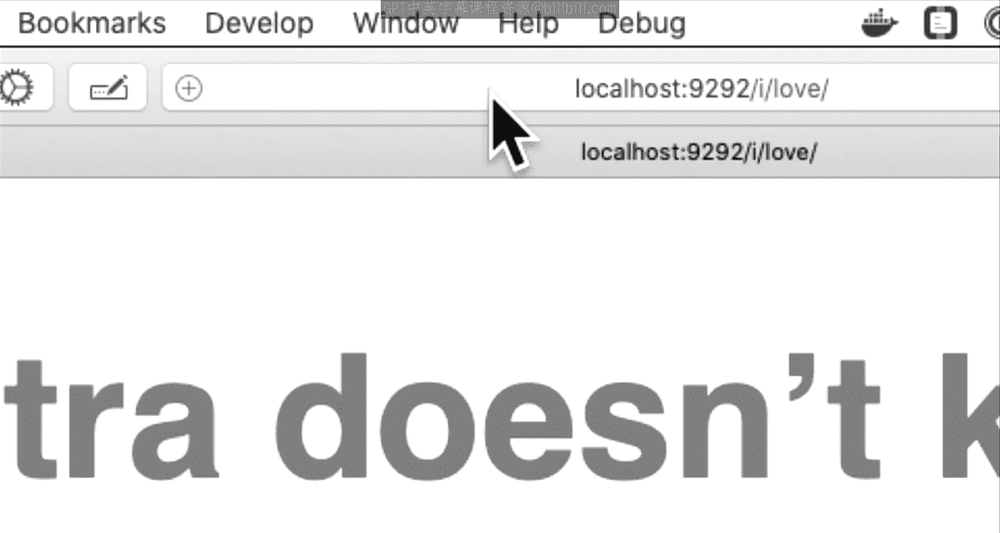

And it has apparently the one requirement that if we have a parameter here that we provide data。

 and I believe rails yeah， rails is the same way， too。

You have a， a parameter that by default requires something。 So， you know， I could just put。Numbers。

Well， yeah， you can love numbers。 you know，1616 is a good number。 It's a power of  two。 You know。

 whatever data you put in there， you can do。 You know， we can even， let's see if we can break this。

Emoji can cool。 That actually， it worked， which was the guess。 emoji are valid URL characters。

 They get encoded for you a special way， but， you know。😊。

You can put as long as you put data in this URL， it will match the route。 Now。

 the question then becomes， what if we want this to be optional so。

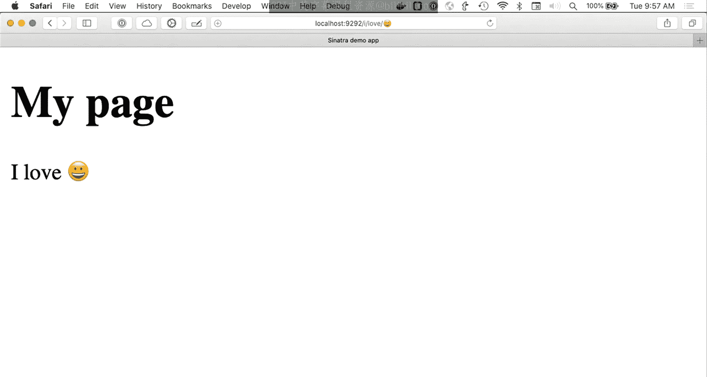

In Sinatra again， let's no， don't put the parentheses there。呃。

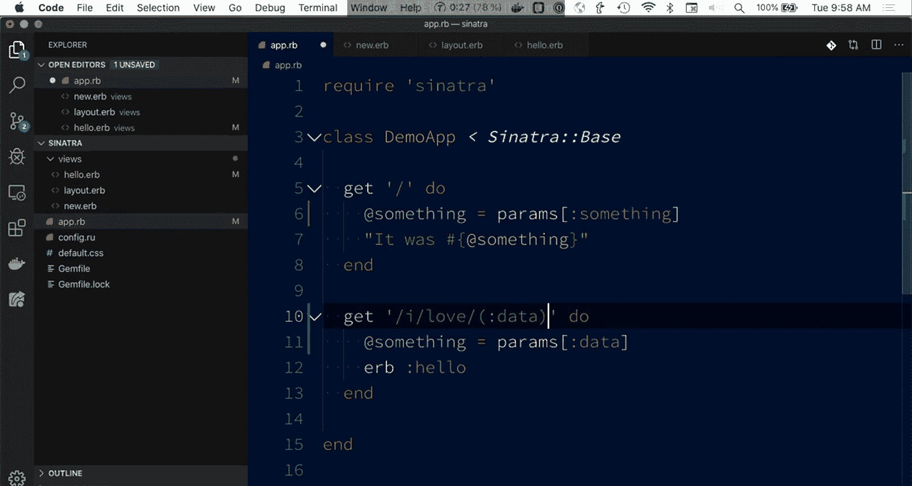

These are a bit like regular expressions， so let's just make sure this works cool。 So again。

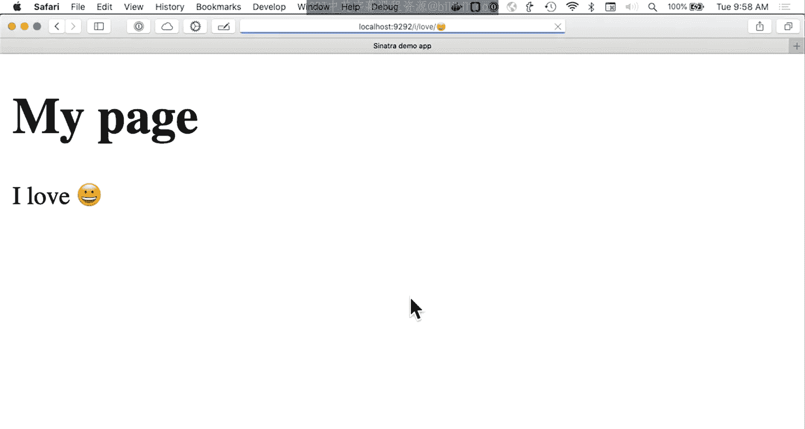

Save it。 You can always check。

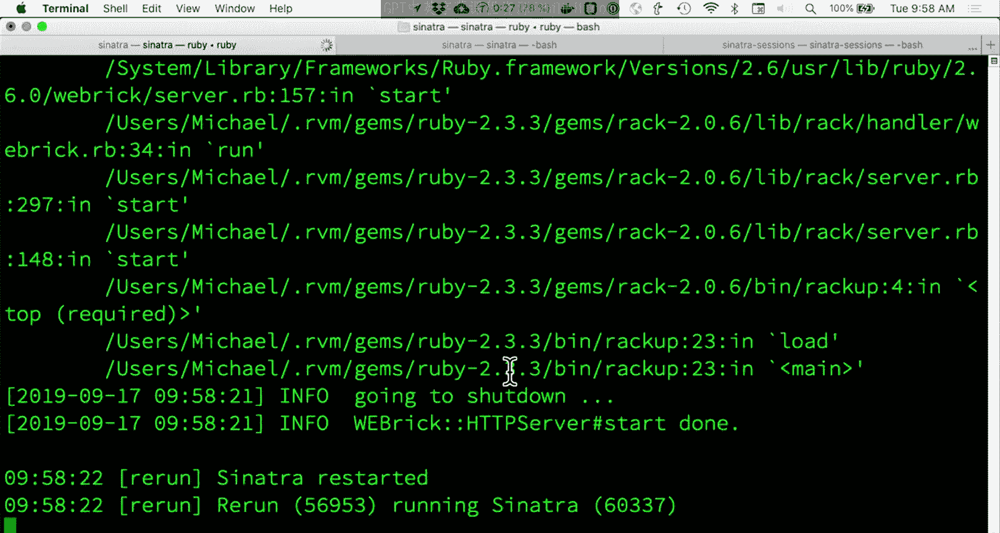

It will tell you in your terminal when things have restart。So。Right。

 what I did there is now I have I love。 So what I've done here is I've added some parentheses around the parameter so that it treats it as one thing and a question mark。

 If you've ever used a regular expression a question mark is one way of denoting that something is optional。

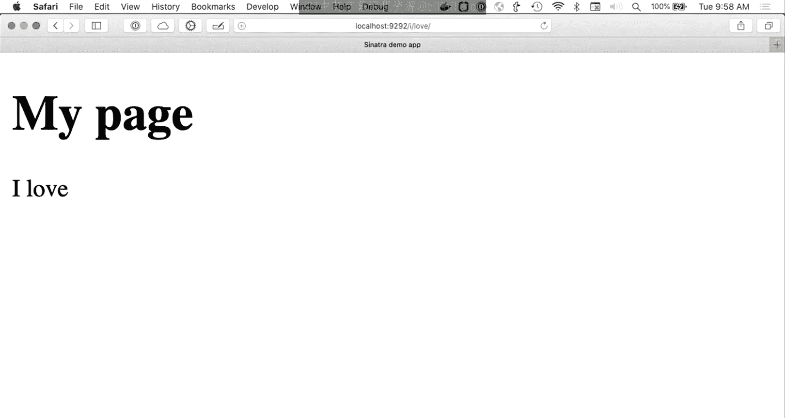

And it depends on which exact syntax。 But what Sinatra is doing here。 And you'll。

 you'll see a similar thing in root and rails as well is saying that this parameter named data。

 I've denoted it using this question mark syntax as optional。

 So the syntax here can be quite complicated You can build up all sorts of routes。

 you're not gonna be expected to memorize and know the syntax。 But it， you know。

 it will be perhaps useful to look up。 So with that， we can say， you know， this is an optional thing。

 We have all sorts of control here。If I have just data， so I can even add， you know。

 a trailing slash。

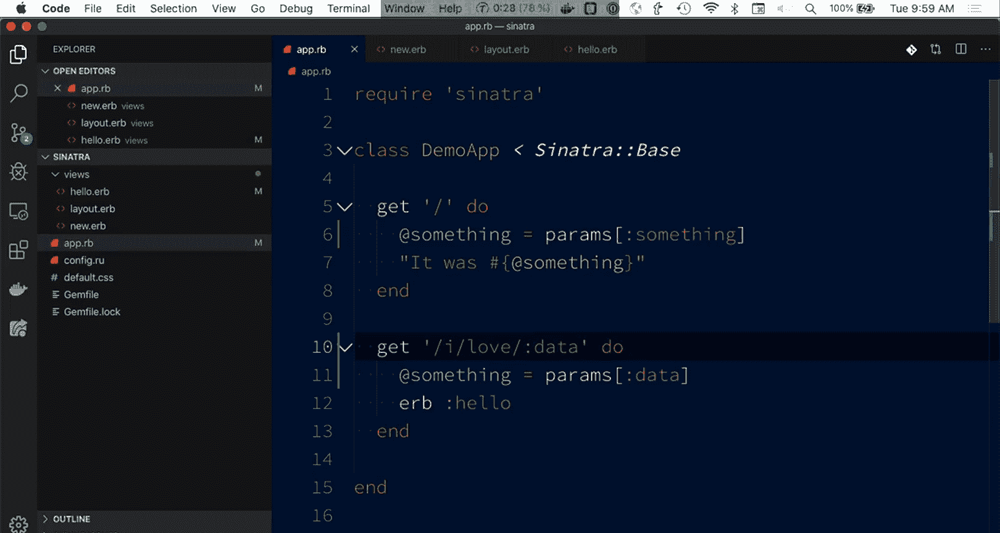

And let's see。 And again， Satra doesn't know what I'm doing， even if I put。

So if I just put data here without the final slash， Sinara is still not going to match that route。

 and if I put it back in here。

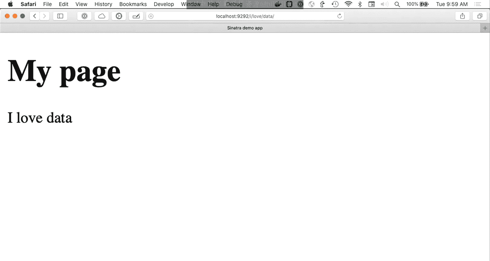

What Sinara is going to do is it's going to then match exactly， does that help？

Other questions on whats not。 Yeah， go ahead。 I had a follow up。

 Can you have a default argument there？defaultfault。So not。

In terms of this syntax with when you're defining a route， not really what we could do。

 So let me go back。Let's see now， Okay， so the way that we might handle a default is to make this optional。

And let's remove the final slash and you know。I see。

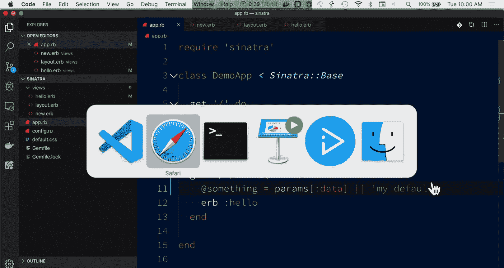

So let me go ahead， save this。nope， refresh。Remove our slash。 So I put data in there， right， I have。

 I love data。 and if I remove my route， it should be optional。 And that says my default。

 So there may be a slightly cleaner method。 as far as I know in Sinatra。

 there's not a standard way of handling this setup within this structure。

 you can't treat it quite like you can， you know， optional arguments in a method definition。

 but if you tell Sinatra， know， hey， I think this parameter should be optional。

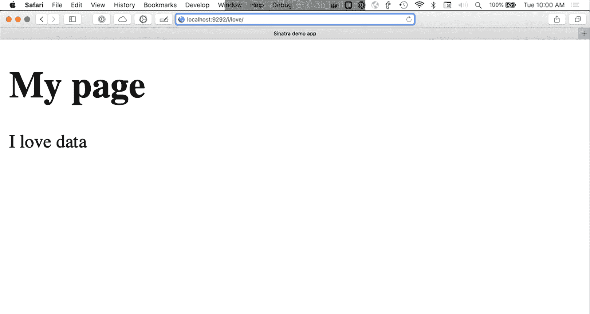

Ruby will put this value in a hash as n and then using the ore operator， mill or whatever you have。

Will be the second side of your expression。You have the ability to you know。

 handle defaults yourself， which you might want to do， but that will be。You know。

 that'll be based on the framework。 And for for rails itself。

 you're going to do something similar as well because rails。

 you'll see adds quite a bit more structure and how we define the routes。

 And so they're going to be a little bit more separate from the actual controller code that gets executed。

Yeah， follow up or other question。 Yeah， Yeah， go ahead。 Okay， okay。

 anyone else have questions on what Sinatra is doing。 you know what。

 what any any of the code here is doing。 Yeah， question。Where is that。Cool。Wait， just to clarify。

 So that ERB hello is just like going or it's like redirecting to the hellello ERB file So it's not redirecting。

 We'll see in a few minutes what actually redirecting looks like what you can think of it as doing is this is not actually gonna work so don't really do this we'll actually there' there's short enough code here So I can take my content of hello do ERB。

😊，嗯。You wouldn't actually want to do this。But。诶。You know， we could。Do something like this。

 And then because。Our string interpolation is different。Let's see。 Oh。

 you're not going to autocomp that for me， are you？That you will。嗯。

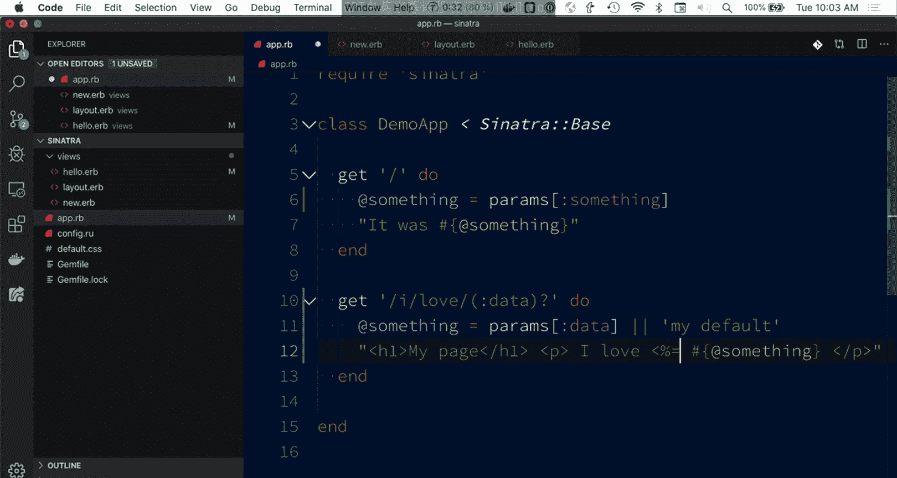

So aside from the fact that the syntax is not exactly compatible。

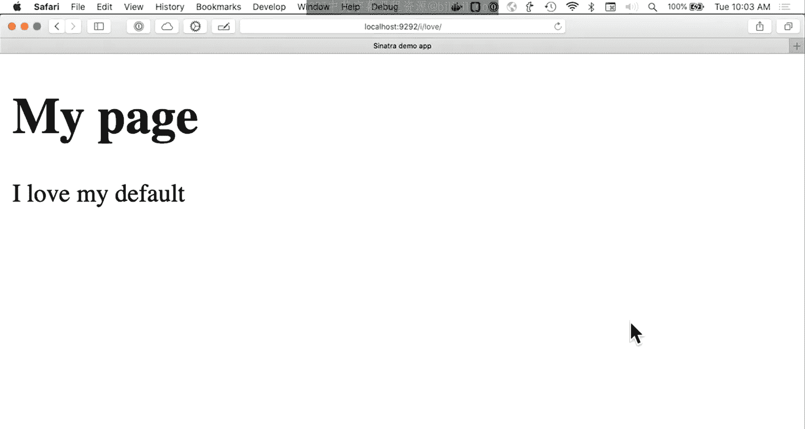

诶。So。It's hard to prove since the results were exactly the same， but the app restarted。

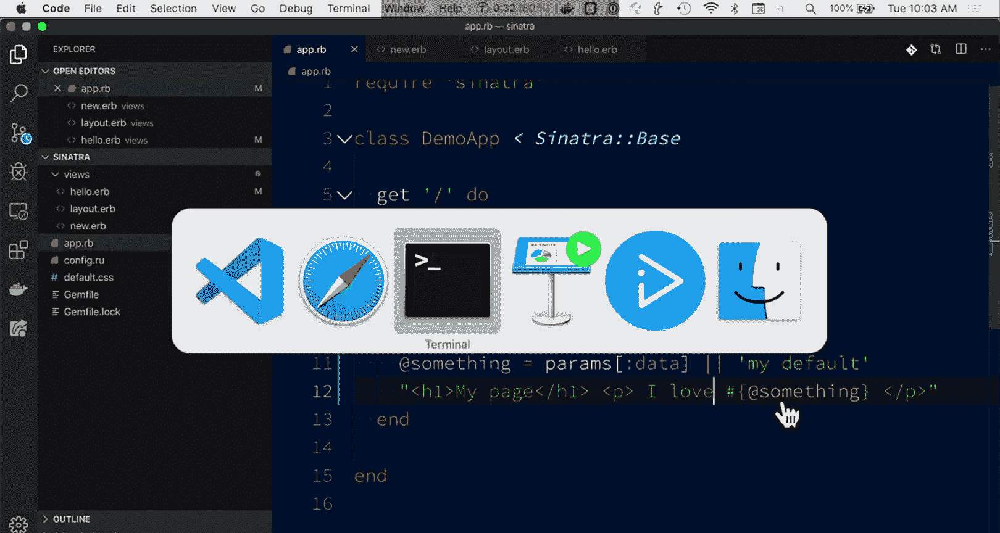

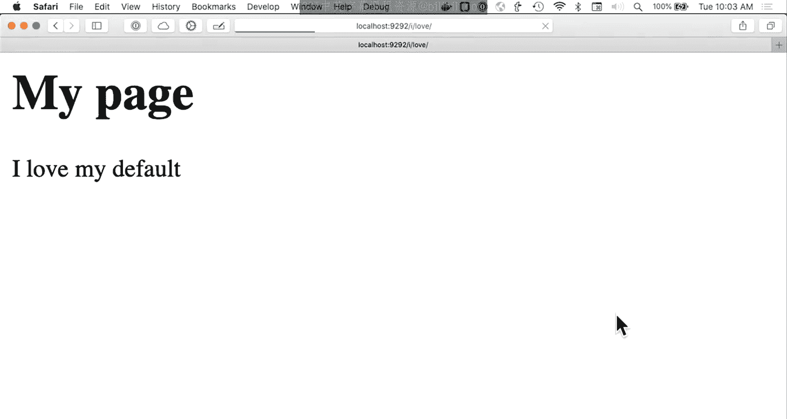

And what I've done is I've just pasted the contents in directly。

 And so it's rendered the same HTML to L file。 And so what it is essentially doing is Sinatra gets a request。

It runs through all the code。 It sees this ER RB hello thing。 And it says， okay。

 let me find that hello file。 I'm going to read through it。

 If there are any parameters that I need to substitute and pass in， I'm going to， you know。

 fill in the body of that HTMLl file。 And then I'm gonna send that HTMLl file back to the server in one request。

 So it's not like rendering a static file， which you could do。

You could also use the keyword redirect to send it to a different path。

 but it is literally just sort of replacing that content in line。That makes sense。Cool。

 other question。 Yeah， what's theing。What parameters。Passin like is it only？

Like variables scope with it。it do block or is it also a variable？搞晒。Yeah。

 so parameter the parameterss hash itself is going to be only stuff within this individual request。

 So you'll notice this something up here。Is。Is is an entirely different something we can also。

Let's actually， I wonder what's going to happen if we do this。诶。

So。If I instead change this to be prams， cool。 So what I can do is if I just put the prams object in here。

You， Ruby is going to nicely turn that into a string for us。 So when it does that。

 these keys become strings so I can do。Coffee， I get data is coffee。 I can also， let's see。You know。

Food equals toast。And if I just add a bunch of parameters in here。

 so I can do question parameterm equals value。 You can separate them with an and， so。Class equals CS。

169。Any any URL parameters that I pass in， Sinatra is just going to take those and stuff them in this parameterms hash。

What I've done is just taking this value of prams and there's。

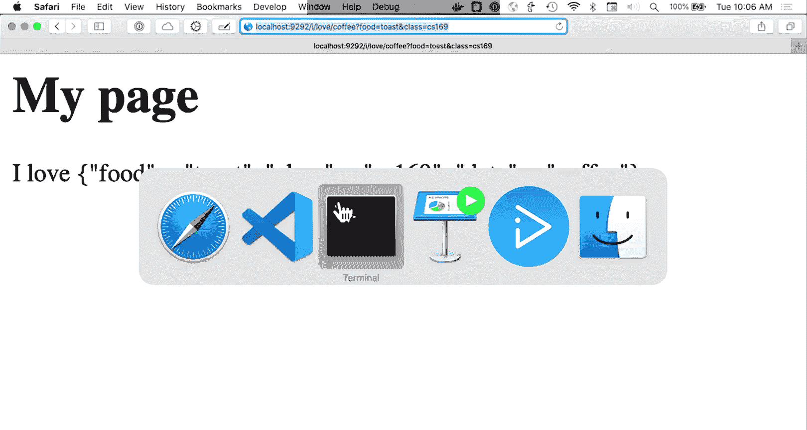

There's also an instance variable form of it， but the regular form should work as well。

 so let's make sure that that works。

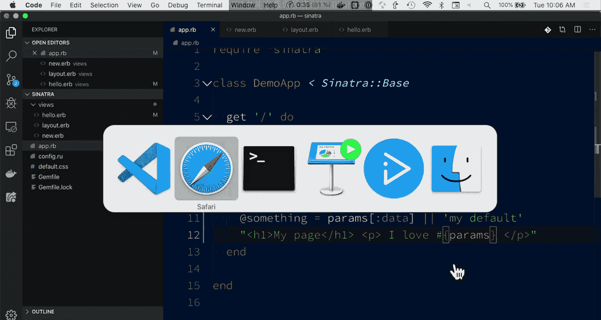

Yeahep。

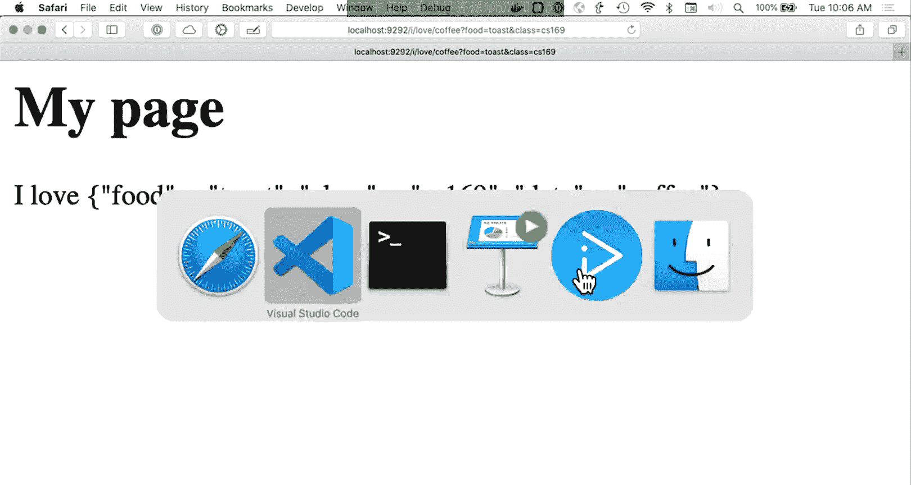

So anything that you put in the URL， whether these are parameters in the route itself or parameters that are in the query string。

 so the query string is anything after the question mark。

 those parameters all get stuffed in the same hash。That makes sense， Yeah。

 so a question in the front here， if we want to pass up the mic。Yeah。

 with this just be considered like your view controller for your view。 Hello da E RB。 Yeah。

 so in Sattra， we're gonna talk about this probably towards the end of lecture today， but。

So hello Eb would be most closely your view。 This is， there's not really a model here。

 So we would call this file a controller。 it's not necessarily a view controller。

 It's more of an application controller because it has all routes in one in one file。

 and there's not much sort of separation between them。

 but that's sort of nitpicking what you know kind。 but yeah。

 this whole thing could loosely be considered a controller。

 there's just like Sattra doesn't really impose much structure on you So you could do， you know。

 we could do this。 we could add our own structure on top of Sattra， whatever you want with that。

 But in rails when we get to it。Later in the week and next week， you'll start to see much more clear。

 distinct separation between what's a view， which is the model， which is the controller。

Other questions， I think I saw another hand。No。Anything else about Sinatra so far， parameters。

 what's going on here？Oh yeah， oh I want to pass the mic back。Yeah。Yeah， sorry。

 just to follow up on the question， I guess what I meant was like if you were to define like a parameter outside like on the line that you're at right now。

 would you be able to reference that in the HTML that you're talking about？Yeah。

 that is even though it would be like bad design， yeah so。诶。

So I've defined an instance variable because we are in a class demo app， and where is my Ho file。

Let's see。So I honestly am not sure what Sinara will do here。My。

Guess is that this will not work because the there's。

 there's a little bit of trickery at play here in terms of what Sinatra is doing。 But we have this。

No。😔，Let me just。Queen。This up。诶。Oh， but，hu， that's also why it's not working because we are not rendering our file。

 so let's go there。

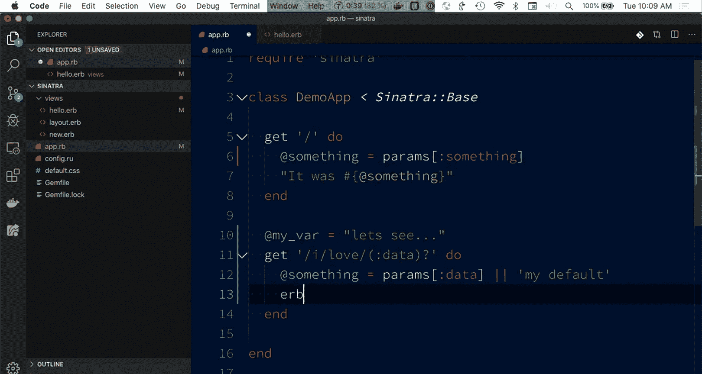

Now let's see what happens。

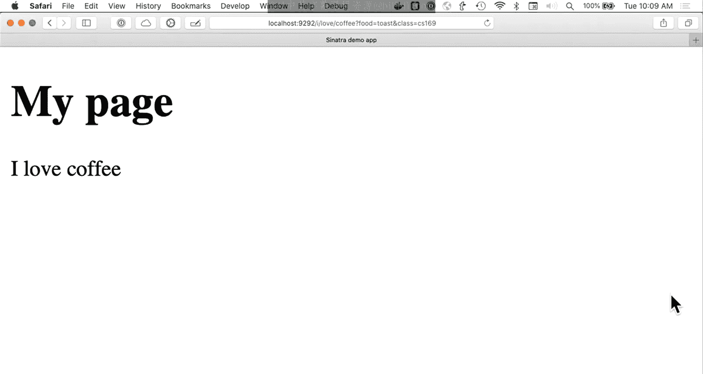

Yeah， so we have this div。 What is happening is Myvaar appears to be nil， and we can test this by。

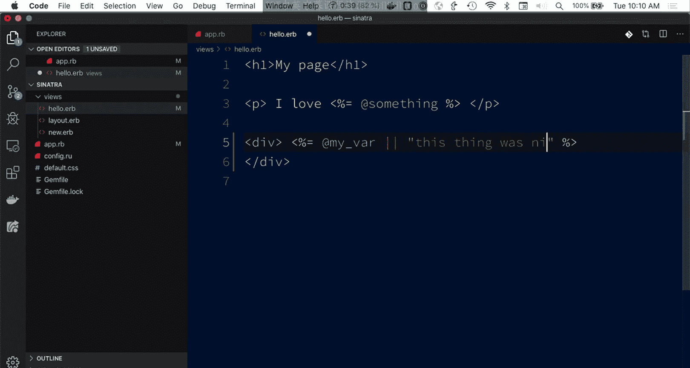

So maybe I'll just put a phrase there。Yeah， so myvaar is nil。 And so what is happening here is。

There is a little bit of trickery at play。 So if you're thinking about object oriented design。

 we have a method which belongs to this class demo app， right， so we have a get method。

 It has this instance variable called something。 We also have this other thing called My var。

 let's actually do something down here。

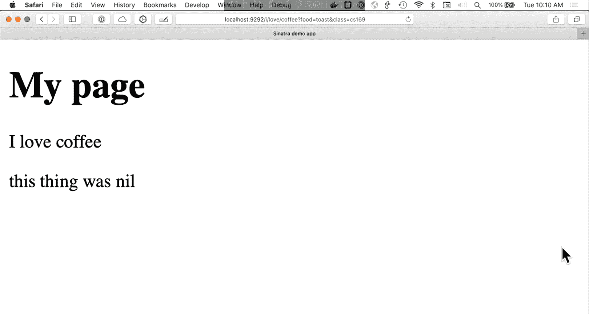

And let me。Add some new lines。So if I put a puts method in here。

 what we'll get is we'll see something on the console。

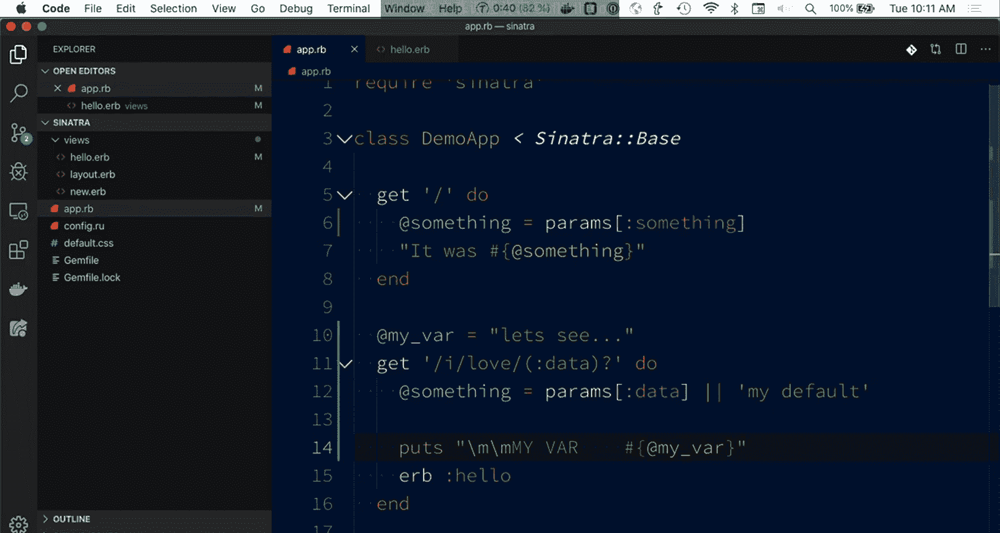

Okay， yeah yeah yeah。Don't， okay， fine。

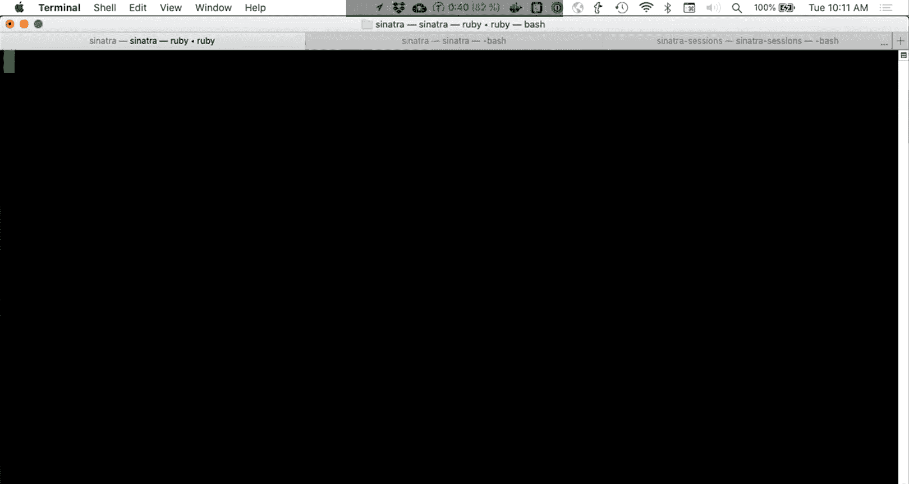

， let's。Not what I wanted， Sattra。

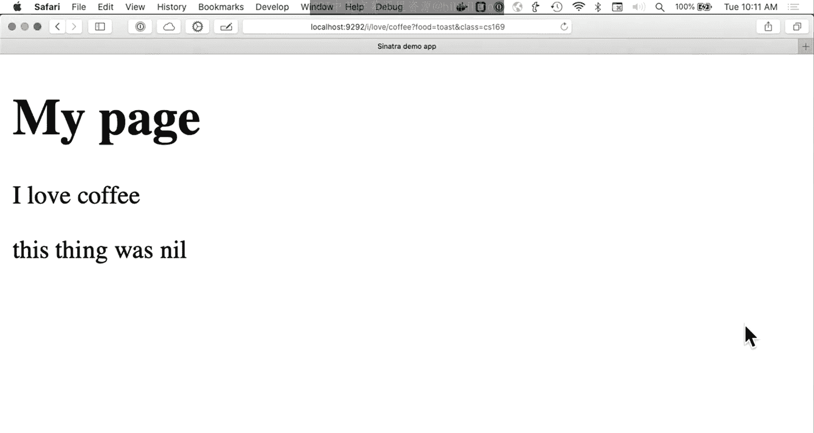

嗯。Oh， I typed。 well， whatever。 So what Sinatra is doing is， you know， this。

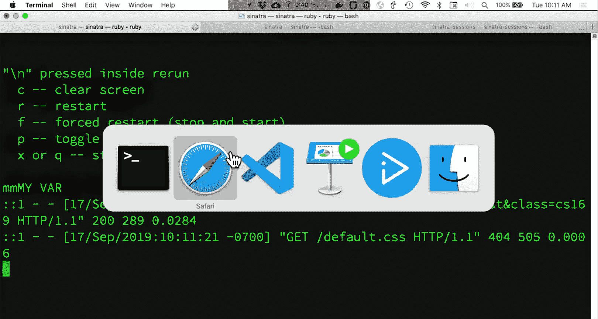

This variable here is an entirely separate。诶。instancet from here in our method。

 And that's because of the way scoping has been set up in Sattra。 they， you know。

 this is its own instance。 So this get is a method that returns。 I forget this specific class。

 but it returns an internal Sattra class。 And so。You know， this is a a separate instance from here。

 which is also technically a separate instance from a view。

 And so what Sinatra is really doing behind the scenes。

 And this is something that rails will do as well is。

You know our view itself is its own distinct class。

 so in rails that class is usually called view context， there's a bunch of intermediate layers。

 I don't know what the internal Sattra one is called。

 but fourth sort of the convenience of the programmer the framework is saying I'm going to take my instance variables that are in my controller or my method here。

 so in this get method， any instance variables defined here。

There's gonna to be some meta programming behind the scenes and Sinatra or rails or some other rubby frameworks will go ahead and redefine those same instance variables on the on the view class。

 So this this at something here is technically a different at something instance variable。

 they just happen to hold the same data because for the convenience of the programmer they you know the frameworks have decided that this is a useful convention。

 but in general you will only have access to the data that is in your specific method。

There are ways of。Potentially passing stuff around， but in general。

 you should mostly assume that this data here is all that your view will have access to。

Follow up or second。Cool， any other questions， all questions so far， great questions。 Yeah。

 in the back。Is it。Or was there hand in the back？What。No， okay。

 sorry I thought I saw a hand back there。And while we're going through this。

 feel free to also just shut out if。

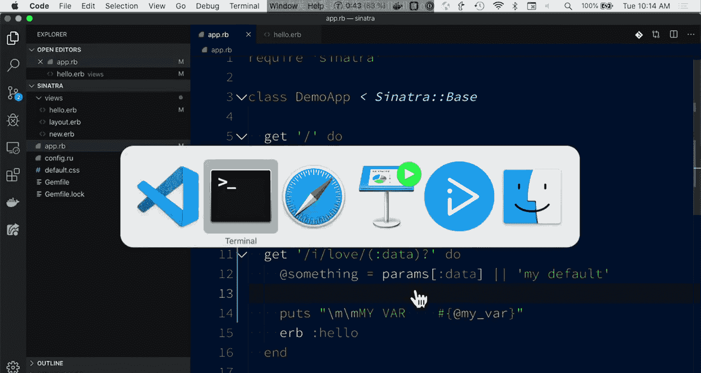

If you have some questions，What we have so far is。A Sattra app that between each request， you know。

 it doesn't have any session or any state。 So this is the same application。

Let's see where we are here。So I have a new application。 So as a reminder。

 all this is on Github as well under the flipped demos app。 So let me go ahead and。

So I'm going to start a second Sattra app that looks very similar。

And let's go ahead and open a new tab just so we have access。

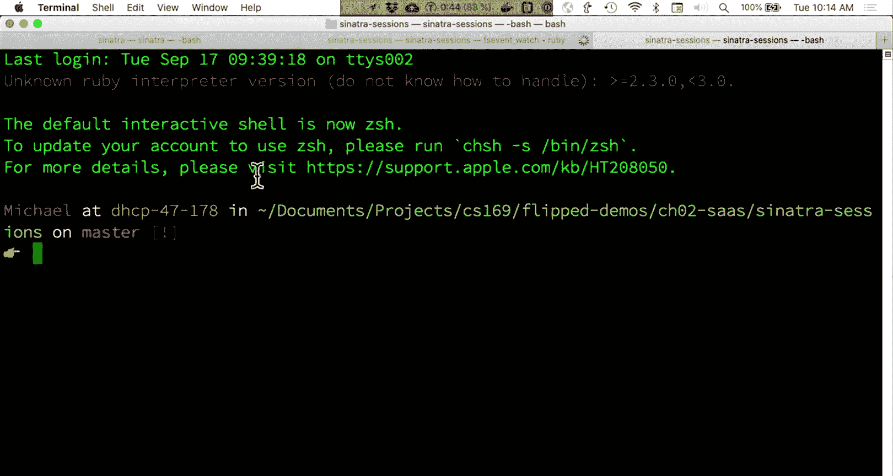

And open our application。And why are you being annoying？

So this application looks very similar to the one that we've just been working on。

 it has a couple different routes but。You know， one thing that we see that's different is this line here called in A S。

 So remember when we talked about cookies are the way of storing data with HtDP when you make your request。

The server can set a cookie， and the browser。Excuse me。

 well then use that cookie for the next set of requests。We have told Sinara that we are interested。

In having it set a cooking。 And so let's look at this new hello file。 So we have， again。

In this case now our slash route is going to render our hello file。

 We have our parameter or instance variable list time is now named someone which corresponds to the thing in our session。

 So the session in this case again is just a hash。 so my page it says hello someone。

 So let's try this out。

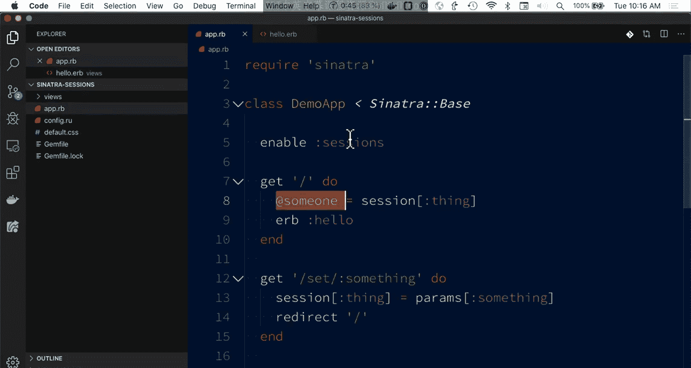

So this is a new app， right， so we don't have our older routes。We're just going to go to。

Just slash my page， hello and our session。

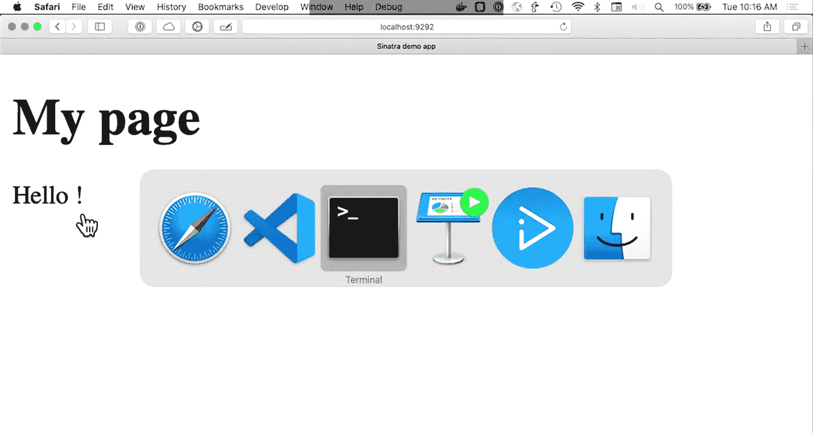

Oops， our session has no data。 We haven't done anything with it。

 We're trying to access thing in our session。So you we get what we expect， something's nil。You know。

 hello， someone， someone is nil， so it just renders the empty string。

So now what we want to do is try and set something into the session。

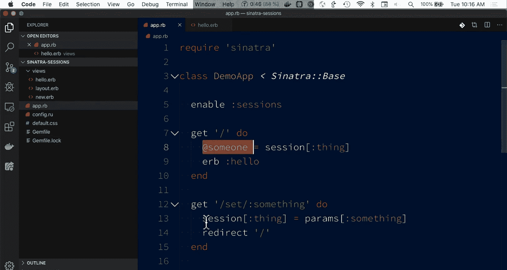

Looking at， let's see if I can。

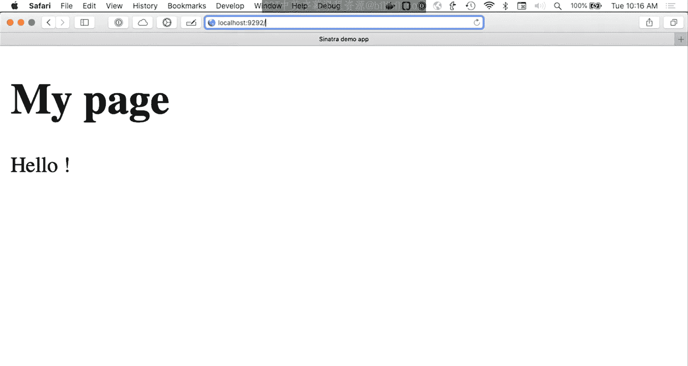

Srink the window here。Looking at this route here， someone。Someone tell me what I need to type next。

You can just shut it out。If if we want to try and set something in our session。

 what's a route that I should use here from looking at this file？Eat and then someone。

 someone give me or something I eat。So someone give me a set。 It would be very。

 very weird for this to be a person's name。 Someone should give me a name or something。喂佢播。Okay。

 so the very funny thing is that as I was reviewing last spring's lectures。

 the first person also shouted out。 Professor Fox。 apparently， all students think alike。😊。

If you want to know also here's a fun trick， percent 20。

 it corresponds to a space which otherwise you can't put spaces in URLs。And so what did I do， I。

 I put set， I put something。 I put in a value for a parameter。 I happen to encode it with the space。

 but that's either here and or there。 we could put sort of， you know， whatever， essentially。

 whatever we want in the URL， as long as it is of something that can be encoded into a plain text。

And so what happened？ We now have a page that has a session with thing in it。

 and we rendered this file。 So how did we get there？ Well， this is where I said。

 we'd talk about redirects， so。

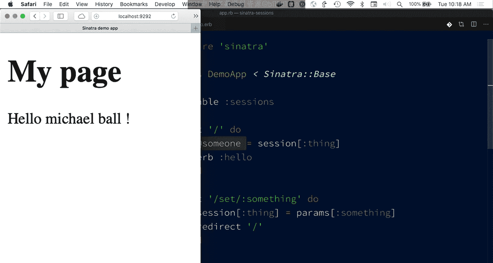

Our Sattra application sent a redirect to our slash route。 So that was a 300 type request。

 So all the 300s from HP。Which you'll hopefully see this week in homework are threedirectxs and then。

We have this variable from someone， and then we pass that in there。

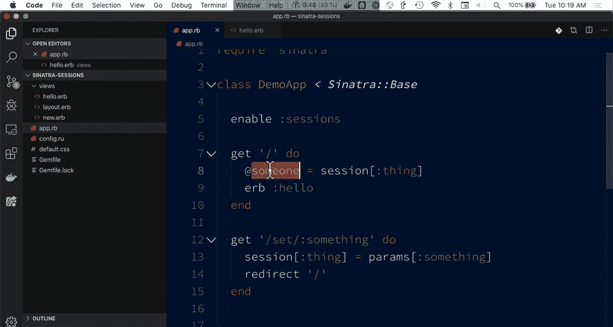

How did this work。 Well， this work on the internally by using a cookie。

 So what this now demonstrates is we now have a way for my own browser。 So， you know。

 I can demonstrate this by also， let's see if I open up a new browser。If okay。

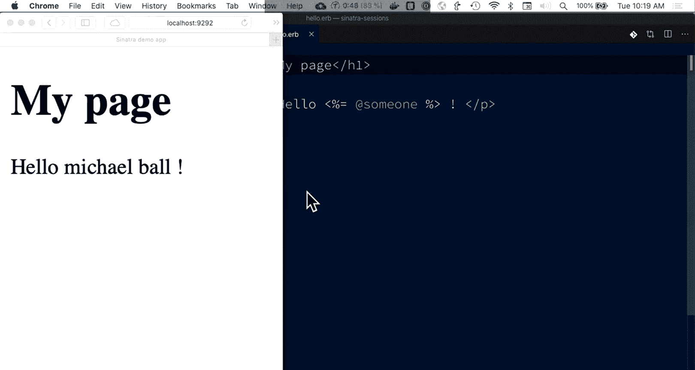

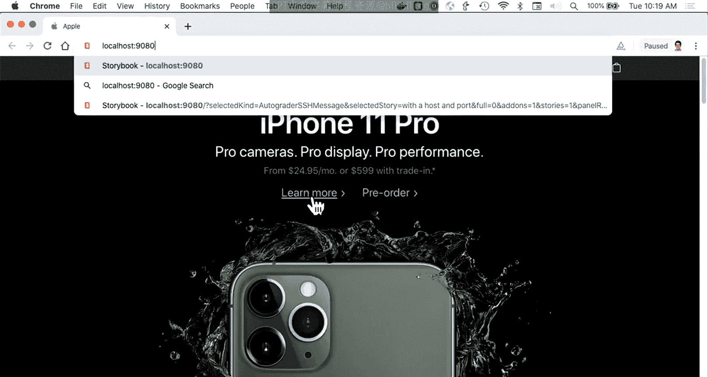

So I go to 9292。And I increase the size。 And so in Chrome， which has an entirely separate， you know。

 browser， this。This page has a different session。 So the session is local to not just a user's computer。

 but to their actual browser。 We can also just for convenience。 I'm gonna copy this。

 If I go over to Safari private browsing mode。 I open a new page。

 private browsing mode also will have its own unique session。 So Session are you know。

 they are storage， but only for that one browser instance。

 but just like everything else that we have seen so far， the session is a hash。

 we get to put data that we want in that hash。

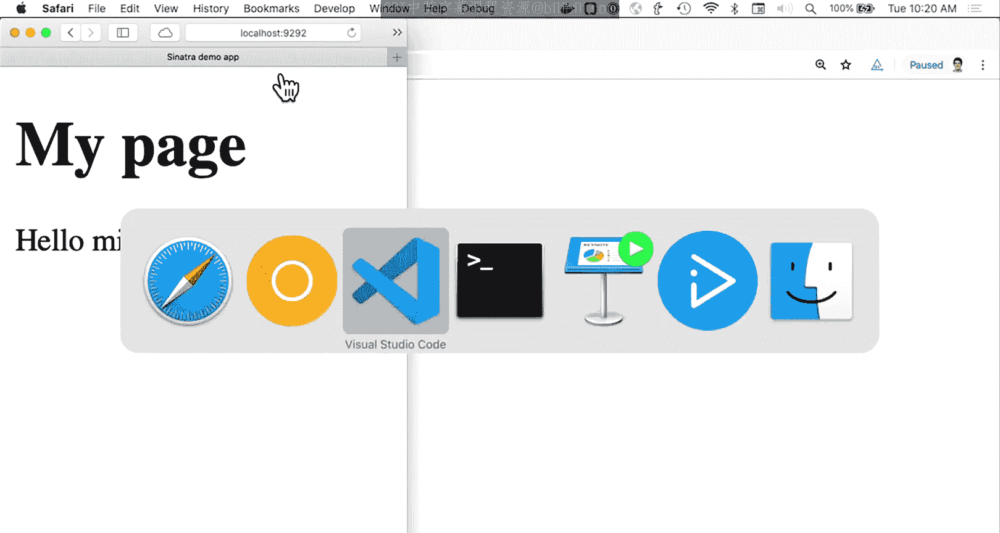

And it persists across multiple requests and multiple pages。 So questions about how this works。

 You know， you're probably just saying this for the first time。

 So all the questions today have been great， you know。There is。

 you're not expected to know how this works， which is why we're demoing it。 So yeah， questions。

 I expect there should be a few。Yeah， in the back I don't know where the mic is。

 but if we want to toss it。Back a little bit。Shouldn't a new tab also be a new session。

 not just a new browser。 So， yeah， let's see a new tab。

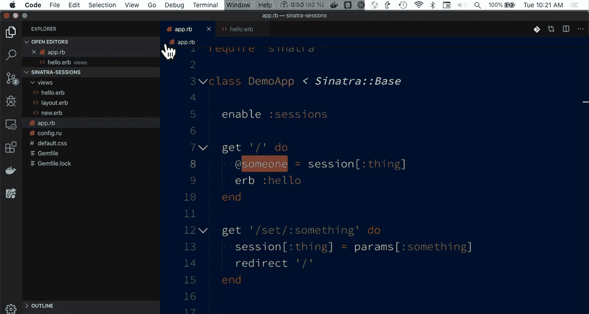

That will depend on the browser， so let's go through here and test it。So in this case。

 in normal browsing mode， a new tab is the same session。 This is typical browser behavior。

 And the reason is that if you are logged in to the same site， but have multiple tabs。

The session is one way is using a cookie that would be used across。You know。

 across multiple instances， you could potentially control this a little bit more。 but in general。

 you should expect the session to live across a browser instance。 And just to test this out。

 So I'm going to quit safari。

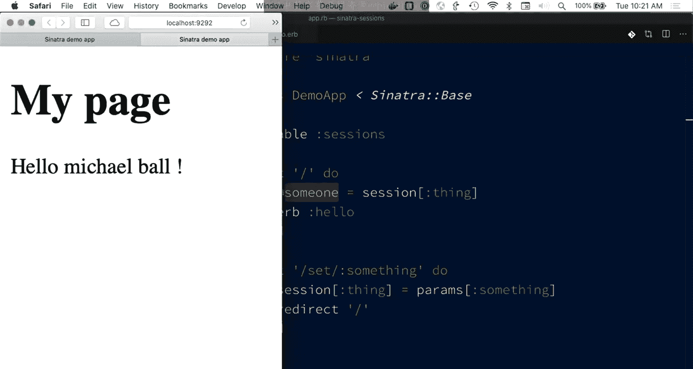

We're going to reopen it。

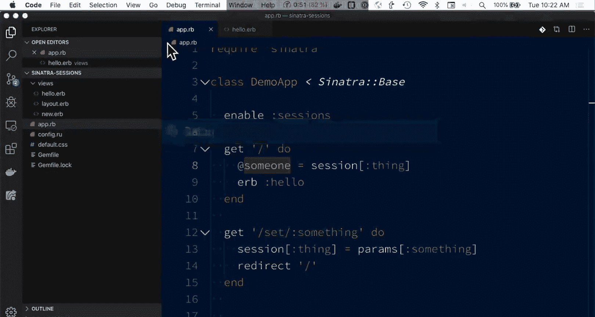

We definitely not going to open Slack。嗯。And so。The very first time Safari didn't actually reload the page。

 but in this case， Safari keeps the session around only until I quit the browser。And。

This is something that gets a little bit dicey。 So browsers that remember which tabs you have open。

 So Firefox Chrome， Safari has a similar implementation， but it doesn't quite do the same thing。

 Firefox and Chrome will actually now， in some cases。

 keep persisting Session beyond when the browser is closed。

 It depends on the version in the configuration。 So there's no like hard and fast rule of like。

 this should happen。 But in general，It's sort of expected that the session dies when。

 when you close the browser， but browsers are are the pieces of the stack that technically have control over there so。

You can't quite rely on it to stick around。Other questions， it's a good question。

Other questions on how sessions work。There's a question right here。 Oh yeah， oh sorry， go ahead。

 Just past the micron if someone's yeah。3。Is that something you can control by cookies as well to like get a session to last longer。

 like my Gmail session， for example， lasts extremely long Yeah， so。

I don't know the method in Sinatra， to be honest， but one thing we could do is we can look at。

 so I just opened the web inspector command option I on a Mac。

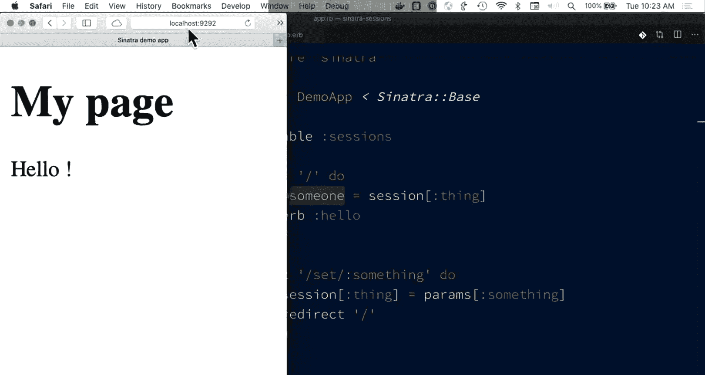

So what is actually pretty funny here is sessions are keyed to a browser。Also by not just the port。

 but just in this case local hosts， so other development stuff that I've done on local hostst。

 I have some other sessions from other applications。What we see is in this。

 this column called expires。 We can that the server， in this case， Sinatra or really the underlying。

Package or gem， which is called rack， which is the same thing that rails also uses under the hood。

 sets the expiration time for session。 So Safari happens to know that like when this keyword session is there as this cookie。

 I'm going， you know， destroy it when the browser gets closed。

 but you'll notice that some of these have other expiration time， so。这个。You。

 this one has an expiration time of August 2020， which case would probably have been one year since I signed in to a local copy of。

 if you took C S 10。 the language snap has its own cloud infrastructure。

 So this happens to be from that project， but these could be from any other projects。

 You'll also see that， you know， I have a bunch of Google Ana and Facebook trackers on local host and those have various expiration times as well。

 we can also do things like in this view。 So you know， we're gonna set the session。

You'll notice that the value here is。Not something that is nicely readable。

 which is something that Sinatra just handles for you。 So Sinatra will handle andrails as well。

 getting that data， but I can just tap the delete key。

 And if I go back Nat whoops not tab if I go here and refresh the page。

 I have now reset the data in that session and every time I reload the page。

 I get a new session cookie that answer the question。

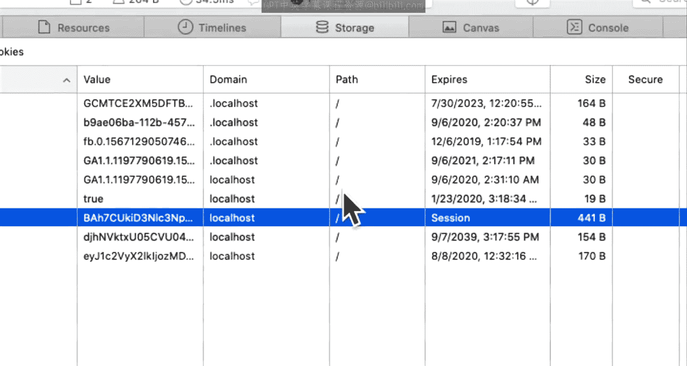

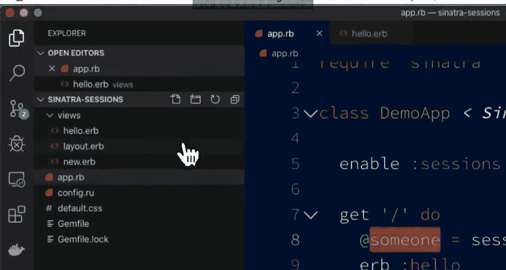

Co。Other questions about how session works。 Yeah， on the I guess your left side。

 someones to pass the mic or or you have it cool。 I know login works differently。

 but I was wondering if we could have two different sessions in the same browser in different tabs。嗯。

So the way that browsers work is they share the session based on the main domain。So if you have。

 if you want two different sessions， the website that is implementing this would have to know where to look。

 So what， when we make an H U P request。 So I can actually， let's see if I。

 let me turn on the recording for this。And reload cool。And let me just stop this。So。嗯。

Let's see where。So the way that this works is with each request。

 what I have on the side here is this giant set of cookies that have been sent to the server。

 And so all the data that you saw in that cookies tab。 So even my snap session cookie。

 which is from an entirely separate project that isn't even running right now。

 But my browser has that cookie， it's going to send it， you know， to。To the server。

 And so what you could do is since we have control over the names of these cookies。

 you could store multiple different cookies。 So in Sattra。There's like something you could do。

 so let me just make this a little bit larger。So。Soatcho's docs are pretty simple。

There is a nice FAQ and。There's， you know， a note here about how to use sessions。

 And so one of the things that it says is that if you want more control， you can actually use again。

 So rack session is the underlying library and you have control over how。You know what domains。

 how this works So you know you could choose to create a session named you know primary session in secondary session。

 it would be pretty hard to do this in a generic way that supports infinite amount of sessions per application but you probably also don't want your users to be logged into an infinite number of accounts at the same time。

 but you know you could do something like that， but then coordinating them across tabs would be pretty tricky。

 Yeah， so essentially you don't have much control over what the browser send you。

 but everything that you store in a cookie for that domain will be sent back with each request that the server could then parse and use how it wants to。

Other questions on sessions， Sinatra， things like that。Anything else？New okay。嗯。

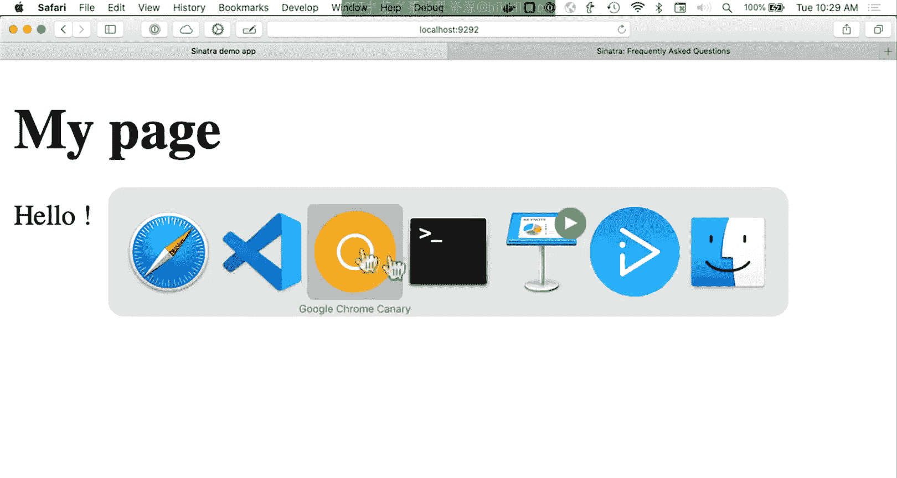

The last thing just as kind of an interesting demonstration to be aware of。诶。

Let's say I have a thing here and。I want to repeat it five times。

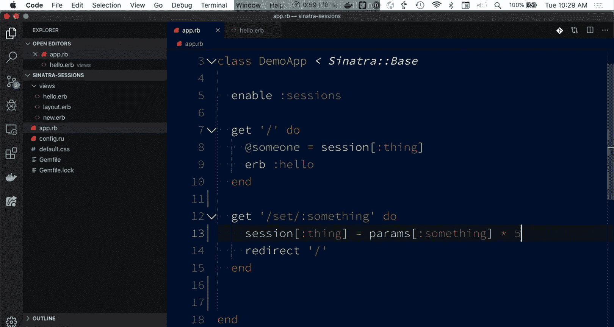

Which。You know， don't know why I would want to do that。

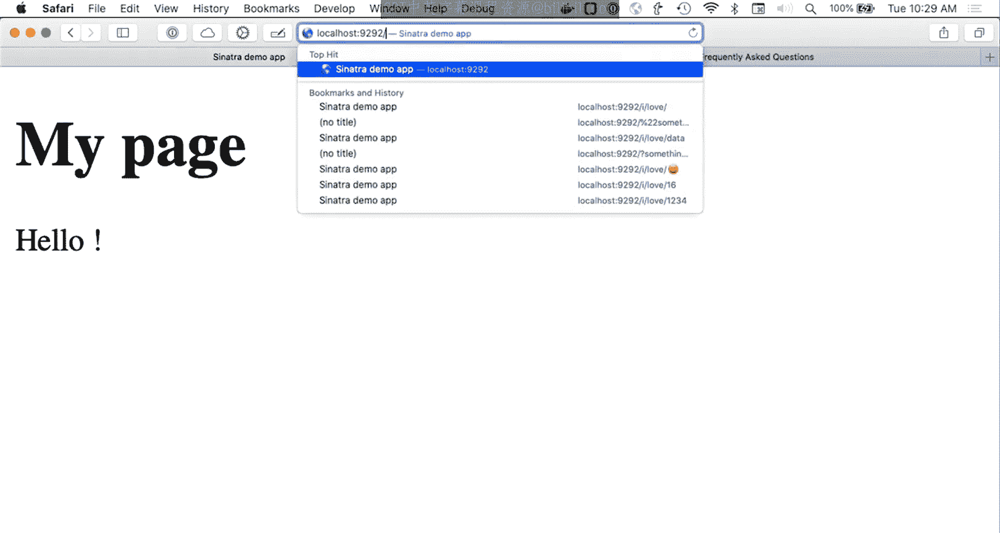

But。Is my app not running。

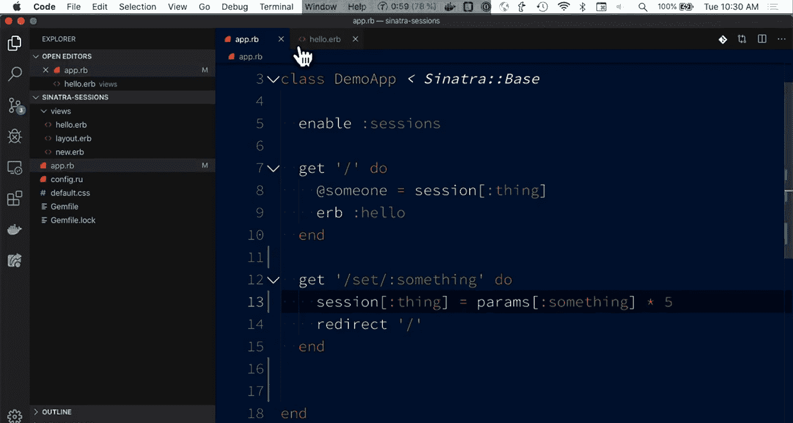

Let's see。嗯。Okay。So， if， of course， I didn't add the extra space， but whatever。 So I can， I can。

 you know， do whatever I can repeat my session a bunch of times。

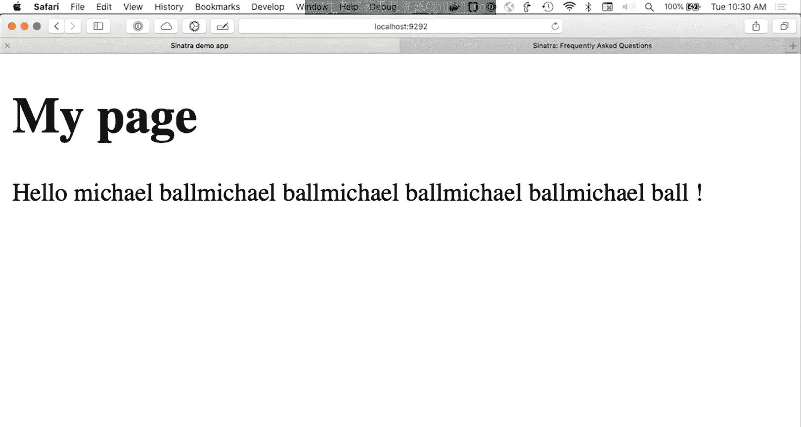

Now， let's say I'm doing something kind of ridiculous。And I put in。Let's do。Like 2，500。呃。

What do you expect will happen in this case？So want to just take a guess of what they expect might happen with the session in this case。

When I go。

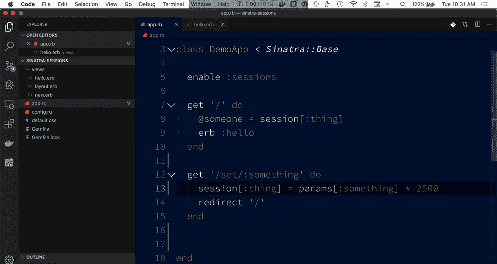

When I go here and I set and I reset the session。 So I'm not gonna do it yet。

 but does someone want to take a guess of what might happen when。A。

I enter and get redirected back to this page with a new session。They want to just shout out a guess。

Itll cut offYeah， so it'll cut off。 Okay， yeah， that's pretty reasonable。 So let's see。

 I got nothing back。 You would expect it to get cut off。

 That would be kind of the nicest thing to do。 In this case。

 what we're hitting is a 4 kB limit on a cookie， which is。😊，You know。

4096 characters and anything beyond that Sinatro just says， na， I'm not gonna。

 I'm not gonna to give you the session。 There is an error。 It just becomes nil。

And in rails you can configure things a little bit differently。 but the general。

 the general aspect is that rails will raise an error。 It may depend on the specific version。

 but will actually raise an error if you try and use a session that is longer than4 Kbytes。

 And so this is a a standard limitation of browsers。

 It is also one of those things that occasionally。You would say， okay， well， this kind of sucks。

 I might have a need for lots of data， but it's also good because it means random websites you visit can't write megabytes of data about you in the session and send them with a request because if they could believe me Facebook would use that to its advantage or other sites。

 not just Facebook， but you know Facebook。

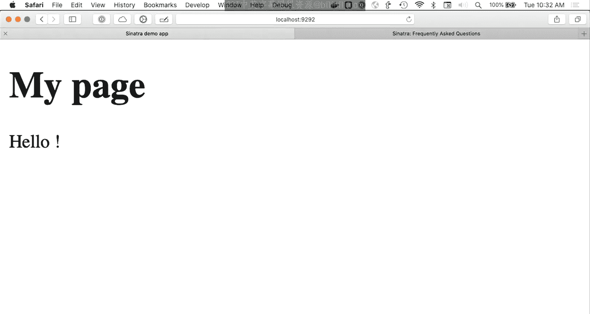

You knowSo so that's something to keep in mind personally I ran into this doing while I've run into multiple projects if you just store lots of data in a cookie。

 you'll probably run into it， if any of you have been Ts or use gradecope to upload a roster it will try and tell you emails any errors that happen when you upload and for some of our large courses at Berkeley。

 you upload you know a00 students and for whatever reason theres an error in each of their emails in the way that they're encoded you get a very large error message which was stored in a session because that's the convenient way in rails。

 and so then you have to think about how you deal with that in what kinds of truncation you have to manually write but that's something to be aware of in sessions using cookies in general whether they are permanent。

 shortlived you are sort of at the mercy of browsers。And how。YouAnd the ways that they handle things。

 but yeah。Anything else on sessions Sattra at what we've seen so far？Nope， cool。

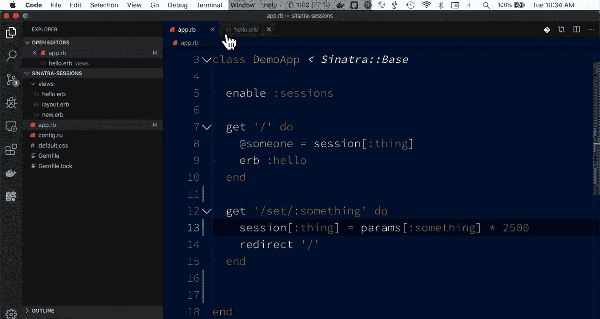

So。Again， so this is sort of where we were today with Sinatra。 and we're gonna skip， come on。

So we've demoed this stuff so far， and so again， main things here。Our parameters。

 Sattra handles taking that data from either a URL or a creative string。

 putting them in a parameters hash， and then you can get instance variables in your views。

And so that is enough to get working on homework3 when we release it next week now you've seen a little bit of some library management stuff so far you have hopefully tried installing rails。

Using a bundler and a gem file， maybe。but。Today， we're just going to go relatively quickly through。

You know， what we have with libraries。 So remember our slide about learning a language， right， types。

 typing abstractions。 And then we get， you know， through the various pieces。You know。

 we haven't seen too many Ruy idioms， but you'll get a bunch of this semester。 So today。

 this falls under libraries。And， you know， the rest we're kind of doing in a recurring way。 So。

 and then next couple weeks is when we will get into testing。 But today is libraries， so。

Software is great。 You have a whole bunch of， you know， ecosystem。 So， you know。

 for this class rails， of course， there's a whole bunch around node JS， Python and Django P， H。

 P and Larval is a popular framework。 But all of these have， you know。😊。

Big tools and libraries that you'll need to deal with。

 So with that comes things like version and dependency management。 When you upgrade rails， which。

For this course， upgrading rails is not necessarily something that you need to do you are welcome to try that for a project if it's not going to take time away from customer features。

 but we are not asking people to update rails because the real value is in delivering features for a customer。

But you know， you might deal in your internships in your career as the software engineers version management。

 So you know， when this happens， how do we keep things version together so。You know。

 all these tools have things that are in common。 so package management systems。

We've talked about bundles， the one for Ruby。NPM is the one for node Js。

 There's also now yarn because jascript likes multiple ways to do the same thing。

 there is you know every language has its own。 So Pip for Python you know those kinds of things。

 So all these have in common that we have libraries that are part of that ecosystem。

 libraries have version numbers and we need a way of keeping multiple versions of dependencies sync together so that when we deploy our applications to production。

 we get the right versions back。 If we always just installed the most recent version of an application。

 you could deploy your code and something would have changed from the time that you just tested it or your coworker would clone a new copy of your Github repo and they would get a whole bunch of different data so。

What packages help us do is they help us sort of manage that。

 So we've seen in our projects that we have gem files so I can open the one for this small Sattra app。

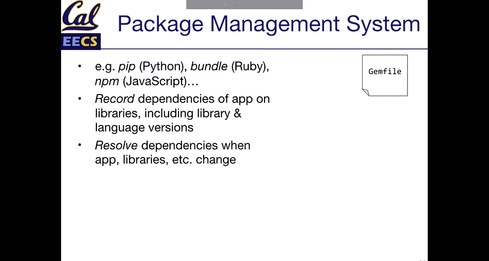

So we have a gem file。 This gem file is pretty bare bones。 It tells us a rubby version。

 It tells us that we're getting our gems for from rubbyjems dot org， which。😊。

It just happens to be the main package repository for Ruby。

 and it tells us that we're using a Sattra and it installs this additional gem Sinatra flash。

 But we're not actually going use that today。 But you know。

 we could put as many gems as we need in here you'll see， you know， in rails。

 you'll have a rails gem。 You may have something like Omnith to handle logins with Google or Github or something like that。

But you know， this file will grow in a regular application， so we have a gem file。

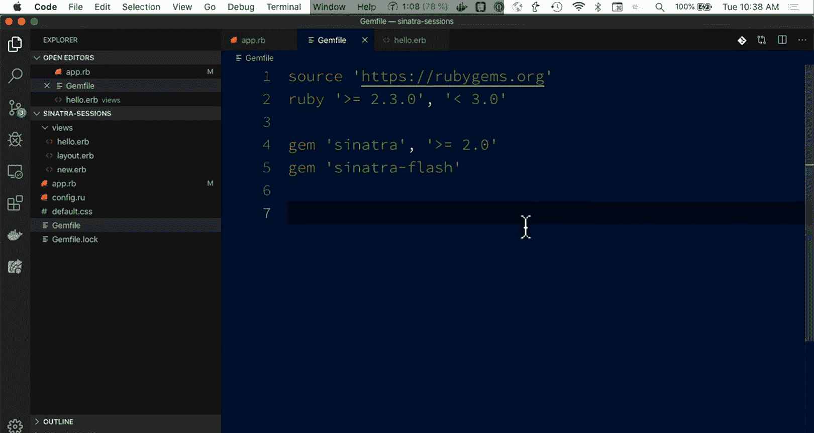

And what it listed there is the versions of dependencies that we expect to work with this application。

 So， you know， it said here that we expect a version of Ruby， which is in this case。

 greater than or equal to 2。3 but less than 3。0。 So we're just saying I've tested my application here on Ruby 2。

3。

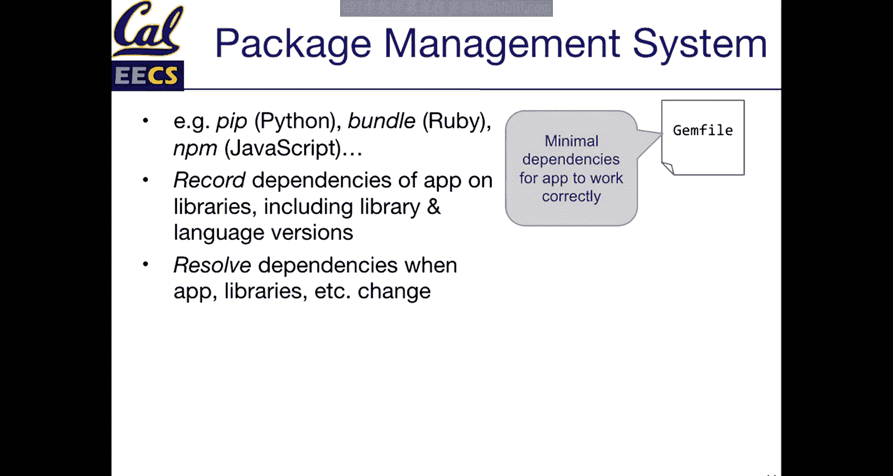

I know that Ruby is not going to change significantly before version 3。0。

 And so this is what I'ming as known and compatible For Sinatra。

 we're saying we're using something that is at least version 2。0。 And in this case， you know， we are。

We're not restricting the maximum version there。 We'll talk about in a second how we decide what versions are okay。

 And first theattra flash just saying， when I install this， I've used the latest version。

 I didn't bother thinking about， you know what， what versions might be compatible。 And that's okay。

 too。 you'll find that's common with a lot of gems。 No，1 to many tabs so。

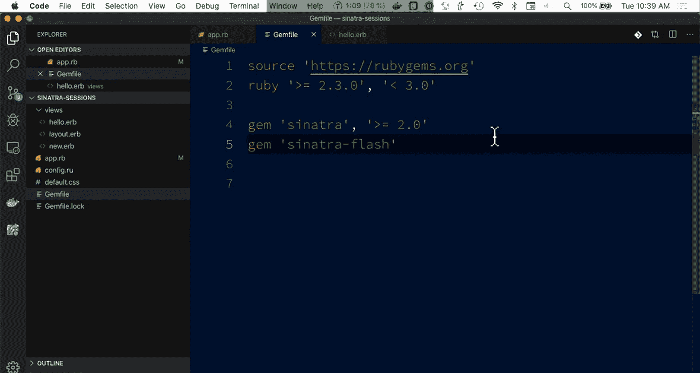

When we do something bundle install or bundle update， we get this gem file dot lock。

 and the lock file is what is going to actually keep our dependencies in sync。

 So this is going to say when I install record a series of gems that the tree。

 the hierarchy of all their dependencies and which versions they're using。

 And the reason for this is。😊，Because versions can change over time。

 our gem file is a loose descriptive of what might happen。

 the lock file is what is actually happening。😡。

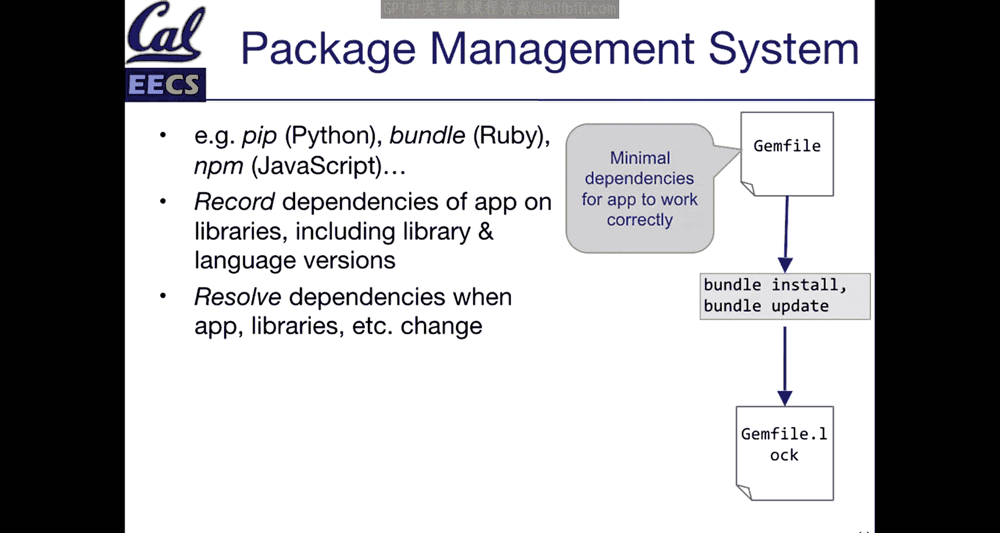

So when， you know， when we have that， we can go over and I can open my lock file。

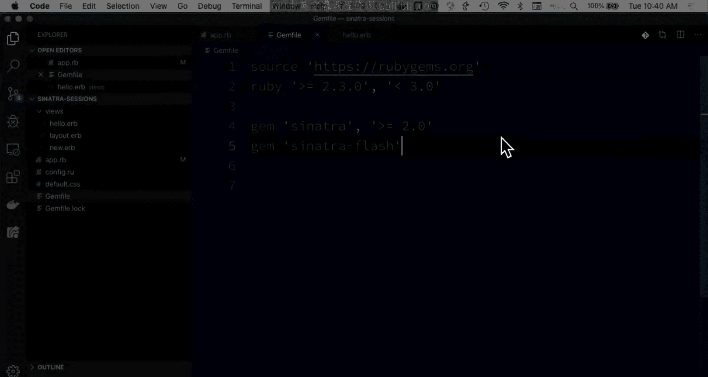

So now you'll see in my lock file， I have a lot more stuff here， not a ton more。

 This is pretty manageable， but you know it even tells me what version of bundler I'm using。

 just in case bundler happens to change between versions。

 it might bundler itself is very stable if you have used yarn。

 which is Facebook's JavaScript packaging manager， they have changed their algorithm relatively significantly between versions。

 which means the version of the yarn dot lock file and the version of yarn that you are using。

 can't potentially matter。It does some stuff to just sort of standardize what's in our gem file。

Interestinglyly， Br has this thing where you know you could use potentially something without Ruby。

 I've never seen something where there's a platform other than Ruby here each community kind of just sticks to their own thing。

 but。You know， supposedly it's there。 And the bulk of the gem file is this tree of dependency。

 So notice things are。Losely indented here with。The dependencies that we declared。 So， you know。

 we declared Sattra and Sinatra installed。All these dependencies with it。

 And then it also lists them again at。At a high level。 So， you know， Sinatra declared tilt。

 which is just something that renders different kinds of view files。 Don't really need to know what。

You know what those are。 but we've seen we've seen rack a tiny bit。 So， you know。

 this is telling us these are the actual dependencies that Sinatra declared and。

 and then at the top level， these are the specific versions that that our gem file has resolved to。

 And so what does that mean that means the next time I go and install something。

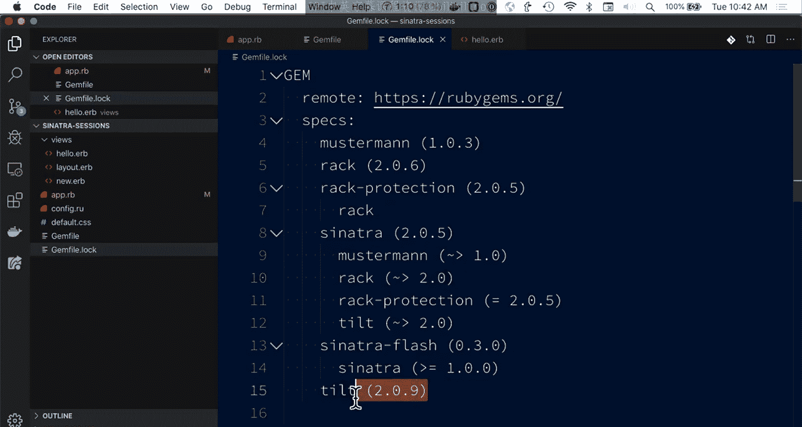

I am going to actually get the specific versions that have been requested。You know。

 if something has changed， so maybe we add a new gem to the gem file。

 maybe I change the version description， then what bundler is going to do is recompute that dependency graph and update the lock file so that everything is consistently in sync。

 but what is good here is that whenever a bundler does that。

 we always have a version of our state of our application， not just our own code。

 but everything that our code depends on to keep it in sync。And so the question then becomes， well。

 how do I know what。You know， what version should I specify。

 How do I know that I should say greater than or equal to Ruby 2 do 3 and less than 3。0 and not。

 you know， maybe less than or equal to 2。4 or 2。5 or something like that so。

There is this de facto standard called semantic versioning or Sver there are。

Dozens of debates about what the specific， you know， ways that you want to version minor things。

 but S is。Generally what most ecosystems have found to be a very simple way of managing and clarifying versions of dependencies。

And the reason this is useful is that it gives you some some clarity around what you can expect when you see a library you pushes out an update。

 So this applies to things that are meant to be used as libraries that have version numbers。

 it does not necessarily apply to things know like i or Mac or sort of consumer software In that case。

 you can version things however you want to you know。

 you can version them with cats or cities or candy flavors， although sadly。

 you know Google lost their fun， because they couldn't think of a candy with queue but。

That's all right， so versions。You know， this is just one scheme。

 but this is probably the most common scheme that you'll see。 And if you get bored as well。

 feel free to read the whole spec， but。There's really no need。

So all you need to know is major minor and patch version。 So X， Y and Z。

 So starting with the smallest Z is a patch version， these are generally bug fixes， minor updates。

 Maybe that's even something as simple as a documentation fix。But if you see a patch version change。

 what you get to know is that you know as a user of this library。

 I shouldn't expect anything to go wrong you know if something went from 3。2。5 to 3。2。

6 that patch version was just incremented by one， you shouldn't have to worry about anything。

The minor version。 So why means that there is maybe some bigger changes。 It could be a new feature。

 You know， it could be some bigger bug fixes。 It could be some large refactoring， you know。

 and what this really means is。You know。Nothing should break。

 Maybe the one thing that you can do in a minor version is add a deprecation， so saying that。

In this version， my feature is still going to work correctly。

 but now I'm going to warn you that it's going to be removed in a next major version。

And so the major version， why they're in red。His all bets are off。

 If something goes from version 2 to version 3， in the case of rails from 4 to 5 or 5 to 6。

 it's saying that。You know， you should expect there to be the possibility of breaking changes between each major version。

 So when you make that update， you're going to have to do some work on your end to keep things up to date。

And so this scheme just helps clarify what you can expect as a developer using additional tools。

 It's worth noting that， you know， these are recommendations。 these are specs， engineers are people。

 too， which means that in reality， there will be cases where sometimes a minor version might break something。

 even sometimes， you know if someone is not careful。

 a patch version could potentially break something right。

 You are always relying on someone else's code， which means， you know。

Think about if you are relying on an unknown classmate solution to get credit on a homework assignment。

 You probably wouldn't do that unless you trusted them。 So， you know。

 you have to build some trust with a library and a community over time。 But in general， you know。

 thats。A， you know， a specification that you can follow。 And if you ever start writing libraries。

 putting them out into the world， that is， that is one thing that。You can do just a side note。

 if you're ever in the position of like trying to order these， they are not decimal numbers， right？

You know，3， you know， things can go from 3 do1 do 0 to 3 do1 dot1 and 3 dot 2 you know。

 and 3 do2 dot 3。 And so they， they aren't like decimals where you know， you can only increment them。

 you can skip versions。 you can， you know， add occasionally some people will add a fourth。

 a fourth decimal， but。嗯。You know， in what。What you will。Now， you know。

 what you'll see is that for the most part in Ruby， we stick to this scheme。

 Rails is very good about sticking to this scheme。 So if you are ever on an old version of rails。

 anything that is a security update especially will always be a p version that you can update to immediately。

 And that's one of the points of that so。You know I mentioned the Ruby version。

 so Ruby also loosely follows semantic versioning and that's how we can decide that， you know in 2。

3 and 2。4 and 2。6 and so on are all going to be roughly equivalent。

 they have added new features in those minor versions of Ruby nothing major。

 but you know there are things where in 2。4， for instance。

 they clarified and merged the integer and float types， which for the most part。

 was done in a way that was entirely backwards compatible。But you know。

 it was a minor version because there could have been some slight incompatibilities。

 and then hopefully you've seen RVM RVM is a way that for each version of Ruby。

 it maintains its own set of installation of Ruby and its own set of gem files for each install So if you ever need to work with multiple versions of applications which you might between the homework assignments and the projects in this course you can use RVM to say RVM install RVM use to switch versions and that's just a handy tool。

 there are multiple ways of doing that for this course。

 you should only ever need one version of Ruby at a time because you won't be switching back and forth between projects like we'll finish homework assignments before you get into your class project。

But， you know， if you're working ever outside of class or if you're working on， you know， homework 2。

 well， not homework 2 in your project。 but you know， some homework in a project at the same time。

 you know， that you may want to take advantage of switching versions so。In the last few minutes。

 we'll have a clicker question。When we say version here。

 we mean checking these files into to version control。

 so we have each application has a gem file and a gem file dot lock。And are you going to yep。

 so which of these files do we want to check into our GitHub repository and do we want to track all the changes？

So just think for yourself and vote for this first question。

 and then we'll have you talk with your peers。Yeah。佢需听考翻我几得惊。Yeah。这个。我那。Yeah， so。

Things that specify alpha or beta after a version， the specific semantic version spec。

 I'd have to go and read through the details， but it generally says that whatever you do like after x dot y dot Z is up to you as a package or as a package maintainer。

And that， you know， it's all sort of within the same version。

 people do that so that they can sort of when you're using dependencies and the library management tools push out a new version without affecting things。

 but that's a way of saying that like I'll have you know version 4。0。

 I'll tag it as beta so that people know not to install it。嗯。And then while it's beta。

 you can keep pushing out beta dash1 or beta dash2。

 but semantic version basically says that like what you do outside of x。ty。

 Z for the most part is up to you as a library author。Was there another question？

Thought I saw someone's hand raised。Cool， so we're at 62 that seems pretty good for the room so far so let's。

Close that out。Nice， okay， so we got1 E， which is good， and we're pretty split between。

A and C with some good chunk of Bs。 So I'm going to tell you that it is。It is definitely A B or C。

So you guys are right。But。Let me hide that。 So take。

 take a minute and talk with your peers and convince them that， you know。

 if they one of A B or C that which one it should be。点睇我哋边。Yeah全学。即三西就咯全部同白或全部。現場もして一に。咩嗰哋俾你。사니까。嗰0。

They off like didn。Then by then lock lot and then final then by idea。Sort of usual。出。メイクはなでは開て。码码都话。

佢个譬我啲唔点咁要。你啲方唔系。レ를 보。买唔系。将。喺呢度。All right， so take about 30 more seconds if you can and we'll close it out at about two minutes。

ただ。I things in that love。暂时。不前。Yeah。自己可争。W to use。All right， put in your final votes or guesses。

 give you another 10 or 15 seconds。 the then price is registered， which is you want to use anymore。

 and that stay that。See if we can get a few more votes in。我知度我咁。在要为。说小春な人多て。All right， well。

 we're pretty close， so I'm going to close it。And。Okay， pretty similar。

But we definitely we seem to agree that we should， we should check in our gem file that we we should keep track。

 so who wants to make an argument why we should keep track of a gem file in our Gitthub repo that we should store this and that we want to know when it changes。

诶。Raise your hand or start。And why we make an argument for tracking a gem file？Where's anyone？

Oh sorry， can I pass the mic， wherever？Where yeah。I thought I saw someone's hand， but no。

All guesses are good。 Why might't we want to track a gem file。

 I can tell you that we definitely do want to keep our gem file in in our Gitthub repo。

 So at least a is half a correct answer。At least that， yeah。Thanks。

Maybe you don't even change your code but then it suddenly breaks。

 you want to be able to check your dependencies and know which one broke it。Yeah， yeah。

 so our dependencies are definitely important because I would。

 I would take that even a step further if we don't check in our gem file。Well。

 it depends on what you assume by a， but we at least need some way of knowing what dependencies our application has。

 right？ So if we check in neither gem file or gem file dot lock。

 then we would have no way of knowing。You know， of what happens， you know， you would just install it。

 You would do bundle install and there' would be nothing there。 Yeah， and so if our gem file changes。

 that means that we're changing， we're telling people that the versions have changed。

 So we do want to check that in because that also will specify some。You know。

 some additional stuff about our dependencies， what we expect to work。

 why might we also want to check in gemfil。lock？Or why we might not。What's。

 what's different about the lock file that makes Yeah in the front here， if you want to pass the mic。

Oh。Mh。😊，That's why it's， that's why it's squishy。 It tells you the specific version。 Yeah。

 of the dependency that you're using as opposed to like the gem file。

 which is sort of like a rough outline like， oh， this is between these versions is good。 Yeah yeah。

 we definitely want to know the specific versions。 So even if we don't specify a qualifier if we do specify a qualifier in our gem file about which versions are there。

 we definitely want to know the specific versions。 because if we were to deploy our code。

 grab a copy of our gems And that version changes， then we might not actually understand what is happening on our production system that we didn't see locally。

 So the lock file。😊，Is really important to understand how you know。

How we know that when that code is deployed， the copy of the the dependencies， the tooling。

 everything else in the server is going to be exactly as it was on our own machines。

 So we need our log file。 The other thing that we need the gem file for。

So we're getting to the point where we definitely need both of these files。

 We also need the gem file because if we ever want to change those versions or if dependent of one of our dependencies has its own dependencies that change。

 so if you ever look at the gem file for a rails app。

 you'll see that rails itself has quite a few of its own dependencies。

 if those ever change the original gem file helps us derive that entire dependency graph so。

Bundler itself， you won't ever have to go through and deal with it on your own。 But， you know。

 bundler is able to say， okay， you know， you've made an update rails or you've made an update to Omnith or some other gem that you're using。

 And let me go through and figure out this whole tree again。 because maybe the world has a new view。

 And so that is why we need both files。 And that's it for today。Hello。我都想不出来。

