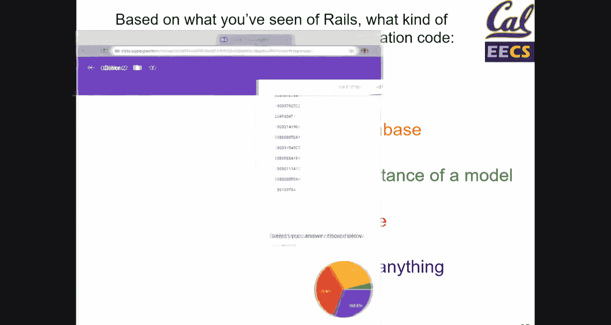
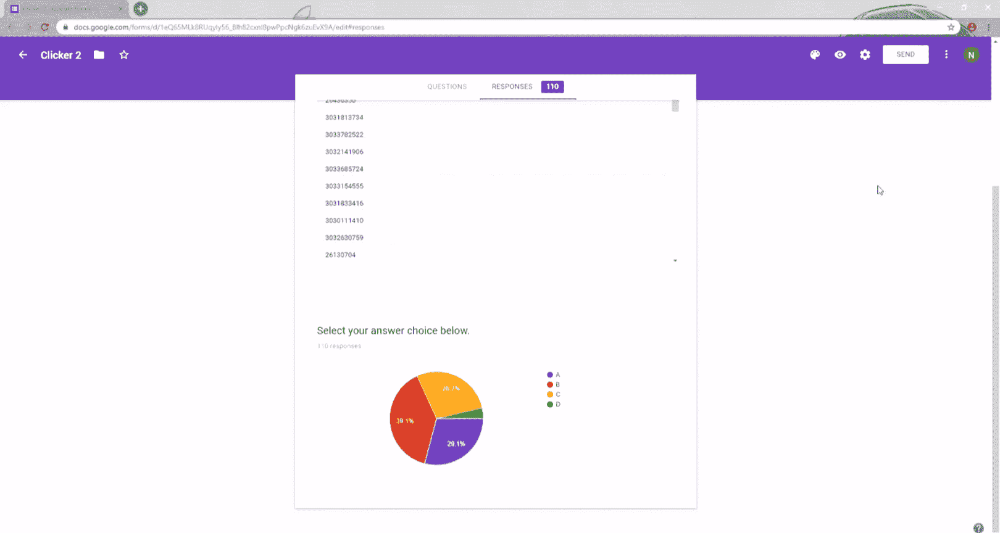
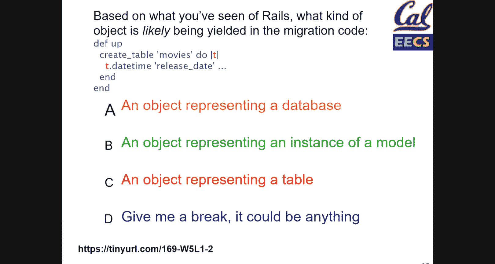
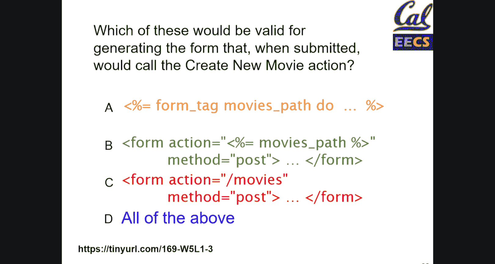
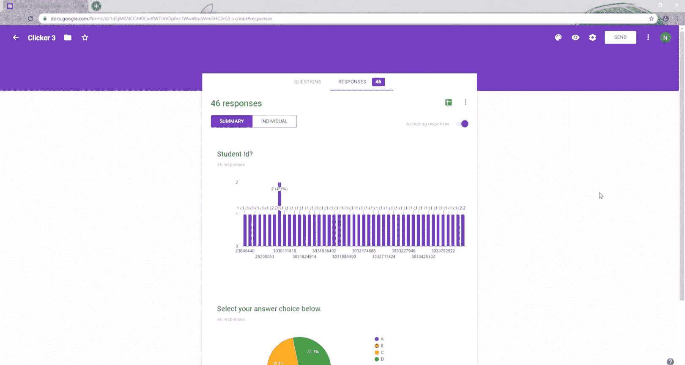
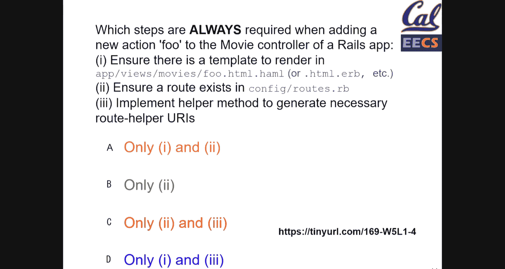
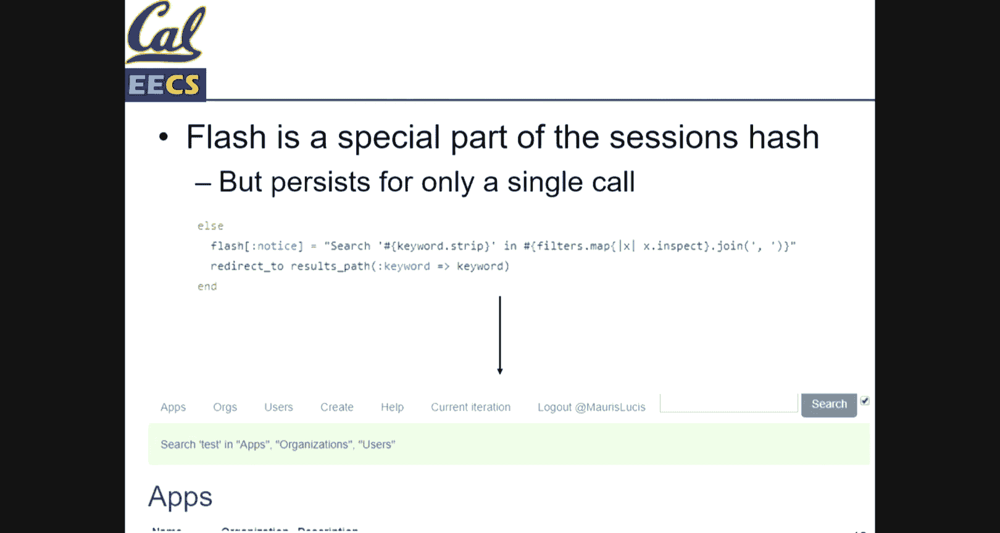

# UCB《软件工程｜UCB CS169 software engineering 2019》中英字幕deepseek p08 8 CS169 8.zh_en -BV1UsB7YPEMj_p8-

Test。う。Okay。Hello， welcome to lecture Professor Ball is out of town right now in a conference。

 so Jeremy and I will be leading it this morning。Yeah， so just some admin stuff right up front。

 we have homework  three due Saturday at midnight， we pushed it one day back from Friday because were a little bit late on releasing it so。

Yeah， we also have peer reviews for homework2 those are due Friday Friday at midnight as before。

 so make sure to get those in if you guys submit an incomplete review by accident it because a lot of people are for I guess like the UI is like inconvenient or something like that I'm not sure you could just like leave a message on Piazza and we can reset that for you to fix it。

Yeah， so today we're going to be going over active record。

 rail debugging forms parameterss and then like what flash is all right， so starting off right。

 active record， So this is related to database that kind of like we were alluding to in discussion in the past week or two。

So。How should we store and retrieve record oriented structured data and what is the relationship between data as stored and data as manipulated in a programming language so the key here is that what we're working with in memory like interaction programs is different from what we're actually storing in the database right because the database works in its own way you know you have like rows columns etc。

 but then what you're working with is like an object in memory and we need a way that will convert one from the other。

And so as for like where we're going to be looking at at this diagram that we keep on showing you。

 it's in like the app server and its relation with the database。

 and then also the model because the model is the abstraction for like the resource that we're working with。

 and it's the part of our MVC that is the most closely interacting with the database。So again。

 like we have this idea of in memorymory versus in storage objects and so we need a way to represent persistented objects in storage right so the way that we can store something in memory in the storage is like through serialization that's one way。

 So for instance， if if you're familiar with Java， they have like a serialization library so you could you know something that you want to serialize。

 you could say implement Java。 o。 serializable Python I think they have the pickle library right so the goal here is to just take whatever object you have serialize it into something that you can save just that your database can understand。

 and then when you want to retrieve it， you just deseialize it and you have the object again。So。Yeah。

So each type of model gets its own database table in rails。

 So when you generate a model automatically or you make a class inherit from active record dot base or colon colon base。

 then what you have is you're setting up a database table for that specific model right So I think in the these examples where we have like this movie resource that were subclassing we're inheriting from active record base。

 So for this we're creating a separate movie table and the rows of that table will be identical to each movie instance that we're saving。

 And in the columns will be storing the attributes of the model。 So essentially。

Transforming our in memory object， which has different attributes to this table where the column represents one attribute each。

And the basic scalar types that our database can handle are scalar types like int string date time。

 if you want to learn more about this， you could just look into the docs for active record。Yeah。

 and then each row has its unique primary key so this is not something that you have perhaps initially in your model that you would define right away right so when you're thinking of like a movie。

 you don't think of like an ID but the ID is what the database needs to keep track of which entry it is right so if you have like10 movies。

 how do you differentiate between the movies right so for this we have a unique primary key which is an integer always called ID that we can use to differentiate between them。

And we also have a schema in rails， the schema is something that's usually autogenerated by rails change when you make a migration。

 for instance， to your database， this isn't something that you really need to worry about or edit directly because after you make your migrations and edits to the database。

 it automatically updates to reflect those changes。

But like the schema in general is just kind of like the overview of your database。

 it gives you a little bit of insight on the structure of it in case you're curious what that is。So。

So like crud and SQL， right， as we were saying in discussion。

 active record is kind of like an abstraction on top of SQL because you have。

 let's say your in memory object， which is。Which is an instance of an active record base because whatever class it is inherits from it right so when you call those methods like doware do order。

 for instance， what it's really doing behind the scenes is it's generating an SQl query that will interact with the database so rails generates SQL statements at runtime based on your ruby code and like the operations that we've been talking about in class Crddy create read update。

 delete and then index as well， which is kind of like a different version of read like there are different ways to do this with SQl。

 there are some examples down there right So there's a aware query in the second one and then that first one is creating and then below we have update and then delete right So instead of like generating these possibly annoying SQl queries。

 you could just say like active record doware and then whatever you want so it kind of abstracts it all away so you don't have to worry about it。

All， so we have the ruby site of a model。So in order to make this all work。

 so you have your model right in your MVC， if you want to make this interact with the database table。

 you need to make it subclass active record colon colon base。So as I was saying right。

 it connects that model to a database table of the same name。

 and then it provides the CR operations on that model through active records methods。

So it can automatically assumes the name of that database right So if your model is movie or if your model is article or something like that。

 it then like just takes the plural of that so movie becomes movies， article becomes articles。

 it just kind of like can look on your class definitions in your files and figure everything out from there and that's how a lot of rails conventions work because you'll find out right just like if you use rail scaffolding to automatically generate some resource or something like that if you want to create movie then it will be a movie controller movie view。

 it can automatically kind of assume from what you give it。

 the structure of the files because of the conventions that rails implements。

And the database table column names are getters and setters for the model attributes。

 So if you recall， I think in a previous quiz or a question somewhere。

 we were we asked you about like how to access variables right So if you have a class。

 you need to define a getter and a setter in order to access that class's instance like instance variables of an object。

 You can't just say you know oh， this has some instance variable nu。

 And then you could suddenly say like instance nu， you need to define like accessors for that。

 And I think in one of the previous lectures， Professor Ba talked about like attribute accessor that you can give it but you don't necessarily need to do that with these models。

 because once you make your model inherit from active record base。

 it automatically defines all of those for you。However。

 you have to be careful because the getters and setrs do not simply modify the instance variables if you if you get it。

 you're getting it from the database， right， if you set it and then you save it。

 that's not only changing the instance variable of what you have in memory。

 but it also after saving it will change the record that you're working with in the database itself。

 So there's like that extra layer that you have to be thinking of when you're modifying things。

And more on that， right？ So the different ways for creating with an active record we have save and then we have save with an exclamation mark。

 So both of those actually save changes to a database versus create， which does new and save amonggo。

 So like what does new do right So new kind of creates in memory only a blank template of your model right so then you can update it with whatever you want。

 So for instance， we could have like movie do new movie dot title equals star Wars， right。

 And this is all in memory。 So right now we have some some resource。

 a movie resource with a title Star Wars。 But it's only on your program right now。

 So once you call movie dot save that object goes to your database and it's now there。😊。

But that only occurs once you do movie dot save。 Mo do create does both of those in one go。

 So you could say movie dot create， then pass it a hash with the title to Star Wars。

 And that would do the new and the create and the save， Ex me in one go。And once that's created。

 the object automatically acquires a primary key when I say created， I mean insert into the database。

 so once you call saveve or create， this idea is then associated with that model that you've defined。

嗯嗯。And so if the ID is nil or new record returns true。

 that means x has not been saved to the database yet， and thus it has not acquired that ID。

And these behaviors are inherited from active record base。 It's not true in general， of ruby objects。

So I don't have quicker software， however， I still made a quiz for you with the link in the bottom left down there。

Think about this。For people in the back， it's tinyurl。com/169。W5 L1。Does anybody need another minute？

ok。Okay， why don't you discuss in pairs now？So。Yeah。You could just use my laptop type， if you want。

Yeah。Yeah， no totally， it's fine。鬼。Yeah。じ。佢而家一佢多。我。Yeah。哋上前です。嗯。Okay。

 so who thinks that A will return a silly fortune？Does anybody want to argue for why a will return to silly fortune？

Take a guess， anybody。 Oh， we have this too。Is this on。That's where I want。

I actually don't know how this works。 So testing。 Oh it is。 Okay， cool。Actually。

 I don't think it will。I changed my mind Okay， does anybody agree or disagree with that？

You there up front， what's your opinion？Do you have a guess， what do you think。

 are you leaning towards one way or another。I said。Yeahah咁。Okay， so。Right。

 so we know that fortune cookies， right is some model that inherits from active record base。

 So we know that it has a table， at least， right， And we know that since it has the column fortune text。

 it must therefore have the attribute。Fortune text。

So this means that the Fortune cookie class has a fortune text attribute。O。

So what can we guess about， a， whether it's true or false？I'm hearing murmurs of true。Okay。

 what do we think about B。Does anybody have a guess one way or the other？Does he actually throw this？

Yeah。All right， that 1， I think will actually workca you said like。By inheriting act right your base。

 you basically like for all the attributes， you install like getters and setters like the adder accessor methods。

 So calling self do text will work just like that。Does anybody agree or disagree with that？

I'm seeing a few nods okay I will confirm that in this case it will work。

 but using self in Ruby can be a little funky depending on what you're doing because self kind of just refers to the object that's being used so like it could return a class variable in certain instances。

 but here it will work。What do we think about C？Will this return as a fortune text？

So what is this doing， What is fortune text， like what are we calling here？

Is this an instance variable？I heard it no。Okay， are we accessing the tables information in any way？

Okay， no， right， so what is this variable？What kind of variable is it？Yeah。Yeah。

 it's a local variable right， so this will not return what we want because we haven't defined that local variable yet。

 so this will just be nil so we won't get a silly fortune， so the answer here will be C。

Do you have any questions on that？Yeah。Thanks。So how did you know there is a fortune text？Colllum or。

 and。Entry in the table。Well we tell you we have a column up there。 right。

 assume table fortune cookies has column fortune text， right？

 And that means that yeah when we call at fortune text， like when we access that instance variable。

 we're accessing the value that's in the column。 So we'll get a fortune text。

 then when you say inherits from active record base， what does that mean。 Okay。

 so active record base is the main abstraction that we use to connect the model that we have in memory with the database table right。

 So we know that if we have fortune cookies， the class and it inherits from active record base。

 that means that there is a table for this model， Forune cookies that we can then interact with。😊。

So this means that whatever attributes that Forune cookie has。

 that means we have columns corresponding to it in the table。 And this happens through active record。

So since it inherits from active record base， that's all done for you。ok。Any other questions？

How do you know if self will refer to a class variable or an instance variable。

Good question here right， what we're talking about right now is like the instance， so it will return。

 It's a ruby thing。Read the docs。 So one heuristic is if you're like in the body of a class。

 So it's like class。 And then it's immediately like in that body。

 usually it's referring to like the class itself， I believe。 So like， that's one way you can。

Be generally aware。 That's like a common pattern of like， okay， self is the class itself。

 and I'm kind of editing the class not just a single object。And if thats helpful or confusing， be。

The yeah， it's context dependent。 And that's one common context in which the self will be the glass。

Right so so here right， the self is like the actual instance。 And we know that for this instance。

 we' have defined getters and setters through active records。

 So we're callinging that getter to get the instance variable。Fortune text。ok。

You look mildly confused if you have further questions。Office areas。ok。So I问 my yeah。Reading。

 how do we read and find things in the in the database， right？

 So one method that we've looked at in discussion is where， right。

 So we would do like fortune cookie dot where Forune text is something string that we're searching for。

 or in this case， right， movie dotware rating where P G is what we're looking for。

 You can also give it。More complex arguments， right， like that second line right there。

 So we're sorting by multiple things。 But what we really do not want to do is that third one， right。

 Mo dot where。 And then we just kind of like stick some string that we haven't validated into the SQ L query。

This makes us vulnerable to things like SQL injection attacks。

 where nefarious actors can like delete our database if we're。De like this， which is generally bad。

 right if we have a database， we don't want people to delete it without us knowing。

And then the that last one is also not always the best idea。 because if you call movie dot find。

 which the argument， there is some I D， right， So we know that every record in the table has some unique idea associated with it。

 right， So we're calling movie dot find with that I D to get just that single instance。

 But what happens if the I D doesn't exist。 Well， in this case， it will return an exception。

What what happens if our wear query returns something that's empty， like nothing matches。

 This does not return an exception Instead， it returns just an empty collection， right， So this is。

 this is fine。 And we can like deal with that。 So we just need to be careful and know like what the different queries can return。

 So just。Make sure your stuff doesn't break and you don't introduce like terrible security concerns into your app。

 which would be bad。And also， we can chain different active record methods methods together。

 So for instance， right we call movie dotware， then that additionalware。

 and then we want to order those results right， So what this does right。

 Act record will take these three things and turn it into one like overall SQL query that does what you want。

 So it does what that is。 and then it will return that result the results of that SQL query and there are other things that you can use like not I think I believe there's a method for not and just like all the different SQL things you can think of like they have something for it。

Okay， so we have a couple different ways to update。So first of all， right， we could。

Get the actual thing that we want to edit first from the database right so M equals movie dotware and then dot first because dotware always returns a collection so the collection is like all of the different items that were returned by that query the collection could only have one item So if you did like movie dotware IDd equals this then that would return only one thing because Id is unique and then you call dot first just to get the first element of that collection。

So once you have the in memorymory object that you want to update right， you could， first of all。

 use the set to modify the object in memory， then save that to the database。

 or you could do this you could do that in one go by just saying you know M do update attributes and then you pass it a hash of the attributes that you want to update and that will do that will change it and save it all in one。

It's also transactional， right。 So what if you pass one thing that's invalid into it， Well。

 that means the whole query fails， right， It's not just like everything but that one attribute gets updated。

 It's like the the entire transaction， the entire like transaction they have with the database either works or it doesn't。

 And if it doesn't， then the whole thing fails。 And also。

 if we want to delete something Then we could just call end dot destroy。

 And then that will delete it from the database。So yeah， just like a basic summary， right？

 So new save， create， those are all kind of like create operations。

 Remember that create combines new and save where that's used for like read and index operations。

 update attributes。 is used for update alternatively。

 We could update it ourselves with the set and then save it， or we can destroy for delete。😊。

So with this in mind， we have a second clicker question。

 and this is like the same URL with dash1 at the end if you can't read that。

Feel free to discuss with your neighbors。佢会。我。Yeah。就佢好但。可为。Right。Yeah。That was Arands。为什么？本当。Okay。So。

Who thinks it will break， so who thinks it C？We have a few hands。

Or hands that we're going to go up but so no one else did。 What about， okay。

 so for those of you for all of you that don't think it will break。

 Do we have anyone that wants to argue for one or the other。Yeah。系。And why do you think it will be B？

Because user one reads before user two writes， so the record in memory isn't updated。

Does anybody agree or disagree with that statement？Okay， I'm seeing syn normbs right。

 So notice that we like we read it roughly the same time。 but after we do that initial read。

 we never actually pull it again from the database， right， we call Mo do save in user 2。

 which does update the value of that movie's rating in the database。

 but we never actually check again in user 1 to see what it is before we print it。

 So therefore we will never see that R and it will indeed be B。

And it doesn't error because you can totally read it roughly the same time， Datas are robust。

Questions。ok。I'm going to move on。Onto databases and migrations。嗯。Right， so for this right。

 your customer data is golden right so what this means is we do not want to delete or just otherwise mess up the actual production data of our customer。

 So we need to be extra careful when we're making modifications to the database right so let's say you have some table which has some super important data for your customer but you now want to add like another column to this to this database to this table excuse me So we need to make sure that we do it safely and we don't like overwrite everything we already have because that would be very bad So we just need to be like generally careful when like developing new features we want a way to like track and manage schema changes because like what happens if that's adding adding a column like completely breaks everything like we want to go back I there a way that we can do that and the answer to both is like automation right So instead of manually making those changes to the columns ourselves we can like。

Autommate it somehow so for this， right？There's a rail solution。

 which is a migration script right so you can kind of define like you can kind of define， you know。

 given this table right that we want to change like here's what we want to do， you could say like oh。

 we want to add this column， we want to do this right And so then it will apply that change across the entire table or whatever or tables depending on what you specify。

 And so this kind of like cuts you out from the equation right So as long as your migration script is correct then you are able to just make the whole thing like make the same change consistently across whatever you specify。

😊，And additionally， right， so rails， you have development production and test environments that each have their own database right so when you're developing you could have like some sample set that's completely different from the production data that you have。

 So any changes that you do make that could be breaking。

 you'll ideally make those in the development or test environments and so you'll be able to like smooth out those bugs before you actually push it to production。

And if you do break things， then you are able to roll back by just applying a previous migration。

So you can identify each migration and you can know which one it was applied and when。

 you can manage it with version control。 And because it's automated， kind of like I said。

 it's repeatable， it's reliable。 like you're not like individually doing it。

 So there's less chance for just errors to happen right So the theme here is like don't do yourself just automate it because like once you specify what you want to do in the actual script。

 it's all done for you， which is nice。And so like along that theme of automation right。

 another thing that we will be working with because we're working with Ruby on rails or like code generators。

 So I think in the previous discussion worksheet， if you got beyond initial setup errors we worked with like rails generate such and such So like what this does is this is like a code generator So it generates like a file where you can add your code and sometimes depending on what you're adding generate something with code itself in it and then you could apply。

 so in this example right， so we're generating a migration script。

 So Ruby rails makes it for us so then we could just apply that migration to the development environment by running that command right there and then we could apply it to production if we want by running the heroroku run command。

 So this assumes that our production environment is live in some some Heroku environment and that's generally the case for this class but know that might always be the case depending on where you are but here the command to apply that migration to production。

Heroku run。And so。When you apply that migration， it records in the database itself。

 like which migrations have been applied， so this is kind of part of that keep in track of things that I was talking about earlier。

All right， so just like some general RELs cookery。Generally。

 when you're augmenting the app functionality， you'll be adding models， views。

 and then you'll be editing like the controller actions。

 Those are like the three main things in your MVC app that you'll be touching so。

Don't don't don't touch like most of the automated rail stuff like their configurations unless you know what you're doing。

So to add a new model to a rails app right so you could do this manually。

 you could do this through migration script， but here's an example right creating a migration kind of describes the changes so let's say you want to rails generate migration then like whatever you're doing and so when you want to apply that you could say ra Db migrate if it's a new model as well you need to actually create the model file in your models folder because of how rails works right NVC you have your model's views and controllers folders which each have know the model views and controllers in them respectively so if you want to make a new model after applying the migration for it then you have to make sure that you edit the actual rails files as well。

And then the， the database schema is updated automatically through rails。 So here， right。

 if you want to update the test database， you could run that command right there。

 And this is kind of like what I was saying earlier。

 Like you never really touched the schema yourself。

 It's kind of updated automatically based off of the changes that you make to the database。

So we have another question。 This is that URL dash2。

So the above is an example of like what a migration might look like right so this says that like when the database goes up and you're creating that table movies。

 then you want to give it a date time field。So feel free to discuss。Yes。Join to see whatever。啊。啊。😮。

I have surf， I have to find it。So if you go to the URL， and you should see。True。

 like in the second tab response which is Yeah okay， I'll do it in a minute。把れ。

I looks like I can do it on this side here。Clicker two on oasis clicker two。Yeah。对。ok。

So it looks like。Most of you。

Are saying。B， so does anyone want to argue for why B is true？It's pretty good spot。Anybody at all。

 we have 39% of you， really 37， and I think some people hopped on afterwards that think it's B。

Do you have any takers， be brave。For option B， you said like doing the code is adding an attribute to each individual T object。

 So I think the log would print out like successfully added this attribute to this specific instance。

 so。

Yeah， so it should be like， like an instance of the model movie。嗯嗯。Okay， so。Does anyone？Agree。

 disagree with that。What do you think， Jeremy？Option D。Okay， so okay。

 I will tell you that it's not a because like we have the database already。

 like this is not going to be returningjo the database。So。

Do we have any reasons for why it could be be your receipt。So what is an instance of a model， right。

 This is a single。Like a single instance of like whatever resource you have， right。

 So if we have like the movie table， movie table， the movie model， right。

 an instance of that would be like one movie。 So it would be like， you know。

 movie with some title Star Wars， right。Whereas like a table itself would just be the in the case of a migration。

 right， the revised version of your movies table， for instance， right， So here we like。

 we're creating with the date time， right， So this。

This would be like creating the table movies right with a column representing daytime。

I'm kind of giving it away。嗯。So I think I've hinted that it is most likely C。Because again。

 like when you're making a migration， you're not really working with like a single individual instance of a model right？

 So like like never in this， do we actually return like one movie that has like you know。

 a certain idea or like a certain title that's like Star Wars or something like that right。

 where we're creating the actual table in movies we like editing the database to like create this table So like what's actually being worked with and yielded is that object that represents the table。

ok。Any questions？Questions。

ok。Okay， should be。Good。

Great， so moving forward， now we're going talk a little bit more about how this integrates with things you should be familiar with at this point。

 but controllers， views and forms。So。Some more Ra recipes。First。

 if we wanted to add a specific action， a new action to a Ras app。

We need to ensure that the route is in configure， so it's specified our application knows about it。

We would also have to add a actioner method for handling requests for that route in a specific controller。

And not all actions render view， for example， a， a post request。

 like uploading form not doesn't necessarily have to render review view or or delete or something。

 So these not every action will have a view。 but if it does have a view。

 then we'll also need to create。A view file that will be shown as a response to the request for this specific route。

Excuse me。So。There's a reference to the book here。What we'll do is essentially show is also like providing this view。

And update is a way of essentially changing data that already exists， so。诶。This should be apparent。

 so let's move forward。So how does this kind of integrate with forms and handling user data。

User data is golden， but also needs somehow。 it need some way to get into your application and be saved and stored in your database。

 so。How do we do this？Creating and updating resources。 So there's two different ways here， so。

Newer edit。 These are common。Paths or routes that would be associated with these actions。

In a restful manner， and。Other comment are create or edit So。 you have a。Submit， so this will be。

 that's it。即。There's a part that would be maybe just getting the form and then a part that could be used for actually submiting the form。

Right。嗯。So these things， we have this。View that we want to show or that we want to provide。

The user's browser with or， or client。 And so we need some way to get the data。

 And this data comes from our， our database and。That would be access in the request and in the PRs and。

Kind of conversely for the form submission。We need to get the previous data and populate that so that we can have a way for editing it。

There's also another question about what do we show after something has been successfully created or rendered。

 which we'll get to with a common pattern is to use a flash。But I'll talk about that in a little bit。

 so before we get there。So when we creating a。New submittable form we need to first specify or identify the action that is hosting the form。

 so which which page will user go to to see a form to enter their information。嗯。

You need to identify an action that receives the submission。

 So usually this is a post request handler。 It's taking user input data and creating some new record or information in our application based on that data。

嗯。Coupled with these are the the routes， actions and views for， for each of these， so。This includes。

Like the form data。 So the， the name attributes， I think this should have been partially covered in some of the Sattra worksheets。

 but obviously a lot of issues there as well， so。In general。

 the the form attributes or based on their name parameters will。

Be accessible through PRs and keys specifically。 So if some encoded information is in your initial form that's submitted with a specific name attribute in the kind of view。

 that will be accessible as a key in your PRm in your post or request handler。

Given that this is such a kind of common pattern and to help deal with some of the boilerplate。

 there's a lot of helpers that facilitate the process of collecting and cleaning user data from forms。

Yes。Realms form helpers。So。Let's kind of work through。Simple for， is there other？It's just that。

There probably should have been something more。Maybe this slide is incomplete apologies to the viewers。

But we do have anotherquiz。Today is a wonderful day。 Okay， so this is like the other one。

 But now it's dash 3。 So instead of putting dash 2。😊，Put it death three。Yeah。

 we'll give you a little bit of time to submit this。Think about。Your answers。

 So which of these should be valid when generating the form that when submitted calls the create new movie action。

 Just like a quick sub question。 Does anybody know what that。Bracket percent sign。

 and then percent sign bracket syntax means like what does that signify， Any know。As a hint。

 it's used usually in an ERB file。Oh yeah， Sir。run。Right， so it means run the code as Ruby code。

 And this is this is this thisintex is specific to ER RB， right， So just know that like in ER RB。

 right when you see that， you know that whatever is in between is gonna be Ruby code run。Anyway。O。

Wch should I go to the。Page。Okay， you want to mention non output returning Ruby code as well？Also。

 as a follow up。

In addition to having Ruy code in your view file， that returns。A specific value for some。诶。

Purpos of displaying as part of the view。 You can also have things like four loops that don't necessarily return a value。

 but are used for。Kind of just like functional code to generate multiple parts of a view。

 But in general， you don't want to put too much logic into your view。

 But this is kind of a heuristic thing。 So now that you see those results， feel free to discuss。

You scroll down slightly or yeah。 Yeah boun。I see I see。So like什么意思。

would thingOh in the middle in the middle only， okay so works not so much。Okay， so like okay。Co。3。

You don't have to refresh it。 It updates live， nice。Yeah。How did the other one have 110 responses。

 Why I got。Oh， wait because people can mo it Okay， okay， okay，right， And then people then Okay， okay。

😊，I just like there's either like 50 people watching at home， I was like， what is going on？Takeト。

Yeah we yeah。かとす。All right。So does anyone want to hazard a guess， The risk is literally nothing。

Excellent。I'll just say， I don't think it's a。 I don't know。 It just doesn't seem like it calls。

But create new movie action。 just， it's like the instance， or like， it starts like a for loop。

 I don't know why that would do anything。Hot potato。 You there。Ging the。The box。 What do you think。呃。

I chose C。You just feel kind right。这个。Does anybody think C is not true？Who thinks he is true。Okay。

 I see hands。 This means it has to be true。 right， So she is indeed true， right。

 because we're saying， okay， we want to post to slash movies and post。

 We know that we're editing the database So this would most likely correspond to create。嗯。

So note that， right， let's say we're running ER RB to render this file， right？

 So this means that before we even like read this as like some HTMLL code。

 This is just kind of like an input file， right， And so ER RB just goes through line by line and replaces this the。

Stuff inside here with whatever the value actually is。

One thing that you also might not know is that when you define a route in your route RB file。

 railils also kind of like generates path helpers for each thing right so if we have like the movies' path is denoted to movies right So it will create kind of like it'll take your plural right movies and they'll just add like dash path or underscore path to it right And so then when you call movies path railils knows to replace this with the actual path to movies。

So now that we know that C is true。What do we think about B， which is very similar to C？You there。

What do you think。Earlier， you said that everything within the brackets are executed as rails file。

 rails code， a rubby code。 Yeah， so I don't think that's the case here。

That's probably why I chose see。 I don't know。 Not quite sure。So do you think that like。

 what do you think movies's path is going to evaluate as in B。All right。

 we have one guy that says whatever we set it to in the controller。

 does anybody seconds that or go against that？You， you shook your head。You said it was defined by。

 I forget which thing we were using， but it was already predefined。 We didn't have to define it。

 So I think it already has the value for slash movies。Yeah， like movie's Pa would dev to that。T。Okay。

 so that is indeed correct， right， Mo's path like this is gonna be run as， as Ruby code。

 kind of like what that guy said。I don't know anything。 I'm sorry， I'll ask in the future。

 this is good learning， okay。Movie's path right， so first of all。

 is it a problem that this is inside quotes？The answer is no。

 because we don't even read this as like HML code yet， right， We just kinda go line by line。

 And literally like， if we see this， like regardless of what's around it。

 whether they be quotes or not， it just evaluates this rubby code。

 And we know that in the controller， weve， we've defined this movie's path。

 And so this movie's path will then work。 It's like route RB thing。

 If you want to define a new one and give it a helper as well。Then you could say like。

Let's say you wan to do。Movies dot or like。Moving。Slash ad or something like that， right。

 So so you could say like movies dash movies slash ad， you know。

 like when you send a get request to that， you could route it to some controller action。

 and then you could say as and then you give it a name， say add right。

 So then right you would have access to add underscored path because rails knows that this path is known as add。

 So if you want the path to add。 then you can access that in your code。So similarly， right。

 we have this movies path already defined。 So we have access to movies path。

 and this will then this will just be identical to C。 And we know that C works。 So therefore。

 B must work。 So's now the slightly trickier one is a。 What do we think about a。So what。

 first of all， is this Ruy code。Lots of people are nodding， okay。

So what do we know about movies's path now， so what do we think this is going to evaluate to？一的看。

I don't know。So form tag what do that's the URLL to movies。And slash movies。And。

In case none of you does anybody know what form tag does？Okay。

 so this is like a rails helper for generating a form。 And so if you feed it like the path。

 and then in between， right， So you'll do， you'll do some， some do keyword。

 And then you'll have like whatever you actually want in the form。 And then you could end it， right？

 So that actually does generate a valid form that will go to movies's path。So。At the end of all that。

 you'll get something that looks shockingly similar to this。So the answer is indeed D。

 all of the above。So that' that's good。 That's good。You still have plenty time question。For a。

 how does it know to do a poster get request， Ca we never specified。

 And both methods might be there at of。At that path。I think it's specified in the documentation。

 I don't have it memorized， but I know that's right。It's probably that， in general， the form。

Smitting a form action， the browser knows to submit a post request and not a get request。

 So that would be not even at the rails level， but at like the browser specific level。

So perhaps for like the documentation of the form tag， the default action is post。

 and if you want something else， then perhaps you specify it yourself。

 but like the bottom line is just like， look it up。Great， going forward。So。Big slide。

 But the idea is that。There are many patterns here that are that rails employees。

 but also extend beyond just this specific。Architecture that we are using for this course infrastructure。

嗯。For example。Rails， there's a client server pattern， you have a centralized server。

 alternativetatives include peer to peer networks。There's other ways of basically like distributing。

Server loads and access to data。 There's different ways of structuring the internal application logic。

 model view controllers， one。There's different ways for different forms of templating and。

Different ways of managing updates to data。嗯。Yeah， so。There is。Basically。

 we're trying to teach them kind of。Popular pattern， but there are many alternatives and so。

Knowing about some of these alternatives helpful in that。A， you're aware of what the trade offs are。

 And so you can choose to modify what your application architecture is like based on the demands of your。

Relationship with a client or your， your specifications that you're trying to meet and also just kind of being aware of different technology that's available to you。

 So we'll go through some of these alternatives。嗯。So data Mapper and other no SQL another。

Popular NoSQL is MongoDB that you might have heard of。But。🤧This is also used by Google App Engine。

The downside is that， essentially。Because of the structure of how data Mapper is。Constructed。

 it can exploit the relational database optimizations that something like SQL provides。So。Now。

 this should be semi relevant for homework and future the next REs homework as well。

One thing is that rails is very popular。 And I guess rubby Sinatra。

 these are all things that a lot of people use professionally。 So there is a wealth of prior。

I guess documentation online for common issues。 So this is also generally like a helpful skill to have in in practice for knowing how to kind of resolve your own issues and。

Kind of move forward a little bit more quickly。 So in addition to to Google。

 documentation as your friend， both specifically for rails and the Ruby language and stack overflow。

 though often Google's results will point to stack overflow。Okay， so more debugging。

Kind of stemming off of this。D R Y is don't repeat yourself Ras I actually had to look up。

 I'm not sure what the actual acronys， but it's like remote。Applications secure。 I。

 I I'm not sure about rasp。 and it was not on the slide note。 So I don't know what the。Actually。

 do do you remember I don't， But I just want to point out that like what this slide means you can see there's like that little top 10 logo in the top left corner right。

 So I believe like the deal here is they ask like previous 169 students like the most helpful things that like they found just like throughout the course and out of the 1 this is like the first。

 So this is what people value the most and this was， you know， just like reusing others work。

 And as someone who has taken 169 in the past like do not reinvent the wheel because that wheel will then like break and roll over you and you will die。

 So yeah， try to try to use as much as possible。Yeah。Okay， so。Debugging is tricky。

Part of this is because of the many layers that your application is dealing with， right， so。

From the UI to the route to the controller to the model to view to actually rendering。

 there's so many places where things can go wrong， and this makes localizing issues and actually kind of triaging them very challenging。

So。This can manifest in ways where oh， only some part of your users are seeing it or is kind of this bug crops up on this particular machine。

 but not this one or certain times of day。So some common options。Basically。

 just showing what your application state is doing， you know。

 printf or puts like internally within your application code。

 rails console is a tool that you can use as well to。Open up a interactive ruby terminal in。

The context of your rails application general logging， there's a lot of tools。

 good gems for logging application state， both in development and production。

 which you can then use to。Try and understand why something is breaking。

Another tool is the Bubug interactive debugger。This is something that you can use to。Basically。

 break point debug your your application code and see internal state jump over lines。Yeah。

 very handy。走。SoSome easily avoided pitfalls。Avoid copying and pasting code blindly。 Obviously。

 references are helpful。 This is kind of like a caveat to Google stuff， because。I mean， yes。

 there's there's a lot of resources， but you don't want to just kind of be blindly playing Wackamol。

 It's better to be a little bit more intentional and aware of the modifications that you're making。

 so。Try and understand the context and code before integrating it into your application。

The other thing is， like。Definitely true eye not to do this if it's like， you know。

 like 50 line thing。 like then you're not even gonna to understand what what's happening at all。

 So make incremental changes。 check in often， make sure that things are working to ensure that kind of。

 you know， don't just assume that things are working because you save the file。 Like。

 either run spec， open the browser， see that things are changing。嗯。Yeah， incremental steps。🤧嗯。The。

 you can insert the buy bugg call even to just check for the application flow and see that a break point is hit。

 There's all sorts of ways for kind of。Confirming intermediate step progress。Also。

You can work with another person and switch the specific roles that you're working with to get a new perspective on things。

ok。More debugging instrumentation， the， the printing， the value of things。

 So in views like an ERV file， we can。Use the debug function like this。 You can also do inspect。

 which all will show the。Contents of the specific object。But， you know。

 you're not always in the view。 A lot of times you're working in other parts of your application like the controller。

 So you can use a logger and you bug there。嗯。In production。

 there's other tools for kind of logging and storing application logs for a review。And yeah。

 because in general， you。Don't want to rely on。嗯。Just capturing standard out for。

Puts our print F in production。 So that's。Generally worse。 And you should not try and do that。

 But for， for local developments， find， usually。Go for。Okay， so I， I mentioned this before。

 but it's tempting to essentially include more logic in the view than is necessary and。

Why should you not do this， It basically dampens the benefits of the model view controller setup。

 where you kind of isolate the specific parts of your application logic into specific files。

 So if you're。Having kind of conditionals in four loops in your view。

 then you basically have kind of， okay， now you have to kind of deal with。

 is this even like the right code that's rendering along with the coupled logistics of how your kind of data is expanding。

 So， yeah， in general。We want logic。 non responses logic should go in the model。So for example。

 processing data before inserting into the model， this can be。Handled there。But yeah。

 views should mainly only contain variables and relatively simple data。No。Okay。So one more。

 we'll go through this quickly for time。So this is dash4， this is the last。Quicker quiz today。

Can tell you guys really love these quicker clothess。

Why don' we discuss from the Geo since for a little short on time That sounds great。

Which steps are always required when we want to action a add a new action through to a movie controller of a rails app。

 So option A， ensure there is a template to render option2。

 ensure a route exists in config slash routes or three implement a helper method to generate necessary route helper Us。

So。Three things。Let's say it looks like。Most people have or。Some people should look at friends。Yeah。

 discuss。20 seconds。Okay， I'll look at the clock when it gets to nine。嗯。

When the finger hand gets or the second hand gets to nine。All right， so we're speed round。

Anybody willing to champion the A option or yeah， yeah， go Okay， well， you raise your hand。

 So we're gonna give you the mic。 You can say which answer you want。I think it's C。 Okay。

 I think that the。There only needs to be a template to render if your action renders a view。

I that correct。So when would when would you not need a view。When do not need to make a new view。

On like a post， maybe。Why are you seeing a new view on a post？

Because you're just changing something in the back end right So what do you see Well。

 it depends on the app。 you might see your changes or I don't know。 I don't know。

 Take it away from me。No， it's a good answer， it's good answer。😊，That's a good answer。

 but so he said C， which is only2 n3， so is there anyone that thinks3 is necessary？The third option。

 implementing helper methods。Or think it's not necessary。

So do we all agree that one is not necessary or do we not agree， Okay。

 I'm seeing some people nodding their heads in the third toback row。Oh， W Hail Mary。I don't。

 I don't know if this is exactly right。 But you， like in the last question。

 when we had like the movies path thing that like rails auto implemented。

 So I don't think you need to like， implement helper methods to generate the necessary route helper your eyes。

ca like maybe Rails does that for you automatically。Okay， so。That sounds cool。Right。

 so you don't necessarily need to implement the helper methods yourself。

And you don't really need the helper methods at all if you don't want them。 Yeah。

 so helper methods are just that their helper methods they're not necessarily required。

 We'd say two is the hardcore one that is really， really necessary， helper methods obviously help。

 but right。And and to explain real quick why one is not necessarily true。

 what I was trying to get over there is that you're right。

 sometimes when you submit something via form， you don't see a new view。

 that's because you're redirected to an existing view right。

 So you don't need to make a new view for every new action that you create because you're totally welcome to just make that like some function that corresponds to new logic that then will route you to an existing view。

Yeah。For example， the view for the data that you just created if you submitted a post request。So。

 that's what I' trying。

Yeah。😊，Thanks for letting us knit。

Perfect， okay， so last thing for today。Flash。What this means。

How do we get content to follow to another page？ So essentially， if we do want to reuse a view。

 but we also want to inform the user that some change has been made or response has been handled correctly。

 We can use the flash， which。Basically offers kind of like one off messages that， yeah， go for it。

 You have a you finish。You finish first。 Okay， with this slide with in general。 Okay， right。

 so like the redirect or success or error messages， this is a。😊，Good way to keep your user informed。

Why is this important Well， when you run a redirect right whenever you that's like telling your browser to like make another request to like that that whatever you're redirecting them to right So what that means is your entire class is spun up again。

 right So you can't save things as instance variables or class variables because like the entire thing is reloaded for each request And so therefore you need like a new way to keep track of something that does persist between the requests。

 And that's why flashes handy So that's just kind of like giving a context for like why you can't just like store it somewhere and do it redirect since you're just like moving functions or that's what it looks like。

 But that's not really happening。Yeah， and。Another thing to note is， so say， you know。

 sometimes you log out on a site and it says you have been successfully logged out。

 But if you refresh the page， it doesn't say that message。

 So one way you could implement something like that is with flash where you have things that you basically only want to be handled for a single call or you。

 you only want it to persist for a single call。哎。Any questions on flash。

So there's like an example of there of like， what it would look like。

We will post these slides on the courses， you've been a wonderful audience。

 please come to office hours。Yeah， we're lonely。No， that's fine。 You， you're super helpful。

